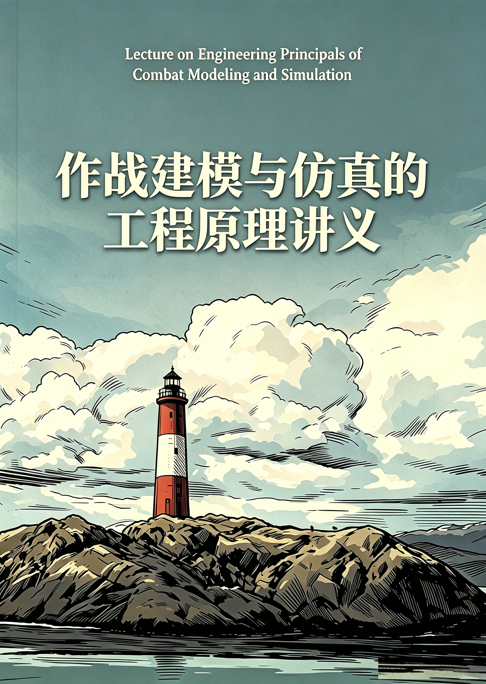

# 前言

## Preface

这不是一本新书。这是一个课程讲义，一个作战建模与仿真技术的入门指南。编者阅读了60多本相关专业参考书和大量资料，梳理作战建模与仿真技术的知识体系，摘抄相关内容，花了三个月时间，完成了这本讲义。目的是用于研究生课程和培训，希望能够指导研究生的学习和培养，使人知道从事相关工作需要掌握哪些知识点。

作战建模与仿真（M&S）是典型的交叉学科，涉及的知识内容范围很广，高校没有这样一个专业。除了系统仿真学科本身的基本知识，还融入计算机科学、软件工程、计算机网络、系统工程、自动控制、图形图像、多媒体、虚拟现实、人工智能、运筹学和工程管理等众多学科的新方法、新技术。同时，还需要具备一定的军事理论知识，并结合作战系统和装备研制工程实践。后续将编制《作战系统的体系工程原理讲义》配合使用。

因此，讲义的内容不可能面面俱到，而是偏重讲概念、讲原理，力图讲清楚"是什么""为什么"，至于"怎么做"仍需要更专业书籍的支撑学习，从而形成完整的知识体系，并在实践中锻炼。

本讲义作为内部学习资料，全文十五章，30余万字，其中80%的内容来自其他书籍摘抄（每章列有参考书目）。除摘抄内容外，原创部分采用CC
BY
4.0协议授权。使用时请注明出处。书籍摘抄部分的版权归原作者所有。在此向原著作者致以诚挚谢意。

编者

2025年7月

## Changes

**修订历史：**    
2025-7-7 初稿。文件制作10份。 

2026-5-10 部分修订补充。文件制作10份。 

2026-9-10 添加版权声明。测试在线发布，docx -- Pandoc -- markdown chapter-xx.md -- mdBook -- Git Pages

## Copyright

**版权声明：** 

本教程的原创部分（包括结构编排、图表分析、原创评述文字）由 [董晓明](mailto:phdlynx@126.com)创作，采用CC BY 4.0协议授权，使用时请注明出处。

**特别说明：** 

本教程中引用的图书 \[每章列出书目\]  
的原文摘抄内容，其版权归原书作者所有，仅供学习交流使用。请使用者引用时务必遵守原著作权的相关法律规定。

**封面图片：**

阿根廷 火地岛 乌斯怀亚灯塔，《春光乍泄》电影场景，豆包AI生成。

## URL

已部署GitHub Pages，访问下列链接在线阅读: 

https://phdnext.github.io/lecture-on-combat-modeling-and-simulation/

## Contents

[第 1 章 建模与仿真概论](src/chapter-01.md)

[第 2 章 军用建模仿真领域发展综述](src/chapter-02.md)

[第 3 章 作战建模与模型体系](src/chapter-03.md)

[第 4 章 体系结构框架DoDAF](src/chapter-04.md)

[第 5 章 基于模型系统工程与SysML](src/chapter-05.md)

[第 6 章 分布式仿真与互操作](src/chapter-06.md)

[第 7 章 作战想定与作战概念设计](src/chapter-07.md)

[第 8 章 数字孪生与军用仿真](src/chapter-08.md)

[第 9 章 兵棋与智能博弈](src/chapter-09.md)

[第 10 章 试验训练LVC仿真技术](src/chapter-10.md)

[第 11 章 仿真数据分析与评估](src/chapter-11.md)

[第 12 章 视景仿真与战场可视化](src/chapter-12.md)

[第 13 章 典型作战仿真系统](src/chapter-13.md)

[第 14 章 实战：基于HLA的仿真开发](src/chapter-14.md)

[第 15 章 实战：Command 仿真推演](src/chapter-15.md)