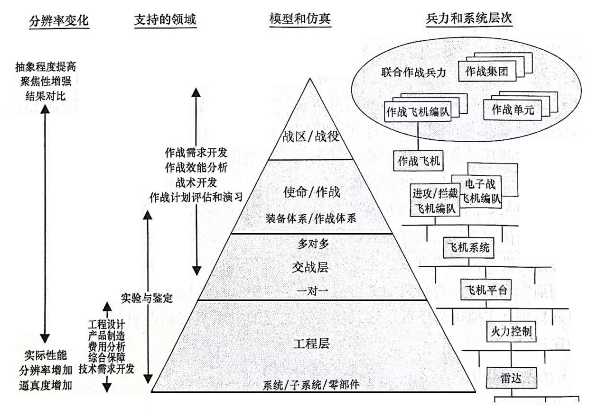
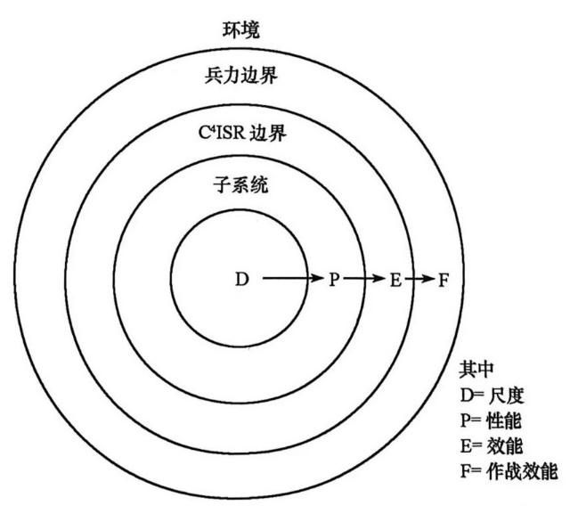

# 建模与仿真概论

【摘要】介绍系统仿真、模型、作战建模与分布式仿真等相关概念，阐明仿真学科和作战仿真领域的知识体系构成，主要包括作战仿真基本概念、作战仿真建模方法、分布式仿真、体系结构框架、基于模型系统工程、指挥控制建模、战场环境仿真、兵棋推演、作战仿真结果分析、战场可视化、典型作战仿真系统等，并给出部分常见术语定义。

【关键词】建模与仿真，系统仿真，模型，作战模拟，知识体系

【参考书目】

▲\[美\]Andreas
Tolk主编，郭齐胜，徐享忠等译，作战建模与分布式仿真的工程原理，国防工业出版社，2016.1

黄炎焱，系统建模仿真技术与应用，国防工业出版社，2016.12

贾连兴，谈园 等，系统仿真与作战模拟，国防工业出版社，2024.2

彭鹏菲，龚立，军事系统建模与仿真，国防工业出版社，2016.1

徐学文，王寿云，现代作战模拟，科学出版社，2001

张野鹏，作战模拟基础，高等教育出版社，2004.9

张野鹏，军事运筹基础，高等教育出版社，2006.6

黄柯棣，邱晓刚 等，建模与仿真技术，国防科技大学出版社，2011.2

李群，雷永林，李小波等，系统仿真原理，国防科技大学出版社，2024.12

------------------------------------------------------------------------

## 系统仿真

### 基本概念

顾名思义，系统仿真就是模仿分析待研究的真实系统的行为与特点的活动。事实上，"仿真"一词源自于英文simulation和emulation，前者意为模拟，后者意为仿真，因为两者差别细微，目前习惯采用simulation来表示仿真。仿真的定义有多种，雷诺（T.
H.
Naylor）在1966年定义仿真为："仿真是在数字计算机上进行实验的数字化技术。"加拿大著名的Tuncer
OREN
教授给出最简单的仿真定义为："仿真是一种基于模型的活动。"其认为仿真的关键在于建模，仿真就是利用模型来做实验。

系统仿真的定义较多，但目前国内外使用比较广泛的仿真定义为：仿真是建立所研究系统的模型（Model），并在该模型上进行实验，即采用模型来再现真实系统的情况。

随着计算机技术的发展，出现了计算机仿真的概念，可套用上述定义，计算机仿真即借助计算机建立系统模型并再现真实系统的情况。通常表现为，在计算机上，按一定的实验方案，通过一定的调度方法来展开系统模型以获得系统的（动态）行为，进而研究系统的过程。当然，除了计算机仿真，还有兵棋推演，是利用兵棋工具来再现真实系统的情况。后面我们讨论的仿真，除非特殊指出，均指计算机仿真。

理解了系统仿真的基本含义后，可以知道系统仿真作为一种手段，可用于再现真实复杂系统的情况。在数十年科研手段及论证方法中，人们热衷于采用系统仿真技术进行研究，探究原因，主要是因为系统仿真具有独特的优势及重要的作用。在认识及实践活动的手段中，曾先后采用了两种不同的基本手段，如试验研究、理论研究。系统仿真已经提升为人类认识和改造世界的第三种手段。

### 系统仿真三要素

从仿真的定义可以看出，系统仿真包括三个基本要素，分别是系统、模型及计算机。首先，我们要模拟的对象是真实世界的系统，其应该是一个有边界的复杂的客观对象；第二要素是模型，它是真实系统的替代品，是对真实系统系统的特征抽取与简化；第三要素是计算机，简化的模型需要借助计算机语言来刻面表达。为此，从真实系统抽取系统建模仿真实验特征进而获得模型的过程称为系统建模；由模型翻译成仿真建模计算机可以处理指令过程称为仿真建模；而借助计算机模型计算机实验条件下，再现真实系统的行为情況称为仿真实验。

系统、模型、计算机称为仿真三要素。

#### 系统

仿真的第一个要素是系统（System）。系统的定义为：由相互作用和相互依赖的若干部分组成的具有特定功能的有机整体。通常，系统组分是在物理或逻辑上可相对独立的单元。其实，系统可以叠加，大系统往往包含小一级的系统。

系统按研究对象可分为工程系统、自然系统和社会系统，如武器装备系统、生物遗传基因演化系统，有人参与的生产、消费、交换及积累的社会系统等。

#### 模型

系统仿真的第二个要素是模型（Model）。

1\. 什么是模型

系统模型是研究和掌握军事系统运动规律的有利工具，它是认识、分析、设计、预测、控制实际系统的基础，也是解决系统工程问题不可缺少的技术手段。建立有效且可靠的系统模型是系统研究者的首要任务。数学模型是系统模型最主要和最常用的表示方式。

模型是描述与说明研究对象实体的一种表示形式；是对客观事物的简化和抽象；是理解和反映客观事物形态、结构和属性的一种形式；是对实际系统、实体、现象或过程的一种物理、数学或其他方式的逻辑表达，是真实系统的替代品。例如，沙盘、态势图、方程式、程序框图等都是模型。

计算机仿真模型是采用数学、逻辑或其他抽象的方法进行描达，再用计算机语言加以实现的模型。通常的仿真模型均为计算机仿真模型。

2\. 模型的基本性质

模型具有如下基本性质：

（1）相似性，即模型与所对应的系统必须具有相似的特性和规律（如几何、感觉、逻辑上的相似）。模型往往满足相似定理包括的自反性、对称性、传递性等重要特性。

（2）简化性，即模型是对原系统的近似表达。可以说，真实系统的真值为
1，模型的真实性只能无限逼近原系统，但不能轻易达到。

（3）多样性，即同一系统的模型表示形式并不唯一。有些模型采用解析式，有些模型采用流程图表达。

3\. 模型的分类

模型作为真实世界中的物体或过程的相关信息进行形式化的结果，可根据领域背景、研究对象、建模过程等多种角度对模型进行分类。如根据领域划分，应用于军事领域的模型，可统称为作战模型；根据研究对象不同，模型可分为实体模型和过程模型。具体到特定实体和过程，可予以进一步细分，如针对海上作战，实体模型有水面舰艇模型、潜艇模型和航空兵模型等，过程模型通常则有算法模型（研究对象为问题求解的过程）、决策分析模型（研究对象是某一个决策过程）、业务逻辑模型（研究对象为特定组织的指挥信息关系、实施方法或操作规程）和效能评估模型（研究对象为效能评估的规程）等。根据建模过程阶段不同，模型具有不同的形态，对作战模型而言，根据其研制过程各阶段的工件特点，可分为军事概念模型、计算机仿真模型等。另外，模型还有其他分类方法，如根据建模方法的不同，可分为排队论模型、概率论模型和马尔科夫模型等；根据模型与研究对象的相似程度，可分为白盒模型、黑盒模型和灰盒模型等。

总之，根据应用领域背景、研究对象、模型描述方法及建模过程阶段等不同，不同领域及专业人员根据其需要，对模型的概念及分类都有其自己的认识，并无统一的分类标准。

根据系统涉及的时间集合的特点，可将模型分为两类：

（1）连续时间模型。模型的系统状态随时间连续变化或不变，且在任意连续时刻皆可获得系统状态的变量值。

（2）离散时间模型。系统状态随时间连续变化或不变，但只能随机地在离散时间点上获取系统状态变量值。

许多仿真系统属于离散事件系统，并且离散事件系统不易采用像连续系统那样的数学解析形式进行描述。研究表明，采用形式化描述的方法较为有效，也具有一般性。形式化建模主要采用集合论及形式化描述的方式进行系统的建模。美国亚利桑那大学B.
P. Zeigler 教授提出的经典DEVS（Discrete Event System
Specification）和耦合的 DEVS
描述规范，不但应用于对离散事件系统的建模研究，还扩展到连续系统仿真建模中。该采用DEVS
描述规范的系统仿真的理论具有较强的理论价值，可有力地指导系统建模与仿真。

当然，还有其他的仿真理论方法，例如面向多智能体仿真的 Multi-agent
理论等。

4\. 建模

建模是对所要仿真的系统特征进行抽象提取的过程，也就是利用模型来代替系统原型的抽象化（形式化）的过程。这种抽象的过程需要经过一定程度的简化并依赖于部分假设。

建模依据的是相似原理，如几何比例相似性、特性比例相似性、感觉相似性、逻辑相似性、过程相似性、功能相似性等。显然，只有相似才可模拟，然而确定是否"相似"取决于所要研究的问题，这里存在一个根据研究的目的对所有特性进行取舍和抽取的过程。

建模活动是具有特殊形式的人与外界的相互作用，它是由两个不同的步骤所组成：其一是模型的建立或形式化（注重模型简化），产生出一个真实世界系统的模型，它是人类通过建立一种抽象的表示方法以获得对自然现象的充分理解；其二是对形式化模型进行分析与利用，以便掌握如何按照人类的意志对现实系统进行控制。

#### 计算机及试验平台

仿真的第三个要素是计算机平台。建立了系统模型，需要将模型描述解释为便于计算机识别的仿真模型，进而可以在实验设计的条件下，借助计算机的智能计算再现真实系统的情况。

可以认为，计算机仿真技术是：以建模仿真理论、计算机技术和信息技术以及相关应用领域知识为基础，以计算机及相关信息技术设备为工具，利用数学模型或部分实物模型，对实际或设想的系统进行动态试验和分析的一门综合性技术。

### 系统仿真的分类

系统仿真能具有如此多的强大的综合分析功能，主要因为系统仿真技术不仅具有较大的共性，同时还具有较强的针对不同的领域的仿真能力及特性。可以将系统仿真分类为不同的类型。

#### 连续系统/离散事件系统

仿真基于模型，模型的特性直接影响着仿真的实现。从仿真实现的角度看，系统模型的特性可以分为如下两大类：

1）连续系统仿真

连续系统（Continuous
System）是指系统状态随者时间连续变化的系统。连续系统的模型按其数学描述可分为：①集中参数系统模型，一般以常微分方程（组）描达，如各种电路系统、机械动力学系统、生态系统等；②分布参数系统模型，一般用偏微分方程组描述，如各种物理和工程领域内的"场"问题。注意的是，离散时间变化模型中的差分模型可以归为连续系统仿真范畴。原因在于，当用数字仿真技术对连续系统仿真时，其原有的连续形式的模型必须进行离散化处理，并最终也变成差分模型。

2）离散事件系统仿真

离散事件系统（Discrete Event
System）是指系统状态在随机时间点上发生离散变化的系统，它与连续系统的主要区别在于状态变化发生在随机时间点上。这种引起状态变化的行为称为"事件"，即随机事件，因为一般的离散事件系统具有随机特性，系统的状态变量往往是离散变化的。例如火车站排队售票系统，事件有旅客"到达""开始购票""购票完毕离开"等，描述系统状态可以用售票员的"忙""闲"来描述。

系统的动态特性很难用人们所熟悉的数学方程形式如微分方程或差分方程加以描述，而一般只能借助活动图或流程图，这样，无法得到系统动态过程的解析表达。对这类系统的研究与分析的主要目标是系统行为的统计性能而不是行为的点轨迹。

前者是状态随着时间连续变化的系统仿真；后者是状态在随机时间点上发生离散变化的仿真。目前军用和武器装备系统论证及系统工程方面的仿真大多以离散事件系统仿真为主。

混合系统仿真，这是前两者的结合，用于具有连续分系统及离散事件分系统同时存在的复杂大系统。例如防空系统作战对抗仿真系统，防空导弹拦截敌机的弹道解算采用连续系统仿真的方法，而在防空系统的作战过程仿真正是一个以防空阵地为服务台，敌方飞机为顾客，按照某随机分布到达的，先来先服务，其他默认的排队系统，这正是离散事件系统仿真。

#### 物理仿真/数学仿真

根据仿真所用的模型性质分类，包括物理仿真和数学仿真。

1）物理仿真 (Physical)

也叫实物模拟，比如按比例缩小的建筑物实物模型；物理仿真优点是直观形象、逼真，但仿真付出的耗费较大。

2）数学仿真 (Mathematical)

数学仿真，全部由数学模型代替如线性系统的微分方程模型的仿真，其特点是经济方便、灵活，但建模较为耗时。

#### 实况/虚拟/构造（LVC）

按照分布交互仿真中虚实结合的程序分类，可以分为实况仿真（L）、虚拟仿真（V）和构造仿真（C）。

1）构造仿真 (Constructive Simulation)

包括模型、模拟军事演习、分析工具等仿真，如含计算机生成兵力（Computer
Generated Force,
CGF）等具有一定自主行为的数字仿真。分布交互仿真的要素有仿真角色（如人）、仿真装备工具及仿真环境。简而言之，构造仿真时虚拟的人操作虚拟的装备的仿真。

2）虚拟仿真 (Virtual Simulation)

就是包含人在回路的仿真，人是真实的人，装备是虚拟的装备，人操作虚拟的装备的仿真叫虚拟仿真，通常用于模拟训练。

3）实况仿真 (Live Simulation)

就是真实的人操作真实的装备的仿真，包括各种可操作平台、仪器和真实武器装备的仿真。

另外，根据模型的表现形式分类，主要包括数值仿真和可视化仿真。

## 作战模拟

军事是仿真技术的重要应用领域，也是推动现代仿真技术快速发展的主要领域。人类运用仿真手段研究军事问题的历史源远流长，随着战争要素越来越多、兵力结构越来越复杂、节奏越来越快，仿真在军事领域的应用越来越广泛。特别是近几十年来，相关信息技术持续高速发展，使得计算机仿真技术日益丰富、日趋成熟，逐步成为了研究军事问题的主要手段之一。

美国国防部 I-02
联合出版物定义作战仿真："是对在实际的或假想的环境下，按照设计的规则、数据和过程行动的两支或多支部队进行对抗的仿真。"作战仿真可用于对作战方案、作战行动和作战计划，或武器装备效能等进行分析、推演、论证和评估，对人员进行模拟训练。20
世纪 60
年代以来，由于军事运筹学、系统工程理论以及计算机等现代信息技术的不断发展，使得作战仿真进入了以人机结合、定量与定性相结合为目标的计算机作战仿真新阶段，应用遍及军事领域的各个方面。作战仿真之所以能得到迅猛发展，与其应用中取得良好效益是分不开的。美军在海湾战争中成功地在各级指挥及战斗任务中应用了计算机作战仿真，并把它看作是"革命性的进步之一"，是"军队和经费的倍增器"，是"五角大楼处理事务的核心方法的一种战略性技术"，因而从各方面加强对计算机作战仿真的支持和管理。

作战仿真通常是离散事件驱动的过程仿真，仿真粒度到平台级是连续离散混合系统仿真。作战仿真属于社会系统仿真，是复杂系统仿真。它的特点是：自然科学与社会科学相结合；个人智慧与集体智慧相结合；定性分析与定量分析相结合。正是由于这些特点，仿真系统建设不是简单的技术问题，而必须是军事领域专家和技术专家无缝集成。作战仿真是军事领域仿真的一种基本模式。

### 作战模拟的概念

作战模拟的概念内涵，除了包含早期的作战模拟（仍旧在部队指挥所和军事演习中广泛使用）之外，还包括计算机仿真（Computer
Simulation）、对抗模拟或兵棋（War
Gaming）以及综合了实验和演习、计算机和网络技术的分布交互式作战模拟（Distributed
Interactive Simulation of
Combat）。其应用范围，也从对作战结果的预测与判定，作战过程的推演与评价扩展到了从一个军事行为的策划到实施的终了；从一种军事系统初始概念的讨论到系统的退役的全过程。

美国国防部在建模和仿真主计划（Modeling and Simulation Master Plan,
MSMP）中，将模拟划分为两个部分：建模（Modeling）是指建立系统的一种表达，而仿真（Simulation）则指运行和演练这种表达。但也指出这两个词本身可以互换使用。美国国防部给模型的定义为：对一个系统、实体、现象和过程的物理的数学的或其他合乎逻辑的表现。给仿真的定义为：在时间上实现一个模型的方法。

国内有学者用"作战模拟"一词来专指可以用于研究战争过程和战术战法、分析军事局势和策略、论证武器装备的效能及其运用的一种技术，该技术通过建立现实军事系统的模型（规则或过程），并通过程序将人员、仿真装备、传感设备、计算机和通讯设备连接在一起，实现或演练该模型，从中研究系统特性和行为。

作战模拟是指使用一种或同时使用多种手段，对包括两支或多支对抗力量的军事冲突，按照事先给定的规则或程序进行的演练。这种手段可以是图表、沙盘、模拟装备、传感设备、通讯设备、计算机、作战演习、图上作业、数学或逻辑推演等。

作为对实际军事系统的模拟，建模和仿真是作战模拟的两个不可或缺的部分。模型是对实际系统、实体、现象或过程的一种物理的、数学的或其他方式的逻辑表达。而仿真就是在时间上实现模型的一种方法。作战模拟的建模，就是使用物理仿真或数学抽象的方法，结合文字、图像、声音或其他可用的现代技术手段来表达实际军事系统，以便人们能对之加以分析和研究。

由于战争涉及广泛的政治、军事、经济、文化、种族等社会因素，是一个不可重复的复杂系统，人们难以用公式化的方法去表达和分析。作战模拟就成为研究战争的惟一有效的手段。从本质上看，战争是参战各方的决策过程，因此作战模拟代表着对军事决策方法的形式化（正规化）和定量化。

### 作战模拟的特点与组成

各种形式的作战模拟具有的共同特点是：①任何一种作战模拟都是对军事行动的模拟；②有两支或两支以上对抗力量卷入所模拟的军事行动；③对军事行动的模拟，按照与军事技术和军事经验相符合的数据、规则和程序进行；④所要模拟的军事局势，是事实上已经存在或者是在一定条件下可能存在的局势。

作战模拟的另一个特征是采用同一计时系统。时间在军事行动中是重要因素。军事行动是随着时间向前发展的。如实战一样，战斗间隔的次数是有限的。在这个间隔中，指挥员考虑下一着行动，而裁判则对以前的行动作出评价和判断。不像象棋游戏，作战模拟不允许敌手轮流交替地采取行动，而是如实战一样，连续地采取行动序列。

按照习惯，作战模拟中的对抗力量，一方指定为蓝方，另一方为红方。每一方可代表一个国家或多国联盟的军事力量。

美军根据不同的应用需求建立了战略级、战区/战役区、任务级、交战级和工程级等多个层次的作战仿真系统。

作战模拟有四个基本组成：①人员；②设备；③规则；④脚本（或想定）。

**1．人员**

参加作战模拟的人员有：管理人员，局中人即对阵各方，科研人员，辅助人员。

管理人员包括导演、裁判和控制人员，导演是整个管理工作的领导。管理人员的作用，相当于体育比赛的主持人和裁判员。作战模拟的导演必须具有较强的军事指挥能力，熟悉模拟过程所涉及的军事单位和武器情况，掌握作战模拟的技术组成和要求。

扮演蓝、红两军的局中人，分别称为蓝军人员和红军人员。在复杂的作战模拟中，代表蓝、红两军的可以有多个局中人，分别担任不同的角色，如各级地面部队司令官，海、空军部队司令官，后勤参谋，情报参谋，实际参战人员等。

科研人员是整个作战模拟工作的核心。他们的主要工作是收集数据，模型设计，配置计算机和网络环境，在给定的条件下进行软件系统的设计、开发和调试。要求具有军事运筹学数学、统计学、计算机、通讯和有关领域的知识，并有作战模型开发的技能。

**2．设备**

在早期的封闭式作战模拟中，交战双方指挥官有各自的指挥中心即作战室。作战区域的模型在作战室展开，显示军队部署情况以及所能获得的情报。通常，裁判和控制人员有一个单独的控制室，在这里显示双方力量部署和战斗情况。传统的用作作战室和控制室的是三个连通的屋子，屋子之间有联系通道，每个屋内装有显示板，以显示军事力量的配置冲突情况。显示板一般是一个大桌子，上面可以钉地图，或者放置模型。有些作战模型宜于用垂直显示板。

设备是指作战模拟的基本工具，简单的可以是地图、沙盘等。现代作战模拟，必须有一套联网的计算机硬件设备。在包含实兵模拟的作战模拟系统中，真实的武器装备也成为模拟的设备。

计算机和网络设备可以把世界上任何地方的作战室和控制室联系在一起，使得模拟大规模多层次的军事行动成为可能。计算机和网络设备已成为现代作战模拟的主要装备。

**3．规则**

作战模拟以合乎实际可能的军事力量为基础，利用武器系统和装备的性能规格、部队的机动能力以及来自演习和实战（历史上的战争）的数据，对军事行动的效果进行评价。

规则是在作战模拟中按实战条件给交战各方部队军事行动的限制和约束。在现代作战模拟中，这些规则和图表以数据库或计算机程序的形式存储，并在适当的时候通过人机交互的方式展示给局中人。

**4．脚本（或想定）**

想定（或脚本，scenarios）是作战模拟中对作战环境和作战过程的详尽描述，是在特定背景下进行作战模拟的故事情节，是作战模拟的蓝图和指南。军事常识，作战条令和武器装备知识是编写想定的基础。

### 相关基本概念

一个与时间相关的系统称为动态系统。组成动态系统的要素称为实体（Entity）（如武器、目标等）。实体的特性称为属性（Attribute），每实体都用属性来描述。实体间的相互作用使系统发生变化，使系统发生变化的过程或行为，称为活动（Activity）。系统在运动的过程中，任一时间点上系统的全部实体、属性和活动的瞬间表象，称为系统的状态（State），在模拟开始时刻的状态称为初始状态（Initial
State）。状态的计算机表示，包括记录状态的数值、因像等，称为系统的一个映像（Image）。引起映像变化的因素，称为事件（Event）。事件出现的时间点，称为事件点（Break
Point）。在模拟的过程中，有时会同时发生两个事件（如坦克的机动和受伤），这样的事件，称为并发事件（Concurrent
Events）。

模拟过程的推进，可以采用时间步长法、事件序列法或主导实体时钟值扫描法。

### 模型的定量化途径

由于数学模型在描述自然现象方面的成功，应用这一方法来研究战争就成为一种自然的选择。构造表达作战过程的数学模型，需要定量描述武器的效能、偶然因素的影响、策略运用是否得当以及其他可变因素对作战过程的效应。现代科学为此发展
4种可能途径。

1．半经验半理论的定量途径

半经验半理论的定量途径是一种以猜想的数学表达式为基础的描述方法，其代表是兰切斯特方程。20
世纪初，英国人兰切斯特最早提出了用兰切斯特方程法来描述作战过程。

1914
年，英国科学家兰切斯特在分析了作战双方兵力和火力优势与战斗胜负之间的关系之后，提出了一种描述作战过程的解析模型------兰切斯特方程。这种方法把作战过程理想化为一个确定性过程，并用微分方程（组）的形式予以表示，它在反映影响作战过程决定性因素之间的相互关系上有重要价值。

兰切斯特在军事经验和观察的基础上，以解析的形式提出的这种假设，是用来说明作战过程中的主要变量是如何结合起来对作战过程产生影响的，以及作战单位的数量与质量间的相互关系等。然后从这一假设出发，经过严格的理论推导，得出种种说明作战过程发展规律的结论，如果这些结论能为实际战例所证实，那么所做的假设就可作为建立作战过程数学模型的出发点。这种方法被称为半经验半理论方法。

尽管今天所使用的解析模型与当初兰切斯特所提出的模型相比已有了很大的发展和不同，但人们仍把这类解析模型称为兰切斯特方程。兰切斯特方程是用确定性模型描述作战过程的标准方法。在师、团战术模型中使用较多。

2．统计实验的定量途径

统计实验的定量途径是一种建立在用随机数来模拟随机因素基础上的描述方法，其代表是蒙特卡罗法。1950
年，美国人约翰逊最早提出了用蒙特卡罗法来描述作战过程。

蒙特卡罗法是一种通过建立随机性模拟模型来研究作战过程的方法，是一种统计实验的定量方法，也称为统计试验法。

蒙特卡罗法是用随机数来模拟作战过程中的随机因素，从数值上产生描述作战过程信息的概率分布。蒙特卡罗法的精度依赖于试验次数，只要有足够的机时，其误差可以做到尽可能的小。由于蒙特卡罗法应用起来相当简单，并能充分体现随机因素对作战过程的影响和作用，能更确切的反映出作战活动的动态过程，它已成为最有价值的作战模拟手段之一。多年来，蒙特卡罗法作战模拟已取得了极大的成功。

蒙特卡罗法是用随机性模型描述作战过程的标准方法。蒙特卡罗法多用于规模较小的分队战术模型。

3．经验的定量途径

经验的定量途径是一种建立在武器杀伤能力统计比较基础上的描述方法，其代表是指数法。美国人杜派最早提出了用指数法来描述作战过程。

60年代中期，美国陆军退休上校杜派和他的同事，根据对 1600 年到1973
年间所发生的 601
次战争资料的分析，提出了一种战斗效能的定量评估方法，称之为战斗力指数法或杜派指数法。

这种方法是对历史上不同武器的性能和杀伤能力进行统计比较，分等定级，以特定的数值表达，然后通过一个检验、调整、再检验、再调整的过程，把它们结合成为武器战场效能的计量尺度，最后再考虑士气、指挥、训练、合作精神等因素对这个尺度的影响并予以修正，直到用这个计量尺度对各个战例定量描述的结果能与实际情况相符合为止，这就是火力指数。杜派指数法是一种经验的定量描述方法。

杜派指数法还能反映一些不易量化的因素在作战过程中的效应，是描述大规模作战过程的快速而理想的方法。杜派指数法多用于师以上的战役或战略模型。

4．严格的定量途径

严格的定量途径是一种建立在用严格的数学推导来选择作战策略的描述方法，其代表是对策论。

## 作战建模

在军事上用来研究以作战为目的的模型称为作战模型，作战模型就是作战过程的抽象，是作战过程的一种物理、数学或其他方式的逻辑表达。

作战建模对作战实体、行为、活动和相互关系进行针对性的抽象和简化，以回答与国防有关的科研问题。仿真工程师理解的作战，一般由环境、机动、观察战场、交战以及指挥控制通信组成。

（1）环境建模。所有被建模的作战实体都位于特定的环境中（虚拟战场或作战空间）。作战实体对包括其他实体在内的环境进行感知，并基于自身知识和目标把感知映射为一种内部表示。它们与其他实体进行沟通并采取行动。环境包括了所有的对象，即被动对象（如障碍物）和主动对象。因此，环境的建模与实体及其核心过程的建模同等重要。所仿真的核心过程的行为甚至受制于所采用的环境模型。

（2）机动建模，涉及单个武器系统机动的实体模型，以及用于多个武器系统机动的聚合模型。由于云层和雷雨能影响飞机的飞行路线，水流能限制水上、水下机动，因此，环境建模不仅仅与陆基系统具有紧密的联系。该建模使用了地块和网格；对武器系统使用了物理模型，为分队机动使用了参考模式。

（3）传感器建模，它回答这样的问题：如何在战场上观察？鉴于新技术进步以及新型军事行动，这一过程的描述增多了。这些新型军事行动甚至包括诸如信息战（夺取和保持信息优势的作战），或在这种背景下更重要的信息优势（比敌人掌握更多的信息）。获取并确保态势感知------知道战场上什么在发生以及战局如何发展------成为现代作战的一项主要功能。不同类型的传感器，如声学、化学、电磁学、热学和光学传感器，有助于尽可能接近现实地感知环境以及其他实体。情报、监视和侦察行动有类似的要求。此外，如果一个细节对于军事决策过程很重要，它就需要成为感知的一部分，因此需要通过传感器来观察，这要求作为独立的实体属性来建模。

（4）效果的建模。战场结果不再仅限于损耗，但建模的武器系统和作战单元之间决斗的结果仍然是一个主要关心的话题。毕竟，打击敌军部队是训练部队、制造武器最主要的任务。对于武器系统级，分析了直瞄和间瞄火力。直瞄火力意味着射手和目标之间直线距离描述子弹是怎样飞的。火炮系统和其他弹道武器不需要瞄准目标直线射击它。它们的武器遵循间瞄火力所描述的弹道曲线。毁伤等级被用来描述打击的效果：可以是完全摧毁或者几乎没有效果，这取决于谁是射击者以及是谁是目标。还涉及著名的兰彻斯特作战模型，以微分方程的形式描述了集合分队的损耗。

（5）指挥控制和通信的建模。由于指挥控制位于环境当中，并命令实体射击、机动、观察和通信，所以它把其他所有模型联系在一起。由于越来越多的仿真模型必须基于可用的信息进行决策，该领域直到最近都必须由人类决策者参与。指挥控制模型建得越好，逼真的训练环境要求提供的军事专家就会越少。此外，只有当同伴和对手的行为表现得很逼真时，产生的仿真系统才能在实际行动中运用，才能支持候选方案的评估。

## 分布式仿真

20世纪80年代中期，美国国防部（DoD）提出了先进分布式仿真（Advanced
Distributed
Simulation）技术的概念。1978年，美国某空军基地的空军上尉提出了联网仿真的思想，首次系统地描述了联网仿真技术的功能及要求，希望使受训人员在分布虚拟战场环境中分辨不出训练系统和真实系统。虽然当时联网仿真所需的技术还未成熟，但美国国防部接受了此思想。

1983年，美国国防部高级研究计划局（DARPA）制定了一项称为SIMNET的计划，希望将各军兵种、单兵使用的仿真器连接到网络上，形成一个共享的仿真环境，进行各种复杂任务的综合训练。

在SIMNET的基础上，美国军方与工业界进一步发展了异构型网络互联的分布交互仿真技术（DIS），其目的是将不同时期的仿真技术、不同厂家的仿真产品和不同用途的仿真平台集成在一起，实现交互功能。DIS是技术的标准化和扩展，它由一系列的应用协议与通信服务标准、推荐的演练策略和相关文档来确保互操作能力。标准和协议的核心是建立一个通用的数据交换环境，通过协议数据单元（PDU）的使用支持异地分布的真实、虚拟和构造（LVC）的平台级仿真之间的互操作。DIS技术推出后，很快应用于美军的仿真系统研发，如美国海军的作战部队战术训练系统（BFTT），空军的联合建模仿真系统（JMASS）等。

在DIS发展的同时，DARPA
发起了一个聚合级分布式作战仿真的实验，随后委托MITRE公司对实验进行分析研究。MITRE公司对照SIMNET对实验进行了技术分析，提出了聚合级仿真协议（ALSP）。ALSP的目标是使现有的多个聚合级作战仿真应用可以通过局域网或广域网相互交互。在概念上，每个仿真控制自身对象，并且共享有关其自身与其它仿真的信息。SIMNET、DIS、ALSP
都是同类功能的仿真应用武器平台、模拟仿真器、计算机生成兵力、聚合级仿真模型互联，只有有限的互操作性，不能满足越来越复杂的作战仿真需求。为此，美国国防部1995年发布建模与仿真主计划（MSMP），决定建立一个通用的仿真技术框架以保证国防部范围内的各种仿真应用之间的互操作性，其技术框架的核心是高层体系结构（HLA）。HLA在1996年8月完成了基础定义，随后被北约各国采纳，于2000年9月被正式接受为标准。

随着因特网/Web技术的发展，2000年以后，建模仿真与网络技术进一步结合，推动形成了可扩展建模与仿真框架（XMSF），采用基于Web的技术作为共享的通信平台和传输框架，增加M&S的功能，其核心是开放的标准和资源，提高分布式仿真系统的效能和可用性。

分布式仿真技术主要解决两个问题：一是使大规模复杂系统的仿真成为可能；二是降低费用，即考虑经济的因素。当前世界各国都把经济建设放在更加突出的地位，研制和生产国防产品时更多地考虑经济承受能力。因此，国防科技的发展不但强调产品的先进性还要注重产品的经济承受能力。分布式仿真技术发展中受经济因素的影响体现在两个方面：一方面是要求仿真能降低武器发展和军事训练的费用，这是由仿真技术固有的特点产生的；另一方面要求仿真系统研制本身的费用降低。此外，缩短复杂大系统仿真的时间、降低复杂大系统对人员素质的要求，提高仿真结果的可信性，减少人员投入以及降低管理的难度和成本等也是分布式仿真技术要解决的问题，但这些问题可以认为包含在上面两个主要问题中。

解决这些问题的思路集中在重用与互操作上，因此分布式仿真技术的主要工作是发展和确保仿真中的各种重用和互操作技术。基于此，美国国防部MSMP提出了6个目标：

- 为建模与仿真提供共同的技术构架；

- 提供自然环境的及时、权威的描述；

- 建立系统的权威描述；

- 人的行为的权威描述；

- 提供建模与仿真的基础设施，以满足开发者和最终用户的需要；

- 推广建模与仿真，共享建模与仿真效益。

## 知识体系

### 仿真学科

仿真学科正在进入一个新的发展时代，必须加速完善自身研究。仿真学科知识体系的完善，对于仿真学科的发展、仿真学科专业人才培养以及仿真科技竞争能力的提高均显得十分迫切。

仿真学科知识是科技人员从事仿真研究形成的知识集合，也是人们进行仿真活动所需要的知识集合，是一个由仿真学科的概念、判断、推理组成的相互联系的逻辑体系，是对仿真学科知识内容的系统化组织，反映了仿真学科知识的结构。

仿真学科知识体系可为仿真学科提供全面、整体的认识，是建模仿真成熟为一个专业的标志。仿真学科涉及的知识内容范围极广，除了仿真本学科本身的基本知识，还包括数学、系统工程、系统科学、控制科学与工程、计算机科学与工程、人工智能、管理科学、项目管理、质量管理等方面知识。仿真学科知识体系的构建，对于建模仿真的发展和应用具有重要意义。

由于大学院系和认证机构的不同要求，仿真知识体系随着建模仿真与训练在美国多所大学的本科生和研究生课程的增长而拓展。近年来，美国国家训练与仿真协会在一些活动中，努力推动仿真团体共同发展建模仿真的知识体系。

在我国的高等教育学科体系中，仿真是控制科学与工程（一级学科，代码811）下设的二级学科"建模仿真理论与技术"。

目前，仿真学科知识主要有5
种分类方式：一是按仿真活动生命期诸阶段可分为仿真准备阶段的仿真系统与仿真建模知识、仿真应用阶段的仿真实验和仿真结果分析知识；二是按仿真的应用领域可分为管理仿真知识、作战仿真知识、航天仿真知识等；三是按知识层次分类，根据知识形态的科学、技术、工程三元论构架，将仿真知识体系分为科学、技术和工程三个层面；四是按主次分类，分为仿真基本知识、领域仿真知识、相关学科知识领域；五是按知识工程的角度，针对仿真教学的需要，将仿真学科知识分为若干知识领域，其中的知识领域可分解为几个知识单元，而每个知识单元又可以分为若干个知识点。

仿真学科相对成熟的共性基础知识领域有22个，包括：仿真基本概念和基础知识，相似理论，仿真方法论，DEVS，仿真模型理论，仿真建模方法，连续系统仿真，离散事件仿真，随机系统仿真，定性仿真，面向对象仿真，系统动力学方法，并行与分布式仿真，实时与半实物仿真，VV&A与可信度评估，仿真系统，仿真软件，仿真计算机，仿真可视化，仿真实验设计，仿真结果分析，领域仿真应用工程。

仿真学科与时俱进，具有很强的时代性。仿真学科以信息学科为基础，与信息技术同步发展。自电子计算机于1946年出现以来，仿真学科随着需求牵引和信息技术的推动而发展。仿真科学技术活力的一个来源，是因为其不断融合来自计算机科学、软件工程、计算机网络、系统工程、自动控制、图形图像、多媒体、虚拟现实、人工智能、运筹学和工程管理等众多学科的新方法、新技术。

在《现代作战模拟》一书的序言中，有这么一段话，强调了"模拟"与运筹学的关系：

"建模和模拟是许多自然科学学科和社会科学学科不可缺少的方法论，特别是在管理和运筹方面。尽管科学家们就事物的不同性质和侧面、发展的不同阶段、对象的不同复杂程度和构成建立了许多定性、定量的模型（包括数学模型），并针对这些模型提出了算法，但这些模型和算法远远不能满足解决实际生活中的复杂系统与现象的需要。此时，模拟模型和算法就是惟一能借助的工具，这一工具因近代计算机的快速发展而如虎添翼。

我们将作战模拟，或者更宽一点说是模拟、仿真技术，作为运筹学的一个重要分支，是指这一门学科具有同运筹学中其他分支相同的服务对象和科研方法论。它们都是描述、研究客观事物的运行规律，从中找出最优或较优的方案，用以指导未来事物的运行。从这一角度来讲，从事模拟、仿真技术研究和应用的人应在运筹学方面有很好的修养。这不光是因为模拟、仿真技术的应用要用到运筹学方法论中的思维、建模的逻辑和方法论；同时，运筹学中各个分支，例如线性规划、非线性规划、动态规划、因论与组合优化、排队论、可靠性分析、马尔可夫决策与多目标决策等随时都有可能成为在一个复杂系统的模拟过程中某些侧面和过程的有用的数学模型。这不仅大大缩短了模拟工程设计者的建模时间，而且还将大大提高整体模型的科学性和精确性。"

其未来发展，一方面基于现有的仿真基础知识领域的知识单元而不断拓展，如2019年
MODSIM
会议就强调了仿真建模方法中的多尺度仿真、人类行为建模、建模仿真校核与验证（V&V）、分布式仿真中LVC有效集成、仿真系统的自适应、仿真可视化中的体验现实、领域仿真应用工程中的快速需求开发等。特别是在领域仿真应用工程中的知识需求增长迅速，如2020年10
月，科学应用国际公司（SAIC）协助美国空军建模仿真局（AFAMS）及其合作伙伴提供工程、运营、技术、咨询、网络安全和主题专业知识，以帮助开发、维护、维持和提升建模仿真训练能力。另一方面是将逐步形成智能仿真、平行仿真、云仿真、复杂系统仿真、网络仿真、高性能仿真等新的知识领域。

**1. 智能仿真**

随着人工智能技术的迅猛发展，智能仿真已成为仿真的一个前沿领域，包括建立智能仿真平台、设计智能仿真语言、智能体建模、构建智能仿真系统等。近年来，模糊算法、神经网络、遗传算法、深度学习等各种智能算法在仿真建模中的应用探素，形成了仿真新的研究热点。例如：DARPA"针对敌方战术的构造机器学习作战"项目，寻求利用人工智能算法开发敌军旅级部队的行为模型，在仿真环境中与美军部队开展模拟对抗，帮助美军快速推演行动方案并开展行动计划；DARPA"必杀绝技"项目利用人工智能技术开发全新作战模型构建一种超现实的全战区作战仿真器；兰德公司利用人工智能赋能的平台进行战术兵棋推演实验；欧洲防务局指导委员会开展的建模仿真即服务（MSaaS）作为空中联合演习与仿真应用程序（MAJES）研究项目。

建模仿真与人工智能两个领域之间存在着大量的交叉，形成新的知识领域。未来智能仿真知识领域将包括智能化建模、智能仿真算法、智能仿真实验、智能仿真评估、智能仿真应用等。

**2. 平行仿真**

平行仿真（数字孪生）是通过构建平行系统进行仿真领域研究。平行系统是指某个实际系统和对应的人工系统所组成的共同系统。平行系统遵循"简单一致"的原则，即人工智能的宏观行为与实际系统之间在某种程度上趋于一致。为了使平行系统行为保持一致，通常需要获取实际系统的数据并注入人工系统，以调整人工系统模型。美国海军的，"虚拟宙斯盾""数字林肯"
等基于数字孪生和人工智能技术的项目均不断取得里程碑式进展。美国海军海上系统司令部下属的水下战中心研发和部署的基于数字孪生的虚拟潜艇作战系统加装新的机器学习应用程序，并完成了首次实弹演示。2020年"国际训练技术展览和会议"以"数字孪生时代"为主题，从侧面反映数字孪生技木的实践转型。北约《2020-2104科技趋势》认为未来关键军事技术四大特征之一是数字化，包括数字孪生和增强现实技术。2021
年，美国空军研究实验室演示了"武器一号"数字孪生技术。平行仿真涵盖数字孪生，有着广阔发展前景，其知识单元将极为丰富，将包括平行仿真基础理论、人工系统、计算实验、平行执行、平行度度量、动态数据驱动、数据同化、模型同化等。

**3. 云仿真**

云仿真是指通过网络以按需、易扩展的方式获得所需的仿真服务，是仿真技术在"云计算"基础上的延伸和发展。云计算环境下的仿真主要用于解决高性能计算环境为复杂系统仿真提供资源的共享和支持问题，既可以采用各种虚拟化技术为仿真提供计算资源，也可以通过高性能计算机的任务管理为仿真提供计算服务。云仿真将提升仿真资源和仿真能力的共享：用户既能够共享模型、数据、软件、信息、知识等各种软仿真资源，也能够共享计算、存储设备等硬仿真资源，进而可共享建模、仿真运行、结果分析、评估与应用等各阶段建模仿真能力。美国国防部的"联合企业国防基础设施"合同（目前称为联合作战云能力）中仿真云是其重要内容之一。未来云仿真知识领域的知识单元是基于云仿真服务方面的理论方法与技术。如仿真资源虚拟化、云仿真资源动态分配、云仿真资源动态组合、云仿真资源服务等。

**4. 复杂系统仿真**

复杂系统仿真是在复杂军事系统、工程系统、社会系统、经济系统、生命系统等仿真研究基础上，正在逐步形成仿真前沿领域，有着极其广泛而旺盛的社会、经济、国防和科技需求。复杂系统往往具有自主性、演化性、进化性及复杂性（主要包括适应性、非线性及涌现性）等特性，很难进行理论分析；由于规模较大且难以精确重复，也难以通过实物实验进行研究，使用仿真方法研究复杂系统几乎已成为必需。例如，美国国防部"安全高级仿真与建模框架"项目将使军事指挥官能够从海底到太空进行全战区、多域、任务级的复杂建模仿真，并包括网络和电磁频谱能力。复杂系统仿真从理论、方法和技术等方面都有新的知识形成，特别是使复杂系统仿真模型和系统具备演化能力从而日益贴近实际。其未来将形成的主要知识单元将包括复杂系统仿真建模方法、复杂系统仿真可信度、智能化复杂系统建模仿真综合环境、复杂系统仿真全生命周期管理工程等。

**5. 网络仿真**

在通信网络、交通网络、互联网、物联网、卫星网、移动互联网、社会网络等应用领域仿真研究的基础上，正在逐步形成一些共性的网络仿真技术。网络仿真技术和网络仿真系统，可以用于研究网络本身的特性，优化并提高网络性能与效能，还常用于综合仿真系统中，如研究通信网络对指挥控制系统效能的影响，研究社交网络对舆情扩散与控制的影响等，这对网络仿真的适应性、可重用性提出了挑战。当前，美军不断推行联合全域指挥与控制（JADC2）作战概念，旨在推动传感器和射手的跨域连接，数据链性能开发愈加受到美国各军种重视，战场网络仿真得到深入的应用。近期，美国空军创新中心已授予阿里罗量子公司数份合同，以支持量子网络的设计和运行，推进量子网络仿真与控制技术的发展。网络仿真以复杂网络为建模仿真的对象，未来将形成的主要知识单元包括：网络仿真建模方法、网络仿真系统、网络仿真应用技术、各特定类型网络仿真方法等。

**6. 高性能仿真**

高性能仿真融合高性能计算、建模仿真方法、被仿真对象领域知识、先进软件技术、数据挖掘、分析评估、虚拟现实等多学科交叉技水，其目的是为复杂系统研究提供高效而可信的模拟实验环境。高性能仿真是一个快速发展的多学科交叉领域，随着云计算、人工智能、大数据、物联网移动通信、量子计算等技术的快速发展，高性能仿真正与它们深度融合，为复杂系统研究、辅助决策支持、大规模作战实验、态势分析预测等提供有效和个性化的支撑，成为国家战略竞争力的重要组成部分。麻省理工学院于
2020
年11月建立极端环境材料性能仿真中心，可实现对极端环境中材料性能和行为的百亿亿次级仿真计算。高性能仿真目前正在朝高效能仿真方向发展，其未来将形成的知识单元，主要是仿真环境的集成理论方法与技术，如联合仿真环境集成技术、仿真环境集成标淮、动态自适应仿真环境、复杂LVC
环境集成方法等。

仿真学科知识体系可为仿真学科提供全面、整体的认识，是凝聚仿真学科共同体的关键性元素，也是建模仿真成熟为一个专业的标志。仿真本身是一个开放的研究领域，相关学科的进步推动者仿真学科发展。同时，对各领域复杂性问题进行科学研究的广泛需求，迅速地推动着仿真学科各方面的发展。随着计算机技术的迅猛发展，社会和工程等领域遇到的众多挑战，给仿真的发展提供了更多的机遇和空间。

### 作战仿真领域

作战仿真领域知识体系是作战仿真人员从事作战仿真研究形成的知识集合，也是军事领域进行作战仿真活动所需要的知识集合。其构建可为作战仿真研究成果提供全面、整体的认识，为作战仿真的推广应用和人才培养提供重要支撑。目前，美国国防部基于其人员培训和资质认证需求，提出了一个包含
32
个知识领域的建模与仿真知识体系，除此之外，仿真界对于作战仿真领域知识体系的研究较少。[^1]

#### 作战仿真涉及的知识构成

作战仿真领域经过长期的研究与实践积累，已形成一个庞杂的知识集合。虽然还缺乏从整体上对作战仿真知识体系进行分析的研究，但国内已出版大量与作战仿真相关的专著和教材。这些专著和教材从不同的角度对作战仿真的知识进行了梳理，可以反映作战仿真界对作战仿真知识范围和构成的认识。从知识分类的角度，目前作战仿真专著和教材可以大致分成如下类别：

（1）作战仿真基础类。这类专著和教材以作战模拟基本理论和技术为重点，具有较强的综合性。内容除了数理基础知识和仿真基础知识外，主要包括作战仿真概念、历史现状趋势与应用，作战仿真建模基本过程和典型建模方法，作战仿真系统一般构成、体系结构与典型作战仿真系统介绍，作战实验设计与运行控制方法，战场态势可视化与仿真结果分析等，有一些还包括数理基础和仿真学科基础知识。这类专著和教材重点一般放在战场环境与作战行动建模，以及战斗损耗计算方法方面。

（2）军兵种作战类。该类包括陆、海、空、火箭军等各个军种的仿真专著和教材，一些军种还有该兵种专门的仿真专著和教材，如海军的舰艇作战仿真、潜艇作战仿真。一些新型作战领域的仿真引起关注，也开始出版相应的专著，如网络空间作战建模仿真。这些专著和教材通常在作战仿真基础知识和军兵种专业知识介绍的基础上，重点深入介绍各军兵种作战实体、作战行动和战场环境的建模方法。

（3）应用方向仿真类。主要有人员训练、装备发展和作战实验等应用方向的专著和教材。除了有选择地介绍作战仿真基础知识外，训练仿真侧重于训练仿真组织、导调和训练效果评估等方面知识；装备仿真侧重于装备仿真论证方法、装备作战效能评估、装备仿真系统与案例等方面知识；作战实验侧重于作战仿真实验的设计、作战实验数据分析与处理等方面知识。装备仿真方面除了综合性的作战装备仿真专著外，还有一些针对特定类型武器装备的仿真书籍。

（4）作战仿真技术类。该类包括作战仿真建模、战场环境仿真、作战仿真系统、作战仿真数据、作战仿真实验设计、作战仿真可信性、作战复杂系统仿真等专门方向的技术专著和教材。知识内容在作战仿真基础类书籍中一般有，但作为各类技术的专著，在这类书籍中的论述更加深入和全面。以基于智能体的作战仿真建模方法与技术专著和教材最多，基于智能体建模是作战仿真建模的特色。基于智能体建模也主要是在作战仿真领域发展起来的。

对上述专著和教材的内容进行梳理分析，可以概括作战仿真涉及的知识可以区分为
3
个层面。底层是与作战仿真相关的数理和工程学科基础知识和军事专业知识，前者包括数学、系统工程、系统科学、控制科学与工程、计算机科学与工程、人工智能、管理科学、项目管理、质量管理等方面知识，后者包括作战筹划、作战指挥、作战评估以及各类武器装备知识。中间层为仿真学科基础知识，这些知识是在各个领域应用仿真中逐步提炼出来的，可以通用于不同的仿真应用的共性知识，包括仿真基本概念与基础知识、相似理论、仿真方法、仿真模型理论、仿真建模方法、连续系统仿真、离散事件系统仿真、仿真系统、仿真实验设计、仿真结果分析等众多的知识领域。上层的作战仿真知识，包括
2
部分：一是作战仿真基础知识，是在各个作战仿真应用领域中逐步提炼出来的，可以通用于不同的作战仿真应用的共性知识；二是作战仿真应用知识，包括不同军兵种作战仿真应用以及训练、装备、作战辅助决策等知识。

#### 作战仿真基础知识

作战仿真基础知识是该领域基础并相对成熟的知识，这些知识是各军兵种仿真和各应用方向仿真都需要的。这些知识可以按知识领域、知识单元和知识点
3 个层次进行组织，构成作战仿真的知识体系。

（1）作战仿真基本概念。该领域的知识是整个作战仿真知识体系的基础，包括作战仿真的核心概念，作用与定位，作战仿真基本过程，作战仿真特征、分类与层次，作战仿真发展历史和趋势等知识单元。

（2）作战仿真建模方法。该领域是作战仿真建模的总体性知识，是作战仿真知识体系的核心内容，包括作战模型相关概念、作战仿真模型设计方法、作战仿真模型体系结构、作战仿真模型总体设计方法、作战仿真模型建模要求、军事概念模型分类与设计方法、计算机生成兵力与基于
Agent的作战仿真建模、作战仿真模型框架、作战建模一般建模过程、作战仿真模型建模工具、作战仿真模型标准规范，作战仿真模型
VV&A，以及作战仿真模型工程等知识单元。

（3）指挥与战斗行为仿真建模技术。该领域是作战仿真建模的具体技术知识，这些知识建立在数理学科上，同时与军事知识密切相关，是作战仿真的特色知识，也是作战仿真知识体系的核心内容。该知识领域包括指挥控制建模与指挥决策行为建模、典型战斗行动建模等知识单元。指挥控制建模是当前研究典型战斗行动建模的知识单元，可以细分为机动过程、目标搜索、战场侦察、战场通信、武器射击、战斗保障、目标毁伤、信息作战、联合作战行动等。

（4）战场环境仿真。包括战场环境基本概念、战场地形描述、地形数据获取和处理、三维地形建模、气象环境、海洋环境、空间环境、电磁环境、核生化环境，战场环境描述标准、战场环境数据库、军事地理信息系统等知识单元。

（5）作战仿真数据。包括作战仿真数据基本概念、特点、类型与作用，作战要素分析与作战仿真数据体系结构，作战仿真基础数据、作战效能数据、作战仿真结果数据，作战仿真数据建模方法，作战仿真数据字典、采集与量化、存储与管理、作战仿真数据标准，以及作战仿真数据工程等知识单元。

（6）战斗损耗计算理论。该部分是作战仿真的经典知识领域，包括解析计算方法、兰切斯特方程、作战仿真的指数法、作战仿真的蒙特卡罗法等知识单元。

（7）作战仿真系统设计与应用。该领域的核心是作战仿真系统的体系结构知识，包括系统军事需求分析、系统设计要求、系统功能与应用模式、系统体系结构类型与典型体系结构（HLA，DIS，TENA，XMSF
等）、系统总体设计方法、系统标准体系、作战仿真引擎、作战仿真公共平台、作战仿真系统标准体系，以及作战仿真应用设计集成与测试、作战仿真实验设计、系统运行管控、运行数据采集，作战仿真系统可信度评估等知识单元。

（8）兵棋推演。该部分是作战仿真的特色知识领域。兵棋由于其灵活便于实施的特点，目前还有广泛的应用需求。包括兵棋概念、原理、发展与应用，兵棋分类与组成，兵棋对阵方法，兵棋推演组织、过程与裁决等知识单元。

（9）作战仿真结果分析。对作战仿真结果分析与评估是研究作战问题的重要步骤，包括作战仿真指标体系设计，作战仿真结果数据统计、分析与挖掘，作战任务效能评估等知识单元。

（10）战场可视化。战场可视化将作战仿真实验的结果用人们可以视觉观察的方式表现出来，为研究人员构建一个可视化的虚拟战场。包括二维战场态势显示、三维战场场景显示、统计分析的图表显示、战场可视化系统设计、应用模块分析等知识单元。

（11）典型作战仿真系统。剖析实际作战仿真系统是融合、理解上述仿真知识的重要途径。典型的作战仿真系统有联合作战模拟系统（JWARS）、联合仿真系统（JSIMS）、联合建模与仿真系统（JMASS）、防空仿真系统
EADSIM，FLAMES 等。

此外，人工智能、大数据、云计算与作战仿真结合，正在形成一些新的作战仿真知识领域。

不同于其他领域的建模与仿真，作战仿真面向的是作战问题，其边界、内涵、运行机理都带有更大的不确定性和复杂性，因此其知识体系的梳理有更大的挑战性。作战仿真一直以来都是仿真学科与军事领域研究的一个热点问题，新的仿真技术发展将不断给作战仿真带来新活力，也给作战仿真知识体系研究带来新的挑战。

## 术语

### 模型与仿真 

在许多著作中，模型和仿真这两个术语没有区别。然而，这会导致不必要的混乱，应予以避免。

在美国国防部内部，模型被定义为设备、系统或对象的部分或所有属性的组合。模型有三种基本类型：物理模型、数学模型和程序模型。

（1）物理模型，是现实世界中对象的物理表示，对应于仿真器中的符号模型。物理模型包括各种对象，如用手风洞和建筑项目的缩小的翼型和船的轮廓。对于物理模型来说，模型表示的属性越多，该模型就越复杂。需要权衡模型的完整性和复杂性。

（2）数学模型，由算法过程和数学方程表示。这些模型由一系列数学方程或关系式组成，可以得到其离散解。通常，模型采用数值逼近的方法来解决复杂的无具体解的数学函数。

（3）程序模型，是描述情况动态关系的一种表达形式，这些情况用数学和逻辑过程表达。这些模型通常称为仿真。

这些定义之间的边界并不明确。计算机程序模型是基于算法的，并遵循数学的限制：仿真的每一个可执行的功能是一个可计算函数的暂态解，这又到了数学领域。如果可以定义一个封闭的数学解，那么就建立了一个数学模型；如果写了一个仿真程序来解决问题，那么就建立了基于过程模型的仿真。实物模型是物理模型的一个例子。

然而，混合的形式是非常可能的：可以将一辆坦克的实物模型放到一个通过三维数字影像展示静态物理模型的场景里（物理模型）。一些影像通过仿真（计算机程序）驱动，而其他模型的位置由线性规划算法（数学模型）提供。

在美国国防部《联合出版物》中给出了仿真的定义，即"随时间变化的活动和相互关系。一个仿真系统可以是完全自动化的（它的运行不需要人的干预），也可以是交互或中断的（用户可以在运行过程中进行干预）。仿真是对真实世界关注的特征或设想的事件和过程的再现，它的执行与已知或假定的程序和数据相适应，也与从最简单到最复杂的设备和方法相适应。"

《建模与仿真词汇》将仿真定义为"随着时间的推移，执行模型的方法。"如果仿真是在计算机上完成的，我们使用术语"计算机仿真"。

### 模型体系

军用仿真应用于各级军事行动。仿真应用于作战行动，最高到战略层次，如"沙漠风暴"作战行动，必须决策国家是否参战或继续其他活动；最低也应用到单个武器平台的技术层，使用工程模型描述装甲材料的物理属性、新设备的气动性能或多个电路的相互影响（如航空电子系统）。这些在不同的层次上不同的模型形成了一个模型体系，如图所示。

<figure>
  
  <figcaption>图 1‑1 军用仿真模型体系的层次性</figcaption>
</figure>

在最高军事层，即战略层，采用战区/战役模型。它们被用来对美军的结构和设计进行试验。该层次的模型支持军种构成以及战略能力分配的决策。通常，这些模型的分辨率较低，这意味着许多作战实体合并成一个单一的建模对象。

在任务/作战层，对作战任务和战斗进行仿真以支持条令条例、任务规划以及部队潜在的现代化和部署的分析。本层次回答的问题是，如"步兵攻击之前是否总应该进行大规模的空袭"或"为掩护坦克在给定的区域反制重型步兵的作战行动，使用炮兵和武装直升机哪个更有效"。

在交战层，通常将战斗和战术行动拆分到单兵格斗层次，并进行单单兵战术的改进和优化评估。新的军事行动往往在这个层次决定。

最后是技术层（工程层），由工程模型组成。这些模型是基于物理学的，实际系统组件的模型越来越接近实况组件。这些工程模型能够具有与在原型上进行物理测试同样的预测性。但工程模型往往比建立原型更经济，因为工程模型允许评估成千上万的变化，而不是限制于少数的原型支持的一组选定的试验。因此，为了支持采办和测试，建立了较好的工程模型。

<figure>
  
  <figcaption>图 1‑2 军用建模与仿真的层次</figcaption>
</figure>

### 实体级仿真与聚合级仿真

实体级仿真和聚合级仿真之间的区別。如果一个仿真建立单个武器系统平台的模型，如坦克、士兵、单架飞机等，这是实体级仿真。这属于战术层次单兵格斗或大多数仿真器层次的范畴。如果这些实体都聚集到一个更高层次的对象，如10辆坦克或12架作战飞机组成的分队，这是聚合级仿真。如果聚合对象内所有的实体类型相同，如10
辆同类型的坦克，这是同构聚合。如果实体类型不同，如一个空中作战小组包括8架轰炸机和4架战斗机，这是异构聚合。

### 时间建模与时间推进

通常用另一个准则来区分仿真系统，即仿真系统是实时支持训练或作业的，还是超实时的，或者是欠实时的。

大部分仿真器，特别是武器系统仿真器，需要实时运行，以提供真实的训练体验。然而，在一个级别更高的指挥所，发出命令以后，在能够观察到执行命令的效果之前，可能需要很长的时间，而这段时间对于训练人员来说是无用的。在这种情况下，如果一个系统是超实时的，你只需要几分钟而不是几小时去等待决策的结果，这是一个优势。同时，当一个指挥员想要在决策过程中使用仿真，并对多个行动方案进行仿真时，仿真执行的速度应该比实时快得多，以允许不同方案间的对比。另一个极端是基于物理学的工程模型的高密集详细计算。

非实时运行的仿真器，需要有时间的内部表示，这就是仿真系统里的逻辑时间。如果一个模型的基本模式是一种单服务队列，仿真必须顺序执行，因为所有事件和状态的变化必须建立成顺序队列模型。如果可以同时仿真几个事件，这将是并行仿真。调度是顺序仿真的主要挑战，同步则成为并行仿真新的挑战。当多个仿真系统集成为一个联邦时，我们面对的是并行执行。实现联邦时间同步是仿真工程师的主要挑战之一。总的来说，仿真专家提出了三种时间推进机制。

（1）实时系统，使用墙上时钟来同步事件。仿真事件与实况事件同时发生。

（2）事件推进系统，在内部使用包含时间戳的事件队列来推进仿真逻辑时间。队列中的事件按照时间戳先后顺序排列。每当计算队列中的新事件时，将逻辑时间推进至该事件的时间戳。

（3）等步长推进系统，也使用事件队列，但使用固定的时间步长，在步长结束时，汇集所有发生在该步长内的事件。等步长仿真的优点是，容易实现连续过程仿真和离散事件仿真的组合，因为步长可用于连续过程离散化以及事件影响的计算。

在实践中，也可以观察到混合的形式，如仿真系统对于主要事件采用步长推进模式，但又允许优先处理一些特殊事件。例如步兵作战仿真中空袭的发生。步兵的主要活动在步长结束时计算，而空袭事件是特别有意义的事件，在一般模式之外作为特别事件进行计算。

### 多分辨率建模

多分辨率建模（MRM）问题。当两个仿真系统使用不同的分辨率、域或结构来表示相同的现实世界中的对象时，多分辨率建模总成为一个问题。

模型或仿真分辨率，是在模型或仿真系统中表现现实世界中仿真对象的详细和精确程度。模型描述越详细分辨率越高。

域描述了仿真系统描述的范围。在一个仿真系统中认为重要的东西，在另一个仿真系统中可能会忽略。

结构描述了如何将观察到的细节组成概念。在两个仿真模型中，相同的属性可以用来描述不同的概念，产生不同的结构，用于实际系统的观测分类。

在实际系统中，它们往往综合应用，很难辨认。

### 校核、验证与确认

仿真是基于仿真系统而非真实对象本身进行的，只有保证仿真系统具有足够的正确性和可信性，最终得到的仿真结果才有实际应用价值和意义。

用于确保使用正确的工具来解决问题的工程方法称为校核和验证，对于军用仿真，增加了确认的步骤。确认的正式过程往往被替换成为评估解决方案可接受性的非正式过程。在任何情况下，VV&A
是用来判断仿真是否正确、是否可用于解决问题的程序。

一般来说，对仿真可信性的评估可以基于以下三个视角进行：

（1）过程视角，即评估建模与仿真每个步骤做法的正确性和精确性，这个过程被称为校核（Verification）；

（2）结果视角，即评估建模与仿真各个步骤产出结果（模型、仿真系统、仿真结果等）的正确性和精确性，这个过程被称为验证（Validation）；

（3）总体视角，即在校核和验证的基础上，对建模与仿真工作是否满足应用需求进行权威认证，这个过程被称为确认（Accreditation）。

因此，仿真可信性评估常被称为"校核、验证和确认"。 VV&A
是指对仿真建模和仿真产品不断地进行评审、分析、评估和测试，以提高其可信性的过程。

校核、验证与确认之间有着十分密切的联系，它们相辅相成，贯穿于建模与仿真的全过程。校核是验证的前提和基础，能够为验证提供范围和依据；验证是校核工作的深入，验证中发现了问题需要对验证对象进行修改，修改后还要再次进行校核；只有通过了校核与验证后才能进行确认，校核为确认系统的各项功能提供了依据，验证为系统有效性评估提供了依据，而系统性能的好坏是校核与验证都关心的问题。

### 系统工程支持：架构框架

了解用于军事领域的架构框架也很重要。架构框架（Architecture
Framework，AF）为架构形式化描述的开发和表现提供了基础，该形式化描述支持在机构、军种以及国家之间进行标准化的产品与通信架构的交流。北约采用北约架构框架（NAF），美国采用美国国防部架构框架，英国采用英国国防部架构框架（MoDAF），加拿大开发了国防部和加拿大武装力量架构框架（DNDAF）。

所有这些架构框架对定义一个架构的所有方面提供了不同的视角和产品，如需要在架构内完成什么以及由谁来完成（作战视图），什么样的系统和服务提供功能来实施这些想法（系统视图），以及哪些技术标准支持这些系统间必要的合作（技术视图）。它们还需要一个共同的词汇表，以包含在其中至少一个架构产品中使用过的术语的定义。一些架构框架是可扩展的，以支持新的概念和关系，尽管这些新的信息元素的使用超出了标准化方法的范围。

最近，许多常见的领域已被确定为属于联合作战建模与仿真以及架构框架领域。其中一个领域是可执行架构。这些来自框架的可执行架构本身就是仿真，它们应该能利用军用仿真提供的资源。另一个领域是，一旦仿真系统提供了用户所需的能力，就能够生成架构框架要求的系统规格参数，采用军用仿真系统进行系统试验。最后，架构框架也可以用来描述仿真系统。

## 军事术语

军用仿真领域的仿真专家将面临大量的新术语，如那些在《联合出版物I-02》列举的。本节将对要用到的术语和概念进行非常简短的概述。

### 指挥与控制系统

指挥与控制（Command and Control,
C2），是许多研究和演习的一个重要课题。美国国防部对指挥控制的定义为："在完成使命的过程中，由一个指定的指挥官对所属或配属部队行使的权利和指导。"

指挥控制是一个抽象的概念，而指挥控制系统则是一个指挥控制功能具体实现的载体及涉及的人员、程序、法规条令等。美军军语对指挥控制系统的定义："是指挥人员根据赋予的使命任务，对所属和配属部队进行计划、指导和控制活动所必须的设施、设备、通信、程序和人员。"

《中国人民解放军军语》对指挥控制系统的定义："保障指挥员和指挥机关对作战人员和武器系统实施指挥和控制的信息系统，是指挥信息系统的核心。"

指挥、控制、通信、计算机、情报、监视和侦察（C4ISR）。

### 军事单位

通常，军事单位是层次化的组织。武装力量为执行军事行动提供了手段。

陆军代表地面部以，它至少包括步兵、坦克和炮兵，以及大量的附加支持系统。空军代表了飞机组成的空中力量，如战斗机、轰炸机以及运输机。在很多情况下，导弹也受空军指挥控制。海军在海面执行海上作战行动，也通过潜艇在水下执行作战行动。除了这三类标准的军种，美国，海军陆战队和海岸警卫队被视为独立军种。

传统上，从作战行动实施的方式看，军队在组织机构以及作战的各个方面都表现出很强的层次性。步兵的最小单位是班或巡逻队。三五个小组组成一个排。多个排组成连（炮兵通常称之为炮兵连）。通常三五个连组成一个营。多个连和营组成一个团。在这一级之上，进行多兵种融合，以在作战行动中使用各种可能的作战力量，即步兵、坦克兵、炮兵组成旅。多个旅组成师，师组成军和陆军。

空军的组织结构比较松散，因为火力和机动性都要强，所以单架飞机比单个士兵重要得多。当陆军占领地面时，空中力量用来摧毁地方作战力量和为人员及物资提供快速运输。公认的最小空中作战单位是2～5架飞机组成的飞行小队。有多架飞机的基本单位是中队，包括3～5个飞行小队。多个中队组成了飞行大队和飞行联队。飞行联队在特定的范围内有不同的使命，通常是最高级别的空军作战单位。

海军根据舰艇的类型和数量组建作战单位。单独的一条舰船通常称为一个任务单元。少量的舰船，通常是相同或相似的类型，称为一个任务单元或舰队（编队）。如果含有一艘重要的军舰，又称海军中队。一个任务群是在一起战斗的作战单位，由一系列互补的舰船组成。大量的类型广泛的舰船构成任务部队或战斗群（如航母战斗群）。在一个海洋内受共同指挥的舰艇称为舰队。在实际应用中，有很多种混合的形式以及子结构。

在联合行动中，各军种共同作战。很多国家正在建立较低级别的联合任务部以，以采用更少的作战力量实现协同和更有效的作战。如果几个国家组成联盟，共同战斗，通常被称为联盟作战。

### 命令与报文

军事单位采用命令和报文等结构化的形式进行通信。为了支持指挥控制信息系统，机器可读形式的命令越来越多。有的甚至采用二进制编码以提高效率，如从观察者发送到导弹防御单元的导弹攻击消息。因此，出现了自由格式报文、格式化报文，如美国报文文本格式（USMTF），还有二进制信息，如战术数据链报文。了解这些报文，对于建立高级别单位的通信模型，以及用来评估通信协议和基础设施吞吐量的工程来说，是很重要的。

另一个方面是这些报文的内容。军用报文系统规定了各级单位报告的事件以及如何发出命令。对很多命令进行过标准化处理，以实现简单的通信，如采用作战命令（OPORD）向一个单位下达一个新任务。通常先发出预先号令（WARNO），让各单位做好准备。如果只改变部分命令，受影响的部分可以被修改，并以简令
（FRAGO）的形式进行通信。但是，只有接收到作战命令，接收到的简令才有意义。这些命令的结构由六个疑问词构成：何人、何事、何地、何时、为何、如何，以及管理、后勤、命令与控制结构等附加的参数。

当必须建立认知和决策方面的模型时，其内容也特别令人感兴趣。例如，是如同当前建模的一样，基于实际情况（也称为"地面实况"）进行决策，还是基于感知方法进行决策，是非常重要的。如果采用感知方法，将采用报告、情报等报文更新感知结果。所以很有必要了解是什么样的通信。

最后，当为作战行动指挥控制信息系统提供或从中获取信息时，内容和形式上都是非常重要的。这些数据交互的用例是训练士兵：一方面，使用指挥控制系统显示仿真态势或使用仿真系统为指挥控制系统生成测试数据；另一方面，为一个采用了指挥控制系统的仿真单位生成命令。

### 军标

每当在地图上显示作战态势时，都会使用一套标准化的符号。军队在手写地图上这样做，在采用了电子地图和军标的大的平板上也这样做。作战仿真系统的可视化应该使用相同的符号，以便于军事用户辨认，仿真工程师也需要熟悉军标，以理解军事用户的输入和建议。

北约和美国采用相同的军标。美国在 MIL-STD-2525B
军用标准中规定了军标，在北约盟军程序发布6B中也承认该标准。

### 想定

北约CoBP的想定定义：与发生在特定时间段内的冲突或危机相关的地区、环境、方法、目标、事件的描达，这些描述符合研究目标和问题分析的要求。想定提供了分析的背景和范围。分析人员用它来聚焦中心问题。

传统军事行动以对此类想定中的方法、武器系统、条令、战术和其他元素有良好的相互理解为特征，而新的军事行动由不确定性、分歧和众多可能性所决定。

军事想定是为进行军事对抗演习或作战模拟按有关事件的发展和时间顺序而编写的文字材料，具有电影剧本的基本特点：时间、地点、人物、事件（故事情节）。军事想定是在特定背景下进行军事演习或作战模拟的故事情节（事件），是组织演习和进行作战模拟的基本文书。军事想定要全面描述作战环境和作战态势，包括交战双方的基本态势、作战企图、作战过程的设想。军事想定还包括对环境的形象化描述。军事想定要详细说明局中人的使命和目标，勾画出冲突发生的地理场所，说明冲突发生的原因，可能投入的军事力量和后勤保障，初始战斗水平，局势发展的时间序列。

军事想定是描述模拟对象、表达模型设计要求的形式，军事常识、作战条令和武器装备知识是编写军事想定的基础。

### 指标

指标是指预期达到的指数、规格或标准。指标体系是指由若干指标互相关联而构成的整体。指挥信息系统效能评估指标体系是指挥信息系统预期达到的规格、标准及其间的相互关系的整体。

美国军事运筹学会MORS的C3IEW
MOE工作组把指挥信息系统评估领域内所有指标都以价值度量（Measures of
Merit, MOM）来描述，并将价值度量分为四类：尺度参数（Demensional
Parameter，DP），性能度量（Measure of
Performance，MOP），效能度量（Measure of
Effectiveness，MOE），作战效能度量（Measure of Force
Effectiveness，MOFE）。MOM是按照它们与指挥信息系统边界之间的关系来分类的。边界通过评估问题的范围来定义，表示了被研究系统和环境之间的轮廓。如图描绘了不同边界与环境之间的关系。然而对任意系统，必须根据当前的评估问题才能完全确定其边界。

<figure>
  
  <figcaption>图 1‑3不同边界与环境、指标的关系</figcaption>
</figure>

除了分类属性和系统边界属性外，所有价值度量还有其他一些属性，如命名、功能目标、度量单位、度量值和阈值等。

DP描述系统或系统成分有形的物理特性，如大小、重量、容量等。

MOP与DP相关，它表示一个物理实体的内在性质或特征。从某方面说，它度量的是系统的行为属性，即系统的物理和结构上的行为参数和任务要求参数，或"性能是系统按照执行某行动的要求执行这一行动能力的度量"。发现概率、虚警率、信噪比、波特率、吞吐量、频率范围等都是性能度量。MOP反映被分析系统的内在特征，与想定无关。它是建立指标体系的基本元素之一。

MOE度量系统在作战环境中如何执行其功能或影响其他实体。它是对系统达到规定目标程度的定量表示，是对系统进行分析比较的一种基本标准。指挥自动化MOE与一些标准有关，这些标准通常以理想系统为参考。MOE描述了系统在作战环境下实现其总体功能的情况。特别地，MOE依赖于特定的想定。

利用概率论术语，Elele和 Girard给出了MOE严格的数学定义。Girard
把MOE定义为成功达成一项功能的概率，其中概率是条件概率，从MOP和更低层的MOE
导出，而功能是与输出相关的过程。

MOFE度量指挥信息系统与作战效果之间的关系。

度量作战仿真的成功与否，典型的指标包括机动以及相关的损耗，如敌我战损比（敌方被毁的兵力与我方被摧毁的兵力之比），攻击或防御的成功概率，战损、攻占或防御的地域和目标，等等。
