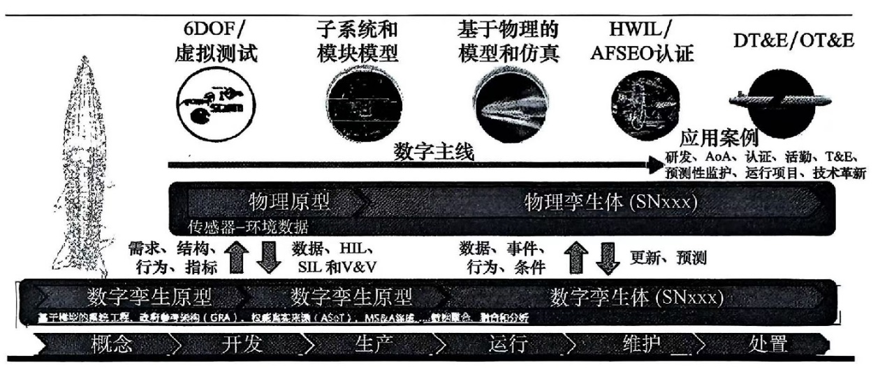

# 军用建模仿真领域发展综述

【摘要】简要介绍军用建模发展领域的发展现状，在理论与方法、支撑环境与平台、应用领域、前沿技术等方面不断演进，助推军事力量建设与运用。

【关键词】军事建模仿真，前沿技术，发展现状

【参考书目】

中国航天科工集团第二研究院二〇八所，军用建模仿真领域科技发展报告（2021），国防工业出版社，2023.7

张梦湉，赵飞
等，世界国防领域前沿技术发展及应用概览，中国宇航出版社，2023.4

------------------------------------------------------------------------

世界各国在国际政治经济形势日趋复杂背景，军事需求牵引下，建模仿真在理论与方法、支撑环境与平台、应用领域等方面不断演进发展，特别是结合了人工智能、5G、高性能/高效能计算、云计算、扩展现实、军事物联网、元宇宙等前沿技术，为军事力量建设与运用提供了有力支撑。

## 创新的建模仿真理论与方法 

外军基于更加开放、包容、高效的仿真体系结构和不断演进的标准，在全面评估建模仿真现状基础上，建模仿真方法得到了持续创新，助推军事力量和能力建设，夯实了军事能力建设的理论基础与支撑方法手段。

### 仿真体系结构和标准演进

面对日益广泛、复杂多变的应用需求，需要更加开放、包容、高效的建模仿真系统体系结构和关键标淮。2021年，世界各国及国际组织进一步强化仿真体系结构和标准研究，为不断演进的前沿领域建模仿真理论方法与实践提供支撑。

为适应复杂和多变的战场环境，满足未来战争快速决策、自动决策和自主决策需求，仿真科学技术前沿研究领域（智能仿真、平行仿真、云仿真、复杂系统仿真、网络仿真、高性能仿真等）的理论方法与实践成为关注焦点；人工智能技术与建模仿真交互融合形成了智能仿真技木，智能建模仿真技术体系发展成为当前与未来的热点。这些都需要更加开放、包容高效的建模仿真系统体系结构和关键标准支撑。2021
年，英国
《国防数据战略------构建数字主干，释放国防数据的力量》，强调以通用技术架构和标准为基础，加快应用程序的开发和交付速度；通过标准设计模式实现多领域集成，以获得可持续的军事优势。北约"联合仿真和集成、校核和认证服务标准"研究任务组计划用3年时间发展北约仿真互操作性标准AMSP-04"北约教育和训练网络联邦体系结构和联邦对象模型设计"、北约高层体系结构（HLA）认证流程、集成校核和认证工具（IVCT）。仿真互操作标准组织（SISO）发布了《用于支持采办活动的建模仿真标准配置文件指南》（SISO-GUIDE-005-2021）、《用于支持采办活动的建模仿真标准配置文件参考》（SISO-REF-066-2021）两份支持采办的建模仿真标准，以支持采办活动的基于模型和仿真的应用与实践。美国空军为支持武器系统在虚拟和合成环境中协同训练，持续开展安全、开放的模拟器通用体系结构要求和标准（SCARS）项目，发布了该项目网络安全相关的标准；美国陆军为合成训练环境（STE）项目开发无线电接入网络（SERAN）标淮，基于模块化开放式系统架构，将计算、存储、延迟、安全等方面的需求以及协议和微服务管理作为创新方法，提供高效、低延迟的网络和微服务管理。

美国国防部当前持续致力于解决仿真之间的互操作性以及模型和数据的重用问题，形成了一系列敏捷建模仿真框架：先进仿真集成与建模框架（AFSIM）、系统工程可执行架构分布式建模框架（EASE
DMF）、基于建模的协调仿真（OSM）框架、计算机生成兵力系统（OneSAF）框架、美国海军"更全面的以模型为中心的工程方法"集成框架、美国陆军用于严格拦截器设计和评估的仿真工具包
（STRIDE）的可执行仿真框架等。这些框架之间的交互融合应用是敏捷建模仿真未来的发展趋势。

### 先进建模仿真方法助推军事能力建设

推演、演练、建模仿真（CEMS）工具和能力提供了一种低成本、高创新性的方法，以测试新的想定和作战概念、设计新系统、模拟军事行动、地缘政治分析和提供训练，从而提高作战人员的战备状态和效能。2021年，美国国防科学委员会全面评估了国防部建模仿真现状及其技术和能力的进步，提出相关建议并发布最终研究报告，以使国防部能够充分利用这种改变博弈规则的工具和使能技术更好地实现国家安全目标；美国海军综合战区作战研究模型（STORM），基于现有能力构建部队级作战分析能力，其量化评估能力为决策者提供关键信息，可确定维持海洋控制权和海上力量所需投资的项目；《数字军种愿景》阐述了美国太空军通过大数据、基于模型的系统工程等技术支持建模仿真框架，基于建模仿真基础设施建立数字孪生和先进的数字工程生态系统，使作战人员在实战虚拟训练场景中磨练作战技能；《美国国防部所必需的靶场能力：未来作战试验》
评估报告强调数字技术正在重塑试验性质、实践和基础设施，数字孪生和高性能建模仿真技术正在促生新试验方法，虚拟试验已成为某些武器系统应用的唯一有效方法。

美国兰德公司三份马赛克战报告《可快速分散、组合且异构兵力的建模：基于主体的模型对马赛克战的启示》
《布洛托上校博弈对马赛克战的启示》
《分布式杀伤链：免疫系统与海军对马赛克战的启示》，从基于主体的模型、布洛托上校博弈、免疫系统以及"海军一体化火控防空"（NIFC-CA）等角度开展建模仿真研究，促使美军马赛克战研究进入新阶段；《影响敌国：平息完美风暴》报告运用实验性"红色思维"方法和基于不确定性敏感认知建模开展分析、兵棋推演和演习；《获得马赛克部队：问题、选择与权衡》报告基于美国国防部当前采办模型和以联合任务办公室为中心的采办模型，就马赛克部队单独要素和整体需求、实现体系级采办管理和要素级决策开展三场实现马赛克部队的政策推演，以确定可能阻止实现马赛克部队的政策杠杆与瓶颈。

### 基于数据驱动的军用建模方法研究

在数字工程实施过程中，数字主线、数字孪生技术和军用仿真建模技术融合形成了基于数据驱动的军用建模方法，该方法得到了持续创新应用，其研究与应用又进一步推进数字工程向前演进。2021年，外军持续应用基于数据驱动的建模方法，以实现武器装备及其体系的快速迭代。自美国国防部发布"数字工程战略"以来，各军种开展了上百个数字工程建设试点。美国空军E
系列战斗机的设计与生产；36个月内就设计、生产出第一架eT-7A"红鹰"下一代教练机；首架T-7A
教练机在不到 30分钟内实现机身快速拼接，从而验证了基于模型的工程和3D
设计优势。"虚拟宙斯盾"系统将舰载"宙斯盾"系统的升级部署周期缩短了至少 18
个月，有效地实现在虚拟空间进行武器装备的快速迭代、升级与验证。美国空军460
亿美元合同推进了数字工程和基于模型的系统工程、敏捷流程、开放系统架构、武器和企业分析方面研究。美国导弹防御局高超声速导弹轨迹生成建模应用程序，将人工智能应用在数字工程计划中（如实验设计、场景仿真和生成建模），并集成了基于人工智能数据驱动和物理驱动的验证方法，提供了高达
100 倍模型生成能力和速度提升，加速了美军建模仿真重要计划实施。

美军综合运用敏捷开发框架、云计算等先进技术，提升数字工程效率，实现可重复、广泛运用的数字工程能力。美军发布的《数字采办的现实》中提出国防采办范式转变需要关键力量进行支持，即"数字三位一体"，包括数字工程及管理、敏捷开发和开放式架构。SAIC公司开发了弹性架构试验环境（RAVE）软件来解决这个效率和响应问题。该环境摄取空间模拟模型代码、进行更改、执行模拟并进行模拟后分析处理，为作战和其他任务模拟提供了可重用性，同时减少了编码要求。先进仿真集成与建模框架（AFSIM）编码以具有陡峭的学习曲线而闻名，分析师通常需要数月才能熟悉。

弹性架构验证环境（RAVE）/先进仿真集成与建模框架（AFSIM）协作实现可重用的数字工程能力，为数字工程提供响应式决策支持。这两者的集成是一个重大升级，可以使AFSIM编程更加用户友好，简化建模仿真过程，并使不擅长编程的人员能够自信的使用该框架。目前应用方案包括用户创建和连接卫星星座、传感器和地面站的仿真，以使RAVE重用AFSIM代码脚本来实现可重用和易用性。下一代数字任务工程解决方案
Moxie，在虚拟环境中运行和分析 SysML
行为模型，以缩短开发时间、提高生产力、加速创新。企业级的集成数字工程环境"用于卓越敏捷制造、集成和持续保障的先进集成数据环境"（ADAMS）架构，核心是实施基于模型的工程技术路线图，在美国海军，"宙斯盾"项目、海军"ANTX-19"演习、洲际弹道导弹跨域数字模型、"民兵"-3型洲际弹道导弹飞行分析、改进完善六自由度模型以及虚拟工厂专用制造执行系统等应用得到了成功验证。

## 仿真支撑环境与平台技术升级迭代

近年来，仿真支撑环境与平台正不断朝高性能、智能化、大规模分布式/并行/联合仿真等方向发展，以构筑更庞大的、更复杂的数字生态系统。2021
年，各国持续投资建设各类仿真基础设施、应用先进建模仿真技术并加速构建数字孪生生态系统，为部队、武器装备及其体系全生命周期活动带来了深刻变革，推进了数字工程仿真支撑平台的发展与演进，以支撑构筑更为庞大、线索交错的复杂数字生态系统。

### 支持部队变革和装备建设

2021
年，各国持续投资建设各类仿真基础设施和实验室，以支持部队变革和装备建设。美国太空作战分析中心计划通过兵棋推演和建模仿真探索作战概念；美国海军陆战队新兵棋推演与分析中心通过反复"虚拟演习"的方式，不断调整概念、战术和技术以加速部队变革和装备建设；美国空军研究实验室启用军械科学创新中心和应用计算工程与科学两组设施，将以数字概念开发下一代武器装备、制造缩比原型机及全尺寸原型机、仿真分析改进设计方案；美国空军兵棋推演高级研究仿真实验室推进定向能局和航天器局的兵棋推演仿真与分析工作；美国陆军研究实验室新虚拟试验场设施，通过连接分布式实验平台网络，使全国范围内实验室及其合作者实现虚拟同步、多站点实验，缩短基础研究创新从学术环境到可与军事系经交互的陆军野战实验所需的时间，美国陆军还与海军研究实验室和北约合作展示了该设施的功能。

英国未来技术探索部门专门从事识别和加速国防与安全领域变革性技术、系统、概念和战略开发等工作，为英国军队提供改变游戏规则的能力；澳大利亚皇家空军未来虚拟作战室应用增强现实技术，基于
Azure 云、传感器
3D地形图像和空域边界数据，以支持虚拟作战；诺斯罗普•格鲁曼公司导弹防御未来实验室，综合运用建模、仿真与可视化能力，开拓性提升开发、试验与部署一体化导弹防御系统的速度与精度："视差"分布式系统集成与软件开发、集成、测试实验室基于云环境、完全沉浸式操作环境、分布式管理方式，提供模型化系统工程设计、模拟系统集成和自动生成测试结果。

### 支撑武器装备全生命周期

仿真平台的迭代升级与应用持续支撑不断创新与发展演进的武器装备及其体系全生命周期活动，促进了数字工程全周期的无缝集成与贯通。新型建模仿真工具的应用也提升了武器装备及其体系全生命周期数字工程效率，实现可重复、广泛运用的数字能力；反过来，又促使建模仿真研发进一步加大投资力度。

2021年，美国陆军太空与导弹防御司令部称已发布扩展防空仿真（EADSIM）系统最新版（第20版），其新功能显著提升了在"实况-虚拟-构造"（LVC）仿真靶场内该系统运行效能；美国陆军空间与导弹防御卓越中心应用EADSIM
为高能激光实兵对抗建模、在联合全域指挥控制效用评估中提供防空反导任务的作战影响。美国陆军定位导航与授时项目和美国政府问责局
《国防导航能力技术评估》报告称"多域定量决策辅助"（MODA）建模仿真软件发挥了重要作用。美国国防部在军用建模仿真领域的最终目标是创建统一的
LVC
仿真集成架构（LVC-IA，已升级到第4版。通过将不同地理位置、孤岛式特定任务模拟器和仿真工具组成综合系统，在统一、合成的训练环境中提供网络化、集成和互操作的实时交互式仿真训练能力。

美国海军"拦截后碎片仿真"（PIDS）新型建模仿真工具，在建模仿真环境中对反导碎片进行模拟，并在真实环境中进行试验前对其进行预测和作战评估；已使用系统级工具对高超声速武器弹道进行任务级建模和杀伤效能建模，确保新型武器具备预期作战效用；采用专用建模、仿真和地面测试设备评估高超声速器的杀伤力，并利用系统级建模仿真综合工具箱开发拦截高超声速导弹的技术方案；基于"宙斯盾"生态系统的数字主线，利用人工智能技术、"开发、安全和运维一体化"（DevSecOps）的软件开发方式、基于模型的系统工程（MBSE）与虚拟化等手段来管理全生命周期的升级和网络安防，以推进了"宙斯盾"系统的数字化转型实践。

美国BAE
系统公司体系级虚拟环境试验平台，为突破多域作战的关键技术提供快速、安全的试验环境。美国空军基于作战试验和研制仿真试验一体化的
"深端试验"理论，构建了面向多域战"黑旗演习"的试验平台，发现装备在隐蔽和高度苛刻的条件下技术性能和作战能力。美国陆军一体化防空反导作战指挥系统在分布式硬件回路试验、实战环境仿真试验和拦截飞行试验三阶段开展初始作战试验鉴定，以测试系统作战有效性、适用性和生存能力。美国空军特种部队通过数字设计、虚拟现实建模和计算机辅助设计在数字试验场虚拟环境中测试两栖作战能力原型，为数字化仿真、测法以及使用先进制造技术进行快速原型制作和物理原型试验铺平道路。

### 数字孪生生态系统

数字工程使用模拟仿真、3D模型和数字孪生等工具来实现对真实世界对象的数字表达；数字孪生是真实世界实体的虚拟表示形式，代表了数字工程学的未来，可为武器系统提供极大的灵活性和适应性。美军正将数字工程融入所有事务流程，主要通过基于模型贯穿于装备全生命周期与全价值链的数字主线技术，以及基于虚拟世界构建真实装备虚拟模型以达到扩展装备新能力的数字孪生技术，将全生命周期内的所有相关事务（如升级改造、维护保障等）都变得"事半功倍"。

数字孪生武器的全生命周期如图所示。

<figure>
  
  <figcaption>图 2‑1 数字孪生武器的全生命周期示意图</figcaption>
</figure>

2021
年，美国空军基于多个在研项目演示验证成果，如"武器一号"、"灰狼"协同蜂群武器系统、"金帐汗国"网络化协同武器项目和先锋计划等项目，计划构建一种全面数字化、敏捷开放的数字孪生武器生态系统，以交付武器系统LVC
试验和演示能力。该武器生态系统基于被称为"罗马竞技场"的数字武器生态环境，应用
AFSIM
软件作为其建模仿真引擎，定期开展实装/虚拟武器装备数字孪生的新技术研发、快速集成和试验，可实现武器系统之间的灵活性、模块化、可重用和一致性，为武器协同提供技术基础和标准，为未来作战部队交付转型战略能力，并为开发易用、适应性强、高效精准契合目标需求的产品提供支撑平台。

CAE
公司国家合成环境（NSE）项目，作为互联数字孪生生态系统，成为政府和军方运作并获得成功的基础推动者，并协助国家政策和安全领域的决策。军方高层认为数字沉浸式生态系统支持指挥官跨越多域环境通过使用单一的通用作战态势图（COP）进行安全行动。网络数字孪生解决方案的领导者SCALABLE
网络技术公司发布新版 EXata 7.3 及网络数字孪生生态系统。Improbable
公司获得英国国防部下一代通信网络数字孪生产品合同，应用单一合成环境（SSE）平台实现国防数字部运营、规划、管理并优化其复杂的技术基础设施。美国空军拟成立工业界联盟"数字转型技术和流程"以推进数字工程和制造及数字战役。洛克希德•马丁公司以"星驱动"数字工程工具集、"北极星"数字工程和先进装配演示验证项目等数字工程探索实践项目为契机，建设全流程、融合供应商的集成数字环境；与美国空军集成数字环境、CloudOne、PlatformOne
等平台链接可构筑更为庞大、线索交错的复杂数字生态系统。

### 赛博空间作战仿真环境

在未来联合作战愿景中，赛博空间（Cyber
space）不仅是独立的作战域，还是统筹和赋能联合全域作战的基础。赛博空间作战应运而生，带来了战争形态、作战方式、武器装备等一系列变化，引发全新的军事变革。美国高度重视赛博空间作战的训练与仿真。美国国防部于
2016
年指定由陆军主导建设持续赛博训练环境（PCTE），是一个基于混合式云端服务的训练平台，为美军网络任务部队提供持续性的赛博训练平台，支持"持续交战"作战概念，搭建高度仿真虚拟战斗环境，提升网络部队战备水平，自动挖掘汇总演习，提高网络作战训练效能，精确认证评估网络战备等级，掌握网络部队作战能力。

在过去几年中，SCALABLE
公司利用其创新的网络数字孪生能力开发了MissionCLONE，提供先进的训练和评估解决方案，以评估和提高联合全域指挥和控制任务的网络弹性。网络数字孪生是指通信网络及其运行环境和承载的应用流量的计算机仿真模型。它可用于在战区或实验室的低成本和零风险环境中研究其物理对应物的行为。为了有效地做到这一点，数字孪生必须具有足够的逼真度，以准确反映网络动态由于通信协议、设备配置、网络拓扑、应用流量、物理环境和网络攻击之间的相互作用。MissionCLONE
利用了来自 EXata
软件和联合网络模拟器（JVE）的一组丰富的网络和通信模型。其中，联合网络模拟器包括地面、水上、空中、水下和卫星通信网络的高逼真度、按比例模型；EXata
软件包括全球移动系统（GSM）、长期演进技术（LTE）、5G、
Wi-Fi和其他商业无线技术的高逼真度模型，以帮助构建与任务相关的数字孪生。2021年3月，网络数字孪生解决方案的领导者
SCALABLE 网络技术公司发布新版本 EXata 7.3，增强了5G
网络建模、网络弹性分析和基于网络的实验设计方面的功能。

### 云计算提升跨域信息共享能力

从2019 年开始，美国空军正积极转向 Kubernetes
等开源云工具，加快空军云技术应用和部署的步伐。云计算技术已在多方面开展应用，为仿真平台跨域信息协同共享提供了新的解决技术途径，推动了跨域仿真资源的共享重用和高效协同。美国空军应用
Kubernetes 等开源云工具来加速云技术应用和部署。截至2021
年1月，美军已有37个团队在开源云工具上构建应用程序，形成以云技术为支撑的联合全域作战体系。

2021年1月，泰勒斯集团为北约开发/部署了首个经认证的战术防御云系统，为部队的数字化转型提供有效支撑。2
月，美国国防部提出继续发展"统一平台"，基于统一云基础设施连接联合网络作战架构（JCWA）内部不同的网络战能力，使作战人员能够访问、搜索和利用所有军种的数据，以实现全谱网络空间作战。5
月，美国空军中央司令部使用"凯塞尔航线全域作战套件"（KRADOS）生成空中任务指令。该套件是一个综合系统，它将
Jigsaw、Slapshot
等应用集成到一个基于云的系统中，用户可以像访问网站一样从任何地方对其进行访问。同月，北约通信和信息局启动了北约
Firefly
新型战术防御云项目，这是首个战区级可部署国防云，可使北约部队能够跨战区实时接收、分析和传输数据。6月，Parsons
公司向美国国防部交付了新的机载任务规划软件更新程序 C2 Core
Air，它是基于云架构的网络客户端共享程序，可为作战行动提供云计算支撑，缩短任务规划时间，提升作战人员快速响应能力，实现美军联合全域指挥控制（JADC2）目标；Kessel
Run
公司推出全域通用平台，采用基于云的即服务模式，旨在"提供高韧性指挥控制任务应用和数据"，以便美国空军在全球任何地方建立、部署和监控任务应用；美国国会研究服务处发布《先进作战管理系统》（ABMS）报告，先进作战管理系统作为联合全域指挥控制的空军解决方案，通过云环境和新通信方法，构建军事物联网，将每个传感器实时连接战场上的每个射手，其重点是实现国防部作战行动决策过程的现代化。7月，美国国防部宣布正在取消联合企业国防基础设施云计算项目（JEDI），并启动新的多云计划------联合作战云能力（JWCC）。新计划必须提供在所有3个涉密等级的相应能力和同等服务，一体化的跨域解决方案，全球可用性（包括战术边缘），以及增强的网络安全控制措施。8月，美国空军在内利斯空军基地举行的先进作战管理系统演示中，首次实现F-16
战斗机电子战系统在飞行过程中完成能力升级。美国空军下一步计划是将高速互联网集成到F-16
战斗机中，使得 F-16
战斗机的飞行员能够从秘密云中获取数据。当前，美军正致力于通过为 F-35
战斗机装备 ODIN
系统以及人工智能算法等，构建便于快速部署的云原生系统，为F-35战斗机等五代机与无人机协同作战开辟新途径。另外，Varjo公司虚拟远程传输现实云平台，实现将多人传送到同一物理现实的虚拟世界中的虛拟远程传输功能，为未来的元宇宙铺平道路，实时现实共享将开创一个全球协作的新时代。

云计算在多方面开展应用，主要解决了以往限制互操作性的信息共享能力不足等问题，加速了交互信息的流通、汇集和处理，也为仿真平台跨域信息协同提供新的技术途径，"仿真云"逐渐变成现实，推动跨域仿真资源的共享重用和高效协同。

## 前沿技术助推

### 仿真支撑平台智能化

近年来，面对着各类智能装备的发展，以及对作战能力要求的提高，仿真支撑平台需要进一步朝智能化方向发展，以满足智能装备试验、训练与评估的需求。

DARPA于1月发布"复杂环境中机器人自主性弹性仿真"项目征求书，探索通过算法、仿真元素技术开发和模拟器内容生成等领域研究适用于越野环境的自主技术，以缩短仿真与现实的差距，同时显著降低成本。

美国空军研究实验室与英国国防科学技术实验室在军事领域自主和人工智能方面开展合作，联合开发、选择、训练和部署的先进智能生态系统，仿真场景侧重于合作和共享人工智能能力；美国空军为空战规划提供人工智能和机器学习技术，最终实现在高级兵棋推演中匹敌并超越专家级人类推演方法。

建模仿真与人工智能结合在DARPA"空战演进"项目中发挥了关键作用。实施"空战演进"项目用户系统协作的信任和可靠性（ACE-TRUST）实验方法建模，将数据收集、自主系统、语音识别和意图解释以及
TrustMATE
建模仿真技术应用于测试飞行员对空战自主的信任度；"自动化科学知识提取和建模"
（ASKEM）项目，创建知识建模仿真生态系统，赋予敏捷创建、维持和增强复杂模型和模拟器所需的人工智能方法和工具，以支持专家在不同任务与科学领城的知识和数据决策。

###  5G助力仿真平台互操作

各国都愈加重视 5G 技术在国防和军事建设的应用，未来应用 5G
的仿真应用场景主要包括基于5G 的跨域 LVC仿真、基于5G
的虚拟现实/增强现实、基于 5G
的平行仿真等，其有望成为军用仿真转型发展新引擎。

早在2019年，美国国防部5G战略报告就认为与4G技术相比，5G技术能够使增强现实（AR）和虚拟现实（VR）、5G智慧仓储、分布式指挥控制及动态频谱均可在军事上获得更广泛的应用。

2021年，美国国防部"从5G
到下一代计划"成功演示了专门在美国设计和建造的、用于后勤现代化的一套先进
5G 网络。美国军方启动 5G
增强现实试验台部署工作，以开展增强现实/虚拟现实训练测试；部分 5G
试验台站点推出5G驱动的增强现实/虚拟现实系统。北约通信和信息局对5G技术及其军事应用潜力进行了技术评估，确定了5种主要5G
使能技术为军事用户提供增强通信和应用服务。诺斯罗普•格鲁曼公司通过新型多级安全数据交换机将数据传至基于云的5G
网络测试平台，以演示情报、监视和侦察（ISR）仿真任务，首次实现了特定任务军事收发器、多级安全数据交换机、开放式广域网络架构的集成。四家仿真公司（RAVE
公司 RenderBEAST 计算、Varjo 公司XR-3 头戴式显示器、Kratos
公司沉浸式作战仿真内容、实时创新公司5G 通信技术）合作演示 5G
实时协同虚拟作战仿真解决方案，支持所有操作人员在同一虚拟环境中共同参与仿真训练，为异地多人协作式训练树立了典范。

2021年3月，北约通信和信息局对5G技术及其军事应用潜力进行了技术评估。根据IMT2020愿景，确定了五种5G使能技术，即频谱、5G新空口、5G核心网、邻近服务和非地面网络，它们可能为5G
军事应用带来重大机遇。

各国都更加重视5G技术在国防和军事建设的应用，5G技术也将极大的推动仿真技术的发展，主要应用场景包括：基于5G的跨域LVC仿真、基于5G的虚拟现实和增强现实、基于5G的平行仿真等。5G作为新一代信息通信技术领域的引领技术，将全面构筑数字基础设施，有望成为军用仿真转型发展新引擎。

### 高性能/高效能计算

高性能/高效能计算技术和军用仿真技术的融合发展促使数据密集型、大规模分布式/并行/联合仿真平台不断升级，高效能并行仿真引擎成为前沿研究的热点和重点。随着人工智能/机器学习工具以及高性能图形处理单元（GPU）计算资源取得的进步，可在相对较短的时间内高逼真度地完成复杂的计算密集型全尺寸燃气涡轮发动机仿真；人工智能/机器学习工具可极大地促进高逼真度数字孪生发动机模型的实时性能仿真。未来，超级计算机的无数高逼真度仿真将有助于先进的发动机设计。

2021
年，美国国家安全局授出20亿美元高性能计算合同，以支持深度学习、人工智能和数据分析需求；美国海军依托"实时高性能计算机"构建大规模虚拟射频试验场；美国阿贡国家实验室高性能计算机
Polaris
超级计算机，可实现从高性能计算机到百亿亿级计算机的过渡，为试验超级计算机和大规模实验设施的整合提供平台，并定制建模、仿真和数据密集型工作流程；Improbable
公司在军事模拟中实现大规模用户并发，实现了旅级及以上级别的大规模虚拟训练，解决了多人对抗推演中的延迟、带宽和计算问题，创建大规模可交付的离散和智能实体及复杂环境模型；更强的分布式计算能力可构建大规模复杂系统的复杂性。

### 云计算技术

2021
年云计算技术已在多方面开展应用，为仿真平台跨域信息协同共享提供了新的解决技术途径，推动了跨域仿真资源的共享重用和高效协同。美国空军应用
Kubernetes 等开源云工具来加速云技术应用和部署。截至2021
年1月，美军已有37个团队在开源云工具上构建应用程序，形成以云技术为支撑的联合全域作战体系。美国国防部"统一平台"基于统一云基础设施连接联合网络作战架构内部不同的网络战能力，以实现全谱网络空间作战；取消联合企业国防基础设施云计算项目，开展新的多云计划联合作战云能力，为美军构建一个无交付期限且不限结构、数量的企业级云环境。美国空军先进作战管理系统（ABMS）通过云环境和新通信方法来构建军事物联网，实现国防部作战行动决策过程的现代化。北约通信/信息局
Firefly
新型战术防御云项目，是首个战区级可部署国防云，可使北约部队能够跨战区实时接收、分析和传输数据。泰勒斯集团公司为北约开发/部署了首个经认证的战术防御云系统，为澳大利亚国防军研发安全战术云计算平台
Nexium防御边缘云。Varjo公司虚拟远程传输现实云平台，实现将多人传送到同一物理现实的虚拟世界中的虛拟远程传输功能，为未来的元宇宙铺平道路，实时现实共享将开创一个全球协作的新时代。

### 元宇宙

元宇宙是通过集成多种最新数字技术而构建的以虚拟为主、虚实相融的新型社会形态。元宇宙作为多种需求的叠加产物、技术的集大成者、互联网的高级版本、创造者的能动乐园，九大要素的融合集成，需要多类型仿真支撑平台的集成与融合，将助力仿真支撑平台实现跨越式发展。元宇宙主要有六大技术：①对抗推演；②区块链；③网络及运算技术，边缘计算常被认为是元宇宙的关键基建，云计算强大的计算能力支撑超大规模用户并行在线运行；④交互技术，在虚拟世界实现自由交互，是元宇宙必经之路；⑤人工智能，构建虚拟世界的支撑技术，使元宇宙具备多元性与沉浸感；⑥物联网技术，以多元化方式接入元宇宙。

## 构建虚实结合的平行战场

当前，建模仿真即服务、模型和数据的云访问以及人工智能为更敏捷的训练和任务演练方式提供了重要的机会。安全环境的不稳定性是由回归大国竞争和以相对较低成本获得巨大技术进步所驱动的。下一代训练必须让部队为复杂的战斗做好准备，许多系统都是高度机密的，必须在模拟环境中进行训练。为此，各国都在致力于构建基于开放架构和安全网络的合成训练环境，以实现全新的联合训练能力/能力转型。而数字工程和基于模型的系统工程作为更快、更具创新性的训练技术的下一前沿领域得到关注。

随着将LVC
元素混合到训练环境中的愿景正在成为现实，虚拟现实系统正在克服延迟、逼真度和触觉问题等技术瓶颈，LVC
训练环境成为各军种加强现代化部队训练的有效方式。

### 支持决策能力建设

兵棋推演作为指挥效能仿真的重要于段，借助兵棋推演演练战略/战役演变进程，可有效支持决策过程、创新作战万法。2021
年，美国空军与盟国完成了"北极交战"和"蓝色计划"兵棋推演，旨在大国竞争中研究竞争对手如何利用北极损害美国及盟国利益。与北极战略相关的兵棋推演包括"北极交战""蓝色计划""全球交战"和"未来推演"。此外，美军在模拟各种想定的兵棋推演中惨败后，美国参谋长联席会议开始重新思考美国的作战概念，探索"扩展机动"作战概念，在全面聚焦分布式作战和信息共享网络的基础上建立了此概念。北约建模仿真卓越中心兵棋推演交互场景数字叠加模型（WISDOM）决策和推演平台，支持从战术到战略层面的兵棋推演、规划和决策制定等活动，并支持从欧洲到美国的分布式兵棋推演。北约军事委员会指示系统分析与研究工作组和最高盟军指挥官转型司令部总部开展关于中级部队能力的概念开发和实验活动，以虚拟方式设计和执行中级部队能力兵棋推演，使通用框架平台能够设计、开发和执行中级部队能力的联合兵棋推演。

### 支持试验训练能力转型

军方领导层希望各军种的各种模拟训练环境能够协同工作，联合训练解决方案成为各军种应对未来挑战的必备工具。为此，将越来越依赖模拟仿真来支持现实、灵活、安全和具有成本效益的训练。通用合成训练环境己成为各国各军种应对威胁的重要工具。

**1. 美军构建联合通用的训练能力以实现能力转型**

2021
年，面对财政压力，美国陆军正在努力平衡新训练设备的采购和旧平台的维护，通过训练辅助设备、装置、仿真或模拟器（TADSS）的采办工具以在转型到革命性的新合成训练环境时保持其传统设备的维护。美国海军空战中心训练系统分部是
LVC
能力的重要开发机构，正从以平台为中心的作战转交为更加一体化、以任务为中心的训练方法并具备分布式任务训练的能力；在其
LVC 训练活动中实现将合成要素注入到实装，并展示了安全LVC
先进训练环境（SLATE）系统与 F/A-18 和EA-18G
链路到实装训练能力的成功集成。美国海军水面战中心创建通用的综合作战系统和模拟器，计划在整个系统开发、测试、评估、认证和维护过程中使用相同的模拟仿真，使海军水面作战系统支持使用单一模拟。

美国空军通用仿真训练环境（CSTE）项目通过探索增强训练平台之间互操作性的新方法，以实现能力快速更新；计划通过合成环境数据架构联盟来建立，并促进跨训练系统的数据共享；通用仿真训练环境和联合仿真环境平台将美国空军多个虚拟训练环境连接，以更高的逼真度训练飞行员。MVR仿真公司将部分任务训练器与
Varjo 公司
XR-3头戴式显示器集成，使飞行员完全沉浸在虚拟现实场景生成器高分辨率、特定地理地形和3D模型创建的实时
360°虚拟世界中，同时仍然能够与现实世界中的物理设备进行交互，最大限度地消除受训飞行员在联合网络环境中演练任务战术和协调时的不信任。

**2. 更容易、更快速地构建模拟内容以模拟现实世界**

仿真引擎集成使构建模拟内容变得更容易。2021
年跨军种/行业训练仿真与教育会议会展上30
多家参展商展示了由虚拟引擎驱动的仿真应用程序，主要应用于快节奏的内容创建和制作管道领域，该产业集群使用高逼真度、动态内容填充虚拟世界，以满足国防客户不断增长的、永不满足的需求，为训练和现实世界操作提供大量、越来越准确的地形。十几种不同的模拟器以虚拟引擎为核心，解决用例和训练挑战、提供无缝部署解决方案，以确保系统互操作性。Pitch技术公司
Pitch
虚拟引擎连接器能与航空航天和国防仿真训练系统协同工作，提供更开放、分布式、高性能、可扩展和安全的解决方案，轻松构建基于开放标准的建模仿真生态系统。美军开展类似黑客马拉松的"阿门图姆挑战赛"，基于
Unity 引擎可快速制作模拟3D 世界原型，以创新军事训练。

使用最新的地形数据快速更新模拟仿真和作战系统，对支持多域作战至关重要。Unity
仿真软件实现了自动处理地形数据以更快的速度模拟现实世界。快速集成和开发环境（RIDE）以其作为仿真核心，支持美国国防部仿真计划（包括单一世界地形项目），对各种想定和技术应用全自动地形数据管道概念和自动分类地形数据等工具实现快速原型化设计。美军已实现用于任务准备的"现实捕捉"，概念示例是为美国海军陆战队开发的战术决策工具包。LuxCarta
公司 BrightEarth
平台可从亚米级图像中准确、高分辨率实时提取建筑物足迹和树木多边形功能，实现
93%以上的捕获率，以实现下一代训练模拟器为其合成环境提供按需的地理空间输入。InVeris
公司基于增强现实的无约束武器训练模拟器 SRCE
（查看、演练、集体体验，或称为"来源"），以一种完全逼真、无缝、可定制且经济的方式提供了最好的虚拟和现实世界，以生成即时射击场。

**3. LVC架构持续升级**

近几年，国外在LVC仿真领域投资与日俱增，注重解决LVC互联互通互操作等关键问题，架构标准逐渐升级，部分产品趋于成熟稳定，应用领域广泛拓展，取得了一定成效。

鉴于联合试验与训练的需要，美国国防部提出了"逻辑靶场"的概念，目标是通过使用公共的软件平台和通信网络，使分布在不同地域的靶场及试验设施能够互联互通互操作。靶场中分散着实装、模拟器、数学模型等不同类型的资源，LVC
试验训练的核心技术问题就是解决异构资源的互操作问题。因此，需要基于统一的体系架构来对异构资源进行标准化封装，并建立相同的语言机制，从而整合出一个具有统一时间、空间和战场环境的逻辑靶场。

SIMNET、ALSP、DIS、HLA、TENA和CTIA
这些体系结构目前都在使用，但它们的联合并不具有内在互操作性，这成为LVC仿真集成的重大障碍。为此，美军特别制定了详细的LVC
体系结构路线图，目标是系统、客观地规划LVC互操作的前进方向，重点关注技术架构、业务模型和标准发展三个方面，明确了下一步构建LVC
联合试验环境需要采取的措施以及完成的任务。之后，美军逐渐完善建模仿真标准规范，不断升级LVC集成架构，促进仿真平台工具的共享、重用、互操作。近些年的主要成果有
LVC仿真集成架构（LVC-IA）、LVC和推演架构（LVC-G）以及仿真器通用架构要求和标准（SCARS）。

LVC
仿真集成架构是作战人员、硬件、软件、网络、数据库和用户界面等集成后的总和，通过协议、规范、标准和接口构建一个能在实兵、仿真兵力及虚拟战场三者之间进行互操作的集成环境，提高场景真实性，本质上是一种顶层体系。这种集成环境提供了一种实时的交互式体验，该架构通过让学员与现实生活中的指挥官互动，提供了前所未有的真实感，大大增加了在模拟环境中可用的学习深度。

### 联合演习训练

近年来，联合演习训练愈加依赖仿真技术支撑。美国陆军"战士22
-1"演习利用网络与仿真技术在堪萨斯州的莱利堡、佐治亚州的斯图尔特堡和德国的格拉芬洪尔进行同生仿真作战，在高压环境下测试了军事理论、知识和作战能力；"会聚工程
2021"作战实验通过七大场景验证挫败对手"反介入/区域拒止"能力、推动联合全域作战概念发展的新型作战技术，重点仿真在印度-太平洋地区第一岛链和第二岛链执行任务的场景。

美国空军"联合虚拟旗 22-1"虚拟空战演习，横跨8
个时区，所有单位在同一时间和同一虚拟空间进行演训，演练在联合环境中如何有效作战以提高战斗力务。美国空军研究实验室开展两次定向能效用概念实验（DEUCE）演习活动，均采用"红蓝"双方虚拟对抗的方式，通过虛拟界面应对威胁情况来评估定向能能力在未来战争中的效用。

美国海军在全球多个地区同时开展近40
年来最大规模的"大规模演习-2021"活动。此次演习首次大规模运用LVC
仿真训练技术，实现了实战训练和合成训练能力的融合。此次演习构设了跨军种、跨战区、跨舰队虚实结合的全球综合实战训练环境，实装部分由
130 艘水面舰艇和11个训练靶场组成，虚拟部分由70
多个飞机模拟器组成，构造部分由 14
个模拟站点、作战实验室和计算机生成兵力组成，是迄今为止对 LVC
训练环境的最大规模试验。

北约及其盟国需要共同进行联合训练，以确保任务准备完善，因此通过分布式仿真LVC实现北约联合作战训练参考架构。2013年10月，北约建模仿真小组MSG-128
"北约基于分布式仿真的作战训练行动的增量实施"成立，其目标是建立永久性的北约分布式仿真网络，以实现联合作战训练。最近完成的基于分布式仿真的作战训练参考架构以构建块、互操作性标准和模式的形式定义了指南，用于实现和执行分布式仿真及某个领域（陆、海、空）支持的联合训练与演习。参考架构定义了仿真门户服务，支持不同（版本）仿真标准、战术数据链和HLA联邦对象模型模块，如DIS
7.0、IEEE 1516-2000（HLA）、IEEE
1516-2010（HLA升级版）、实时平台参考联邦对象模型（RPR
FOM）、北约教育和训练网络联邦对象模型（NETN
FOM）。面向消息的中间件服务要求使用IEEE
1516-2010（HLA升级版）分布式仿真环境HLA标准（STANAG 4603）。

## 为部队维修保障提供新模式

武器装备的可靠性直按关乎战斗力，关乎战争的胜败。为确保武器装备作战完备性，美国国防部年度国防预算40%（约2900
亿美元）投入在作战和维修上。当前基于状态的维修还存在不足之处，而基于物理的仿真模型则提供一种更好的维修模式，基于装备操作包络线，在不同程度上表征组件、系统和体系的行为，以此可对武器装备的部组件、系统和体系进行分析验证。再结合经过战场实时数据校准后的数字孪生，可对故障模式和根本原因做出高质量预测。因此，美军认为基于物理的仿真可提高部队的维修保障状态。

美国空军通过构建F-16
战斗机的数字孪生来减少维修保障战斗机所需的时间和成本，并提高维修保障效率。数字孪生将使美国空军能够模拟飞机未来的磨损、维护和升级。美国海军为"宙斯盾"系统提供可视化的安装维修方案，以实现更精确、更高效的安装；通过微软
Hololens
设备的增强现实技术，配置"宙斯盾"系统的每一艘战舰模型可叠加到真实空间中用于评估更改、维护、作战系统的快速配置；技术手册和维护文件的信息也可叠加在真实设备上，以同步开展维护工作；应用人工智能算法等先进技术预测部件的维护需求，从而在部件损坏之前部署维修工作。

## 小结

纵观近几年军用建模仿真技术领域重要进展，以美国为代表的仿真技术优势国家以智能化仿真平台、定制化仿真应用、服务化仿真能力为基础布局军用仿真技术的发展并将其作为需求牵引，从战略研究与顶层架构设计、基础理论与方法研究、支撑环境与平台演进出发，积极探索军用仿真重大计划与工程谋划，加强军用仿真自主创新与协同共享，形成研用结合、迭代演进的军用仿真生态，其产生的影响和驱动力将加速推进建模仿真技术在军事各领域的发展与应用。
