# 作战建模与模型体系

【摘要】"模型"是作战建模与仿真领域的核心概念，仿真即是一种基于模型的活动。必须充分认识到模型体系对于仿真系统和模型重用的重要性。了解作战仿真的双层模型体系，即军事概念模型＋作战仿真模型。介绍典型的仿真模型体系，并对FLAMES和AFSIM的模型体系进行剖析。

【关键词】 模型，面向对象建模，军事概念模型，作战仿真模型，模型体系

【参考书目】

▲彭鹏菲，龚立，军事系统建模与仿真，国防工业出版社，2016.1

黄柯棣，邱晓刚 等，建模与仿真技术，国防科技大学出版社，2011.2

彭勇（导师
黄柯棣教授），作战仿真模型体系分析及其模型设计与实现关键技术研究\[D\]，国防科技大学，2011.10

中国船舶重工集团公司
编著，海军武器装备与海战场环境概论（上、中、下册），海洋出版社出版，2007.11

但琦，吴松林，军事数学模型，国防工业出版社，2024.12

------------------------------------------------------------------------

## 概述

模型是对现实或虚拟事物的抽象和描述。作战仿真模型是对作战行动过程中现象、活动、实体和事件的一种抽象和类比表示。

作战模型是军用软件系统做出作战决策、指挥作战行动的核心技术手段，是综合运用所属指挥对象遂行作战任务的形式化描述，是作战指挥决策和武器控制的经验总结。

战争问题的复杂性决定了作战仿真模型体系是一个复杂系统。模型体系是由作战仿真模型以及模型之间关系构成的集合。作战仿真模型体系设计就是要以模型重用与互操作为目标对这个复杂系统进行分析，提供一种有效的方法用于指导作战仿真模型的设计与开发，以满足作战仿真系统对模型的要求。

对于作战仿真系统，建立相应的模型体系可以：（1）统一模型开发过程，提高模型质量。采用统一的模型表示和实现方法可以减少模型之间的不必要差异并加快模型开发和提高模型的可信度。（2）增强模型的一致性。通过提供标准的模型表示与设计方法，模型体系可以保证模型之间接口以及模型与运行平台之间接口的一致性。此外，通过统一的方法描述模型的粒度、分辨率、模型约束和假设，模型体系有利于保证模型语义和数据的一致性。（3）改进模型的校核与验证。通过标准的方法表示模型、模型的开发过程和模型之间相互关系，模型体系可以改善模型的校核与验证过程。（4）对模型之间的复杂关系进行定性和定量分析。（5）根据模型之间的关系（继承关系、组合关系和交互关系等）对模型体系进行分析，研究模型体系中模型之间以及模型构成的子系统之间的关系，在模型演化过程中保证模型之间的一致性。

美军通过多年的实践，认识到模型体系对于仿真系统和模型重用的重要性，对模型体系进行较深入的研究，开发了一些能够被广泛使用的模型体系。

（1）平台层模型体系和单元层模型体系。这两种模型体系利用面向对象建模方法，通过模型继承、泛化和聚合等方式对武器装备和军事力量进行建模，具有清晰的层次结构，使得模型之间也具有很强的组合能力。它们主要对武器装备进行建模，目标是通过模型组合提高模型的重用性。EAGLE
和WARSIM 2000 仿真系统都采用了单元层模型体系。

（2）JWARS 模型体系。JWARS
模型体系属于单元层模型体系的一种，是战役级联合作战模型体系。它也是采用面向对象建模的方法，但是充分利用多继承方法表示模型的聚合，通过模型的组合构建仿真模型（战场空间实体）。JWARS模型体系非常强调模型的组合能力，通过模型组合实现模型重用。此外，它还提供很多的标准算法库，如毁伤算法以及运动轨迹解算算法等。

（3）联合作战仿真对象库 JWSOL。JWSOL
应用面向对象分析与设计方法对战役级联合作战过程进行建模，它是一个可靠的、可重用且健壮的作战仿真模型库，主要用于联合作战仿真系统以及想定的开发与移植，支持新开发的和遗留的模型与仿真系统之间的互操作，它的一个重要目的就是促进模型重用。

1994 年DMSO
委托美海军指挥控制和海洋监视中心开展了作战仿真模型体系的研究，并于1995
年发布了关于联合作战仿真对象库JWSOL（The Joint Warfare Simulation Object
Library）的研究报告。JWSOL是一个全面、可靠、可重用和鲁棒的作战仿真模型库，它囊括了与战役级联合作战相关的所有武器装备、指挥控制、后勤保障以及决策等模型。它采用面向对象分析与设计方法对战役级联合作战涉及的对象进行建模，通过继承关系描述模型的层次结构。它将仿真对象分为最基本的三个类：智能体（Agent）、物理实体（Physical）和事件（Event）。其中，智能体类包括战场中各类人员和组织；物理实体类包括了所有的武器装备模型和自然环境模型等；事件类包含军事事件和非军事事件等。这三个类还有具体的子类，不同功能的子类可以通过指挥控制关系关联起来描述具有复杂功能的模型，此外，JWSOL
也是通过这个关联关系描述模型之间的组合关系。

（4）FLAMES 模型体系。FLAMES
模型体系的模型可以分为装备模型和认知模型两类，它将运行时的模型称为单元。单元由装备模型和认知模型组合而成，装备模型负责模拟仿真武器装备的功能和交互过程，认知模型模拟人的认知行为和决策过程。FLAMES
模型体系为模型开发者提供装备模型的基类，同时对模型功能、原理、假设和模型之间的交互关系进行说明。

## 建模方法与原理

### 模型的重用性

模型重用是模型体系的一个重要目标，是设计模型体系的一个基本原则。在仿真系统中，模型不是孤立的个体，模型重用依赖于模型之间的关系（交互关系和依赖关系）。将一个模型不加修改或部分修改的用于仿真系统构建过程称为模型重用。模型重用需要确定模型假设、约束、行为以及模型之间关系等是否满足仿真系统的要求。所有这些因素构成了模型的应用上下文（Application
Context），也称为应用情景。

模型的重用与一系列技术紧密关联，如模型体系架构分析、模型设计方法、模型表示技术、模型组合方法等。

**1. 模型设计方法**

如何设计模型才能提高模型的重用性？模型设计的一个主要目标就是提高模型的重用性，它主要包括领域功能设计和通用功能设计两方面。领域功能设计主要包括领域对象的建模，对象功能划分等内容，目的是使模型的功能内聚，模型之间的耦合性尽可能小。通用功能设计则需要解决模型的底层数据传递和模型与仿真引擎接口设计等问题，目的是提高模型的重用性、组合性以及运行性能。

模型的领域功能设计是面向重用的模型设计的一个难点，其根本原因在"建模的最小抽象原则"。对于这个问题，更多只能从工程实践上加以指导。除此之外，目前还没有行之有效的解决方法。对于通用模型设计有两个基本原则：一个是模型和仿真引擎分离，另一个是尽可能的做到平台独立。

**2. 模型表示方法**

不同的建模方法和模型表示规范，包括DEVS、Petri网和BOM规范等。

为了支持模型重用，关键是解决如何表示模型的目标、假设与约束的问题。尽管学者们对模型目标、假设与约束的命名不尽相同，有些学者称其为模型应用上下文，有些叫做应用情景，而有些则叫模型元数据，但都一致认为模型目标、假设和约束知识对模型重用有重要作用，而且提出基于本体或基于DEVS
理论的方法来表示这些知识。

应用基本对象模型（BOM）规范表示模型的接口、行为以支持模型表示、组合和重用的方法[^2]。BOM
是概念模型、仿真对象模型或联邦对象模型的描述规范，是仿真系统模型的表示规范。BOM
规范包含了创建概念模型和指定仿真模型接口的必要元素。概念模型由交互模式、状态机、实体和事件四个部分组成，如图所示。交互模式描述不同实体之间的相互作用过程，这是模型应用的上下文；状态机表示模型拥有的不同状态以及这些状态的转换条件，这是模型自身的内部行为描述；实体类型是现实世界中实体或现象的抽象，是模型暴露的状态接口；事件类型描述模型之间传递的消息，是模型暴露的消息接口。

<figure>
  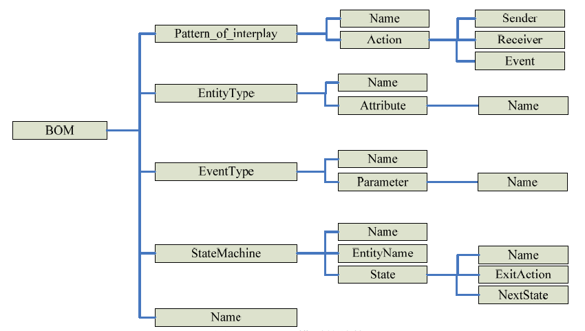
  <figcaption>图 3‑1 BOM模型的结构</figcaption>
</figure>

模型的行为表示也是难点。目前的结构化模型表示方法对于表示模型复杂行为的能力存在一定的困难，主要困难在于表示模型状态的变化及其条件。目前，这个问题的解决方案主要有三种：基于脚本语言的模型行为表示、基于BOM概念模型的模型行为表示和基于扩展DEVS
的模型行为表示。其中，基于脚本语言的模型行为表示方法通过脚本描述模型的状态变化，如仿真参考标记语言（SRML），从本质上说，脚本语言属于程序语言的一种，它适合描述模型的行为，但它不是形式化方法，不利于模型的行为检索。基于BOM
概念模型的行为表示方法采用状态机和交互模式描述模型的状态变化，它是一种形式化方法，但是它对描述模型状态变化的条件还存在一定困难。基于扩展DEVS
的模型行为表示方面主要是通过增强DEVS
在描述状态变化方面的能力来描述模型的行为，它和基于BOM
概念模型的模型行为表示方法有类似的优缺点。

**3. 模型组合方法**

模型组合依赖于模型设计的模块化和层次性。例如，有人将模型重用分为代码重用、函数重用、组件组合重用以及系统组合重用四个层次。

模型组合是选择模型组件进行装配以满足不同需求的一种能力。对模型进行组合首先必须有模型组件，然后根据应用需求选择相应的组件进行装配。组件的装配是在某一软件平台上连接组件之间的输入输出接口，使得组件之间能够按照要求传递数据。模型组合主要包括语法组合和语义组合两种方式。前者是关于如何实现模型组合的问题，考虑的是如何在模型之间传递数据、模型之间的时间同步以及事件管理等工程实现的问题。后者主要研究组合模型对于仿真系统是否有效的问题，即组合模型是否有意义。

### 面向对象和基于组件的建模方法

模型体系设计方法包括面向对象建模方法、元模型方法、扩展DEVS
方法以及本体方法等。

当前的仿真系统模型体系框架构建方法普遍以面向对象建模思想为基础、以组件化建模技术为支撑。通过面向对象建模方法描述军事模型的属性和它们之间的继承关系，并采用组件化的方法构造可重用的仿真模型。

模型体系是对模型构成及其相关关系的系统描述，是对模型分析、层次结构及其相互关系的抽象化表达。模型体系设计方法主要还是以面向对象建模方法为基础，以"单元"、"平台"或"战场空间实体"等为单位表示仿真模型，通过继承、多态和聚合等方法描述模型间的关系并实现模型的组合、重用。

面向对象建模方法对建模过程中模型抽象具有天然的优势。对象的继承、泛化、聚合、关联以及多态关系可以用于对仿真系统中各种对象以及对象之间的关系建模，进而建立仿真模型体系。面向对象建模方法已经成为一种非常普遍的系统建模和分析方法。

模型构建方法既要具有一定的通用性，又要满足武器装备的专业性，并反映出武器装备需求论证及系统设计特点，组件化建模方法能够很好地处理和解决这一矛盾。对于一般的相似或相同的需求想定、子系统、部件，可以采用通用组件解决；对于升级改造的子系统、部件，可以在已有的需求和系统基础上，通过增加或更新相应的组件，实现新系统的功能；对于全新的武器装备，可以通过定制开发相应组件，而不需要重新建立一套模型体系；另外，通过组件的完善，可以不断丰富模型体系，以适应不断发展的导弹型号需求论证和系统设计需要。

组件是模型的最小单元，模型由多个组件组合装配而成。组件化建模思想的核心内容是组件的开发和组装。组件组装是选择多个组件进行装配以满足不同应用需求的一种能力。对组件进行组装需要根据应用需求，选择相应的组件进行装配。将模型组件库中每个独立的组件模型进行接口关联、参数配置和装载，再通过专门的模型测试系统进行验证和测试，将测试通过的模型加入模型库或加载到仿真系统。

以模块化、组件化的方式构建模型，每一个可重用的模型必须保持其自身的独立性，该模型可以通过规范的输入/
输出接口关系定义实现模型功能，同时模型也应该是参数化的，模型在实例化过程中，通过加载不同的参数生成不同的模型。

模型体系中组件的定义可以采用基于SysML的形式。

### 作战仿真中的双层模型体系

作战仿真的模型体系一方面要能忠实地反映战场空间中各种对象；另一方面要能充分体现作战模型在功能、结构上的可组合性，以便充分利用各种组合方式开发作战仿真对象模型。由此，形成了两个层次的作战模型体系。

按面向对象的思想，从军事专家，也就是系统使用者（用户）角度考虑，模型体系应该能够按照战场空间中军事力量的编制编成、武器装备类别进行分类建模，从而直接反映战场空间各种类型的对象、事件以及它们之间的相互作用过程，如武器装备与人员、指挥控制过程与交战过程等。这样，仿真模型才能更容易得到军事专家理解、认同。

而从仿真专家的角度考虑，大规模作战仿真建模与系统开发是一项复杂的软件工程，需要仿真开发人员（工程师）综合利用军事知识、仿真技术、软件工程知识才能保证工程的顺利实施。基于从军事知识提取的军事概念模型进行仿真模型分析设计时，不同的实体模型包含有功能相同或相似的组件。在开发仿真模型过程中，如果能够重用这些功能相同或相似的组件不但能够加快模型的开发，避免很多重复的工作，还能保证实体模型之间的一致性，提高仿真模型和仿真系统的质量。因此，仿真开发人员可根据概念模型，提取系统中具有相同功能的模块，通过组合、扩展、参数化等手段在多个层次上以组合的方式开发各类实体模型。因此，模型体系应该能够充分体现作战实体包含的基本功能模块，支持将这些功能模型模块组合成能够反映军事概念模型需求的作战实体仿真模型。

上述需求反映到面向对象仿真建模中，一是需要从用户需求角度出发，提高仿真建模的抽象层次，使得模型表示从贴近计算机实现的代码层次提升到接近人类思维逻辑方式的层次，并提供友好的建模环境和语言支持；二是需要促进多领域仿真功能模型的重用、互操作和可组合。

为此，在面向对象作战仿真建模过程中可以采用两层模型体系设计的方法。第一层模型体系是面向军事人员（或用户），从战场空间中识别、分析和抽象作战实体而构建的军事概念模型体系。军事概念模型体系重点表达用户的需求，其构建是作战仿真模型分析的工作。第二层模型体系是面向仿真实现，在对军事概念模型分析的基础上，提取抽象的公共功能而构建的功能组件模型体系。功能组件模型是军事概念模型中具有相同功能的模块，是一种可重用、可组合的模型组件，用于描述一个作战部件，也可以描述一个作战行为或一个作战系统。功能组件模型体系重点针对重用需求，主要是作战仿真模型设计的工作。军事概念模型引导功能组件模型的设计，是功能组件模型设计的依据；功能组件模型支持军事概念模型在程序层面的实现。

通常军事概念模型对应用户关注、在战场空间中所要仿真的作战实体，如飞机、坦克、舰船、编队、旅、营等。军事概念模型与战场实体的对应关系有如下三种情况：一是一个军事概念模型描述一个战场实体，例如一个F-35概念模型描述一架F-35战斗机实体；二是一个军事概念模型描述若干战场实体，例如一个战斗机编队军事概念模型描述四架战斗机实体；三是少数情况也可以用若干军事概念模型描述一个复杂的战场实体，例如一个高炮营实体可以用营指挥所军事概念模型和高炮连军事概念模型来描述。

军事概念模型体系构建，以军事需求描述为输入，以军事专家为建模主体，采用以面向对象分析为主的方法，在对对抗双方作战体系分析的基础上，梳理归纳出军事概念模型体系框架；然后基于模型体系框架，用不涉及具体技术细节的规范化语言和格式，描述框架中各作战实体的军事使命、作战行动和军事规则等，以及其属性、状态变化等；进一步通过对象类的形式描述感兴趣的这些作战实体及其属性，确定其对应的对象类、每个类的属性以及要实现的方法。

功能组件模型体系构建，以军事概念模型为输入，以模型开发人员为建模主体，采用面向对象设计为主的方法，利用面向对象描述语言与工具，描述构建仿真实体模型需要的组件，建立支持组件组合形成实体模型的框架，识别组件的属性、状态、行为与交互关系，整理组件运行相关的规则及相关数据，建立功能组件模型框架。

功能组件模型体系源于军事概念模型体系，是对军事概念模型中通用模块的抽象归纳。功能组件模型体系由组件模型集合构成，具有清晰的层次结构和很强的组合能力。基于功能组件模型体系中的模型，可以通过继承、泛化、聚合等方式对武器装备和作战单元等作战实体进行建模，支持模型之间组合，提高了作战实体模型之间的互操作性，也提高了模型的可扩展性、可重用性，增强了模型的可维护性。

区分两个层次进行建模，符合特定领域建模的思想，明确区分了问题域（Problem
Domain）和方案域（Solution
Domain）。问题域的模型（即军事概念模型）设计和建模工作由领域建模人员完成；方案域（即功能组件模型）的技术实现则由仿真建模专家和平台工程师完成。问题域向方案域的映射与转换则由领域专家和仿真专家协作完成。

通过两层作战仿真模型进行作战仿真建模反映了这样一种基本思想：先进行领域相关、具体应用无关的领域知识开发，避免了过早地涉及具体应用需求，从而避免过早地从设计和实现的视角建立模型，这样在一定程度上避免模型框架中领域知识的不完整和应用相关性，提高了仿真模型的通用程度。

【参考】模型驱动架构（Model Driven
Architecture，MDA）将软件系统模型分为三个层次，分别是计算无关模型（CIM）、平台无关模型（PIM）和平台相关模型（PSM）。其中CIM是从计算无关的角度来观察一个系统得到的视图，它不包括系统结构的具体细节，仅考虑系统要解决的业务问题。CIM又被称为领域模型，在建模过程中使用的词汇来自问题领域专家所熟悉的术语，CIM中并不包含软件建模和实现技术相关的知识。PIM描述了系统的功能和结构，但是并不包含与具体实现技术相关的细节。PSM描述了系统的实现技术以及所有实现的细节，可以被转换为具体的代码。

### 多分辨率模型

在作战仿真领域，仿真模型的分辨率是指模型所描述实体的最小粒度和模型所描述实体的属性、行为、输入、输出等方面的详细程度，也就是模型对细节描述的多少。仿真互操作标准组织（SISO）的定义是：分辨率是在建模或仿真中，模型描述真实世界的精确度和详细程度。多分辨率建模是指对所要研究的问题在不同分辨率尺度上建立的多种模型。美国
RAND 公司的 Davis
等人给出的定义：多分辨率建模是指为同一现象建立具有不同分辨率的一个模型、一个集成的模型族或者是二者的组合。

关于多分辨率建模，在工程建模的实践中，得到以下几点认识：一是多分辨率建模是针对同一仿真对象而言，包括仿真实体及其物理过程和系统；二是就仿真对象建模而言，分辨率要与所研究的问题相适应，并非是模型的分辨率等级越高越好；三是低分辨率模型并不是对高分辨率模型的简化，而是有其特定功能和作用的建模；四是不同分辨率模型转换时机和方法与系统的应用和所研究问题的需要有关。

在军用仿真领域，广泛使用的多分辨率建模方法主要是聚合-解聚法。其中，模型的聚合是指将高分辨率的模型合并成为低分辨率模型的过程；解聚是聚合的逆过程，是指将低分辨率的模型分解成为高分辨率模型的过程。

作战仿真不仅要体现作战装备，还要体现作战部队的编成及行动，作战装备是通过作战部队的编成及其作战行动联系到一起的。面向对象的分析方法，可将武器装备与其行为进行封装形成对象模型，能有效减少作战仿真中模型的耦合性，并提高作战仿真模型配置的灵活性。在分布交互式仿真中，多分辨率建模问题被等价地看成是模型的聚合与解聚问题，其最终反映为对象属性的变化。

"单元"是一个军事组织，如营和旅，或者海上舰艇编队，它们通常由多个下属单元构成，如一个营可能由三个连组成。"实体"是单个军事对象，如舰艇、坦克和直升机。实体还可以解聚成部件或组件。"对象"是表示一个单元或一个实体的通用术语。

分辨率量化描述了模型中细节的程度。通常，实体级模型被认为是高分辨率的，并在细节上呈现单个实体及它们的互动。而大多数的单元级模型都是相对低分辨率的，更加抽象地表现建制单位和它们的互动。"交互"是指一个仿真对象试图改变另一个仿真对象的状态，如直瞄射击、后勤保障、通信等。

<figure>
  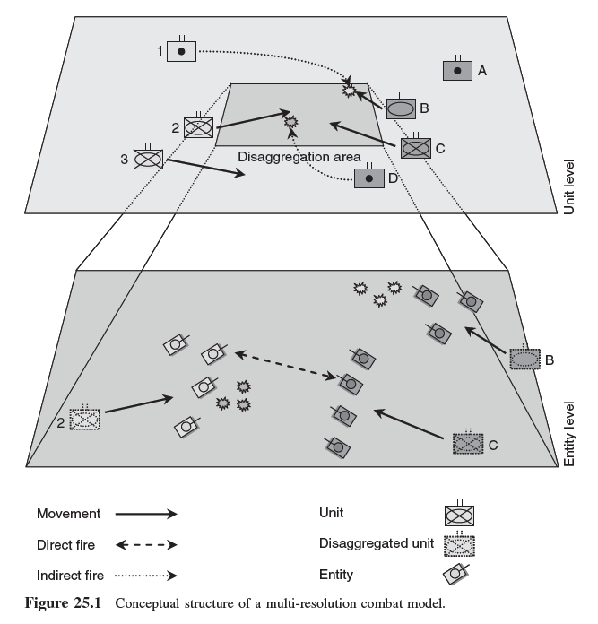
  <figcaption>图 3‑2 多分辨率仿真系统的概念性架构</figcaption>
</figure>

聚合和解聚，分别是从实体到单元级模型的转换，或从单元级到实体级的转换。多分辨率作战模型是一种把单元级作战模型和实体级作战模型连接在一起的复合模型，作战建制单位可以由单元级模型表示，也可以由组成该建制单位的实体级模型表示。如图所示是多分辨率仿真系统的概念性架构。它是作战仿真运行过程的瞬间示意。图的上半部分显示一个正在运行的单元级模型，仿真对象为单元。下半部分显示一个实体级模型，仿真对象是实体。

实体模型的聚合与解聚，主要是指与实体相关属性信息的聚合与解聚，包括实体数量、位置、状态、隶属关系、任务、类（机）型等属性的聚合与解聚。效果模型的聚合与解聚，是指除实体属性外信息的聚合与解聚，主要有战损信息、战斗力指数、作战效能、仿真步长、战场态势等参数的聚合与解聚。

需要注意的是，采用聚合-解聚法进行仿真模型的多分辨率建模时，要注意两个问题，即模型的一致性问题和模型数据的完备性问题。

## 军事概念模型

在仿真中，概念模型通常是指为了理解用户的真实意图及为了强调影响系统性能的重要因素而进行的规范化抽象描述。概念模型是真实世界的形式化描述，数学模型是概念模型的数学逻辑表达，仿真模型是数学模型的仿真实现。

概念模型是对真实世界的第一次抽象，其目的是为特定领域主题专家和仿真开发人员提供一个沟通的桥梁。借助概念模型，仿真开发人员可以获取所仿真的真实世界系统的细节信息。因此，概念模型是仿真系统开发的参照物，提供一种与仿真无关的表示；仿真模型是概念模型的计算机程序化实现，与具体仿真应用有关。

概念模型是仿真开发过程中的一个关键点。根据概念模型在仿真开发中的作用可分为两种类型，即面向领域的使命空间功能描述（Functional
Description of Mission
Space，FDMS）和面向设计的系统概念模型（CMoS）。有时这两种类型的概念模型也简称为面向领域的概念模型和面向设计的概念模型。面向领域的概念模型发生于仿真开发生命周期的早期，它支持需求分析；面向设计的概念模型发生在设计活动的开始。使命空间功能描述（FDMS）的前身是使命空间概念模型（CMMS），2001年改名。FDMS
为开发者提供了主题领域的细节或者问题空间的特征表示。

FDMS属于美国国防部提出的通用建模与仿真公共技术框架。该框架包括三个部分：高层体系结构（HLA）、使命空间概念模型（FDMS）和数据标准（DS）。FDMS为建立数学模型、逻辑模型提供足够完备的信息依据，为模型及仿真的VV&A提供可追踪的参照，确保领域人员与软件开发人员对同一问题理解的一致性，推动模型与仿真互操作和重用。

<figure>
  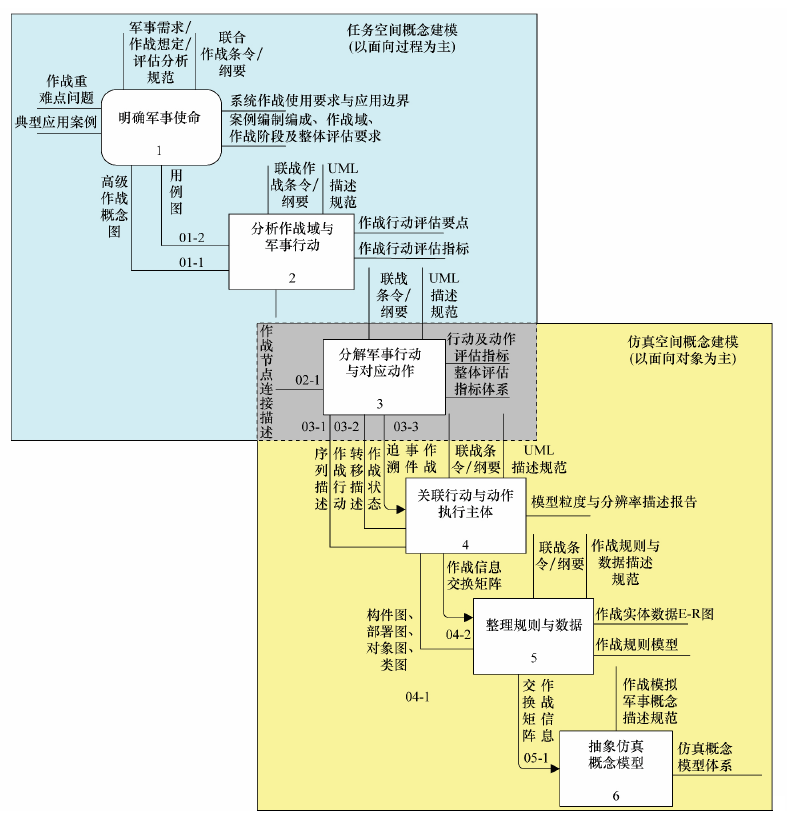
  <figcaption>图 3‑3 两阶军事概念建模框架</figcaption>
</figure>

FDMS建模方法一般有三种：科学报告（文本表达），IDEF3，UML。

作战仿真模型是对军事表述的第二次抽象，也是军事仿真中软件开发过程的开始。这个过程将军事问题的结构化描述转化为软件开发模型，是一种逻辑建模过程。这种过程采用面向对象的思想按照标准化的对象模型模板对军事任务空间和作战实体对象的属性、交互、参数等进行描述。目前军事概念建模的形式化描述语言，主流有三种方式，分别是：IDEF0、UML、Petri网。

### 使命空间概念模型

使命空间概念模型（Concept Models of Mission Space,
CMMS）是对现实世界某一具体军事行动的一种合理、准确、规范化的描述，是对客观现实世界的第一次抽象，它将现实世界军事行动描述成军事领域专家和仿真人员都能正确理解的完整信息，是军事人员和仿真人员沟通的一座桥梁，为军事模型的规范化描述提供了良好的基础。

军事概念模型将某一具体军事活动用EATI（Entity, Action, Task,
Interaction）4个要素来描述，利用军事人员的相关经验和所收集的信息，提供可扩展的描述模板集和样式指导，辅助进行军事问题的规范化表述，使其描述的对象、关系、过程具有明确的含义、可理解和可操作。军事使命描述规范是一种语义明确、功能适用、简便实用的公共语言，利用这种公共语言，不但可以简化军事人员与技术人员之间的合作关系，而且，还可以有效地减少从军事需求到技术实现间的转换错误。军事概念模型是军事人员和技术人员之间沟通的一座桥梁，军事人员和技术人员都采用面向对象的方法来构建自己的任务空间，消除了他们之间思维方式的差异，保证了军事概念模型和仿真程序代码的一致性。

使命（任务）空间概念模型为仿真开发人员提供了特定使命相关军事知识的规范化描述，相当于在现实世界军事知识与仿真之间引入了一个中间层，从而减小了问题域和求解域之间的差异。使命空间概念模型分别依赖于作战实体（武器系统、兵力、装备等）、作战人员（指挥员、个人等）和军事知识（战略、战术、任务、作战规则）等军事行动因素。简单地说，概念模型是对某一具体的军事行动流程的一种规范化描述，也就是说，使命空间概念模型是战斗条令的仿真细化（其实质相当于国内所称的战术模型）。一个作战实体（Entity）完成一项作战任务（Task），其中可能会有多项行动（Actions），产生一个或多个交互（Interactions）。每一个实体执行一项具体军事使命时，都会产生一个使命空间概念模型，而这其中的作战实体、作战任务、军事动作和交互可以提炼出来，形成一系列基于实体的名词词典和基于动作的动词词典，这就是EATI模板。CMMS
作为一个权威的知识源，通过描述任一使命所涉及到的关键实体、行动和交互的基本信息，为仿真开发提供服务。

概念模型是真实世界军事行动的一致性描述。它包括一个特殊任务的组织、过程、指挥、装备、环境、通信以及其他方面的信息。

### 军事概念模型的构建方法

军事概念模型是军事人员与技术人员关于客观军事活动的统一认识。军事概念模型的构建以权威数据为基础，提取与作战实体、行动、任务、交互等相关的描述信息，确定作战实体概念模型需要描述的静态、动态属性等内容，同时对作战实体任务空间的内容进行格式化和形式化描述，建立规范且无二义的蓝军作战行为军事概念模型。

军事概念建模方法大致可分为面向实体的方法和面向过程的方法两类，前者以抽象军事活动中的实体为主，主要关注实体间的相互作用；后者主要面向过程，侧重于过程和现象分析。使用传统的面向过程法构建的模型重用性差，抽取的仿真元素不完整。面向实体法把过程和对象结合起来，采用面向过程的思想，从分析作战过程入手进行作战系统分析，采用聚合、抽象和封装等面向对象的思想进行模型元素抽取和组织，始终以实体为主线，围绕实体和实体行动建模的需要进行。这种建模方式从军事问题分析入手，借助军事领域的概念描述作战系统，既便于军事人员运用和掌握，又便于交流和合作，能够为仿真模型的构造、校核、验证和确认奠定基础。该技术可实施性强，突出了建模重点，降低了建模的复杂度。

国内外已经有多种成熟的面向实体法，如"实体、行动、任务、交互"EATI法、统一建模语言（UML）等，都是经典的概念模型描述方法。EATI
是美国国防部在其公布的"建模与仿真主计划"中提出的一种基于实体的军事系统建模方法，并已应用于使命空间概念模型中。

## 作战仿真模型

仿真模型是仿真系统的核心，它抽象描述了人们所关注的复杂的现实系统或人工系统的结构、静态属性和动态行为特征，作战仿真模型描述的是作战指挥信息系统的结构、静态属性和动态行为特征。

### 作战体系

军事领域是仿真技术的一个非常重要的应用方向，其仿真应用主要有三个方面：一是训练仿真，主要针对人；二是分析仿真，主要针对方案计划；三是测试仿真或试验仿真，主要针对武器装备。在不同的作战仿真应用中，被仿真的对象差异很大：从一对一的对抗到大规模联合作战都是作战仿真研究的对象。随着社会和技术的发展，现代作战都是作战体系的对抗，因此作战体系成为了作战仿真关注的重点和主要研究对象。

随着人类社会进入信息时代，现代战争形式向信息化战争条件下的一体化联合作战演化。联合作战是作战双方作战体系之间的全面对抗，是体系作战。对抗内容从过去作战双方的单一火力对抗，发展到包括作战双方情报信息对抗、指挥控制对抗、火力打击对抗、全维防护对抗和综合保障对抗等在内的整体对抗；对抗手段也从过去单一运用火力的硬杀伤到软硬兼施。因此，现代作战仿真中，被仿真的对象是动态、对抗、整体的作战体系。

体系作战，作为信息时代的一种全新作战方式，是"以信息网络为核心，基于信息系统将诸作战力量紧密地联接成一个空间上'虚拟集中'的有机整体，各作战单元、要素能异地同步感知战场态势，在信息系统的无缝链接下形成整体联动，从而达成整体作战效能的聚集与释放"。从系统科学角度分析，作战体系不是作战系统随意的组合，而是在信息系统的支撑下多个作战系统的综合运用。从仿真建模角度看，作战体系是由具有特定作战功能的多个实体和实体之间的关系所组成，这些作战实体不是孤立存在和发挥作用的，而是通过各种关系与其他实体发生交互，涌现出实体本身并不具备的作战功能。

现代作战节奏日益加快、协同日渐精准、指挥日趋复杂、数据日益庞大，使得现代作战体系对抗呈现为一种包含多元行动力量、多种行动样式、多维行动空间的特殊复杂运动。而且对抗的作战体系是一个复杂的自适应系统，体系中的各个作战系统在一定规则的共同作用下，相互影响、相互制约、相互促进，使作战体系具备了一种各个系统所不具备的整体能力。作战体系具有一些复杂系统的鲜明特性：

多元性：作战体系是在品种多样、性能各异、型号搭配的武器装备之上形成的多种作战单元构成的。这种组成上的多样和差异所形成的多元性，是作战体系生命力的重要源泉。

整体性：作战体系中的各类作战单元由信息系统连接成为一个横向互通、纵向互联的有机整体，具有整体的结构、特性、状态、行为和功能。作战单元彼此关联在一起，相互依存、相互作用、相互激励、相互制约，形成具有期望作战效能的整体。

交互性：作战体系中的作战单元之间以某种关系相互影响、相互作用。在基于信息系统的作战体系中，存在情报、指挥、协同和保障等多种作战单元之间的关系，这些关系互相作用、影响，形成整体作战效能。

非线性：作战体系的非线性表现为目标与手段之间的非线性、效果与行动之间的非线性、作战过程的非线性以及作战样式的非线性。

自适应性：适应性自组织行为来自复杂自适应系统中个体对环境的反应和适应。现代作战中的作战单元必须不断适应变化的环境，不断地调整自己的行为，以更好适应友邻作战单元和应对敌方作战单元。作战单元在持续不断的交互过程中不断学习，并根据学到的经验改变自身的结构和行为方式。同时，作战单元也与环境发生交互，并通过对作战实体重新组织来适应环境变化。

涌现性：作战单元之间的互相作用可导致产生与单个作战单元行为不同的宏观整体性质，且这些性质根据先前作战单元的知识是无法预料的。这种作战体系才具有独立作战单元及其总和不具有的特性，即为作战体系的涌现性。在体系作战中，作战要素在信息系统的扭合下，互相交合，侦察探测、指挥控制、精确打击和战场机动主要功能集成一体，保证在运用自身作战能力的时候，还可享用其他作战单元的能力，表现出整体能力大于部分之和，这使得作战体系具备了单一要素不具备的整体功能。

美国军事信息化专家Alberts在其著作《理解信息时代战争》中给出了一个作战相关的物理域、信息域和认知域"三域"模型。该模型有助于理解作战仿真研究对象的变化。物理域是物质实体存在的物理空间，对应实际的作战力量和战场自然环境；信息域是信息存在的空间，是信息创建、应用和共享的区域，对应战场数据、信息和知识等；认知域是发生在指挥人员头脑中的思想空间，对应人的知识、经验、感知、态势理解、决策等。

传统作战主要发生在物理域，并通过人脑的直接作用，与认知域关联。信息时代的战争，由于信息系统的出现和应用，信息域在作战中的作用越来越重要。当作战仿真建模从传统作战转向信息条件下的体系作战时，建模对象由对物理域建模为主扩展至对物理域、信息域和认知域共同作用的建模。

信息系统在作战体系的形成中有着重要作用。作为生成体系作战能力的物质技术基础，信息系统具有互联、互通、互操作的融合功能，实现作战单元、要素和系统的整体联动。各种作战单元、武器装备，结合体制编制、作战流程，在多维作战空间和各种作战行动中，通过信息系统构成了一个整体作战体系，最终形成现实作战能力，来与另一个作战体系展开对抗。信息系统是作战仿真必须关注的研究对象，对信息系统的建模仿真是作战仿真面临的一大挑战，特别是在无人化、智能化装备飞速发展的时代，其核心是对信息系统装备的建模仿真。

信息域所产生的信息基础支撑能力是现代作战发生根本变化的原因。信息域中与信息系统相关的基于数字链路的联网、信息系统支撑下的信息共享和认知域中的信息共享形成的体系联动，成为了基于信息系统体系作战区别于以往作战的关键，因而信息基础支撑能力也是现代作战仿真与建模研究必须关注的对象。

### 仿真模型的分类

模型是军事系统仿真的核心，是系统运行的基础。根据军事系统的作战使命和功能要求，一个作战仿真系统主要由5类模型所构成，即环境模型、实体模型、行动模型、军事规则模型和评估裁决模型。

**1．环境模型**

环境模型用来描述作战过程中所涉及的作战环境的属性、特征和对武器装备、作战行动的影响效应，包括作战环境模型、作战环境影响效应模型等。

军事系统中，一切作战活动都是在一定的作战环境中进行的，作战环境条件对作战行动的影响很大，因此在军事仿真中应对作战环境的特征及对作战行动的影响进行描述。但是在军事仿真中，描述的重点不是作战环境的特征及其变化规律，而是要描述特定的作战环境对作战行动的影响。影响作战行动的环境条件主要有自然环境、战场环境和社会环境。

自然环境是指自然界中对作战行动有影响的条件，如气象条件、水文条件等。战场环境是人为构建的对作战行动有影响的条件，如雷区、干扰走廊、导弹阵地、观通站、水声站情况等。社会环境是指对双方作战行动有影响的社会、政治条件或因素，如社会制度、经济体制结构、民风民俗、文化与科技水平等。社会环境对作战行动的影响目前很难建立定量模型进行模拟，一般采用定性分析的方法。

气象条件是指作战地区的气候在作战时间内的状况，主要包括气温、气压、湿度、风云、日照、辐射、雨、雪、雾、能见度等。

水文条件是指水在地球表面、大气层中和地壳内各种变化与运动的现象。研究作战模拟时主要研究水灾地球表面各种变化与运动的现象，其分为陆地水文和海洋水文。其中，海洋水文要素包括海浪、海流、海洋潮汐、海水的温度、盐度、密度、透明度等。

海战场自然环境模型主要包括海洋地理环境模型和海洋自然现象模型。海洋地理环境模型主要包括海区地形地貌、海底底质等因素，其模型主要有海区海底底质模型、海区海底地形地貌模型。海洋自然现象模型主要指水文性质、声学特性模型。声学特性模型具体讲主要包括水下声信道模型、水下声传播模型、海水吸收（散射）模型、海底海面反射（散射）模型、海洋环境噪声模型。水文性质主要包括海区的海水温度、盐度、密度、波、浪、潮、流、声速梯度分布等水文因素，与海洋环境噪声、声传播特性及海底声特性等声学要素有密切关系，对鱼雷、水雷等水中兵器的使用、声纳探测与识别和水中兵力的机动等有着重大影响。

**2．实体模型**

实体模型用来描述作战过程中所涉及的物理对象的属性和状态，包括各级指挥所模型、作战平台模型、传感器模型和武器模型等。具有静态特征的实体模型的属性和状态，构成了军事仿真系统的总体状态空间。

实体模型主要是武器平台的动力学模型，包括飞机、地面战车、战舰等。这些模型均根据实际的武器平台的动力学特性进行建模，能够根据自然环境的变化调整自身的运动特性。武器平台的动力学模型与行为决策模型构成计算机生成兵力的仿真主体。

海战场的作战实体仿真模型主要包含了在特定作战海域的各方参与作战的水面舰艇、潜艇、鱼雷、水雷、声纳、对抗器材及水下海战场中固有的石油钻井平台、捕捞作业渔船及废弃的船舶等的仿真模型，其中对作战仿真起重要作用的是参战各方的作战平台及其攻防武器的水中目标特性，具体主要是指舰艇、鱼雷、水雷、反潜直升机、水下无人航行体以及各种诱饵、模拟器等目标在海洋中呈现出来的，并可被感知和利用的信息特征。

对于试验、训练仿真系统中的海战场的仿真模型来讲，其重点应关注的主要是各方参与作战的水面舰艇、潜艇等作战平台及其携带的鱼雷、声纳等探测、攻防武器在水下的声学特性仿真模型和战术机动特性仿真模型，声学特性仿真模型主要包含水面舰船（潜艇、水下无人航行体、鱼雷、水雷等）的自噪声仿真模型、辐射噪声仿真模型、反射（散射）声仿真模型；机动特性仿真模型主要指各方参战的水面舰艇、潜艇、水下无人航行体的运动（航行）及战术机动轨迹及鱼雷、诱饵等攻/防武器的水下弹道。

**3．行动模型**

行动模型用来描述作战实体在一定的环境和条件下的机动与交战关系，包括兵力机动模型、侦察探测模型、兵力行动模型。具有动态特征的作战行动模型主要用于推动整个仿真作战空间状态的演变，模拟真实世界的作战行动过程。

机动是兵力遂行战斗活动的基础，对兵力机动的模拟是军事仿真的基础之一。在军事仿真中对兵力机动的模拟包括各兵力平台的机动模拟和各兵力的战术机动模拟。例如，水面舰艇机动主要包括舰艇的变速、变向运动、碰撞、弹射和回收飞机以及受损时的机动模拟：飞机机动主要包括飞机的变高、变速、变向、悬停和起飞着陆的运动；潜艇机动主要包括潜艇的变速、变向、变深、碰撞、下潜和浮起。

除各种兵力的基本机动模型外，当它们执行作战任务时还需要进行各种战术机动。例如，在战役战术仿真中，海军兵力常有的战术机动有相遇机动、占位机动、跟踪机动、折线机动、圆周机动、最短时间接近到预定距离机动。

水面舰艇反舰作战行动主要使用的兵器为反舰导弹和舰炮。按照实际所使用的武器，反舰作战行动的基本方法分为导弹攻击和舰炮攻击。以导弹攻击为例，水面舰艇对敌舰船的导弹攻击行动，通常是在侦察引导保障兵力的保障下进行，主要行动分为以下几个阶段：侦察引导、接敌展开、导弹射击、效果评估、撤出战斗。

行动过程多涉及对交互逻辑的处理。既有对事件的响应，也有对条件的判断以及状态的跳转。因此，行动模型需要某种更高层次的描述方式进行表达。

行动模型可以细化为两类：决策模型，以及一般意义上的战场行动模型。决策模型指具有一定智能的仿真实体，能够根据战场态势发出目标分配、战术决策，以及命令解释等指令；一般意义上的战场行动模型用于规划实体模型的战场行为，例如对战机模型来说，可以被设定实施战区巡逻、追踪敌机、开火攻击、目标探测、实施电子干扰等行为。

【TBD：行为建模方法】

**4. 军事规则模型**

对各模型的状态和行动进行判断和约束的军事规则模型，一方面保证了实体状态的改变和行动过程符合军事原则和客观实际，另一方面使得实体状态和行动过程更具多样性。

智能蓝军模型构建的最终目标是利用模型驱动蓝军实体生成行动序列，因此，在依靠蓝军条令条例、战法战术等构建概念模型的基础上，需要根据概念模型生成规则，赋予其对抗实体行动能力。规则模型具备可解释性强、符合人类推理模式等优点，已经成为目前应用最为广泛的建模手段。近年来，许多学者对作战行为规则模型构建方法进行了深入研究，分别基于统一建模语言、有限状态机和行为树。

在众多规则模型构建方法中，行为树建模方法具备模块化、层次化、可重用和易理解等优势，更适应要素融合、功能耦合的规则模型构建需求。在智能蓝军构建过程中，基于行为树的规则建模首先需要解决的是蓝军典型作战样式或作战模式下，指挥员进行指挥决策的关键活动，重点关注蓝军指挥员在作战任务规划时进行的决策活动，包括作战任务分析、敌我双方兵力分析、敌我部队部署分析、威胁评估、我方力量编成、我方作战编组、任务分配策略等，借助数据分析方法从中抽象出指挥员在进行指挥决策时所关注的关键属性，并分析属性间的关联关系。此外，行为树建模方法针对对抗条件下蓝军指挥员、武器控制人员等指挥决策行为模型构建需求，研究蓝军作战中各级指挥官的基本职责，基于案例分析蓝军指挥控制流程，利用行为树建模方法从任务规划、战术选择、路径选择和火力打击等多个模块构建行为决策过程，提炼蓝军的决策行为规则，形成作战行为规则集，优化智能蓝军建设技术框架，以此建立蓝军作战行为模型规则库。

**5. 评估裁决模型**

评估裁决模型用来描述仿真过程和结果的作战系统效能评估标准、评估规则与评估算法，包括武器战斗效能计算与战果裁决模型、作战能力评估模型、作战方案评估模型和训练效果评估模型等。

因此，军事仿真系统的运行是在相应军事规则的约束下，通过事件的调度机制，使得一系列模型按照一定的顺序被执行，军事仿真系统又可以看作是基于军事规则的模型系统。军事规则是指那些具有普遍指导意义的作战原则，主要来源于军事理论、作战条令和专业教材等，具有较强的权威性和指导性。军事规则模型则是对作战原则的结构化描述，在仿真想定空间生成过程中，其主要作用体现在以下两个方面：一是对参战兵力选择、兵力编组以及配置进行参量化设计和约束；二是通过实体状态和交互效果来确定所有可能的行动序列，并使之符合军事规则和军事客观实际情况。

### 模型框架

模型框架是关于模型体系内各组成模型的分类、特性及它们相互关系的表述，其内容包括组成模型的分类与命名、模型的特性要求、模型的对外接口、模型的应用场合等。军用仿真模型的层次结构如图所示。

<figure>
  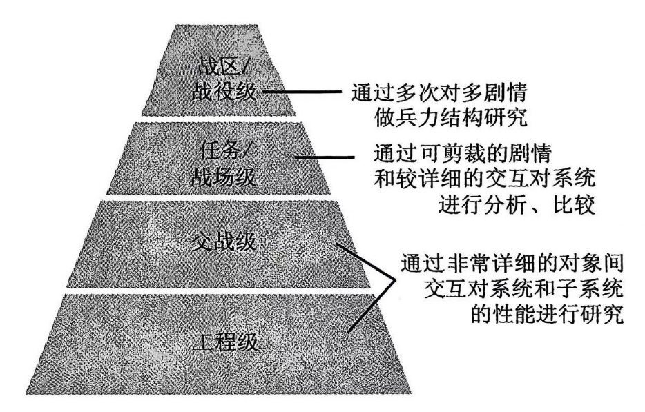
  <figcaption>图 3‑4 军用仿真模型层次结构</figcaption>
</figure>

军用仿真按照参战兵力规模和模型精细程度一般、分为工程级、交战级、任务级、战役级四个层级。工程级仿真的模型主要基于各专业领域的性能分析计算工具，一般由所属的学科领域专题研究。战役级仿真中对装备建模的分辨率很低，大量采用解析模型或数据模型，相关仿真系统建设需求相对集中，建设复杂性相对可控。交战级仿真主要围绕武器装备的一对一、少对少交战开展，一般以装备在典型交战条件下的作战效能为建模目标。任务级仿真主要围绕装备体系的体系对抗展开，主要以装备体系遂行典型作战任务的体系效能为建模目标。交战级和任务级作战仿真都属于体系仿真的范畴，涉及多个学科领域和多样化的建模需求，模型抽象难度大，共享重用需求迫切。

仿真模型建设本质上就是要解决仿真模型的共享重用问题。本文总结国内外针对军用仿真模型建设和共享重用问题的主要做法，可以概况为下列四种：统一模型管理；统一模型框架；统一开发框架；统一模型规范。[^3]

1\. 模型管理

美国空军形成了推荐在空军范围内使用的仿真标准工具集AFSAT，如图所示，其中的模型都是同类模型中各方面表现更好的。图中AIRADE、ALARM、BRAWLER、DREAM、ESAMS、FLAME、REDGUNS
等交战级模型由SURVIAC管理；任务级的扩展防空系统EADSIM
和体系效能分析系统SEAS 在国内有大量应用；战役级的AMOS
模型用于可靠性、可维护性仿真分析，LCOM 模型用于后勤仿真，CFAM
模型用于成本与兵力规模仿真分析，STORM 模型是对HUNDER
模型的升级替代，用于战区多域作战仿真分析。AFSAT
实际上是一个模型分级编目，将有关的作战仿真模型分别划归到交战级、任务级和战役级三个层级，并理清了各个模型间的数据支撑关系，以指导模型用户进行体系化使用。

<figure>
  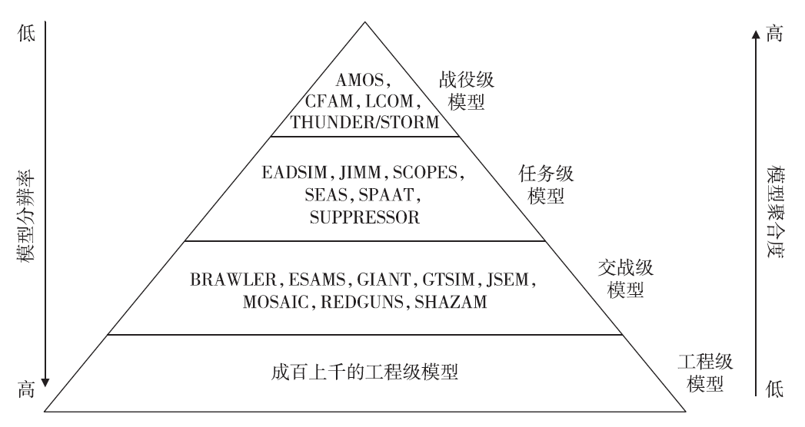
  <figcaption>图 3‑5 美国空军标准分析工具集AFSAT（模型金字塔）</figcaption>
</figure>

统一模型管理的方法从管理的角度操作起来简单直接,但其中管理的模型都是广义的模型概念。在美军的概念体系里，"模型"指的主要是能够直接用于回答应用问题的仿真系统或仿真工具。这类模型在使用时一般不需要进行复杂的开发与集成，有关的仿真模型是基于参数化技术预先开发好的，通过配置参数值即可形成可直接仿真推演的作战仿真模型。使用方可以直接基于该广义模型(仿真系统)进行场景编制、实体部署、任务规划、行为设定等仿真应用层工作，快速解决所需回答的相关问题。

国内目前常用的模型概念更多的是狭义的模型概念------模型组件。例如军用仿真专业组对仿真模型的通行分类为:装备模型、作战模型、评估模型、环境模型，都是模型组件的概念。模型组件一般不能直接用于回答应用问题，而是需要和其他模型组件组合集成、联合运行。

2\. 模型框架

模型框架是每个仿真系统内模型组件体系的软件架构，也称作模型架构（Model
Architecture）。模型框架描述了仿真系统内的模型组件划分及其交互依赖关系，是确保仿真系统内有关模型组件即插即用的关键。对模型框架内各个组件进行开发与集成即形成了即插即用的模型组件体系。

美军的模型体系筹划一般是根据应用领域和仿真层级的不同，分别建设相应的模型体系，并为每个模型体系搭建通用化的模型框架。典型的模型体系例子如面向空海一体作战领域的模型体系CMANO，面向防空反导领域的模型体系EADSIM，面向海战场的模型体系4ACES，面向联合作战的模型体系JAS，面向网络中心战的模型体系SEAS等。

国内在建设模型体系方面差距较大，目前自主研发的通用化模型框架还比较少。近年来不少单位引进了不少外军的模型体系和相应的作战仿真系统，但真正能够坚持其层次定位持续滚动发展的情况还不多，很多引进的模型体系因发展不下去而被逐渐放弃，或退化为一种更容易进行通用化设计的模型开发框架。

3\. 开发框架

模型开发框架是为了简化军用仿真模型开发而提供的建模支撑，包括抽象模型组件接口、常用数据结构、共性算法功能模块、常用模型组件等。开发框架通常不固化具体的装备作战业务逻辑，而是将装备作战领域共有的计算模式在抽象层面进行固化设计，例如实体的组件化装配、行为领域的划分（物理域、信息域、认知域、组织域）、OODA
回路、多Agent
建模、行为树建模等，形成有关的抽象组件框架，预先定义好这些抽象组件的运行调度机制，并建立不同抽象组件之间的交互依赖关系，简化装备作战有关具体模型组件的开发。

国外的开发框架一般由军用仿真公司或体系仿真研究机构维护，如美国MAK
公司的VR-FORCE、TERNION公司的FLAMES、加拿大VP 公司的STAGE、以色列HarTech
公司的SSG、波音公司的AFSIM；国内如华如的XSIM、航天二院的CISE+、海航的HDOSE等，其核心都是一套相对通用的模型开发框架。

4\. 模型规范

针对仿真模型在不同仿真平台中的交换问题，军用仿真领域之外也有一些成功的经验，典型的例子如:欧洲的仿真模型可移植标准SMP、工程物理领域的Modelica
建模语言、DEVS
统一标记语言DEVSML。三者实际上都是通过统一仿真模型的描述规范来实现模型描述与仿真运行平台的解耦。区别在于SMP
主要统一模型的组件化接口规范和模型框架的描述语言，而Modelica
则重点统一仿真模型的行为描述语言和多形式体系执行算法，DEVS-ML
所基于的DEVS 形式体系本身就规定了仿真模型的执行语义，只需进一步统一DEVS
模型描述语言的具体语法即可。

### 模型重用

随着仿真技术在复杂系统论证、研制、分析等领域应用的不断深入和拓展，仿真资源的组合与重用已成当今复杂系统尤其是军事仿真领域的焦点研究问题。仿真模型是最核心的仿真资源，因此也具备最迫切的重用需求。

仿真模型重用分为代码重用、函数重用、组件重用和完全模型重用四个层次。

<figure>
  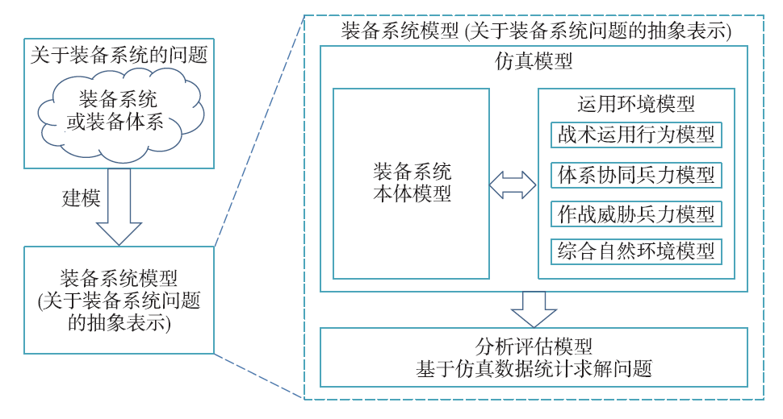
  <figcaption>图 3‑6 装备仿真模型的要素</figcaption>
</figure>

仿真是基于模型对系统进行实验，以回答关于系统的问题。系统是被仿真的对象，是问题的来源，也称作对象系统。模型是对系统的抽象表示，用于回答关于系统的问题。因此，仿真的三要素是系统、模型和实验，三者缺一不可。当要对装备系统仿真模型进行共享重用时，往往要面对如下情况：针对同一装备系统的不同研究问题，不仅仅装备系统本体模型可能不同，而且作战运用环境的模型往往也是不同的，这种不同导致二者在语法语义上的失配，甚至会导致模型共享重用变得不可行，这一点实际上构成了装备系统本体模型（模型组件）难以共享重用的复杂性根源。

模型体系其实就是广义的模型概念。广义的模型是可以直接回答关于系统问题的模型组件集合，不仅包括系统本体模型，而且包含运行环境相关的各模型组件和分析评估模型组件。模型体系在本质上就是一套模型框架约束下的模型组件体系。每个模型体系内部由若干个相互联系、相互约束的模型组件通过特定的运行和交互协议构成一个有机整体，其中的每个模型组件与模型体系内的其他组件以及底层的仿真引擎之间存在复杂的耦合关系。

当前，各家开发的模型组件都深度依赖于所采用的仿真平台。为了建设全局统一可共享重用的模型组件库，需要支持模型组件独立于特定的仿真平台，即需要模型组件跨仿真平台移植运行（几乎是不可能完成的任务）。

## 仿真模型体系

### 模型体系分级

外军关于军用仿真模型分级的对象都是模型体系。美国空军的四层模型金字塔图，其中每个层级中的模型都是模型体系的概念。每个模型体系都包括多类互为体系协同兵力和作战威胁兵力的武器装备模型（蓝军模型）、作战行为模型、综合自然环境模型、分析评估模型，每个模型都实现为一个面向特定领域的综合性仿真系统。

在美军的军用仿真分级金字塔中，不同层级的模型体系或仿真系统实际上是独立设计开发、独立演化发展的，在设计开发时并未考虑与上下级其他仿真系统的接口关系，形成了所谓的"烟囱"。研究人员一般可以通过数据驱动或联合仿真的方式来打通这些"烟囱"，实现跨层级的模型复用，例如基于数据驱动连通BRAWLER
和EADSIM、基于HLA 连通任务级的JWARS 和JMASS等。

装备领域紧密相关的工程级、交战级、任务级三层模型体系以问题为导向的分级建议如下。

工程级模型体系：主要回答在多种典型环境条件下，不同的装备系统结构和设计参数水平的装备性能评估问题，其输出为装备总体和分系统的性能指标数据表，例如发动机推力油耗表、气动参数表、目标特性表、天线方向图、最大过载表等，可以作为交战级模型体系建模的输入。

交战级模型体系：主要回答在多种典型交战条件下，不同装备运用方案、不同装备性能条件下的单装作战效能评估问题，其输出为装备作战效能指标数据表，如雷达威力范围表、对空拦截概率表、导弹射表、命中精度表、诱骗概率表、干扰概率表、毁伤效应表等，可以作为任务级模型体系建模的输入。

任务级模型体系：主要回答在多种典型任务条件下，不同的装备体系架构和单装作战效能水平下的体系效能评估问题，其输出为装备体系任务效能指标。

### 作战实体分类

在作战仿真中，可以将作战体系中的每个组成元素都看作实体（Entity）。实体是作战中可以可单独辨识的个体，如作战单元、作战平台、指挥所、人员、武器装备、目标设施、经济实体、社会组织、人工设施、自然环境和行动计划等，是作战仿真需要描述的基本要素。实体可以指战场中的一个特定个体事物，也可以指对具有相同特征的一类事物。从仿真的角度看，实体是为达到仿真目标而需要的基本建模对象。

实体可由其属性（Attribute）加以描述，其中动态的属性构成了实体的状态（State）。系统内所有实体的状态构成了系统的状态。实体转变某一状态的持续过程称为行动（Action），也可以称为动作。改变状态的行为点称为事件（Event），由多个行动组成的有序任务组称为过程（Process）。

作战仿真中对实体的分类有多种方法。在行为方面，按照实体是否具有自主性，分为智能实体、非智能实体。智能实体是具有一定自主行为能力，在受到内外部条件和环境变化时，具有自主决策选择行为的能力，也可以按照事先设定的行为计划进行决策和行为。作战仿真关注的实体大部分是人机结合体，如指挥所、作战部队、作战平台等。即使无人操纵的武器装备，如无人驾驶飞机等，也具有一定智能的成分，因此都可以将其作为智能实体进行描述。无自主行为的非智能体，其行为完全以外部条件的触发为动因，如港口设施、道路、桥梁等。

按实体的运动属性，将实体划分为动态实体和静态实体两类。前者是需要考虑运动属性（位移、运动速度、运动方向和运动方式）的实体，如作战部队、武器装备等。后者是不需要考虑运动属性的实体，主要指作战自然环境和固定设施，如地形、地物等。

从战场角色的角度，可分为作战实体、环境实体。作战实体是指那些参与作战过程并发挥作用的作战要素。环境实体是作战实体生存的自然和社会系统中的元素，例如大气、电磁等自然环境和社会、经济等人文环境等。

从实体级别的角度，作战实体分为聚合级作战实体和平台级作战实体。聚合级作战实体是指成建制的部队，人是该类实体的主体，通常包括多个可分辨的平台级实体，并且在空间上覆盖一定的面积且具有形状的面。平台级作战实体是指各种武器装备实体，有时操纵武器装备的人也考虑在其中，一般以空间的一个点作为其位置。

作战实体还可分为指挥实体和行动实体。指挥实体是可以进行指挥决策活动的战斗实体，有归其指挥的行动实体并且需要对其进行任务分配。行动实体是执行战斗行动的战斗实体，负责执行上级的命令。指挥实体既可以进行指挥决策活动，同时它还是部分行动的执行者，例如长机、指挥车，因此指挥实体也可以看成是部分的行动实体。行动实体又可细分为战斗行动实体、保障行动实体等。

实体之间还存在搭载与被搭载关系。例如：飞机停靠在机场或航母上，此时逻辑上的两个实体某些方面应作为一个实体来处理，例如被探测、毁伤等。同时搭载还可分为内部搭载和外部搭载，内部搭载时其目标特性不考虑。一类特殊的搭载关系是武器弹药实体和其发射平台，考虑到计算的经济性和使用的必要性，一般将武器弹药实体作为搭载实体处理，即其在发射前，仅作为被搭载实体的一个属性量值而描述。只有在发射后消失前，作为一个独立的实体进行仿真，甚至该实体也具有一定的智能行为。

### 作战实体属性

作战实体是构成作战体系的基本单元，也是作战仿真中描述战场空间的基本单元。作战实体有许多特征，其中一些需要在仿真中用属性来描述，而属性用特征参数或变量表示。哪些实体特征需要作为实体的属性与仿真目的有关，一般可参照下述原则选取：一是便于实体的分类。例如将作战部队的属方（"红"或"蓝"）作为属性考虑，可将战场上的作战部队实体分为红蓝等多类，每类实体占有不同的作战地域，从属不同的国家或联盟，每类之间有敌对、中立、友好等敌我关系。二是便于实体行为的描述。例如将导弹的飞行速度作为属性考虑，便于对"导弹"实体的机动行为（如发射到命中目标的飞行时间）进行描述。三是便于规则的确定，例如作战中要考虑坦克的涉水性能，就要把"涉水性"作为"坦克"实体的一个属性，便于在分析实体能力时遵从相关"涉水规则"。

一般来说，作战仿真中实体的属性可区分为基本描述信息、空间属性信息、物理性质信息、行为属性信息、任务属性信息和效能属性信息等类别。

基本描述信息主要用于对实体进行管理，主要包括实体标识以及相应的实体特性（属方、级别、从属、联系、聚合、解聚、功能、特征分类）等信息。这是仿真中每个作战实体都必须标注的内容，也是作战仿真系统对作战实体进行分类管理的主要依据。

实体空间属性信息是作战仿真需要考虑的重要内容。根据不同任务的需求，作战实体需要描述的空间属性内容也是不同的，一般有以下方面：

（1）空间位置属性，描述作战实体在战场空间中当前具体方位，有地面位置、空中位置、空间位置、水下位置等。位置属性的值会随着实体的运动而不断改变，是一个状态属性，可以采用统一的位置坐标描述。时空作为仿真的基础，在坐标系选择、坐标变换、空间计算等方面都有比较高的要求，同时是导航定位、探测、通信、交战等描述的基础。首先要保证能够计算各实体的空间位置真值，并以真值作为导航定位、探测、通信、交战等模拟计算的输入，同时将导航定位、探测等模型的输出作为对实体自身和其他实体位置的认知值代入后续应用。

（2）外在表现属性，描述实体的外部几何特征，通常有大小、形状和二维三维几何特征，以及实体的各个组成部分与相关联系，如坦克由炮塔、履带等组成，飞机是由机体、机翼、尾翼等组成。实体外在表现特征采用可视化描述时，应尽可能使外观逼真，这时几何特征必须满足比例关系。如人在一幢大楼前面，就不能看上去比大楼还大。实体外在表现的可视化还要描述实体行为、交互的表现效果。例如坦克被击中的冒烟着火，士兵被击中倒地、流血等。外在表现属性需要根据其模型应用者的需求而确定，一般模型应用者包括其他模型和人两类。对人而言，外在表现属性需要支持为可视化仿真，应满足人对真实感的认知，必要时需用动画辅助，以弥补模型数据和可视化需求之间的差异。

（3）物理特性信息，主要描述实体物理属性，如力学特性、电磁辐射、红外辐射、气流特征、物体重力、弹性、摩擦力特性等，具体根据研究的问题确定。例如一架飞机仿真，可能要关注飞行行为、导弹追踪、雷达发现等，其物理特性属性要包括重量、红外辐射、雷达电磁波反射面积等。

（4）行为属性信息，描述实体具有的行为，如机动（前进、后退、转弯）、侦察、射击等，有机动速度、侦察能力、实体火力、行为限制（机动的最大速度、行动最大范围）等属性。实体完成行为必须有相应的设施，所以还需要描述设施完好与否的状态。如坦克进行射击行为，设施是"炮塔系统"和炮弹，因此描述坦克行为时，需要炮塔系统完好程度属性和炮弹存量属性。行为完成需要时间，通常实体的每一项行为关联时间属性。

（5）任务属性信息，主要描述实体执行的任务内容和程度，如实体干什么、目前在干什么，干到什么程度，包括任务的类型、目标、要求、规则以及目前执行的程度等。例如飞机执行轰炸任务，需要描述起飞时间、目标、目前状态等。实体部署到战场时，将赋予其担负的任务，而且这个任务还可以根据作战的进程不断地改变。任务属性与行为属性具有很多联系，需要注意相互的关系。

（6）效能属性信息，根据任务目标对实体能力的描述，即描述实体的作用有多大，如某个实体的战斗力、某种武器的打击效果、某类雷达的侦察效果、导弹的命中概率等，通常用于计算交互的结果，在相应实体效能属性中加以描述。效能属性的选择与作战层次相关，如格斗级常用的效能指标属性是一对一损失交换比。战斗级模型的效能指标属性除损失交换比外，还可能有进攻的推进距离或防御的坚守时间。

属性根据其变化的特征可以分为静态属性和动态属性。静态属性一般不随作战过程发生变化，而动态属性则要随着作战推进活动而不断改变。例如，坦克的最大载弹量是不会改变的，是静态属性；而坦克的油量随着坦克行进不断地减少，是动态属性。作战实体的静态属性反映实体的自身内部的、本质的属性，作战实体的动态属性反映了实体的运动状态。

作战实体的重要动态特征通常称为实体的状态（State），其表征量为状态变量，动态属性集合表征了实体当前状态。作战实体的动态属性集合构成作战实体的状态空间，作战实体在某一时刻的属性值描述了该组织实体在此时刻的状态。而作战体系的状态可以用体系内实体的状态集合来表示。战场上所有作战实体状态集合构成了战场状态空间，战场状态空间随时间变化即形成战场的连续态势描述。

实体是客观存在的，其状态也具有客观性。然而，作战实体状态的选取和表达是主观的，状态变量的选择取决于仿真的目的以及建模者对问题空间的认识和理解程度。对于同一作战实体，不同的观察者可能有不同的状态描述。另外，对于同一实体，其他实体观察到的状态值可能不同。例如，同一架飞机，不同雷达"看"到的位置状态属性值可能会有差异。同一个战场，由于侦察、情报的作用，红蓝双方对本方与对方实体观察到的状态效果也不一样。

在作战仿真中，实体的一组状态变量变化可以表达实体的产生、变化和消亡的过程。例如，一支作战部队可用其所含人员、装备的类型、数量和质量等状态变量予以描述。当从中派出一支执行特定任务的小分队时，则诞生了"分队"这一实体（派生实体），并有相应的状态变量值表征"分队"的存在，"派出"行为也会导致原有实体的状态变量发生变化。在战斗过程中，原有实体和派生实体都将随着人员和装备的补充而增加相应状态变量的值，随着人员和装备的损伤而减少相应状态变量的值，当某些重要状态变量的值低于相应的阈值时，则标志着实体的消亡。

### 作战实体行为

作战实体的行为通过执行动作或行动（Action）、任务（Task）或使命（Mission）来呈现。

实体转变某一状态的过程称为动作，也可以称为行动。动作是由一个事件而引起实体状态的变更或转换，也就是作战实体能够做出的最小具体行为。换句话说，动作是指作战实体所具备的能力或功能属性，是不可分或不必要再分的、最基本的行为要素。它只是一种"自然"行为的过程，不带任何目的性，具有与上下文无关的特性，因此动作的描述可适用于多种相关实体。

动作在语言中一般都是用动词来描述，如移动、操纵、感觉、通信、补充、分析、监测等等。动作一般采用"动词+实体"形式表达其呈现的行为能力，如"发射导弹""探测飞机""操纵潜艇"等，都是动作的典型形式。这种没有主语的行动表示方法，实际上明确的只是行为的本身。一个实体一般都具备执行多种动作的能力，这些动作构成了该实体的行为集合。

对动作的描述就是对行为的建模。对作战实体的哪些动作进行描述，取决于其所研究行为的层次。例如，如果研究的"步兵射击"，其动作可以分解为"拉枪栓""装填子弹""瞄准""射击"等基本动作。但如果研究步兵团进攻，可能的动作就会是"形成进攻队形""进行火力准备""抢占制高点"等，就不会再细化到"射击"这么细节的动作。从另外一个角度来看，动作也可以根据需要分解，也就是动作之中可以还有动作，并可以具有某个特定的动作序列。这种复合动作也可以被称为动作。但针对某个具体研究，动作对研究者来讲，应该是最小的和最基本的。

实体执行动作，需要一定的条件开始，在满足一定的条件后执行。动作开始的入口条件，是实体初始化、开始、重启动或继续一个动作所需要的状态集和事件序列。动作结束的出口条件，是实体终止、中断、结束一个动作所必需的状态集和事件序列。动作的执行还伴随着时间的流逝，有时需要显式描述动作的时间消耗。

一个动作将引起执行动作的实体或是动作作用的实体的状态改变。那些和作战任务、目标相关的状态，往往是作战仿真中关注的重点，而没有引起实体某些状态量改变或消息交换的动作，通常是作战仿真研究者不感兴趣的，这实际上也指明了得到最基本原子动作的标准。

作战实体执行的、具有明确意义的一个或多个行动过程称为任务。相对动作，任务对于军事人员具有明确的军事意义，具有执行的主体、作用的目标和明确无误的意图。任务可以是具有明确的军事意义最小行动单元，也可以由多个任务组成的任务组。

任务有执行的主体，需要通过某个作战实体来完成。例如，"步兵1营攻占3号高地"的任务，执行主体是步兵1营。通常任务的执行过程需要根据一定的顺序和控制来完成。任务的执行都会导致一部分实体之间发生交互并产生状态的变化。在满足入口条件后，实体执行任务先要进行初始化，在执行期间可以接收一个或多个输入，产生一个或多个输出，并且可以改变一个或多个内部状态。任务将持续执行到特定出口条件得到满足。

动作侧重于描述一个作战实体的行为能力。由一个实体完成的一系列动作组成的动作序列，仍然可以看作动作，不管其中每一个小的动作是否针对同一个对象。动作与其执行实体匹配后就构成任务，任务侧重于描述一个具体的行为过程，包括所有动作执行的相关因素和对象，包括主体、客体、时间、条件等等。多个实体作为主体完成的动作只能是任务，因为需要描述这些实体之间以及实体动作之间相互关系。很难将动作序列完全与实体独立地抽取出来，从而形成更大的动作序列。

由多个任务组成、具有特定目的的大型任务或任务集合也称为使命（Mission）。使命与任务的概念非常接近，使命往往具有明确的、高层次的目的特性。使命的执行也需要控制初始化的入口条件和控制终止的出口条件，使命中还应包含目的完成程度的特定性能和效能评估方法。一组具有共同的组织原则、目标或特征的使命集合，称为使命空间（Mission
Space）。所以，有时"使命空间"也称为"任务空间"。

动作、任务、使命都是作战过程中行为的描述，具有递归分解的特征。一个动作可以存在于多个任务中，一个任务可以由多个动作或任务组成；一个使命可以有多个不同实体执行的不同任务，一个任务可以存在于多个使命中。任务中动作的选择必须受限于执行任务实体的能力，不能选择该实体不能执行的动作。

### 作战实体交互

在作战仿真中，描述实体行为的本质作用在于获得其对实体状态的影响，包括对其自身状态和其他实体状态的影响。在作战过程中，每一个实体与实体之间的行动最终都会转化为物质、能量和信息的交换，发生相互作用。交互是由一个实体产生的而作用于另一个实体的一组行为，交互将产生相互作用效果。在仿真建模中，需要将影响交互的每一个因素量化成一个交互参数，并根据这组交互参数来计算实体之间行动的相互作用和影响。也就是说，交互是在实体之间、也就是动作或任务之间定义的接口，动作的作用效果和结果都要通过交互反映出来。

交互中，主动产生并对其他作战实体施加影响的实体称之为主动实体，接受交互并受交互影响的实体称为被动实体。任何实体行为都是在特定的时间、空间环境中发生的，主动实体必然与周围的其他实体存在着各种各样的联系，如物理的、化学的、生物的、心理的和社会的联系等。伴随着行为的进行，主动实体与被动实体之间将有物质流、能量流和信息流的产生与转移，并导致实体状态的变化，激发新的行为和交互。这个过程包括三个阶段：一是主动实体发出一个交互，二是被动实体接受一个交互，三是主动实体和被动实体都根据该交互参数计算各自被影响的效果。

动作引起作战实体自身状态变化，也引起动作作用的对象实体状态的变化。交互是主动作战实体作用于被动作战实体的过程及结果的描述。动作和交互密不可分，它们之间的关系表现在两个方面：首先，动作是一个实体施加于另一个实体的行为，因此它是也仅仅是实体状态变化的外部触发条件，实体的行为过程将决定于实体所处的状态和内部作用机理；另一方面，在实体行为过程中，该实体也将不断地对其他相关实体施加影响，即向其他实体发出交互，因此交互是动作对交互双方或多方作用的结果。

## FLAMES剖析：仿真模型框架

柔性分析建模与演习系统（Flexible Analysis Modeling and Exercise
System，FLAMES）是一款基于商业化开放体系的仿真框架，可以为不同类型的系统提供行为建模和实体建模，以基类集合的方式为系统运行所需的模型提供了继承的基础。

FLAMES是美国Ternion公司20世纪80年代中期开发研制并于2001年公布的仿真开发软件。FLAMES是基于行为仿真的开放式仿真框架软件，其软件本身不能满足用户的具体仿真要求，它仅是一个仿真框架，用户可以在此仿真框架的基础上建立各种装备模型、行为模型和消息模型形成符合自己需求的仿真软件。运用FLAMES可以模拟多种类型系统的行为，它的应用领域包括：新概念武器论证、战术和战役仿真、新战法研究和验证。

FLAMES
的模型体系如图所示，其中，装备模型主要模拟仿真单元中各类装备的功能特性，使之可以与环境和其他仿真单元进行交互。认知模型主要模拟人的决策过程，使仿真单元能够存储、处理来自其他仿真单元的消息并做出决策，可控制加载到仿真单元上的装备模型。所有的装备模型都通过扩展装备模型的平台、天线、通讯装备、传感器、武器系统、电子战、弹药、子系统模型等8个子类而得到。

<figure>
  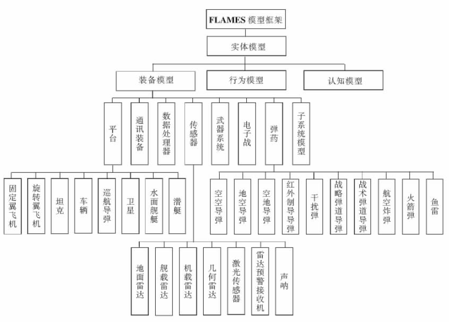
  <figcaption>图 3‑7 FLAMES 的模型体系</figcaption>
</figure>

（1）平台模型，对象实例为抽象的作战实体赋予外部特征和行为属性，使平台具有特定的物理意义，对应军事概念上的某类平台。不同类型的平台具有不同的平台模型，但抽象的平台类描述了各类平台的公共属性与操作。平台类具有固定翼飞机、旋转翼飞机、坦克、车辆、巡航导弹、卫星、水面舰艇、潜艇等子类。

（2）通信装备模型，用于模拟从一个作战实体对象向另一个作战实体对象传送消息的过程，可模拟的过程包括检测通信链路、发送消息、接收消息、处理消息等。实体对象可直接使用合适的通信装备模型对象来模拟通信装备与通信活动。

（3）传感器模型，用于模拟一个实体对象对其他实体对象的发现检测过程。该模型不直接检测实体对象而是检测实体对象上加载的装备对象。根据传感器的类型不同，传感器所能检测的装备类型也有所不同。传感器类具有地面雷达、舰载雷达、机载雷达、几何雷达、激光传感器、雷达预警接收机、声呐等子类。

（4）数据处理器模型，用于模拟处理传感器检测到其他实体时所产生的数据，还用于处理来自于其他实体的消息。通常直接由传感器模型使用，也可由实体模型使用。

（5）电子战模型，用于模拟电子战中通过产生电磁能量来干扰其他实体之间的发送/接收信号的装备机器干扰行为。实体对象或其他具有模拟电磁能量接收行为的装备模型也可直接使用干扰装备对象。

（6）子系统模型，用于被其他装备模型所使用，但具有一定的独立性，可独立完成子装备的固有功能，如雷达或通信干扰设备中所需的天线子系统模型。子系统模型只能被具有子系统的特定实体对象所使用，而不能被实体对象直接使用。

（7）弹药模型，用于模拟在仿真过程中由某个实体对象动态创建的炮弹或导弹飞行并破坏另一个实体的过程。弹药在发射后成为一个独立的对象，即弹药实体，由武器系统实体所控制使用，需继承平台属性、武器系统的部分属性并对其进行扩展。弹药类模型的子类有：空空半主动制导导弹、地空半主动制导导弹、空地半主动制导导弹、空空反辐射导弹、空地反辐射导弹、地空反辐射导弹、红外制导导弹、战术弹道导弹、战略弹道导弹、航空炸弹、干扰弹、火箭弹、鱼雷等。

（8）武器系统模型，用于模拟对弹药的管理、控制与发射，通常平台实体使用武器系统实体，武器系统实体使用弹药实体。

FLAMES
的建模思路是：系统中任何活动的参与者是一个单元，缺省状态下是一个"空壳框架"，不能完成任何作战任务。作战行动通过加载于其上的装备模型和行为模型来定义和操作。

FLAMES
模型体系的构建，在本质上完全使用了面向对象建模方法与技术，对模型尤其是武器装备模型提供了逐层抽象和继承的机制；但在模型的组织管理上借鉴了结构化建模的思路，使得模型的属性、方法、服务和关联都在底层进行封装，而在模型的表现与调用上，体现为经过封装的具有一定军事意义的实体。这样的建模框架为模型开发者提供了足够的扩展空间，可以根据具体需求在任何一层进行扩展，并且通过组件化模型的关联规则和组装算法，在已有模型的基础上得到新的复合模型。

不过，复合模型的开发和使用，其技术难度和工程性能优化的要求均显著高于基础模型。FLAMES模型体系的突出特点是提供了行为建模机制和认知建模机制，具有灵活的扩展能力。

FLAMES
是任务级的作战仿真系统，它的可执行模型称为单元（Unit）。单元本身不具备任何的功能，它只为子模型提供一个组合环境，通过组合装备模型和认知模型来组建具有具体功能的模型。用户可以通过为单元附加认知模型来控制它的移动、感知、通信和决策等，也可以在想定运行时通过添加或删除附加在单元上的装备模型来改变单元的功能。FLAMES
将战场中的对象模型划分为装备模型和认知模型两大类。装备模型分为八个子类：平台模型、通信模型、传感器模型、数据处理模型、干扰装备模型、子系统模型、弹药模型和武器系统模型，每个子类都有自己的属性和方法。认知模型用于模拟人的认知和决策过程，它控制单元内部的装备和数据处理模型，单元的行为完全由它决定。单元的组合通过
FLAMES 自定义的脚本语言描述。FLAMES
在执行过程中通过分析脚本语言自动组建单元。单元的组合无需考虑子模型数据接口之间的耦合，子模型的接口在设计装备模型时已经定义好。

## AFSIM剖析：组件模型体系

先进仿真集成与建模框架（Advanced Framework for Simulation, Integration,
and
Modeling，AFSIM）是一个政府批准的通用的软件仿真框架，用于为作战分析领域构建交战级和任务级分析仿真。2011年，受限于当时政府所有的专用弹性建模仿真工具，美国空军实验室选择了波音公司网络使能系统分析（AFNES）框架作为其分析和技术优化建模与仿真工作的首选框架。2013年，波音公司将此框架无限期地转让给了美国空军实验室（AFRL）。随后，美国空军实验室将其更名为先进仿真集成与建模框架。2021年，美国空军批准信息科学技术公司对该框架进行深入研究。该框架应用程序的主要用途是评估新的和先进的系统概念，并确定这些系统所采用的概念。

该框架能够对参与者的能力进行建模，并控制参与者在空间和时间中的互动。这些仿真可以是构造/非交互式仿真（用户参与仿真，然后在没有交互的情况下运行仿真）或交互式仿真（用户或其他仿真可以控制仿真的某些方面）、非实时仿真（更快或更慢取决于平台组件模型的逼真度）或实时仿真（受实时时钟的倍数限制）、事件步进仿真（仿真根据相关事件的处理进行推进）或时间步进仿真（仿真根据后续时间帧周期中发生的事件进行推进）。

该框架设计为"按原样"通用，因此框架不仅定义了顶层建模概念，还提供了许多具体实现。值得注意的是，许多模型提供了不同级别的细粒度或逼真度，以减少非精细化仿真对计算能力的需求。除了开发人员和用户社区提供的所有模型外，框架附带的标准模型示例包括运动模型、传感器系统、武器系统和毁伤效果、通信系统、信息处理系统（跟踪器等）、决策系统（指挥与控制、导弹制导等）、天线方向图模型、大气衰减模型、信号传播模型、杂波模型、电子战效果模型等。

该框架还具有可扩展性，支持方便地继承上述类型的模型，并提供全新的功能。由于先进仿真集成与建模框架是一个提供了仿真细节和服务的框架，从而使开发人员可以不用实现框架的抽象接口，而专注于添加所需的新功能。此外，该框架的基于组件的体系结构提供了将几乎所有新的建模功能清晰、通用地集成到框架中的能力。一旦合并，模型就和任何标准模型一样成为框架的一部分。该框架还可以选择不同逼真度级别的模型和数据，以优化性能平衡。

1．AFSIM框架

AFSIM
的面向对象C++架构提供了一个可扩展和模块化的架构，允许轻松集成许多附加功能。AFSIM
允许在框架中插入和使用新的组件模型（例如传感器、通信、移动设备等），以及全新的组件类型。扩展和插件是扩展框架以集成新的平台组件模型、新的和扩展的平台能力以及新的和扩展的仿真服务的主要机制。插件功能是一种扩展形式，允许在不重新编译核心AFSIM
代码的情况下添加功能。使用插件可以更轻松地分发扩展功能，并提供选择在特定分析中使用哪些扩展功能的能力。AFSIM
主要框架组件和提供的服务如图所示，这些组件和服务可以被扩展。

<figure>
  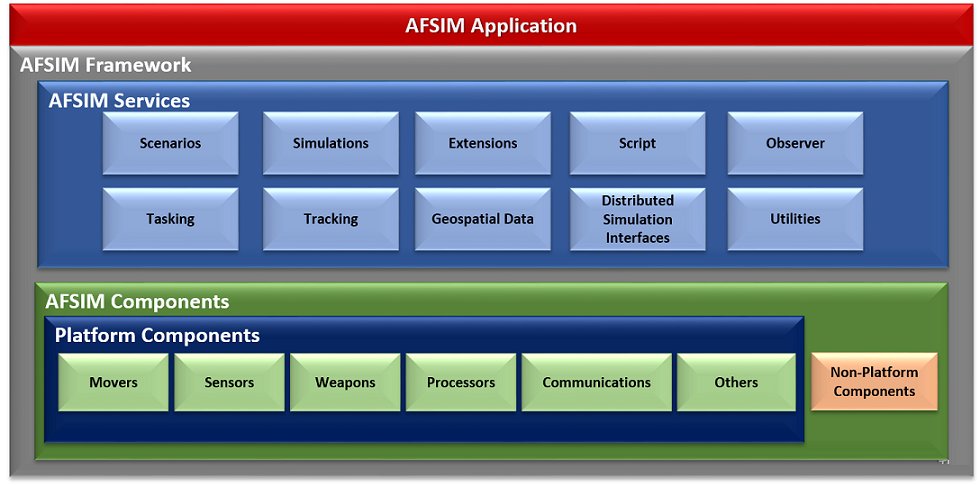
  <figcaption>图 3‑8 AFSIM框架和组件</figcaption>
</figure>

2．核心服务

AFSIM 提供了处理和支持仿真执行及其他常规计算和基本功能的能力：

Scenarios，提供场景输入处理、类型列表和脚本。

Simulations，提供基于时间的事件处理并维护平台列表。

Extensions and Plug-Ins，提供添加新服务和组件的通用方法。

Script，提供实现和扩展 AFSIM 脚本语言的基础设施。

Observer，提供用于从仿真中提取数据的通用发布-订阅服务。

Tasking，允许进行跨平台任务分配和行为建模。

Tracking，允许从传感器测量中生成轨迹，并进行轨迹关联和融合。

Geospatial，提供地形和视线数据。

Distributed Simulation
Interfaces，仿真接口应用接口标准以实现仿真互操作性（IEEE 1278 和
1516）。

Utilities，提供地球模型、坐标系、数学例程、人工智能结构等。

<figure>
  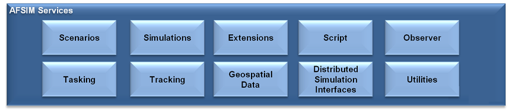
  <figcaption>图 3‑9 AFSIM服务</figcaption>
</figure>

3．平台 WSF_PLATFORM

AFSIM
中所有能够部署的装备都是基于一个平台，比如一艘舰，一个飞机。而平台是由组件构成，比如舰上的导弹就是一个组件。组件无法独立成为一个可布置的单位，只有形成平台才是可布置的。平台是其构成组件的"容器"。

<figure>
  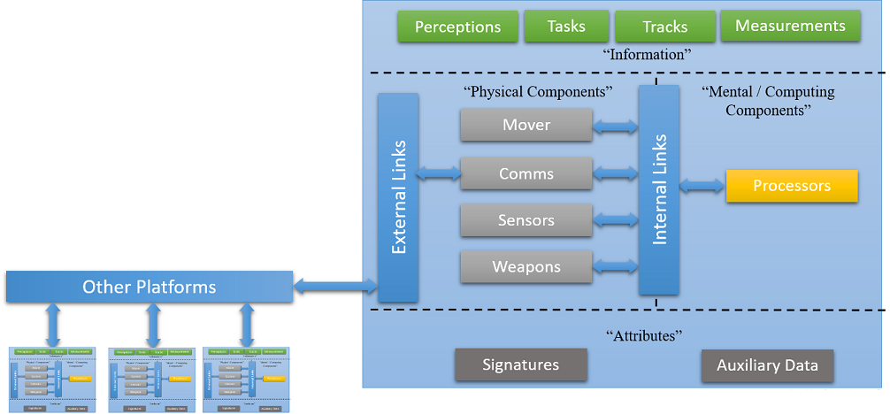
  <figcaption>图 3‑10 AFSIM平台组件</figcaption>
</figure>

Mover：维护着它所附着的平台的动力学状态（位置、方向、速度、加速度等）。运动组件有多种选项，范围从地下到空间动力学模型。

Comms：通信设备通过外部链路在平台之间发送和接收消息。AFSIM支持有线和无线设备，使用发射器、接收器和天线来捕捉通信系统的全部物理方面。

Sensors：传感器创建测量值并通过链路在轨迹消息中传输它们。在AFSIM中，传感器经常使用发射器、接收器和天线。AFSIM提供雷达传播、衰减、杂波和误差的多种选项。

Weapons：武器是旨在阻止其他物体运行（永久或暂时）的装置。在AFSIM中，大多数武器是显式武器，即对象被明确建模为平台（如导弹和炸弹），与隐式武器相比，后者在模拟中不作为平台表示（如干扰机或激光器）。

Processor：处理器定义行为或计算算法，类似于人脑或计算机。大多数处理器由用户使用AFSIM脚本语言定义，但AFSIM也提供了许多专用处理器。

4．组件

如图所示是主要组件模型的层次组织结构。

图 3‑11 AFSIM组件模型

<figure>
  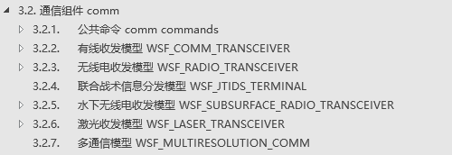
  <figcaption></figcaption>
</figure>

<figure>
  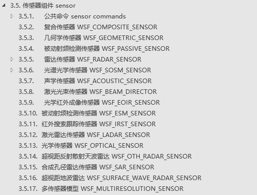
  <figcaption></figcaption>
</figure>

<figure>
  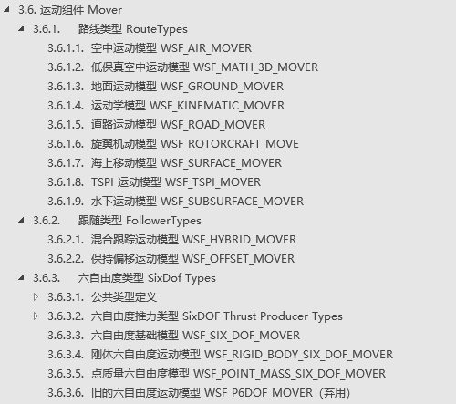
  <figcaption></figcaption>
</figure>

<figure>
  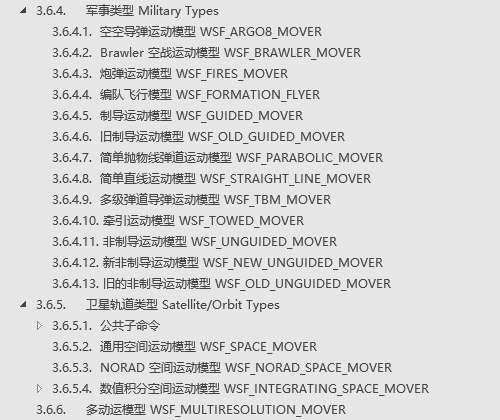
  <figcaption></figcaption>
</figure>

<figure>
  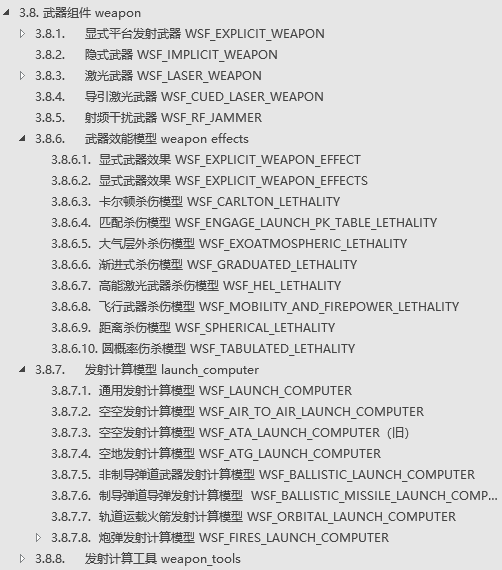
  <figcaption></figcaption>
</figure>

<figure>
  
  <figcaption></figcaption>
</figure>
