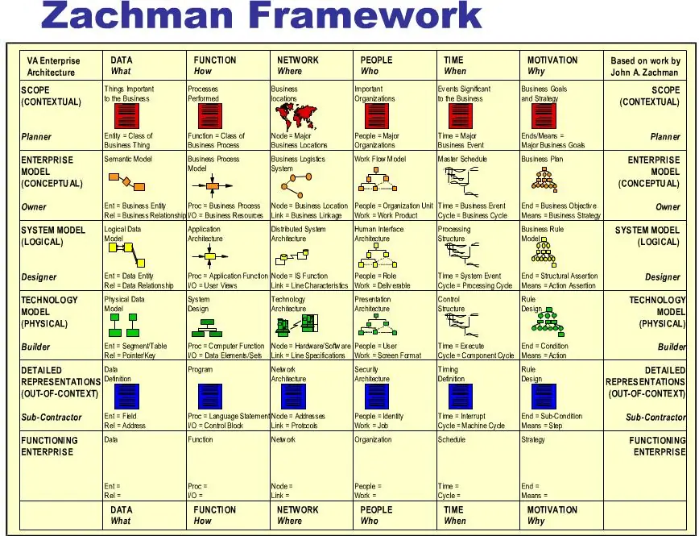
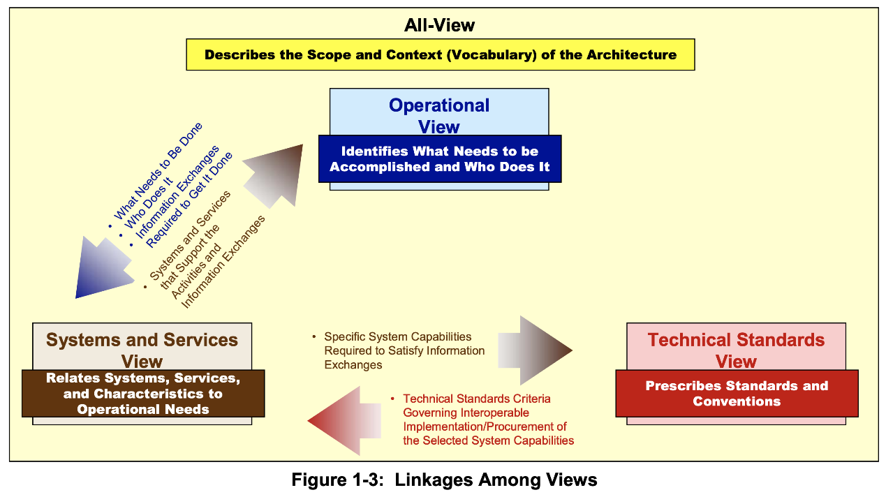
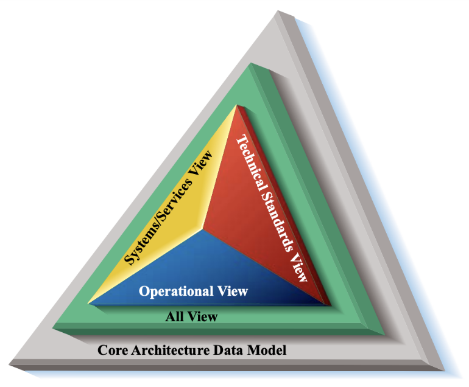
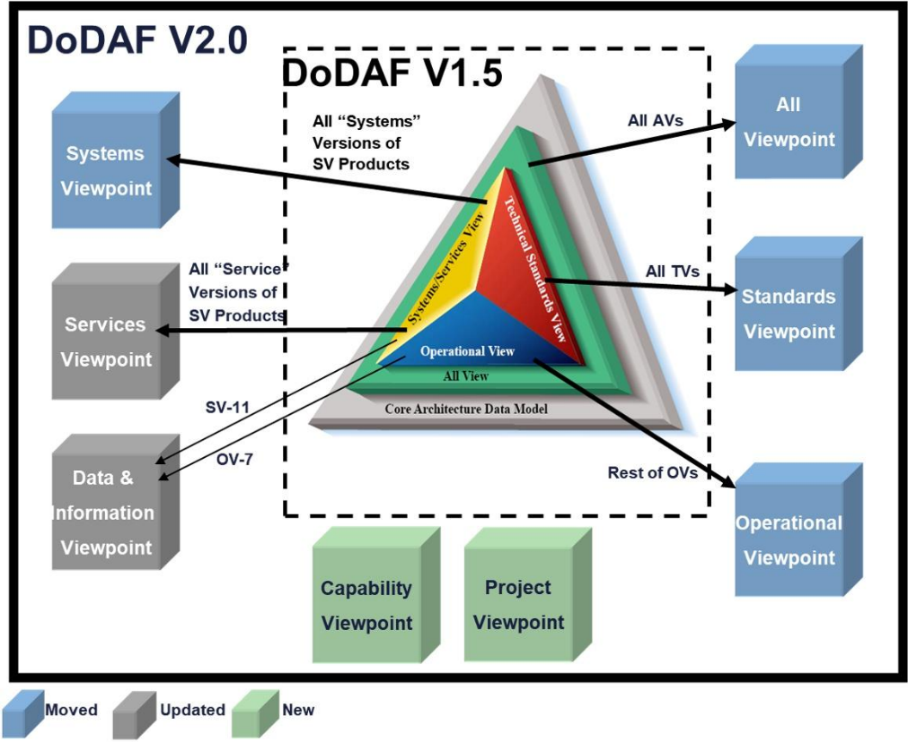
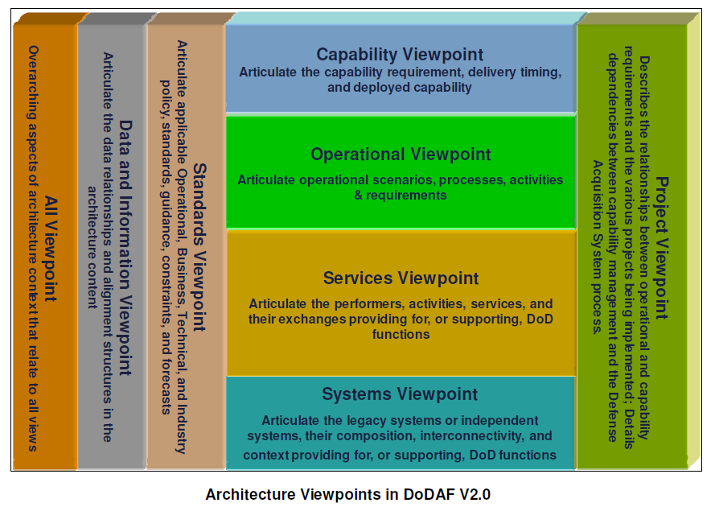
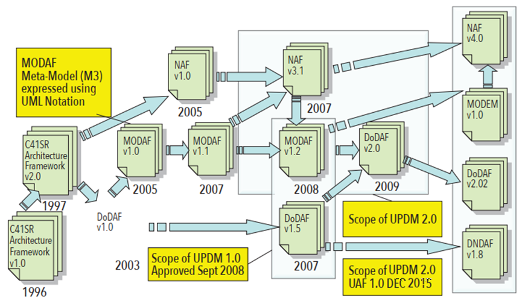
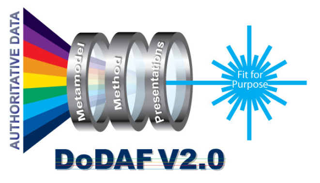
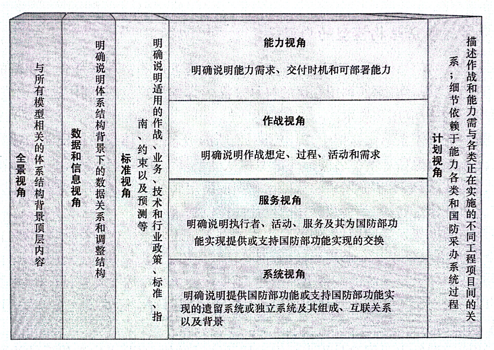
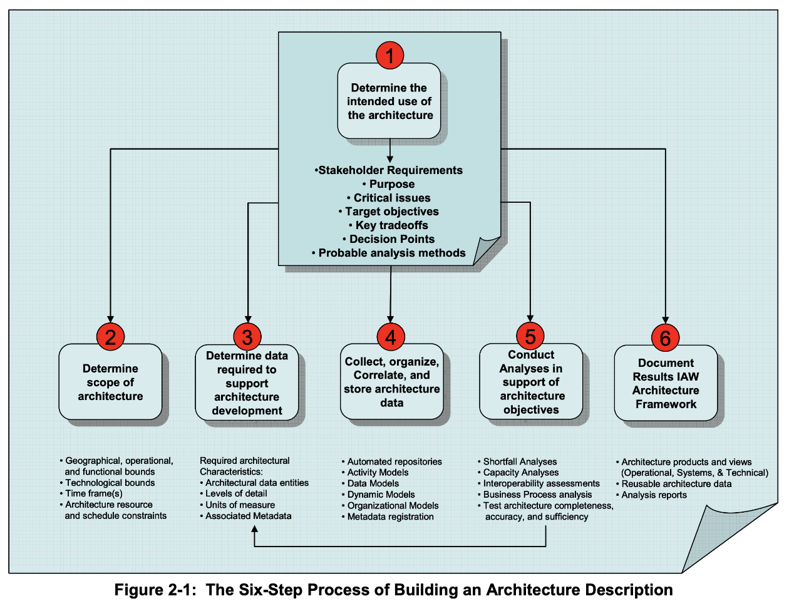
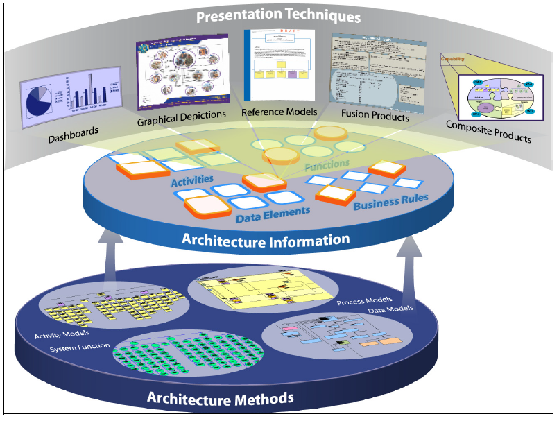

# 体系结构框架DoDAF

【摘要】正确理解并建立体系结构、架构、体系结构框架的概念和内涵，介绍美国国防部体系结构框架的发展，学习了解DoDAF
v2.0的主要内容，例如8个视角和52个模型。

【关键词】 体系结构，架构，体系结构框架，DoDAF

【参考书目】

▲梁振兴，沈艳丽等，体系结构设计方法的发展及应用，国防工业出版社，2012.12

王月星，鄢家志，缪炜星编著，基于模型的联合作战业务，航空工业出版社，2023.4

\[美\]Tim
Weilkiens等编著，李浩敏等译，基于模型的系统架构，上海交通大学出版社，2021.4

------------------------------------------------------------------------

## 体系结构框架重要概念

### 体系结构/架构

"体系结构"一词源自"Architecture"的翻译，是一个外来术语。体系结构是按照确定的规则把各组成单元集成在一起而形成的有机整体。对体系结构的这种阐释的关键是具有特定结构的体现某种意愿的事物和针对该事物的有思想、有目的、有条理的方法。国内通常也称为"架构"。我们认为"体系结构"等同于"架构"，都是Architecture。

例如，建筑设计源于对需求可靠的、有条理的推理，包括建筑物业主的想法、地基要求、法律约束、财政约束、技术限制、未来住户的要求以及与建筑相关却不能立即显现出来的方方面面。换句话说，上述所有这些需要考虑的因素都是该建筑体系结构设计必须考虑的立场、观点和视角。而要把每个立场、观点和视角表示清楚还必须确定与其相关的众多特征量，这些特征量可以用模型来表示。表示特征量的模型填充上一个特定建筑的数据后就能生成该特征量的具体描述结果，将所有描述结果集成在一起就是该建筑的体系结构。因此，体系结构是一种实用的、有条理的部件集合的结构形式。该结构通过对部件集合多视角精确描述结果的集成对用户愿景提供支持。

"体系结构"的正式定义。1990年，IEEE Std 610.12
把体系结构定义为"系统或其组成部分的组织结构"。1995年，美国国防部集成体系结构专家组在
IEEE Std
610.12定义的基础上把体系结构定义为："各组成单元的结构、它们之间的关系以及制约它们设计和随时间演进的原则与指南。"2000年，IEEE
Std
1471-2000对体系结构的定义又进行了修订，新的定义为："**体系结构是描述一个系统的组成单元的基本结构、它们彼此之间和与环境之间的关系以及指导系统设计与扩展的原则。**"比较这些定义可以得出，不管体系结构定义如何细微变化，但其始终包括三个核心要素，即组成单元的结构、相互关系（含与环境的关系）、制约它们的原则与指南。

如何理解和具体化上述三个核心要素呢？利用后面将阐述的体系结构视角和描述模型说明三个核心要素。组成单元的结构可以用系统视角的多个模型来描述。例如，利用系统接口描述（SV-1）模型可以描述需要连接的系统节点、系统节点中包含的系统以及连接这些系统节点的接口等三方面对组成单元的结构进行描述。组成单元的关系可以用描述系统视角与作战视角之间关系的模型来描述。例如，系统接口描述中的系统节点是为了支持作战节点承担的活动或任务而设置的，通过这些系统节点实现组织资源的交换或流动。再如，还可以用作战活动对系统的追溯矩阵来描述系统功能对作战活动的映射关系。而原则和指南则可以用描述系统构想、目标、目的、背景和需求的模型将原则和指南具体化。

电子信息系统的体系结构开发和系统设计的目的不同。体系结构开发的主要目的和用途是以下四个方面：①采办决策；②分析不同选择方案的差异，选择合适的解决方案；③确定与发现准确的需求，为计划视角、服务视角、标准视角和系统视角提供了论证基础；④推进多个系统的综合集成，实现共同的应用目标。

系统设计的主要目的和用途是以下三个方面：①开发系统的各个组成单元；②构建该系统；③根据系统的修改，理解配置的变化。

【思考】 "体系结构"是不是"体系"的"结构"？

### 体系结构框架（AF）

体系结构框架即"Architecture
Framework"。"框架"比喻事物的基本组织、结构，与体系结构组合在一起应解释为"体系结构的基本组织、结构"，落脚点是基本结构。

事实上，体系结构框架本身不是体系结构，它是体系结构开发的顶层的、全面的、通用的指导性、规范性的文件，是开发特定体系结构应当遵守和执行的特别指定的文件。换句话说，体系结构框架是开发体系结构描述的有用的方法、实践和程序等内容组成的文件。体系结构框架全面、系统地规范了体系结构描述的关键概念，统一了体系结构描述的重要定义和术语，提供了体系结构开发的方法和模型，规定了体系结构描述的指导原则和程序，明确了支持关键过程决策所需的体系结构数据和信息。因此，体系结构框架是体系结构开发的规范、指南和工具，全面、系统地阐述、规定了开发和表述体系结构过程中常用的方法、模型、指导原则、规则、体系结构视角以及描述模型，为特定的体系结构开发、理解、比较和综合集成提供了一个共同的基准。为了加深对体系结构框架内涵的理解，下面特别引用一些组织对体系结构框架的论述。

开放组织认为，体系结构框架是一种工具。它描述了用一系列构建模块来设计一个信息系统的方法，并说明了这些构建模块如何彼此镶嵌拟合。体系结构框架包含了一系列工具，提供了公共术语。体系结构框架包含与构建模块配套的推荐使用的标准和相应的产品列表。

美国国防部体系结构框架DoDAF
v1.0认为，国防部体系结构框架定义了描述、表示和比较国防部企业体系结构的通用的方法，有助于使用通用的原则、假设和术语。其主要目标是，确保体系结构描述跨组织边界，包括联合边界和多国边界，能够比较和建立联系。

DoDAF
v1.5和v2.0则认为，体系结构框架是体系结构开发的顶层的、内容全面的架构和概念模型，为构建、分类和组织体系结构提供了指南和规则。体系结构框架将体系结构概念、原则、假设和有关运行与技术的术语组成为一种有意义的模式，以满足国防部的特定目的。DoDAF定义了一种表示企业体系结构（EA）的方式，使各级决策者在关注本企业内部的重要相关领域的同时，也能保持对大局的把握。开发DoDAF的目的是：为满足国防部特殊的业务和作战需求。为了帮助决策者进行决策，提供了从正在发展的复杂事物中提取基本信息的手段，还提供了一致的和连续的信息表达方式。其重要目标之一是，用各种支持各级决策使命任务中所涉及的能力开发、交付和维护的利益相关群体都可理解的方式来表示获取的信息。

需要再次强调，体系结构框架不是体系结构，其中的"框架"一词不能省略，省略就会改变性质和本质。例如，很多人对体系结构框架中的"框架"一词不理解，省略"框架"，导致本质性错误，误以为C4ISR体系结构框架是在研究一个特定的C4ISR
系统的体系结构，而完全忽略了它是在规范开发C4ISR
系统体系结构的通用的统一的指导原则、程序、方式方法和描述模型等。

体系结构框架的作用：

（1）利用体系结构框架既可以开发整个企业的体系结构，也可以开发小型系统或分系统的体系结构。

（2）体系结构框架使各级管理者能够打破联合能力域的界限、部门界限或项目界限，实现有序的信息共享，提高关键的决策能力。

（3）体系结构框架统一了描述体系结构的关键概念，确定了一个体系结构描述起码应当从作战需求、系统总体和技术标准三个视角进行描述与设计。系统需求表述清楚、完整，是将研制的系统能够符合需求的前提；将研制系统的总体方案（或初步方案）论证充分是检查、判断该系统研制出来后能否符合需求的基础。由此可以得出，体系结构框架对需求表述和总体方案论证的成功将起决定性的作用。

### 企业体系结构（EA）

在体系结构框架中，经常使用"企业"（Enterprise）一词。深入理解其内涵、理解为什么将美国联邦政府中的各个部（如国防部，DoD）等高层机构称为企业是非常重要的，这是研究企业体系结构的基础。

在一般意义上，企业是指有一组共同目标或是有单一底线的多个组织的任意集合。根据这一定义，整个国防部、国防部中的军种部、军种部中的某个部门、某个地点上的一个组织，或是通过共同管理或目标而连接起来的在地理上分散的组织链，都可以称之为企业。从这样的意义上看，企业实质上是支持确定业务范围与使命任务的组织或跨组织的实体。企业包括相互依存的一些资源，如人、组织和技术。在支持共同的使命任务或一系列相关使命任务的过程中，这些资源必须协调其功能，并共享信息。

实际上，任何一个组织，不管是军事组织还是政府组织甚至是民间组织，都可以抽象为一个企业。它们从纵向按照领导或隶属关系可以分层；从横向可以按照功能或职责分割成不同的板块，每个板块主管一定的业务领域或项目。

根据以上的论述可以看出，企业只是一个代名词，其实质是指一个大型组织，具有明确的目标和使命任务，其所指泛化、广义化、抽象化。企业不再是我们日常生活中常说的从事生产、运输、贸易等经营活动的狭义的部门。掌握了企业的这一实质，就易于理解开发企业体系结构框架的重要意义。

在我国，对"Enterprise"一词的内涵和翻译一直存在争议，有多种不同的认识和观点。多数情况下译为"企业"，有的学者主张译为"复杂组织体""使命组织"或"体系"，但未达成普遍共识。

许多企业系统拥有相同的体系结构实现途径，即使它们的体系结构表示方式不尽相同。相同或相似的体系结构实现途径涉及多种技术、模式和设计，企业体系结构被看成是通过业务相关群体（COI）提供的以面向"数据为中心"的方式来透彻地理解广泛的数据、项目和活动。

在体系结构框架中，企业体系结构的出现不是偶然的，有一个不断发展演变的过程。最初，美国国防部是为了定义和开发一些更好的方法和程序，确保C4ISR
系统的能力能够满足作战人员的需求。因此，开发了《C4ISR
体系结构框架》。该框架实质上是一个项目级或解决方案级体系结构框架。应用实践证明该框架层次比较低，存在许多不足，不能完全满足部门决策的要求。例如，美国国防部太大而且太复杂，用单一的解决方案体系结构很难描述清楚。为了全面描述它，架构师不得不把美国国防部负责的任务抽象为多个简单的组成单元或板块。虽然简单组成单元的体系结构易于开发，但它们本身又不能支持范围广泛的涉及整个国防部的决策。因此，需要一个层次比较高的、反映部门或领域的需求并直接支持联合能力集成与开发过程决策、国防采办决策、组合管理以及规划、计划、预算和执行等宏观决策的整体性的体系结构。在这样的大背景下，美国首先提出了企业体系结构（Enterprise
Architecture，EA）的概念。企业体系结构有以下多种内涵。

（1）组成元素。根据美国联邦政府管理和预算办公室的定义，企业体系结构由业务过程、信息流、数据描述、应用、技术基础设施和标准等元素组成。企业体系结构还应包括基线体系结构、目标体系结构和过渡战略等。

（2）描述内容。企业体系结构是对企业各个组成部分的结构和功能、它们之间的相互关系，以及指导它们设计和演进的原则与指导方针的规范的描述。企业的各个组成部分可以是组成企业的任何要素，可以包括人员、流程、物理结构以及工程与信息系统。企业体系结构与管理和理解复杂事物有关。企业体系结构涵盖了如何通过技术和作战能力来满足业务需求与作战需求。企业体系结构关系到组织以及支持该组织的系统提供蓝图或模型的方方面面。

（3）体系结构及信息。企业体系结构是一个集成概念，是跨学科的、要求在技术团体内部和外部拥有多种不同的技能、方法和工具。企业体系结构集中关注根据作战需求和业务需求，企业如何规划在技术方面的投资。企业体系结构与高层指南和战略规划协调一致。企业体系结构的重要作用是提供决策支持，以便在企业战略的背景下，充分利用企业的资源。

（4）目标和目的。企业体系结构的顶层目标是管理复杂的企业、调准其业务战略和执行过程，促进其快速变化，以便保持企业的业务优势和技术优势；企业体系结构的主要目的之一是描述整个企业，因此，决策人员能够基于共同的背景进行依据充分的决策。为达此目的，将开发能够黏合的企业体系结构，保证体系结构的重新排列组合与集成，支持企业的业务与作战战略的目标；企业体系结构的关键作用是使体系结构的诸组成部分都提供该企业的整体图像，并提供推进企业设计、开发、沟通与理解的机制。

综上所述，企业体系结构实质上是表示一个组织或一个领域的体系结构。企业体系结构/企业架构（EA）是一个概念蓝图，用于进行企业分析、设计、规划和实施，始终使用综合方法，以成功制定和执行战略。

### 扎克曼框架

扎克曼框架（Zachman
Framework）是企业体系结构框架，是一个企业本体，它提供了一种从不同角度审查和定义企业高级结构并显示企业组件之间关联的正规方法。扎克曼框架也是用来组织体系结构的工件的分类方法。工件包括设计文件、规范和模型等。

分类法考虑了两个方面的问题，一是工件给谁用，二是要处理什么样的特殊问题。经过不断扩展与完善，最终形成的扎克曼框架由二维分类矩阵组成，如图所示。第一维（列）表示6个沟通问题（5W1H），即什么（What）、何处（Where）、何时（When）、为什么（Why）、谁（Who）和如何（How），它们形成了矩阵的列；第二维（行）表示6个特定视角对企业的描述，利益相关者通常被分组为规划者（Planner）、拥有者（Owner）、设计者（Designer）、建设者（Builder）、分包商（Sub-contractor）、运行用户（User），同时对应为6个层次观点，即范围（上下文）、企业模型（概念）、系统模型（逻辑）、技术模型（物理）、详细规范（out-of-context）、用户层，它们形成了矩阵的行。行与列的交集称为单元格。

<figure>
  
  <figcaption>图 4‑1 扎克曼框架（二维矩阵）</figcaption>
</figure>

扎克曼框架是一个简单的逻辑结构，用来分类和组织企业的表示方法。扎克曼框架是一个多视角、多焦点的有强大内涵的分析工具，它用一组模型集合表示企业体系结构的各个方面的性质，提供了理解复杂体系结构的通用的脉络，并能够保持不同利益相关者（Stakeholder，也叫干系人）之间的沟通。

"扎克曼框架"这个术语有多重含义。可以把它看成是约翰•扎克曼（John
Zachman）建议的任何一种框架。其初始框架命名为"信息系统体系结构框架"，1987年约翰•扎克曼在IBM系统杂志上发表，后来有多个版本。扎克曼框架的提出促进并带动了其他框架的发展。

+----------------+--------------+--------------+--------------+------------------------+----------+--------------+--------------------+
|                | 什么         | 如何         | 何处         | 谁                     | 何时     | 为什么       |                    |
|                |              |              |              |                        |          |              |                    |
|                | What         | How          | Where        | Who                    | When     | Why          |                    |
+================+==============+==============+==============+========================+==========+==============+====================+
| 规划者         | 物资清单     | 过程清单     | 地理位置清单 | 组织单位和角色         | 事件清单 | 目标清单     | 范围               |
|                |              |              |              |                        |          |              |                    |
| Planner        |              |              |              |                        |          |              | （上下文）         |
+----------------+--------------+--------------+--------------+------------------------+----------+--------------+--------------------+
| 拥有者         | 实体关系模型 | 过程模型     | 位置模型     | 组织单位和角色关系模型 | 事件模型 | 目标关系模型 | 企业模型           |
|                |              |              |              |                        |          |              |                    |
| Owner          |              |              |              |                        |          |              | （概念）           |
+----------------+--------------+--------------+--------------+------------------------+----------+--------------+--------------------+
| 设计者         | 数据模型图   | 过程图       | 位置图       | 角色关系图             | 事件图   | 规则图       | 系统模型           |
|                |              |              |              |                        |          |              |                    |
| Designer       |              |              |              |                        |          |              | （逻辑）           |
+----------------+--------------+--------------+--------------+------------------------+----------+--------------+--------------------+
| 建设者         | 数据实体规范 | 过程功能规范 | 位置规范     | 角色规范               | 事件规范 | 规则规范     | 技术模型           |
|                |              |              |              |                        |          |              |                    |
| Builder        |              |              |              |                        |          |              | （物理）           |
+----------------+--------------+--------------+--------------+------------------------+----------+--------------+--------------------+
| 分包商         | 数据细则     | 过程细则     | 地点细则     | 角色细则               | 事件细则 | 规范细则     | 详细表现           |
|                |              |              |              |                        |          |              |                    |
| Sub-contractor |              |              |              |                        |          |              | （out-of-context） |
+----------------+--------------+--------------+--------------+------------------------+----------+--------------+--------------------+
| 用户           |              |              |              |                        |          |              | 操作运行           |
|                |              |              |              |                        |          |              |                    |
| User           |              |              |              |                        |          |              |                    |
+----------------+--------------+--------------+--------------+------------------------+----------+--------------+--------------------+
|                | 数据         | 功能         | 网络         | 人员                   | 时间     | 动机         |                    |
|                |              |              |              |                        |          |              |                    |
|                | DATA         |              |              |                        |          |              |                    |
+----------------+--------------+--------------+--------------+------------------------+----------+--------------+--------------------+

## 国防体系结构框架发展现状

指挥、控制、通信、计算机与情报（C4I）系统为指挥员提供战场信息，以便做出决策、控制军事力量达成使命任务。C4I系统必须适时提供丰富的信息使指挥员能够向相关兵力发出命令，才能有效执行其任务。因此，必须认真考虑C4I系统的设计，重要问题之一是选择合适的建模工具和框架。

首先介绍了几种不同的体系结构框架，包括美国国防部体系结构框架（DoDAF）、英国国防部体系结构框架（MODAF）、北约体系结构框架（NAF）等。这些框架重点是国防领域的应用，大多用来作为C4I系统的设计与开发工具。

美国国防部体系结构框架（The Department of Defense Architecture
Framework,
DoDAF）是美国国防部于2003年正式颁布的用于指导美军开展系统集成设计和项目研发的标准规范。该体系框架以美军C4ISR体系结构框架为基础，经过长期的标准化、模型化和体系化过程，逐步成为美军联合能力集成与系统开发的标准，目前已经发展到V2.02版本。DoDAF组织企业体系结构为4个基本的视图，包括全视图（AV）、作战视图（OV）、系统视图（SV）和技术标准视图（TV）。MODAF、NAF
和TOGAF
等框架都是从DoDAF演变来的。DoDAF作为大系统集成或者系统的系统（System of
Systems, SoS）的参考模型得到较为广泛的认可。

本文将介绍C4I系统集成体系结构框架的发展，重点关注最新版本的DoDAF
V2.0带来的变化，包括其开发的指导原则和技术途径等。其中很多思想方法可供C4I系统集成体系结构设计者参考借鉴。

### DoDAF的发展

体系结构设计是复杂大系统设计中不可缺少的内容，是保证系统之间可集成、可互操作的关键环节，应用领域广泛。在美军各部门研制C4ISR系统时就根据各自需要开发了不同的体系结构，导致其内容不统一，设计文档不规范，使用的术语不一致，很难实现多个C4ISR系统之间的集成和互操作。经过深入研究，美军认识到，C4ISR系统要实现互连、互通、互操作必须建立C4ISR体系结构框架（AF）。因此，美国国防部（DoD）从1991年开始相继研究、制定并颁布了《C4ISR体系结构框架》和各种体系结构通用参考资源，以统一已有的各种体系结构设计工作。从最初的C4ISR体系结构框架到现在的DoDAF，已经制定了多个不同的版本，并且仍在修订中。

<figure>
  
  <figcaption>图 4‑2 OV、SV和TV之间的关联</figcaption>
</figure>

其中第一个版本是1996年6月公布的由C4ISR集成任务委员会（ITF）开发的C4ISR体系结构框架1.0版。该框架建立在当时已有的各种体系结构开发实践基础上，首次统一了美军C4ISR系统体系结构的描述方法。其主要内容是规定用作战视图（OV）、系统视图（SV）和技术视图（TV）描述系统，如图所示。

之后，C4ISR体系结构工作组（AWG）在框架1.0版开发使用经验的基础上，于1997年12月发布C4ISR体系结构框架2.0版。1998年2月，国防部要求"所有正在建设的或计划中的C4ISR系统或相关系统的体系结构都将根据2.0版本来开发。"在这一阶段，框架2.0版得到了广泛的应用，如被用来开发联合作战体系结构（JOA）、陆军企业体系结构（AEA）、全球指挥控制系统（GCCS）作战体系结构等，并且，针对框架2.0版进行的体系结构设计方法、验证方法的研究也取得了很大的进展。

2003年8月公布的DoDAF
V1.0，正式将体系结构框架改名为DoDAF，将在C4ISR体系结构框架基础上发展而来的体系结构框架应用领域扩大为国防部所有任务领域。同时也标志着其信息系统体系结构框架的成熟。

<figure>
  
  <figcaption>图 4‑3 DoDAF v1.5的视图</figcaption>
</figure>

在2007年4月美国国防部又公布了新版本的DoDAF V1.5。该版是以DoDAF
V1.0为基础，结合国防部在不断使用和改进体系结构过程中获得的经验演变而来的版本。这个过渡版本在其体系结构描述中对于如何反映网络中心的观念给出了更多的指导，其中包括了关于体系结构数据管理以及联合体系结构的信息，在体系结构描述中增加了几个产品。

DoDAF
V1.5定义了用于体系结构描述、开发、表示和系统集成的通用方法。通过4个视图、26个产品和1个模型（核心体系结构数据模型，CADM）分别从不同角度描述系统体系结构的构建。但DoDAF只提出设计符合该框架的若干指导原则，并未提供开发体系结构产品的方法和详细过程。

目前的最新版本是2009年5月公布的DoDAF
V2.0，2010年8月发布的V2.02将多卷本合并为一卷本。与以前版本比较而言，新版本的集成体系结构在思想和方法上都有较大改变：DoDAF
V2.0的重点是体系结构数据，而不是以前版本中描述的一个个"产品"；体系结构描述中的数据定义必须遵循DoDAF元模型（DM2）；体系结构数据由"模型"完成，DoDAF
V2.0定义有8个视角、52个模型；DoDAF
V2.0的核心是以数据为中心的方法途径，不再要求任何特定的图形化设计；为了支持分析和决策，需要开发综合的、可搜索的、结构化的体系结构数据集（如注册库或知识库）。

<figure>
  
  <figcaption>图 4‑4 从DoDAF V1.5到V2.0</figcaption>
</figure>

<figure>
  
  <figcaption>图 4‑5 DoDAF V2.0的视角</figcaption>
</figure>

体系结构技术成为包括C4I系统等武器装备顶层设计的重要手段。美军在DoDAF及支撑技术的研究基础上，已经制定了全面的发展规划，推进体系结构的开发和应用。我军也应该积极开展体系结构框架及相关支撑技术研究，促进体系结构工具、数据模型、知识库等得到不断发展完善。DoDAF的发展所反映出的集成体系结构开发思想和方法值得我们借鉴。

### 其它体系结构框架

目前已经发布的体系结构框架有近20种。除美国以外的多个国家和组织也很重视发展集成体系结构框架，如英国（MODAF）、北约（NAF）、加拿大（DNDAF）、澳大利亚（ADOAF）、法国（AGATE）、开放组织的TOGAF、统一架构框架（UAF）等，其演变关系如图所示。还有应用更加广泛的Zachman，提供正规和结构化的方法来描述企业体系结构（Enterprise
Architecture, EA）。

另外，UML/SysML等建模语言以及MDA（模型驱动架构）、SOA（面向服务架构）与DoDAF的相互关系也是研究热点。

除了前面的DoDAF，下面概要描述另外几种国防体系结构框架，它们是C4I系统开发的里程碑。

<figure>
  
  <figcaption>图 4‑6 体系结构框架的发展演变</figcaption>
</figure>

#### 英国MODAF

MODAF由英国国防部开发，定义组织企业体系结构的标准方法。第一个版本发布于2005年6月，最近的MODAF
V1.2 发布于2008年9月。与DoDAF
类似，MODAF组织企业体系结构为6个基本视角：全视角（AV）、作战视角（OV）、系统视角（SV）、技术标准视角（TV）、标准视角（StV）和采购视角（AcV）。MODAF提供了对能力、系统、系统的系统以及业务过程进行建模、理解、分析的方法。MODAF的目的是提供一个严格的系统定义。

#### 北约NAF

NAF是北约（NATO）从DoDAF发展而来的企业体系结构框架。当前的NAF
V2发布于2004年9月，提供描述通信与信息系统的指南。NAF
v3发布于2007年11月，其核心与MODAF相同，但是通过增加视图扩展了框架，用于带宽分析、SOA和标准配置。NAF的视图包括NATO全视图（NAV）、能力视图（NCV）、作战系统（NOV）、面向服务视图（NSOV）、系统视图（NSV）、技术视图（NTV）和程序视图（NPV）。

#### 开放组织TOGAF

TOGAF 标准是The Open
Group标准之一，企业架构标准，TOGAF为标准、方法论和企业架构专业人士之间的沟通提供一致性保障。目前主流版本是TOGAF
9.2。

TOGAF由国际标准权威组织The Open
Group制定。开放组织于1993年开始应客户要求制定系统架构的标准，在1995年发表开放组织架构框架（The
Open Group Architecture
Framework，TOGAF）。TOGAF的基础是美国国防部的信息管理技术架构（Technical
Architecture for Information
Management，TAFIM）。它是基于一个迭代的过程模型，支持最佳实践和一套可重用的现有架构资产。它可让您设计、评估、并建立组织的正确架构。TOGAF的关键是架构开发方法，一个可靠的、行之有效的方法，以发展能够满足商务需求的企业架构。

TOGAF支持开放、标准的SOA参考架构，同时支持其他不同的架构风格，如传统的面向对象、C/S、或B/S三层架构风格。TOGAF的元模型已经支持面向服务的原则，在建立业务架构时，可从目标逐步分解为功能、流程、及业务服务，业务服务将通过信息系统服务及应用构件来实现。

#### 统一架构框架UAF

统一架构框架（UAF）是当前体系工程最新成果之一，其由OMG在2017年正式发布。它吸收了UPDM、MODEM（MoDAF本体数据交换机制）等成功经验，在兼容了DoDAF、MoDAF、NAF等多种架构特点的同时，统一了领域术语定义、概念及建模描述，从顶层本体实现MoDAF与NAF的元模型统一，解决了演化过程中各体系框架概念不能完全互通、元模型难以匹配及框架工具无法灵活交互等问题。架构框架在发展演变中吸收了MBSE理论发展的先进成果，运用统一规范的形式化模型已成为开展架构设计的关键。目前，UAF
1.2版已于2021年底正式发布，它支持运用SysML在内的多种形式化语言开展架构分析与多视图模型的设计构建。

UAF
1.2定义了架构管理、总结和概述、战略、运行、服务、人员、资源、安全、项目、标准、实际资源等11个领域，动机、分类、结构、连接、过程、状态、顺序、信息、参数、约束、路线图、追溯性等12个方面。[^4]

#### UPDM

为了促进军用体系结构框架的标准化和互操作，美国与英国国防部还联合开发了UPDM（Unified
Profile for DoDAF and MODAF）。2009年6月发布的UPDM V2.0已经涵盖了DoDAF
V2.0＋MODAF v1.2＋NAF v3.0＋DNDAF V1.0。

建模工具厂商需要对各种符合 DoDAF 和MODAF 框架的适应性（如
NAF）提供支持，近年来，业已完成对这些适应性的开发，以满足一些领域和国家的独特需求。UPDM是对象管理组织OMG的一项标准，旨在合并两个框架的元模型，并解决工具之间的互操作性问题。当前版本UPDM
2.1于2013年8月发布。

UPDM 概要文件是一项倡议活动的结果，旨在开发一个符合 UML
并支持DODAF和MODAF的建模标准。因此，UPDM 2.1符合 DODAF
2.02，也就是说，它的物理数据模型与DoDAF
2.02一致。预计许多其他面向视图的架构框架，无论是以基于DoDAF的元模型作为其基础或是以基于MODAF
的元模型作为其基础，都得到了很大程度的支持。

UPDM 面向包的语言架构提供了两个符合性级别如下：

（1）UPDM 2.1符合性级别0是UPDM 的一个执行版本，它扩展了UML
2元模型，并从"面向服务的架构建模语言"（SoaML）概要文件中导入了几个版型。例如，从
SoaML
导入的一些版型包括功能、服务接口、服务和参与者。面向服务架构（SOA）是一种定义人、组织和系统如何提供服务和使用服务以取得成果和开发潜能的架构范例。DoDAF和
MODAF都包含一个面向服务的视图，分别为企业的视角，例如在DODAF中的服务视角。因此，导入的SoaML版型可按视角分别用于支持对这些视图建模。

（2）UPDM
2.1符合性级别1是UPDM的一个执行版本，它包含级别0中的所有内容，并导入整个SysML概要文件。换言之，该执行版本可以无缝引入SysML
建模中。借助这个符合性级别，系统架构师能够在建模中建立具有完全可追溯性的无缝整合，即从整个企业架构（愿景、运营目标、服务、组织）到具体系统（SysML）和软件（UML）。

### 国内研究现状

从1997年开始，我国广泛开展了军事电子信息系统体系结构框架的开发和应用研究，到目前为止取得了丰硕成果。2010年4月，正式颁发试用GJB/Z《军事电子信息系统体系结构设计指南》，形成了一个简单、精炼、实用的体系结构开发文件。

目前以体系结构框架为核心，使用UML和SysML对复杂武器系统、C4ISR进行顶层设计建模和仿真的现代系统工程思想和方法学，得到业界的重视，大多侧重于DoDAF产品的图形化描述和体系结构建模方法。可以看出，目前国内仍处于学习、应用DoDAF的过程中，利用UML、SysML、CPN
等建模语言和工具，按照DoDAF给出的产品划分，结合相关工作开展具体的体系结构建模，至于美国国防部做出体系结构框架背后的体系结构设计、元建模、方法论等核心技术则较少关注，仅仅知其然而不知其所以然。[^5]

## DoDAF V2.0入门

### 内容和目标

DoDAF
V2.0包括3卷规范和1份在线的DoDAF期刊。卷1《管理者指南：简介、总览和概念》提供概括的体系结构开发、使用和管理指南。该卷帮助非技术用户理解体系结构在决策支持过程中的作用。卷1提供了一个开发体系结构的6步骤的方法论，以及组织数据的概念数据模型。

<figure>
  
  <figcaption>图 4‑7 DoDAF V2.0</figcaption>
</figure>

卷2《设计师指南：体系结构数据和模型》包括体系结构构造、数据描述、数据交换需求以及开发体系结构视图例子的技术细节，以支持面向服务体系结构（SOA）在网络中心战中的开发和使用。卷2提供了一个逻辑数据模型，在概念模型的基础上描述和定义体系结构数据；并进一步描述用来增加体系结构视图的方法。

卷3《开发者指南：DoDAF元模型物理交换规范》引入PES（Physical Exchange
Specification）使概念数据模型与逻辑数据模型建立联系，提供交换数据所需的结构。注意，DoDAF
V2.0并没有提供物理数据模型，该任务留给了实现DoDAF的软件开发者。

DoDAF V2.0从早期版本的C4ISR体系结构框架或DoDAF发展变化而来。DoDAF
V2.0的核心是以数据为中心的方法途径，其中相对于数据收集、存储和维护来说，创建体系结构是次要的。

DoDAF为国防部的项目管理者提供顶层的、综合的框架和概念模型，作为体系结构开发的指导。国防部项目的体系结构开发应该与DoDAF保持一致，这种一致性确保信息、模型、视角的重用和共同的理解。怎样做算是达到DoDAF要求的一致性呢？1）体系结构描述中的数据定义必须遵循DoDAF元模型（DoDAF
Meta-model,
DM2）的概念、关联和属性。2）体系结构数据能够依照物理交换规范（PES）进行转换。

DoDAF也可以作为集成体系结构开发的主要指南，通过包含多种视图的体系结构，在各种能力之间促进集成和改进互操作性。"集成"意味着多个实例所需的数据在体系结构视图中具有共同的理解。

### DoDAF视图与模型

<figure>
  
  <figcaption>图 4‑8 DoDAF V2.0的体系结构视角</figcaption>
</figure>

可视化的体系结构数据由"模型"完成。模型（可以是文档、图表或者其他图形化的表达方式）作为模板，用来以更容易理解的格式组织和显示数据。通过这种方式收集和展示数据的结果称为一个"视图"（view）。经过组织的一系列视图（通常表示过程、系统、服务、标准等）称为一个"视角"（viewpoint），再加上适当的定义，一起称为"体系结构描述"。如图所示是DoDAF
V2.0的体系结构视角，增加到了8个，包括全视角（AV）、数据信息视角（DIV）、标准视角（StdV）、能力视角（CV）、作战视角（OV）、服务视角（SvcV）、系统视角（SV）和项目/计划视角（PV）。DoDAF
V2.0定义了52个模型。

体系结构框架包含多个视角，每个视角都对应一个特定的立场和目的。通常是下述立场与目的中的一种或多种的组合：

（1）为表示整个企业多个方面的概要信息（如高层作战概念）。

（2）表示特定用途的范围狭窄的焦点信息（如系统接口定义）。

（3）为描述企业各方面如何连接的方式和信息（如各种业务或作战活动如何由某系统进行支持）。

需要强调指出，从根本上说，新版DoDAF是为获得有效的决策而创建的一组相互紧密连接的企业模型。在模型的表示方面，不能过分强调采用图形而损失原始数据的价值。新版DoDAF用推荐使用的各种描述模型组成了以下8种视角。

（1）全景视角，描述与所有视角有关的体系结构背景方面的顶层信息。

（2）能力视角，阐述能力要求、交付时间以及部署的能力。

（3）数据和信息视角，阐述体系结构中有关能力和作战要求、系统工程过程、系统和服务等方面内容中的数据关系和排列结构。

（4）作战视角，描述包括支持作战能力的作战想定、过程、活动和需求。

（5）计划视角，描述作战要求和能力要求与正在实施的各项计划之间的关系。计划视角详细描述了在国防采办过程中的能力要求和作战要求、系统工程过程、系统设计和服务设计之间的依赖关系。

（6）服务视角，提供了用于阐述执行者、活动、服务和它们之间交换的多种解决方案的设计，提供或支持作战功能与能力功能的若干解决方案的设计。

（7）标准视角，阐述适用于作战、业务、技术和工业的政策、标准、指南、约束和预测，这些都用于能力要求和作战要求、系统工程过程以及系统与服务。

（8）系统视角，是在遗留系统支持下的一种解决方案，阐述了提供或支持作战功能和能力功能的系统、系统组合、互连性和背景信息。

+-------------+-----------------------------+----------------------------------------------------------------------------------------------------------------------------------------------------------+
| 视角        | 描述模型                    | 简要描述                                                                                                                                                 |
+:===========:+=============================+==========================================================================================================================================================+
| 全景视角    | AV-1概述和摘要信息          | 描述一个项目的构想、目的、规划、活动、事件、度量、效果及产出对象                                                                                         |
|             +-----------------------------+----------------------------------------------------------------------------------------------------------------------------------------------------------+
|             | AV-2综合词典                | 体系结构存储库，包括贯穿于体系结构数据和表示整个过程中所用的全部术语的定义                                                                               |
+-------------+-----------------------------+----------------------------------------------------------------------------------------------------------------------------------------------------------+
| 能力视角    | CV-1构想                    | 转型工作的总体构想，为描述的能力提供战略背景和高层次范围                                                                                                 |
|             +-----------------------------+----------------------------------------------------------------------------------------------------------------------------------------------------------+
|             | CV-2能力分类                | 能力层次划分，具体说明了一个或多个体系结构描述中引用的所有能力                                                                                           |
|             +-----------------------------+----------------------------------------------------------------------------------------------------------------------------------------------------------+
|             | CV-3能力阶段划分            | 在不同的时间点或特定的时间段内拟达到的能力。CV-3利用活动、条件、预期效果、遵循的规则、资源消耗与产出、度量，来表示不同能力阶段的状态，不考虑执行者及地点 |
|             +-----------------------------+----------------------------------------------------------------------------------------------------------------------------------------------------------+
|             | CV-4能力隶属关系            | 已规划的各种能力之间的从属关系，以及对能力逻辑分组的定义                                                                                                 |
|             +-----------------------------+----------------------------------------------------------------------------------------------------------------------------------------------------------+
|             | CV-5                        | 能力需求执行情况显示某个特定阶段规划的能力部署及其联系。CV-5利用执行者和位置及其关联概念显示该阶段已规划的解决方案                                       |
|             | 能力与组织开发的映射关系    |                                                                                                                                                          |
|             +-----------------------------+----------------------------------------------------------------------------------------------------------------------------------------------------------+
|             | CV-6                        | 所需的能力和这些能力所支持的作战行动之间的对应关系                                                                                                       |
|             | 能力与作战活动的映射关系    |                                                                                                                                                          |
|             +-----------------------------+----------------------------------------------------------------------------------------------------------------------------------------------------------+
|             | CV-7能力映射到服务          | 能力与这些能力提供的服务之间的对应关系                                                                                                                   |
+-------------+-----------------------------+----------------------------------------------------------------------------------------------------------------------------------------------------------+
| 数据和信息  | DIV-1 概念数据模型          | 所需高层数据概念及其关系                                                                                                                                 |
|             +-----------------------------+----------------------------------------------------------------------------------------------------------------------------------------------------------+
|             | DIV-2逻辑数据模型           | 数据需求和结构化业务过程（活动）的规则文档。在DODAF v1.5中，它是OV-7                                                                                     |
|             +-----------------------------+----------------------------------------------------------------------------------------------------------------------------------------------------------+
|             | DIV-3物理数据模型           | 逻辑数据模型实体的物理实现格式，例如，信息格式、文件结构、物理模式。在DODAF v1.5中，它是SV-11                                                            |
+-------------+-----------------------------+----------------------------------------------------------------------------------------------------------------------------------------------------------+
| 作战视角    | OV-1 高层作战概念图         | 高层作战概念的图形或文本描述                                                                                                                             |
|             +-----------------------------+----------------------------------------------------------------------------------------------------------------------------------------------------------+
|             | OV-2 作战资源流描述         | 对作战活动间交换的资源流的描述                                                                                                                           |
|             +-----------------------------+----------------------------------------------------------------------------------------------------------------------------------------------------------+
|             | OV-3 作战资源流矩阵         | 对交换的资源以及该交换相关的属性的描述                                                                                                                   |
|             +-----------------------------+----------------------------------------------------------------------------------------------------------------------------------------------------------+
|             | OV-4 组织关系图             | 组织背景、角色以及机构间的其他关系以层次结构进行组织的能力和活动（作战活动）                                                                             |
|             +-----------------------------+----------------------------------------------------------------------------------------------------------------------------------------------------------+
|             | OV-5a作战活动分解树         |                                                                                                                                                          |
|             +-----------------------------+----------------------------------------------------------------------------------------------------------------------------------------------------------+
|             | OV-5b作战活动模型           | 能力和活动（作战活动）的背景以及活动、输入、输出间的关系；附加数据能够显示成本、执行者或其他有关信息                                                     |
|             +-----------------------------+----------------------------------------------------------------------------------------------------------------------------------------------------------+
|             | OV-6a 作战规则模型          | 用于描述作战活动的三个模型之一。它确定了约束活动的业务规则                                                                                               |
|             +-----------------------------+----------------------------------------------------------------------------------------------------------------------------------------------------------+
|             | OV-6b 状态转变描述          | 用于描述作战活动的三个模型之一。它确定了事件（通常是很短的活动）相应的业务过程（活动）                                                                   |
|             +-----------------------------+----------------------------------------------------------------------------------------------------------------------------------------------------------+
|             | OV-6c 事件-跟踪描述         | 描述作战活动的三个模型之一。它对一个事件的想定或进展进行跟踪                                                                                             |
+-------------+-----------------------------+----------------------------------------------------------------------------------------------------------------------------------------------------------+
| 计划视角    | PV-1计划组合关系            | 它描述了组织和计划之间的隶属关系以及管理计划的组合管理要求的组织结构                                                                                     |
|             +-----------------------------+----------------------------------------------------------------------------------------------------------------------------------------------------------+
|             | PV-2计划时间进度            | 关于项目和计划的时间基线愿景，具有几个关键的里程碑和隶属关系                                                                                             |
|             +-----------------------------+----------------------------------------------------------------------------------------------------------------------------------------------------------+
|             | PV-3计划与能力的映射关系    | 项目和计划与能力的映射关系，说明计划和项目要素如何帮助设想一种能力                                                                                       |
+-------------+-----------------------------+----------------------------------------------------------------------------------------------------------------------------------------------------------+
| 服务视角    | SvcV-1服务接口描述          | 对服务、服务项及其互连的标识                                                                                                                             |
|             +-----------------------------+----------------------------------------------------------------------------------------------------------------------------------------------------------+
|             | SvcV-2 服务资源流描述       | 描述服务间交换的资源流                                                                                                                                   |
|             +-----------------------------+----------------------------------------------------------------------------------------------------------------------------------------------------------+
|             | SvcV-3a 系统-服务矩阵       | 在给定的结构描述内，系统和服务之间的相互关系                                                                                                             |
|             +-----------------------------+----------------------------------------------------------------------------------------------------------------------------------------------------------+
|             | SvcV-3b 服务-服务矩阵       | 在给定的结构描述下，服务之间的关系。可以设计来说明利益关系（例如，服务类型接口，是列入计划的还是已有的接口）                                             |
|             +-----------------------------+----------------------------------------------------------------------------------------------------------------------------------------------------------+
|             | SvcV-4 服务功能描述         | 由服务实现的功能及服务功能（活动）之间的服务数据流动                                                                                                     |
|             +-----------------------------+----------------------------------------------------------------------------------------------------------------------------------------------------------+
|             | SvcV-5                      | 从服务（活动）追溯到作动活动的映射                                                                                                                       |
|             | 作战活动追溯服务的矩阵      |                                                                                                                                                          |
|             +-----------------------------+----------------------------------------------------------------------------------------------------------------------------------------------------------+
|             | SvcV-6服务资源流矩阵        | 提供了服务间交换的服务资源流元素的细节以及交换的属性                                                                                                     |
|             +-----------------------------+----------------------------------------------------------------------------------------------------------------------------------------------------------+
|             | SvcV-7服务度量矩阵          | 在适当的时段肉，对服务模型元素的度量                                                                                                                     |
|             +-----------------------------+----------------------------------------------------------------------------------------------------------------------------------------------------------+
|             | SvcV-8服务演进描述          | 有计划、渐进式步骤，使一组服务向更有效的服务发展，或者改进当前服以适应未来的执行要求                                                                     |
|             +-----------------------------+----------------------------------------------------------------------------------------------------------------------------------------------------------+
|             | SvcV-9 服务技术和技能预测   | 在给定的时段内将要应用，并且将会影响服务发展的新兴技术、软硬件产品和技能                                                                                 |
|             +-----------------------------+----------------------------------------------------------------------------------------------------------------------------------------------------------+
|             | SvcV-10a服务规则模型        | 用来描述服务功能的三个模型之一。它确定了或实施方面的原因而加诸于系统功能之上的约束条件                                                                   |
|             +-----------------------------+----------------------------------------------------------------------------------------------------------------------------------------------------------+
|             | SvcV-10b 服务状态转变描述   | 描述服务功能的三个模型之一。用于识别服务对事件的响应                                                                                                     |
|             +-----------------------------+----------------------------------------------------------------------------------------------------------------------------------------------------------+
|             | SvcV-10c 服务事件跟踪描述   | 描述腹务功能的三个模型之一。针对作战视角中所达关键事件序列，标示出特定服务                                                                               |
+-------------+-----------------------------+----------------------------------------------------------------------------------------------------------------------------------------------------------+
| 标准视角    | StdV-1 标准配置文件         | 适用于解决方案的标准列表                                                                                                                                 |
|             +-----------------------------+----------------------------------------------------------------------------------------------------------------------------------------------------------+
|             | StdV-2标准致測              | 描述在一定时何段内出现的新生标准及对当前解决方案元素产生的潜在影响                                                                                       |
+-------------+-----------------------------+----------------------------------------------------------------------------------------------------------------------------------------------------------+
| 系统视角    | SV-1 系统接口描述           | 确认系统、系统条目和它们的互连                                                                                                                           |
|             +-----------------------------+----------------------------------------------------------------------------------------------------------------------------------------------------------+
|             | SV-2系统资源流描述          | 描述系统之间交换的资源流                                                                                                                                 |
|             +-----------------------------+----------------------------------------------------------------------------------------------------------------------------------------------------------+
|             | SV-3 系统-系统矩阵          | 在给定体系结构描述中系统之间的关系。设计这个模型的目的是用于展现关注的相互关系（例如，已规划的系统类型接口与现有接口的比较）                             |
|             +-----------------------------+----------------------------------------------------------------------------------------------------------------------------------------------------------+
|             | SV-4 系统功能描述           | 系统执行的功能（活动）和系统功能（活动）间的数据流                                                                                                       |
|             +-----------------------------+----------------------------------------------------------------------------------------------------------------------------------------------------------+
|             | SV-5a                       | 系统功能（活动）反向到作战活动的映射关系                                                                                                                 |
|             | 作战活动与系统功能追溯矩阵  |                                                                                                                                                          |
|             +-----------------------------+----------------------------------------------------------------------------------------------------------------------------------------------------------+
|             | SV-5b作战活动与系统追溯矩阵 | 系统反向到能力或作战活动的映射关系                                                                                                                       |
|             +-----------------------------+----------------------------------------------------------------------------------------------------------------------------------------------------------+
|             | SV-6 系统资源流矩阵         | 提供在系统间交换的系统资源流元素的细节和交换的属性                                                                                                       |
|             +-----------------------------+----------------------------------------------------------------------------------------------------------------------------------------------------------+
|             | SV-7 系统度量矩阵           | 在适当的时间段内系统模型元素的度量（计量）                                                                                                               |
|             +-----------------------------+----------------------------------------------------------------------------------------------------------------------------------------------------------+
|             | SV-8 系统演进描述           | 根据已规划的增量步骤，将一套系统转变成更高效的一套系统，或是将当前系统扩展到未来形态                                                                     |
|             +-----------------------------+----------------------------------------------------------------------------------------------------------------------------------------------------------+
|             | SV-9系统技术和技能预测      | 期望新兴技术，软件/硬件产品和技能，在给定的时间段内可以利用，并将影响未来系统的开发                                                                      |
|             +-----------------------------+----------------------------------------------------------------------------------------------------------------------------------------------------------+
|             | SV-10a 系统规则模型         | 描述系统功能的三个模型之一。它确认了由于系统设计和执行的某些原因强加于系统功能上的约束条件                                                               |
|             +-----------------------------+----------------------------------------------------------------------------------------------------------------------------------------------------------+
|             | SV-10b 系统状态转变描述     | 描述系统功能的三个模型之一。它确认了系统对事件的响应                                                                                                     |
|             +-----------------------------+----------------------------------------------------------------------------------------------------------------------------------------------------------+
|             | SV-10c系统事件跟踪描述      | 描述系统功能的三个模型之一。它描述了作战视角中描述的事件在特定系统中精细的关键顺序                                                                       |
+-------------+-----------------------------+----------------------------------------------------------------------------------------------------------------------------------------------------------+
|             |                             |                                                                                                                                                          |
+-------------+-----------------------------+----------------------------------------------------------------------------------------------------------------------------------------------------------+

: 表 4--1 DoDAF V2.0体系结构描述模型总表

DoDAF
V2.0为体系结构的开发提供了一个方法论但是不作要求。也继续支持视图，但是不再要求任何特定的图形化设计。可视化的视图只是为了更方便展示。

DoDAF
V2.0的关注重点是体系结构"数据"，而不是以前版本中描述的一个个"产品"。可以通过多种软件工具进行数据的收集、组织和存储，并且这些工具应该符合DoDAF元模型的PES，便于体系结构数据的交换。DM2代替以前版本的CADM。

在新版本中，体系结构描述的表示方式，已经不再是静态的、刻板单一的表示方式，而是采用能够适应各种体系结构描述的"适合目的"的方式。由于采用了多种技术和应用，使用户能够更好地理解体系结构数据的表示方法，并将体系结构模型中的数据放到决策者的问题空间，提高了体系结构开发在决策过程中的重要作用。

### DoDAF开发的指导原则和途径

体系结构描述应该明确如何在联合的体系结构之间获得数据互操作性。DoDAF
V2.0通过DM2和PES来保证互操作性。

体系结构描述应该是以数据为中心的、与工具无关的。为了支持分析和决策，需要开发综合的、可搜索的、结构化的体系结构数据集。可以采用满足要求的不同技术和工具。

两种最常用的技术途径是结构化分析设计技术（SADT）和面向对象分析设计（OOAD）。虽然框架提供有关例子，但并不强制选择某一个。结构化分析方法是面向过程的。面向对象的体系结构视图是采用UML并结合DoDAF逻辑和PES数据结构创建的。

开发工具则必须具备两个基本性质：1）兼容PES，即能够使用PES收集、组织、存储和共享体系结构数据；2）兼容XML，即能够存入/取出DoD元数据注册库（DoD
Metadata Registry, DMR）的数据，以及其他资源，如DoD体系结构注册系统（DoD
Architecture Registry System, DARS）。

体系结构数据应该是有组织的、可重用的、分解的，便于开发者使用。应该根据DM2和PES来创建数据，当数据存入DoD元数据注册库（DMR）之后，能够被其他开发者发现并使用。

开发体系结构描述的方法及其支持工具、技术、符号集有几种。DoDAF并没有提出一种专门的途径，但是提供了规则、标准实体及关系。DoDAF元模型（DM2）应该用来作为创建数据结构的基本参考。

<figure>
  
  <figcaption>图 4‑9 DoDAF构建体系结构描述的"六步法"过程</figcaption>
</figure>

体系结构方法学，既详细说明了如何导出与企业流程和业务运行相关的信息，也阐明了如何组织信息并建模。方法学也提供了为创建特殊目的、获得类似结果的体系结构描述而复制这些步骤的手段。如图所示是DoDAF采用的"六步法"过程以构建体系结构描述，用来指导架构师和体系结构开发团队的开发活动。六步法的体系结构开发方法学是一般性的，也是适合SOA架构开发的方法学。

"六步法"方法学强调要把关注重点放在数据、以及数据之间的关系上。以数据为中心，在确保体系结构描述产品一致性的同时，还能确保获得所有的基本数据关系，能够支持各式各样的分析任务，最终把体系结构描述的重要信息传递给需要这些信息的特定的用户或决策者。

### DoDAF元模型

DoDAF元模型（DM2）提供了体系结构描述中数据收集、组织和维护的高层视图，包括概念数据模型（Conceptual
Data Model, CDM），逻辑数据模型（Logical Data Model,
LDM），物理交换规范（PES）。DM2定义体系结构数据元素以支持体系结构描述的集成和联合，它建立了基本的语义一致性。

概念数据模型定义高层的数据概念，使各个层次的管理人员都可以理解体系结构描述的数据。同时，概念数据模型也描述了数据构成之间的关系。逻辑数据模型形成了描述和讨论DoDAF模型的词汇，也是生成物理交换规范的基础。DM2逻辑模型对每个数据组进行了描述，包括其数据（概念及其关系）以及怎么收集、怎么使用。

PES是交换体系结构数据的规范，它提供了一种有效的、标准的方法来保证数据共享，而与工具和环境无关。PES实际上是一系列XML模式定义（XML
Scheme Definitions,
XSD）文件。其中，DM2的52个模型分别对应一个XSD文件（如AV1.xsd, AV2.xsd,
CV1.xsd等）。XSD文件的作用是定义和描述XML文档的结构和数据类型，提供对XML文档结构及内容的约束和解释。其他数据建模方法可以很方便地映射为XML
实现。例如首先借助UML的图形化能力建立概念模型和逻辑模型以便于沟通，然后映射为XML模式，最终采用XML表示数据。

### 体系结构表示技术

架构师需要一种有效的业务信息的表示方法，以便把体系结构数据的内涵传递给体系结构相关方。体系结构的目的是收集、存储与企业或企业的某些特定部分有关的全部信息。因此，可以合理地假定，一个组织的决策者所需的大部分信息都包含在体系结构数据之中。

现有的许多体系结构方法对组织体系结构信息来说都是有价值的，但是，为了将体系结构信息传递给体系结构相关方，现有的这些方法的价值会大打折扣。常用的体系结构表示技术需要从体系结构信息存储库里提取数据，并用多种有效的方法将数据显示给体系结构相关方，如图所示。整个表示技术分为三层，底层是体系结构方法，包括系统功能数据模型、活动模型和过程模型；中间层是体系结构信息，包括数据元素、业务规则、活动和功能等；最上层是表示技术，包括合成产品、仅表板产品、融合产品、图形产品和参考模型等。

<figure>
  
  <figcaption>图 4‑10 体系结构方法、数据与表示技术的关系</figcaption>
</figure>

常用的表示技术的开发理念是：增强透明度，易于理解，促进决策，并从体系结构内部和外部两个方面收集业务信息。这个理念意味着，复杂的技术信息必须"转化"其表示方式，形成对管理者或决策者有用的信息。

美国国防部早期开发的体系结构框架文本定义了一系列产品，通过图形、表格和文本等表示方式，使范围广泛而且复杂的体系结构描述能够可视、可理解和易于消化吸收。但是，没有阐述如何对开发的图形结果进行合理的组织、编排从而形成方便决策使用的结论明确的、完整的、适用的结果。利用
DoDAF新版中定义的一系列体系结构描述模型不仅可以生成和支持早期DoDAF定义的产品，而且可以通过这些表示技术形成符合决策者习惯的适用的结果。

## 开发工具

国外典型的体系架构设计软件有IBM Rhapsody、No Magic Cameo Systems Modeler
(MagicDraw) 和Sparx Enterprise Architect (EA) 等。

国内自主开发的软件包括上海烜翊源图、北京索为/杭州杉石Modelook、陕西汉德天下Trufun等。
