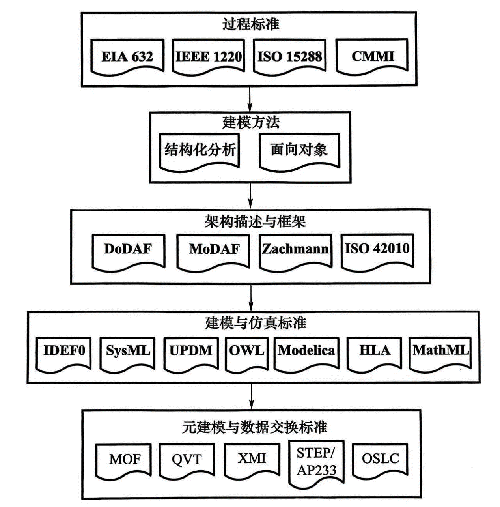
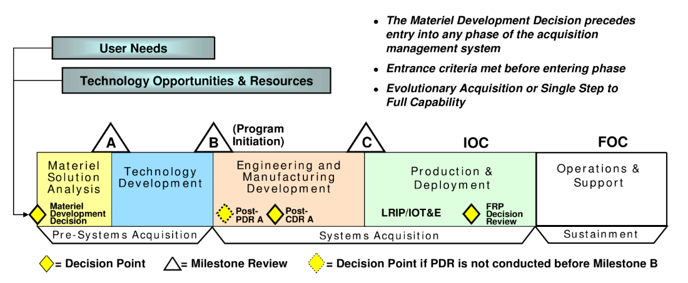
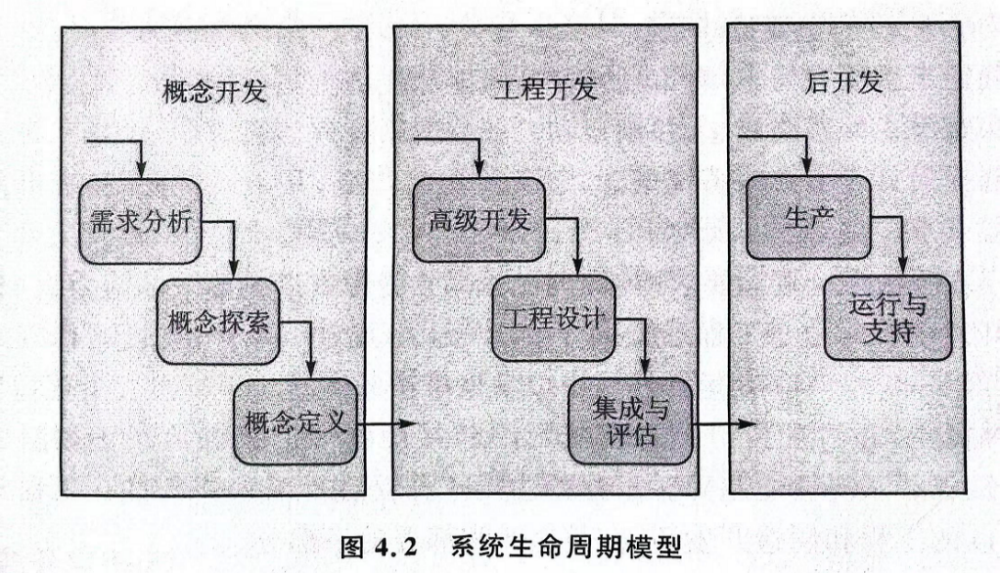
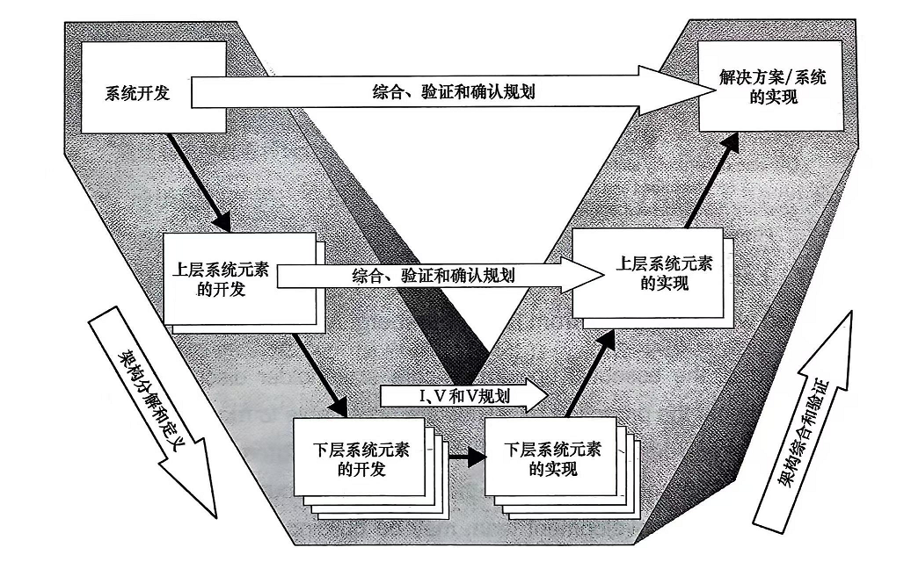
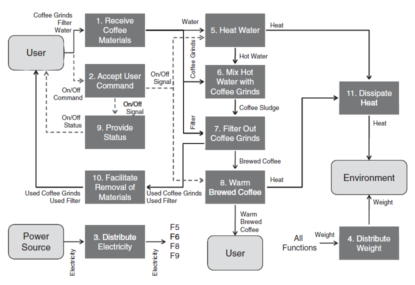
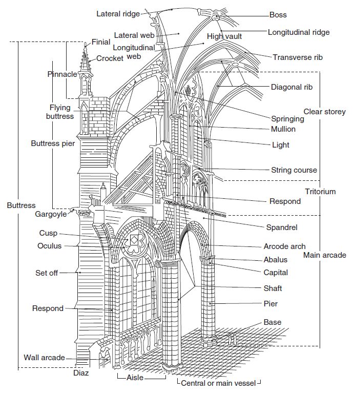
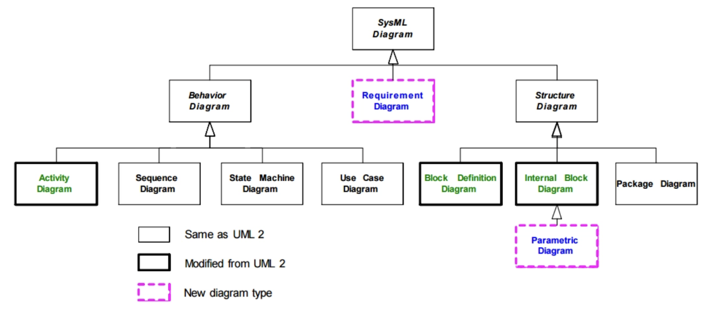
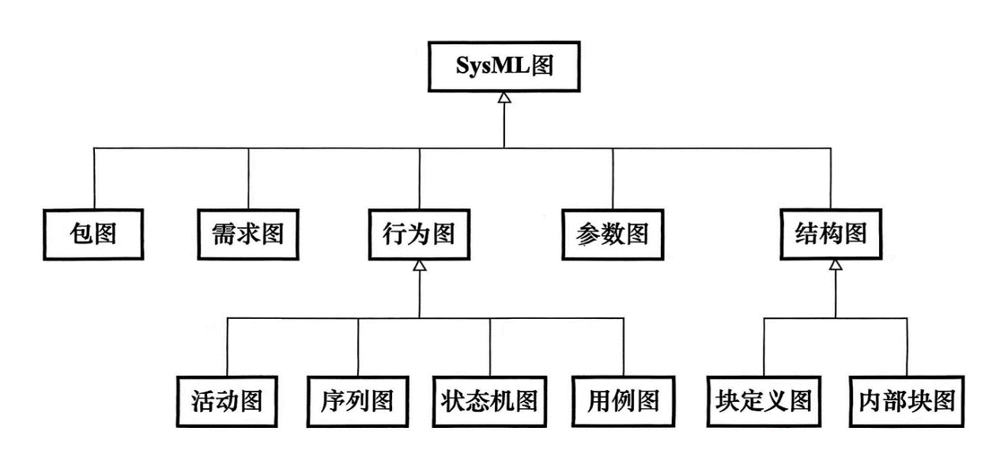

# 基于模型系统工程与SysML

【摘要】建立系统工程的思想理念，对于复杂系统（如武器装备、分布式仿真系统）的设计和管理是非常重要的。介绍系统工程和体系工程的概念，系统开发流程、生命周期阶段和经典的V模型。在此基础上，学习基于模型系统工程（MBSE）方法论和系统建模语言（SysML）。同时，认识系统工程也有助于实施有效的系统集成。

【关键词】系统工程，系统建模语言，MBSE，任务模型，生命周期模型

【参考书目】

INCOSE编著，张新国译，系统工程手册：系统生命周期流程和活动指南（第4版），机械工业出版社，2017.3

▲\[美\]Alexander Kossiakoff, William
Sweet著，王英勋等译，系统工程原理与实践（第2版），北京航空航天大学出版社，2021.9

▲\[美\]John Borky, Thomas
Bradley著，高星海译，基于模型的系统工程有效方法，北京航空航天大学出版社，2020.9

▲\[美\]Larry Rainey, Andreas
Tolk主编，张宏军等译，建模与仿真在体系工程中的应用，国防工业出版社，2019.11

\[美\]Sanford
Friedenthal等著，陆亚东等译，系统建模语言SysML实用指南（第三版），国防工业出版社，2021.9

\[美\]Mo
Jamshidi主编，许建峰等译，体系工程：基础理论与应用，电子工业出版社，2016.9

阳东升，张维明等编著，体系工程原理与技术，国防工业出版社，2013.3

卿杜政，李芳芳，杨凯
著，体系模型理论与建模仿真技术，中国宇航出版社，2023.12

韦正现等，基于开放架构的体系集成方法，电子工业出版社，2021.10

陶家渠著，系统工程原理与实践，中国宇航出版社，2013.6

------------------------------------------------------------------------

## 系统工程基础

### 什么是系统工程

系统工程有多种定义。一种定义为：系统工程的功能是对复杂系统设计制造的指引。"指引"的含义是"带领、管理或指导，通常基于某一已有课程导师的卓越经验"和"指明方向"。"工程"是将科学原理用于最终实践来设计、建造和运行高效的、经济的构造、设备和系统。"经济的"和"高效的"正是系统工程所提供的特殊贡献。

国际系统工程协会（INCOSE）的定义：系统工程是一种使系统能成功实现的跨学科的方法和手段。系统工程专注于：在开发周期的早期阶段定义客户需要与所要求的功能性，将需求文件化，然后再进行设计综合和系统确认，并同时考虑完整问题，即运行、成本、进度、性能、培训、支持、试验、制造和退出问题时，进行设计综合和系统确认。系统工程把所有学科和专业群体综合为一种团队的努力，形成从概念到生产再到运行的结构化开发流程。系统工程以提供满足用户需要的高质量产品为目的，同时考虑所有客户的业务和技术需要。（INCOSE,
2004）

"系统"的常用定义为：由相互作用和相互依赖的若干部分组成的具有特定功能的有机整体。这个定义意味着多个相互作用的部分共同执行一个重要的功能。复杂系统是指元素多样且彼此之间有复杂关系的系统。因此，系统工程的定义将"系统"一词限定为复杂的工程系统（排除生态系统这样的复杂系统）。

**系统工程与传统工程学科**

从上述定义可以看出，系统工程与机械、电气和其他工程学科有所不同，主要体现在以下几个方面：

（1）系统工程强调系统的整体运作。无论从外部看还是从内部看系统，都是它与其他系统和环境的交互。它不仅与系统的工程设计有关，而且与外部因素有关，这些因素对系统的设计有很大的约束作用。其中包括确定客户需求、系统运行环境、接口系统、后勤保障需求、操作人员的能力，且必须正确地反映在系统需求文件中并纳入系统的其他因素。

（2）虽然系统工程的主要目的是指引，但这并不意味着系统工程师在系统设计中不起关键作用。相反，他们负责领导一个新系统开发的形成（概念开发）阶段，最终实现反映用户需求的系统功能设计。在这个阶段，重要的设计决策不能完全基于定量知识，因为它们是针对传统工程学科的，但往往必须依靠定性判断来平衡各种不协调的定量和利用各种科学的经验，特别是在处理新技术时。

（3）系统工程是传统工程学科的桥梁。复杂系统中元素的多样性要求不同的工程学科参与其设计和开发。若要系统正确运行，每个系统元素就必须与一个或多个其他系统元素一起正常工作。这些相互关联的功能的实现依赖于单独设计的元素之间复杂的物理和功能交互。因此，不同的元素不应彼此独立设计，然后简单地组装成一个工作系统。相反，系统工程师必须指引和协调每个单独元素的设计，以确保系统元素之间的交互和接口是兼容和相互支持的。当各个系统元素由不同的组织设计、测试和提供时，这样的协作尤其重要。

**系统工程与项目管理**

一个新的复杂系统的工程通常是从探索阶段开始的。在这个阶段中，一个新的系统概念可能是为了满足一个公认的需求或利用一个技术机会而发展起来的。设计新系统的工作量巨大且复杂，需要一个专门的团队来领导并协调其执行。由项目经理指导，员工协助的行动计划被称为"项目"。系统工程是项目管理的一个固有部分，该部分涉及指导工程工作本身------确定其目标，指导其执行，评估其结果，并规定必要的纠正措施以保持其正常进行。

**理解现代系统工程**

（1）技术进步：风险。先进的技术为提高系统能力提供了机会，但也带来了需求系统工程管理的开发风险。在自动化领域，这一点最为明显。人机界面、机器人技术和软件技术的进步，使这一特定领域成为影响系统设计的发展最快的技术之一。

（2）竞争：权衡。其各种形式要求通过在各种替代方法之间使用系统级权衡来寻求更优（和更先进）的系统解决方案。系统本质特征之间的竞争始终是其发展的主要考虑因素，例如，性能、成本和进度之间总是存在着矛盾，不可能同时优化这三个方面。系统工程师追求关键系统属性的最佳平衡。

（3）专业化：接口。它要求将系统划分为与特定产品类型相对应的构建块，这些产品类型可以由专家设计和构建，并严格管理它们的接口和交互。

模块化的概念是将系统细分为其构件的直接结果。模块化是衡量单个系统部件相互独立程度的一种方法。系统工程的基本目标是实现高度的模块化，使接口和交互尽可能简单。将系统细分为模块化构件的过程称为"功能分配"。

### 复杂系统的结构

为了理解系统工程的范围，有必要定义或明确这个系统的一般范围和结构。"系统"的定义本来就是应用于复杂交互元素集结的不同层次。从本质上来讲，复杂系统具有层级的结构，它由许多交互元素组成，称为子系统；而这些子系统本身由更简单的功能实体组成，以此类推，直至更小的元素。

对系统架构中不同的结构级别，通用的名称包括系统、子系统以及更低级别的部件（或组件）和零件。部件或子部件执行基本的功能并由几个零件组成。绝大部分的零件具有标准尺寸和类型，并且通常可以商业采购获得。

系统工程师可以沿着功能和物理维度划分系统，了解系统的功能，然后将系统划分为物理层次结构，再将系统描述分解为单元（即元素）。

**功能构建块：功能单元**

构成系统运行介质的三个基本实体是：

（1）信息：全部知识和交互的内容。信息单元在系统功能上再分为两类，处理传播信息（例如无线电信号）的单元，称为信号单元；处理稳态（或固定）信息（如计算机程序）的单元，称为数据单元。前者主要用于传感和通信，后者分析和决策。

（2）材料：全部物理对象的实质。

（3）能量：激活全部活动系统部件操作和移动所需的能量。

**物理构建块：部件**

系统的物理构建块是由硬件和软件组成的功能单元的物理体现。它们被称为部件单元，或部件。部件构建块是根据它们所代表的不同学科和技术来分类的，例如电子的、光电的、机电的、机械的、热机的和软件的部件单元。

**系统环境**

系统环境可以广泛的定义为与系统交互的系统外部的所有内容。系统与环境的交互作用，形成系统需求的主要实质。

为了确定新系统运行的环境，必须精确辨识系统的边界，即定义系统内部和外部的内容。上下文关系图是系统工程师使用的重要沟通工具，可以有效的显示外部实体及其与系统的交互。

**接口和交互**

系统与环境的交互作用发生在系统的边界上，这样的边界称为系统的外部接口。对系统工程师而言，辨识和描述接口，是系统概念定义的一部分。

在系统内部，在各部件之间的边界构成了系统的内部接口。

系统的两个单元之间的交互是通过连接两者的接口来实现的。接口是系统工程中一个至关重要的问题，它影响部件之间的交互。

一般来说，接口单元可以区分为三种类型：连接器、隔离器和变换器。保证接口单元的兼容性和可靠性是系统工程师的特殊职责。

### 系统工程标准

系统工程标准不断发展，包括过程标准、建模方法标准、架构描述和框架标准、建模与仿真标准、元建模与数据交换标准，如图所示。

<figure>
  
  <figcaption>图 5‑1 系统工程标准</figcaption>
</figure>

## 体系与体系工程

### 现代系统的复杂性和SoS

随着现代系统复杂性的增加，较低级别的子系统、部件和零件的数量、多样性和复杂性也在增加。这些实体之间的交互也增加了复杂性。越来越多的单一系统可能成为更大实体的一部分。这样的更复杂的大系统称为"系统之系统"（System
of Systems, SoS），或者叫做"体系"。

SoS的定义来自美国国防部（DoD）：将独立且有用的系统集成到提供独特功能的较大系统中时产生的一组系统或系统安排。

实质上，只要将一组独立有用的系统集成在一起，以提供超出单个系统功能总和的增强功能，我们就有一个SoS。当然，集成程度可能会有很大的差异。一方面，SoS可以在最早的开发阶段就完全集成，在该阶段，各个系统虽然能够独立运行，但几乎都是专门为
SoS设计的。另一方面，可以在有限的目的和时间范围内松散地连接多个系统，以执行所需的任务，而无须与每个系统的所有者达成协议。显然，单个系统实际上必将成为层级结构中另一个更高层级的子系统。

美国国防部在2008年专门针对SoS环境制定了系统工程指南，并使用四个类别。类别按照所组成系统紧密耦合的顺序显示：从松散到紧密。

（1）虚拟。虚拟SoS缺乏中央管理权限和中央一致同意的SoS目的，出现了大规模行为，这也许是合乎需要的，但是这种类型的SoS必须依靠相对不可见的机制来维护它。

（2）协作。在协作式SoS中，所组成系统或多或少地自愿交互，以实现商定的中心目的。标准被采用，但是没有中央权威来强制执行它们。中央参与者共同决定如何提供或拒绝服务，从而提供一些执行和维护标准的方法。

（3）认同。认同的SoS已经确认了SoS的目标，指定的管理者和资源。但是，组成系统保留其独立的所有权、目标、资金、发展和维持方法。系统中的更改基于SoS与系统之间的协作。

（4）定向。定向SoS是指构建和管理集成SoS以实现特定目的的服务。在长期运行过程中，对它进行集中管理，以继续实现这些目的以及系统所有者可能希望解决的任何新目的。部件系统保持独立运行的能力，但其正常运行模式从属于中央管理目的。

这些定义涵盖了当今将系统集成在一起以执行功能或展示功能时存在的各种情况，大于任何一个单个的系统。

对SoS进行工程设计和架构可能与单个系统有所不同，特别是对于两个中间系统类别。由于
SoS的独特属性，系统之系统工程（或体系工程，SoSE）可能会有所不同。

Maier
于1998年首先提出了SoS的特征，并对其进行了正式讨论。总结了以下特征：

（1）个体系统的运行独立性。SoS 由独立且有用的系统组成。如果将
SoS分解为与其关联的部件系统，则这些部件系统能够独立地执行彼此独立的有用操作。

（2）个体系统的管理独立性。SoS中的部件系统不仅可以独立运行，而且可以达到预期的目的。通常，它们是单独获得和集成的，并且它们保持持续的运行状态，其服务目的可能与SoS服务的目的无关。

（3）地理分布。部件系统的地理分布通常很大。通常这些系统可以很容易地彼此交换信息和知识。

（4）涌现行为。SoS执行的功能和执行的目的不一定与任何部件系统相关。这些行为是整个
SoS的属性，而不是任何部件系统的行为。

（5）进化发展（演进性）。SoS通常随着时间的推移而发展。随着系统经验的增长而发展，添加、删除和修改结构、功能和目的部件。因此，SoS通常永远不会完全形成或完美。

（6）自组织。SoS具有动态的组织结构，能够对环境的变化以及SoS的目标和目的的变化做出响应。

（7）适应。与动态组织类似，SoS的结构是动态的，并响应外部变化和对环境的感知。

设计属于协作或认同类别的
SoS，必须处理SoS的七个核心属性。因此，我们在系统工程中拥有的基本工具可能还不够，已经开发了（并将继续开发）其他方法、工具和实践，以使工程师能够开发这些复杂的结构。

SoS并不代表最高级别的复杂性。SoS
之上是"企业"（Enterprise），该企业通常在其结构内包含多个SoS。此外，企业可能由各种各样的系统类型组成，但并非所有系统类型都是物理的。例如，企业包含必须与物理系统集成的人员或社会系统。

### 体系的定义

体系是系统的综合，系统综合以系统的演化发展、协同与优化为目的，最终提高整体效能。这一定义的应用背景是未来战场环境信息系统的综合集成。

体系是分布环境中异构系统组成网络的集成，体系中这些异构系统表现出独立运作、独立管理和区域分布特征，在系统和系统间交互被单独考虑的情况下，体系的"涌现"与演化行为不太明显。这一定义的应用背景是国家交通系统、军事体系和空间探索。

体系的组成不同于一般系统的内部结构（紧耦合），它是一种系统间的交互，而不是重叠。它具备如下特性：①能够提供单一系统简单集成所不具备的更多或更强的功能；②其组成系统是独立运作的单元，能够在体系所生存的环境发挥其自身的职能。这一定义的军事背景包括地面防空体系、战区导弹防御体系、作战群的编成体系等，其非军事背景如航天飞机。

体系是复杂的、有目的的整体，这一整体具备如下特征：①其组成成员是复杂的、独立的，并且具备较高的协同能力，这种协同使得体系组成不同的配置，进而形成不同的体系；②其复杂特征在很大程度上影响其行为，使得体系问题难以理解和解决；③边界模糊或者不确定；④具备涌现行为。

美国国防部："互相依赖的系统组合链接，提供的能力远大于这些系统的能力之和。"与体系的定义相对应，美国国防部同时定义了系统联邦，所谓系统联邦是指具备下列特性的一组系统：①能力为所有组成成员的能力之和；②具有所有成员共有的特征；③系统的组合并不产生新的能力和属性。体系是由复杂、独立系统组成的"超系统"，这些独立的系统通过交互实现其共同的目标。体系特征包括：体系不仅仅是巨型复杂系统，而是由相互独立的系统组成的，具有动态的开放环境，如天气、海洋以及应付天气海况变化的应急体系等。

2005年，美国参联会主席在《联合能力集成与系统演化》（JCIDS）中给出了体系的定义："体系是相互依赖的系统的集成，这些系统的关联与链接以提供一个既定的能力需求。去掉组成体系的任何一个系统将会在很大程度上影响体系整体的效能或能力。体系的演化需要在单一系统性能范围内权衡集成系统整体。战斗飞行器是体系研究典型案例，战斗飞行器既可以作为单一系统研究，也可以作为体系的子系统研究，作为体系研究时，其组成系统包括机身、引擎、雷达、电子设备等。"

### 体系工程

在系统工程基础上，为了适应体系特征解决体系中的问题，最近几年人们提出了体系工程概念。目前还没有统一的定义，下面列举几种。

（1）体系工程是确保体系内的组成单元在独立自主运作条件下能够提供满足体系功能与需求的能力，或者说执行体系使命和任务的能力。

（2）体系工程是这样一个过程，它确定体系对能力的需求，把这些能力分配至一组松散耦合的系统，并协调其研发、生产、维护及其他整个生命周期的活动。

（3）体系工程是解决体系问题的方法、过程的统称。体系工程是国防技术领域的一个新概念，这一概念同时也被广泛应用于国家交管系统、医疗卫生、万维网及空间探索领域。体系工程不仅仅局限于复杂系统的系统工程，由于体系所涵盖问题的广泛性，它还包括解决涉及多层次、多领域的宏观交叉问题的方法和过程。

（4）体系工程是学科交叉、系统交叉的过程，这种过程确保其能力的发展演化满足多用户在不同阶段不断变化的需求，这些需求是单一系统所不能满足的，而且演化的周期可能超过单一系统的生命周期。体系工程提供体系的分析支持，包括系统交叉的某一时间阶段内在资源、性能和风险上的最佳平衡，以及体系的灵活性与鲁棒性分析。

（5）体系工程源于系统，但它不同于常规系统工程，而是对不同领域问题的研究。系统工程旨在解决产品开发和使用问题，而体系工程重在项目的规划与实施，换句话说，传统系统工程是追求单一系统的最优化，而体系工程是追求不同系统网络集成的最优化，集成这些系统以满足某一同题的目标。体系工程方法与过程使得决策者能够理解选择不同方案的结果，并给决策者提供关于体系问题的有效体系结构框架。

### 武器装备体系

武器装备体系是体系的一个重要组成部分，它与一般的体系相比（如工业体系、农业体系、生态体系等）具有特殊性。

武器装备体系是现代信息化战争发展的必然产物。体系对抗是信息化战争下的基本作战形式，其实质是通过对诸军兵种力量单元、作战体系诸要素的综合集成和信息的实时互联、互通和共享，实现作战能力构成的结构优化和系统集成，进而使作战能力产生质的飞跃，实现作战行动的高度协调和作战效果的精确高效。

20
世纪末，美国提出的网络中心战（NCW）是信息化战争发展的必然，也是体系对抗作战的一个典型。NCW是以网络为中心进行的网络化、信息化的一体化战争。NCW是信息化最基本也是最重要的作战形式，它集C4ISR及电子战（EW）、信息战、作战支持和火力打击为一体，组成一个以计算机为中心的信息网络结构体系。与平台中心战的根本区别是：它通过将整个战场、各种部队、各个武器装备平台网络化，不断提高信息共享水平，增强态势感知能力，加快决策和指挥的速度，实现接近实时的作战协同，提高杀伤力、生存力和作战系统的响应能力，从而大大提高作战效能。它的成功直接取决于信息获取、共享的完整性、可靠性和实时性，关键在于获取信息优势。核心在于敌我双方的全方位的体系对抗作战。

武器装备体系是在体系概念的基础上发展起来的，是20世纪90年代人们针对现代信息化条件下体系对抗的战争特点提出的概念。

《中国军事百科全书》中提到，现代武器装备体系是武器装备从机械化迈向信息化过程中所出现的新形态，是武器装备在高度机械化基础上，通过数字化、系统集成及网络化等高新技术改造，整体结构与功能实现一体化的结果。装备体系是由功能上相互关联的各类武器装备系统构成的有机整体。

### 开放架构

开放式体系结构，或者开放架构（Open
Architecture，OA）具有应用系统的可移植性和可剪裁性、网络上各节点间的互操作性和易于从多方获得软件的体系结构。集成是系统工程和体系工程的一个重要环节，开放架构为系统和体系集成提供了基础技术支撑。

开放架构于20世纪80年代初提出，与开放系统概念的提出和实现密切相关。它的发展是为了适应更大规模地推广计算机的应用和计算机网络化的需求，现仍处于不断发展和完善之中。对于开放系统，X/Open协会的定义为：开放系统是以规范化与实际上存在的接口标准为依据而建立的计算机系统、网络系统及相关的通信环境，这些标准不应是任何机构所专有的，它可以为各种应用系统中的标准平台提供软件的可移植性、系统的互操作性、信息资源管理的灵活性和更大的可选择性。IEEE
POSIX
委员会则认为所谓开放式计算机系统，就是为应用程序提供网络上的可移植性、互操作性和分布计算机的计算机系统。

开放架构能够为开发开放系统提供一个适合的框架，并指导通过采用相关标准和指南构建开放架构计算环境（OACE）。OACE
的本质是利用一组计算机、内部和外部的网络互连设备、网络传输介质、操作和控制软件、通信软件以及接口等，提供一个分布式的高效计算环境。

利用开放式系统方法进行系统设计并不是解决所有系统工程问题的万能钥匙。将适当的系统工程应用于开放式系统的设计和开发中，管理集成工作和配置管理的复杂性是非常重要的。虽然开放式系统可以帮助增加竞争、降低成本和促进能力的快速发展，但重要的是要考虑：

商用≠开放；

开源≠开放式系统；

开放≠互操作。

以下定义取自澳大利亚国防部，指的是开放式系统，但可用于定义开放式架构：在军事信息和技术系统的背景下，开放\[架构\]可以定义为模块化组成的\[架构\]，其功能组件之间的关键接口根据开放标准定义。这样的\[架构\]必须能够被验证和确认，以确保\[通过非专有文档\]实现开放的\[架构\]目标。

该定义明确表明了开放式架构的五个特征：模块化设计、识别关键接口、开放标准指定关键接口、访问相关文档以及确认和验证能力。该定义还表明了一个特征：以共识为基础。

（1）模块化设计。模块化设计采用离散的、独立的模块或功能块，具有明确定义的接口来分离系统内的功能。虽然模块可以组合起来，但它们在操作方面是独立的。这允许元件交换和替换为附加功能，从而支持给定系统的快速集成和升级。这种设计原则降低了过时和昂贵且耗时的升级风险。

（2）识别关键接口。关键接口是正常操作和与第三方独立模块集成所需的关键数据或信息传递的模块之间的边界。不要求模块内部和模块之间的所有接口都是开放的，只要求存在快速变化/升级、高故障率或更换率、淘汰成本高昂的接口。

（3）开放标准指定关键接口。在开放式架构中，有必要使用开放标准指定关键接口。这种方法允许提供通用的集成指南，以降低开发、维护和修改/升级期间的成本/风险。

（4）访问相关文档。为了支持快速升级并避免过时，有必要访问非专有的、不受限制的文档。该文档支持交换和替换元素以实现快速集成和关键系统的升级。文档是非专有的，通过使其更容易用于未来的集成、验证、确认和升级工作，可以避免供应商锁定和过时。

（5）验证的能力。验证的能力确保关键接口满足开放式架构，即使对标准的解释可能会有所不同，或标准可能为创新提供灵活性。验证需要非专有的、不受限制的文档来证明规范满足开放式架构的所有要求。

（6）基于共识。基于共识的标准/架构由行业公认的领导者/团体发布和维护。这确保它得到广泛支持，以确保采用和生命周期维护。共识避免专有解决方案被称为开放或解决方案仅适用于有限的方式。

美国国防部数十年来一直在探索开放式架构，并取得了不同程度的成功。

## 系统开发流程

一个特定的新系统，从需求确立，技术方法可行性验证、开发，最后引入到实际应用是一项复杂的过程。

### 系统工程生命周期

"系统生命周期"通常用来指新系统从概念到开发，再到制造、运行和废弃的逐步演化过程。随着工作性质从早期概念阶段的分析，到工程开发和测试，再到生产及运行操作，系统工程师的作用也随之变化。

每个人造系统都具有一个生命周期，即使未被正式定义亦是如此。生命周期可以被定义为某事物（系统或制造的产品）所经历的一系列阶段。随着对环境问题意识的增强，任何所感兴趣之系统（SOI）的生命周期不仅必须包含开发、生产、使用和维持阶段，而且在系统即将废弃和处置时还须及早地关注退出阶段。每个后续阶段的需要必须在较早阶段被考虑到，尤其是在概念和开发阶段期间，以便做出恰当的权衡和决策，以可承受的有效方式适应后期阶段的需要。

在过去的20年中，系统生命周期模型已经发生了重大变化。此外，随着对其他独特和自定义应用程序的探索，模型的数量也在增加。而且，软件工程催生了大量已被系统社区采用的开发模型。最终的结果是，没有一个单一的生命周期模型可以被全世界所接受，并且适合所有可能的情况。各种标准组织、政府机构和工程团体已经发布了特定模型或框架。所有生命周期模型都将系统生命周期划分为一组基本步骤，这些步骤分隔了主要决策里程碑。

下面简要介绍国防部管理模型、ISO/IEC/IEEE 15288
模型和国家职业工程师学会（NSPE）模型。

**1. 美国国防部采购管理模型（DoDI 5000.2）**

在20世纪下半叶，美国处于发展大型复杂军事系统如军舰、飞机、坦克和指挥控制系统方面的最前沿。为了管理先进技术应用中的风险，并将成本高昂的技术或管理故障降到最低，国防部研究和拟订了全面的系统采购指南，它包含在
DODI
5000系列指令中。2008年秋季版的国防部系统生命周期模型反映了采购准则，如图所示。它包括五个阶段：材料解决方案分析、技术开发、工程和制造开发、生产和配置，以及运行和支持。确定用户需求和资源这两项活动被认为是过程的一部分，但不包括在采购周期的正式部分中。

DoD模型专为管理大型、复杂的系统开发工作而设计，在这些工作中，整个生命周期内的关键事件都需要审查和决策。主要评审被称为"里程碑"，并以字母
A、B和C命名。三个主要里程碑都对应定义了进入和完成的条件。例如，在里程碑A处，需求文件需要先经过军事监督委员会的批准，然后才能转入下一阶段。除了里程碑之外，该流程还包含四个其他决策点：材料开发决策（Material
Development Decision,
MDD）、初步设计评审（PDR）、关键设计评审（CDR）和全速率生产（FRP）决策评审。因此，国防部管理层能够在生命周期内的七个主要时间点上审查并决定未来的进度计划。

<figure>
  
  <figcaption>图 5‑2 国防采办管理系统</figcaption>
</figure>

**2. ISO/IEC 15288 模型**

2002年，国际标准化组织（ISO）和国际电工委员会（IEC）发布了经过多年努力的结果：系统工程标准
ISO/IEC
15288，即系统工程-系统生命周期流程。基本模型分为6个阶段和25个主要流程。这些流程旨在表示可能需要在基本阶段内完成的一系列活动。ISO
标准有意使阶段和流程一致。这6个基本阶段是概念、开发、生产、使用、保障和退役。

**3. NSPE 模型**

国家职业工程师学会（National Society of Professional Engineers,
NSPE）模型适合于商业系统的开发。这种模型主要针对新产品的开发，通常是技术进步的结果（技术驱动）。因此，NSPE模型为DoD
模型提供了一个有用的替代视图，用于描述如何将典型系统生命周期划分多个阶段。NSPE
的生命周期分为6个阶段：概念、技术可行性、开发、商业确认和生产准备、大规模生产和产品支持。

### 一般生命周期阶段

ISO/IEC/IEEE
15288陈述：系统在其生命周期内的进展是组织中的人员通过使用这些行动的执行流程来运行和管理行动的结果。

下面列出6个一般生命周期阶段：概念、开发、生产、使用、保障和退出。生命周期模型是有助于确保系统贯穿于其生命内满足系统所要求的功能性的框架。

**1. 概念阶段**

概念阶段开始于对新的或改进的系统的需要的某种识别。许多行业使用概念阶段中的探索性研究活动来研究诸多新的理念或使能技术和能力，然后使其发展进入到一个新项目的启动阶段。

许多生命周期模型均表明流程开始于"需求"或"用户需求"。实际上，流程更早地开始于以理解潜在的新的组织能力、机遇或利益相关者需要为目的的交互和研究。至关重要的是在这些早期研究中，创建一个高层级的初步概念。初步概念和使能技术需要在早期被识别，且在研究中出现的议题需要在开发阶段去应对。

初步概念也将被用于生成项目早期的成本和进度预测。探索性研究期间的关键活动是清晰地定义问题空间，特征化解决方案空间，识别业务或使命任务需求以及利益相关者需要，且在避免任何设计工作的同时，为全规模开发提供成本和进度的估计。

概念选择是概念阶段的第二个活动。概念选择活动是对探索性研究活动期间所开展的研究、实验和工程模型的细化和拓展。第一步是覆盖不同的使用阶段及其将来使用所在的环境来对系统的利益相关者的概念性运行进行识别、明确并使其文件化。开展运行概念（OpsCon）工作，包括制造流程或材料中的变更所导致的任何变更、接口标准中的变更或能够驱动系统概念选择的各个不同方面所附加的新特征增强。

在概念阶段，关键元素的工程模型和原型机对于验证概念的可行性而言是必不可少的，以便帮助理解利益相关者需要，探究架构权衡并探究风险和机会。

**2. 开发阶段**

开发阶段定义和实现满足其利益相关者需求的系统，并且可以被生产、使用、支持和退出。开发阶段开始于概念阶段的输出。该阶段的主要输出是感兴趣的系统（SOI）。其他输出可包括
SOI原型机、使能系统需求（或使能系统本身）、系统文档以及未来阶段的成本估算（ISO/IEC
TR 24748-1,2010）。

业务和使命任务需要连同利益相关者需求被细化为系统需求。这些需求用于创建一个系统架构和设计。对前一阶段中的概念进行细化以确保系统和利益相关者的所有需求得以满足。定义、生产、培训和维持保障设施的需求。考虑使能系统的需求和约束，并将它们纳入到设计中。进行系统分析，以达成系统平衡并优化关键参数的设计。

开发阶段的关键活动之一是规范、分析、构架和设计系统以便对系统元素及其接口进行理解和规范。对硬件和软件元素进行构造和编码。

通过一系列技术评审和里程碑决策从外部和内部利益相关者获取反馈。未展示出可接受的进展的项目可能被重新定向或甚至终止。

**3. 生产阶段**

生产阶段是系统被生产或制造的阶段。可能需要产品的修改以解决生产问题，以降低生产成本，或以增强产品或系统的能力。上述任何一点均可能影响系统需求，并且可能要求系统重新验证或重新确认。所有这些变更都要求在变更被批准前进系统工程评估。

**4. 使用阶段**

使用阶段是系统在其意图的环境中运行以交付其意图的服务的阶段。通常贯穿于系统运行内有计划地引入产品修改。这样的升级能提高系统的能力。这些变更应由系统工程师评估以确保其与运行的系统顺利综合。

对于大型复杂系统而言，中期升级可能要求大量系统工程工作，等同于一个重要的计划项目。

**5. 保障阶段**

保障阶段是为系统提供服务使之能持续运行的阶段。可建议进行修改以解决可维持性问题，以降低运行成本，或延长系统寿命。这些更改需要进行系统工程评估以避免运行时损失系统能力。

**6. 退出阶段**

退出阶段是系统及其相关服务从运行中移除的阶段。这一阶段中的系统工程活动主要集中于确保退出需求被满足。对退出的规划是概念阶段期间系统定义的一部分。

### 系统工程生命周期的阶段

《系统工程原理与实践（第2版）》构建了一个生命周期模型，反映了系统工程活动在整个系统活动生命周期中的重大转变，将生命周期细分为三个主要阶段，并将它们划分为8个不同的阶段。该结构如图所示，下面进行讨论。

<figure>
  
  <figcaption>图 5‑3 系统生命周期模型</figcaption>
</figure>

系统工程生命周期模型由三个阶段组成，前两个包括生命周期的开发部分，第三个是后开发阶段。这三个阶段表明系统生命周期活动的最基本的转换，以及系统工程所包含的工作类型和范围的变化。这些步骤是指：（1）概念开发阶段，是为最佳地满足有效需求而制定和定义系统概念的最初阶段；（2）工程开发阶段，包括将系统概念转变成满足运行、成本和进度要求的实际的物理系统设计；（3）后开发阶段，包括系统在整个有效生命周期内的生产、配置、运行和支持。各个阶段的名称通常旨在对应于这些阶段中的主要活动特征。

**1. 概念开发阶段**

概念开发，顾名思义，它体现了建立一个新系统所必要的分析和规划，其具有实现的可行性以及可以最佳地满足用户需求的特定系统架构。系统工程在将运行需求转化为技术上和经济上可行的系统概念方面起着主导作用。此过程称为"系统构建"，其使用类似于建筑设计师将客户的需求转化为建筑商可以投标和建造的计划和规范的方法。此阶段的工作量通常比后续阶段的工作量少得多。此步骤对应于国防部的任务需求分析和技术开发活动。

概念开发阶段的主要目标是：

（1）确定新系统有需求（有市场），在技术上和经济上是可行的；

（2）探索潜在的系统概念，并制定和验证一组系统性能需求；

（3）选择最具吸引力的系统概念，定义其功能特征，并为系统的工程、生产和运行配置等后续步骤制定具体的计划；

（4）开发所选系统概念要求的任何新技术，并验证其满足要求的能力。

工程开发阶段对应于工程系统执行系统概念中规定的功能的过程，体现一个物理实体，可以经济地生产，在其运行环境中成功地维护和运行。系统工程主要指导工程的开发和设计、定义和管理接口、制定测试计划，并确定如何最好地纠正在测试与评估（Testing
and Evaluation,
T&E）中发现的系统性能差异。工程的主要工作是在此阶段进行的。工程开发阶段对应于
DoD 的工程和制造开发活动，是生产和部署的一部分。

**2. 工程开发阶段**

工程开发的主要目标是：

（1）进行满足性能、可靠性、可维护性和安全性要求的原型系统的工程开发；

（2）设计该系统以进行经济的生产和使用，并证明其适用性。

后开发包括系统开发步骤之后的活动，但仍需要系统工程的大力支持，尤其是在遇到意外问题需要紧急解决时。此外，技术的不断进步常常需要在使用中进行系统升级，这可能与概念和工程开发阶段一样依赖于系统工程。此阶段对应于DoD
模型的生产与配置，以及运行与支持阶段。

**3. 后开发阶段**

新系统的后开发始于系统在其运行环境成功运行和测试评估（T&E）之后，并授权生产和后续的运行使用。基本开发完成后，系统工程继续在这一工作中发挥重要的支持作用。

### 系统工程方法和V模型

系统工程可以通过在系统的设计、开发、集成和测试过程中使用的流程序列和方法描述来进行查看。各种不同的系统工程方法，如瀑布模型（Royce,
1970）、螺旋模型（Boehm，1986）和V 形模型（Forsberg 和Mooz,
1991），在定义适合于生命周期阶段的起始、停止和流程活动时均是有用的。

流行的系统工程"V"图提供了生命周期开发的视图，显示了需求和系统定义与已开发和验证的产品之间的明确关系。

由 Forsberg 和Mooz（1991）引入、Forsberg
等人（2005）描述的V形模型，如图所示，是用于可视化系统工程焦点的各种关键领域的一种顺序方法，特别是概念阶段和开发阶段。V形模型强调与利益相关者持续确认需要（need）、在需求开发期间定义验证计划的需要以及持续进行风险和机会评估的重要性。V
形模型提供一个在生命周期各个阶段系统工程活动的非常有用的图解说明。

在此版本的V形模型中，时间和系统成熟度从左到右推进。V形模型的核心（即那些置于构型控制下的产品）描述从利益相关者需求协议到系统概念识别再到将要构成最终系统的元素定义的演进基线。随着时间向右推移，演进中的基线定义V形模型核心的左侧。V模型的关键属性是时间和成熟度跨越该图从左到右推进。随着实体的实施、验证和集成，V模型核心的右侧被执行。

<figure>
  
  <figcaption>图 5‑4 系统工程V模型</figcaption>
</figure>

在架构模型的支持下，这些流程包括：

- 概念开发和分析，模型支持与系统利益相关方进行对话，以确定和评估备选的系统概念。

- 需求捕获、分析、分配和可跟踪性，模型允许将需求分解并分配给系统元素和行为，并记录在模型生成的制品中。

- 高层设计和详细设计，模型捕获并记录不断发展的系统设计基线，并支持分析和权衡研究。

- 集成和测试，架构支持I&T（集成和测试）的规划和执行，包括识别产生有效测试点的环境条件。

- 验证和确认，为验证设计符合需求和确认系统满足利益相关方的需要，模型提供了坚实的基础。

- 运行和支持，模型和相关文档支持交付和安装、人员培训、配置管理、修改、升级、技术更新、故障分析以及与系统长期有效性和可支持性相关的其他活动。

## 系统工程的概念开发阶段

### 需求分析

系统生命周期需求分析阶段的主要目标是：清晰且有说服力地表明新系统或现有系统进行重大升级时存在切实运营需求（或潜在市场），以及存在一种可行的方法能够在可承受的成本和可接受的风险范围内满足上述需求。它回答了"为什么需要一个新系统"的问题，并表明这样一个系统在能力上可以提供足够的改进，以确保系统是可实现的。在某种程度上，这是通过设计至少一个可以在功能上满足需求的概念系统实现的，同时要对这个概念系统进行足够详细的描述，以使决策者相信它在技术上是可行的，且能够以可接受的成本进行开发和生产。简而言之，整个过程必须产生有说服力和可辩护的论据，以支持所陈述的需求，并在那些新系统开发的授权者的头脑中创造"成功的愿景"。

首先了解需求分析阶段在系统生命周期中的地位。一个新系统实际开发的准确起点通常很难定义，这是因为，新系统创建阶段的最早期活动通常在本质上是探索性和非正式的，且没有指定的组织结构、特定的目标或既定的时间表。相反，这些活动基于对新系统有效需求及其实现所需技术方法的评估，来决定是否需要做出专门的努力。

在美国国防系统中，需求确定任务提供了一份初始能力描述（ICD），它证明了系统目标或需求，论证了达到所述目标能够带来的较高的运行效益，并且其实现是可行的。它的完成是国防采办生命周期的第一个正式里程碑。

在技术驱动的系统开发中，需求分析阶段被认为是概念开发阶段的一部分。但是，在这种情况下，也必须有类似的活动，例如市场分析、竞争产品评估，当前系统相对于拟议新系统的缺陷评估等，它们为即将成为开发对象的产品确立了真实需求（潜在市场）。

在大多数产品领域，需求分析会或多或少的持续进行。但是，一些外部事件经常会促进这一过程的强化，进而导致一个新的运行需求。在国防领域，该外部事件可能是一个新的潜在敌人威胁情报的发现，一个暴露系统缺陷的局部冲突，一个持续的方案探索项目中发现的重大技术机遇，或者是一个在定期运行测试中发现的重大缺陷。

这一阶段关注的重点是系统的运行目标，并不深入到子系统级别。即使在子系统级别，活动也是以"可视化"的方式列出的，而不是定义或设计。这里的"可视化"是"形成一种心理上的图景或视觉"，暗示着对主题的概念观点而非物理观点。

作为系统开发周期的初始阶段------需求分析阶段，在本质上不同于大多数后续阶段。由于在它之前没有任何阶段，所以其输入会有很多不同来源，特别是取决于开发是需求驱动型还是技术驱动型。

虽然如此，在需求分析阶段所进行的活动，仍可以应用系统工程方法的四个基本步骤来讨论。这些活动如下（括号中是各个步骤的通用名称）：

- 运行分析（需求分析）；

- 功能分析（功能定义）；

- 可行性确认（物理定义）；

- 需求确认（设计确认）。

该阶段产生了四个主要初级成果，需求分析阶段的输出主要就是一组运行需求。

（1）运行需求。这些需求主要是指系统的任务和目的。运行需求的集合在系统部署和运行后，将描述并传达系统的最终状态。因此，该类型的需求是广泛的，并且描述了系统的总体目标，其中所有参考都与整个系统相关。一些组织机构也将这类需求称为能力需求。

（2）功能需求。这些需求主要指系统应该做什么。这些需求应面向行动，且应描述系统在其运行期间所要执行的任务或活动。在该阶段，功能需求关系到整个系统，但它们在很大程度上应该是定量的，并在接下来的两个阶段中得到显著改进。

（3）性能需求。这些需求主要是指系统如何更好地执行其需求并影响其环境。在许多情况下，它们与上述两种类型相对应，并提供最小的数值阈值。这些需求几乎总是客观且定量的，但也有例外。

（4）物理需求。这些需求是指物理系统的特征和属性及其对系统设计施加的物理约束。这可能包括外观、一般特征、体积、重量、功率、材质以及系统必须遵守的外部接口约束。

对于新启动的系统，通过需求分析进行第一次迭代，会得到一组相当广泛且未完全明确的运行需求。以国防领域为例，从需求分析中产生的类似需求的文件被正式命名为ICD。该文档包含系统概念所需的广泛描述，并侧重于运行或功能上的需求，只包含顶层的功能、性能和物理需求。

现有系统由于过时或其他原因而导致的缺陷是需求驱动因素。技术进步所带来的技术机遇是技术驱动因素，这些技术进步可能显著提高性能或降低面向市场的系统成本。后一种情况，对新技术的应用还必须提出一种预期的运行概念。

开发运行需求的一种逻辑方法是假设一系列场景，代表了预期的运行场景。这些场景必须基于对运行环境的广泛研究、与其前身系统或对类似系统有经验的用户的充分讨论，以及对过去经验和当前系统不足之处的详细了解。

### 概念探索

概念探索阶段的主要目标，旨在将需求分析阶段得到的面向运行的系统视图转换为概念定义和后续开发阶段所需的面向工程视图。这种转换是必要的。它为选择一个可接受的功能和物理系统概念提供了明确和可量化的基础，然后指导其演变为系统的物理模型。

为了确保性能需求足够广泛，以避免无意限制可能的系统配置范围，有必要考虑各种备选方案，而不只是一个方案。新系统如果在能力上比传统系统有重大进步，或者依赖于技术进步的实现，则需要进行大量的探索性研究和开发（R&D），然后才能建立一套合理的性能需求。

新产品的方案设计需要描述6个疑问句（5W1H），被称为一个运行概念（CONOPS），解决如何运行和由谁运行的问题；运行需求，关注"为什么"和"是什么"；运行场景的描述指出了何时、何地。运行概念是对系统功能的更广泛的描述，一个大的系统集合将如何运行。CONOPS往往与单个场景或一组场景相关。CONOPS
指明了系统的预期目标，应该避免规定它们如何实现。

### 概念定义

系统生命周期的概念定义阶段，标志着确定一个新系统功能和物理特性的严肃、专注工作的开始，该系统旨在满足前面概念阶段中定义的运行需求。它标志着能够定量地预测其运行性能、开发时间和生命周期成本，以充分、具体地表征系统。此阶段的输出是从大量备选的系统方案中选择的一种特定的配置，这些配置将构成开发和工程的基准。从这一阶段开始，系统开发包括选取的系统方案在硬件和软件上的实现（必要时进行修改），并将其设计用于生产和运营。系统架构的正式定义是此阶段的主要活动。

概念定义阶段是概念开发阶段的最后阶段，它是工程开发阶段的开始，随着开发阶段的进展而启动。它的输人是系统性能需求，包括许多可行系统方案的技术基础。它的输出是系统功能规范、已定义的系统方案以及后续工程计划的详细计划。

此阶段的计划输出通常包括系统工程管理计划（SEMP），该计划详细定义了要遵循的系统工程方法、项目工作分解结构（WBS）、开发和生产的成本估算、测试计划以及其他可能指导的支撑材料。

系统工程方法将设计任务分为两个紧密耦合的步骤：1）分析和制定系统的功能设计（需要执行哪些操作）；2）选择最有利的系统功能实现（如何最好的以物理方式生成动作）。概念定义阶段的系统实例化过程主要是系统部件的功能定义。这些功能模块的固有结构是，除了输入和输出之外，还需要与其他单元互连最小。

常用几种正式的工具和方法来表示系统的功能及其交互。

（1）功能流程框图（FFBD），不仅表示功能，还表示控制流程。该图表技术可以在多个层级上使用以形成功能层次结构。

（2）集成定义（IDEF）方法，包含了大量的系统能力描述。IDEF0是表示系统功能的主要技术，基本结构是功能实体（矩形表示），用于识别与功能之间接口的严格规则；左侧输入，右侧输出；控制项从顶部进入函数功能区；机制（或实现）从底部进入。

（3）功能框图（FBD），这是最简单的图表技术之一。类似于FFBD，但没有流程结构；类似IDEF0，但是没有图表规则。基本上，每个功能都由一个矩形框表示，功能之间的接口用方向箭头标识，并带有表示功能之间传递的内容。当功能与外部实体交互时，以某种方式（例如矩形或圆形）表示实体，并提供接口箭头。

如图所示是标准咖啡机的功能框图。

<figure>
  
  <figcaption>图 5‑5 咖啡机的功能框图</figcaption>
</figure>

## 基于模型的系统工程

### MBSE概述

在传统的系统工程（包括结构化分析或面向对象方法）中，系统开发生命周期早期的主要产品是文档。无论这些文档是电子文档还是纸质文件，它们都是系统的静态表示。使用
MBSE，主要产品是模型，可以在一定程度上执行这些模型。因此，审查系统设计都涉及一组模型。这是个自动化过程。回顾传统的系统工程产品，主要涉及阅读文本和图表。

《INCOSE系统工程愿景2020》（2007）中将基于模型的系统工程（MBSE）定义为："支持以概念设计阶段开始并持续贯穿于开发和后期的生命周期阶段的系统需求、设计、分析、验证和确认活动的正规化（形式化）建模应用"。

MBSE增强获取、分析、共享和管理与产品规范相关的信息的能力，从而带来以下好处：

- 改善开发利益相关者（如，客户、项目管理人员、系统工程师、硬件及软件开发者、测试人员和专业工程学科）之间的沟通；

- 提高通过使能从多个角度观察系统模型来管理系统复杂性的能力，以及分析变更影响的能力；

- 通过提供可评估一致性、正确性和完整性的无歧义的且精确的系统模型，提升产品质量；

- 通过以更加标准化的方式捕获信息并高效地利用模型驱动方法固有的内置抽象机制，增强知识捕获及信息的复用，这反过来会导致缩短的周期时间和更低的维护成本，以改进设计；

- 通过提供概念的清晰且无歧义的表达，提升教授与学习系统工程基本原理的能力。

MBSE
常常与传统的基于文件的系统工程方法形成对比。在基于文件的系统工程方法中，常常生成的关于系统的大量信息，被包含在文件以及其他制品中，例如规范、接口控制文件、系统描述文件、权衡研究、分析报告以及验证计划、程序和报告。这些文件内包含的信息往往很难维护和同步，并且很难评估其质量（正确性、完整性和一致性）。

在 MBSE
方法中，在某一系统模型或模型集合中捕获大量的这类信息。系统模型是系统工程流程的首要制品。MBSE
通过使用模型使系统工程的应用正规化。在模型中捕获这些信息并贯穿于生命周期维护这些信息的程度取决于MBSE
工作的范围。强有力地发挥系统工程的MBSE
方法的作用意在使系统需求、架构和设计质量得到显著改善；通过早期暴露系统定义的问题，降低系统开发的风险和成本；通过复用系统制品，提高生产率；并改善系统开发团队之间的沟通。

### MBSE方法论

一般来说，方法论可以被定义为用于支持特定学科的有关流程、方法和工具的集合。更为一般的方法论概念将会专用于MBSE方法论，我们将其描述为在"基于模型的"或"模型驱动的"背景环境中用于支持系统工程学科的有关流程、方法和工具的集合。

2008年，多种备选的 MBSE 方法论综述在INCOSE
技术出版物的支持下发表。概述了六种MBSE方法论：INCOSE
面向对象的系统工程方法（OOSEM）、IBM Rational Telelogic Harmony-SE、IBM
Rational统一的系统工程流程（RUP-SE）、Vitech MBSE 方法论、JPL
状态分析（SA）和Dori 对象-流程-方法论（OPM）。

（1）INCOSE 的面向对象系统工程方法（OOSEM）。该方法使用SysML
实现基于模型的方法，以支持系统的规范、分析、设计和验证。基本活动集可以生成在其他应用程序中细化和使用的工件。下面列出这些活动和工件：

a.分析利益相关者的需要；

b.确定系统要求；

c.确定逻辑架构；

d 合成备选分配的架构；

e.优化和评估备选方案；

f.确认和验证系统。

（2）Telelogic
Harmony系统工程方法。这种专有方法是在产品经典系统工程"Vee"过程之后建模的，除了在过程的每个步骤中建立和更新需求和模型存储库。此外，还将建立并更新测试数据存储库以跟踪测试用例和数据。已经开发或修订了若干工具和应用程序以促进融合方法。Telelogic公司产生了其中的几种（例如Rhapsody、DOORS），尽管该方法本身是应用中立的。

（3）IBM RUP-SE（Rational Unified Process for Systems
Engineering）。其流程的目标是应用 RUP
中的规则和最佳实践，并将其应用于系统规范、分析、设计和开发的挑战。此外，RUP-SE
是专门为实施模型驱动的系统发展而开发。对现有统一过程的这种调整集中在四个建模级别：上下文、分析、设计和实现，每个级别都比以前有更高的保真度。然后，将这四个模型级别与六个视点（工作、逻辑、信息、分布、流程和几何），进行交叉索引，以生成17个架构工件（上下文/流程对不会产生工件，而实现模型则会产生实际的物理工件）。这些工件成为
RUP-SE 架构框架的基础。

（4）Vitech MBSE
方法论。此方法基于一个通用设计存储库集成的四个主要活动：

a.来源需求分析；

b.功能/行为分析；

c.架构/综合；

d.设计确认和验证。

这种方法需要一个通用的信息模型来管理工件的语法和语义。尽管进程本身可以使用任何信息模型语言，但Vitech定义了一种系统定义语言（System
Definition Language, SDL），用于它们的进程（也可以与它们的工具
CORE一起使用）。

（5）喷气推进实验室（Jet Propulsion Laboratory, JPL）状态分析（State
Analysis，SA）。该方法利用基于模型和状态的控制架构来捕获系统需求和设计。该过程区分系统的状态和个人对该状态的了解。通常，系统状态的知识由比实际状态本身更抽象的方案表示。在一组模型中表示了系统如何从一个状态演变到另一个状态。最后，系统控制也由模型表示，但由于系统复杂，达到完全控制是不可能的。

面向对象方法、系统建模语言的建立和成熟以及实现这些方法和语言的工具和应用程序的激增，使人们更加意识到在系统工程中使用模型驱动方法的好处。尽管这种方法确实需要增加资源，但这样做的好处确实可以获得足够的投资回报。案例研究正逐渐被提供，以"证明"这种方法确实有效。在整个业界接受
MBSE
之前，需要更多的时间和经验；但是，它的基本原则是合理的。这种方法论和方式是软件和系统工程实践融合的又一步。

### 系统架构

当我们想到"架构"这个词的时候，会出现类似如图所示的内容。对于许多人来说，架构是指架构物（建筑）。20多年前，南加州大学的Eberhardt
Rechtin教授关注于架构领域，了解如何创建和开发复杂系统（即架构物），并且创造了"系统架构"一词（System
Architecture）。

IEEE Std
610.12将架构定义为"部件的结构、它们之间的关系，以及管理其设计和演变的原则和指导方针"。这适用于复杂系统，如飞机、发电厂、航天器、以及架构物。因此，可以将架构领域的原理应用到系统工程中，不是作为替代，而是作为开发系统的一部分。

<figure>
  
  <figcaption>图 5‑6 传统的建筑景观</figcaption>
</figure>

架构的本质是结构化。结构化可能意味着使形式发挥作用，使秩序摆脱混乱，或者将客户的部分形成的想法转变为可行的方案模型。关键技术是平衡需求、适应接口，并且在极端情况之间妥协。

大多数商业和政府的架构工作都遵循了"架构视图"的方案。这个想法是这样的，从多个视角或观点表示开发系统，以帮助利益相关者在大规模开发之前理解系统方案（并做出有价值的权衡决策）。

虽然目前存在许多不同的体系结构开发方法和指南，但它们都有一组非常通用的视角。通常，系统架构将呈现系统的三个常见视图。

（1）操作视图

这种表示来自用户或运营商的视角。该视图包括解决系统运行阶段的产品、方案和任务流。从用户的视角来看，信息流也可以得到解决；用户界面也将被描述。该视图的示例产品包括操作图或图形、方案描述（包括用例）、任务流程图、组织结构图和信息流程图。

（2）逻辑视图

这种表示来自经理或客户的视角。该视图包括确定系统及其环境边界的产品与外部系统、主要系统功能和行为、数据流、内部和外部数据集、内部和外部用户的功能接口以及内部功能接口。该视图的示例产品包括FFBD、上下文关系图、N2图、IDEF0图、数据流图以及各种特定利益相关者（包括与业务相关的产品）。

（3）物理视图

这种表示来自设计者的视角。该视图包括确定物理系统边界的产品，系统的物理部件，它们如何联系和交互的，内部数据库和数据结构，系统的信息技术基础结构，系统与之交互的外部IT
基础结构，及其开发中的有效标准。该视图的示例产品包括下至细节相当高水平的物理框图、数据库拓扑、接口控制文档（ICD）和标准。

现在大型复杂系统的开发程序中广泛使用了架构。架构师和团队在开发和集成产品方面可能使用结构多样的架构。为了标准化架构开发工作，许多组织开发并要求使用架构框架。

"架构框架"是一组标准，规定了用于开发系统架构的结构化方法、产品和原则。典型的架构框架如C4ISR-AF、美国国防部架构框架（DoDAF）、开放组织架构框架（TOGAF）、Zachman框架等。

对于架构框架中的每个视图，可以使用各种方法和技术来表示。例如传统的结构化分析模型IDEF0、功能流程框图（FFBD）、数据流图（DFD）、实体关系图（E-R）或状态转换图。当前更倾向于使用面向对象模型的建模语言，即UML和SysML。

## 系统建模语言：UML和SysML

UML和SysML语言标准由对象管理组织（OMG）维护。尽管面向对象设计起源于软件架构，并且仍然主要应用于软件架构，但从UML
v2开始，面向对象原则也已经应用于硬件以及软件/硬件的集合。SysML在很大程度上消除了UML的软件倾向。SysML是系统工程的首选建模语言。

### 统一建模语言UML

在开发复杂系统时，必须创建其结构和行为的高级模型，以了解如何配置它以满足其要求。20世纪90年代，一种结合了面向对象的分析、设计原则和技术的新建模语言被正式确立，即统一建模语言UML
（Unified Modeling Language）。这是Booch,
Rumbaugh和Jacobson三人开发的一种通用的建模语言，该语言已被软件界作为标准，并在整个行业和政府中广泛使用。

结构化方法采用系统的三个互补视图，而UML为面向对象分析师和设计人员提供了13种不同的方法来描绘不同的系统特征。它们可以分为6个静态或结构图和7个动态或行为图。

结构图表示系统实体关系的不同视图：

- 类图显示了一组类、类的关系以及类的接口；

- 对象图显示了一组类及其关系的实例；

- 部件图通常用于说明物理对象的结构和关系；

- 部署图显示了系统物理部件的静态视图；

- 复合结构图提供了类的运行时分解；

- 包图显示了部件的层次结构；

行为图表示系统动态特性的不同视图：

- 用例图显示了一组用例之间的相互关系，这些用例表示响应与外部实体（参与者）交互的系统功能；

- 序列图显示了在执行系统场景时按时间顺序排列的一组对象之间的交互；

- 状态机图模拟改变系统状态的转换事件和活动；

- 活动图是系统的一部分的活动流程图，显示活动之间的控制流程；

- 通信图确定对象之间的链接，关注它们的交互；

- 交互方案图是序列图和活动图的混合；

- 时序图显示了对象之间具有时序的交互信息。

UML
类图大致对应于结构分析中的实体关系图，而状态图对应于状态转换图，其他（尤其是活动图）是功能流程图的不同视图。

软件工程界采用了这种新语言作为代表软件方案和软件密集型系统的事实标准。UML由全球性联盟对象管理组织（Object
Management Group, OMG）管理。UML 将继续随着新版本和复杂性的发展而发展。

2003年3月，OMG发布了扩展UML，从而满足系统建模需求。该语言具有健壮性，能够跟踪系统建模需求，同时软件工具较多且应用广泛，为系统工程提供了交换的拓展基础，因而成为SysML的基础。

### SysML概述

随着系统工程的发展，特别是系统架构，在20世纪90年代，正式的建模语言被认为有利于建立统一的标准。国际系统工程理事会（International
Council On Systems Engineering,
INCOSE）于2001年委托开发一种标准建模语言。新语言是基于UML
2.0版的拓展。OMG与其合作，并于2001年成立了系统工程领域特别兴趣小组。这两个组织共同开发并发布了UML的系统工程扩展，称为系统建模语言（System
Modeling Language, SysML）。

对象管理组织（OMG）于2007年发布SysML第一版（v1），并于2024年正式发布SysML
V2。SysML
V2支持不断发展的基于模型的系统工程（MBSE）的具体实践，以应对日益增长的系统复杂度与快速技术变革带来的挑战。V2版本旨在通过提升建模语言精确性、表现力、规范性及互操作性，着力增强MBSE的有效性，并促进其应用。

也许UML和SysML之间最重要的区别是SysML的用户不必是面向对象的分析和设计（OOAD）原理和技术的专家。SysML
支持许多传统的系统工程原理、特性和模型。

SysML是一种通用的图形建模语言，支持复杂系统的分析、规范、设计、验证与确认。这些系统包括硬件、软件、数据、人员、过程、设备及其他人造和自然系统的元素。该语言是为了帮助规范、构建系统和规范部件，后续这些部件可以通过应用专业领域的语言（如软件设计所采用的UML、硬件设计所采用的
VHDL 及三维几何建模）来开展设计。SysML目的是推动应用MBSE
方法建立内聚并且一致的系统模型。

SysML能够表示系统、部件和其他实体的以下方面内容：

- 结构组成、互连和分类；

- 基于流、消息和状态的行为；

- 对物理和性能特性的约束；

- 行为、结构和约束之间的分配；

- 需求及其与其他需求、设计元素、测试用例之间的关系。

<figure>
  
  <figcaption></figcaption>
</figure>

SysML引入了一个新类别，其中包括一个同名的图------需求图。13个UML图中只有4个（包图、用例图、状态机图和序列图）没有更改。省略了严重依赖于面向对象的方法以及方法的图（对象图、协作图、部署图、交流图、交互方案图、时序图、配置文件图）。

<figure>
  
  <figcaption>图 5‑7 SysML 图分类（v1.4）</figcaption>
</figure>

SysML包括9种图，如图所示。

（1）包图pkg：按照包含模型元素的包的形式表示一个模型的组织（与UML包图一致）。

（2）需求图req：表示基于文本的需求及其与其他需求、设计元素、测试用例之间的关系，用以支持需求跟踪（UML
中无此图）。

（3）活动图act：表示基于流的行为中各动作执行顺序，基于各动作的输入、输出、控制和动作如何将输入转化为输出（UML
活动图的修改）。

（4）序列图sd：根据系统间或系统组成间的消息交换序列表示行为（与
UML时序图相同）。

（5）状态机图stm：根据由事件触发的状态转换表示实体的行为（与UML状态机图相同）。

（6）用例图uc：根据系统如何被外部实体（如执行者）使用来实现一组目标表示功能（与UML用例图相同）。

（7）块定义图bdd：表示名为块的结构元素及其它们的组成与分类（UML类图的修改）。

（8）内部块图ibd：表示块组成之间的互连与接口（UML组成图的修改）。

（9）参数图par：表示有关属性值的约束，用于支持工程分析（UML无此图）。

SysML图提供了一种机制，从某个特定目的出发表示模型的聚焦视图。图表示了从系统模型中选择的模型元素。系统模型的某个模型元素与出现在图中的相关符号的种类是由图的种类约束的。一个模型元素可以在多个图中出现，对该元素的任何修改都将反映到其出现的所有图中。

对于任何建模语言，建模人员和模型相关方所具有的将模型内容有效可视化的能力都是至关重要的。SysML中模型可视化的重要方面如下：

（1）SysML有9类图，能够以图形化方式将系统模型的不同方面可视化；

（2）任何SysML图只能表示模型元素的一个子集，而模型元素则可以在多个图中出现；

（3）SysML 同时支持非图形化视图，如矩阵、树和表等；

（4）通过视角机制，SysML支持定制可视化。

### 开发工具

有多种软件开发工具支持 UML/SysML/架构建模，例如：

- IBM Engineering Systems Design Rhapsody

- No Magic Cameo Systems Modeler (MagicDraw)

- Sparx Enterprise Architect

其中IBM和No Magic 两家代表性厂商都提供完整的MBSE解决方案。

## 软件（系统）工程

### 概述

软件定义为三个部分：指令（计算机程序）、数据结构和文档，这三个部分一起被称为"软件"。工程软件和硬件之间的最根本区别之一是软件的抽象性。

软件开发过程可以分为4个基本步骤，尽管这些步骤与系统工程方法不完全一样，但是每个步骤的总体目标都非常接近。

（1）分析；

（2）设计，包括结构、程序的设计等；

（3）编码与单元测试，又称实现；

（4）测试，包括集成测试和系统测试。

软件开发生命周期模型通常分为：线性开发模型，增量模型，演化模型，敏捷开发模型。

"瀑布模型"是经典的线性软件开发生命周期模型，由一系列步骤组成（通常带有反馈）：分析、设计、编码和单元测试、集成和系统测试、运行和维护。

更多软件工程内容这里不再赘述。

下面简单介绍面向对象分析与设计（OOAD）和面向服务架构（SOA）的指导思想，两者起源于软件架构，但目前其思想已经广泛融入系统工程和体系工程领域。

### 面向对象

面向对象（Object-Oriented）将系统看成由多个对象组成，对象之间的交互形成了系统的演化，这一认识为客观世界到软件系统的映射提供了途径和编程的思维方法。

"对象"一词的含义很广，客观世界中的任何事物在一定的前提下都可以成为认知的对象。从计算机仿真度角度，对象可以是客观对象到抽象对象、再到计算机对象的过程。对象的表示包括三个方面，即属性、活动、关联关系。在计算机内部，对象通常可以表示为三元组：

对象：= 〈接口，数据，操作〉

其中，接口描述对象与其他对象的关系，数据描述对象的属性，操作描述对象的活动。从面向对象的观点去认识客观世界，用面向对象的方法去模拟客观世界，就构成了"面向对象"的完整含义。

INCOSE提出面向对象的系统工程方法（OOSEM），将面向对象（OO）的概念应用于复杂的、技术密集型与信息密集型的系统和企业架构开发工作。面向对象是当前已知的应对复杂架构和系统工程挑战的最有效的方法，比结构化分析和结构化设计等之前的方法具有重大进步。

面向对象的基本原则包括封装、泛化和多态性。我们可以从更多方面理解OO所体现的特征和功能。

抽象：抽象是一种通过识别一组实体所共享的共同特性来应对复杂性的方式，实体包括硬件组件、软件组件、交互和状况等，从而使这些实体能够由具有这些共享特性的更一般的实体来表达（建模）。到目前为止，此原则在UML中最常见的用法是定义一个类（Class），其中，类是对现实世界中被称为对象（Object）的一组具体事项的共同属性进行抽象。实际上，OO是从定义现实世界事物的思考过程而得名的，这些事物是系统或体系的一部分。SysML
对块（Block）及块的实例（Instance）做了同样的定义。因此，UML
中的对象是类的特定实例，在SysML中，使用块创建实例。

封装：封装提供了将架构内容划分为信息、功能和资源的单元或集合的方式，每个单元或集合都具有一个定义的边界。该原则源自结构化编程的早期概念，即关键概念是隐藏对象实现的细节（"信息隐藏"），同时仅公开暴露必须与其他对象共享的内容。封装意味着定义明确的接口，通过一些接口可暴露和访问公开的功能和信息；这种接口被看作由隐藏实现细节所履行的约定。

模块化：模块化将封装的基本理念扩展到更大的过程，将复杂实体分解为一组可以单独管理和使用的更简单的实体。系统的模块化元素（简单地称模块）可以打包为单独封装的系统元素，例如对象或块实例，并且必须具有一个接口，通过该接口可提供和使用功能、服务和信息等其他内容。通过对模块内密切相关的信息和流程进行良好的分组划分（"内聚性"），促进了系统元素之间关注点的分离，并支持松耦合（模块之间的最小依赖性），这是鲁棒、开放系统的基本属性。

泛化和继承：泛化和继承作为一对互补的概念，创建了一种涉及连续抽象层次的层级结构（等级排序）。较高层级的分类器（非正式地称为超类）对一组较低层级的子类的共同属性进行抽象，从而创建泛化。而继承是泛化的反向关系，子元素一方面拥有（继承）其父元素的特性，另一方面又可拥有自身特有的特性。必要时，可以专门地覆盖重写继承的特性。这样，泛化通过定义不同系统元素的共同特性，提供了一种管理复杂性的新工具。

类型化（Typing）是继承的一种扩展形式。

聚合和组合：使用聚合和组合创建了涉及结构分解连续层次的另一种层级结构。在
UML
中，聚合创建了包含在架构元素中一个或多个较低层级元素，与该架构元素之间的是"一部分"的关系，或有帮助构成该架构元素。通过聚合关系，较低层级的类或块及其实例可独立于较高层级的类而存在。组合是一种更强大的聚合，较低层级的类或对象"构成"较高层级的类或对象，较高层级的类或对象负责创建或提供较低层級的类或对象，较低层级的类或对象不能独立于较高层级的类或对象而存在。

在SysML 中，将聚合关系转换为引用关联（Reference
Association），在一端的一个块引用另一端的块，使第二个块成为第一个块的引用特性（Reference
Property）。这样，基于架构元素之间所需的交互，由此创建逻辑层级结构。另外，SysML
中的组合关系（Composition
Relationship）定义了结构化的层级结构。组合关系一端的块被声明为另一端块的构件特性（更简单地说是构件或部分）。

接口：良好的系统工程实践，关注于系统的模块或其他结构元素之间或这些元素与外部环境之间交互点的定义和使用。尽管通常不将接口本身称为
OO原则，但对接口的关注对于系统架构至关重要，并且与封装、模块化、聚合及其他原则密切相关。

多态性：最后一个，也可能是最深奥的概念，根据调用操作的特定方式，提供了对象或块实例等给定的系统元素，以不同方式实现一组共同操作的方法。在最常见的情况下，模块或其他资源单元对常用功能进行改变，例如基于客户端身份或所提供参数值等内容，以不同的功能方式响应来自客户端的服务请求。

这些基本概念，对于在真实系统架构中理解和应用 UML和
SysML非常重要，它们给架构师提供了功能强大的OO、UML 和 SysML 工具。

### 面向服务架构

结构化信息标准促进组织（OASIS）发布了一个SOA参考模型，旨在规范适用于任何
SOA
的概念和术语。SOA不是一个预定义的产品，而是一种包含面向服务的架构风格，它基于服务和服务接口构建。

面向服务：SOA的出发点是采用系统或企业所提倡的设计理念或视角，其要求如下：

- 以共享、可复用服务的形式，实现企业内部多个位置和流程所需的功能，或重构已有的上述功能。

- 以一种可以重复使用的方式对服务进行一次性的实例化。

- 使服务的可用性和使用独立于服务的物理实例化位置。

面向服务可以在不同程度上实现，从将选定的能力作为服务，以及更传统的功能和数据访问一起包含在传统的架构中，一直到为系统或企业提供全面服务为止。

服务：从根本上说，服务是社群中一个参与者向另一个参与者提供的价值。它由提供者的一项或多项能力来实现，通过定义良好的公开接口（通常符合标准），并且可作为一个整体供社群使用。当调用服务时，需要提供者做一些工作，这些工作可能很简单，例如检索一条信息，也可能很复杂，例如进行复杂的计算，然后将结果提交给接收方。就实现而言，服务是具有以下特征的实体：

- 它封装了用来创建能力的组件和其他资源，在已知位置进行实例化，并通过服务接口公开。

- 它提供的功能通常可以通过网络发现、调用和交付，以便为使用者或客户端提供价值。

- 它拥有资源，并执行提供所请求功能或产品所需的活动。

- 它可能受约束或策略的制约，治理其使用条件，例如，只提供给批准的接受者。

- 它是可组合的，这意味着可以将其与其他服务组合，创建更大的流程或更复杂的服务。

服务模型可以简化系统用户（客户端）与提供文件、应用程序或其他内容的服务器之间的基本交互的。在常规事务模型中，客户端必须详细了解服务器的网络位置和功能，并且通常发送一系列特定于服务器的命令来获取所需内容。当将此服务器功能启用为Web
服务时，客户端仅需要一个功能标识符，例如统一资源定位符（URL）或其他Web
地址，并且可以发送请求消息并接收服务产品。这是发现、调用和交付服务模型的本质。

尽管需要强调SOA是一种架构风格或模板，而不是具体的设计，但有些东西非常常用，实际上是默认的SOA元素。以下是典型SOA的一些要素。

XML 基础：服务和数据定义、SOAP消息传递（或 REST
替代）以及架构的其他关键方面都基于XML核心标准构建。其包括 XML
本身、可扩展样式表语言转换（XSLT）、XML 数据模式定义（XSD）、WSDL
等，它们称为XML 基础。XML
可能定义了最广泛使用的"元数据"形式，它可以使用高度风格化和标准化的"标记语言"来同时描述信息实体的形式（语法）和内容（语义）。

协议：服务模型基于一组协议构建。对于Web服务，这些协议包括WSDL、SOAP、UDDI、WS-I基本配置文件等，而RESTful
服务依赖于HTTP。对于其他服务模型，例如必须遵守严格时限的实时服务，必须定义等效的标准和协议。

消息传递：SOA的参与者使用消息和文件交换进行交互。常见的消息传递范例，包括用于Web服务的SOAP和其他协议，例如Java消息服务（JMS）或其他服务类别的远程过程调用（RPC）。

典型的消息交换模式：发布/订阅，消息提供者建立使用者可以订阅的主题列表，然后将订阅的新内容或更改内容通知消费者。
