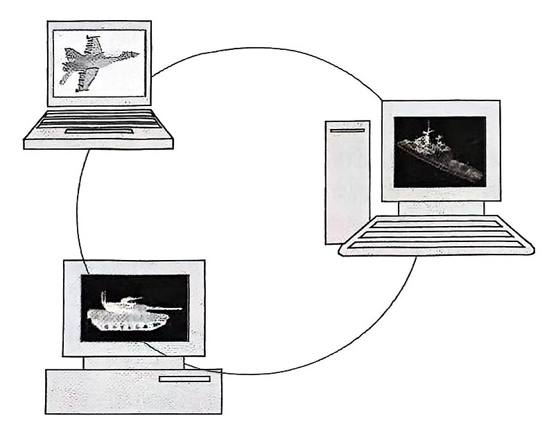
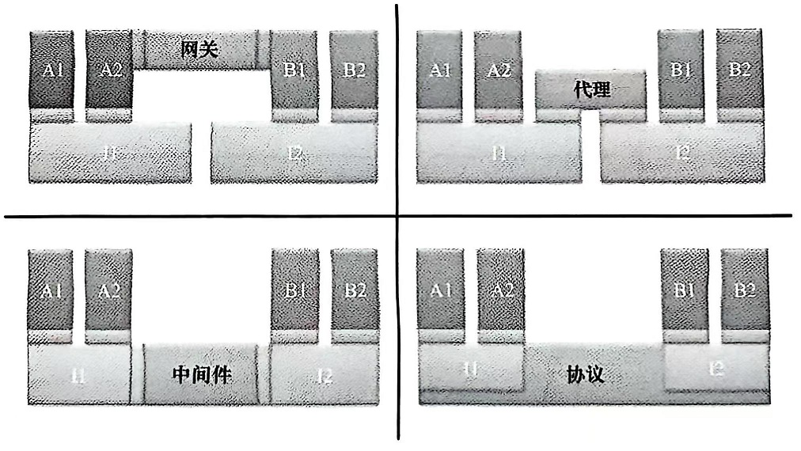
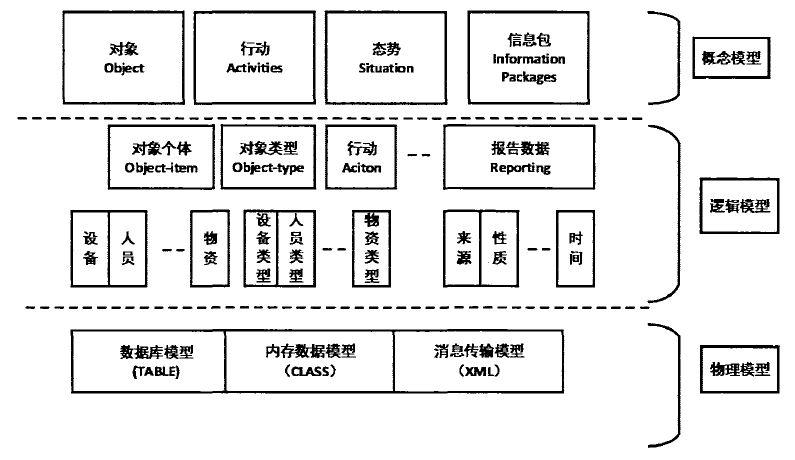
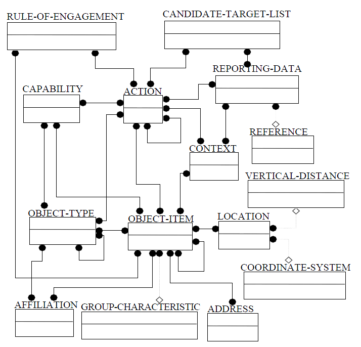
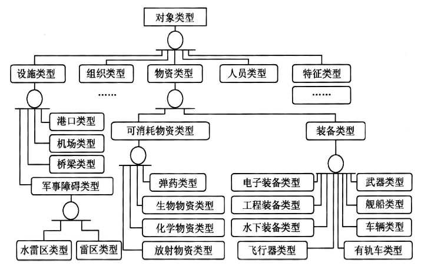
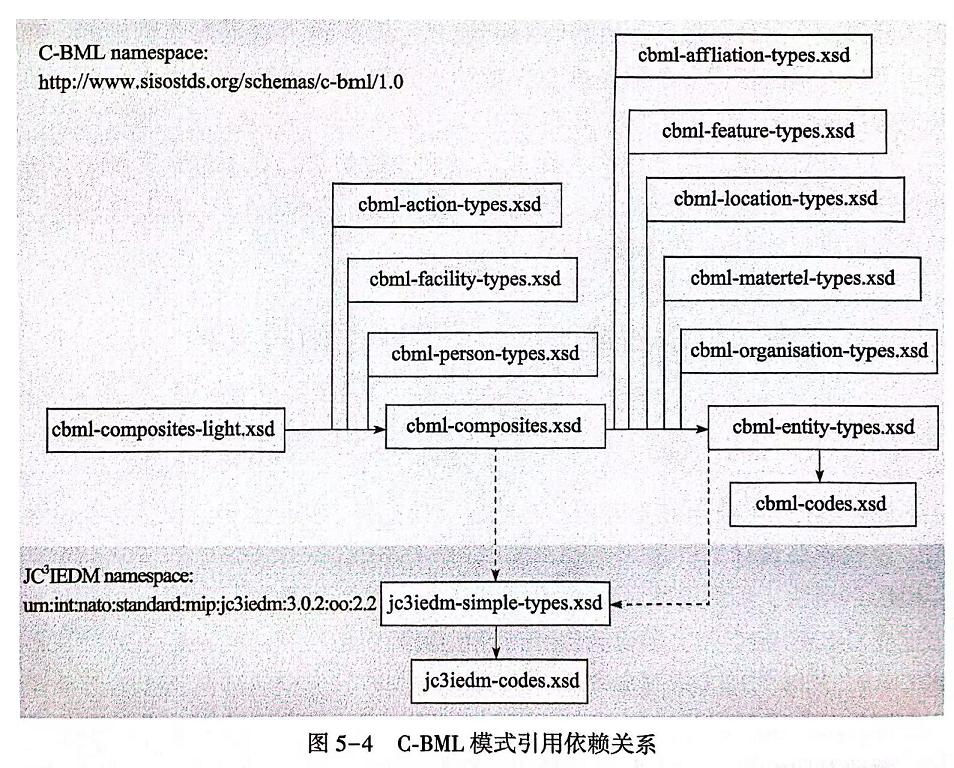
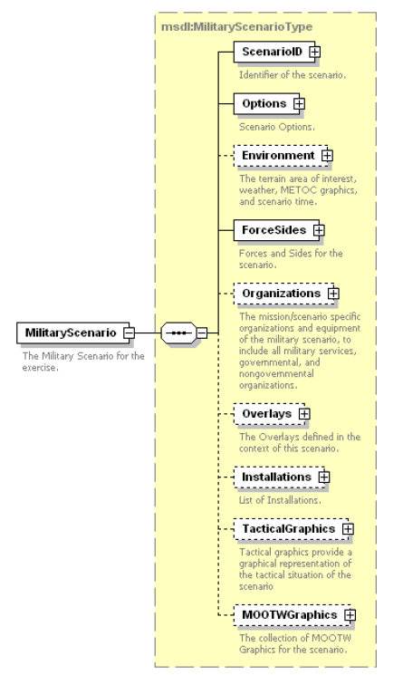
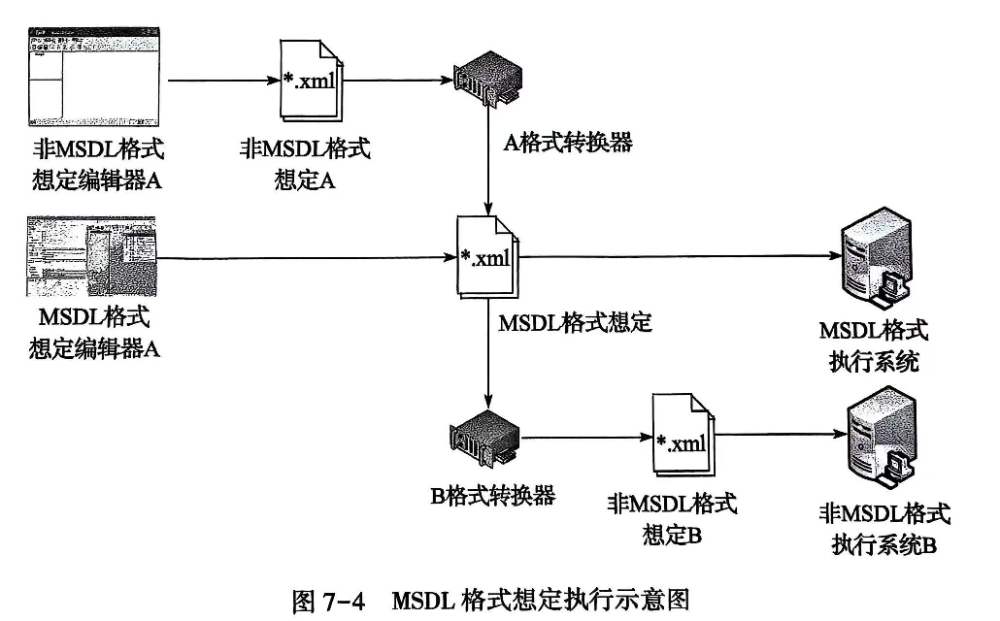

# 分布式仿真与互操作

【摘要】分布式仿真是军事建模仿真领域40年来的发展热点。介绍美国国防部中最广泛使用的实况、虚拟与构造（LVC）仿真架构，包括分布式交互仿真（DIS）、高层体系结构（HLA）、试验与训练使能架构（TENA）。了解分布式仿真面临的挑战，特别是互操作挑战，因为模型重用和互操作是分布式仿真系统设计的最大难点。而各种标准是作战仿真系统互操作的基础（特别是数据标准），有必要了解作战仿真系统的相关互操作标准。

【关键词】 分布式仿真，HLA，互操作，XML

【参考书目】

▲\[美\]Andreas
Tolk主编，郭齐胜，徐享忠等译，作战建模与分布式仿真的工程原理，国防工业出版社，2016.1

邱晓刚，陈彬 等著，基于HLA的分布式仿真环境设计，国防工业出版社，2016.2

▲赵鑫业，作战仿真系统互操作标准，国防工业出版社，2023.6

\[美\]Andrew S.
Tanenbaum著，辛春生，陈宗斌等译，分布式系统原理与范型（第2版），清华大学出版社，2008.6

\[美\]Joe Fawcett等著，刘云鹏，王超
译，XML入门经典（第5版），清华大学出版社，2013

------------------------------------------------------------------------

## 分布式仿真初步

### 产生和发展

随着计算机技术的发展，出现了网络化仿真。新兴的应用领域，以及计算机和通信技术的发展引发了第一代的分布式仿真架构。

1983年由美国国防部高级研究计划局（DARPA）发起的仿真器联网（SIMNET）项目第一次将通信技术应用到仿真中。SIMNET
强调在实战背景下战术分队的表现，包括装甲兵、机械化步兵、直升机、炮兵、通信兵和后勤等。参战人员能够直观地看到自身"窗外"的环境，并且能通过无线频道沟通。这种分布式战场建立在有选择的通真度（只为协同技能训练提供相关属性）、异步信息传递、商用计算机网络和复制的状态信息基础之上。SIMNET包括六大设计原则：

- 实体/事件架构：世界被抽象为以事件交互的实体集合。

- 公共环境：共享对地形及其他自然特征的理解。

- 仿真节点自治：
  一个仿真节点向另一个仿真节点发送事件，并且由接收者确定信息是否与己相关。

- 真实信息传送：各仿真节点负责本地感知，并对相关事件对自身的影响进行建模。

- 状态改变信息传送：仿真只发送实体行为中发生变化的部分。

- 推算定位算法：仿真根据其最后报告位置推算出运动实体的当前位置。

第一套系统安装于1986年4月。SIMNET项目的贡献之一就是半自动兵力（SAF）的发明。SAF的目的是模仿战场上不同对象（不论是车辆还是士兵）的行为。最终，SAF仿真演变成了更智能的事物：他们可以规划路线，避开障碍物，保持合适的队形，侦察和打击目标。

SIMNET项目之后不久，DARPA意识到连接聚合级作战仿真的必要性。聚合级仿真协议（ALSP）将分布式仿真的优势拓展到了集群式兵力训练，使不同的聚合级仿真能够互相配合，为作战人员训练提供实战背景的体验。与SIMNET仿真器相比，这种仿真是事件推进的，保持事件间的因果关系是主要关注的问题。ALSP
项目认为，多样的时间管理计划和更加复杂的仿真实体属性管理需求都是必要的。ALSP的要求源自
SIMNET 基本原理，并且包含以下内容。

- 仿真能够依托公用网络协作形成联邦。

- 联邦中，时间上的因果关系必须得到保持。

- 仿真应该能够在不对仿真实体平衡产生重大影响的前提下加入和退出联盟。

- 系统应是基于网络的，无中央控制器，没有仲裁员。

- 实体交互不需要了解联盟参与者，并且应当支持交互的面向对象视图。

在这段时间内，仿真技术评估工作支持并鼓励了分布式仿真发展及投入。国防科学委员会（DSB）的训练与推演计算机应用专门工作组表示："以计算机为基础的仿真场景，为改善联合作战指挥员、参谋以及向其汇报的下级指挥员、参谋的训练提供了唯一可行的和负担得起的方式"。紧接着又发布了《试验改进与有效性评估》报告，指出建模与仿真（M&S）是在系统全寿命周期（特别是在系统研制的初期）采办中使用的有效工具。

1992年，国防科学委员会（DSB）关注了先进分布式仿真在训练和原型机制造方面的影响。其结论是，分布式仿真技术能够为大幅改善训练提供手段，能够为作战与技术创新创造环境，能够改变采办程序。

认识到
SIMNET的重要性，并出于对网络化仿真活动孤立进行的担优，1989年4月召开了被称为"交互式网络化仿真训练"的会议。与会人员认为，如果有一种手段能够实现信息交互，那么分布式仿真技术就能发展更加迅速；相关技术已经足够稳定、应该开始标准化工作。不久，这个会议就发展成为分布式交互仿真（DIS）研讨会。

1996年，"分布式交互仿真研讨会"转变成一个功能更强大的组织，被称为"仿真互操作标准组织"（SISO）。作一个国际组织，SISO致力于促进建模与仿真的互操作性，以及在更大范围内重用建模与仿真成果。

"分布式交互仿真研讨会"的重大贡献之一就是实况、虚拟、构造（LVC）仿真。实况仿真是指真实的人、操作真实系统参加的建模与仿真（如飞行员驾驶喷气式飞机）。虚拟仿真是指真实的人、操作仿真系统参加的建模与仿真（如飞行员驾驶仿真飞机）。构造仿真是指仿真的人、操作仿真系统参加的建模与仿真（如仿真飞行员驾驶仿真飞机）。实况、虚拟、构造（LVC）分类法是一种常用的模型与仿真分类方式。

### 分布式仿真技术

分布式仿真技术是基于分布式系统技术的。分布式系统是独立计算机的集合，呈现给用户的是单个计算机系统的形式（Tanenbaum,
1995）。

这个定义有两个方面含义。第一方面是硬件：机器是独立的。第二个方面是软件：用户把这个系统看成是一台独立计算机。这种特性为分布式仿真技术提供了一个良好的基础。分布式仿真的目标是在用户心目中建立一个假象，使得整个仿真网络成为一个单一系统，而不是一个不同机器的集合。因此，了解如何区分硬件和软件设计问题是发展该技术的关键。

构建支持分布式仿真的软件存在许多挑战，其中包括透明性、开放性、可扩展性、功能性、容错性和安全性。透明性是特别重要的，因为它涉及组件分布的隐藏，这样整个系统才能被认为是"整体"，而不是一个"独立"仿真的集合。工具是支持分布式仿真软件构建所必需的，特别是支持通信模式以及仿真过程的命名与定位的协议。

在分布式仿真中区分通信基本模式的有两种特性：通信机制和事件同步。通信机制指在两个或更多个仿真实体之间交换数据的方法，包括消息传递、共享内存、远程过程调用、远程方法调用。对于消息传递，根据接收方的数量，传送方式有几种变型。数据可以以单播形式发送给个别仿真实体，以广播形式发送给每一个仿真实体，或者以组播方式发送给所选择的仿真实体子集。诸如发布/订阅机制被用来定义可能的接收方子集。

事件同步指在分布式仿真中为同步数据发送与接收而采取的方法。主要特征包括：时间、事件排序和时间同步。分布式仿真中的仿真实体被假定都遵循同一时间协议，既可以是一种非正式的关系，也可以是严格遵守的仿真时钟或自然时钟。在任何一种情况下，仿真都会对其产生的每个消息指定一个时间戳。事件排序指事件被传递到每个仿真实体的方式，有多种可选择的事件顺序。接收顺序在传递事件时不管消息时间戳及其与全局分布式系统的关系。时间戳顺序是直接以全局时间解释相一致的顺序传递事件。时间同步与时间、事件排序都相关，因为分布式系统关注对全局时间的理解。如果全局时间是必要的，有一些保守和乐观的同步算法可用。

通信机制和事件同步可以有两种方式来实现：通过单个仿真或者操作系统。在分布式系统中常用的操作系统有三种类型。网络操作系统专注于为远程客户端提供本地服务。分布式操作系统专注于向用户提供透明性支持。中间件则结合了网络操作系统的可扩展性和开放性，以及分布式操作系统的透明性和易用性，提供了通用服务支持。不同的途径在功能性、可扩展性和开放性等性能方面不尽相同。现代分布式仿真已经实施了一系列的方法。

美国国防部中最广泛使用的实况、虚拟与构造（LVC）仿真架构包括分布式交互仿真（DIS）、高层体系结构（HLA）、试验与训练使能架构（TENA）。这种第二代的分布式仿真架构已经发展了30年，采用了不同的技术、标准和筹资策略。以下部分将简要介绍每一种架构，并描述其通信与事件同步的方法。

### 分布式交互仿真（DIS）

分布式交互仿真（DIS）的主要任务是定义一套基础设施，目的是为链接处于多个地点的仿真实体，构造实况的、复杂的、虚拟的"世界"，从而实现高度交互的仿真活动。DIS
以SIMNET基本设计原则为基础，目标是创建一个通用的、相容的仿真世界，不同类型的仿真器在其中能够进行交互。实现这一目标的核心是协议数据单元（PDU），它使用标准的交换消息传递实体和事件的状态。PDU
由通用功能相关的实体数据组成，诸如实体状态、开火、爆炸、电磁发射等都是常用的PDU。1993年，电气与电子工程师学会（IEEE）批准了第一个
DIS
标准，包含10个PDU。最近公布的标准中有67个PDU。经批准的分布式交互仿真的IEEE标准包括：

• IEEE 1278.1---应用协议。

• IEEE 1278.1A---枚举和位编码值。

• IEEE 1278.2---通信服务和配置文件。

• IEEE 1278.3---演练管理与反馈 （EMF）。

• IEEE 1278.4---校核、验证与确认（VV&A）。

从实现的角度来看，仿真业主可以定制开发 DIS
接口，也可以购买商业产品。还有一种开放源码的倡议，即 Open-DIS，采用C++
和 Java语言实现了完全的 DIS 协议。

从分布式系统的角度来看，DIS采用网络与仿真器集成的思想，保证了透明性。仿真实体间及其交互的所有通信都是通过PDU实现的，具有合理可靠性的数据传输足够满足需求。其结果是，大多数的
PDU
都采用了尽力传输的用户数据报协议（UDP）来发送。DIS仿真实体之间的交互是对等的，采用了消息传递机制。由于PDU被广播到网络上的每个节点，处理与特定仿真不相关的数据会消耗带宽和计算资源。

### 高层体系结构（HLA）

高层体系结构（HLA）出现在20世纪90年代中期，基于以下几个假设。第一个假设是没有一个仿真能够解决国防部对于建模与仿真所有的功能需求。用户的需求太多样化。变化的用户需求明确了第二个假设：简单地说，就是无法预测未来如何使用或组合仿真。这是非常重要的，因此需要考虑能够以多种方式重复应用的多功能仿真。这意味着，必须构建多功能仿真，使得易于将其他仿真结合在一起，以支持新的不同应用。这些假设在几个方面影响了HLA设计。显然，架构本身必须具备具有明确功能和接口的模块化组件。此外，HLA将单个仿真（或联邦成员）所需的功能与支持交互所需的硬件基础设施相分离。HLA体系结构定义由三个部分组成：

- 规则，仿真必须遵守的标准。

- 对象模型模板（OMT），描述仿真之间交互什么信息、如何留存记录。

- 接口规范文件，定义了一组用于仿真器交互信息的服务。

HLA标准始于1995年，是由架构管理组织（AMG）管理的政府标准过程。1996年，国防部采用了基本的HLA架构，同时这个标准成为由仿真互操作标准组织（SISO）管理的开放性标准。IEEE
于2000年首次批准了HLA标准，包括：

• IEEE 1516 ---架构与规则。

• IEEE 1516.1---联邦成员接口规范。

• IEEE 1516.2---对象模型模板（OMT）规范。

• IEEE 1516.3---联邦开发和执行过程（FEDEP）建议措施。

• IEEE 1516.4---联邦校核、验证与确认的推荐实践。

从分布式系统的角度来看，HLA采用了将单个仿真与仿真通信所需基础设施相分离的思想。这种分离是通过运行时基础设施（RTI）来实现的。RTI
为仿真系统提供公共服务，为联邦成员的逻辑组提供有效通信。数据既可以进行尽力传输（UDP），也可以进行可靠传输（TCP）。一个重要的区别是HLA不等同于RTI。RTI是HLA接口标准的一个实现，满足HLA接口标准可以有很多不同的RTI。从实现的角度来看，HLA遵循商业经营模式。

相比于DIS中的静态
PDU，HLA使用OMT概念来描述仿真之间的信息。这使得仿真用户根据联邦的需要来自定义仿真中的交互信息类型。当OMT用来定义联邦中的数据时，联邦对象模型（FOM）描述共享信息（如对象、交互）和联邦间的问题（如数据编码方案）。然而，没有多久就遭遇了FOM开发的困难。这导致了参考FOM（一种表示共用信息的机制）以及基本对象模型（BOM）（一种表示单一的对象模型数据的机制）的产生。

从通信的角度来看，HLA了解到广播对于性能的严重影响。HLA定义了发布/订阅机制，信息提供方描述其所产生的数据、接收者描述其所关心的数据。然后
RTI将所发布的与所订阅的数据进行匹配。这种方法最大程度地提高网络性能，允许单个仿真实体对其所需要接收的不同层次数据进行筛选。

HLA正是包含时间管理服务才能支持事件排序。HLA既支持消息以时间戳顺序传递给仿真实体的时间戳规则，也支持消息以接收顺序传递给仿真实体的接收规则。整体时间推进和事件排序通过同步算法实现。虽然HLA提供整体时间管理，但是使用这些服务并不是必需的。仿真可以选择以自己的步长推进时间，而不是与其他仿真同步。

### 试验与训练使能架构（TENA）

试验与训练使能架构（TENA）出现在20世纪90年代后期，是在HLA倡议开始之后。TENA的目的是为做三件事情提供架构和软件实施需要。首先，TENA使得系统、设备、仿真实体以及
C4ISR
系统能够以快速、合理的方式进行互操作。它还促进了设备效用的重用以及未来发展的重用。最后，TENA还为在可重用、可互操作的元素中进行快速装配、初始化、测试和执行系统提供了可组合能力。

TENA的原则包括受限组装性、动态运行特性、订阅服务、受控信息访问、商定的服务质量。受限组装性指为特定的预期目的组装系统的能力，这个目的既可以是暂时、也可以是长久的。约束适用于设备使用，包括物理接近度和位置、覆盖区域、表现能力以及子系统的兼容性。动态运行时特性关注的重点是对许多允许构成以及快速重组的响应。这是通过构建数据表示的自我描述方法来实现的，可以是在教据传送前或过程中，或者是在操作开始之前协商问题表示时。与HLA相似，订阅服务是一种基于对象的数据访问方法，这使得信息产生者与使用者相匹配。由于靶场许多资产的性质，受控信息访问是特别重要的。访问级别允许用户将信息访问限制在所需的用户子集。由于一些服务有着重大功能和成本影响（如大容量要求或严格的时延容限的数据流），用户可以根据需要申请专门的设备分配。商定的服务质量协议依赖于数据与控制信息相分离的原则。

从分布式系统的观点来看，TENA通过中间件将靶场设备的功能与靶场设备间通信所需基础设施相分离。TENA中间件是所有应用程序中的通用通信机制，它提供了一个唯一的、通用的数据交换解决方案。

靶场设备间数据交换被定义在对象模型中，既可采用尽力传输的网络协议（UDP），也可采用可靠传输的网络协议（TCP）。逻辑靶场对象模型被定义给一个特定的执行，可以同时包含标准的对象（时间、位置、方向等）和用户自定义对象。

TENA中间件结合了多种通信技术，包括分布式共享内存、匿名发布/订阅、远程方法调用以及针对数据流（音频、视频、遥测和战术数据链）的本地支持。TENA的核心是有状态的分布式对象（SDO）概念。这是一个带数据或状态的
CORBA（通用对象请求代理架构）分布式对象的组合。使用发布/订阅范式就能进行传播，如果它是一个本地对象订阅方就可以收到有状态的分布式对象（SDO）。SDO可以有远程调用方法。

考虑到靶场实时设备的性质，支持事件排序的时钟管理就没有了需求。消息以接收到的顺序发送给相关设备。TENA中时钟定义是用来管理测试设备中的时间问题的。这包括同步与时间没定的服务，以及全局时钟维持。

## 并行仿真技术

顺便简单介绍并行仿真技术，不作为重点。

1．什么是并行仿真

并行仿真（Parallel
Simulation）是指将一个仿真程序分解到并行计算机的多个处理器上并行执行的技术。并行离散事件仿真（PDES）是将一个离散事件仿真程序分解到并行计算机的多个处理器上并行执行的技术。并行仿真的最大优点是具有高的处理速度，因而可方便地实现一些大型复杂系统的快速仿真。

并行仿真基于并行处理技术。并行处理是将一项大的数据处理与数值计算任务分解成为多个可以相互独立、同时进行的子任务，并通过对这些子任务相互协调地运行和实现，从而达到快速、高效地对给定问题求解的处理方法。通常，为并行处理所设计的计算机统称并行计算机；在并行计算机上求解问题称为并行计算；在并行计算机上实现求解问题的算法可称之为并行算法；利用并行计算机和并行算法进行仿真研究则称为并行仿真。并行算法的本质是把多任务映射到多逻辑进程（LP）中执行，或将现实的多维问题映射到具有特定拓扑结构的多LP上求解。

这里的"并行"有两种含义：一是同时性，指两个或多个事件在同一时刻发生；二是并发性，指两个或多个事件在同一时间间隔内发生。如在多位并行加法运算中，由于存在信息由低位向高位进位过程的延迟，实际相加过程是低位处于领先地位。因此，n位加法并不是在同一时刻得到加法结果，而是经一定时间间隔完成，这里的并发性不是同时性，而只有并发性关系。

从计算复杂性的角度来考虑，一个算法的复杂性可表示为空间复杂性和时间复杂性两个方面。并行算法是通过增加空间复杂性（如增加空间的维数及增加处理器的台数）来尽可能减少时间复杂性的。

2．并行仿真环境

并行仿真引擎或内核，是并行仿真系统种最为重要的结构层次，是并行仿真任务实现的主要承担者。并行仿真内核的主要功能是对并行仿真任务进行调度和划分，根据仿真任务的不同特点以及仿真目标选择合适的仿真同步策略，将仿真模型转化为并行执行单元，同时收集仿真过程数据，提供各处理机之间的仿真信息通信服务。

SPEEDES是一种比较成熟的通用高性能并行仿真引擎，已经被用于多个美军大型军用仿真系统，包括JSIM、WARGAME
2000、JMASS、NSS等。

仿真模型的并行化分解必须与并行机的具体结构相结合，这使得一般仿真人员和应用领域专家很难直接、有效地开发基于并行计算机的仿真应用。这是并行仿真技术虽然经过几十年发展仍难以普及的主要原因。因此，研究和开发适用于不同并行计算机体系结构的通用、高性能并行仿真建模及运行环境，使应用领域专家在此环境之上可以不考虑并行执行的特殊性来开发仿真应用就成为一种强烈的需求。

与并行处理系统一样，并行仿真环境需要解决多机协调控制、同步及通信、并行算法、并行操作系统等问题。

例如，多机协调控制。主要特征是并行运算和资源共享。随着LP数目的增加，对资源的竞争以及由此产生的"死锁"和"排斥"问题日益严重。为解决这些问题，多机协调控制技术的有效性及完备性需要解决。目前，时序调度法、优先级调度法、超时自限法和开锁关锁法等方法在不同类型的并行处理系统中得到应用。

3．并行仿真与分布式仿真

并行仿真与分布式仿真的相同点在于所涉及的技术，如时间同步算法、通信、检查点与恢复等。它们的区别简单来说就是，并行仿真运行在高性能并行计算机上，分布式仿真运行在地理位置分散的多个计算机上。并行仿真中的实体结构相似，对运行环境的要求基本相同，实体之间是紧耦合的，对通信速率的要求较高，如果在通信延迟大的环境中运行，会使仿真系统性能严重下降；分布式仿真中各个联邦成员的结构一般相差较大，对运行环境、外部资源的要求也不尽相同，能容忍的通信延迟相对较高。这种对环境的不同要求是二者的区分标志。但是，计算机技术和网络技术的发展使高速互联设备的价格大幅下降，普通工作站的性能大幅提高，可以将地理位置分散的计算机通过高速互联设备构建出高性能的集群计算机，既满足并行仿真的需求，也满足分布式仿真的需求，这样并行仿真与分布式仿真的区别就不那么明显了。

## 分布式仿真面临的挑战

每个仿真系统都是在特定的环境中仿真它的实体。各系统中展现的环境可能差异巨大。建立联邦时，仿真工程师必须确保采用不会造成系统性偏差的方式来表现环境。这是一项非常困难的任务。

分布式系统作为一般的通用架构同样面临一些挑战。首先对其进行快速回顾，然后再评估分布式仿真需要解决的挑战，包括概念模型和相关元数据、时间同步、多分辨率建模、互操作等。

### 分布式系统

分布式仿真通常被视为是分布式系统的子领域。分布式计算系统涉及在多台自治计算机上并行运行的软件。Tanenbaum（2006）从理论视角对相关问题进行了很好的介绍。

<figure>
  
  <figcaption>图 6‑1 分布式计算机系统</figcaption>
</figure>

我们先举一个简单的例子。如图所示是一个由三台计算机组成的简单计算机网络。其中一台运行由美国陆军研发的模型，另外两台运行由美国空军和海军开发的模型。仿真工程师的任务是利用这三套模型支持联合演练。在开始详细研究这三个模型之前，必须先连接这些计算机系统。

在连接这些计算机系统过程中，我们需要理解几项挑战，回答以下问题：

（1）主机是否能够进入计算机网络？

由于作战模型中通常包含涉密信息，访问该计算机可能会有问题。对于国际间的联合演练或当作战要素是网络的一部分时，这一问题更为重要。

（2）是否所有计算机都支持各种不同版本网络协议的兼容？

ISO/OSI参考模型定义了参考模型基础层必须提供的性能。这允许不同提供者可以支持可选的实现方案，并可互操作。与此同时，所有型号的计算机和不同的操作系统都可以通过互联网参与其中。

（3）是否所有支撑仿真程序已拥有共同的信息交换标准？

许多仿真系统在设计上都是单机系统，并不具备互通的能力。尽管在军事仿真领域，大部分仿真系统都可以获取数据，但也存在例外。并非每一个信息交换方案都适用于所有仿真系统。另外一个挑战可能是使用的不同信息交换方案并不兼容，因此，需要中间件和网关。

（4）是否具备充足的仿真系统知识？

实际情况中，该问题的答案通常都是否定的。为了集成所有仿真系统，需要各层次集成专家。这始于成功实施一次仿真所需的组件，止于可访问的仿真所用数据来源和格式的相关详细专业知识。部分系统使用数据库，其他系统将所有数据存储在运行时结构中。部分系统使用对象库、XML文件，部分老旧系统可能仍使用纯文本或以逗号分割的数据文件。各类型并无限制，而且在文档中很少能获取这类信息。提供网络基础设施本身通常就已经是很大的挑战。

### 概念建模需求

何谓概念建模？为什么对分布式仿真具有重要作用？

概念模型是将要、正在或已经研发计算机仿真模型的一种与软件无关的描述，它描述了模型的目标、输入、输出、内容、假设条件和简化。概念模型建立了对于开发总体模型至关重要的公共视角。概念模型特别关注问题的理解、建模与项目目的以及模型内容的确定、假设条件和简化的识别。总之，概念模型描述了仿真推演、演练或分析任务需要什么。它定义了需要在仿真任务中执行的任务的蓝图。

为了确保仿真系统的使用能够为演练提供支持，我们必须回答下列问题，而且答案还需要以描述系统的元数据的形式给出。这些答案是概念模型的核心。

- 建立哪些武器系统和/或部队的模型？

<!-- -->

- 武器系统是如何与部队关联的？

<!-- -->

- 建立哪些程序（如射击、观察、机动、通信等）的模型？

- 建立哪些影响（武器系统或部队如何改变）的模型？

- 建立哪些影响武器系统或部队的事件的模型？

事实上，仿真系统需要关注与建模对象有关的所有实现细节。

模型层面的仿真组件的信息至少应该包括实体−事件−状态实例，这些也经常运用于概念建模方法，尤其是那些与仿真实现相关的方法：

（1）实体就是仿真的对象，表示武器系统或军事单元（代表不再被进一步分解的概念）。实体以属性进行分类。

（2）事件连接实体。一旦事件发生，实体将会受到影响。

（3）实体状态等同于这些实体的具体属性值的集合。例如，如果一个系统的速度属性取值为0，则该系统可能被定义为处于"静止"状态。

通过规定存在哪些实体和事件、实体和事件之间的关系以及受事件影响时实体状态会发生何种变化，就可以完成仿真系统的实现。一旦理解了概念层面，实现层面的映射就相对直观了。如果仿真系统运用相同的概念来表示相同的现象，如运用日期−时间描述日期、时区和该时区以时分秒计量的时间，那么这种表示是等价的。一方可能用日−月−年的组成对日期建模，另一方可能计量始于特定参考日期的天数。这两种观点均是同样有效的，而且表达了相同的概念。如果两个系统都定义了坐标系，但是一个采用平面地球UTM坐标，另一个采用地心坐标，那么，只有"坐标"这一名称是相同的，潜在的概念是不同的。

### 时间同步

在仿真系统中，时间的推进可以用不同的方式表示。某些逻辑系统根本不需要对时间进行建模，而其他一些系统则假定仿真过程实时推进。我们还引入了事件驱动系统和时间步长驱动系统。无论哪种情况，当部分系统在联网但自治的计算机上运行时，同步将会成为一个必须解决的问题。前两种类型------没有时间和实时同步相对比较简单，因为它们主要关注同步问题和有效传递信息。

然而，并行仿真系统采用了不同的方式来推进时间，在经过同样的执行时间之后，仿真时间可能大为不同。在这种情况下，在系统之间维持一致的时间将会变得十分棘手。

因此，在分布式仿真环境中，时间管理将会十分必要。

定义：时间不一致出现在以下情况，在某个重叠的仿真时间段内，两个实体对于第三方实体的状态表述存有冲突或不一致。

### 多分辨率、聚合与解聚

不同的仿真系统可能基于不同范围、分辨率和结构的模型。正如不同时间步长例子中，实体模型或用于建立这些实体模型的属性不同，就需要建立一个有共同视图的信息交换模型。换句话说，这两种模型必须在描述这两个系统可以理解的仿真态势的实体和属性上达成一致共识。然而，这意味着更高分辨率的模型必须聚合其视图，而较低分辨率的模型必须解聚其视图。在这两种情况下，都可能发生映射不一致。

定义：当某个实体进行跨越分辨率层次的一系列转换时，造成一种在该变换序列所覆盖的仿真时间内本不可能进入的状态，即发生了映射不一致。

通常，为了解决服务于共同目标的多个模型分辨率造成的概念上和表现上的差异，总是需要多分辨率建模。每当将两个仿真系统构成联邦时，它们的范围、分辨率、结构以及时间表示可能是不同的。引入共同的信息交换模型、建立一个共同的视图，只是转移了问题，因为此时需要聚合和解聚以将模型映射到这个共同的信息交换模型上。

应用多个范式和解决方案的联邦的有效性是显而易见的：作战人员可能希望清晰地知道战区层面的作战进展情况，但同时关注一些选定热点（如关键目标区域、城市交战、特种作战）的细节。因此，战区级仿真系统被用来获取态势图，而可互操作、嵌入式高分辨率模型被用来表现热点地区。用户甚至可以使用更为详细的分析，以找出如何改善这些热点的状况，引入三个或更多的细节层次。

### 互操作挑战

国防部使用的分布式仿真架构都是为满足一个或多个用户群体的需求设计的。这些架构在变化的需求中不断发展与成熟，于是就存在多个架构。由于DIS、HLA和TENA之同的不兼容性，需要发展相应的解决方案，以有效地将不同架构整合成单一的、统一的仿真服务。集成通常通过网关解决，而这往往将用户限制在一组有限的能力中。分布式仿真的成功整合将继续依靠仿真标准的发展。

尽管分布式仿真技术与标准产生了进步，但挑战依然存在。在2008年对分布式仿真未来发展趋势调查中，最有前途的仿真研究领域被确定为分布式仿真中间件、人机界面以及语义网络/互操作性。对仿真中间件来说，所认同的最大需求是即插即用能力、标准化以及不同标准间的互操作、语义连通性。

当两个不同的基础设施解决方案使用或需要连接时，可应用四种解决方案：网关、代理、中间件、协议。

（1）网关，提供了由不同基础设施解决方案支持的仿真系统间的连接和转换。网关的关注重点是仿真系统，而不是配套的基础设施。

（2）代理，是连接不同基础设施解决方案的仿真系统。它包含多个仿真系统共享的公共要素，包括实体和事件，并使用由仿真系统基础设施提供的接口。

（3）中间件，把基础设施连接到一起，并允许使用基础设施的服务，通过接口程序界面相互作用。这两个基础设施保持不变，但是提供给其他基础设施的接口通常比提供给仿真系统的接口更加丰富。

（4）协议，扩展了基础设施从网络协议层到二进制层的互操作功能。

如图所示是这四个类别，涉及四个不同的仿真系统，分别是A1、A2、B1
和B2。它们由两种不同的互操作基础设施I1
和I2提供支撑。四个类别分别使用网关连接两个仿真系统，使用代理经由仿真系统接口与有关基础设施连接，使用中间件经由基础设施接口连接到有关基础设施，通过扩展二进制层协议连接到有关基础设施。

<figure>
  
  <figcaption>图 6‑2 网关、代理、中间件及协议</figcaption>
</figure>

我们可以在信息交换模型层区分异构和同构，也区分了基理设施层的同构与异构。结果有四种情况：

• 基础设施同构、信息交换模型同构。

• 基础设施异构、信息交换模型同构。

• 基础设施同构、信息交换模型异构。

• 基础设施异构、信息交换模型异构。

因此，必须解决两种不同类型的问题：建模层面的代表是信息内容的映射，实现层面的代表是信息结构的映射。这两个层面均存在时序限制，然而，建模层面需要解决时间的概念化和逻辑时间表示的同步，与此同时，实现层面涉及网络延迟和吞吐量。

对仿真解决方案进行成功的集成以构建联邦，需要基础设施的可集成性、仿真系统的互操作性、底层作战模型的可组装性。成功的互操作解决方案标准必须解决互操作的所有三类问题。建议对互操作的三个指导性概念进行明确区分。

（1）可集成性：对应系统互连的物理/技术领域，包括硬件、软硬相结合的固件、协议、网络等。

（2）互操作性：对应软件和互操作的实现细节，包括通过接口的数据元素交换、中间件的使用、到公共信息交换模型的映射等。

（3）可组装性：对应建模层面的协调问题。现实被进行概念化，由最终系统进行实现，底层模型则是对现实的有目的的抽象。

## 作战仿真系统互操作

互操作性是军事信息系统建设的重难点问题之一，具有迫切的军事应用需求。但是，目前还缺乏系统有效可操作方法，目前世界上包括作战仿真系统和指挥信息系统在内的多数军事信息系统并不具备互操作性。不同组织/部门有许多不同类型的军事信息系统，多数不具备与其他系统直接连通的能力。正确地进行体系结构设计是系统间互操作性实现的基础，而统一标准是实现系统互联互通互操作以及信息资源共享的关键。

### 互操作性的内涵

系统间的互操作可以方便系统的重用，而系统的重用是为了快速、经济地开发系统。将作战仿真的遗留系统进行改造，提高其可组合性，提高异构系统的集成程度，随着人们对问题认知的不断深入和新需求的不断涌现，实现系统的在线动态演化能力。

互操作性是系统、单元或人员为（或从）其他系统、单元或人员提供（或接收）服务，并利用该服务的交换提高它们协同操作的效率。各个系统间需要良好的数据共享和交换能力，同时各系统由于业务功能不同又存在着不同的数据需求。作为参考，给出有关互操作性的几种常见定义：

（1）《美国国防部军事及相关词汇词典》：实体向其他实体提供服务和从其他实体接受服务并使用这些服务使得他们之间能够有效地协同工作的能力。

（2）IEEE：两个或更多的系统或要素交换信息和使用已交换信息的能力。

（3）仿真互操作标准化组织（SISO）：在一个系统或过程中，通过其可交换的部件，在没有预先约定数据通信路径的情况下，实现系统各部件协调工作。

（4）我国《军用仿真术语》：一个模型或作战仿真系统向其他模型和作战仿真系统提供服务、并从其他模型和作战仿真系统接收服务，以及利用这样交换的服务使各模型或作战仿真系统有效地共同运转的能力。

归纳可知，互操作包括两个方面特征：一是信息共享，就是需要在实施互操作的系统之间进行信息传递；二是有效协同，就是信息接收系统按照信息发送系统的意图执行相关动作，进而得出互操作本质是一种带有意图的信息交互行为的结论。

### 异构系统带来的互操作挑战

作战仿真系统的建模和开发组织不同，针对的问题不同，组分的定义和采用的结构不同，是典型的异构系统。互操作性问题并非纯粹的技术问题。异构系统的根本问题是系统的所有者（owner）不同，利益不同。

（1）异构系统带来的语义理解问题。

一是语词异构，即两个系统采用的信息描述编码不一致，比如对空间坐标的描述，就有方里网坐标、直角坐标和经纬坐标3种，作战仿真系统多采用经纬坐标（地理坐标系），而且数据的描述形式也不一致，存在小数点描述和度分秒描述两种；二是语法异构，即采用不同的语词组织规则，比如作战仿真系统多采用
IEEE
1516标准、逻辑靶场对象模型（LROM）等标准，指挥信息系统多采用自定义技术标准；三是语义异质，即语词所指代概念的内涵和外延不一致，比如任务概念，指挥信息系统的外延包括战略任务、战役任务和战术任务，但是作战仿真系统一般将仿真模型定位在战术级，所以其任务概念的外延只有战术任务。

（2）共享信息的多分辨率问题。

联合作战方案仿真推演，共享的主要信息就是指挥信息系统生成的战役级联合作战方案，美军2017版联合出版物《JP
5-0联合计划纲要》将其定义为："用于完成某一使命由作战单位或实体担负的行动序列"，是作战计划的中间产品，参考经典任务规划对计划的定义，可知联合作战方案主要包括初始态势、终止态势和用于实现终止态势的任务集合，体现了指挥员对作战过程和战法的设想，也就是指挥员的意图。联合作战方案以战役级任务为主，担负战役任务的是战役任务执行单位，其中一个战役任务可以分解为多个相互关联的战术任务集合。

仿真推演使用的作战仿真系统为战役层，为了保证仿真效果，一般需要将分辨率提高一个层次，采用战术级实体模型来进行战役仿真，战术级仿真模型能够担负的是战术任务。

可见，指挥信息系统和作战仿真系统对联合作战方案信息的理解处于不同的分辨率，战役任务很难通过语义推理映射到作战仿真系统的战术级模型指令上，需要基于任务的初始态势，根据指挥员意图进行战术任务规划。

### 信息描述语言

当前互操作框架模型可以大致归纳为信息框架和软件框架两个部分：信息框架从信息角度，阐述共享信息的描述语言和层次划分；软件框架描述软件的集成程度和度量方法。

语言是信息描述的基础。对于信息描述语言，1998年，美军开始对作战管理语言进行研究。2004年，SISO
成立研究小组，开发联合作战管理语言（C-BML），用于在联盟作战中C3I、作战仿真系统、自治无人系统之间计划、命令、需求和报告的描述和交换，用于支持实战化训练、联合作战方案分析和任务演练，计划开发数据模型、形式化结构（语法）、形式化语义（本体）等三个阶段产品。2008年，SISO组织发布了军事想定语言（MSDL），用于规范系统之间共享想定信息的描述。2014年，在C-BML、MSDL
的基础上，SISO开发了指控系统和仿真系统之间互操作标准（C2SIM）。

语言描述能力等级，划分为语形（morphology）、语义（semantics）和语用（pragmatics）等三个层次，这三个层次逐级递进，前一层次是下一层次的基础。

### 软件集成

从软件集成程度角度，互操作可以分为离线模式、在线模式和集成模式等三个层次。

（1）离线模式，属于低层次互操作，发起互操作的系统将需要共享的信息导出为数据文件，接受互操作的系统通过导入数据文件实现两个系统的互操作，离线模式对系统修改程度最小，效率也最低。

（2）在线模式，根据互操作系统的数量进一步分为一对一模式和多系统模式，其中一对一模式一般通过设立网关来实现两个系统间共享信息的传递，多系统模式一般采用总线或黑板来实现共享信息的传递。不需要人工介入，且对系统的修改量较小。

（3）集成模式，属于高层次互操作，通过体系结构设计，可以将需要互操作的系统集成为一个有机整体，这种方法信息传递效率最高，但是需要对两个系统进行较大程度修改，不太适用于修改代价过高的遗留系统。

### 美军作战仿真系统互操作性分析

在军事训练、装备采办、作战评估等巨大需求的牵引下，美军围绕军事信息系统之间的互操作开展了广泛研究，取得了大量在业界领先的成果。

以战区级联合作战模拟系统（JTLS）为例，JTLS
是一个交互式、多方参与的作战推演系统，已嵌入到美军战役作战计划系统中，装备于各战区级、战役级指挥所，可用于陆、海、空等作战环境于一体的联合作战行动评估、联合作战计划分析、备选军事战略评定、应急计划和联合战术的分析制定等。JTLS
具有规范化的与实装系统互操作接口，制定了一系列与实装进行信息交换的接口、模型、规范，包含数据库交互规范、人机交互接口规范、信息传输交互规范、作战模型规范等，并开发了一系列信息交互工具。

美军提出了对仿真互操作性的要求，形成了大量的标准和模型：

（1）公共体系结构。建模与仿真和C4I系统必须遵循 DODAF。

（2）公共数据交换模型。美军指挥信息系统基于 DII
COE（国防信息基础设施通用作战环境）、GIG
等架构，采用C2IEDM、JC3IEDM等信息交换模型，通过USMTF（美军文本格式报文）、TADL（战术数据链报文）、VMF（可变格式报文）、OTH-GOLD（地平线上目标GOLD文电格式）等报文及JCDB（联合公共数据库）等军事数据库进行交互。

（3）通信架构。基于 DIS、聚合级仿真协议（ALSP）、HLA等架构，采用FOM、BOM
等信息交换模型，通过PDU（协议数据单元）、CCSIL（指控仿真接口语言）等协议等仿真数据库进行交互。

（4）公共描述语言方面：提出了XBML、CBML，以实现作战计划与命令的标准化与自动化，从而在指挥信息系统和作战仿真系统之间通用。

## 互操作相关标准

军事信息系统建设标准是为了适应网络化联合作战，实现信息系统的互联互通互操作。在标准分类上，一般分为信息处理标准，信息传输标准，信息建模、元数据与信息交换标准，人机接口标准，信息安全标准等5类。

### C2IEDM数据模型

公共的规范和结构化表示是信息自动化交换的前提。结构化信息以数据模型（Data
Model）的形式进行表示，并以通用的方法学建立及文档化（如UML、XML）。数据模型定义了信息（数据）的标准元素，这些元素构成指挥信息系统和作战仿真系统互操作的基础。

指挥控制信息交换数据模型（Command and Control Information Exchange Data
Model,
C2IEDM）是一种基于信息交换的数据模型，可以满足指挥信息系统数据分发的需求。

1998年，北约和29个成员国联合建立多边互操作计划（MIP），定义了支持指挥信息系统同步而交换的最小信息量规范。其目标是：通过战场信息建模，实现指挥控制信息系统在战役、战术各个层次的互联互通，支持跨国多军种联合作战。2001年，合并陆军战术指挥控制系统（ACCCIS，北约标准ADatP-32）扩展建立C2IEDM。2003年11月，发布C2IEDM集线器版本6.1。

#### 组成结构

C2IEDM数据模型包括两类：通用集线器和功能区。其基本思想是，由指控用户需求驱动的数据模型必须包含来自军事领域多个功能区的信息。所有通用数据，都成为集线器的一部分，其余数据被建模为集线器到功能区的特定扩展。

主要内容包括：

（1）进行需求分析，对交换信息进行说明和结构化，确定模型的语境。

（2）定义基本的概念为实体，即任何可分辨的人、位置、物、事件或概念。实体的性质或特征被认为是属性，属性明确了要记录的数据。C2IEDM包括194个实体，其中15个顶层实体。

（3）定义了实体之间的关系，并说明了关系的约束。

（4）定义了模型中枚举类型的取值范围，并定义了模型中的业务规则。

（5）模型通过E-R 图和数据库表的形式描述。

+----------------+----------------------------------------------------------------------------------------------------------------------------------------------------------------------------------------------------------------------------------+
| 概念           | 定义                                                                                                                                                                                                                             |
+================+==================================================================================================================================================================================================================================+
| 对象条目       | 具有军事意义的个体识别对象，例如特定人员、特定物料、特定地理特征、特定协调措施或特定单位                                                                                                                                         |
|                |                                                                                                                                                                                                                                  |
| OBJECT_ITEM    |                                                                                                                                                                                                                                  |
+----------------+----------------------------------------------------------------------------------------------------------------------------------------------------------------------------------------------------------------------------------+
| 对象类型       | 具有军事意义的个体标识对象类型，例如人员类型（例如按等级划分），物资类型（例如自行榴弹炮），设施类型（例如飞机场），地物类型（例如受限火区）或组织的类型（例如装甲师）                                                           |
|                |                                                                                                                                                                                                                                  |
| OBJECT_TYPE    |                                                                                                                                                                                                                                  |
+----------------+----------------------------------------------------------------------------------------------------------------------------------------------------------------------------------------------------------------------------------+
| 能力           | 从事工作、履行职能或使命、实现目的或提供服务的潜在能力                                                                                                                                                                           |
|                |                                                                                                                                                                                                                                  |
| CAPABILITY     |                                                                                                                                                                                                                                  |
+----------------+----------------------------------------------------------------------------------------------------------------------------------------------------------------------------------------------------------------------------------+
| 位置           | 相对于指定的坐标系和从指定基准测得的垂直距离的位置和几何规格，例如点、点序列、折线、圆、矩形、椭圆形、扇形区域、多边形区域、球体、空间块和圆锥体                                                                                 |
|                |                                                                                                                                                                                                                                  |
| LOCATION       |                                                                                                                                                                                                                                  |
+----------------+----------------------------------------------------------------------------------------------------------------------------------------------------------------------------------------------------------------------------------+
| 行动           | 利用可用的资源并且可能针对某个目标进行一项活动，例如作战命令、作战计划、移动命令、移动计划、火力攻击命令、火力攻击计划、火力攻击任务、近距离空中支授任务、后勤请求、事件（例如未知的、来袭的飞机），或突发事件（例如敌人的进攻） |
|                |                                                                                                                                                                                                                                  |
| ACTION         |                                                                                                                                                                                                                                  |
+----------------+----------------------------------------------------------------------------------------------------------------------------------------------------------------------------------------------------------------------------------+
|                |                                                                                                                                                                                                                                  |
+----------------+----------------------------------------------------------------------------------------------------------------------------------------------------------------------------------------------------------------------------------+

: 表 6--1 C2IEDM集线器概念

C2IEDM 包括三个模型：概念的、逻辑的和物理的。

（1）概念数据模型：通用的概念表示信息的高层视图，如行动（Action）、组织（Organization）、物资（Material）、人员（Personnel）、特征（Feature）、设施（Facility）、位置（Location）等。这个模型是高层指挥员比较感兴趣的信息结构。

（2）逻辑数据模型：表示所有信息，它通常以分解高层概念到具体信息为基础。例如，坦克属于物质中装备的一种，这种分解按照人的推理模式，使指挥信息系统通过认知来归纳，如坦克是装备。逻辑数据模型以一种实体-属性-关系图说明了数据结构化的方法，并支持文档化。

（3）物理数据模型：提供了产生定义数据库结构所需的物理模式需要的消息说明，它主要为开发人员建立支持C2IEDM
的系统服务。

C2IEDM模型的图表用IDEF1x 表示。

#### 对象分类

C2IEDM集线器能够按需扩展的另一个重要方法是广泛使用对象分类机制。例如，OBJECT_ITEM
的类别代码包括FACILITY、FEATURE、MATERIAL、ORGANIZATION和PERSON，并引入类别代码UNKNOWN，表示已被跟踪但尚未分类。

每个概念都由一组明确的属性进一步定义。C2IEDM
使用类别代码和子类别代码，这些代码由明确的枚举所定义。

#### 对象和条目

战场由大量对象（Object）组成，每个对象都有其自己的特征。C2IEDM中的每个对象都取决于类型和实例。两个结构------对象类型（OBJECT_TYPE）和对象条目（OBJECT_ITEM）构成了对象树的核心。

C2IEDM将对象类型标记为
OBJECT_TYPE，而单独确认的对象条目（或个体）被标记为
OBJECT_ITEM。虽然在类型方面收集了一般属性，例如一般的能力和性能，但只有在条目方面才关注实例化的具体值。

OBJECT_TYPE 和 OBJECT_ITEM之间的另一个区别在于 OBJECT_TYPE
的相关数据是相对静态和持久的（即属性值不会随着时间经常变化），而OBJECT_ITEM
可能更加动态。

举例说明，一个特定类型的驱逐舰类由一系列相关实体定义，每个实体连接到"该类型驱逐舰"的OBJECT_TYPE，并且每个都定义了一些该类型的类属性。这些类属性是持久性的属性（例如物理参数、功能、作战能力等）。然后可能存在一个属于055
驱逐舰的特定实例，属于名义上的（对于仿真实体而言）或实际的单元。它将具有许多其他属性，例如位置、当前状态、相关供应（例如燃料、弹药、食物）和其他参数。它也将被连接到组织层次结构，显示其所属的军事结构（例如单位、子单位等）。

#### 模型的互操作能力

C2IEDM
对信息系统互操作的支持首先通过模型提供的语义基础体现。由于它定义了一些公共概念，形成了信息系统的官方语言，从而保证了对相同词汇的相同理解，如态势、行动、组织、编制、人员、装备和设施等，形成了互操作的基础。在模型中，这一点表现为一些基础的独立实体类型定义以及实体属性的定义。这样包含着语义信息的基础约定，才能支持军事意义上的互操作性。

其次，C2IEDM
以将高级概念分解为特定的常用信息为基础进行定义，从而支持以归纳的方式对信息进行使用和理解。模型通过具体类到抽象类型的关联（继承关系）来实现这种分解。

C2IEDM的设计是一个灵活的通用模型，具有良好的可扩展能力。例如对于实体类型的扩充，C2IEDM定义了抽象的对象类型，以及根据应用需求分类的第一级分类（设施、环境特征、物资、组织和人员），这些定义既保证能够覆盖功能域的所有对象分类，也保持了对具体类型使用的灵活性。特别地，这些类型均作为实体来管理，而不只是一种描述：存在一个物理对象，它表示一种类型。当需要增加具体的类型（不同型号）时，实际上只是使用实体类型生成了一个实例。这一点对于扩充使用非常有效。

### JC3IEDM数据模型

联合磋商、指挥和控制信息交换模型（Joint Consultation Command and Control
Information Exchange Data Model,
JC3IEDM）是北约多边互操作性计划（MIP）最重要的成果。2004年开始研制JC3IEDM，并纳入北约标准化协议STANAG
5525，是目前美国国防部、盟军和商业机构正在使用的信息交换模型和主要工具。2012年3月发布MIP
Baseline 3.1，是目前最新版本。

JC3IEDM相对于C2IEDM 的变化主要是合成了北约协作参考模型（NATO Corporate
Reference Model）的数据，基本结构保持不变。

JC3IEDM作为信息交互的中间标准，实现战场信息的互联互通。不限定C2系统的功能、技术体制和实现方式，对战场信息的显示形式，也未作统一规定。因此各参与国的C2系统可使用不同的数据存储格式，利用不同的技术体制和软、硬件平台，满足特定的应用需求；同时，通过转换接口利用数据库或XML文件，实现战场信息的共享和系统的互操作。由于JC3IEDM得益于自身的一致性和灵活性，可以灵活地进行配置管理，使其在技术上很快得到成熟。由于JC3IEDM又是标准化数据模型，从而使得其对象类型和子类型具有相同的层次结构，一定程度上避免了系统的复杂性。它不仅仅适用于C2系统的设计问题，而且同样能够解决M&S中存在的不足，所以它不是传统意义上的战术数据交换及存储模型，其灵活性和健壮性主要是体现在JC3IEDM的设计具有显著的可扩展性。

#### 组成结构

JC3IEDM作为信息交互的中间标准，不同异构系统只要遵循数据模型的规则，符合模型中对实体的要求，就能够顺利实现信息的共享。JC3IEDM以一种良好的结构化方法对数据进行抽象，与C2IEDM类似，从概念模型、逻辑模型和物理模型三个层次表达目标域的信息。

概念数据模型使用用户熟悉的术语对概念进行建模，是JC3IEDM的高层视图，表现了模型的基本结构、表现范围和处理能力，主要是为高级指挥人员和管理人员服务；逻辑模型更加形式化，侧重考虑唯一的数据表示，通过对概念模型的分解和相关，表现了数据模型中的所有子实体和相互关系，是进行数据分析和应用分析的主要研究对象，服务对象主要是技术研究人员和参谋人员；物理模型是在逻辑模型上定义数据模型的细节，如参数、关键字、数据长度和类型等详细信息，对数据库实现必需的信息进行建模，服务对象主要是工程设计人员和软件开发人员。

<figure>
  
  <figcaption>图 6‑3 JC3IEDM模型层次</figcaption>
</figure>

JC3IEDM采用实体-关系（E-R）来创建数据模型，概念模型定义了19个独立实体及其顶层关系。以IDEF1x
形式描述，如图所示。

<figure>
  
  <figcaption>图 6‑4 JC3IEDM概念数据模型</figcaption>
</figure>

JC3IEDM逻辑数据模型是在概念模型基础上，通过对实体的逐层细分，精确表示数据模型。以"对象类型"为例，对象类型的分类树如图所示。JC3IEDM目前共定义了19个顶层实体，通过分类和属性继承，共产生271个子实体，逻辑模型相当复杂。

<figure>
  
  <figcaption>图 6‑5 JC3IEDM对象类型的分类树</figcaption>
</figure>

物理数据模型是对逻辑模型的具体实现，通过建立数据字典，定义逻辑模型各个实体字段的标识符、代码、字段类型、长度等等，用于系统开发。

#### JC3IEDM 本体建模

JC3IEDM是一个庞大的可广泛应用的数据模型，它的本体建模为该模型提供了语义基础和计算机可理解的知识表示，通过利用已有软件（如Protege）提供的OWL
工具包API，可将其作为应用系统的知识库使用。基于该本体，在信息系统中建立个体实例描述真实的战场信息，能提高信息系统的互操作性。

由于模型体系庞大，引入了域（Domain）这一顶层概念以便在概念上进行分类。例如，凡是Action及与Action相关联的非独立实体都属于Action_Domain
成为其子类。

实体之间的关系，均使用OWL 中的对象属性即Object_Property
原语表示。实体的数据属性，使用OWL的数据属性即Datatype_Property原语表示。一个Datatype_Property将其拥有者关联到XML
Schema（模式，XSD文件）中所有的数据类型。

Web本体描述语言（Web Ontology Language，OWL）是W3C在2004年2月推出的Web
标准本体语言。OWL允许以机器可处理的方式来描述知识的语义，具有语义表达能力和描述逻辑的推理能力。OWL
描述的本体由类、类之间的关系，属性、属性之间的关系及属性约束和实例构成。目前OWL
已成为构建语义网（Semantic
Web）的标准语言。通过OWL，数据不仅能在计算机上显示，并能被计算机自动化处理。

### 联合战场管理语言C-BML

联合战场管理语言（C-BML）是美国国防部支持研究的一种能够无歧义指挥命令部队和装备进行军事行动、提供态势感知、共享作战行动的语言。美军从
1998年正式开始研究BML，并于 1999年建立 BML的第一级模型（BML-1）。BML
的概念并不局限于仿真力量或者真实力量使用，它供给所有参与军事行动的指挥控制力量及其设备使用。随着BML
的发展，SISO在2004年成立了
BML研究小组，将BML发展为一个公开的标准，称为C-BML（Coalition-BML）。C-BML
将提供如下能力：指挥控制真实的部臥、计算机仿真的部队、无人作战平台进行军事行动；提供态势感知共享、协同作战行动；C-BML与军事想定定义语言（MSDL）实现一致性兼容；支持多军兵种甚至多国的条令；提供消息分发参考规程。

#### 组成结构

在C-BML
中，作战计划的描述是由5W要素（Who、When、Where、What、Why）来指导的。Who（作战单元）用于描述作战单元这一仿真基本对象。一次作战行动中一般包括多个类型的多个作战单元，它们为了一个共同的作战目标，依据其各自的作战优势特点承担不同的作战使命，并相互协同配合。When（何时）、Where（何地）用于描述作战单元的时空运动规划。What（做什么）、Why（为什么）用于描述作战单元的作战任务和作战原因。

C-BML标准由五个部分构成：条令视图（Doctrine
View）、表现视图（Representation View）、协议视图（Protocols
View），这三个组件通过BML本体（BML Ontology）和语法（BML
Grammar）关联起来。

C-BML条令是作者管理领域各种术语的文档形式的严格定义；表现是一个数据模型，描述实体之间的关系、实体的属性及属性的可能取值；协议是C-BML支持的接口及访问这些接口的规范；语法用来规范如何根据数据模型的数据项来生成命令和报告；本体是C-BML
条令中术语的形式化的概念抽象，它描述了作战管理领域的基本概念以及它们之间的关系。所有五个定义是互相关联的，协议必须能够被语法所理解；协议必须能够被表现所表示；表现是本体的基础；本体中的所有元素都在条令中被定义。

#### C-BML 互操作性分析

C-BML的使用使指挥信息系统和作战仿真系统具有公共的接口和一致的通信标准，从而提高系统之间的互操作性。

（1）规定了作战指挥领域的形式化语言。形式化语言的出现可以减少甚至消除使用非标准的术语和有歧义的语言，使人与人、人与机器、机器与机器之间的通信效率更高。

（2）提高了军事训练仿真系统的逼真度和训练效能。指挥控制术语精确度的提高将使得实体行为（如作战单元、武器、平台等）能更加真实地模拟真实世界的情况。另外，以往在进行有作战仿真系统和真实的指挥信息系统并存的军事训练时，需要将军事人员的指挥命令翻译成OSS的输入并将作战仿真系统的输出再译成军事人员能懂的作战结果。

（3）作战仿真系统可以直接无缝嵌入到指挥信息系统支持作战决策。作战仿真系统的方案制定与分析评估能力可以直接转换真实的战斗力，在作战仿真系统内拟制的C-BML格式的作战计划可以驱动指挥信息系统指挥真实作战。

#### C-BML与JC3IEDM 的关系

C-BML在
JC3IEDM的基础上建立C-BML的语法，更改根据语法表达军事任务、命令和报告，然后在此基础上建立C-BML本体，形成概念层次的互操作。利用JC3IEDM
作为系统建设的基础模型，能够有效地统一作战仿真系统对象模型和真实系统的对象模型。

<figure>
  
  <figcaption>图 6‑6 C-BML模式引用依赖关系</figcaption>
</figure>

C-BML标准采用万维网联盟（W3C）推荐的XML
Schema语言定义信息交换的格式和内容。C-BML XML
Schema包含多个模式定义文件（XSD），分别定义了行动（Action）、所属关系（Affiliation）、组成（Composites）、实体（Entity）、特征（Feature）、设施（Facility）、场所（Location）等信息类型，另外还包含两个JC3IEDM命名空间，其依赖关系如图所示。

### 军事想定定义语言MSDL

军事想定定义语言（MSDL）标准使用 XML Schema
提供一个用于验证和加载军事想定的通用机制。1997年，美国陆军启动了 OneSAF
系统的开发，具有可变的分辦率以支持不同领域的建模和仿真。为了保证想定的共享与一致，解决不同类型系统的互联互操作问题，研发小组专门设计了一种基于XML的语言MSDL（Military
Scenario Definition Language）。

2008年8月14日，SISO确定 MSDL
为军事想定定义标准（SISO-STD-007-2008）。2008年10月，SISO 推出了 MSDL
V1.0版本，给出了想定内容模式的初始版本以及指导原则。MSDL模式体系庞杂，包括想定基本信息、选项、环培、作战力量、组织结构、透明图、设施、战术图、非战争军事行动图等节点。军事想定的类型众多，而且形态各异，但几乎所有的想定要素都被纳入了
MSDL的定义范围。

#### 组成结构

MSDL XML Schema 顶层结构如图所示。通过XML Schema
（模式定义，XSD）可以验证MSDL文档的内容一致性。根元素 MilitaryScenario
包含以下子元素：

（1）想定基本信息（*ScenariolD*）（强制）：包含想定名称、版本、制定日期以及使用历史等基本描述数据。

（2）选项（*Options*）（强制）：标识任务组织的界定方式，明确想定数据的标准。

（3）环境（*Environment*）（可选）：描述作战区域、地形、气象和想定时间等信息。

（4）作战力量（*Forcesides*）（强制）：限定交战双方、盟友和中立方情况。

（5）组织（*Organizations*）（可选）：任务/想定相关的组织，梳理作战单元和装备搭载信息。

（6）透明图（*Overlays*）（可选）：提供战术图按特定图层进行显示的机制。

（7）设施（*Installations*）（可选）：明确军用设施情况，包括各实例的标识、名称、归属、定位、相关透明图等方面信息。

（8）战术图（*TacticalGraphics*）（可选）：描述作战方或作战单元的战术信息。

（9）非战争军事行动图（*MOOTWGraphics*）（可选）：描述未卷入交战双方冲突的军事行动。

<figure>
  
  <figcaption>图 6‑7 MSDL XML Schema 顶层结构</figcaption>
</figure>

#### MSDL 互操作性分析

<figure>
  
  <figcaption>图 6‑8 MSDL格式想定执行示意图</figcaption>
</figure>

行业内各个组织已经在广泛开发 MSDL
想定生成工具，用于在多个仿真系统中交换初始化数据。MSDL是连接想定制定和想定执行系统的桥梁，如果想定制定与执行系统不能直接支持
MSDL，则需要在特有格式和 MSDL
格式之间添加格式转换器，转化为执行系统支持的格式，从而提高想定的通用性，如图所示。

#### MSDL与C-BML的联合应用

军事想定定义语言MSDL
和联合作战管理语言C-BML既有不同之处，也有重叠的地方。MSDL
主要指导模拟系统的初始化，确定军事想定中军事态势的最初状态，其中既包含各实体的静态属性，也包括作战计划等动态行为，例如火力分配、区域规划等。而C-BML
是初始化作战计划和命令的规范语言，重点描述的是军事实体所执行的计划任务。

MSDL
为军事想定的形式化描述提供了一种通用机制，为作战仿真系统的初始化，包括想定数据的产生、校验和加载提供了新的方法。C-BML
为作战计划和命令的初始化和加载，以及仿真开始后作战计划和命令的执行和交换提供了有效手段。将两者相结合运用到建模与仿真领域可以大大提高想定的重用性和作战仿真系统的互操作性。MSDL
和C-BML 技术都还处于发展完善阶段，可以预见的是，MSDL
发展的最终趋势将把C-BML
纳入其结构体系当中，为军事想定的描述提供更加完善的解决方案。

### 可扩展作战管理语言

作战管理语言（BML）采用了一种简单、无歧义的表达方式，作为指挥信息系统和作战仿真系统之间信息交换的标准集合，用于解决"自由文本"通信时所产生的不便。可扩展建模与仿真框架（XMSF）使用通用的技术、标准和开放的体系结构来促进建模与仿真应用在更大范围的互操作性；在XMSF下、应用Web
服务等技术，对BML进行扩展形成可扩展作战管理語言（XBML），提供了一套更有效传递C2信息的方法。

#### XMSF

鉴于当前主流的分布式仿真技术HLA在应用和发展中的问题和挑战，美国海军研究生院（NPS）、乔治-梅森大学（GMU）以及
SAIC公司等组织机构的研究人员于2002年提出并启动了可扩展建模与仿真框架（XMSF）。XMSF的核心是使用Web
服务、XML等通用的技术、标准和开放的体系结构，为未来的建模与仿真应用创造一个可扩展的框架。2003年6月，在美国国防部的HLA发展规划中，将XMSF作为HLA标准规范的扩展。

XMSF
定义为一组基于Web的建模和仿真标准、描述和推荐应用的集合，涉及到4个核心技术：

（1）Web 服务和相关标准（SOAP 和XML）；

（2）互联网技术和网络协议以及技术网络化的观点；

（3）作战仿真应用以及遗留系统的移植概念（相容的HLA联邦）；

（4）把作战仿真组件与作战系统集成，使用作战仿真来增强作战的效果和效率。

XMSF 将包括HLA的分布式仿真环境向Web
服务扩展，可以建立一个统一的异构分布式仿真框架，支持不同的语言、操作系统和硬件平台，符合作战仿真技术的发展方向。

#### XBML 的基本思想

BML 是C4ISR系统和作战仿真系统之间进行信息交换的标准集合，采用
Web技术可以使连接更为简单快捷、易于扩展，XMSF 是基于Web
技术等开放标准的广义集成方法，而XBML 是这两个概念的强有力结合。XBML 是在
XMSF框架下，基于应用 Web 服务技术等，对BML 进行展而成，是以 Web
服务为基础提供的战场管理语言。

早期BML 实现采用MIP
研究开发的指挥和控制信息交换数据模型（C2IEDM），提供了核心的指挥与控制词汇和一种通用的用来描述指挥和控制系统间信息交换的方法。未来的
BML 应该能适用多种不同格式的C2数据模型。

XBML与BML一样，以5W 的组织原理来表示任务。

### C2SIM

过去数十年中，北约（NATO）制定了一系列互操作标准应用于各个盟国的互联互通。仿真互操作标准组织（SISO）发布了第一代标准，MSDL和C-BML。MSDL是想定文件，提供作战仿真系统之间一致性的初始化数据。C-BML定义了用于任务（命令、请求）和报告的标准XML数据组合，取代战场上指挥控制的自然语言。

目前，在C-BML、MSDL的基础上，北约建模与仿真组织（MSG）负责开发C2SIM标准（第二代），并由SISO发布该标准。北约各个盟国的指挥信息系统可以使用诸如JC3IEDM的数据模型实现指挥控制互操作能力，作战仿真系统可以通过DIS或HLA实现互操作。一个替代方案是，所有系统通过C2SIM共享信息。支持C2SIM互操作的系统整体称为联盟（Coalition）。

2014年9月启动C2SIM标准开发，包括三个小组，分别负责逻辑数据模型、想定初始化和任务报告三个方面内容。北约建模与仿真组织成立一系列技术小组，包括MSG-048、MSG-085和MSG-145等。MSG-048负责评估C-BML的作战相关性，并提高C-BML的技术可读水平，使用MSDL进行想定初始化；MSG-085旨在对C2SIM系统架构进行可行性分析；MSG-145旨在巩固C2SIM的作战应用基础。

C2SIM产品开发小组通过"本体"来定义数据元素及形式化C2SIM语义。

C2SIM从三个层次（概念的、逻辑的、物理的）构建数据模型。

SISO相关标准参考如下：

  ----------------------------------------------------------------------------------------------------
         标准                     名称                                             发布日期
  ------ ------------------------ ------------------------------------------------ -------------------
         SISO-STD-011-2014 v1.0   C-BML 标准                                       2014年4月

         SISO-STD-007-2008        MSDL标准                                         2015年5月再次确定

         SISO-STD-019-2020        C2SIM标准，包括C2SIM核心本体和标准军事扩展本体   2020年月

         SISO-STD-020-2020        C2SIM陆军作战扩展                                

         SISO-GUIDE-010-2020      C2SIM指南                                        

                                                                                   
  ----------------------------------------------------------------------------------------------------

  : 表 6--2 SISO相关标准

## 可扩展标记语言（XML）

可以看到，上述分布式仿真的互操作标准都是基于XML的，特别是采用XML
Schema定义逻辑数据模型已经是IT行业普遍规范。XML是一种"元语言"，用户可以自定义领域特定的描述语言（例如MSDL）。因此，为了充分理解并应用相关互操作标准，必须掌握XML语言。

一般认为，在计算机中的存储或表达数据的格式分为三类：二进制文件、文本文件和XML。虽然XML本身也是文本文件，将其单独列出足见其核心作用。

### XML入门

XML，即可扩展标记语言（eXtensible Markup
Language）是一种用于存储和传输结构化数据的文本格式。它用自定义标签描述数据内容，既方便人类阅读，也便于程序解析。XML起源于
SGML（标准通用标记语言），后者因复杂性和高成本未普及。1998年，W3C发布
XML
1.0，作为SGML的简化子集，保留了其强大功能但降低了使用门槛。XML文件是纯文本格式，是一种与HTML非常相似的标记语言。

XML是通用标记语言，可以用来标记数据、定义数据类型，是一种允许用户自定义标记的元语言。XML被设计为自描述的，可扩展性好，内容与形式（或者说数据与显示）分离，遵循严格的语法要求。

XML由XML元素组成，每个XML元素包括一个开始标记、一个结束标记以及两个标记之间的内容。标记是对文档存储格式和逻辑结构的描述。在形式上，标记中可能包括注释、引用、字符数据段、起始标记、结束标记、空元素、文档类型声明（DTD）和序言。XML文档有且只有一个根元素。在XML中，所有标记必须成对出现，有一个开始标记，就必须有一个结束标记，否则将被视为错误。

例如，下面演示一段简单的"Hello World"XML文档：

\<?xml version=\"1.0\" encoding=\"UTF-8\"?\>

\<message\>

\<text\>Hello World\</text\>

\</message\>

下面一段XML文档演示了使用命名空间的Hello World：

\<?xml version=\"1.0\" encoding=\"UTF-8\"?\>

\<message xmlns=\"http://example.com/messages\"\>

\<content\>Hello World\</content\>

\</message\>

XML主要有两种应用：第一种是用XML来表达底层数据，如配置文件；第二种是利用XML为文档添加元数据。

### XML标准体系

虽然XML标准本身简单，但与XML相关的标准却种类繁多，W3C制定的相关标准就有二十多个，采用XML制定的重要的电子商务标准就有十多个。说明XML确实是一种非常实用的结构化、通用标记语言，并且已经得到广泛应用。

XML标准体系与SGML非常相似，XML相关标准也可分为元语言标准、基础标准、应用标准三个层次。

**元语言标准**

描述的是用来描述标准的元语言。在XML标准体系中就是XML标准，是整个体系的核心，其他XML相关标准都是用它制定的或为其服务的。

**基础标准**

基础标准是为XML的进一步实用化制定的标准，规定了采用XML制定标准时的一些公用特征、方法或规则。如
XML
Schema描述了更加严格地定义XML文档格式和内容的方法，以便可以更自动化处理XML文档；XML
Namespace用于保证 XML
DTD中名字的一致性，以便不同的DTD中的名字在需要时可以合并到一个文档中；XSLT是描述XML文档样式与转换的一种语言；XPath
用于查询和筛选 XML
文档中存储的数据；XLink用来描述XML文档中的超链接；XPointer描述了定位到XML文档结构内部的方法；DOM定义了与平台和语言无关的接口，以便程序和脚本动态访问和修改文档内容、结构及样式等。

**应用标准**

XML已开始被广泛接受，大量的应用标准，特别是针对因特网的应用标准，纷纷采用XML进行制定。可以说，XML标准是因特网时代的ASCII标准，因为几乎所有的行业领域都与因特网有关，都必然要有其行业标准，而这些标准往往采用XML来制定。

XHTML可扩展超文本标识语言，即XML格式的HTML文件；

WSDL，Web服务描述语言。典型SOA参考架构的三要素都是基于XML的，WSDL定义Web
Services服务接口，SOAP/REST通信协议规范化、实现消息传输，UDDI完成服务注册与发现；

RSS，简易信息聚合，使用RSS订阅能更快地获取信息；

RDF和OWL，重要的语义网技术，语义网是为资产管理、企业整合及网络数据的共享和重用提供的一个框架；

SMIL同步多媒体集成语言，通过时序排列对声音、影像、文字及图形文件进行顺序安排，然后将这些媒体表现看起来是同步的；

SVG，可伸缩矢量图；

MathML，用于在Web页面中结构化地展示数学公式和符号；

微软Office 专业版提供广泛的 XML 支持，例如docx、xlsx 和pptx都是基于 XML
的文件格式（ZIP压缩）；

......

### 良构的XML文档

格式正确的（良构的）XML文档符合一组管理 XML
的非常严格的规则。如果文件不符合这些规则，XML 将停止工作。XML
也是独立于平台的，这意味着使用 XML 构建的任何程序都可以读取和处理 XML
数据，而不考虑硬件或操作系统。

标准XML文档由根元素、XML元素、文档声明、标签、标签属性值和文本组成，这些元素共同构建了XML的基本结构。简单说，XML文档都是由两种内容组成的，被称为元素和属性。

根元素/元素：XML文档要求有一个唯一的根元素，所有其他元素都是其子元素。元素名称必须遵守一定的命名规范。

属性：属性是一个与元素相关的名称-值对（key-value），中间用等号连接。属性值与元素均可包含字符数据（通常称之为文本）。属性值用引号括起，特殊字符需用实体表示。

标签：所有标签成对出现，严格区分大小写。标签内包含的文本必须正确嵌套。

命名规则：名称允许包含字母、数字和某些字符，但不允许以数字或标点开头，也不能以xml开头，且名称中不能包含空格。

除了标记格式正确的数据外，XML 系统通常还使用两个附加组件：模式和转换。

编辑XML文档可以使用记事本或其他文本编辑器，推荐使用XMLSpy软件，特别是开发XML
Schema的时候。

### 验证：XML Schema

DTD（文件类型定义）和XML
Schema均用于定义XML文档的结构和包含的数据。DTD是旧版标准，已经被XML
Schema取代。

XML 模式定义语言（XML Schema Definition, XSD），当前使用 XML 创建
XML模式的W3C标准。XML模式可以用于验证其他
XML文档是否符合规定的格式。模式本身也是一个 XML
文件，其中包含XML数据文件中可以和不能驻留的规则。模式文件通常使用 .xsd
文件扩展名，而XML数据文件使用 .xml 扩展名。

XML模式允许程序验证数据。它们为构建数据提供了框架，并确保对创建者和任何其他用户有意义。例如，如果用户输入无效数据（如日期字段中的文本），程序可以提示用户输入正确的数据。只要XML文件中的数据符合给定架构中的规则，任何支持XML的程序都可以使用该架构来读取、解释和处理数据。

"声明"提供对数据结构的巨大控制。如果 XML
文件中的数据符合架构提供的规则，则表示该数据有效。根据模式检查XML数据文件的过程称为"验证"。

### 处理：XPath，XSLT，DOM

XML 还提供了处理或重用数据的强大方法。

XML路径语言（XPath），当前 XSLT 和其他 XML 编程词汇在查询和筛选 XML
文档中存储的数据时所使用的 W3C
XML标准。XPath可以定位指定的元素或属性，其工作方式类似文件系统，从根节点开始按层次遍历，直到找到目标。

可扩展样式表语言转换（XSLT），当前的 W3C XML 样式表语言标准。转换 XML
文档时建议使用 XSLT，输入为XML文档，输出为其他形式的文本文件。XSLT
2.0也接受任意格式的文本文件作为输入。

微软的核心XML服务（MSXML）是Microsoft提供的标准XML工具包，包含有一个XML解析器，公开了许多COM对象接口。XML解析器完成工作之后，就会在内存中生成相应的数据模型，这些模型提供了提取和修改XML数据的方法。

文件对象模型DOM（Document Object
Model）是最早使用的模型之一。其核心是使用树形结构表示一个XML文档。

其他更多内容，XML数据库、XQuery等不再赘述。

【思考】比较XML技术与JSON的优劣。
