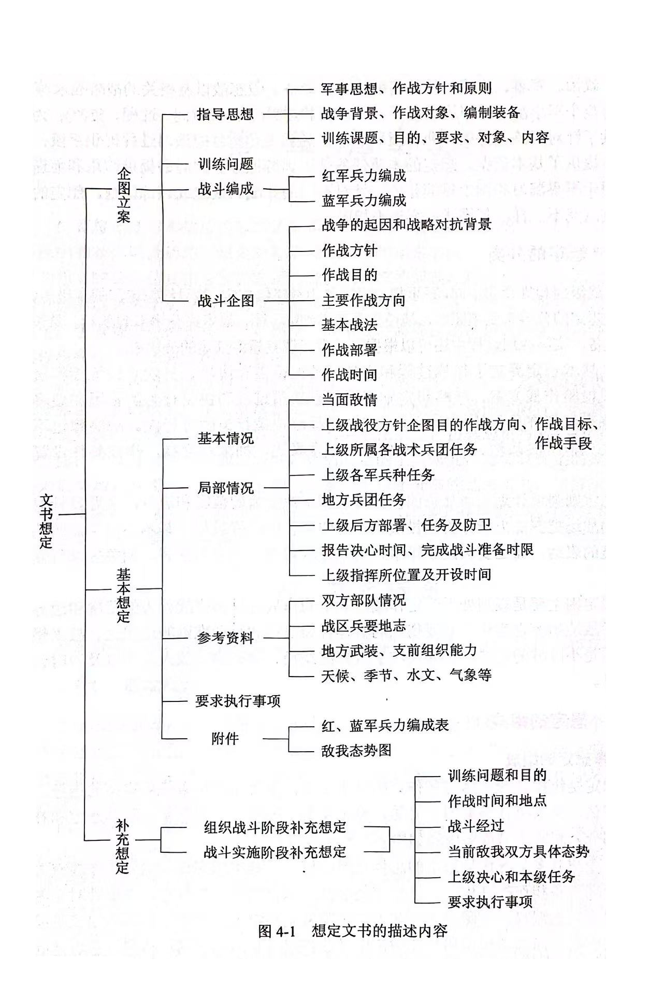
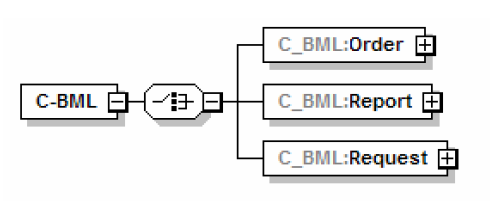
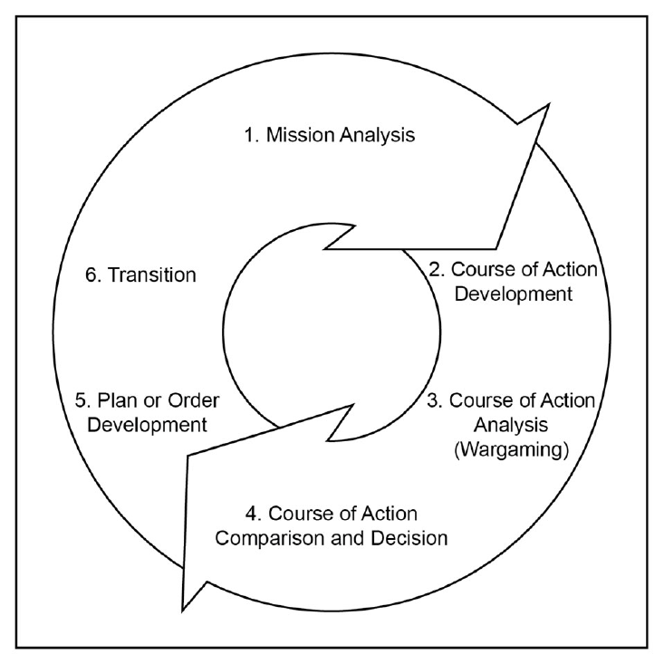
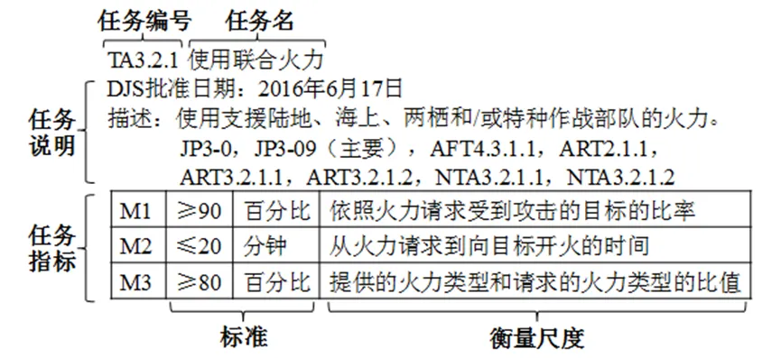
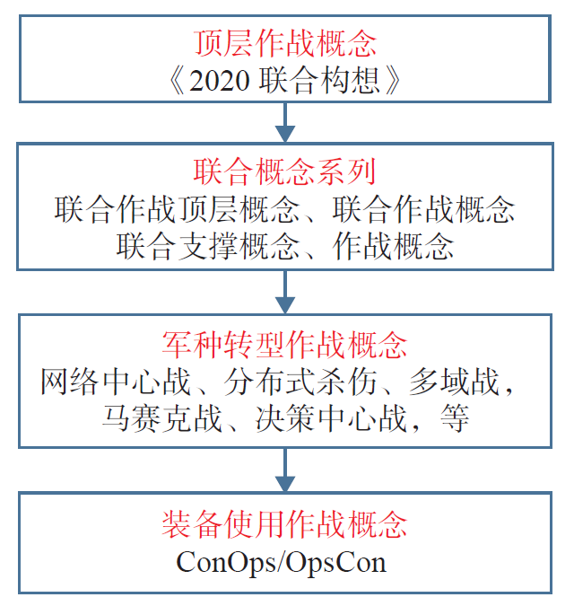
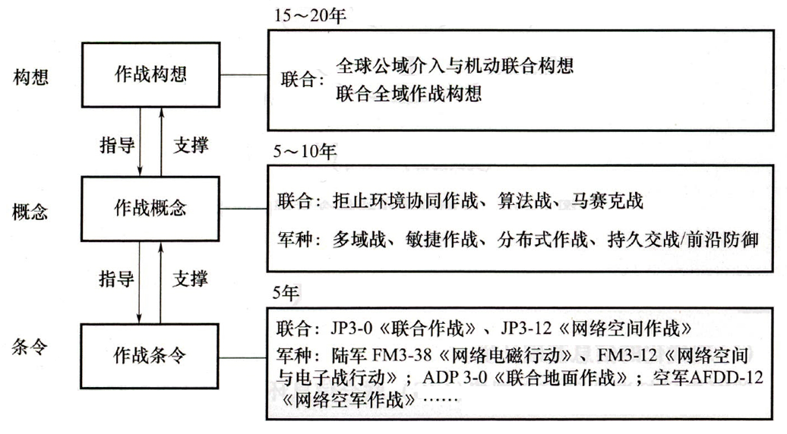
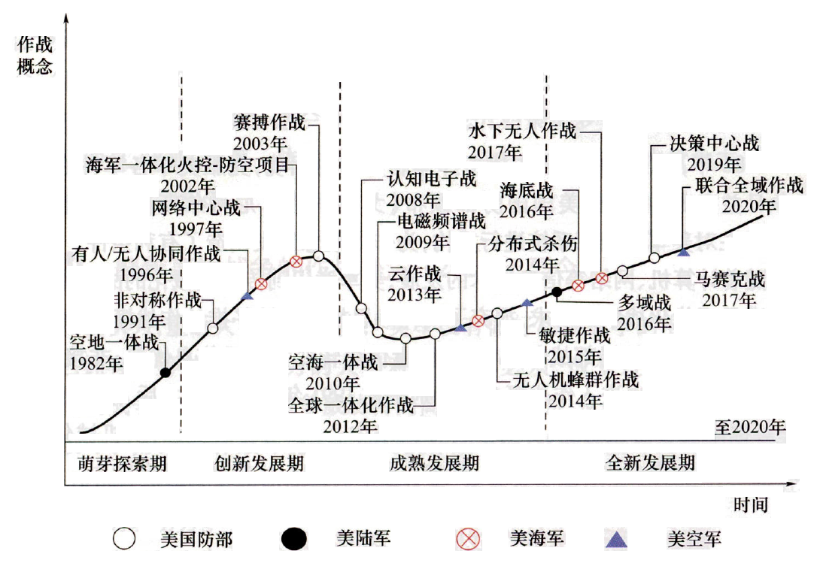
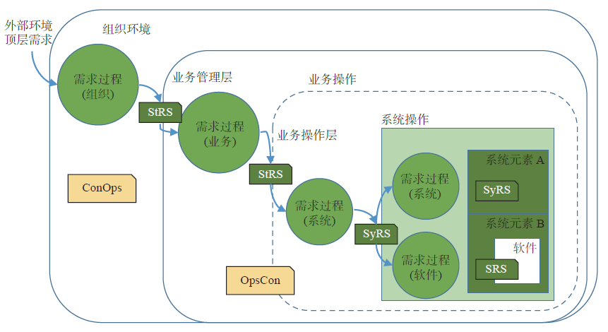
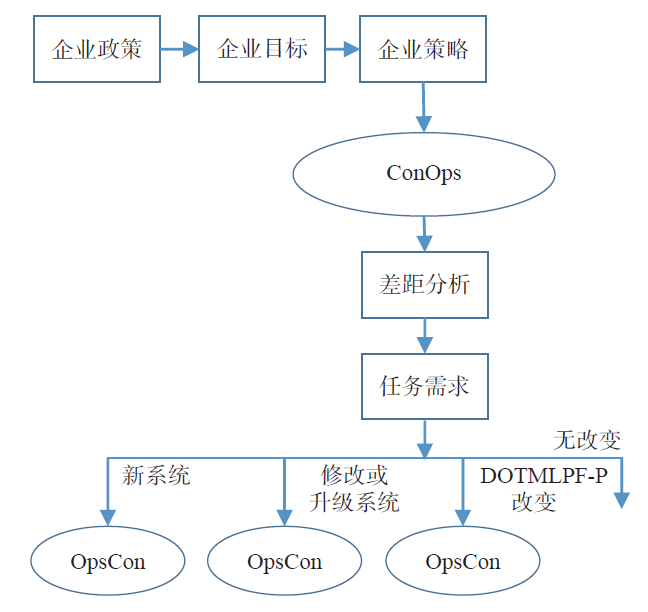
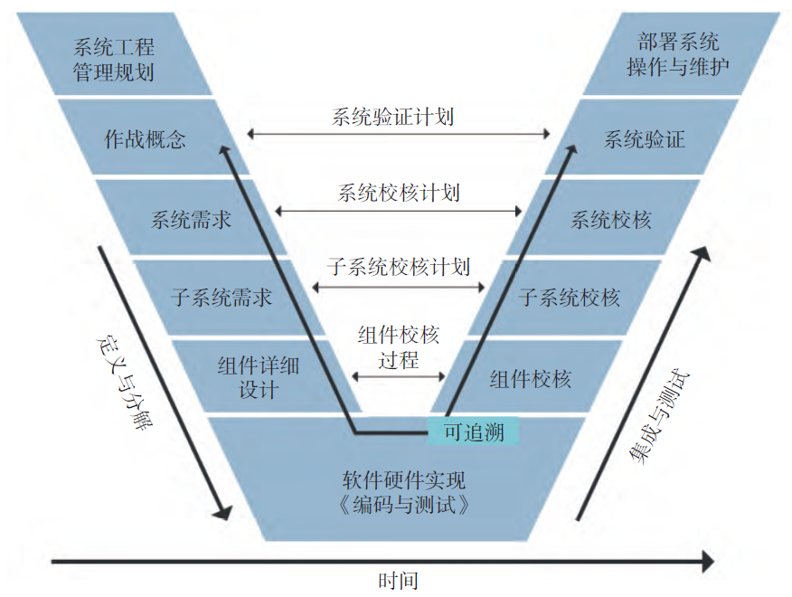

# 作战想定与作战概念设计

【摘要】"想定"是作战仿真的基本依据和数据基础，包含仿真系统运行的初始条件和仿真过程中的活动（作战任务）。介绍军事想定、仿真想定及其内容和结构。军事想定定义语言是对想定的形式化描述。作战概念是对武器装备"打什么仗"以及"如何作战"的抽象描述，理解作战概念的内涵，学习作战概念文档的设计规范。典型作战想定是设计装备使用作战概念的一部分。

【关键词】 作战想定，MSDL标准，C-BML标准，作战概念，OCD文档

【参考书目】

▲\[美\]Andreas
Tolk主编，郭齐胜，徐享忠等译，作战建模与分布式仿真的工程原理，国防工业出版社，2016.1

彭鹏菲，龚立，军事系统建模与仿真，国防工业出版社，2016.1

▲车嵘，王因传等，美军作战概念设计、验证与运用模式，国防工业出版社，2025.1

杨继坤，齐嘉兴等，美军作战概念演进及其逻辑，电子工业出版社，2022.4

韩光松，美军作战概念与力量运用，兵器工业出版社，2023.3

------------------------------------------------------------------------

## 想定概述

### 基本概念

仿真想定是军事仿真的基本依据和数据基础，包含仿真系统运行的初始条件和仿真过程中的动作以及活动。想定对军事问题的描述是否客观、可信和全面，将直接影响最终的仿真结果。仿真想定是针对研究分析或训练的问题，对仿真的战争系统的空间、时间、过程以及为了实现这一仿真过程所需要的背景、条件、约束、规则以及仿真资源的设定，仿真资源包括仿真系统、模型、数据等。需要注意，仿真想定的具体内容同想定的规模和仿真系统的工作方式紧密相关。

目前，国内外对仿真想定的研究工作主要包括三个方面：一是对仿真想定所包含的军事概念知识的研究，主要解决想定所包含的军事信息的权威性、完整性；二是仿真想定内容和形式的标准化描达、仿真想定与仿真模型的关联关系等方面；三是开发用于生成、编辑、评估想定的工具研究，为仿真想定的建立提供一套技术框架和开发，主要用于解决想定与仿真分离的处理机制，保持想定数据的独立性，允许基于典型想定进行想定裁减与重构，促进想定、仿真模型与仿真成员的重用。

在军事领域中，想定就是指挥员将作战意图转化为具体的实施计划和方案。

想定（Scenario），也称为脚本或者剧情，它是来自戏剧电影的一个术语，主要用于描述场景、角色及事件的发生过程。在军事领域中引入"想定"概念的目的就是利用其提供的假设剧情的功能，为参战、参训对象设置战场情况、提供作业环境和条件，进行战例、战法等军事问题的研究。

1965年，"想定"被收入到美国参谋长联席会议的军事术语词典，成为军方描述军事活动的一个标准术语。美军军语中想定的定义为："想定是对一个或数个实际的或假想的事件进行的一种描述。这种描述往往是对该事件及其相关问题进行分析的组成部分，而这种分析又是建立在作战模型的基础之上。"美军训练与条令司令部对想定的定义为："对未来时间框架下假设的冲突地区、环境、手段（政治、经济、社会、军事）以及事件的图形和文字描述。"我军军语对想定的描述是："按照训练课题对作战双方的企图、态势以及作战发展情况的设想和假定。"

概括而言，军事想定是对战争双方的局势，冲突发生的时间、地点、原因和背景，可能投入的军事力量和后勤保障、初始战斗水平、局势发展的时间序列等给出的详细说明。通过对作战部队的训练、演习设置一些必要的初始背景和演练条件（这些条件包括地形、气象、政治、军事、经济、部队编配结构、装备、假想敌以及相关的战略战术等），作战想定为整个军事演习和训练设想了一个范围和边界（空间、时间、过程、资源）：为参训人员提供了针对训练任务的作业环境和条件；为演习导演监控演习过程提供手段；为演习的总结提供了基本依据。想定的本质任务是为训练或分析的问题提供约束和前提条件，主要用于军事演习和图上推演作业。针对不同的作战、演习或训练课题，想定的出发点和着重点就不一样，其描述内容也不相同。

### 军事想定的组成

军事想定是组织、诱导演习和作业的基本文书，主要用于军事任务实施的指导，军事方案的评估，突发事件预案的建立等。想定文书一般包括企图立案、基本想定和补充寸，想定文书描述内容如图所示。

企图立案是对作战想定的总体轮廓的设计，基本想定详细描述了作战双方基本情况、作战准备和作战过程，补充想定是对基本想定的进一步补充，主要针对企图立案训练问题编写。企图立案为基本想定和补充想定提供依据，基本想定又是编写补充想定的依据，而基本想定和补充想定则是敌我双方企图的贯彻和体现，三者是既有区别又密不可分的整体。

<figure>
  
  <figcaption>图 7‑1 想定文书的描述内容</figcaption>
</figure>

### 仿真想定

仿真想定来源于军事想定，是在军事想定的基础上，经过二次开发，提供仿真执行所需要的相关初始数据和作战行动过程的脚本。仿真想定确定了仿真的基本条件和相应约束，包括仿真的基本实体和环境，每个实体的基本属性，并根据实体动态属性确定系统状态，以及利用计划、规则、约定对仿真过程进行限定和约束。

美军建模仿真办公室做了如下定义："仿真想定"是对演习和仿真的描述，它是描述作战单元和作战平台及其相应的位置、活动区域以及要完成的使命（任务）等信息的数据库的基本组成部分，还包括为实现仿真目标而设置的一组约束条件和重要事件发生的时国序列。

在《概念建模》一书中，认为仿真想定是在军事想定的基础上，经过二次开发，提供仿真系统执行所需要的相关初始数据和作战行动过程的脚本。仿真想定是对军事应用系统、指挥关系、作战实体、作战过程的一种抽象和描述。

由此可见，仿真想定是建立在军事想定的基础上，是对军事想定的第二次描述，并且对传统军事演习想定的概念进行了扩展，其内容不仅包括传统军事想定中敌我双方作战企图、战场态势以及可能的作战发展情况等，还包括对作战行动过程和军事规则的描述。概括地说，仿真想定主要应用于仿真系统，是对需要仿真的军事系统所进行的设定，主要包括时间、空间、作战行动过程以及实现这一仿真过程所需要的背景、条件、规则和实体等仿真资源（包括仿真系统、模型、数据）。

## 仿真想定的内容和结构

"仿真想定"的作用就是为仿真系统的运行，提供相关初始数据和作战行动脚本。仿真想定是按照仿真系统和模型的需求，梳理军事想定内容之间的内在联系，以结构化的形式实现军事想定内容的重组，并将其作为仿真系统运行的边界约束条件和仿真模型运行的初始参数集。其主要内容包括作战区域、作战环境、兵力编成与部署、作战任务计划和军事规则。

1）作战区域

作战区域从空间上确定了军事行动的范围，军事人员对想定中的区域描述比较简单。一般用军事地图的形式给出，并指定相关地名。军用地图上的各种地图标识符基本给出了想定的作战区域相关信息。

2）作战环境

作战环境是指影响作战发展的地理、天候、气象和复杂电磁环境等因素。一般主要考虑对作战装备和战斗人员有影响的因素。其中，地理环境既可以通过GIS
的矢量信息作用于仿真模型，也可以将事先确定的不同地理环境对作战行动的影响系数直接作用于仿真模型；天候、气象因素由于其本身的复杂性，一般可采用影响系数直接作用于仿真模型；复杂电磁环境是现代战场上影响武器装备通信、指挥控制、侦察、打击的重要因素，对于战争系统内部和上级的干扰信息，一般采用影响系数法确定；对于交战双方部队的干扰信息，一般采用模型计算得到。

3）兵力编成与部署

兵力编成和部署是参与作战单位之间的组织指挥关系以及它们的初始位置和状态。如按部队编成方式的军师团营连排形式，航母编队指挥舰和各种用途作战舰只之间的组织关系等。仿真中一般需给出参战双方的兵力编成、武器装备型号及配备数量、指挥体系及部署配置情况，它们是仿真系统初始化时生成各部队实体和武器装备实体的重要来源，也是反映战前交战双方初始态势的基本形式。

4）作战任务计划

作战任务计划主要是作战军事单位由上级布置的任务描述，如防御区域、攻击区域或敌方对象等。任务通常由上级下达，任务承担单位按照作战态势选择自己完成任务的方案，一般任务分解成子任务或更下一级子任务直至最小描述粒度。

5）军事规则

军事规则是对那些具有普遍指导意义的作战规则、战斗条令等特殊军事知识的一种结构化、形式化描述。军事规则所包含的内容主要来源于战斗条令条例、作战手册、专业教材以及领域专家的经验等，具有较强的权威性、指导性。军事规则作为战术仿真想定空间体系构成中的重要组成部分，它不仅对参战兵力的选择、兵力编组、兵力配置进行约束，还通过模型执行因果秩序、逻辑关系来决定、控制所有作战行动过程。

6）仿真资源信息

仿真想定作为仿真运行条件的主要内容，依据军事想定中描述的作战环境、参战兵为和行动设想，按照仿真模型的运行需要，对参战部队、指挥关系、作战行动进行重新抽象和组织，进而作为仿真系统的边界条件和仿真模型的初始条件。此外，还包括为实现仿真系统目标而设置的一组约束条件和重要事件发生的时间序列。

## 基于MSDL的作战仿真初始化

### MSDL语言

【标准】Simulation Interoperability Standards Organization. Standard for
Military Scenario Definition Language (MSDL), SISO-STD-007-2008, 14
October 2008.

1997年至2001年间，随着美国陆军下一代实体层次仿真OneSAF的提出与逐渐成熟，在仿真内部和仿真之间重复使用想定的需求越来越突出。最后，在OneSAF项目中诞生了MSDL概念，并发展为国际标准。

在设计过程中，有四个设计特点在MSDL成为国际标准过程中起到基本作用：应用独立性，数据与代码分离，关注点分离，利用商业与军用标准。

（1）应用独立性。即允许不同厂商提供的应用以合理的低引入成本来使用接口和数据规范。现有的商业软件或者有待开发的新系统，只要经过相对少量的修改，这些系统就应该能够使用接口规范，并按照规范要求导入/导出数据。

（2）数据与代码分离。直接支撑第一个概念的设计原则是将软件代码与数据分离。此外，数据必须规范成可独立使用的数据，即无需借助内嵌规则的代码库即可理解、或使用根据此规范而产生或消费的数据。辅助工具和库当然很有用，但是要遵守一条主要原则：生产或使用特定数据时不应用到它们。

（3）关注点分离。MSDL
只关注与军事想定相关的信息，不包括应用相关的、训练相关的、演习相关的，或者其他类型的仿真初始化类信息。例如仿真执行的速度，或者在使用想定驱动联邦时仿真实体由不同的仿真予以表示的具体规定。

（4）利用商业与军用标准。优先考虑从商业、M&S行业以及军事标准领域内寻找现成的模型算法、数据规范和软件开发标准并予以重用。对
MSDL
具有特别重要意义的三个标准是：可扩展标记语言（XML）、美国国防部接口标准通用战术符号（ISCWS）---2525B，以及联合协调、指挥与控制信息交换数据模型（JC3IEDM）。

### 基本的 MSDL 元素

本节阐述 MSDL 标准模型中的9个基本数据元素。这些元素按照MSDL
产品研发组给出的军事想定定义来描述军事想定："对想定中每个要素在某个时刻的情景和行动过程做出的具体描述。"想定描述传递的是现实（即真实的态势，如参与行动的部队）和被感知的现实（根据情报信息认为是真实的态势）。

1\. ScenarioID元素

MSDL
规范中的第一个元素提供格式化字段,以保存关于MSDL实例文档的信息或元数据。其数据模型及其生成的模式来自"基本对象模型"SISO
modelID规范中的重用。它包含四个普遍类型的概要信息：①基本名称和类型数据；②密级和限制信息；③用途和域使用信息；④基本参考信息。

2\. Options元素

Options（选项）元素用于构建军事想定中使用的全局参数。全局选项包括：①
MSDL
版本描述；②想定包含的组织信息；③贯穿整个想定的坐标表示和想定命名惯例/标准。应使用Schema或XML相关的验证技术来创建用户定制的数据检验脚本对数据进行验证。

3．Environment元素

Environment（环境）元素描述想定时间、军事想定中重要地理区域的范围、地理区域内的气候状况、整个环境内的气象与海洋条件。

4．ForceSides元素

交战方（ForceSides）元素用于识别想定内各方的关系。交战方是兵力与敌我层级结构中的最高层次。兵力从属于交战方，且在输入的仿真中继承双方的关系。各方之间的关系有可能不对称，例如A方与B方被定义为友军关系，而B方在想定初始阶段却可以被赋予与A方的敌对关系。由仿真根据它们对各单元之间的不对称关系的支持能力来决定如何对这一信息进行初始化和处理。显然，如果A方被B方攻击或射击，则A方应当对该实体或聚合体做出正确的反应。

一旦定义了单元及其装备，该单元与装备就将与上级单元直至最高级单元保持一种关系，即同属于一个交战方或军事力量。所有的兵力都应该从属于某个交战方。这个交战方可以包含美国、英国、法国和德国的兵力。至于各国的其他军兵种兵力，则可以用隶属于代表每个国家的某种兵力的名义创建。

5．Organizations元素

组织（Organizations）元素中包含军事想定中各交战方及兵力的单元集合（Units）和装备信息，通常指想定中的任务编组或作战序列。在MSDL中，这两个下层结构均来源于2525B标准，并且都以标识符为识别单元和实体类型的关键元素。在MSDL文件中，所有单元和实体都必须通过一个适当的指挥系统编组结构，按照层级结构关系与ForceSides结构连接起来。

单元（Unit）被封装成组织和单元集合的子结构，可用于定义想定内具有层级结构关系的军事和非军事组织。如果需要，独立的装备、士兵和其他生命体也可以在MSDL装备结构的框架内表示，装备在平台层次描述该组织的特有资源。

装备字段可用于识别军事想定中的军用和非军用装备、人员和其他盛明形式。这些装备与生命形式选项是资源的体现，用一个指向上级单元的参照符，即可连接到组织结构中。目前，装备项只能隶属于一个组织。

其中，单元标识符、装备标识符（以及Overlays元素中的设施）是一个用于显示和识别的命名，标识符中包含的类型信息符合2525B标准附录A"C2战术符号：单元、装备和设施"的规定。

6．Overlays元素

图层（Overlays）元素用于把情报元素或军事想定中的战术图形聚集起来。图层元素提供图层名称字段和专有参照符字段。图层的类型也可以识别，其类型有"作战""火力支援""情报""侦察监视""障碍""防空""后勤""A2C2"和"用户自定义"。

7\. Installations元素

明确军用设施情况，包括各实例的标识、名称、归属、定位、相关透明图等方面信息。

8\. TacticalGraphics元素

战术图形（TacticalGraphics）元素描述战术行动相关信息，包括兵力、交战方或单元的战术行动信息。

9\. MOOTWGraphics元素

MOOTWGraphics元素描述由兵力、交战方或单元在情报收集过程中已探测到的MOOTW概念。

2008 年10 月SISO 推出了MSDL V1.0
版本，给出了想定内容模式的初始版本以及实现标准和指导原则。

MSDL 模式的体系结构主要包括18
个模式定义文件（XSD），其中MilitaryScenario.xsd
为顶层模式文档。它定义了整个想定的根元素MilitaryScenario
以及对其它子文档的引用。

可见MSDL通过这种模式可将几乎所有与军事想定相关的要素都被纳入了其定义范围，加上XML
的通用性和可扩展性，解除了想定编制与执行系统间的紧耦合，提高了想定的重用性和作战仿真系统的互操作性。

### 发展方向

对于MSDL未来发展、研究，有多种途径解决。在SISO
MSDL产品研发组的管理下，目前正研制MSDL V2.0 版本。

创建一个通用的标准仿真语言框架，以使C-BML和MSDL能够协调和同步。目前，北约MSG-085部门正在进行一项基础性工作，那就是试图在MSDL想定文件中引用C-BML实例文档。C-BML文档利用MSDL文档为任务编组提供计划中的程序执行作业。C-BML指令集中的文档将调用对应的MSDL单元和装备数据项以及战术图形，构成综合初始化文件包的一部分。

设计通用单元和装备的枚举类型，使之具有更好的互操作性；与基于简单文本的单元和装备的名称比起来，其语义更易于理解。DIS标准和2525B
标准都在考虑如何提供一种通用的方式来唯一地识别单元和实体类型。

## 作战任务

### 基于C-BML描述作战任务

【标准】Simulation Interoperability Standards Organization. Coalition
Battle Management Language (C-BML) Study Group Final Report,
SISO-REF-016-2006.

美军在进行有仿真系统和真实的C2系统并存的军事训练时发现，存在大量非标准的、有歧义的书面语言和缺乏精确性的口语，使得指挥员的指挥效能和简单性大打折扣，导致了C2系统和仿真系统之间的互操作性很差。为了解决此问题，美军开始了对战场管理语言（Battle
Management
Language，BML）的研究。通过使用BML，美军希望能根据军事条令在真实C2系统、军用仿真系统中建立一套语言规范，通过这种语言指挥人员能够指挥真实的部队、装备或虚拟的兵力。

SISO 对BML 的定义：BML
是一种能够无歧义指挥命令部队和装备进行军事行动和提供态势感知、共享作战行动的语言。BML
必须满足以下四个原则：

- BML 必须是无歧义的。

- BML 必须能够充分表达指挥员的意图。

- BML 必须尽可能的使用已有的C4I 数据作为表达方式。

- BML
  必须允许所有的元素传递它们固有的信息、任务和环境数据，以达到态势感知、共享作战行动信息的目的。

目前，公认的BML 标准至少要包含三个方面，也就是BML
的三个视图：条令视图（Doctrine View）、表现视图（Representation
View）和协议视图（Protocol
View）。这三个视图通过BML本体（Ontology）和BML语法（Grammar）联系起来。

1\. 条令视图

BML 条令是作战管理领域各种术语的文档形式的严格定义。BML
的所有术语都用军事条令、作战手册的内容来定义。BML
条令希望建立一个公共的格式来描述BML
的术语，语言中的每一条术语都必须唯一的定义，不应该存在歧义。术语表要尽可能的和一些标准一致，比如说参考FOM、指挥控制信息交换数据模型（C2IEDM）等，以便达到更好的互操作。此外，术语还要和军事人员的各种描述条令的手册相一致，以便于军事人员掌握。

2\. 表现视图

BML
表现是一个数据模型，该数据模型描述实体之间的关系、实体的属性以及属性的可能取值。比如，BML
条令定义了一个装甲旅和攻击这个作战行动、但是没有描述装甲旅和攻击这个作战行动的关系。BML
条令的这两个术语之间的关系就是通过BML 表现的数据模型来描述的。BML
表现的数据模型要通过某种方式来组织条令中的术语，使之能够描述可执行的任务。BML
表现不仅要能够描述各种不同的任务，还要能够将这些任务进行组合排列以形成作战意图。此外，表现还要能够处理术语之间的因果关系和临时关系，能够和BML
的条令联系起来。

美军的BML 原型系统采用C2IEDM作为BML表现的数据模型。C2IEDM
是MIP的一个标准，目的是为成员之间的指挥控制系统提供一个信息交换的标准。
C2IEDM模型由176个类别的信息组成，它包括1500多个元素以及它们之间的关系，这样元素涉及军事行动的所有领域：机动、火力支援、防空、工程以及反恐等。C2IEDM是一个高度规范化的模型，它采用对象类、子类的层次结构来组织数据元素以降低模型的复杂度，而且C2IEDM的可扩展性很强。

3\. 协议视图

BML 协议是BML 支持的接口以及访问这些接口的规范。为了将数据传输到BML
和将可执行的任务从BML 传输到执行系统，BML 必须有通信协议。BML
协议规范了它的输出信息的描述方式和从BML
传递军事行动到目标系统（C2系统、仿真系统）的方式。在以网络中心的环境中，基于Web的标准和网格标准都是BML
可以采用的协议。目前采用XML来描述信息交换需求是公认的协议基础。所以，目前几乎所有的专家都同意BML
采用基于XML 的Web services协议。

### C-BML的结构

C-BML是一种描述和交换作战计划、命令的通用语言。通过C-BML
技术可以在作战仿真系统、指挥控制系统（C2）、LVC
仿真系统及机器人系统之间实现作战计划、命令、请求及报告等信息的描述和交换。

联合战斗管理语言C-BML
是一种能够无歧义指挥、控制部队和装备进行军事行动并提供战场态势感知和共享的语言，其规范主要包括：（1）数据模型，主要以JC3IEDM为标准；（2）对所交换信息的内容、结构的定义；（3）信息交换机制的定义，提供对C-BML
信息处理的通用方法。（4）C-BML 标准释义、应用指南及实例。

在 C-BML 中，对作战计划的描述基于5W 原则：

Who：描述在作战行动中发出或执行作战计划、命令、请求、报告的对象；

When：描述作战计划、命令、请求的时间序列，或报告发生的时间；

Where：描述执行作战计划、命令、请求或报告对象的位置信息，可以是单个位置，也可以是一个区域或一个连续位置点集。

What：描述需要执行的作战计划、命令、请求或报告具体内容。

Why：描述执行作战计划、命令、请求、报告的原因、目的或预期达到的状态。

上述 5W 构成了C-BML 的基本结构。与MSDL一样，C-BML 也使用XML
模式语言来描述其内容及结构，分别在Expressions.xsd、Composites.xsd
和Codes.xsd 中给出了定义。如图所示为C-BML顶层结构。

<figure>
  
  <figcaption>图 7‑2 C-BML顶层结构</figcaption>
</figure>

结构图中包括命令（Order）、报告（Report）和请求（Request）三个子元素，每一个子元素都依据5W原则进行进一步的详细描述。

### 作战方案计划

作战方案计划的格式和内容通常遵循一定的军事技术规范，以确保清晰性、可执行性和标准化。不同国家、军种（如陆军、海军、空军）或作战层级（战略、战役、战术）可能存在差异，但核心框架基本一致。以下是通用技术规范的关键要素，正文核心章节（以美军OPORD
五段式格式为例）：

+------+-----------------------+---------------------------------------------+
|      | 段落                  | 核心内容                                    |
+:====:+=======================+=============================================+
| 1    | 态势分析（Situation） | \- 敌情（兵力、部署、意图）                 |
|      |                       |                                             |
|      |                       | \- 我情（可用部队、支援单位）               |
|      |                       |                                             |
|      |                       | \- 环境（地形、天气、电磁环境）             |
+------+-----------------------+---------------------------------------------+
| 2    | 任务（Mission）       | 用5W明确核心任务（Who/What/When/Where/Why） |
+------+-----------------------+---------------------------------------------+
| 3    | 执行（Execution）     | \- 作战构想（CONOP）                        |
|      |                       |                                             |
|      |                       | \- 阶段划分（Phase Line）                   |
|      |                       |                                             |
|      |                       | \- 各单元任务分工                           |
+------+-----------------------+---------------------------------------------+
| 4    | 后勤与保障（Service & | \- 弹药补给点（CLASS V）                    |
|      | Support）             |                                             |
|      |                       | \- 医疗后送路线（MEDEVAC）                  |
|      |                       |                                             |
|      |                       | \- 通信频段分配                             |
+------+-----------------------+---------------------------------------------+
| 5    | 指挥与信号（Command & | \- 指挥链（Chain of Command）               |
|      | Signal）              |                                             |
|      |                       | \- 应急联络方式（如COMSEC加密规则）         |
+------+-----------------------+---------------------------------------------+

: 表 7--1 作战计划核心内容

作战决策是指挥员对作战问题做出的各种决定，是作战指挥的核心，是指挥员的中心任务和基本职责。作战决策的正确与否，对战争胜负有决定性的作用。

作战决策是一个贯穿在指挥各个环节之中的过程，内容一般包括作战目标（企图）、主要作战方向、战役布势、作战任务区分、协同方法、战役保障等。这些内容是在决策的各个阶段中，由指挥员反复研究逐步形成的。从决策活动的层次与分工看，作战决策过程可以分为筹划、计划两个阶段。筹划侧重酝酿、策划，生成决策的总体构想；计划侧重决策的具体化、是决策到行动的重要桥梁。从筹划到计划体现了自上而下的过程，从构想到行动，自上而下、逐层分解。例如，美军在《联合作战计划制定流程（JOPP）》中认为：一项战争计划的制定通常包括两个相对独立而又紧密联系的过程，一个是作战概念化过程，是在认知、理解作战任务和战场环境的基础上筹划作战构想的过程；另一个是行动细节化过程，是将作战筹划形成的概念化成果，通过作战计划制定流程和工具转化为可实施的作战方案和行动计划过程。

筹划是从战争全局上进行的运筹谋划。"运筹于握之中，决胜于千里之外"，说的就是对军事谋略进行通盘考虑和全面策划，可以决定千里之外的胜负。作战筹划是一种创造性思维活动的过程，主要运用批判性、创新性思维，对战略意图和敌我情况及战场环境加以深刻理解，对战役和战术行动做出总体构想，进而制定符合实际的行动策略和方法以破解作战问题。筹划通常由指挥员通过对话和与参谋团队协作，以及上下级之间的交互沟通，形成对战场情况的判断和对作战的总体构想，包括打不打、打谁、在哪里打、什么时间打、怎样打等，从而明确行动的意图（目的）、资源投入、约束、底线等要素。

计划是实现决策的桥梁，是将作战决策进一步具体化，通盘考虑各参战力量的活动做出的具体安排，是对系统各部分之间关系的组织与协调。计划是指挥机构在战役准备中最重要的工作，也是其遂行指挥的一种重要手段。计划通常由参谋人员和专业技术人员合作，按照联合作战计划制定流程，完成方案计划的制定和行动指令的生成。根据战略层所确定的意图、资源、约束等条件，明确具体目标、阶段划分、力量编成，生成、分析、优选行动序列，并细化生成可实施的行动计划，包括行动路线、任务时序、协同方式等。

为确保决策质量和效率，作战决策通常还有规范的流程作为依据。例如，美军联合出版物JP5-0《联合任务规划》（Joint
Planning）将联合作战计划生成的流程分为：任务分析、行动序列（COA）生成、COA分析推演、COA比较、COA批准、计划与指令生成等阶段，如图所示。任务规划过程的结果将生成作战计划（OPLAN）或作战命令（OPORD）。

<figure>
  
  <figcaption>图 7‑3 美军作战计划生成流程</figcaption>
</figure>

### 美军通用联合任务清单

联合通用任务清单（Joint Universal Task List,
JUTL）是美国政府和军事机构使用的一种标准化任务框架，旨在为跨部门、跨层级的联合行动提供统一的规划和执行参考。通用联合任务清单是美军作战任务规划体系的组成部分之一，包括任务的定义、任务完成的条件及其评估指标。介绍通用联合任务清单的用途和重要概念，说明了其对于任务分类、定义、描述和关联的方法。

在《通用联合任务清单》牵引下，各军种也陆续开发各自的任务清单，用于与联合任务清单衔接，从而形成联合和军兵种配套的通用任务清单体系，具体包括《通用海军任务清单》（UNTL）、《空军任务清单》（AFTL）、《陆军通用任务清单》（AUTL）。

通用联合任务清单可视为由各类作战任务（Task）组成的一个数据集，其组织编排的主线就是各种作战任务。对于每一项具体任务，要求规定执行的条件（Condition）、衡量尺度（Measure）与标准（Criterion），用以明确在特定条件下执行特定任务时，应达到什么样的执行水准，才能确保作战使命顺利达成。

1\. 使命、行动和任务（Mission, Operation, Task）

这三个概念中的Mission和Task中文都译为任务，但三者的含义在层级和内容上区别很大。在通用联合任务清单中对其定义如下：

使命是带有某种目的的分配指派行为，该行为明确指示了应采取的作战行动及其原因，它包含了作战行动。

作战行动是一种支持战略、战术、训练或行政军事使命达成的军事行动，同时也是为了达成战斗或者战役目的，执行作战行动的过程，包括行军、后勤、攻击、防御和机动等各种任务。

任务是一系列基于条令、战术、技术以及标准执行过程的离散事件或行为，用于达成使命或作战行动。任务是经使命分析后进而分解产生的，其定义必须是明确的，不同任务之间不应该存在交集。

2．条件（Condition）

条件指影响任务执行的各种环境因素，有些用于描述作战地域的人文环境（如敌对国宗教文化情况），有些描述了作战区域的战场态势（如制海权），还有一些描述了战场的地形地貌和气象水文（如濒海地貌）。因此，条件可概括分为物理环境、军事环境和民事环境3类。

3．指标（Standard）

一系列衡量尺度及其对应标准构成了任务执行的指标，用于描述联合作战部队在特定条件下，执行任务时应当达到的水准。这些衡量尺度与标准可作为联合部队司令、作战参谋和军事训练教员的通用语言参考系统。它们也有助于军事分析人员和规划人员理解、整合联合作战行动。

为了描述任务执行达到的不同效果，衡量尺度可作为一种度量基准，而标准指度量任务执行效果时，最低可接受的水准或程度。以任务"TA2.3提供目标影像"为例，该任务指标由5项衡量尺度构成，其中第5项（M5）是"分析生成时敏目标图像"，其度量标准是"小时"，表明在发布任务时需明确声明：为确保该任务成功执行，必须在X小时内完成时敏目标图像的分析和生成。

4．任务的层级

通用联合任务清单按执行任务具体内容和人员的不同，将战争分为国家战略（SN）、战区战略（ST）、战役（OP）和战术（TA）4个层级。在每一层级，又按照该战争层级的行动特点，分解为不同功能性任务，以及对其进行支撑的各项子任务。

5．任务的描述

结合上述概念，使用通用联合任务清单对任务进行描述的方式示例如图所示，主要包括任务编号、任务名、任命说明和任务指标4项内容。任务编号用于标识该任务在通用联合任务清单中的位置；任务名一般使用"动词+名词"的形式描述，如"使用联合火力"；任务说明描述了任务的内容，同时给出了执行该任务可以参考的作战条令或法规文件；任务指标列出了项目执行需考虑的重点因素及其应参照的对应执行标准。

<figure>
  
  <figcaption>图 7‑4 任务描述示例</figcaption>
</figure>

### 作战行动序列

作战行动序列（Course of
Action，COA）是作战计划的核心部分，用于系统化描述完成任务的多种可行方案，供指挥员评估和决策。其编制需符合军事标准化流程，如美军联合出版物JP
5-0《联合规划流程》或解放军《作战条令》。传统作战行动序列通常由参谋人员依据首长作战意图和作战决心进行拟制。随着信息技术的发展，现代战争转变为依靠网络和科技的信息战，能否正确、高效地生成作战计划成为了战争胜负的关键。

COA的建模方法包括本体建模、行为树建模、知识库和知识图谱构建等。在表达作战知识方面，本体因具有可维护、可扩展、可重用等优点，成为了研究者们的关注热点。

当前COA生成方法大致可分为模型分析法、知识推理法、博弈论和强化学习等。其中，知识推理法的研究最为广泛。

## 作战概念设计

所谓作战概念（CONOPS），是对武器装备"打什么仗"以及"如何作战"的抽象描述，从总体层面刻画了装备作战使用及其需求。作为系统工程过程V
模型的起点，作战概念至关重要，它是系统需求分析和设计阶段的一个关键输入，也是验证最终装备解决方案的依据。

在作战概念的标准制定和工程应用方面，目前美国处于世界领先地位，新颖的作战概念层出不穷。近年来，国内在装备论证领域也逐渐开始关注作战概念的开发，但尚未形成统一认识和规范表述，故其效果有待充分发挥，因此，有必要开展"作战概念"的概念辨析，并提出规范合理的作战概念文档设计要求。[^6]

### 作战概念的内涵与层次

"作战概念"（Concept of Operations,
ConOps）是一个舶来词，目前尚无统一定义。美军在作战概念上拥有大量的实践，已形成了相对系统、科学、规范的作战概念研发方法。然而，对于我国而言，目前对"作战概念"仍存在不同的理解，故有必要进行本土化研发。

在系统工程领域也有concept of operations，一般称为"运行概念"。

美军认为，"概念是思想的表达，作战概念是未来作战的可视化表达。""通过开发作战概念，一体化作战思想即可得到详细说明，然后再通过演习和其他评估手段对作战概念作进一步探索，作战概念是用来探索组织和使用联合部队的新方式。"
作战概念是对尚不存在但有可能解决军事问题的能力的描述。

<figure>
  
  <figcaption>图 7‑5 美军作战概念的4个层次</figcaption>
</figure>

根据近年来美军正式颁布的文件及相关资料，美军针对联合作战需求，依据联合作战的不同层次和领域，对作战概念进行了系列化描述，主要分为4个层次：顶层作战概念是《2020联合构想》（joint
vision 2020），第2 层是联合作战概念系列（family of joint concepts,
FOJC），第3
层是军兵种转型作战概念，最底层是装备使用作战概念。按照从上至下的顺序，渐进具体化指导，从而形成了较完善的作战概念体系。

**1. 2020 联合构想**

第1 层是《2020 联合构想》，这是美军参谋长联席会议于2000 年5 月30
日公布的指导美军21
世纪联合作战的纲领性文件。该文件强调了未来"不确定之敌"的威胁，明确了"全面优势"的具体指标，进一步拓展了"联合作战"的基本内涵和作战原则，提出了新世纪美军的发展方向及改进措施。

**2．联合作战概念体系**

第2 层是联合概念系列，其以国家军事战略（national military
strategy，NMS）为基础，可为未来基于对手的挑战或机遇提供作战和联合功能方法。这些概念优先于同类竞争对手和威胁，近20
年来已相继发布了联合概念研发的指导性文件规范，而联合概念体系架构也随之发生了较大变化。

2016 年8 月，美军颁布参联会主席指令CJCSI
3010.02E《联合概念开发与实施指南》，提供了联合概念研发的指导，并将批准的联合概念转换为适用的联合能力开发过程。2021
年，美军联合概念体系再次做出调整，形成4
层架构，包括：联合作战顶层概念（capstone concept for joint
operations，CCJO）、联合作战概念（joint warfighting
concept，JWC）、联合支撑概念（joint support
concept，JSC）、作战概念（CONOPS）。

在2019
年版联合作战顶层概念《联合部队2030：全球一体化作战》中，美军将建设"全域机动作战"能力作为实现全球一体化作战的途径，并将其作为2030
年之前美军联合作战的核心概念。

**3．军种转型作战概念**

第3
层是军种转型作战概念。军种作战概念丰富了联合作战概念的内涵，同时受到联合作战概念的指导与制约。军种作战概念经论证、演示、试验和联合训练或实战检验，可以写入军种作战条令，指导部队作战和训练。

例如，下列网络中心战、空海一体战、分布式杀伤、马赛克战等10种典型的作战概念，都属于军种作战概念层次。

- 网络中心战（海军，1997）

- 空海一体战（空军/海军，2010）

- 作战云（空军，2013）

- 分布式杀伤（海军，2014）

- 分布式海上作战（海军，2016）

- 多域战（陆军，2016）

- 远征前进基地作战（海军陆战队，2016）

- 马赛克战（DARPA，2017）

- 决策中心战（DARPA，2019）

- 联合全域作战（参联会，2020）

**分布式杀伤（Distributed
Lethality）**：2014年，针对水面舰船反舰能力不足的问题，美海军战争学院在兵棋推演中创新运用濒海战斗舰，提出分布式杀伤作战概念。核心思想是通过开放式体系架构与网络化信息传输体系，将大中型水面舰艇的部分武器、传感器、电磁战等功能分解到中小型水面舰艇，以分散部署的形式独立作战，通过自主、协同等技术达到更强的作战能力，主要包括单平台进攻性杀伤能力、在广域地理范围内分散部署和灵活机动能力、多平台协同防御能力等，增加对手需要应对的目标数量，加大目标定位和决策难度。

**分布式海上作战（DMO）**：在继承与发展分布式杀伤作战概念的基础上，美海军于2016年发布《保持海上优势的战略设计》，提出分布式海上作战概念。2018年的《维持海洋优势的设计2.0》，强调分布式海上作战是美海军针对作战对手开发的军种顶层作战概念。该战略文件将分布式海上作战定义为："在选择的时间和地点，充分利用分布式、一体化与机动性原则，取得大规模压倒性作战力量与作战效果。这种分布式平台、武器、系统与传感器的集成，不仅可以提高战场态势感知能力，还可使作战对手的侦察工作复杂化。在领域范围内机动运用作战力量，利用不确定性实现突袭。"

**联合全域作战**：美军持续寻求跨军种的敏捷协作能力，美国国防部提出了"联合全域指挥与控制"概念，推动美军指挥控制体系的发展。
JADC2旨在实现跨陆、海、空、天、网实现无缝协作，通过整合全域网络战、电子战、情报监视侦察等资源，助力决策人员提高收集信息、做出决策的速度，提升前沿力量的威慑性、部署的动态性和行动的突然性，做到即时发现、即时理解、即时决策、即时行动。JADC2致力于提供一个"云状"环境，供联合部队共享ISR数据，通过多个通信网络实现更优决策。

2021 年以来，美军一直在努力推进联合全域指挥控制（joint all-domain
command and
control，JADC2）作战概念的建设，旨在实现未来作战优势的最大化。按照美国防部的规划，JADC2
的战略目标是以安全的方式和极快的速度将网络和传感器与所有作战域（陆/海/空/天/网）的共享数据连接到作战人员，而DARPA
的马赛克战、空军的先进战斗管理系统（advanced battle management
system，ABMS）、陆军的融合项目（project
convergence）、海军的超越项目（project overmatch）均参与其中。

**4．装备使用作战概念**

最底层是装备作战概念，即ConOps
或OpsCon，通常是装备采办和需求工程的一部分。研究重点是如何开发装备使用作战概念，从而形成规范化的作战概念文档（operational
concept document, OCD）。

### 美军作战概念的发展演进

**1．美军作战理论体系的构成**

为了理解作战概念的定位和发展，有必要了解一下美军作战理论体系的构成和创新过程。

美军作战理论体系由联合和军种作战理论体系构成，层次覆盖了战略、战役和战术三个层级。作战理论体系的内容主要有作战构想体系（Vision）、作战概念体系（Concept）和作战条令体系（Doctrine）等三部分构成，也是美军创新作战理论的三个阶段，如图所示。

<figure>
  
  <figcaption>图 7‑6 美军作战理论体系的构成</figcaption>
</figure>

（1）作战构想是根据科学技术和武器装备的发展以及安全环境的变化，预测未来安全环境、作战环境、作战对象、作战样式，提出未来作战的总体能力需求及相关措施建议。一般比较宏观和概略，需要进一步细化才能落实到作战行动上。

（2）作战概念指的是特定框架内军事力量的具体应用，是根据作战构想的预测，对作战构想具体化，开发具体的作战方法、作战样式和能力需求。目的是预测战争、设计战争，并未准备战争提供建议和理论支撑。

（3）作战条令体系是整个作战理论体系的核心。联合作战条令是指导美军组织和实施联合作战与训练的权威文件。美军每个军种都有全面、系统、完整的作战条令，数量很多，并经常根据变化出台新的作战条令。

美军是以创新作战构想为起点，以创新作战概念为桥梁，以创新作战条令为终点，形成一个完整的作战理论创新过程。

**2．美军作战概念的演进**

美军作战概念体系经历了一个不断探索、逐步完善的过程，从"军种协作"向"联合部队协同"，从"个性化离散性"向"体系化综合性"，从"总结预测战争"向"设计赢得战争"的方向发展。每一个概念的提出和发展都具有明确的针对性，并在演习和战争中不断完善。

美军作战概念的发展大体上可以分为四个阶段：一是二战结束后、八十年代初的探索萌芽期；二是创新发展期，主要集中在1991
年海湾战争之后，"非对称作战""网络中心战"等；三是成熟发展期，包括"空海一体战""分布式杀伤"等；四是全新发展期（2016
年至今），"多域战"由于创新意义重大，获得了美国国防部和其他军兵种的支持，包括"马赛克战""联合全域作战"等。

<figure>
  
  <figcaption>图 7‑7 美军作战概念的发展演进</figcaption>
</figure>

**3．军事效益驱动作战概念研发**

为什么美军作战概念的推陈出新如此频繁？军事效益驱动作战概念研发。

首先，因为出现了新的军事问题。作战概念的产生源自作战威胁，包括作战对手和作战目标的改变。随着美国国家战略、国防战略的演变，出现了新的"假想敌"。近年来，美国在战略文件中日益渲染所谓的"反介入/区域拒止"威胁，认为美国的海上优势在冷战之后遭遇了严重威胁，故强调将重夺制海权。在这一背景下，2017
年确定了美国海军水面部队"重回制海"的战略方向，提出了"分布式杀伤""分布式海上作战"概念，即拟在全球更广阔的海域分散部署海上力量，并形成跨域协同的海上攻防能力。

除了应对威胁之外，美军还将作战概念开发作为牵引军队建设的重要手段。通过主动设计作战概念或"设计战争"，将作战概念创新作为军事斗争准备和力量建设的重要推动力，以始终保持一流的战斗力。对于美军而言，技术创新与作战概念创新是其争夺军事优势的"双引擎"。

美军新型作战概念层出不穷，有力牵引了作战能力的提升和武器装备的发展。也代表着作战概念的发展方向。实际上，美军的每场战争同时也是对作战概念的实战验证。军事效益是世界各国不遗余力地重视研发作战概念的内在驱动力，主要体现在几个方面：

一是创新作战样式。设计作战样式，就是设计一场战争。从过去传统的单一作战样式，发展形成全新的作战样式。二是牵引装备发展。作战概念提升战斗力在物质层面落地的一个重要表现，就是牵引新式武器装备的研发。一方面是挖掘现有武器装备的作战潜力，更多的是要求具备新作战能力，这往往通过研发新武器装备或构建新作战体系来实现。三是完善条令条例。作战概念通过进入条令得到固化，作战概念的指导作用在很大程度上通过条令体现。美国陆军2017
年版《野战手册3-0：作战》条令纳入多域作战概念。

美军作战概念是针对中长期安全挑战与威胁，围绕军事力量运用与建设而提出的系统性认识，目的是为准备与打赢战争提供咨询建议和理论支撑。长期以来，美军作战概念不断推陈出新，在促进军队建设以及指导打赢战争方面发挥了重要作用。

**4．美军新战争观**

从美军各军种作战概念的发展演进来看，美军新战争观逐渐成熟。

关于当前阶段的作战理论，美国防部似乎并没有给出统一界定，而是任由各军种"自由发展"。美军各军种提出的作战概念，实际上正是未来战争形态在本军种任务领域的理论映射。而由于各军种任务领域及所处环境的不同，便造成作战概念"百花齐放"的局面。

以美陆军"多域战"概念为例，其核心是追求各作战域深度融合制胜，它并不排斥而是高度认同美海军"分布式杀伤"概念。同时，多域战在重视先进信息技术方面又与美空军"作战云"概念同出一撤。反过来，当前美空军和国防部积极推动的"联合全域作战"，实际上就是对美陆军"多域战"概念的深化拓展。辩证地看，美军花样繁多的作战概念都是现代战争形态演变规律的客观反映，当代美国战争观具有分散部署、机动作战和智能赋能的特点。

### 作战概念文档规范

1．作战概念ConOps 与 OpsCon

ConOps 与OpsCon
在系统开发中经常互换使用，这两个容易混淆的术语有相似之处，但实际上存在着显著差异。一般来说，编制OCD
的初衷是为了支持系统生命周期的概念和开发阶段，而后在整个项目中维护OCD
的目的则是支持系统（或产品）生命周期的生产、使用、保障和退役阶段。

对于军事领域而言，"系统"经常指代武器装备，所以ConOps 或OpsCon
一般译为"作战概念"；而对于民用系统而言，则译为"运行概念"。为了避免混淆，本文暂不针对军用和民用作区分翻译，故直接使用ConOps
或OpsCon。

ConOps，也称为CONOPS，是一个组织或企业创建的抽象模型，用于描述其预计如何运行以实现其目标。ConOps
可能是独立于特定系统的较高层次，也可能是作为采购新品、升级或修改系统过程的一部分开发成果。下面给出几个定义。

（1）美国防部联合出版物JP 1-02《军语词典》定义：concept of operations
是一种文字或图形陈述，用于清晰、简洁地表达联合部队指挥官预计完成的任务，以及如何利用现有资源来完成任务，故其也被称为指挥官概念。

（2）美军标MIL-STD-498《软件开发和文档》中有一个名为"作战概念描述"的数据项描述（data
item description，DID），其中ConOps
定义为：拟议系统将满足的用户需求，它与现有系统的关系，以及系统的使用方式。ConOps
可以为许多目的而量身定制，并在利益相关者（也称为干系人）之间就拟议系统的作战概念达成共识。

（3）INCOSE 的《系统工程手册》定义：ConOps
是为组织领导层准备的文字或图形声明，描述了有关企业整体运行或一系列运行的假设或意图，包括任何新的能力。

（4）OpsCon
被视为特定系统运行的抽象模型，通常作为采办过程的一部分进行开发，并在整个系统生命周期中使用。在美国国家标准ANSI/AIAA
G-043B-2018《作战概念文档准备指南》中，OpsCon的定义如下：用户定义如何在组织内使用特定系统。它可能包括文字或图形陈述，用于表示针对使用特定系统执行ConOps
向下展开的活动，或者组织（企业）对特定系统或相关新系统、现有系统或修改系统的运行假设或意图。由此可见，OpsCon
从用户的角度，给出了特定系统运行的总体情况。

总体上，ConOps
是组织（企业）运行的高层模型，通过与差距分析结合使用，从而确定组织运行的不足和需求，其可导致条令、组织、训练、装备、领导力和教育、人员、设施、政策（DOTMLPF-P）等的变化，还可能导致一个或多个系统的修改或升级，或新系统的采购。而OpsCon
则服务于支持新系统或修改、升级系统的开发工作。在产品开发活动开始之后，即可编制OCD，并在整个产品生命周期内予以维护，一个ConOps
可以导致产生多个OpsCon。

无论是ConOps
还是OpsCon，它们的开发方法是相同的，区别在于"关注点"不同。OpsCon
是从利益相关者的角度来关注正在开发的系统，而ConOps
关注的是如何将该系统融入其所属的更大范围系统之中，并对其进行开发、测试和操作。ConOps
和OpsCon
均需利益相关者参与其中并与共同愿景保持一致，均涉及了讲述故事、场景或案例，均用于定义满足总体需求、目标和目的的可行方法，并用于进一步定义项目中涉及的各个部分。

### 相关标准

在作战概念研究过程中可重点参考以下4 个标准。

（1）IEEE Std 1362：1998。

标准IEEE Std 1362：1998《ConOps 文档指南》描述了ConOps
文件的格式和内容，根据该标准的定义，ConOps
是面向用户的文档，其从用户的角度描述了拟议系统的特征。ConOps
文件可用于向用户、买方、开发商和其他组织要素（例如培训、设施、人员配备和维护）传达总体定量和定性的系统特征，其从集成系统的角度描述了用户组织、任务和组织目标。

然而，从该标准的内容来看，其实际上是OpsCon
文档（OCD）。在使用过程中，该标准适用于软件密集型系统的软件部分开发和修改，目前已经被ISO/IEC/IEEE
29148 所替代。

（2）ISO/IEC/IEEE 29148：2018。

国际标准ISO/IEC/IEEE
29148：2018《系统和软件工程---生命周期过程---需求工程》适用于在系统或产品工程开发过程中采用ISO/IEC/IEEE
15288（系统）和ISO/IEC/IEEE
12207（软件）标准的过程，此处的系统和产品包括制造工程、软件密集型系统、软硬件综合产品和相关产品服务。该标准可在系统和软件的整个生命周期中统一处理工程需求中所涉及的过程和产品，在系统和软件工程的背景下，可以提供良构的文本需求细节，包括特征和属性。

在该标准中，ConOps 和OpsCon
都是需求工程过程的一部分，如图所示，其中：SRS 为软件需求规格，StRS
为利益相关者需求规格，SyRS为系统需求规格。ConOps 和OpsCon
有助于从组织中的各个利益相关者处获取需求，并作为沟通和分享组织意图的实用手段。ConOps
描述了组织在使用待开发系统、现有系统和未来系统时，对企业整体运行的假设或意图，其一般体现在长期战略计划和年度运营计划中，在该标准附录B
中给出了ConOps 应包括的信息项内容。由此可见，ConOps
是组织指导未来业务和系统总体特征的基础。

OpsCon 则从用户的角度解决了特定的感兴趣系统。OpsCon
文件描述了系统将做什么（而不是如何做）以及为什么做（基本原理）。OpsCon
是一种面向用户的文档，其从用户的角度描述了待交付系统的系统特性。该标准附录A
给出了规范性的OpsCon 文档信息项，其内容与IEEE Std 1362:1998 基本相同。

<figure>
  
  <figcaption>图 7‑8 多个需求过程和规格之间的关系</figcaption>
</figure>

（3）ANSI/AIAA G-043B-2018。

美国国家标准ANSI/AIAA
G-043B-2018《作战概念文档准备指南》由美国航空航天学会（AIAA）赞助，由AIAA
系统工程标准委员会（SECoS）、AIAA
软件工程技术委员会（SETC）和国际系统工程理事会需求工作组（INCOSE
RWG）共同编制。得益于AIAA 和INCOSE
之间的合作，本指南提供了广泛的系统级观点，包含了知识、信息和经验。相关组织认为，OCD
是一份非常重要的文件，因此，在系统层次结构的每个级别均开发一组OCD
和相关场景，应成为系统开发生命周期的计划活动，其中OCD
和场景可定义为特定的生命周期产品。

（4）DoDAF OV-1。

为了规范装备系统的开发，并确保各装备系统之间的互联、互通、互操作，美军研究制定了国防部体系结构框架（DoDAF），这是指导美军军事系统体系结构设计的顶层规范。高层作战概念图（OV-1）是DoDAF
的52 个模型之一，这类自由格式的ConOps
文档通常为一幅说明性的图片，用于描绘作战概念的任务或场景，主体架构与环境之间的交互，以及架构与外部系统之间的交互。

OV-1
的表示形式最具灵活性，通常由多个图形组成，还可以配上文字，图文并茂。需要注意的是，OV-1
是自由格式的"模型"、图片，但它不是框图、或流程图，目前市面上多数DoDAF
建模软件在绘制OV-1 的时候只有框框或图标，其实是不合适的。

### OCD 文档目录

作为面向用户的系统规格重要前序文件，OCD是从用户和操作员的角度来描述系统特征，且应在系统规格说明之前、系统概念设计阶段予以准备。作为系统需求分析和设计阶段的一个关键输入，OCD
应提供必要的框架，以评估拟议的系统设计和实施备选方案，同时提供用户对拟议系统的看法，以及描述上下文环境和系统的必要元素。由于OCD
将采用用户语言来表达其对开发中系统未来运行的意图，因此不宜以技术要求规范的形式进行编写，而应采用叙事风格，即以叙述性和图形化描述来讲一个故事。

参考ANSI/AIAA G-043B-2018 标准，本文将提出OCD
文档目录建议，内容要求如下。

  ------------------------------------------------------------------------------------------------------------------------------------------------------------------------------------------------------------------------------------
          章节               内容描述
  ------- ------------------ ---------------------------------------------------------------------------------------------------------------------------------------------------------------------------------------------------------
     1    范围               生成OCD 的第1 步是明确定义系统的范围和边界，从而建立外部接口。建立拟议系统的范围，包括其整体能力、上下文环境和边界，对于OCD
                             的开发而言至关重要。通常情况下，该范围是以需执行的多种不同任务类型予以表示。为了执行任务，系统必须具备多种能力，其中每个任务都必须有一个成功的标准或系统必须达到的目标。

     2    背景               用于描述问题域、系统开发或改进的原因。

     3    现存系统与运行     用于阐述当前的系统或状况，尤其是现存的问题、缺陷。

     4    拟议系统运行概览   运行概览源自用户角度和系统运行环境，其中系统运行环境即用户执行任务的环境，也是本节OpsCon 的主题，可以采用图形化描述来总结系统任务、运行环境和人员特征的信息。

     5    系统概览           本节应包括对系统范围、系统目标、系统边界（物理和运行边界）、相关人员、系统状态和模式、能力、系统架构和外部接口的分析结果。系统概览即从系统操作员和维护人员的角度，在其运行环境中对系统进行定义。

     6    运行过程           本节应从作战的角度进行编写，采用拟议的系统来描述可能存在的任务和作战，以提供系统特性的动态描述，其中OCD 附录将包含每个过程的详细场景描述。

     7    拟议系统分析       本节将提供拟议系统效能的定性、定量分析，存在的不足和待改进之处，以及其他权衡因素等。

     8    附录               作战场景（operational scenarios）。OCD
                             的关键是制定作战场景，这些场景主要从用户的角度描述了系统运行的动态视图，例如在特定时间、任务阶段、运行模式或关键活动序列中如何操作和维护系统，从而确定系统的内容、地点、时间、原因、干系人和方式（what/
                             where/ when/why / who / how）。单个场景可以采用文本和图形进行表示，例如功能流程框图、活动图或序列图。OCD 通常需要一组场景，每个场景应描述一个特定的关注领域，而不是试图同时涵盖所有领域。
  ------------------------------------------------------------------------------------------------------------------------------------------------------------------------------------------------------------------------------------

  : 表 7--2 OCD文档目录

在ANSI/AIAA G-043B-2018 指南提供的OCD文档目录结构中，附录B
提供了关键场景的详细信息，描述了用户、操作人员和维护人员如何在其运行环境中使用系统，并通过场景详细描述了用户、系统和环境的事件序列。

### OCD 与系统工程过程

在美国防部的设计、开发、测试和评估过程中，ConOps 和OpsCon
文件也在不断发展。OCD 是参联会主席指令CJCSI
3170.01B《需求生成系统》中的标准工件。2003
年，美国防部采用"联合能力集成与开发系统"（joint capability integration
develop system,
JCIDS）取代了需求生成系统，形成了独具特色的装备需求开发机制。JCIDS
以国家战略和顶层政策为指导，以联合作战概念系列为输入，从而研究输出初始能力文件（ICD）、能力开发文件（CDD）、能力生成文件（CPD）这3
大需求文件。

对于通用系统的开发过程，可以采用"策略−任务−需求"方法，即一个组织（企业）为实现其目标制定了一套策略，并将这些策略与需求（以期望的系统特征的形式）直接联系起来，该开发过程使用了ConOps（在组织层面）和OpsCon（在系统层面），如图所示。

<figure>
  
  <figcaption>图 7‑9 ConOps 和OpsCon 文件</figcaption>
</figure>

系统工程过程的V 模型最早于1991 年由NASA
提出，经过多年的发展，已产生了多种变体。该模型通常强调左侧"自顶向下"的分解、定义设计过程，从而得到可开发实现的功能和物理实体；右侧则为"自底向上"的集成、测试和验证过程。从概念开发、需求分析、架构设计到开发实现，再到集成测试和验证，形成了增量的、迭代的整个项目生命周期。如图所示，系统工程V
模型以ConOps
为起点，这是因为概念开发阶段至关重要，它描述了将用于"验证"最终装备解决方案的运行需求，而"验证"是对最终装备解决方案是否满足用户需求的最终确认。

<figure>
  
  <figcaption>图 7‑10 系统工程过程的V 模型</figcaption>
</figure>
