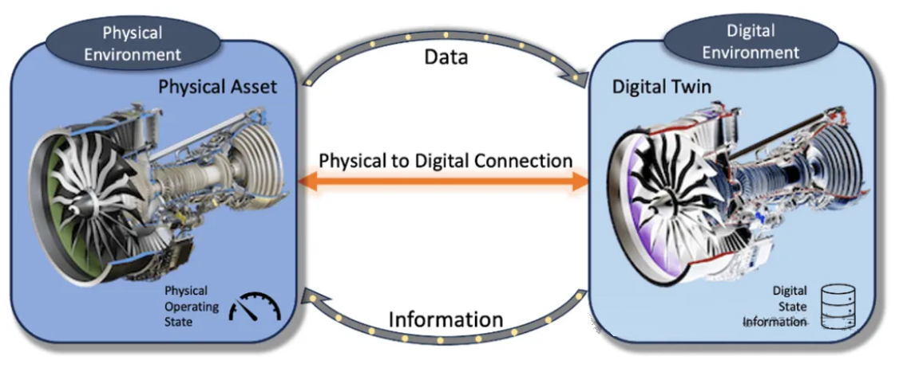
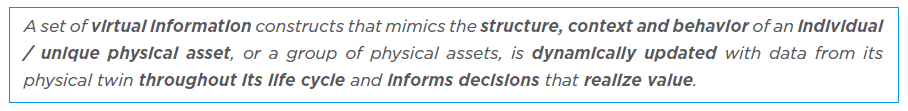
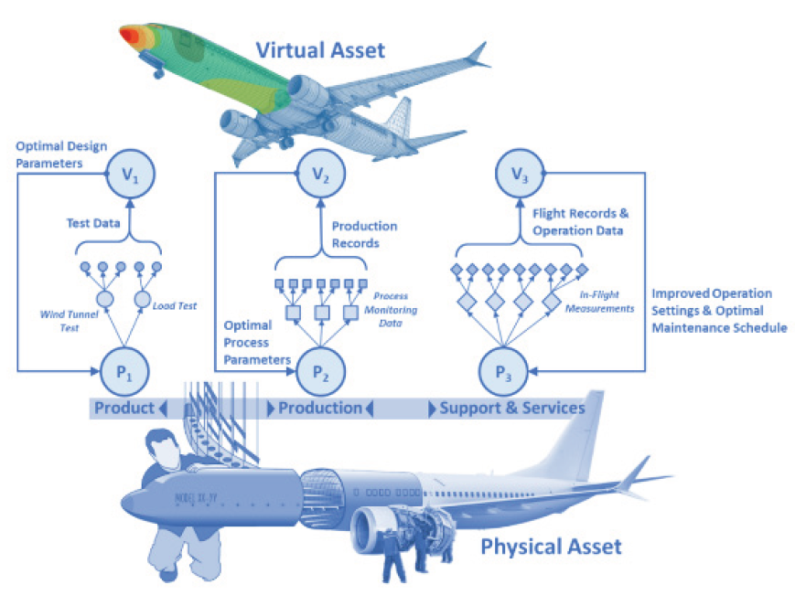
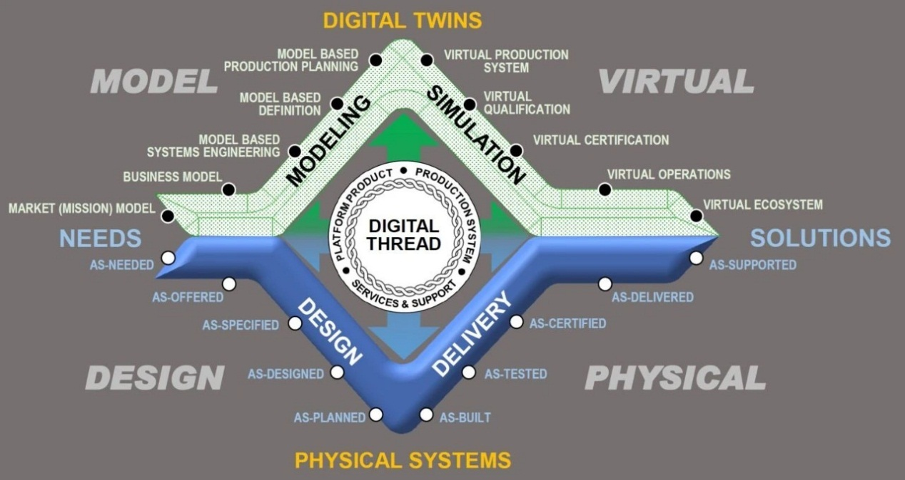
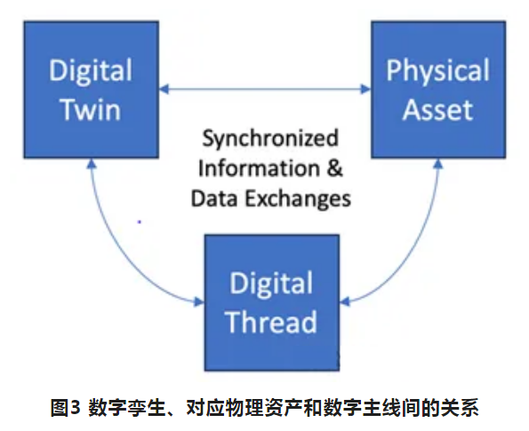
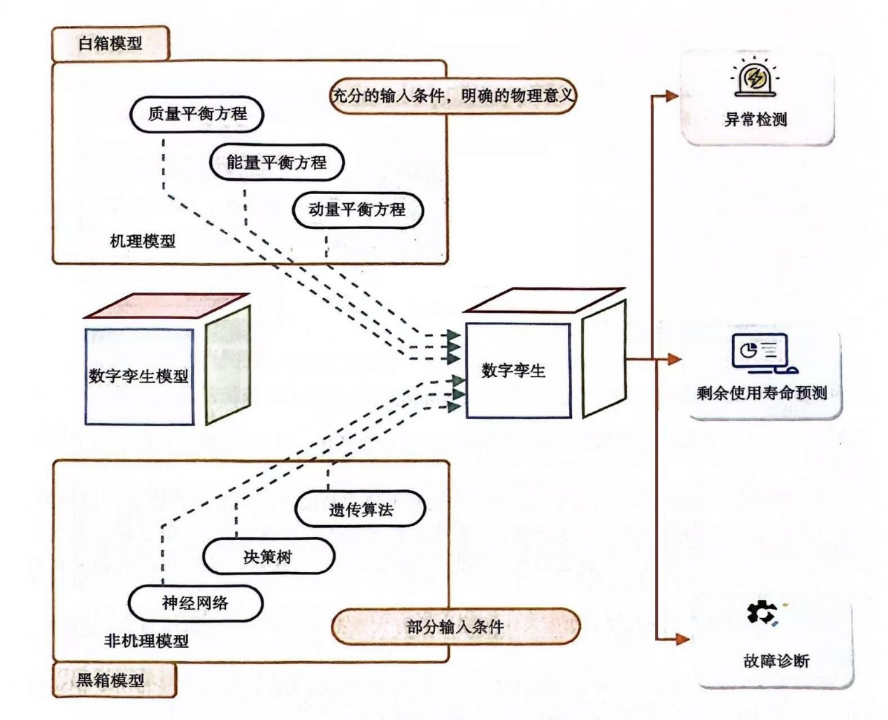
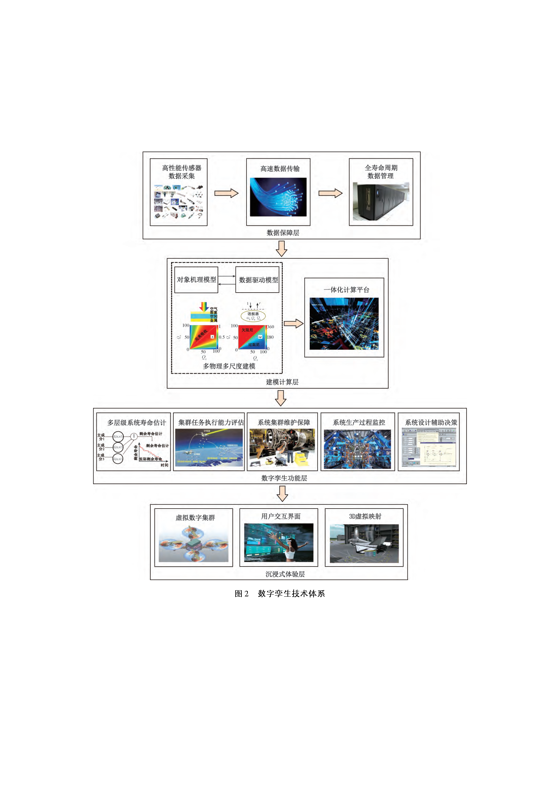
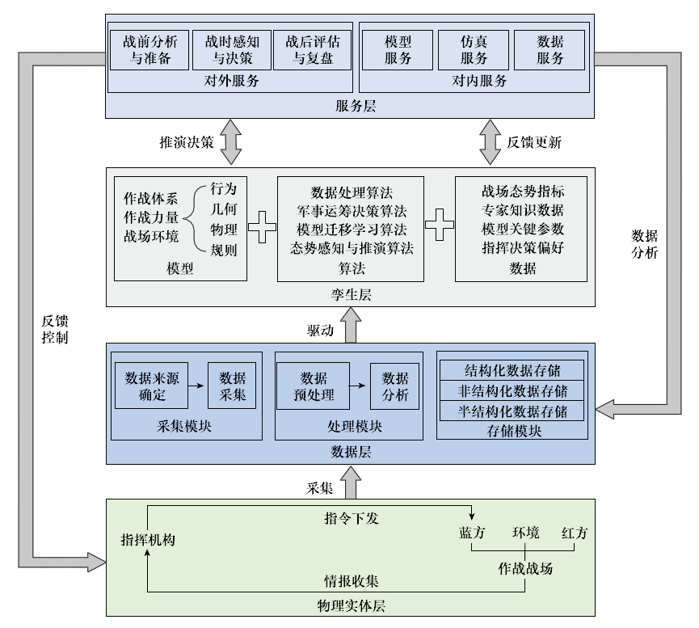

# 数字孪生与军用仿真

【摘要】
数字孪生是一个相对较新的概念，十年前成为热点，目前在智能制造领域的发展较快。数字孪生是一种数字模型，相比较传统的仿真系统而言，强调孪生体与物理资产之间保持实时的交互更新。介绍数字孪生相关概念，以及支撑数字孪生开发的多种系统模型和关键技术。数字孪生战场（平行战场）是军用仿真领域关注的重点。

【关键词】 数字孪生，平行系统，数字孪生战场

【参考书目】

▲鲍劲松，数字孪生技术：体系、建模与系统集成，华中科技大学出版社，2024.6

丁盈，朱军 等，数字孪生系统设计与实践，清华大学出版社，2023.1

方志刚，复杂装备系统数字孪生，机械工业出版社，2020.11

------------------------------------------------------------------------

## 什么是数字孪生

数字孪生的提出其实由来已久，当前行业内对谁先提出这个概念还是存在一些争议。

2002年 Michael Grieves
教授在美国密歇根大学产品生命周期（PLM）中心成立的演讲中提出PLM概念模型，并提出"与物理产品等价的虚拟数字化表达"概念。当时Digital
Twin一词还没有被正式提出。在该设想中数字孪生的基本思想已经有所体现，即在虚拟空间构建的数字模型与物理实体交互映射，忠实地描述物理实体全生命周期的运行。

2011年3月，美国空军研究实验室（AFRL）的P. A. Kobryn和Eric J. Tuegel
发表论文*Reengineering aircraft structural life prediction using a
digital
twin*，明确提到了数字孪生，并探索了数字孪生在飞行器健康管理中的应用。这个研究来源于
AFRL 2009年的"机身数字孪生"项目。美国航空航天局（NASA）在
2010年也提出"Digital
Twin"，在技术路线图中将数字孪生定义为"一个数字孪生，是一种集成化了的多种物理量、多种空间尺度的运载工具或系统的仿真，该仿真使用了当前最为有效的物理模型、传感器数据的更新、飞行的历史等等，来镜像出其对应的飞行当中孪生对象的生存状态"。

### 定义1

工程界提出多种"数字孪生"定义。这些定义的共同特征（无论隐含或明确地表述）包括：

（1）数字孪生是一种数字模型；

（2）数字孪生代表特定的现实世界物理资产；

（3）数字孪生会随现实世界物理资产的变化而保持同步更新。

总体而言，数字孪生框架包含数字模型（孪生体）、对应的物理资产，以及两者间的数据连接，如图所示。

<figure>
  
  <figcaption>图 8‑1 物理和数字环境</figcaption>
</figure>

尽管在细节上存在分歧，但业界普遍认为数字孪生具有三个可变特征：

● 数字模型的保真度；

● 数字孪生与对应物理资产间的信息流向；

● 数字孪生与对应物理资产间数据更新的时效性；

因此，数字孪生的最基础定义必须体现其作为现实物理资产的数字表征，且参数更新速度足以支持物理资产变化时的实际应用。模型的定义是针对特定目的相关系统的表征。因此，数字孪生的基础定义为：

*A digital representation of a specific real-world system of interest
for a specific purpose.*

*针对特定目的特定现实世界相关系统的数字表征。*

此定义包含了上述所有共同特征，同时允许根据特定目的需要，添加其他特征以增加其价值。"针对特定目的"这一限定条件可避免"为了建模而建模"或"为了数字孪生而数字孪生"的无意义行为。

### 定义2

2020 年 12
月，美国航空航天学会（AIAA）和美国航空航天工业协会（AIA）发布《数字孪生：定义与价值》报告（*Digital
Twin: Definition &
Value*）。该报告着眼于航空航天领域，围绕数字孪生及其作用价值提供有关见解，以期推进第四次工业革命（即数字化转型）的发展。该报告由来自通用、诺斯罗普•格鲁曼、雷神、洛克希德•马丁、罗尔斯•罗伊斯、佐治亚理工、波音、美国宇航局等学术界、工业界以及政府部门，具有丰富的数字孪生经验的专家编制。

定义：模拟单个物理资产或一组物理资产的结构、上下文和行为的一组虚拟信息构造，在其整个生命周期中使用来自物理孪生的数据进行动态更新，并为实现价值提供决策所需的信息。

<figure>
  
  <figcaption></figcaption>
</figure>

数字孪生的基本元素有三个：虚拟表示（模型）、物理实现（资产）和两者之间的数据/信息传输（连接）。因此，拥有一个数字孪生需要一个物理实体的资产。

下面是数字孪生的简化版本的定义：数字孪生是联网的物理资产的虚拟表示。

<figure>
  
  <figcaption></figcaption>
</figure>

<figure>
  
  <figcaption>图 8‑2 数字孪生是联网的物理资产的虚拟表示</figcaption>
</figure>

数字孪生是联网的物理资产的虚拟表示，包含其整个产品生命周期。它的价值来自于将工作从物理环境转移到虚拟或数字环境的能力，以及通过利用数字模型预测未来资产状况的能力，或者当物理条件不可取时的能力。这反过来又导致了设计、生产和保障资产运行所需的资源的显著减少。

### 定义3

国家推荐标准GB/T 43441.1-2023 《信息技术 数字孪生
第1部分：通用要求》中对数字孪生的定义，是指具有保证物理状态和虚拟状态之间以适当速率和精度同步的数据连接的特定目标实体的数字化表达。它基于建模技术、物联网技术、扩展现实技术、大数据技术、通信网络技术、人工智能技术等，充分利用物理模型、传感器更新、运行历史等数据，集成多学科、多物理量、多尺度、多概率的仿真过程，能够在虚拟空间中完成对物理空间实体的精准映射，反映对应实体的全生命周期过程，目标是实现虚实空间要素一致、状态同步。当前，数字孪生技术凭借其虚实相生、智能交融的独特优势已经在城市建设、航空航天、车间生产、装备制造等多个行业成功应用。

### 主要特征

数字孪生的重要意义在于实现了现实物理系统向虚拟空间数字化模型的反馈。通过分析数字孪生技术的概念内涵，可以总结出其具有以下主要特征：

一是实时同步。物理实体有准确的结构模型，依据智能化算法对其外观、状态、属性、内在机理进行动态仿真，数字孪生体和物理实体彼此之间可实现动态数据同步更新，并依据相互之间的变化即刻做出相应映射。

二是虚实映射。物理空间和虚拟空间可双向交互演进：不但数字孪生体能够实时反馈物理实体的状态，并且还要向物理实体反馈信息，根据需要对物理实体进行必要的干预和控制。

三是共生演进。数字孪生体所模拟过程是物理实体的全生命周期，包括其设计、生产、运行、维护、修理、退役、报废等一系列实际活动，与物理实体一样具有客观唯一性。

四是多维操作。物理对象和数字孪生体能够动态交互和实时连接，因此数字孪生技术具备以多样的数字模型映射物理实体的能力，具备在不同数字模型之间转换、合并、操作的特性。

五是自主优化。数字孪生体可以不断收集实际系统的数据，与其上一个状态进行比较分析，基于数据进行结果分析，调整物理实体的运行方向，从而达到优化生产计划、降低潜在风险等目的。

### 国际标准

1\. ISO/IEC 30173

ISO/IEC 30173
是专门针对数字孪生的定义和应用的国际标准，由国际标准化组织（ISO）和国际电工委员会（IEC）共同制定，旨在为数字孪生技术提供统一的框架和指导原则。其核心内容包括：数字孪生定义；数据集成；模型构建和管理；互操作性；安全和隐私。

2\. ISO 23247：面向制造业的数字孪生框架

ISO
23247国际标准制定了用于制造业的数字孪生框架，是一组用于制作和维护数字孪生的协议。数字孪生描述了产品、流程或资源的当前状态。每个数字孪生都是一个多维模型，使应用程序能够更快、更高效的创建更好的产品。ISO
23247将数字孪生系统划分为四层，自底向上分别为：可观察的制造要素；设备通信实体；数字孪生实体；用户实体。

## 相关概念

有人批评数字孪生并没有什么新技术，只是"新瓶装旧酒"。的确，数字孪生的发展是在信息化和计算机通信等数字技术的推动下逐步进行的。在数字孪生出现之前，已经存在一系列相关的数字化技术，如计算机仿真、虚拟样机、数字样机等。但是，数字孪生不仅仅是将旧有技术进行简单重复，而是在技术整合、实时性、应用范围等方面展现了自身的独特性和价值。数字孪生在当前大数据和人工智能快速发展背景下，作为一种更加综合和高级的数字化技术得到广泛认同。数字孪生通过将物理实体与虚拟世界进行动态映射和交互，实现对实体全生命周期的综合性管理和优化。相比于传统的数字化技术，数字孪生更加注重虚实融合，提供更全面、更保真的模型和分析，为各行各业提供了新的思路和方法。

### 数字样机

数字样机的英文是Digital Prototype（DP）或Digital
Mock-Up（DMU）。数字样机是相对于物理样机而言的，是指在计算机上表达的机械产品整机或子系统的数字化模型，它与真实的物理产品之间具有1：1的比例，有精确的尺寸表达，用于验证物理样机的功能和性能。在数字样机之前，学术界主要研究的是虚拟样机（virtual
prototype,
VP）。本书认为虚拟样机其实就是数字样机，是一种对物理产品的计算机仿真，可以从产品设计/工程、制造、服务和回收等产品生命周期的相关方面进行展示、分析和测试。我国国家标准GB/T
26100-2010《机械产品数字样机通用要求》对数字样机的定义也采用英文"Digital
Mock-Up"，即数字样机是对机械产品整机或具有独立功能的子系统的数字化描述，这种描述不仅反映了产品对象的几何属性，还至少在某一领域反映了产品对象的功能和性能。由此可见，产品的数字样机形成于产品的设计阶段，可应用于产品的全生命周期，包括工程设计、制造、装配、检验、销售、使用、售后、回收等环节。

数字样机技术以
CAX/DFX（计算机辅助设计/面向产品生命周期设计）技术为基础，以机械系统运动学、动力学和控制理论为核心，融合虚拟现实、仿真技术、三维计算机图形技术，将分散的产品设计开发和分析过程集成在一起，使产品的设计者、制造者和使用者在产品的早期可以直观形象地对数字化的虚拟产品原型进行设计优化、性能测试、制造仿真和使用仿真，为产品的研发提供全新的数字化设计方法。狭义的数字样机认识从计算机图形学角度出发，认为数字样机利用虚拟现实技术对产品模型的设计、制造、装配、使用、维护与回收利用等各种环节进行分析与设计，在虚拟环境中逼真地分析与显示产品的全部特征，以替代或精简物理样机。广义的数字样机认识从制造的角度出发，认为数字样机是一种基于计算机的产品描述，是从产品设计、制造、服务、维护直至产品回收整个过程中全部所需功能的实时计算机仿真，通过计算机技术对产品的各种属性进行设计、分析与仿真，以取代或精简物理样机。这其实非常接近数字孪生概念。

数字样机更多地关注于验证和模拟，和仿真的概念更靠近。而数字孪生强调实时数据的利用和物理世界与数字世界的互动。

### 数字线程/数字主线

数字主线（digital
thread）是指利用先进建模和仿真工具构建的，覆盖产品与全价值链，从基础材料、设计、工艺、制造到使用维护全部环节的，集成并驱动以统一的模型为核心的产品设计、制造和保障的数字化数据流。数字主线最早是由美国空军和洛克希德•马丁公司在研发F-35时提出的。数字主线在数字世界和物理世界之间创造了一个闭环，改变了产品的设计、制造和服务方式。

简单说，数字主线贯穿了产品全生命周期，尤其是从产品设计、生产到运维（运营）、退役的无缝集成。而数字孪生伴随了数字主线，在每一个阶段都有一个数字孪生体，该数字孪生体可由上游的数字孪生体演化而来，并且强调了迭代优化，比如产品运维获得的信息反馈给产品设计。数字主线可看作物理产品的数字化影子，通过与外界传感器的集成，反映对象从微观到宏观的所有特性，展示产品的生命周期的演进过程。

<figure>
  
  <figcaption>图 8‑3 数字主线</figcaption>
</figure>

数字孪生与数字主线（也有称数字线程、数字线索）不同。美国国防采办大学（DAU）将数字主线定义为：一种可扩展、可配置的组件化企业级分析框架，基于数字系统模型模板，无缝加速企业数据-信息-知识系统中权威技术数据、软件、信息与知识的受控交互，通过提供访问、整合不同数据并将其转化为可操作信息的能力，在系统全生命周期内为决策者提供信息。

数字主线可用于开发模型与数字孪生。如图所示是数字孪生、对应物理资产与数字主线之间的关系。可见，数字主线为利益相关方提供了工具的无缝访问权限，以及与物理资产及其使用环境相关技术信息的权威真相源。

<figure>
  
  <figcaption>图 8‑4 数字孪生、物理资产与数字主线之间的关系</figcaption>
</figure>

### 数字阴影

数字阴影（digital
shadow）是介于数字模型与数字孪生之间的一种在虚拟空间中映射现实世界的模式，由德国亚琛工业大学提出。数字阴影本质是数字影子或者设备影子，而影子是物理世界中实体的映射，但是它不会对实体产生影响，只有实体会对它产生影响。所以数字阴影就是设备实例在物联网平台上的一个虚拟映射，用户可以通过数字阴影了解设备实例的实时状态，也就是对设备实例的各项数据仅有只读权限。

因此，数字阴影本质上就是指代物理对象的虚拟对象，当然与传统的数字模型是有区别的。传统数字模型的虚拟对象与现实对象之间需要手动传输信息（好比打游戏，得有控制器才能控制三维模型运动），而数字阴影的虚拟对象可以自动获取现实对象的信息（现实到模型，单向自动数据流传输），数字孪生则可以实现现实对象与虚拟对象的双工信息自动传输。

### 赛博物理系统

赛博物理系统（cyber-physical system,
CPS）是一个集成了信息网络世界和动态物理世界的多维复杂系统。通过"计算、通信和控制"（3C）的集成和协作，CPS提供实时传感、信息反馈、动态控制等服务。通过紧密连接和反馈循环，物理和计算过程高度相互依赖。通过这种方式，信息世界与物理过程高度集成和实时交互，以便以可靠、安全、协作、稳健和高效的方式监控物理实体。

赛博物理系统和数字孪生概念非常容易混淆，二者有很多相同点，也有明显的不一样。陶飞指出CPS和数字孪生共享密切的网络与物理连接、实时互动、组织整合和深度协作等基本概念。然而，从许多角度来看，包括起源、发展、工程实践、网络与物理映射和核心要素等方面，CPS和数字孪生并不完全相同。数字孪生联盟给出了CPS的定义：一个通过网络连接的物理系统和数字系统组成的系统。从构成上来看，CPS和数字孪生都涉及物理世界和信息世界。

赛博物理系统的概念比数字孪生更广泛。CPS是一个综合性的概念，它指的是将计算、通信和控制技术（3C）与物理系统相结合形成的紧密耦合赛博物理系统。CPS通过实时感知、动态控制和信息服务，将赛博世界与物理世界紧密连接在一起，从而实现物理系统的智能化和优化。而数字孪生是CPS中的一个最佳实践，它是指对组件、产品或系统进行全面的物理和功能描述，通过创建高保真度的虚拟模型来与物理实体进行交互和演化。

### 平行系统

2004年中国科学院自动化研究所的王飞跃研究员发表了《平行系统方法与复杂系统的管理和控制》的文章，首次提出了"平行系统"的概念。平行系统（parallel
systems）与数字孪生系统非常相似，是指由某一个自然的现实系统和对应的一个或多个虚拟或理想的人工系统所组成的共同系统。通过现实系统与人工系统的相互连接，对二者之间的行为进行实时的动态对比与分析，以虚实互动的方式，完成对各自未来的状况的"借鉴"和"预估"，人工引导现实，现实通近人工，达到有效解决方案的提出以及学习和培训的目的。

在军事领域，有"数字平行战场"的概念。

## 数字孪生与智能制造

近年来，数字孪生在国内得到了越来越广泛的传播，这一发展得益于中国智能制造的迅速推进，以及物联网、大数据、云计算和人工智能等新一代信息技术与数字孪生的紧密融合。目前，数字孪生不仅在航空航天领域得到应用，还在电力、船舶、城市管理、农业、建筑、制造、石油天然气、健康医疗和环境保护等多个行业得到广泛应用。通过数字孪生，企业和组织可以实时模拟和监测实体的状态和行为，预测可能发生的间题，并进行优化和改进。这不仅可以提高生产效率和质量，还可以减少风险和成本，推动行业的可持续发展。

智能制造是新质生产力形成和发展的重要驱动力，是工业4.0的核心，以及推动实现高效、灵活、绿色、智能的生产方式。数字孪生技术作为智能制造的关键技术之一，通过构建物理设备与虚拟模型之间的实时映射和同步，为制造业的智能化、自动化、高效化提供有力支持，推动制造业的转型升级。

（1）生产自动化：智能制造通过引入机器人、自动化设备等技术，实现生产线的自动化操作。不仅降低了人力成本，还提高了生产效率和产品质量。

（2）生产智能化：通过集成各种传感器、控制器和执行器，智能制造系统可以实时感知生产环境、设备状态和产品信息，并自动调整生产参数，实现优秀化的生产控制。

（3）生产协同化：智能制造强调各环节之间的协同和整合，通过信息平台的统一管理和调度，实现各环节之间的无缝衔接，从而提高整体生产效率。

智能制造数字孪生是在现代传感技术、网络技术、自动化技术、拟人化智能技术等技术的基础上，通过智能化的感知、人机交互、决策和执行技术，对产品、制造过程或整个工厂进行虚拟仿真，实现设计过程、制造过程、管理过程和制造装备智能化，提高制造企业产品研发、制造和管理效率，是信息技术、智能技术与装备制造技术的深度融合与集成。例如，在产品设计方面，通过数字孪生构建产品虚拟模型，进行产品性能仿真和优化设计，提高产品设计质量和效率；在生产制造方面，实时监控生产过程，预测设备故障，优化生产流程，降低生产成本；在供应链管理方面，基于数字孪生实现供应链的数据集成和共享，优化资源配置，提高供应链协同效率。

数字孪生与智能制造的融合，将为工业制造带来更加深远的影响。通过数字孪生技术构建虚拟工厂，可以在虚拟环境中模拟和优化实际生产过程，为智能制造提供决策支持。智能制造系统的实时数据反馈，又可以为数字孪生模型的更新和优化提供数据支持。未来，随着技术的不断进步和应用场景的拓展，数字孪生与智能制造的融合将发挥出更大的潜力，为工业制造带来更加广阔的发展前景。

## 数字孪生与仿真模型

### 数字孪生与仿真的区别

仿真是对真实场景建立数字化模型，并可在该模型上进行试验。国内学者普遍认为仿真就是在计算机上或（/和）实体上建立系统的有效模型（数字的、物理效应的或数字-物理效应混合的模型），并在模型上进行系统试验。

人们经常把仿真和数字孪生混淆，它们有许多相似之处，但也有一些重要区别。

数字孪生和仿真都是通过创建虚拟模型来研究、分析和优化实际系统或过程的方法，都可以在不同的时间和空间尺度下进行，以满足对复杂现象和过程的理解需求。但是，数字孪生的目标是创建一个与实际对象具有相同属性和行为的虚拟模型。而仿真更注重于分析系统的动态行为、性能和响应，不一定要求虚拟模型与实际对象完全一致。数字孪生强调数据驱动，通过对传感器数据的实时采集和分析，可以使模型保持与实际情况的高度同步。而仿真可以通过多种方法生成数据，如基于物理模型、统计学方法等，不一定需要实时数据。另外，数字孪生的核心在于虚实融合，将虚拟世界和现实世界紧密联系起来，以便为决策提供支持。而仿真更注重于独立地研究和分析系统的行为，不一定考虑现实世界的具体约束和限制。数字孪生模型的本质体现在动态性，而仿真模型建立完成后，往往不再变化。

除此之外，在数字孪生成熟度的每个阶段，仿真都在扮演着不可或缺的角色，因为数字孪生建模总是和仿真联系在一起，仿真模型甚至是数字孪生模型的一部分。数字孪生需要依靠仿真、实测、数据分析等手段对物理实体状态进行感知、诊断和预测，进而优化物理实体，同时进化自身的数字模型。因此，数字孪生建模技术研究大量运用了仿真技术创建和运行数字孪生模型。

另外，三维CAD模型是在计算机上表达的机械产品整机或子系统的三维数字化几何模型，它与真实物理产品之间具有1：1的比例尺和精确尺寸表达，其作用是表达物理产品的形貌、结构和组成。三维CAD模型是包括产品数据内容、关系及活动过程的三维信息模型，用以定义和表达产品全生命周期中的产品资源。三维CAD模型是数字化的基础，也是后来MBD（基于模型的设计）、MBE（基于模型的企业）、MBSE（基于模型的系统工程）等现代数字工程的基础，作为传递数字量的核心载体。

### 数字孪生技术军事应用

数字孪生技术所展现的特点和优势，同样契合了军事领域发展运用的特殊需求。特别是在智能化战争中，依托数字孪生技术开展作战指挥、信息通信、战场建设和装备维护将会是大势所趋。

**数字孪生+作战指挥**

数字孪生技术可以通过自主学习，同步复制与实战环境一致的虚拟场景，辅助指挥员实施远程高效的作战指挥。一是优化作战指挥体系。数字孪生技术为各级指挥员与数字孪生系统之间提供清晰准确的交流通道，理想情况下该交流包括但不限于触觉、视觉、听觉，让操作者能够迅速掌握物理实体的属性和实时性能，为指挥决策提供科学支持。相比传统文书管理、指令管理系统的多级中转，可有效增强不同层次指挥对象之间平行和交叉的纵横联通能力。二是创新作战指挥模式。数字孪生技术可以区分不同作战任务构建出真实的作战场景，采用作战体系建模的方法对各类作战资源实体进行数字孪生建模，既包括飞机、舰船、导弹等实体类，指挥所、保障分队等机构类，也包括部队机动、火力打击等操作类，从而核算出最佳单位编组和行动策略，实施战略或战役级的推算，实现远程高效指挥。三是提高指挥决策效率。未来武器装备的无人化、高速度、远射程等发展趋势使得战争节奏显著加快，人脑很难在巨大的作战压力下快速高效处理海量战场信息。数字孪生技术具有自主数据挖掘、联合态势感知、智能辅助决策和协同指挥控制等能力，通过虚拟映射形成数字孪生体，将实时展现战场变化和态势走向。指挥员可以及时挖掘支撑指挥决策的关键信息，大大压缩作战构想、任务分配、目标打击、毁伤评估的指挥周期。

**数字孪生+战场建设**

数字孪生战场是智能化战争形态下数字孪生技术发展的必然产物。数字孪生战场涵盖物理域、信息域、认知域、社会域的多域融合虚拟空间，包含侦察预警、指挥控制、兵力火力、信息通信、后勤保障，甚至历史文化、政治经济等所有具体或抽象的战争要素，是实际战场的数字化形态展现。一是推进战争形态演进。数字孪生战场所构建的战场环境，为未来智能化战争提供充分技术支撑。基于网络信息体系支撑的智能化、无人化联合作战样式将得到充分论证；"网---云---端"架构服务应用可以有效融合各作战要素和作战单元，实现战场"侦-控-打-评-保"链路闭合。二是促进战场体系融合。数字孪生战场搭建了一个融合武装力量、武器系统、战场设施、战场环境等要素信息为一体的智能平台，相比传统的数字化、信息化战场更加强调体系融合，其价值突出体现在虚实映射、实时联动上。在特定系统的支持下，各类作战资源"在用""饱和""空闲"等状态即时感知，并完整映射到"基础网+作战云+数字孪生体"的虚拟空间，形成"全息"对照的战场态势，每一个作战平台都可以"全维"抽取关键信息，"全域"拼接作战场景、"全程"推演打击行动，并实时感知友邻平台的运行状态。在这样的全透明战场空间，任何个体要想避免被其他成员抛弃，必须主动向体系贡献自己的能力，从而自然地产生出一种自适应调整的体系能力。三是节约战场建设成本。战场建设项目工程量大，投资经费多、建设范围广、建设周期长，统筹规划不当容易出现使用效益低、征地矛盾多、容量不足或重复建设浪费资源等问题。数字孪生战场可实现在虚拟空间开展"规划-论证-建设-使用-退役"的全生命周期管理，全面提升战场建设人力、物力、财力的优化配置效益。

## 数字孪生系统建模

### 系统建模

数字孪生系统建模与通用的系统建模类似，都是通过建立模型来描述目标系统的特征、内部运作机理、行为和对外界的响应。数字孪生系统的特点在于它基于实际系统的数据和物理模型，通过模拟和仿真实现对实际系统的精确复制，这就是虚实间的映射。同时，建立的分析和决策模型不断实时观察系统状态，进行预测性分析和决策，即虚实间的反馈。

数字孪生系统建模跨度很大，包括不同粒度的，针对离散系统和连续系统的模型，整合三维几何模型、机理模型和数据模型等等。

首先是数学模型。数学是描述系统行为和相互关系的基础工具。准确的数学定义可以确保系统模型的一致性和准确性，提供数字孪生对象的精确描述；同时，用于描述数字孪生对象的动态行为。可以建立差分方程、微分方程或其他数学模型，以描述系统的时间演化和行为变化。常用的模型是基于离散数学的，综合集合和映射理论，描述系统状态的集合和描述对象关系的映射。

系统建模仍然可以采用主流的面向对象建模方法；模型描述格式是XML或JSON，同时与Web技术集成；语义描述语言可以利用RDF和OWL等语义网技术；系统建模语言是UML和SysML。

微软提出了一种基于JSON-LD和RDF的开放式建模语言，称为数字孪生定义语言（DTDL），可以对任何实体进行建模。DTDL表示的模型，提供特定领域本体以引导解决方案开发，并使开发人员能够快速建模和创建连接环境。例如，智能制造的DTDL本体。

### 几何模型

通过使用三维场景和模型，数字孪生可以提供更逼真、令人感到身临其境的虚拟体验。三维场景能够准确再现真实世界的空间关系、物体形状和位置，提供对真实世界的高度精确的空间模拟。通过准确的建模和渲染物体、环境和场景，数字孪生可以在虚拟环境中准确再现物理特性、光照效果和运动行为。这对于模拟和预测物理过程、系统行为以及交互效果至关重要。

对于工业产品，常用专业三维建模软件，比如达索CATIA、西门子NX等进行实体建模，对于大尺寸场景建模、仿真和渲染，常用3D
Max、Sketchup、Blender等软件进行表面建模。

常见的三维文件格式，例如Khronos
Group开发的glTF，皮克斯动画开发的USD（统一场景描述），以及相对简单的STL格式和OBJ格式。

### 机理模型

机理是指事物变化的理由和道理，包括构成要素和形成要素之间的关系两个方面，通常用于解释各种系统和现象的运行原理。数字孪生机理模型是基于对象和生产过程的内部机制或物质流传递机理而建立的数学模型。机理模型的优点在于其参数具有明确的物理意义，需要充分的输入条件，并能模拟整个过程，因此也被称为白箱模型。

**1. 数学模型**

数学模型种类繁多，根据不同的研究对象采用不同的数学模型。对于连续过程，通常使用微分方程、传递函数、状态方程；对于离散过程，通常使用差分方程、离散化传递函数、离散化状态方程。还有基于数学变量的模型，包括系统动力学模型、博弈模型、排队模型和马尔可夫模型。这些模型都聚焦于系统随时间变化的特征，适用于解决管理、工业和操作设置中的策略问题。

**2. 计算机仿真模型**

计算机仿真模型通常用来做模拟分析（what-if
analysis），用来做设计验证与预案设计，可以分为如下四种：

（1）系统级仿真，包括机械、电子、电力、液压、热力学、控制系统等的仿真。

（2）连续介质理论的计算机辅助工程（CAE）模拟，包括有限元法（FEM）、计算流体动力学（CFD）、电磁仿真以及多物理场耦合仿真等。

（3）非连续介质理论，设计微观组织的演变以及缺陷、断裂和损伤等各类问题。

（4）离散事件仿真，主要仿真活动过程等离散事件下的系统性能。

**3. 多学科机理模型**

复杂装备系统（如兵器、航空装备、航天器、舰船等）是一类有特殊应用的复杂产品，是典型的多领域物理综合集成系统，涵盖机械、电气、光学、液压、热力学、控制等多个领域，往往需要多专业协同，实现不同学科专业领域模型的相互连接，开展联合仿真。

常用的多学科模型建模工具有Modelica、MATLAB、Dymola等。

多学科机理模型集成也是至关重要的。当前，用于描述物理系统行为的标准化模型格式是功能样机单元（FMU）。功能样机接口（FMI）是用于交互FMU的标准化接口，FMU/FMI通过模拟合并和显示各种组件，能够以复杂的方式交互。FMI语言是Modelica协会维护的一个开源标准，它定义了一个容器和一个接口，用于使用XML文件、二进制文件和C语言代码的组合交换动态仿真模型，并以ZIP格式分发。

### 数据驱动模型

传统的机理模型普遍基于物理规律，然而对于某些复杂系统或对象，建立其机理模型可能比较困难。一方面可能无法编写精确的数学表达式；另一方面，机理模型需要大量参数，而这些参数的获取存在困难。因此，数字孪生还需要非机理模型，也被称为黑箱模型。非机理模型不依赖于明确的物理机制，而是通过数据驱动的方法来建模和预测。

数字孪生系统贯穿产品的全生命周期，设计的数据种类多样。例如对于制造业来说，主要来自研发阶段、生产阶段和使用阶段的数据，包括：

设计数据，产品的3D模型、CAD图纸、设计规范等；

模拟数据，使用计算机模拟和仿真工具生成的数据，用来评估和优化产品性能；

实验数据，通过实验和测试获取的数据；

工艺数据，包括生产工艺流程、工艺参数、工艺规范等；

传感器数据，从工厂的传感器收集的数据，监测和控制生产过程中的各种参数（温度、湿度、压力等）；

运行数据，通过产品上安装的传感器收集的数据，用于监测产品的运行状态、性能指标和工作环境；

维修数据，产品维护记录、故障报告等。

<figure>
  
  <figcaption>图 8‑5 数字孪生的数据驱动模型</figcaption>
</figure>

信息系统和数据库的设计离不开数据模型，因抽象程度而异，数据模型一般自顶向下分为概念数据模型、逻辑数据模型、物理数据模型。

将数字孪生与经典的机器学习模型结合能够进行数据驱动分析，这是构建数字孪生模型的常用方法。机器学习包含使用不同算法的学习模型，根据数据的性质和期望的结果，可以将学习模型分成四种：监督学习、无监督学习、半监督学习和强化学习。机器学习算法主要用于对事物进行分集和预测结果，以及决策。下面简单介绍分类、回归、聚类等几种常见的数据分析方法、模型和数字孪生应用场景。

**1. 分类模型**

分类是一种基本的数据分析方法，可以根据数据的特点，将数据对象划分为不同的部分和类型，再进一步分析，能够挖掘事物的本质。数据分类和预测方法可以应用于数字孪生系统中的产品性能评估和预测。使用监督学习算法，可以训练模型对产品的性能进行分类或预测，例如产品寿命、故障风险等。常用的分类方法有决策树算法、神经网络算法、贝叶斯分类、基于关联规则的方法、支持向量机的方法等。

决策树算法：采用树形结构，使用层层推理来实现最终的分类。决策树由根节点（包含样本的全集）、内部节点（对应特征属性测试）以及叶子节点（代表了决策的结果，也是标签）组成。特征选择决定了使用哪些特征来做判断。在训练数据集中，每个样本的属性可能有很多个，因而特征选择的作用就是筛选出跟分类结果相关性较高的特征，也就是分类能力较强的特征。

贝叶斯分类：基于贝叶斯定理进行分类预测。贝叶斯分类可以用于将实时监测数据与数字孪生模型进行比对，从而进行预测和故障检测。因为人对某一事件未来是否会发生的认知，大多数取决于该事件或类似事件过去发生的概率。需要计算随机事件的先验概率、条件概率、边缘概率等。

**2. 回归模型**

回归是一种应用广泛的统计分析方法，可以通过规定因变量和自变量来确定变量之间的因果关系。要建立回归模型，首先应根据实测数据求解模型的各参数，然后评价回归模型是否能够很好的拟合实测数据，如果能够拟合，则可以根据自变量作出进一步预测。回归算法在数字孪生应用中可以帮助建立、验证和优化数字孪生模型，进行预测和优化，实现故障检测，并提供数据驱动的决策支持。常见的回归方法有线性回归、多项式回归和神经网络方法等。

线性回归：是最为人熟知的建模技术之一，通常是学习预测模型的首选技术之一。其中因变量是连续的，自变量可以是连续的、也可以是离散的，回归线的性质是线性的。线性回归模型相对简单，用易于解释的数学公式来生成预测。

多项式回归：研究一个因变量与一个或多个自变量之间的多项式关系，是线性回归模型的一种。多项式回归问题可以通过变量转换化为多元线性回归问题来解决。它可以使我们对非线性关系进行建模。线性回归使用直线来拟合数据，如一次函数；而多项式回归则使用曲线来拟合数据，如二次函数、三次函数以及多次函数等。

神经网络方法：多层感知器是一种前馈型人工神经网络，弥补线性回归和单个神经元的不足。它包括输入层、隐蔽层和输出层。当存在多个隐蔽层时，多层感知器被称为深度人工神经网络。当前，深度学习的各种模型在数字孪生的数据分析中大量应用。

**3. 聚类模型**

聚类算法是无监督学习的一种算法，用于在数据中寻找隐藏的联系与区别。聚类算法可对相似度进行欧几里得距离、概率距离、加权重距离计算。聚类算法在数字孪生应用中有助于数据探索、特征选择、数据分割、异常检测和群体行为分析。它能够发现数据中的模式和结构，帮助理解和利用数字孪生模型的输入数据，以改善预测、优化和决策制订的效果。常见的聚类方法主要有基于密度的方法、基于层次的方法和分区方法（如K-means方法）等。

K均值方法：是聚类算法的一种，其过程包括：设置参数K，随机选择K个数据点作为初始的簇中心点，对于每个数据点，将其分配给离它最近的簇中心点，形成K个簇；对每个簇，计算其所有数据点的平均值，将该平均值作为心的簇中心。K-means算法其目标是最小化簇内数据点与其簇中心之间的距离平方之和，也就是最小化簇内方差。这一过程通过迭代不断优化，直到达到一定的收敛条件。

### 时序数据驱动模型

时间序列数据是指同一指标按时间顺序记录的数据列。基于时序数据驱动的数字孪生应用有助于行为建模、预测、异常检测、故障诊断、特征提取、优化和控制策略生成。

**1. 传统时序模型**

ARIMA模型，即自回归积分滑动平均模型，是20世纪70年代初提出的一种时间序列预测方法。其基本思想是将非平稳时间序列转化为平稳时间序列，通过将因变量仅对其滞后值以及随机误差项的现值和滞后值进行回归来建立模型。这种模型可以用来预测时间序列的未来值。ARIMA方法可以用于构建深度模型，以实现数据的预测和分析。

**2. 常见机器学习模型**

XGBoost模型：是一个监督模型，由一对分类回归树（CART）组成，旨在实现高效、灵活和可移植的大规模并行提升树（boosting
tree）工具，是目前公认速度最快、表现最好的工具包之一。XGBoost通过不断建立多个树进行预测，根据预测结果进行改进，从而达到最终目标。XGBoost的主要目标是降低模型误差，思路是不断生成新的树来学习基于上一棵树目标值的残差，以此来降低模型的偏差。所有树的结果累加起来才是模型对一个样本的预测值。

LightGBM模型：是微软开发的提升方法（boosting）集成模型，和XGBoost一样是对梯度提升决策树（GBDT）的优化和高效实现，原理有相似之处。LightGBM模型是为了解决大数据量的GBDT训练问题而提出的。它基于梯度提升框架，有效处理大规模数据集，并在保持模型精度的同时提高计算效率。

**3. 常见深度学习模型**

深度学习模型具有自动特征提取和处理复杂数据关系的能力，可以从原始和不完整的数据中学习。数字孪生系统通常涉及大量变量和不规则的时间结构，而深度学习能够捕捉数据中的非线性关系和长期依赖，提高预测的准确性。此外，深度学习模型能够处理多变量输入和输出，不受传统方法如ARIMA在输入输出维度上的限制，适合用于数字孪生中的多变量预测任务。当前，采用深度学习为数字孪生建立数据驱动模型是主流方式。

LSTM模型：长短期记忆网络（LSTM）模型是一种经典的深度学习模型，它在处理序列数据的表现出色，尤其是在时序预测、自然语言处理等任务中具有重要应用价值。通过输入门、遗忘门和输出门三门机制，LSTM可以有效的学习和存储长周期序列中的信息。LSTM模型能够捕捉时序数据中的长期依赖关系，对于理解和预测数据孪生系统中的复杂动态过程至关重要。

Seq2Seq模型：是一种强大的序列到序列预测工具，特别适合处理时间序列数据，由两部分组成：编码器和解码器。编码器将不等长的输入序列转换为固定长度的向量，而解码器则将这个向量转换为目标序列。

WaveNet模型：声音是一种典型时序数据，WaveNet为数字孪生的声音识别和故障诊断提供支持，该方法由Google
DeepMind提出。WaveNet利用卷积神经网络（CNN）精确的模拟了声波的生成过程。在数字孪生的框架内，WaveNet可以被视为一种增强显示的组件，用以创建或复现设备的声音特征和行为。它不仅提升了声学模拟的深度和准确性，而且通过为设备运行状态提供实时声学映射，为设备维护和操作提供了一个新的视角。

Transformer模型：是一种基于注意力机制的神经网络模型，广泛应用于自然语言处理任务，是ChatGPT的基础。该模型的核心是自注意力机制，能够捕捉输入序列的全局语义信息，通过计算查询、键和值之间的相似度来建立元素间的关联。Transformer由编码器和解码器组成，编码器负责将输入序列编码为上下文感知的表示，解码器则基于编码器输出和先前预测生成目标序列。自注意力机制在编码器和解码器中用于处理输入序列，每个元素都与其他元素进行相似度计算并加权求和，以获得更全面的上下文表示。

在数字孪生背景下，GPT可以用来解释、生成和预测数字副本中的类人交互。这可以使人工智能交互更自然、更高效，并且还可以用于模拟数字孪生环境中的人类对话或决策过程。

## 技术架构与关键技术

### 数字孪生技术架构

数字孪生技术的实现依赖于诸多先进技术的发展和应用，其技术体系可以分为数据保障层、建模计算层、数字孪生功能层和沉浸式体验层4
层，如图所示，每一层的实现都建立在前面各层的基础之上，是对前面各层功能的进一步丰富和拓展。

<figure>
  
  <figcaption>图 8‑6 数字孪生技术架构</figcaption>
</figure>

### 多领域多尺度融合建模

多领域建模是指在正常和非正常工况下从不同领域视角对物理系统进行跨领域融合建模，且从最初的概念设计阶段开始实施，从深层次的机理层面进行融合设计理解和建模。当前大部分建模方法是在特定领域进行模型开发和熟化，然后在后期采用集成和数据融合的方法将来自不同领域的独立的模型融合为一个综合的系统级模型，但这种融合方法融合深度不够且缺乏合理解释，限制了将来自不同领域的模型进行深度融合的能力。多领域融合建模的难点是多种特性的融合会导致系统方程具有很大的自由度，同时传感器采集的数据要求与实际系统数据高度一致，以确保基于高精度传感测量的模型动态更新。

多尺度建模能够连接不同时间尺度的物理过程以模拟众多的科学问题，多尺度模型可以代表不同时间长度和尺度下的基本过程并通过均匀调节物理参数连接不同模型，这些计算模型比起忽略多尺度划分的单维尺度仿真模型具有更高的精度。多尺度建模的难点同时体现在长度、时间尺度以及耦合范围3
个方面，克服这些难题有助于建立更加精准的数字孪生系统。

### 数据驱动与物理模型融合的状态评估

对于机理结构复杂的数字孪生目标系统，往往难以建立精确可靠的系统级物理模型，因而单独采用目标系统的解析物理模型对其进行状态评估不能获得最佳的评估效果，采用数据驱动的方法利用系统的历史和实时运行数据，对物理模型进行更新、修正、连接和补充，充分融合系统机理特性和运行数据特性，能够更好地结合系统的实时运行状态，获得动态实时跟随目标系统状态的评估系统。目前数据驱动与解析模型相融合的方法主要有两种思路，一种是以解析模型为主，利用数据驱动的方法对解析模型的参数进行修正；另一种是将两种方法并行使用，最后依据两者输出的可靠度进行加权，得到最后的评估结果。但以上两种方法都缺少更深层次的融合和优化，对系统机理和数据特性的认知不够充分，融合时应对系统特性有更深入的理解和考虑。

目前数据与模型融合的难点在于两者原理层面的融合与互补，如何将高精度的传感数据统计特性与系统的机理模型合理、有效地结合起来，获得更好的状态评估与监测效果，是亟待考虑和解决的问题。

无法有效实现物理模型与数据驱动模型的结合，也体现在现有工业复杂系统和装备复杂系统全寿命周期状态无法共享，全寿命周期内的多源异构数据无法有效融合，现有对数字孪生的乐观前景大都建立在对诸如机器学习、深度学习等高复杂度、高性能的算法基础上，预期利用越来越多的工业状态监测数据构建数据或数学模型，借以替代难于构建的物理模型，但如此会带来对象系统过程或机理难于刻画、所构建的数字孪生系统表征性能受限等问题。有效提升或融合复杂装备或工业复杂系统前期的数字化设计及仿真、虚拟建模、过程仿真等，进一步强化考虑复杂系统构成和运行机理、信号流程及接口耦合等因素的仿真建模，是构建数字孪生系统必须突破的瓶颈。

### 数据采集和传输

高精度传感器数据的采集和快速传输是整个数字孪生系统体系的基础，温度、压力、振动等各个类型的传感器性能都要最优以复现实体目标系统的运行状态，传感器的分布和传感器网络的构建要以快速、安全、准确为原则，通过分布式传感器采集系统的各类物理量信息以表征系统状态。同时，搭建快速可靠的信息传输网络，将系统状态信息安全、实时地传输到上位机供其应用具有十分重要的意义。数字孪生系统是物理实体系统的实时动态超现实映射，数据的实时采集传输和更新对于数字孪生具有至关重要的作用。大量分布的各类型高精度传感器是整个孪生系统的最前线，为整个孪生系统起到了基础的感官作用。

目前数字孪生系统数据采集的难点在于传感器的种类、精度、可靠性、工作环境等受到当前技术发展水平的限制，采集数据的方式也受到局限；数据传输的关键在于实时性和安全性，网络传输设备和网络结构受限于当前技术水平无法满足更高级别的传输速率，网络安全性保障在实际应用中同样应予以重视。随着传感器水平的快速提升，很多微机电系统（MEMS）传感器日趋低成本和高集成度，而高带宽和低成本的无线传输，如IoT
等技术的应用推广，能够为获取更多用于表征和评价对象系统运行状态或异常、故障、退化等复杂状态提供前提，尤其对于旧有复杂装备或工业系统，其感知能力较弱，距离构建赛博物理系统（CPS）的智能体系尚有较大差距。许多新型的传感手段或模块可在现有对象系统体系内或兼容于现有系统，构建集传感、数据采集和数据传输一体的低成本体系或平台，也是支撑数字孪生体系的关键部分。

### 全寿命周期数据管理

复杂系统的全寿命周期数据存储和管理是数字孪生系统的重要支撑，采用云服务器对系统的海量运行数据进行分布式管理，实现数据的高速读取和安全冗余备份，为数据智能解析算法提供充分可靠的数据来源，对维持整个数字孪生系统的运行起着重要作用。通过存储系统的全寿命周期数据，可以为数据分析和展示提供更充分的信息，使系统具备历史状态回放、结构健康退化分析以及任意历史时刻的智能解析功能。海量的历史数据同时还为数据挖掘提供了丰富的样本信息，通过提取数据中的有效特征、分析数据间的关联关系，可以基于数据分析结果获得很多未知但却具有潜在利用价值的信息，加深对系统机理和数据特性的理解和认知，实现数字孪生体的超现实属性，随着研究的不断推进，全寿命周期数据将持续为其提供可靠的数据来源和支撑。

全寿命周期数据存储和管理的实现需要借助于服务器的分布式和冗余存储，由于数字孪生系统对数据的实时性要求很高，如何优化数据的分布架构、存储方式和检索方法，获得实时可靠的数据读取性能，是其应用于数字孪生系统面临的挑战。尤其考虑工业企业的数据安全以及装备领域的信息保护，构建以安全私有云为核心的数据中心或数据管理体系，是目前较为可行的技术解决方案。

### VR 呈现

虚拟现实（VR）技术可以将系统的制造、运行、维修状态以超现实的形式给出，对复杂系统的子系统进行多领域、多尺度的状态监测和评估，将智能监测和分析结果附加到系统的各个子系统、部件，在完美复现实体系统的同时将数字分析结果以虚拟映射的方式叠加到所创造的孪生系统中，从视觉、声觉、触觉等各个方面提供沉浸式的虚拟现实体验，实现实时连续的人机互动。VR技术能够使使用者通过孪生系统迅速地了解和学习目标系统的原理、构造、特性、变化趋势、健康状态等各种信息，并能启发其改进目标系统的设计和制造，为优化和创新提供灵感。通过简单的点击和触摸，不同层级的系统结构和状态会呈现在使用者面前，对于监控和指导复杂装备的生产制造、安全运行以及视情维修具有十分重要的意义，提供了比实物系统更加丰富的信息和选择。

复杂系统的VR技术难点在于需要布置大量的高精度传感器采集系统的运行数据以为虚拟现实技术提供必要的数据来源和支撑，同时，虚拟现实技术本身的技术瓶颈也亟待突破和提升，以提供更真实的虚拟现实系统体验。

另一方面，现有工业数据分析中，往往忽视数据呈现的研究和应用，随着日趋复杂数据分析任务以及高维、高实时数据建模和分析需求，强化对数据呈现技术的关注，是支撑构建数字孪生体系的一个重要环节。目前很多互联网企业均不断推出或升级数据呈现的空间或软件包，工业数据分析可以在借鉴或借用这些数据呈现技术的基础上，加强数据分析可视化的性能和效果。

### 高性能计算

数字孪生系统复杂功能的实现很大程度上依赖于其背后的计算平台，实时性是衡量数字孪生系统性能的重要指标，因此，基于分布式计算的云服务器平台是其重要保障，同时优化数据结构、算法结构等以提高系统的任务执行速度同样是保障系统实时性的重要手段。如何综合考量系统搭载的计算平台的计算性能、数据传输网络的时间延迟以及云计算平台的计算能力，设计最优的系统计算架构，满足系统的实时性分析和计算要求，是其应用于数字孪生的重要内容。平台数字计算能力的高低直接决定系统的整体性能，作为整个系统的计算基础，其重要性毋庸置疑。

数字孪生系统的实时性要求系统具有极高的运算性能，这有赖于计算平台的提升和计算结构的优化，系统的运算性能受限于当前的计算机发展水平和算法设计优化水平，因此，应在这两方面做突破以服务于数字孪生技术的发展。

高性能数据分析算法的云化、异构加速的计算体系（如CPU + GPU、CPU +
FPGA）是现有云计算基础上，可以考虑的能够满足工业实时场景下高性能计算的两个方向。

## 数字孪生战场

### 数字孪生战场的概念

数字孪生战场是指基于数字空间和战场空间之间的精准映射和互联互通，全方位采集、汇聚、处理来自战场空间目标实体的历史数据和实时数据，通过战场仿真、预测、优化和决策，实现对战场空间目标实体和作战活动的实时互联、交互迭代和全程可溯。数字孪生战场的概念模型包括战场空间、孪生互动和数字空间三大要素。

孪生互动是一种信息交互过程，用于实现数字孪生战场中战场空间与数字空间之间的数据流转，包括测量感知和反馈控制等操作。测量感知用于对战场空间中的目标实体本体类型、功能性能、结构特征、运行环境、历史数据等参数进行数字化表达。反馈控制依托数字空间中的孪生数据、数学模型和AI算法，通过仿真、预测、优化、决策，来对战场空间中的目标实体的信息进行反馈和执行控制等。

数字空间是数字孪生战场的主要载体，包括孪生数据、数学模型和AI
算法。数字空间依托数字孪生、人工智能等一系列前沿技术，对陆、海、空、天、网、电等战场空间进行部件级和系统级多尺度、多物理、多层级建模；通过孪生互动实现战场空间之间的测量感知和反馈控制，构成对应于现实战场的平行数字空间；通过可视化、仿真、分析、预测、优化、决策，提升战场建设和管理水平。

数字孪生战场是一种基于数字孪生技术的战场动态仿真模型，结合多种智能算法，实现观察-判断-决策-行动（OODA）环路的快速更新与战场反馈控制。数字孪生战场模型应由以下3个功能构成。

（1）实时数据收集与传输。数字孪生战场需要实时收集战场上蓝方数据、红方数据、环境数据，其中蓝方数据与红方数据包括电子标签数据、通讯信息、作战偏好、实时状态等，环境数据包括地形、地貌、道路和建筑物等地理环境数据、居民分布以及民众情绪等社会环境数据。通过数据的实时收集与传输，能够为数字孪生战场进行实时仿真推演提供支持，帮助指挥机构提供准确、全面的战场态势信息。

（2）高度真实的动态虚拟模型构建。数字孪生战场需要创建一个高度真实的虚拟战场前后方环境，囊括作战寿命周期。这个战场模型不是静态的，其状态可随物理实体状态实时变化，保证数字孪生战场仿真可信度。通过这个模型，可以直观地为指挥机构进行战场态势评估和作战方案推演，得到合适的决策方案。

（3）多种算法集成运用。数字孪生战场需结合各种不同算法，实现数据融合、态势估计、目标检测等功能。利用这些不同的功能，在孪生模型中下，完成多作战任务的推演，得到最优决策并进行输出。在此模型中，通过虚实数据交互和孪生模型构建与多种算法的集成运用，能够实现闭合的OODA
环的快速更新，对前方战场进行指挥。

### 数字孪生战场架构设计

<figure>
  
  <figcaption>图 8‑7 数字孪生战场的通用架构</figcaption>
</figure>

数字孪生战场的通用架构如图所示，此架构将物理实体维度、数据维度、孪生体维度以及服务维度分解为4层，并通过连接维度实现层与层之间的交互。该架构与现代战场指挥决策过程相结合，层之间进行不同形式的信息交互，形成虚实结合的闭环控制。

### 数字孪生战场空间部署

数字孪生战场的空间部署与实际作战时战场前方和战场后方相对应。通过实时信息交互，数字孪生战场模型能够实现前后方联动，形成一个空间上的信息闭环。这个空间上的信息闭环在数字孪生战场模型中起到关键作用，确保战场前方的实时态势数据能够快速传输到战场后方，进行分析和决策生成，并将决策指令迅速反馈到战场前方的作战实体中，以指挥实际作战行动，形成循环。

在战场前方，主要由物理空间中的各类物理实体构成。利用一系列先进的数据采集设备对物理实体的相关作战信息进行采集，并将其传输至战场后方一并处理。在此阶段，将采集的信息分为红蓝双方的作战力量、所处的作战环境以及相互之间的作战体系三部分，这些数据经由不同的传感方式进行采集。将这些信息采集后，传输至战场后方进行进一步处理。同时，战场前方的蓝方作战实体将部署指令接受装置，在战场后方推演出最优决策结果后，前方作战人员能够实时接收指挥决策指令并直接做出响应。

数字孪生战场模型的主体部分布置于战场后方的指挥机构中，其中数据采集模块与数据处理模块部署于指挥机构的数据中心中，与数据存储模块相结合，及时地接收战场信息，及时的处理上层的数据需求；建模与仿真模块、分析与推演模块部署于情报处理中心中，配置先进的计算机软硬件设备，与战场后方的情报分析人员和数据科学家共同开展战场态势分析和推演工作；作战决策模块部署于上级指挥中心，将决策算法与指挥官决策倾向相结合，对情报处理中心传输的实时态势信息进行判断，对不同领域的作战任务进行决策。在战场后方的数字空间中，通过不同层级之间的双向信息流动，建立快速且便捷的信息交换机制，能够有效地整合战场信息。

在实际运用中，通过数据层的支持，数字孪生战场模型在战场前方对态势数据进行采集，并在战场后方对实时采集的数据进行数据处理和多元异构数据的存储。将历史数据库中的历史作战信息与处理后的实时数据相结合，建立能够实时建模与更新的战场动态模型。在建立此动态战场模型后，将模型与实时态势信息相结合，在服务层中对红方作战意图、红蓝作战能力、战场后续走势等作战指标进行多维度的分析与推演，第一时间制定最合适的决策指令，反馈到物理空间中，对战场前方人员进行指挥控制，以完成态势感知、路径规划、资源分配等不同作战任务，并实时进行反馈。

通过这种实时交互的模式，战场前方能够第一时间采集战场信息，对战场后方机构快速做出决策进行数据支持。同时，战场后方进行在线分析与推演，实现观察、定位、决策等功能，将决策传达到战场前方，对作战行动进行指挥。通过这种前后方部署模式，实现战场各项数据的实时采集以及在线态势推演，从而提高决策生成和指令下达的时效性。
