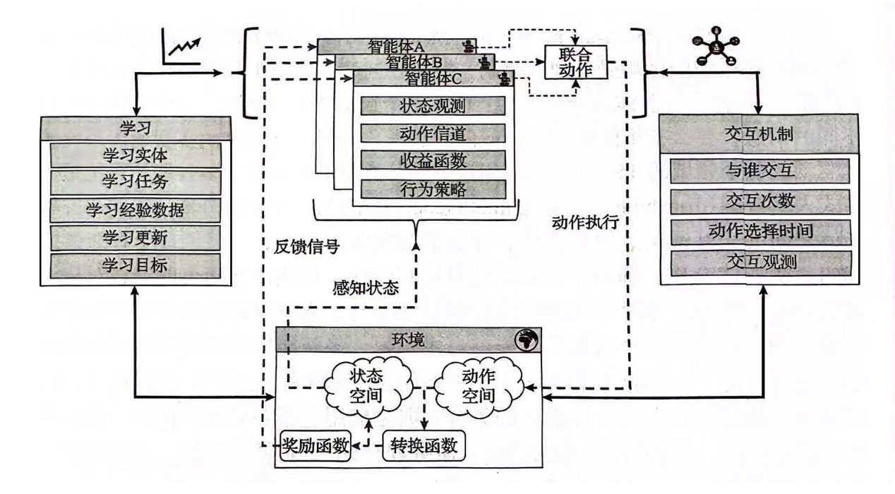
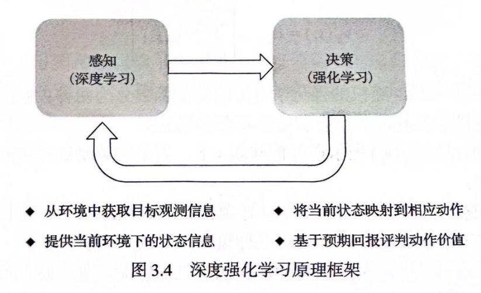
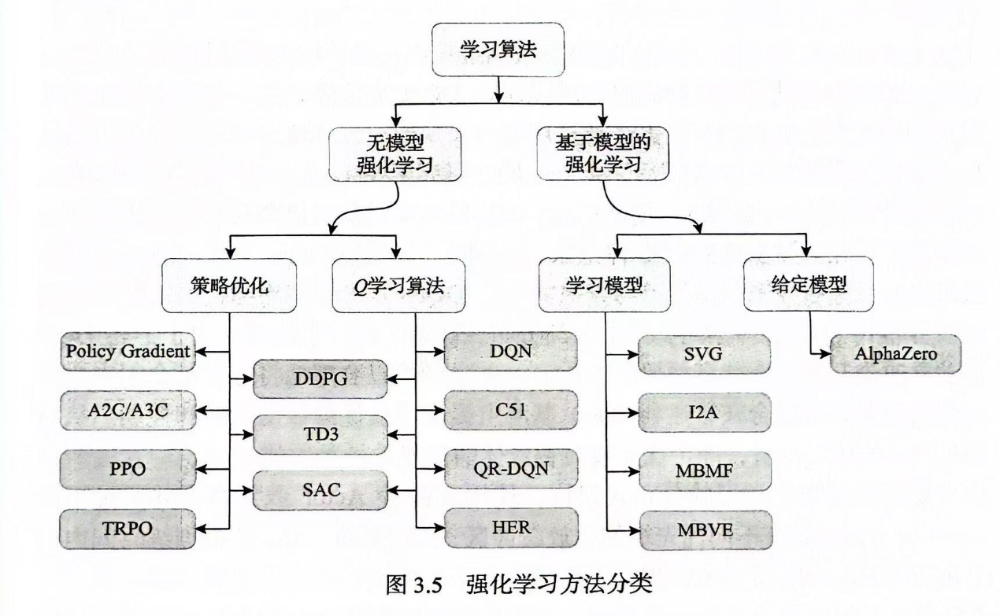
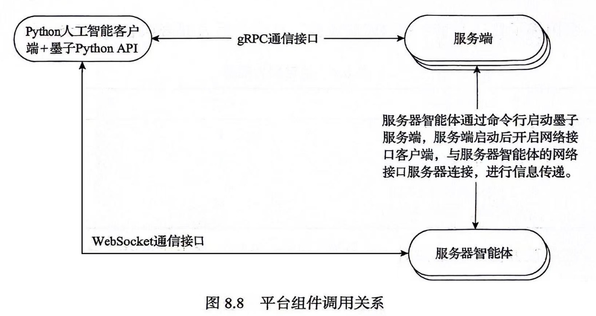
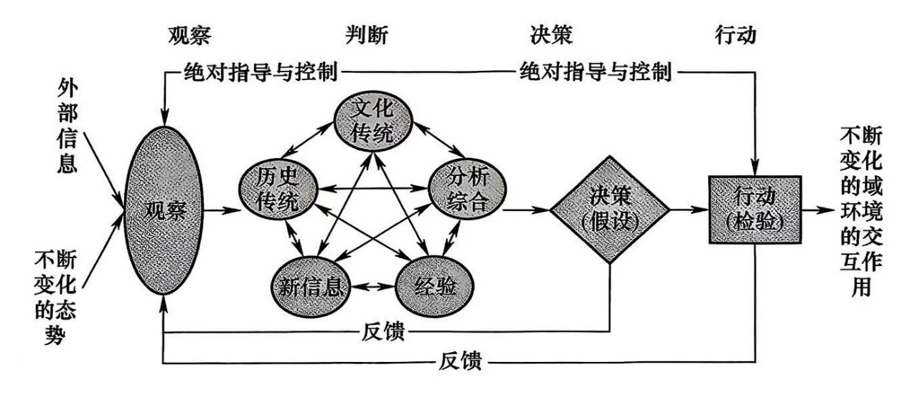
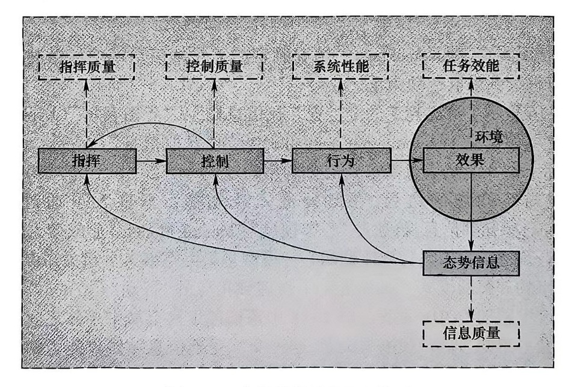
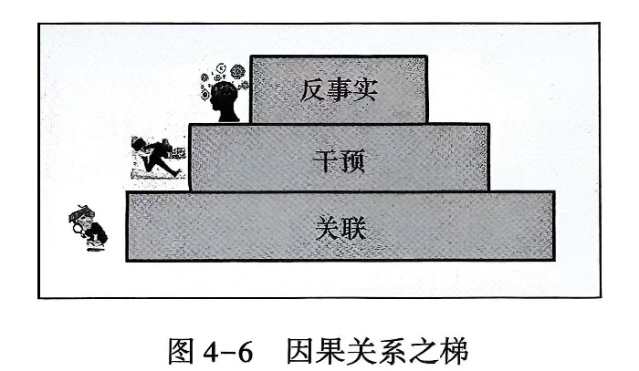
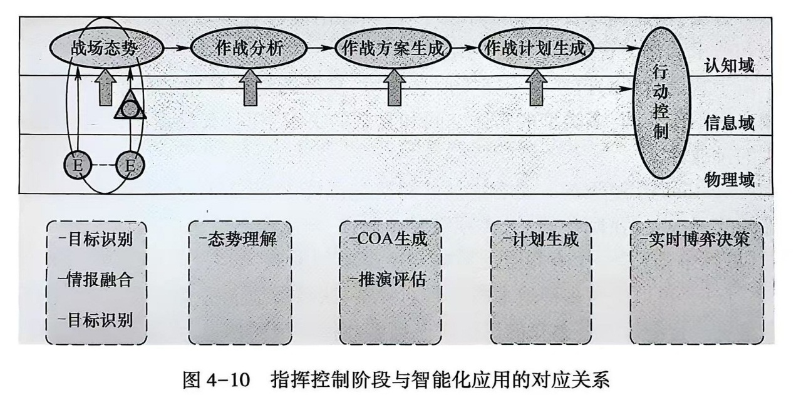

# 兵棋与智能博弈

【摘要】人工智能第三次浪潮推动了智能化战争的进程，也带来了智能博弈的研究热潮。在博弈论的基础上，学习智能博弈对抗和兵棋推演的相关概念。机器博弈成功的关键是高效的多智能体学习方法。随着无人集群的战术运用越来越普遍，对群体智能（或集群智能）的了解也非常必要。用人工智能来提升指挥控制效能，意味着智能化指挥控制将直接介入人的指挥中，涉及人类最复杂的、最高层次的思维活动，理解从智能博弈到智能指挥控制决策的挑战。

【关键词】 兵棋推演，博弈，智能体，群体智能

【参考书目】

▲曹雷 等著，智能化指挥控制理论与技术，国防工业出版社，2024.4

王蒙一，王晓东等，无人飞行器集群智能与协同控制，科学出版社，2024.1

▲张万鹏，罗俊仁等，智能博弈对抗方法与实践，科学出版社，2023.7

林旺群，刘波，智能博弈对抗理论与实践，兵器工业出版社，2024.1

黄金才，黄魁华等，智能博弈技术与应用，国防科技大学出版社，2023.10

汤再江，徐享忠等，战术兵棋推演理论与应用，兵器工业出版社，2022.11

\[美\]Eric Rasmusen著，韩松
等译，博弈与信息：博弈论概论（第四版），中国人民大学出版社，2017.7

\[美\]Adrian Barbu，朱松纯著，魏平
译，蒙特卡罗方法与人工智能，电子工业出版社，2024.1

------------------------------------------------------------------------

## 博弈论基础

### 概述

博弈论是在竞争或者合作环境下交互式决策的数学理论。交互式决策是关键特征，但是交互式决策论不等同于一般的决策论。决策是主体选择方案以使期望效用最大化的活动。

博弈是一种互动决策。当某一主体的决策与其他主体的决策产生直接相互作用时，称为"互动决策"或"博弈"。研究互动决策的理论称为"博弈论"，英文为"game
theory"。Game直译为"游戏"，指有一定规则的竞赛，如奥林匹克运动会（Olympic
Games）。

博弈论分析多人博弈的策略互动关系，并以此为前提分析参与人如何进行理性选择。博弈论的目的是研究这种互动关系中各参与人的"均衡策略"或其结局。所谓"均衡策略"，类似于数学方程组的解，它是所有参与人最优策略的集合。最优策略往往是相互依存的，因此大多数博弈局势不能单独求出某一方的上策。换句话说，在大多数博弈中，分析一方的上策时，需要同时求出另一方的上策。所有局中人上策的集合称为博弈的均衡策略。

博弈论是借助社会学科的研究发展起来的，经济博弈论是以经济策略关系为对象的博弈论。类似的，军事博弈论就是以军事策略关系为对象的博弈论，它分析军事斗争与合作的均衡策略和理性思维问题。

博弈论的一般理论属于应用数学学科。严格的讲，博弈论不是经济学或军事学的分支，它是一种方法，应用范围可以广泛涉及经济学、军事学、国际关系、政治学、伦理学等领域。因此，现实中的博弈论，比如军事博弈论或者经济博弈论，属于交叉学科。

军事博弈论是军事大系统运筹理论的要素之一。军事大系统运筹方法可分为两个大类：一是把决策因素作为客观环境因素来对待的决策方法，二是对军事主体之间的策略互动关系或能动性关系进行分析的博弈方法。

博弈"通解"的概念是纳什（Nash）在"纳什均衡"的定义中提出的。因此一般认为，现代博弈论是由纳什奠基的。纳什对非合作博弈的主要贡献是，他在1950年和1951年的两篇论文中定义了非合作博弈一般意义上的均衡解。纳什在1950年证明了有限博弈都存在均衡策略；在均衡点，所有的参与人选择这样一个行动：给定竞争对手的选择，这个行动对他们来说是最优的。纳什所定义的均衡解被称为"纳什均衡"，它揭示了博弈论与经济均衡间的联系。此后，现代博弈论以"纳什均衡"定义为基础发展起来。

"纳什均衡"概念是所有博弈分析的基础，但动态博弈分析需要以"纳什均衡"为基础引入新方法。对动态博弈分析贡献最大的莱茵哈德•泽尔腾，将"纳什均衡"的概念引入动态分析，提出了"子博弈精炼纳什均衡"概念。与此概念相联系的逆向归纳法，是分析完全信息动态博弈的一般方法。

不完全信息博弈是由海萨尼突破的。1967年，海萨尼把不完全信息引入博弈论的研究中，提出了被称为"海萨尼转换"的方法，解决了不完全信息博弈的求解问题，其解概念被称为"贝叶斯纳什均衡"。海萨尼还提出了混合策略解的不完全信息解释。海萨尼的成果构成了不完全信息静态博弈的主要内容。

因为对博弈论做出的突出贡献，纳什、泽尔腾、海萨尼三人获得了1994年诺贝尔经济学奖。他们都是数学家，用经济博弈模型来发展博弈论，使现代博弈论进入一个崭新、辉煌的发展时代。

### 博弈要素

博弈分析的五个基本要素包括：局中人、策略与行动、支付或效用、信息、结果和均衡。

1．局中人/参与人

参与人亦称局中人（player），是博弈中的决策主体，他通过选择行动或策略使自己的支付或效用水平最大化。参与人可以是个人，也可以是一个组织，只要他们能作为一个主体采取一致的行动并与外界进行策略互动。博弈分析至少要有两个以上的参与人。依据参与人的数量，博弈分为两方博弈和多方博弈。三个或三个以上博弈方参加的博弈为多方博弈。

多方博弈中策略和利益的依存关系较为复杂。对任一博弈方来说，其他博弈方不仅会对自己的策略做出反应，他们之间还有相互作用或反应。博弈矩阵一般适合表示两方博弈。超过三方的博弈，通常只能用函数式或数集表达。有限策略的三方博弈可用两个博弈矩阵合起来表示。

2．策略与行动

策略（strategy）也称计谋，是局中人相继决策的完整行动规则，它规定了局中人在相应信息下选择什么行动计划，是行动的规则。单个局中人的所有策略的全体称为这个局中人的策略集。策略与行动是博弈参与人的决策变量。

在静态博弈中，策略等同于行动。行动是参与人在博弈的某个时间节点的选择变量。在静态博弈中，没有人能获得他人的行动信息，策略选择就变成了行动选择。参与人的行动可能是离散的，也可能是连续的。

在动态博弈中，一个策略是参与人在每个决策点选择何种行动的一个规则，策略包括对方采取各种行动后参与人将要选择的行动。比如，"人不犯我，我不犯人；人若犯我，我必犯人"是动态博弈策略，"犯"与"不犯"是行动。策略规定了在什么时候选择什么行动，它包括各种可能选择的行动以及行动的前提。动态博弈中，策略作为行动的规则，必须完备，它要给出参与人在每一种可能情况下的行动选择，即使参与人并不希望这种情况发生。

一般地，如果一个博弈中各博弈方的策略数量都是有限的，则称为"有限博弈"；如果一个博弈中至少有一方的策略是无限多的，则称为"无限博弈"。在理论上，有限博弈总可以用矩阵法、扩展型法或罗列法将所有的策略、结果或得益列出；而无限博弈只能用函数式或数集表示。这使得这两种博弈的分析方法表现出很大的差异。此外，有限博弈和无限博弈对各种均衡解的存在性也有非常关键的影响。

3．支付或效用

收益（payoff）是指在根据特定的局中人策略组合得出博弈结果后各局中人所获得的收益或支付，用以描述博弈过程中局中人追求的主要目标，也是行动和策略选择的主要依据。收益可以用确定的数表示，利用"效用理论"相关知识进行表征，而不能用数字表示的安全感、荣誉感等，可以根据偏好关系进行比较。

支付也称为效用，是反映参与人对一个博弈结果满足程度的数字。支付或效用是博弈方选择行为的判据。在博弈分析中，直接用代价或得益数字来分析结果的方法称为基数法；用偏好的排序方法比较结果则称为序数法。用序数法分析，数值越小越应优先选择；用基数法分析，数值越大越应优先选择。分析不完全信息博弈要进行概率计算，这就需要使用基数法。为了前后一致，博弈分析一般使用基数法。基数法是一种"无量纲"方法，类似于打分方法，它是根据期望效用理论得出的。

4．信息

信息（information）是局中人有关博弈的知识，包括博弈的环境、参与人的特征、策略与行动、博弈的支付、"自然"的选择等知识。信息与收益（支付）关系密切。博弈论中关于"共同知识"的假设是指"所有局中人知道，所有局中人知道所有局中人知道，所有局中人知道所有局中人知道所有局中人知道......"的知识。层次嵌套式的"共同知识"表述一般用于描述所有局中人对某个事实都"知道"的关系。如果局中人对所有历史行动信息掌握得非常充分，这类博弈称为完美信息博弈，否则称为不完美信息博弈；如果每个局中人都拥有所有其他局中人的特征、策略及支付函数等方面的准确信息，这类博弈称为完全信息博弈，否则称为不完全信息博弈。

5．结果和均衡

博弈的结果和均衡。结果是所有博弈分析者感兴趣的东西。但博弈分析特别关注均衡策略、均衡行动以及均衡支付，即特别关注最可能出现的结局。均衡策略，是博弈各方最优策略的组合；均衡行动，是静态博弈中博弈各方最优行动的集合；均衡支付，是博弈各方最优策略或最优行动集合产生的支付。比如在一个策略组合里，我军的最优策略是"人不犯我，我不犯人；人若犯我，我必犯人"，在这个策略前提下，对方选择了对我"不犯"的策略，均衡是（"人不犯我，我不犯人；人若犯我，我必犯人"，不犯），这是指均衡策略；均衡结果是（不犯，不犯），这是均衡行动。均衡结果括号中前一个"不犯"是我方在对方"不犯"时的最优行动，而非最优策略。

### 基本假设

博弈论还有一个基本假设，即参与人是理性的，他们知道博弈规则。

理性假设是指，参与人有一个很好定义的偏好序，这个偏好序满足可加性、传递性等要求。在实际生活中，当面临多种选择时，我们需要有一个偏好序。对偏好排序后，我们能够判断不同选择满足参与人的程度，这需要用到偏好的简单传递性，例如，当进攻优于防御，而防御优于退却时，那么进攻也应优于退却。如果说他们是理性的，是因为他们能够选择满足自己偏好的最佳行动。此外，还假定参与人能够精确的进行推理和计算。

博弈论总是在一定的博弈规则假设下进行研究的。这些规则决定了参与人怎样在博弈中进行反馈。在策略互动的情况下，排除规则的经验性来源是不利的。有时单靠理性还很难得出确定可靠的预期。于是，许多应用博弈分析提出的关于策略行为规则的问题，只有将理论和经验知识结合起来，才能充分得到解决。实验博弈论的发展在一定程度上弥补了古典博弈论的缺陷，实验博弈是运用受控的、可观察的实验技术研究策略行为的一般性规则，并检验这些规则的真假。

### 相关概念

1．非合作博弈与合作博弈

博弈论主要分为两大领域，即非合作博弈理论与合作博弈理论。这两种理论的差别在于所使用的基本假设不同，即承诺的强制力不同，因此它们在研究方法和结论上存在较大差异。非合作博弈，追求自己稳定的最大利益；合作博弈，追求集体和个人利益的统一。其中非合作博弈通常可分为完全信息静态博弈、完全信息动态博弈、不完全信息静态博弈、不完全信息动态博弈等。合作博弈可分为可支付合作博弈、非支付合作博弈、策略型合作博弈等类型。

在非合作博弈理论中，决策主体根据利益最大化的原则来决定自己的选择，没有任何强制力量能够使他们遵守一个违背自己利益的承诺。例如，类似"如果你和我合作，那么博弈结束后我的收益给你一半"的承诺，在非合作博弈中没有效力，因为没有任何机制保证博弈结束后，局中人会按照承诺支付自己一半的收益。非合作博弈研究人们如何独立进行博弈决策，强调的是个人理性和个人最优决策。军事博弈，特别是作战博弈，大多属于非合作博弈。但在策略领域，谈判与结盟等合作博弈理论亦有用武之地。

合作博弈理论则假设如果参与人达成合作意向，他们的协议将是可强制执行的。在有强制力的情况下，如果达成合作意向，则合作是必然成立的。这时策略选择问题不是分析重点，重点是研究合作者如何选择收益总和最大的策略组合，以及人们达成合作后如何分配利益的问题，强调的是团体理性。

2．完全（完美）博弈与非完全（非完美）博弈

如果局中人完全了解所有局中人各种情况下的利益（支付），称此局中人具有完全信息，否则称局中人具有不完全信息。所有局中人均具有完全信息的博弈尔为完全信息博弈，至少有一个局中人具有不完全信息的博弈称为不完全信息博弈。在动态博弈中，若局中人完全了解自己行动之前的整个博弈过程，称局中人具有完美信息，否则称局中人具有不完美信息，所有局中人都具有完美信息的博弈称为完美信息博弈，至少一个局中人具有不完美信息的博弈称为不完美信息博弈。

3\. 静态博弈和动态博弈

若博弈过程中，所有的局中人都只有一次行为机会并且他们在信息意义下同时行为，则称此博弈为静态博弈。若博弈过程中，有些局中人有不止一次行为机会，或有些局中人在行为前能够预测到一些其他局中人的行为，则称该博弈为动态博弈。根据局中人对信息的掌握情况可分为完全信息静态博弈、完全信息动态博弈、不完全信息静态博弈、不完全信息动态博弈。

4\. 零和、常和与变和博弈

根据收益之和的不同，博弈可以分为零和博弈、常和博弈和变和博弈。其中零和博弈是指一方的收益（获得）与另一方的支付（损失）对应，即对任务策略组合，各局中人的收益之和为零。常和博弈是指对任务策略组合，各局中人的收益之和为一固定的常数。变和博弈是随着策略组合的不同，各局中人的收益之和也发生变化的情形。

5．有限理性与欺骗

一些新的模型考虑各类博弈模型的局中人模型与环境设置，如针对有限理性局中人有随机最优响应均衡模型、前景理论模型、Level-K
模型与认知层次模型、心智理论模型。同时，对抗双方的欺骗也得到了广泛关注，如基于多目标优化的有限欺骗模型、面向行动轨迹分析的多模态欺骗策略模型等。当前对相关欺骗的研究主要集中在信息网络空间上的欺骗。

6．博弈与决策

博弈论在运筹学领域也称对策论。运筹学包含最优化理论和博弈论两大方向的理论，其中最优化理论主要研究单方面决策，追求最优或次优解；博弈论主要研究多方交互决策，通常追求稳定最优解。决策理论曾经有四个分支：一是最优化决策，即单个个体如何在各种条件状态下进行效果最优的决策；二是不确定性决策，即局中人对一项活动最终到底会发生的结果不确定，同时也无法确定每一种结果发生的概率；三是风险型决策，即局中人对一项活动最终到底会发生什么结果不确定，但局中人知道共有几种可能的结果，以及这些结果的概率分布，而且局中人有着不一样的风险偏好，如风险厌恶型、风险中立型、风险热爱型；四是冲突型决策，即博弈论可以采用前三种类型相关的最优化决策、不确定性决策和风险型决策求解博弈解。

### 经典案例

学习现代经济学，绕不开**囚徒困境和纳什均衡**。纳什均衡又称为非合作博弈均衡，是博弈论的一个重要术语，以约翰•纳什命名。

如何理解"纳什均衡"？首先，预判是决策的基础。而在战略状况中，预判的对象是"对方将采取什么行动"。也就是说，

战略状况下的行动 = 对预判的最佳反应

预判 = 对方将采取什么行动

将上述两者组合，即

战略状况下的行动 = 对于对方将采取什么行动的最佳反应

上述公式表述的状态就是纳什均衡。（看上去十分简单，不是吗？事实上，纳什发表于1950年《美国国家科学院院刊》的论文全文只有1页）

所谓囚徒困境，即两个共谋犯罪的人A和B被抓，警察将他们隔离在不同的审讯室进行审问，A
和B不能互相沟通情況。然后警察分别对两个人说，如果你们两个都认罪，证据确凿，每人判刑2年；如果一个坦白、一个抵赖，坦白的被认为有立功表现而免受处罚，抵赖的因抗拒从严，判刑10年；如果两个都抵赖，那么由于证据不充分，每人判刑1年。

经济学中有一个理性人的假设，即人都是出于自己利益最大化而考虑。从A的角度，如果B选择坦白，A选择坦白判刑2年，选择抵赖判刑10年；如果B选择抵赖，A选择坦白免受处罚，选择抵赖判刑1年。所以从A的角度出发，无论B如何选择，A
选择坦白都是最优的。从B的角度来看也是同理。因此，最终博弈的结果就是 A
和B
都选择坦白，这就是纳什均衡。无论从个人还是整体的角度看，两个人分别从自己利益最大化的角度出发，最终却做出了最差的选择，可见纳什均衡点不一定是整体最优解。

### 军事博弈论

进入21世纪，以深度学习为代表的人工智能（AI）理论与系统在多个领域掀起浪潮，人类已经初步跨入智能时代。博弈论与智能的关系特别密切。博弈论刻画的是交互式决策，而人工智能最重要的使命是在互动中学习，所以二者在模型层面是相通的。博弈论中最重要的概念是稳定和均衡，而人工智能追求的目标是从海量数据中学习稳定的决策范式以及偏好或者知识，所以二者在概念层面也是相通的。当前，策略式博弈、扩展式博弈以及纳什均衡、子博弈精炼纳什均衡等已经在对抗型智能中得到广泛应用；沙普利值、核心等合作型解概念也与群体智能、体系评估等领域实现了初步结合。

当前机器学习大体上可以分为三个板块：监督学习、非监督学习和强化学习。三者之中，强化学习受到的关注最多，而其背后最重要的机理就是融合马尔可夫过程的博弈模型和纳什均衡的计算。当前学术界有一个共识，即刻画大规模智能体平均行为的平均场博弈、刻画群体演化稳定规律的进化博弈、刻画多类型不确定测度下行为的不确定博弈三类博弈模型理论是下一步人工智能数学机理的突破口。可以说，博弈论是智能时代背后最重要的数学机理之一。

信息化军事对抗是整个军事系统的多维对抗，指挥控制具有前所未有的意义。争夺控制权成为作战的核心目标。在信息化条件下，具有智能特征的军事博弈具有广阔的应用前景。

一是军事博弈论能用于分析各方的最优策略。在博弈局势中，各方的策略通常是相互依存的，有时是直接相互作用的。利用博弈论分析各方策略的依存关系，求解各方参与人的最优选择，有助于掌握策略互动决策的方法和规律。但博弈论与谋略学有所不同。谋略学文献如《孙子兵法》《三十六计》等，属于分析用兵谋略、指导人们如何运筹帷幄的理论，这种论证"应如何"或"怎么做"的理论称为"规范性"理论。博弈论属于分析博弈策略互动规律的理论，作为论证"是什么"和"为什么"的理论，它被称为"实证性"理论，它主要分析博弈者选择策略的主观规律，分析理性参与人如何做出选择才是最优的。作为实证理论，军事博弈论有较强的逻辑性和精密性，可以与谋略学相互印证。军事对抗模拟适当运用博弈方法，可以体现谋略思维的活力。

二是军事博弈论有助于增强局势预测能力。博弈论分析不同军事态势下各方的理性选择以及博弈的结局，并分析哪些博弈局势容易预测、哪些局势难以预测，这有助于我们了解什么样的博弈局势可预测以及如何预测。现实局中人决策时往往受价值、理念等因素影响，预测时要考虑当事人的理性和价值观等因素。

三是现代博弈论有助于在作战分析中引入谋略因素。古典博弈论分析零和博弈时使用单支付函数，假定双方都认为一方所得等于另一方所失，忽略了认知不一致的问题。在作战中一方所得与另一方所失有时可能相等，但双方的价值理念不同，判断也会不同。在双方看来，有时不是你得多少、我失多少。现代博弈论分析使用双支付函数，用不同的参数描述一个结局对双方不同的支付，这样使博弈论分析走出了极大极小算法的局限，使谋略应用更为广泛。

四是军事博弈论广泛应用在策略分析中。与古典博弈论只能进行零和博弈分析不同，现代博弈论可以进行非零和博弈分析。策略问题非常重要，甚至比作战问题还重要。

五是军事博弈论为优秀的兵法思想提供了理论支撑。军事博弈论从过去的纯数学推导中解脱出来，力求体现"数中有术"的谋略思想，它为我们理解毛泽东军事思想和《孙子兵法》等兵学宝库中的优秀遗产提供了有益的启示。

六是军事博弈论有助于完善作战推演系统。军事博弈论分析不同类型的军事博弈，运用相应的模型和定理，开发相应的软件，应用于静态和动态的、完全信息和不完全信息的军事博弈。军事对抗模拟推演系统体现动态博弈思想，使军事模拟训练与演习更具实战性和理论高度。

## 智能博弈对抗

### 内涵

智能博弈（intelligent
game），或者计算机博弈、机器博弈，即人工智能＋博弈。智能博弈是指利用人工智能技术进行博弈问题求解，其核心方法论是利用人工智能领域的搜索和学习技术替代传统数值优化计算，以解决高复杂度博弈场景中的快速求解问题。初始以下棋为主要研究形态，逐步扩展到竞技游戏、兵棋推演以及军事对抗。

1\. 计算机博弈

相对于真实世界问题，游戏世界的问题更易于形式化表达，因此便于进行相关人工智能技术的研究。计算机博弈即computer
games，也称为机器博弈，期初的研究只有棋牌类游戏，近年来的即时策略游戏也被纳入计算机博弈的范畴。计算机博弈通过人工智能程序的博弈对抗过程来理解智能的实质，是认识对抗决策智能的前沿研究着力点，是研究人类思维和实现机器思维最好的实验载体。计算机博弈的研究早期开始于跳棋，然后到国际象棋、再到围棋，近年来的探索和研究取得了大量成果。

下棋是人类的高级思维活动，是逻辑思维、形象思维和灵感思维的集中体现。因此，令计算机具有下棋的智慧，是一个挑战无穷、生机勃勃的研究领域，是人工智能领域的重要研究方向，也是机器智能、兵棋推演、智能决策系统等人工智能领域的重要科研基础。机器博弈被认为是人工智能领域最具挑战性的研究方向之一。

近代机器博弈的研究，是从20世纪50年代开始的。许多著名的科学家，例如数学家和计算机学家图灵、信息论创始人香农、人工智能的创始人约翰•麦卡锡以及冯•诺依曼等人都曾经涉足计算机博弈领域的研究工作，并为之做出非常重要的贡献。1958年，IBM公司推出的取名为"思考"的IBM704，成为第一台与人类进行国际象棋对抗的计算机。1959年，人工智能创始人之一的塞缪尔编写了一个能够战胜设计者本人的西洋跳棋计算机程序；1962年，该程序击败了美国的一个州冠军，这是计算机博弈历程中一个重要的里程碑。

20世纪80年代中期，美国卡内基梅隆大学开始研究世界级的国际象棋计算机程序；1988---1989年间，IBM公司的"深思"分别与丹麦特级大师拉尔森、世界棋王卡斯帕罗夫进行了"人机大战"。20世纪90年代，"深思"二代吸引了前世界棋王卡尔波夫前来与之对抗（1990年）。特别是"深蓝"（1996年）、"超级深蓝"（1997年）与卡斯帕罗夫的两场比赛，引起全球媒体的关注，计算机呈现出负少胜多的趋势，表现得越来越聪明。

经过多年对计算机博弈进行系统的理论研究，在国际象棋、中国象棋等棋种的人机大战中，从最初人类完胜计算机，到如今计算机击败人类顶级高手，计算机博弈水平迅速上升。特别是2016---2017年，AlphaGo
分别在与李世石、柯洁的人机围棋大战中取得了胜利，可谓人机对抗史上的最强之战，从而掀起全球人工智能的讨论、研究热潮。

2\. 人机对抗

人机对抗是指在强对抗博弈环境中，研究和探寻机器博弈问题中人工智能程序战胜人类玩家的方法。人机对抗是人工智能的试金石，从图灵测试开始，对抗人类智能一直是人工智能程序的智能水平衡量标准，其核心是以人机对抗的方式研究机器认知智能战胜人类智能的内置智能生成机理。但人机对抗仅是智能博弈的一种表现形式。

3\. 智能博弈对抗

智能博弈对抗问题是更为广泛的计算机博弈对抗问题，其主要对抗形式包括人机对抗、机机对抗、人机协同对抗等，其目的是为认知决策智能走上强人工智能之路找到新的途径。

智能博弈对抗是人工智能领域的一个重要研究分支，研究方法涵盖博弈论、强化学习、机器学习等多种理论。智能博弈对抗主要是以多智能体学习理论为基础，包括非完全信息动态博弈（可用于序贯交互式多方博弈过程的建模）和多智能体马尔可夫博弈（可用于同时行动多智能体协同对抗过程的建模）。

在理论研究上，智能博弈对抗技术在围棋、德州扑克、《星际争霸》等博弈问题上取得巨大突破，调赴了传统博弈论对于均衡的过分关注。强化学习、元学习、集成学习、迁移学习等新方法的引入，高效搜索、安全剪枝、并行优化、子博弈求解、自博弈等技术的发展，为解决复杂环境、超大规模、不完全不确定条件下的智能决策问题提供了有力的支撑。

在军事作战领域，智能博弈对抗是通过模拟战场环境进行战争推演、战争预测和战争学习的重要方法，可为指挥控制智能化设计、跨域无人集群协同对抗、多域协同防空、海上编队对抗等问题提供解决方案。

### 智能博弈分类

总体上看，智能博弈可以分为完美信息博弈、非完美信息博弈、随机性博弈等三个重要的研究方向，以下分别进行阐述。

1．完美信息博弈

完美信息博弈是指参与者能够获得其他参与者的行动信息，也就是说，参与者在做选择时完全知道其他参与者的选择。

小空间问题：中国象棋残局、西洋跳棋（Checker）博弈问题，都可以通过残局库的方法进行求解。

中等复杂度问题：中国象棋和国际象棋。中国象棋完整博弈树的节点数高达10\^150个。极大极小值搜索是解决中等复杂度完美信息博弈问题的基本算法。

高复杂度问题：围棋的复杂度远远超出中国象棋和国际象棋。目前采用基于上限置信区间（UCT）算法的蒙特卡罗树搜索算法作为程序主体。

2．非完美信息博弈

非完美信息博弈是指没有参与者能够获得其他参与者的行动信息。例如德州扑克（小空间问题），幻影围棋（高复杂度）。

3．随机性博弈

随机性博弈指的是在游戏过程中需要使用骰子来玩的游戏。此类游戏可以是完美信息的，例如爱因斯坦棋、西洋双陆棋；也可以是非完美信息的，例如军棋、兵棋。当前研究成果非常有限，相关搜索大多基于机器学习、统计学理论和蒙特卡罗树搜索算法。现有的随机博弈问题的研究仅局限于完美信息，对于更为复杂的非完美信息情况下的研究尚未开展。

### 另一种分类

智能博弈对抗研究包括三类：即时策略类对抗、序贯策略类对抗、军事仿真类对抗。

1．即时策略类对抗

《星际争霸》《刀塔》《雷神之锤》《王者荣耀》。

2．序贯策略类对抗

围棋，德州扑克，桥牌，国际象棋，中国象棋，麻将，斗地主。

3．军事仿真类对抗

模拟仿真技术开始只是为了方法验证，后来迁移到现实世界中，尤其是具有鲜明对抗特征的军事仿真类对抗场景中。世界军事强国提前布局了"深绿"（DeepGreen）、"洞察"（Insight）、高级机器学习概率编程（PPAML）、"心灵之眼"（Mind's
Eye）、指挥官虚拟参谋、"阿尔法"（Alpha）、"狗斗"（Dogfight）、"雅典娜"（Athena）、"指南针"（COMPASS）等研究项目。

深绿：2007年，美军启动了一项面向美国陆军、旅级的指挥控制领域研究计划，旨在运用计算机仿真技术，推演预测未来态势发展的多种可能，帮助指挥员提前思考是否调整计划，生成新的替代方案。包括"指挥官助手""闪电战""水晶球"三部分。该项目2011年中止。

阿尔法与狗斗：2015年，美国辛辛那提大学和空军实验室合作研发了一款智能空战AI程序"阿尔法"，在空战仿真环境中战胜人类退役的飞行员。2019年5月，DARPA启动"空战演进"项目，针对人机协同"狗斗"（视距内空战）挑战展开研究，开发可信、人类水平、AI驱动的空战自主能力。2020年8月，阿尔法狗斗试验开始进行，冠军AI模拟器最终以5:0击败了人类。

雅典娜：美海军陆战队正在研制"雅典娜"，一款专门用于训练、测试未来人工智能应用的推演平台，获取用于测试军事决策的AI应用程序的大量数据。它提供了一系列战争游戏，用于收集玩家数据，优化AI应用程序。

指南针：2018年3月，DARPA战略技术办公室发布了一项名为"指南针"的项目，旨在帮助作战人员通过衡量对手对各种刺激手段的反应来弄清对手的意图。

### 智能博弈发展

1\. AlphaGo

AlphaGo是由谷歌公司旗下 DeepMind公司开发的。2015年，AlphaGo
以5:0击败欧洲围棋冠军樊麾；2016年，它以4:1击败世界围棋冠军李世石；2017年，它又以3:0击败"世界围棋第一人"柯洁。AlphaGo
的胜利被誉为人工智能研究的一项标志性成果。

AlphaGo的胜利之所以引起轰动，是因为其与之前的胜利不同，其不仅是依赖强大的计算能力和庞大的棋谱数据库，还具备了深度学习的能力。AlphaGo
的成功归结于深度神经网络（deep neural network,
DNN）与蒙特卡罗树搜索（MCTS）算法的结合，使用蒙特卡罗树搜索算法进行虚拟，通过价值网络来评估棋局，并通过走子策略选择落点。

2\. AlphaZero

2017年10月，谷歌公司旗下的 DeepMind
公司公开了最新版本的AlphaZero，此版本在与2016年3月版的 AlphaGo
的对阵中取得了 100:0的战绩。在打败几乎所有高段位围棋专业选手后，DeepMind
开始进军象棋领域。

2017年12月，DeepMind在神经信息处理系统大会期间发布了AlphaZero，这是一个通用棋类AI，不仅轻松击败了最强国际象棋
AI和日本将棋
AI，而且能够在不依赖外部先验知识的情况下，在棋盘类游戏中获得超越人类的表现，仅仅以历史的棋面作为输入，训练数据全部来自自博弈，通过自博弈汲取经验知识来不断提高自身能力。

3\. AlphaStar

另一个人工智能体 AlphaStar 于
2019年登上历史舞合，它挑战的是《星际争霸2》的顶级职业选手。

众所周知，中国象棋、围棋的棋盘上可能出现非常多的情况，所以被称为"千古无重局"，其状态空间复杂度分别多达10\^48和10\^172。这一数字看上去已经十分巨大，但是还远不及即时战略（RTS）游戏，尤其是《星际争霸2》。它的状态空间已经不能用数字描述，可以说是"无穷大"（约为10\^1685），动作空间更是达到了指数级别。除了状态空间和动作空间的巨大，《星际争霸2》的难点还包括不完全信息，实时性与多主体博弈。

2018年6月，DeepMind公布了研究的最新进展，它们用关系性深度强化学习在《星际争霸2》的六个模拟小游戏（移动、采矿、建造等）中达到当前最优水平。终于，到了2019年1
月25日，AlphaStar
首次公开亮相，成为第一个打败《星际争霸2》顶级人类职业选手的AI。

**小结**

从 AlphaGo揭开人机大战的序幕，利用人类知识和规则做出决策，到AlphaZero
不需要人类知识，只需要规则就能学习自己的策略，再到 MuZero
在没有人类知识和规则的情况下，通过分析环境和未知条件来进行不同游戏的博弈，到最后的AlphaStar
在非完美信息博弈中取得成功，人类在 AI
的研发上取得了巨大的成功。但攻克《星际争霸2》是否意味着攻克了智能？答案是否定的。

自人工智能出现以来，人们对于智能本质是否可描述、可用数学刻画就有不同的观点。观点的分歧导致了两种截然不同的人工智能发展思路，即强人工智能和弱人工智能。前者强调需要弄清楚智能原理，而后者只要造出来的机器能够体现某种智能行为即可，比如下棋、驾驶、翻译、玩游戏等。在弱人工智能中，又可以分为通用和专用。通用是指要让造出的机器体现通用的智能，既可以用来下棋，又可以用来驾驶、翻译和玩游戏；而专用是指对每一种不同的智能行为打造专用的机器，如程序
A用来下棋、程序B用来驾驶等。AlphaGo、AlphaZero、AlphaStar
都属于专用弱人工智能，MuZero 属于棋类通用弱人工智能，而近年新兴的 GPT
系列模型可以进行诸如文本生成、问答和情感分析等任务，属于自然语言通用弱人工智能。由此可以看出，当前的人工智能发展主要面向专用弱人工得能，通用弱人工智能已见曙光，而强人工智能几乎没有革命性的突破。

## 多智能体学习方法

### 多智能体学习简介

多智能体系统（multi-agent system,
MAS）是由多个独立的智能体组成的分布式系统，每个智能体均受到独立控制，但需在同一个环境中与其他智能体交互。

Shoham
等将多智能体系统定义：包含多个自治实体的系统，这些实体要么有不同的信息，要么有不同的兴趣，或两者兼有。多智能体系统是分布式人工智能的一个重要分支，主要研究智能体之间的交互通信、协调合作、冲突消解等方面的内容，强调多个智能体之间的紧密群体合作，而非个体能力的自治和发挥。智能体之间可能存在对抗、竞争或合作关系，单个智能体可通过信息交互与友方进行协调配合，一同对抗敌对智能体。由于每个智能体均能够自主学习，多智能体系统通常表现出涌现性能力。当前，多智能体系统模型常用于描述共享环境下多个具有感知、计算、推理和行动能力的自主个体组成的集合，典型应用包括各类机器博弈、拍卖、在线平台交易、资源分配（包括路由、服务器分配）、机器人足球、无线网络、多方协商、多机器人灾难救援、自动驾驶和无人集群对抗等。

基于机器博弈（计算机博弈）的人机对抗，作为图灵测试的典型范式，是人工智能领域的"果蝇"。多智能体系统被广泛用于解决分布式决策优化问题，其成功的关键是高效的**多智能体学习方法**。多智能体学习主要研究由多个自主个体组成的多智能体系统如何通过学习探索、利用经验提升自身性能的过程。如何通过博弈策略学习提高多智能体系统的自主推理与决策能力是人工智能和博弈论领域面临的前沿挑战。近年来，伴随着深度学习（感知领域）和强化学习（决策领域）的深度融合发展，多智能体学习方法在机器博弈领域取得了长足进步。

多智能体学习是人工智能研究的前沿热点。从第三次人工智能浪潮至今，社会各界对多智能体学习产生了极大的兴趣。多智能体学习在人工智能、博弈论、机器人和心理学领域得到了广泛研究。面对参与实体数量多、状态空间规模大、实时决策巨复杂等现实问题，多智能体建模变得更加困难，手工设计的智能体交互行为迁移性比较弱。相反，基于认知行为建模的智能体能够从与环境及其他智能体的交互经验中学会有效地提升自身行为，在学习过程中，智能体可以学会如何与其他智能体进行协调，如何选择自身行为，学习其他智能体如何进行行为选择以及它们的目标、计划和信念等。

多智能体系统模型包含四个模块：环境、智能体、交互机制和学习。当前针对多智能体学习的相关研究主要围绕这四部分展开，如图所示。

<figure>
  
  <figcaption>图 9‑1 多智能体系统模型包含四个模块</figcaption>
</figure>

多智能体学习的主流方法主要包括强化学习、演化学习和元学习。

### 多智能体博弈学习简介

博弈论可用于多智能体之间的策略交互建模，近年来，基于博弈论的学习方法被广泛嵌入多智能体的相关研究中，多智能体博弈学习已经成为当前一种新的研究范式。

1．多智能体博弈基础模型

马尔可夫决策过程（Markov decision process,
MDP），常用于人工智能领域单智能体决策过程建模。基于决策论的多智能体模型主要有分散式马尔可夫决策过程和多智能体马尔可夫决策过程。从博弈论视角来分析，多智能体博弈模型分为两大类：随机博弈（sochastic
game, SG）（也称为马尔可夫博弈）和扩展式博弈（EFG）。

随机博弈模型可分为面向合作的合作博弈模型、面向竞争对抗的零和博弈、以及面向混合的一般和博弈模型。其中，合作博弈模型可广泛应用于对抗环境下的多智能体的合作交互建模，如即时策略游戏、无人集群对抗、联网车辆调度等；零和博弈与一般和博弈常用于双方或多方交互建模。

2．元博弈模型

元博弈（meta
game），即博弈的博弈，常用于博弈策略空间分析，是研究实证博弈理论分析的基础模型，目前已被广泛应用于各种采用模拟器仿真的现实场景，包括供应链管理分析、广告拍卖、设计网络路由协议、对抗策略选择等。

根据多智能体博弈对抗场景（离线和在线）的不同，可以将多智能体博弈策略学习方法分为离线博弈策略学习方法和在线博弈策略学习方法。

### 马尔可夫决策过程

在人工智能领域，不确定环境下的学习问题通常可以形式化描述为MDP。马尔可夫决策模型为解决不确定环境下的学习问题提供了坚实的数学基础和统一的理论框架。概括来说，MDP模型包括几个部分：环境状态集合、智能体动作集合、一个状态转移函数和一个奖励函数。

MDP求解方法包括策略迭代、值迭代和蒙特卡罗树搜索等。

蒙特卡罗树搜索（MCTS）在蒙特卡罗仿真的基础上结合最优优先搜索，解决最优决策问题。MCTS的核心思想是通过累计蒙特卡罗仿真的价值估计来评估搜索树上的状态节点，并不断扩展具有较高评估值的节点。MCTS结合了树搜索的准确性和随机抽样的普遍性。MCTS的成功主要取决于树策略。

### 强化学习

传统的人工智能主要有三个主义学派：①符号主义，又称逻辑主义或计算机学派，其原理主要为物理符号系统假设和有限合理性原理；②连接主义，又称为仿生学派，其主要原理为神经网络及神经网络间的连接机制与学习方法；③行为主义，又称为进化主义或控制论学派，其原理为控制论及感知-动作型控制系统。不同的学派中面临的主要问题不同，且处理方式也不尽相同。相比于符号主义学派，行为主义学派已经在研究领域中产生了一些很好的效果且设计比符号主义更好，但是由于没有特别的指导理论，难以产生复杂且高级的智能行为。连接主义是今天的深度学习系统的前身，但是这种方法也面临着一些难以解决的问题。

与传统的人工智能研究逻辑和语义的思想不完全相同，强化学习方法以MDP为模型并以贝尔曼最优方程为求解方法。其目的就是最大化累计奖励的同时最小化估计值函数与真实值函数之间的差距。基于这个初衷，强化学习方法不断改进智能体在不同状态下选择动作的策略来达到这样的目的。强化学习能够在具备部分感知环境的情况下做出合理的决策。近年来，深度强化学习已然成为人工智能领域解决问题的一个重要方法。强化学习方法的灵感源自心理学和人工智能中的行为主义。在环境给予奖励值或者惩罚值时，做出合理的决策来积累正向奖励而避免负向奖励，从而逐渐形成对环境的反应，即策略。这种策略最终能够指导智能体做出获得最大利益的行为。

作为机器学习除"监督学习"和"无监督学习"之外延伸出的一个重要分支，基于MDP
模型的"强化学习"受到了研究者的广泛关注。强化学习与生物学习有着类似的过程。当人们思考学习的本质时，首先想到的是通过与环境交互来学习。在人们的生活中，这种交互无疑是环境和自身知识的主要来源。无论是学习汽车驾驶还是与他人进行交谈，人们都敏锐地意识到交互的环境如何响应自己的行为，并试图通过行为来影响所发生的事情。从交互中学习是几乎所有学习和智能理论的基本思想。

强化学习最早由Thorndike在1898年提出。术语"最优控制"在20世纪50年代后期开始使用，用于描述设计控制器以最小化或最大化动态系统随时间变化的行为问题。解决这个问题的方法之一是由贝尔曼等在20世纪50年代中期提出的。该方法使用动态系统的状态和值函数或"最优返回函数"的概念来定义函数方程，现在通常称为贝尔曼方程。通过求解该方程来解决最优控制问题的方法称为动态规划。1992年，Watkins
等将控制优化领域的理论方法，如贝尔曼方程、MDP与时序差分方法相结合，提出了强化学习领域最经典的方法，即Q学习。

典型的强化学习问题需要满足三个条件：①不同的动作产生不同的奖励；②奖励在时间上具有延迟性；③某个动作的奖励值和具体所处环境有关。

### 深度强化学习

传统Q学习已经广泛运用在真实世界问题中，但是它的短板也很明显，它很难解决复杂的高维度问题。因为，普通的Q学习方法通过表格维护所有动作和状态值。但是随着环境和动作的维数增加，使用表格维护值函数变得不现实。深度学习具有较强的感知能力，但是缺乏一定的决策能力，而强化学习具有较强的决策能力，但对感知问题束手无策。因此，将两者结合起来，优势互补，能够为复杂状态下的感知决策问题提供解决思路。将具有感知能力的深度学习和具有决策能力的强化学习紧密结合在一起，构成深度强化学习（deep
reinforcement learning，DRL）方法，其原理框架如图所示。

<figure>
  
  <figcaption>图 9‑2 深度强化学习原理框架</figcaption>
</figure>

2015年，DeepMind将深度学习方法与传统的强化学习方法结合，提出了深度Q学习方法。这种方法取代了传统用表格维护值函数的思想。通过深度神经网络的表征能力，在一定程度上缓解了传统强化学习方法存在的维数灾难问题。在此之后，深度强化学习就成为目前AI发展的一个非常重要的方法。

深度强化学习的分类法与传统强化学习类似，根据有无模型信息（即状态转移概率）或是否学习模型信息，可分为无模型强化学习与基于模型的强化学习，根据策略的更新和学习方法，强化学习可分为基于值的强化学习和基于策略的强化学习。基于值的强化学习或基于策略的强化学习都可以与无模型强化学习或基于模型的强化学习相结合。无模型深度强化学习在之前被广泛研究，而基于模型的强化学习则是在
AlphaGo取得成功后开始获得更多的关注。无模型强化学习通常可以得到更好的渐近逼近性能，而基于模型的强化学习通常有更好的样本效率。OpenAI从模型的角度给出了强化学习方法的分类，如图所示。

<figure>
  
  <figcaption>图 9‑3 强化学习方法分类</figcaption>
</figure>

1．无模型强化学习

深度强化学习的发展仍处于起步阶段。大多数强化作业都是基于无模型的方法。无模型强化学习可以通过大量样本估计智能体的状态、值函数和奖励函数，以代化动作策略，旨在通过执行状态中的动作获得更多的奖励。

深度Q网络（deep Q-network,
DON）是深度强化学习的典型代表，使用卷积神经网络（CNN）作为模型，并使用Q学习的变体进行训练。DQN
使用最大Q值作为低维动作输出来解决高维状态输入的表示。此外，DQN
将加成值和误差项降低到一个有限的区间，从而减轻了非线性网络所表示的值函数的不稳定性。2015年，谷歌旗下的DeepMind公司提出的DQN取得成功后又掀起了对值函数强化学习方法研究的热潮。

2．基于模型的强化学习

基于模型的强化学习方法是从最优控制领域发展起来的。通常，特定的问题是由高斯过程和贝叶斯网络等模型产生的，然后通过机器学习方法或最优控制方法来解决。与无模型强化学习方法相比，基于模型的强化学习方法以一种数据效率高的方式学习值函数或策略，不需要与环境进行连续交互。然而，它可能会受到模型识别问题的影响，并导致对实际环境的不准确描述。

## 兵棋智能博弈

人工智能技术在围棋、德州扑克、桥牌、《星际争霸》等边界确定、规则固定的对抗博弈领域不断取得突破，为求解多智能体对抗博弈问题带来了曙光。但不同于普通的即时策略对抗游戏，兵棋推演问题是直接对战争的模拟，其推演和博弈过程有着极大的不确定性和未知性，多兵种协同与环境耦合的问题凸显，且战争系统有强非线性和高动态等复杂特性，解析计算利随机逼近最佳策略都存在巨大挑战。

### 兵棋推演基础

**1．定义**

兵棋起源于东方，发展于西方。19世纪，兵棋诞生于普鲁士，被命名为"Kriegsspiel"，即德语"战争游戏"的意思。后来军用兵棋传入英国、意大利、法国、俄国等。1883年美国少校沃默尔将兵棋介绍到美国，并出版了*The
America Kriegsspiel* 一书。英语把Kriegsspiel翻译为"war game"，即"兵棋"。

"兵棋"这个词在我军的相关书籍中并不少见，但对其内涵的认识却各不相同。

1986年出版的《现代兵棋对抗》："兵棋，是为作战、演练而制作的可移动的队标、标号和人员，兵器模型，是实兵的缩影。""兵棋对抗演习，就是红、蓝两军以活动队标或模型为棋子，以沙盘或磁性图板为棋盘，按照想定设置的情况进行战术模拟训练的一种方法。它是由棋子在棋盘上的不同位置（表现形态）反映出红、蓝两军的基本态势。通过棋子的移动变化体现各个战斗时节，敌我双方指挥员的决心处置，指挥手段和部分队战术行动，以此诱导受训者进行对抗，达到训练目的。"

1997年版《合同战术对抗训练理论与实践》："兵棋对抗，是对抗双方以活动队标和模型模拟实兵实装，根据导演提供的初始战术情况，在沙盘或地图上组织实施的互为作业条件的对抗演练。"

1997年版、2011年版的《中国人民解放军军语》写入了"兵棋"的概念，将其定义为"供沙盘或图上作业使用的军队标号图形或表示人员、武器、地物等的模型式棋子"。这说明当时仅仅是把兵棋当作是一种棋子，而不是部队训练的新方式和检验战法的一种新工具。

国内部分将"兵棋"视为"模型式棋子"的观点值得商榷。

兵棋与其他棋类（围棋、象棋）最大的不同在于，其他棋类是完全信息条件下的对抗，即选手对对方的棋子及其位置一目了然；而兵棋则在非完全信息条件下对抗，即对手往往会利用地形进行隐蔽和伪装，伺机出击。因此，兵棋推演时，往往需要三个屏幕，分别展现蓝方态势、红方态势和导调态势。

所以，兵棋是使用代表战场的棋盘和代表军事力量的棋子，依据战争经验总结出的规则，对作战过程进行对抗推演的工具。

兵棋首先是一款作战模拟工具，这种模拟工具与其他作战模拟工具的区别在于其用棋子（算子）表现作战单位，用棋盘（分格地图）表现战场，用棋子在棋盘上的移动表现作战行动，行棋的规则是根据战争经验以及战场事件发生的概率而编成的裁决表，裁决方法是通过生成随机数和在裁决表中查询事件结果。兵棋推演是对抗双方或多方运用兵棋，按照一定规则，在模拟的战场环境中对设想的军事行动进行交替决策和指挥对抗的演练。

**2．兵棋的基本构成**

兵棋首先是棋，具备棋盘、棋子和规则等要素，但这些要素都要比普通棋类复杂得多。

（1）兵棋棋盘（地图），兵棋推演的模拟战场。棋盘是兵棋推演的战场环境，一般划分成六角形网格，六角格对边长度代表空间分辨率，例如，陆军分队战术兵棋1格一般代表50m、100m
或200m，通过网格数量可直观判断空间距离；每个网格用横纵坐标唯一标注，对战场空间进行定位；每个网格标注对应高程值，并用颜色表示地形的高低起伏，一般颜色越深，表示地形越高，颜色越浅，表示地形越低；并填充影响作战行动的丛林、居民地、道路、河流、湖泊等地物。

（2）棋子（算子），兵棋推演的作战力量。棋子是对参战力量的模拟，例如，陆军分队战术兵棋，棋子粒度可以是单车、单个班组，也可以是排。棋子具有侦察、机动、火力、防护等各种相应的战斗力值。

代表兵力单元的算子通常包括三个要素，一是兵种及装备型号；二是编制序列，三是作战能力值。

（3）兵棋规则。相比象棋、围棋等棋类游戏，兵棋规则复杂的多。兵棋规则是对作战经验的高度提炼和总结，是兵棋中最核心的要素，分为作战规则、裁决规则和推演规则。

**3．兵棋推演定义**

推演是军事训练的方法，是按照行动顺序和进程进行的演练。

2011年版《军语》关于兵棋推演的定义如下：兵棋推演（war
gaming），是对抗双方或多方运用兵棋，按照一定的规则，对军事行动进行交替决策和指挥对抗的演练，分为手工兵棋推演与计算机兵棋推演。这个定义基本得到部队和兵棋领域学术界的认可。

手工兵棋推演一般采用回合制，推演者以"交替决策"的方式进行。每一回合代表一定的作战时间，例如，陆军分队战术兵棋，一回合可以代表30s\~5min
不等。

手工兵棋规则开放、数据透明、推演直观，对初学者来说，更利于掌握兵棋推演的原理，缺点是推演耗时，不便于大规模组织。

计算机兵棋则有回合制和实时制两种推演机制，根据不同的应用需求，有的计算机兵棋同手工兵棋一样，采用回合制。有的计算机兵棋推演则采用实时制（即时制），按实际作战进程和仿真事件调度机制，双方同时推演、同步决策和指挥控制。

**4．兵棋推演与作战模拟的关系**

兵棋推演是作战模拟方法之一，《军语》中作战模拟的定义如下：

作战模拟（warfare
simulation）是按照已知的或假定的情况和数据对作战过程进行的模仿。分为实兵演习模拟、沙盘或图上作业模拟、兵棋推演模拟、计算机作战模拟等。

广义的作战模拟，泛指所有模拟作战行动过程的方法与工具，从最初的沙盘推演、实兵演习，到采用数学解析方法和专家推演，再到基于现代计算机技术的分布交互式作战仿真、解析模拟、虚拟现实等方法和手段，都是作战模拟推演的范畴。兵棋推演只是使用兵棋工具进行作战模拟，因此，是作战模拟的方法之一。从这个角度讲，兵棋推演与作战模拟的关系是被包含的父子关系。

军队广泛使用的"计算机作战模拟系统"实际上是基于计算机技术，以运筹学、建模与仿真技术基础，以模型描述兵力单位作战能力与交战结果的计算机作战仿真系统。从这个角度讲，"计算机作战模拟系统"实际上也是作战模拟的方法之一，与兵棋推演是并列的"兄弟"关系。只是，由于"计算机作战模拟系统"在我军发展较早，已经取得了较多的成果，在没有其他"作战模拟系统"发展的背景下，它在一个较长的历史时期成为军队作战模拟的标志性符号。

兵棋推演与现代"计算作战模拟系统"并不是对立的关系，而是既有区别又有联系。从设计与使用主体上看，兵棋推演是以偏向军事人员理解为主的作战模拟方法，而计算机仿真系统则是偏向技术为主的作战模拟方法。计算机模拟（仿真）系统设计与研制方一般是研究所或院校，使用与维护也是部队的信息系统保障部门或技术人员。兵棋推演系统对我军当前来说还是一个新事物，难以避免需要由相关研究所和院校先期进行研制，但一旦交付部队使用后，军事人员很快就能够成为系统使用和维护的主体。

国内存在作战模拟与兵棋推演翻译混用的问题。现代意义上的兵棋---德语"Kriegsspiel"，是1811年普鲁士的宫廷战争顾问巴龙•冯•莱斯维茨发明的，英语译为"war
game"或war
gaming等，中文字面意思为"战争游戏"；1883年传入日本，被译为"兵棋演习"。

国内"war
gaming"翻译五花八门，翻译为"战争游戏""图上推演""博弈""演习""作战模拟""兵棋推演"等。

我军的计算机作战模拟是由著名科学家钱学森和王寿云最早介绍并开创的，当时就是他们将"war
game"译成了"作战模拟"，因此，"兵棋"与"作战模拟"从广义上讲，实际上是同一个东西。

钱学森等于1982年12月出版的《论系统工程》著作中，对作战模拟定义如下："在以沙盘、地图表示地形地貌，以标示器表示军队和武器配置的战场棋型上，利用反映实战条件约束的若干行动规则，扮演交战双方的指挥官和参谋人员以下棋方式进行策略运筹的对抗。"这里以"下棋方式"进行对抗，实际上指的就是兵棋推演。

我们认为"war game"与"wargame"（分写与连写）没有本质区别。

**5．兵棋与人工智能**

人工智能第三次浪潮推动了智能化战争的进程，未来战争到底怎么打，人工智能提供何种程度的辅助决策，不能凭空想象。当前最常用的辅助筹划和决策工具是兵棋，兵棋推演是种利用兵棋进行战争预实践的平台，也是研究、应对、设计和实践未来智能化战争的有效手段，受到各主要军事强国的高度重视。指挥员在内嵌规则的智能兵棋系统中根据想定来设计对手并模拟推演，开发作战概念和作战样式，评估作战方案，提高指挥训练能力。

兵棋系统伴随着信息技术的不断进步发展。1811年，手工兵棋开始出现，主要利用指挥员总结的经验和规律进行推演分析，是作战推演早期简单的推演工具。随后逐步衍生出第一代兵棋系统，其形式主要表现为棋盘、棋子和规则，固定的作战地域，以陆、海、空为主的作战行动，对弈双方通过"回合"完成全部推演过程，并通过规则表和骰子来决定推演的走向及结果。二战结束后，计算机的出现，使得兵棋推演平台发生了变化，第二代兵棋系统，即计算机兵棋开始出现，依托计算机强大的计算能力和基础数据，以"数学模型＋程序计算"为核心，基本实现对作战全要素和全过程的模拟。经过几十年的发展，计算机兵棋系统与实战演练及训练的深度融合形成用于现代化战争的智能兵棋推演系统，推动实时战争模拟的长足进步，并为作战决策、实战训练和军事教育提供有力支撑。智能兵棋推演系统中融入计算机仿真技术，吸收武器装备仿真的最新理论和方法，融合现代作战模拟仿真和通信手段，所模拟的实体、行动及效果越来越逼真，系统功能更加完善、计算更加准确和智能。

目前的智能兵棋系统具有功能完善、计算准确、模拟逼真、支持多种推演方式等功能。例如，墨子联合作战兵棋推演系统具有想定管理与编辑、指挥控制、态势显示、统计分析、数据采集、效能分析评估工具、基础数据管理工具和人工智能开发接口等功能模块，系统十分完善。其还支持联合作战背景下航空装备参与制空作战、反水面作战、对地打击作战、反潜作战、两栖投送和登陆作战等多种作战样式的想定设计和仿真推演。

计算机兵棋对抗与即时策略游戏（如《星级争霸》）并无本质区别，都是对真实场景进行简化，将作战单元作为执行器，执行所有具体命令。其作战目标都是在规定时间内，通过摧毁敌方单元、保全己方单元来获取更高的得分。

### 战术兵棋推演原理

兵棋推演是一种作战仿真方法，属于仿真科学与技术在军事领域的应用。陆军战术兵棋推演以相似性原理、蒙特卡罗法、作战建模原理、作战仿真活动为基本理论。

兵棋本质上是一种作战模型，与一般的计算机作战模型相比，兵棋在实体、时间、空间上分辨率较粗，棋盘、棋子和规则无不如此；而兵棋推演本质上是作战模型的时域运行，即一种人在回路的作战仿真活动，与一般的计算机作战仿真相比，兵棋推演更为强调参与者的主观能动性。因此，战术兵棋推演直接以作战建模原理、作战仿真活动基本理论。具体来说，战术兵棋的建模原理可概括为"两个转换"，即"将武器装备受战场环境的影响转换为推演规则，规范双方对抗条件"，"将各种武器装备的战技指标转换为裁决表，支持公正的裁决"。战术兵棋的作战仿真活动主体为蒙特卡罗仿真，可以体现战场上各种事件以及行动结果的随机性。

同时，作战建模活动、作战仿真活动又分别以相似性原理、蒙特卡罗法为底层理论支撑。实际上，所有的建模均须遵循相似性原理，依据相似性原理可派生出战术兵棋的上述"两个转换原理"。在计算机的大力支持下，蒙特卡罗法则是得到广泛应用的一种现代科学研究方法，在高维度、非结构化问题领域的应用尤为广泛和有效。

蒙特卡罗法也叫"统计试验方法"，有时也称为"随机仿真方法"。蒙特卡罗法以概率统计理论为其主要理论基础，以随机抽样（随机变量的抽样）为主要手段。蒙特卡罗法是一种采用随机数模拟偶然性因素，利用与待解问题具有相同概率特性的随机试验，进行统计分析的方法。

蒙特卡罗法仿真作战过程的思路：将所要描述的战术现象分解一系列的基本活动和事件，如机动、搜索发现目标、射击、命中、毁伤等，然后用随机性的方法模拟具有统计特性的各项基本事件和活动，最后按事件或活动的逻辑关系把它们组合在一起，从而达到仿真作战过程的目的。

蒙特卡罗法用随机数来模拟作战过程中的随机因素，能充分体现随机因素对作战过程的影响和作用，更确切地反映出作战活动中的动态过程。

随机数产生，最简单的方法就是掷骰子。骰子是兵棋推演的一个重要因素，自兵棋产生以来，一直是用来模拟战场随机性的重要工具，但是，由于它与传统赌具相同，因此，在军队进行推广时经常受到质疑，并因此使兵棋推演的科学性受到质疑。骰子在兵棋推演中的作用就是产生随机数，并以此模拟战场上的随机事件。

传统上，手工兵棋通过同时掷两个骰子，生成\[2，12\]的整数随机数来辅助裁决。计算机兵棋，则多采用区间（0，1）均匀分布随机数来仿真这个问题。

从现代兵棋诞生开始，骰子、裁决表就成了兵棋的必备要素。骰子实际上是表示随机数，但是掷骰子多少有运气的成分，计算机生成随机数也具有偶然性。那么，骰子真的能决定一次交战的结果吗？

兵棋中充满各种随机事件，而兵棋正是利用这种随机性以及对手的主观能动性来训练指挥员的指挥能力。实际上，兵棋中各种随机事件的发生要服从一定的统计分布规律。在样本数量较少的情况下，统计结果可能与理论结果出入较大。但是在样本数量足够大时，统计结果会非常接近理论结果。

因此，兵棋中交战的结果，不是由骰子决定的，而是由裁决表决定的。而由兵棋的原理可知，裁决表又是根据对抗双方装备的战技性能来决定的。

蒙特卡罗法能充分体现随机因素对作战过程的影响，反映出作战活动中的动态变化，特别适合用于随机因素较多的问题。研究经验表明，过程中的随机因素越多，就越适合采用蒙特卡罗法。作战过程当中的目标发现与识别、瞄准误差、射弹散布、命中概率均具有随机性，且服从一定的概率分布。兵棋也正以这种随机性来训练和考验选手的应变能力。此外，兵棋推演是典型的不完全信息下的对抗性博弈活动，选手有必要建立博弈思维，理解每个作战方案的收益及潜在风险。

### 关键技术

在计算机博弈中，知识驱动的方法通常是研究初期的首选路线，兵棋 AI
的开发也进行了类似的尝试。通过理解兵棋设计者或指挥员的知识和经验，抽取作战规则、条令条例等非结构化信息，建立结构化数据库，让AI按照确定性规则或依照某一概率分布进行推理决策，能够实现初步的自主决策。知识库的完备程度越高，自主决策能力越强。在解决决策规则表示和专家样本生成问题的前提下，基于规则推理、案例推理、模糊推理、集成推理等推理机的指挥决策模型，应用在以局部战斗为特点的小型推演中，可以基本满足作战仿真对抗的指挥决策需求。

但知识驱动的方法缺点十分明显，即使不计知识提取的艰难过程和其中的各项成本，仅靠机械、教条的规则，难以归纳指挥决策的复杂思维规律，也无法应对规则之外的情形。再者，知识驱动推理型
AI
的上限是指挥员（领域专家）的个人经验，难以超越人类的智力水平，缺点是容易被对手发现利用。因此，知识驱动的兵棋AI
往往成为AI水平测试的比较对象。

随着机器学习、大数据的发展，兵棋研究也从以知识和推理为重点，转向以学习为重点。机器学习模拟指挥员的学习工作方式，依靠算法和强大的算力，从海量数据中学习知识。不仅灵活性高，数据学习型AI可以通过不断优化学习，探索未知战术战法，展示出一定的智能性。

数据学习型兵棋 AI
是基于大量数据及与环境的交互，通过深度学习、强化学习等方式不断学习训练得到的决策模型。因此，数据生成、采集和存储尤其关键。秉着可重用、可扩展、高性能、完备性、再获取易用性和安全性的仿真数据采集原则，按照上游、下游、中游、主动、被动、同步、异步等多种采集模式，需要合理的采集机制，才能在大型兵棋推演系统中，既保证足够的数据而又不给系统带来过多的性能压力。在获得高质量数据的基础上，融合多模态数据，充分挖掘数据背后的潜在规律，立足多源数据的层次化态势理解，推动对抗决策与行动规划。通过无监督学习、有监督学习和半监督学习等方式处理数据，为解决数据智能中的"感-知"环节提供支撑。

借鉴作战指挥结构天然的层次性特点，面对兵棋推演中超长视野的复杂决策和众多智能体分工协作，兵棋对抗决策方法分为宏观动作（多任务协作）和微观动作（战术机动决策）。宏观动作和预设的硬编码规则（行为树）有效避免了学习算法陷入微观决策中，同时压缩了动作空间，使强化学习产生高层对抗策略成为可能。层次化的学习架构来源于作战分层指挥分域控制原则，为基于深度强化学习的对抗策略优化提供启发。

### 常用多智能体算法

多智能体系统作为一种群体智能的体现方式，十分适合兵棋推演智能的需求，容易适应兵棋推演系统中复杂的决策环境，目前的研究偏重决策模型协同框架、协作关系建模、智能体内部决策建模。主要介绍异步优势
A3C算法、分布式近端策略优化算法和基于
MAXQ分层强化学习的行为树多节点优化算法等多智能体算法。

1\. A3C算法

A3C算法可以创建多个并行的子线程，每个子线程中管理一个
Actor-Critic学习器和环境交互学习、互不干扰。子线程与主线程中的网络结构相同，子线程计算出来的梯度用来更新主线程网络，更新后再将参数同步给子线程上的网络。更新的相关性降低，收敛性提高。

2\. 分布式近端策略优化算法

分布式近端策略优化（DPPO）算法是一种同步并行的近端策略优化算法，这里先简要介绍
PPO
算法。PPO是一种策略梯度算法，借鉴自置信域策略优化（TRPO）算法，使用一阶优化，在采样效率、算法的表现上，以及实现和调试的复杂度之同取得新的平衡。PPO
算法会在每一次迭代中尝试计算新的策略，以使损失函数最小化，并且控制每一次新计算出的策略和原策略的"距离"。PPO算法包含三个网络：一个评价网络，两个策略网络。参数更新过程与策略梯度类似，不同的是评价网络和策略网络会对采样一个批次的数据进行多次学习。

DPPO算法通过多线程方式更新网络参数，算法框架中含有一个主线程和多个子线程。多个子线程并行运行，从而达到分布式计算的目的。全局只有一个共享梯度区和共享PPO模型，而不同的子线程还有自己的局域PPO模型和局域环境。DPPO算法将网络参数存放在一个服务器上，并且在每一个梯度步长后同步的更新子线程参数，将PPO算法组装起来，共同实现强化学习任务。

3\. 基于MAXQ 分层强化学习的行为树多节点优化算法

（1）行为树

在任务规划中，传统的有限状态机（finite state machine,
FSM）最为经典，但需要转换连接状态，失去了模块性。而行为树作为替代有限状态机的方式具有可重复性和可适应性，完美地替代了有限状态机的不可重复性，成为当前机器人软件开发的主流方式。行为树是一棵具有层级结构的树，主要用来控制智能体的决策，树的末端（动作节点）就是智能体实际要去做的事情。连接叶子节点的每一个树权（组合节点），决定了一个行为树如何从根节点连到某一个动作节点，并执行相应的命令操作。

（2）基于Q学习的行为树选择节点优化

行为树的选择节点本质上描述了一组针对节点所对应任务的决策规则，即按照从左到右的优先级执行可选择动作。其中所隐含的专家经验是，在大多数状态空间下，优先级越高的动作具有越高的效应值。学习中考虑更详细的不确定战场环境态势，刻画不同战场态势和可选择动作之间的决策映射关系，且决策过程通常考虑执行动作后的长远效益。该学习任务是一个典型的强化学习任务，通常被描述为MDP。

。。。。。。

如果学习任务的评估函数不变，那么对于内部结构不变的行为子树，该子树所代表的子任务的评估是不变的且可以重用的。这样，基于已有的子树组合生成新的行为树时，可以快速进行知识的转学习。

### 墨子兵棋简介

国外多年来一直注重计算机兵棋推演及其系统的应用，各类兵棋系统的建设呈现多样化发展趋势，在推演方法和系统设计等方面进行了各种探索和尝试。

美国DARPA提出"兵棋突破者"项目，欧洲防务局开展研究，将
AI和大数据应用于训练和模拟中，美国空军大学举办"未来能力推演"，美国与英国、澳大利亚等合作开展面向智能化兵棋推演的"自主性战略挑战赛"和"联盟战争计划"，美国陆军战争学院和海军陆战队战争学院等高级工程院校都在其课程中扩展了基于游戏的学习（包括教育性的兵棋）。

国内兵棋系统起步较晚，但兵棋活动逐渐活跃，通过借鉴国外成熟的兵棋技术并与我军实际相结合，在兵棋系统研发与运用方面也取得了较快的发展。2017年，在国内举办首届全国兵棋推演大赛。

墨子联合作战兵棋推演系统（简称墨子系统）为兵棋推演提供了一个良好的实验环境。墨子系统平台包括墨子系统服务端、墨子人工智能软件开发包、通信与控制接口及相关支持软件，目前主要支持Python及Lua
两种开发语言，其中Python
语言适配目前几种主要的人工智能开发框架；Lua语言人工智能则是基于墨子 Lua
子系统的直接二次开发，主要适合基于规则的人工智能应用开发，如决策树、行为树等。支持用户开展深度学习、机器学习、对抗博弈、多智能体、行为树等多种模式的人工智能研究，以期在战术战法研究、效能评估、智能蓝军、规则学习与策略更新等多个应用领域产生突破性的成果。

完整的墨子人工智能平台主要包含服务端（MoziServer）、Python人工智能客户端（Python
Client）以及服务器智能体（ServerAgent）。这三部分之间存在两类接口组件，即墨子
Python API和 gRPC通信接口、WebSocket
通信接口。平台组件调用关系如图所示。

<figure>
  
  <figcaption>图 9‑4 墨子平台组件调用关系</figcaption>
</figure>

（1）服务端：即墨子系统服务端程序（也称墨子系统单机版），通过配置文件，并重启系统后，服务端将打开一个服务端口，开后人工智能服务模式，等待客户端的连接与控制。

（2）Python
人工智能客户端：部署了Python人工智能开发环境的终端，通过调用墨子Python
API，可以建立起面向服务端的控制连接，并驱动服务端创建及编辑推演、添加或修改单元及任务、执行动作命令并获得反馈及实时态势，从而开展军事人工智能训练或相关应用。

（3）服务器智能体：是一个自启动的后台服务，用于在一个（组）硬件平台上，控制多个服务端的启动、初始化及关闭，用于硬件资源负载均衡、支持并行训练以及监控服务端运行状态。在每个操作系统上，可以运行一个服务器智能体，每个服务器智能体可以控制
1\~N个服务端。

（4）墨子 Python API：该API 是一组由Python
脚本组成的开发包，它提供三方面功能：①实现对墨子系统的对象类及其方法的封装；②利用Python语言转发函数调用墨子系统Lua
子系统扩展函数；③利用gRPC 实现通信交互控制。

（5）通信接口：Python 客户端到服务端的通信接口采用了基于HTTP
2.0的gRPC开源协议，支持跨语言跨平台，启动简洁并易于扩展。Python
客户端与服务器智能体的通信采用了基于TCP的全双工通信协议WebSocket，能够较好地节省服务器资源和带宽。

### 墨子兵棋 AI 实现【TBD】

## 群体智能/集群智能

### 概述

军事领域的集群系统是由大量具有自主能力的智能体按照一定的规则构成，如"星链"卫星群、无人飞行器蜂群、多导弹集群等。集群智能是通过智能体之间的有效协助，克服个体自身能力的不足，完成个体难以完成的复杂任务所涌现出的集群行为，如协同探测、集群突防、蜂群攻击等，其技术体系建立在群体智能理论方法之上，其技术特征与生物集群类似，体现在组织结构无中心节点、个体行为较简单、整体涌现智能等方面。

群体智能的相关研究早已存在。1995年，Eberhart和Kennedy提出了粒子群优化（PSO）算法，并在2001年出版*Swarm
Intelligence*
一书，迅速掀起群体智能理论研究热潮。随着人工智能技术第三次浪潮的兴起，群体智能理论一方面与复杂系统理论、博弈论等理论结合，展开了宏大的基础理论架构；另一方面与无人自主、集群协同等技术结合，衍生出更加广阔的应用领域。

群体智能中最基本的组成单元称为智能体（agent），其有一定的智能性，能感知环境，可从自身经验中学习，这种种行为的背后离不开数学。逻辑推理和概率推理是智能建立的数学基础。而智能体的行为并不局限于人类的推理，还可以从近似于人类行为的最终结果出发，忽视达到这一结果的手段（推理），即忽视因果关系的逻辑性而关注因果关系的必然性，这就是当前深度学习方法的底层逻辑。

集群智能是与集群伴随而生的一个概念，也称群体智能或群集智能，英译都是"Swarm
Intelligence"。生物群体所呈现出的各种协调有序的集体运动模式，由个体之间相对简单的局部自组织交互作用产生，在环境中表现出分布式、自适应、鲁棒性等智能特性，使系统在整体层面上涌现出单个个体不可能达成的智能现象。在*Swarm
Intelligence*
一书中，集群智能的特点包括四个方面：1）控制是分布的，无须中心控制；2）以激发（stigmergy）机制进行通信；3）个体行为规则简单；4）系统组织机制是自组织的。

其中，所谓激发工作机制是法国生物学家皮埃尔于1959年在研究白蚁行为时提出的，其原理是大量个体以一个共同的环境作为媒介而间接的发生相互作用，即个体首先感知环境，并产生响应行为，这个行为在环境中留下一定痕迹，致使环境产生变化；新的环境又进一步影响自身和其他个体的行为，这些随后的行为是建立在大量个体彼此的行为之上，并往往能够得到强化。如此循环，导致了集群行为的涌现，即整体上展现出明显具有协调性和系统性的活动。

### 数学基础

一个现实的集群系统在经过适当的简化分析后，可以用状态方程准确而简单地描述出来，但在控制策略上，其数学原理往往变得比较复杂。适用于集群智能的控制策略主要包括基于虚拟结构、基于生物行为、基于一致性算法以及新兴的基于强化学习等方法。其中，基于生物行为以及基于强化学习的控制策略难以用简单的数学原理概括，而基于一致性算法的集群智能理论性更强，其数学原理起源于控制论，并在应用通信拓扑理论之后发展壮大。

控制论是维纳在20
世纪创立的。控制论的核心思想是反馈，无论是个体系统控制还是集群系统的控制，其目标都是通过收到的信息分析出系统所处的状态，进而设计控制律来使系统实现给定的目标。

在数学模型构建方面，隶属于拓扑学理论的拓扑图，只考虑物体间的位置关系而选择性地忽略它们的形状和大小，应用于集群系统的通信中后极大地推动了集群智能理论的发展。将集群系统中的每一个个体看作节点，个体间的通信关系用边来表示，便可以形成代表通信关系的拓扑图，再由每条边的权重，定义邻接矩阵和度矩阵，进一步得到拉普拉斯矩阵（Laplacian
matrix）。其中，拉普拉斯矩阵的特征值与集群系统的通信连通度有关，由此便可以将集群系统的通信关系数字化。

生物群体的集群智能特点启发了一系列的集群智能算法。集群智能优化算法是对一些生物的群体行为进行模仿，利用种群中社会等级或是信息交流方式等构建算法机制，遵循搜索机制在搜索空间中找到满足要求的解，从而实现对问题的优化求解。典型的生物集群现象启发的最有代表性的优化算法有蚁群优化（ACO）、粒子群优化（PSO）、人工鱼群算法（AFSA）、人工蜂群（ABC）算法、萤火虫算法（FA）、鸽群优化（PIO）等。

### 集群智能与协同控制技术

集群建模与协同控制理论描述集群行为有两种最为常见的模型，分别是Boid模型和Vicsek
模型。Boid 模型是1987年由 Reynolds
提出的一种计算机模型，用于模拟鸟类等动物的群体运动。假设每只鸟只能观察到它周围固定范围内的个体，那么基于靠近、对齐和避碰3条规则就可以在计算机中复现出自然界中鸟类的集群现象。Vicsek
模型则由匈牙利物理学家 Vicsek
等于1995年从统计力学的角度提出的，通过改变群体密度以及噪声强度，对集群行为进行定量分析。Boid模型与Vicsek
模型共同构成了集群行为理论研究的基石，也为无人飞行器集群智能的研究提供了重要的理论架构、分析工具和方法支撑。

值得注意的是，当前学界对于集群建模与协同控制理论的研究常常基于无人飞行器集群来构建研究体系。集群智能与协同控制的技术体系，主要包括集群协同感知技术、集群协同决策技术、集群协同制导技术和集群协同控制技术等方面。

（1）集群协同感知

无人飞行器集群协同感知是无人飞行器集群控制和决策的基础。要实现态势的协同感知，主要需要进行协同目标探测、目标跟踪、组网通信和信息共享，以获取完整、清晰、准确的信息，为决策提供支持。

针对目标探测与跟踪，将有向或无向的通信拓扑运用到编队飞行中，考虑通信算法和控制技术的耦合，研究基于通信质量约束的集群控制方法，能够有效提高无人飞行器集群完成任务的效能。未来主要有以下几方面挑战：一是如何应对强电磁干扰环境下通信的延迟、丢包、异步以及拓扑切换等情况；二是如何克服由于分布式的应用环境、平台计算能力差异导致的空间、时间不确定性；三是自身小型化带来的续航与自生能力降低的问题。

（2）集群协同决策

无人飞行器集群协同决策是实现无人飞行器集群优势的核心。集群协同智能决策的内容主要包括任务分配、航路规划等任务的动态调度，以及架构调控、效能评估等方面的智能决策。

任务分配问题重点需要考虑任务优先级、任务执行路径以及外部动态环境等约束，力求使得无人飞行器在执行任务生存概率和作战效能达到最佳。这其中目标分配也是协同决策的一大研究热点。针对任务执行路径最优化的要求，可采用蚁群算法、遗传算法等智能算法，结合路程、通信、无人飞行器自主化水平，建立目标群模型，解决路径约束问题。针对外部环境动态变化的问题，可引入粒子群算法、合同网协议等进行在线实时任务分配。智能决策方面，通过任务完成度、任务执行成本、可靠性指标等参数对无人飞行器集群系统进行架构调控和效能评估。

（3）集群协同制导

无人飞行器集群协同制导是执行集群协同打击、协同围捕等任务的技术核心，目前在信息滤波、协同导引、单体制导等方面有着许多研究。

（4）集群协同控制

无人飞行器集群协同控制是无人飞行器集群执行任务的基础和基本支撑。作为无人飞行器集群智能与协同控制发展最活跃的技术，除了内环的姿态稳定和姿态一致性控制外，外环的编队保持、编队重构、自主避障等关键技术一直都是国内外研究的热点。

无人飞行器以集群编队形式执行任务过程中，受平台性能、战场环境、战术任务等因素的制约，不可避免地会遇到障碍物，或是出现飞行器之间的碰撞现象，所以如何既合理地避免这些情况，又最大限度地保持编队队形，便是编队保持、编队重构、自主避障三种技术需要解决的问题。对于无人飞行器编队保持问题，常用的建模与控制策略包括：长机-僚机策略、虚拟结构策略、基于行为策略、一致性策略等。

无人飞行器集群智能系统是由大量不同类型和功能，具备自主决策、信息交互和协同控制能力的无人飞行器组成的群体智能系统，在军民领域都有着广泛的应用。

【参考】3.2节，集群智能与协同控制中的人工智能

## 从智能博弈到智能指挥决策

### 指挥控制的概念

"指挥"在我军通常称为军队指挥，一般定义为：军队各级指挥员及其指挥机关对所属部队的作战和其他行动进行组织领导的活动，包括对行动的计划、组织、控制、协调等。

指挥最根本的目的就是要有效的使用所属部队完成所赋予的任务。指挥任务可以大致概括为：获取情况、定下决心和控制行动。定下决心是指挥的首要任务，是作战筹划的核心内容。通常是在理解上级意图、分析判断情况、进行作战构想的基础上，制定若干作战方案，从中优选作战方案，定下作战决心，并制定作战计划，组织作战协同以及信息保障、勤务保障等。

"指挥控制"名词来源于美军。20世纪50年代，美军研制了半自动化防空系统，即"赛琪"系统，这是美军C4ISR
系统的开端。这个系统当时就称为指挥控制（Command and Control, C2）系统。

指挥控制的概念内涵从其诞生起就充满了争议。美国国防部对指挥控制的定义为："在完成使命的过程中，由一个指定的指挥官对所属或配属部队行使的权力和指导。"

阿尔伯特在其《理解指挥控制》的专著中认为："指挥控制本身不是目的，而是一种战斗力生成的方法。指挥控制是尽可能集中大量实体（一些个体和组织）和资源（包括信息）来完成任务、达成目的或目标。"

美军对指挥控制系统的定义："是指挥人员根据赋予的使命任务，对所属和配属部队进行计划、指导和控制活动所必须的设施、设备、通信、程序和人员。"

《中国人民解放军军语》对指挥控制系统的定义："保障指挥员和指挥机关对作战人员和武器系统实施指挥和控制的信息系统，是指挥信息系统的核心。"由此可见，指挥控制是一套指挥和控制部队及武器平台的程序、方法、规则，而指挥控制系统则是在信息化条件下指挥控制必须依托的指挥手段。例如，美军的全球指挥控制系统（GCCS）实际上就是指美国战略级的C4ISR系统。在实际应用中，指挥控制系统，简称指控系统，常常指与指挥控制功能直接相关的那部分系统。

系统论、控制论与信息论俗称"老三论"，是我们研究信息化条件下指挥控制理论的自然科学基础。"新三论"是在复杂系统科学体系下的三个重要方法论，是复杂系统科学自组织理论的重要组成部分，主要有三个部分组成：耗散理论、协同学和突变论。

### 指挥控制模型

指挥控制过程模型是人们对指挥控制的实际进行过程进行抽象，形成的能够反映指挥控制内在、本质联系的模型。

**1. OODA模型**

OODA（Observe-Orient-Decide-Act）模型是由美国空军上校John R.
Boyd于1987年提出的一个非常经典的作战过程模型，该模型以指挥控制为核心描述了"观察--判断--决策--行动"的作战过程环路，如图所示。

<figure>
  
  <figcaption>图 9‑5 OODA模型</figcaption>
</figure>

观察是从所在的战场环境搜集信息和数据；判断是对当前战场环境的相关数据进行处理与评估，形成战场态势；决策是在对战场态势正确理解的基础上，定下决心，制定并选择一个作战方案；行动是实施选中的作战方案。OODA模型的循环过程是在一种动态和复杂的环境中进行的，通过观察、判断、决策和行动四个过程，能够对已方和敌方的指挥控制过程周期进行简单和有效的阐述，同时该模型强调影响指挥官决策能力的两个重要因素为不确定性和时间压力。

**2．指挥控制概念模型**

指挥控制最基本的概念模型如图所示。该指挥控制基本概念模型属于自顶向下建立的顶层模型。顶层模型中包含三个功能模块，即指挥、控制与行为。

指挥控制的功能，即建立意图，确定角色、责任与关系，建立规则与约束，监控、评估态势与进度等。在这顶层模型中将指挥与控制的功能分开，这样比把指挥控制看成一个整体更具灵活性。

模型中指挥功能主要包括指挥控制功能中的前四个功能，即建立指挥意图、初始条件的设置、对态势持续地评估以及意图的改变。建立指挥意图确立了任务目标，为指挥控制过程的控制提供了依据；初始条件的设置主要包括一些可用资源，尤其是与信息相关的有关资源分配；对态势的持续评估是持续监控和评估态势与任务目标的偏差程度，是实施控制的重要依据；改变意图意味着任务目标的改变，为控制指明了调控方向。由此可见，指挥为指挥控制的实现设定了条件，或者说描述了指挥控制过程。

<figure>
  
  <figcaption>图 9‑6 指挥控制基本概念模型</figcaption>
</figure>

控制功能就是确定当前的行动状态是否符合预定的计划要求，如果需要调整的话，在指挥确定的范围内由控制功能实施调整。

行为功能包括三类：一是个体与组织之间为完成指挥控制功能而实施的行动或交互，如建立和传递意图；二是态势感知、理解以及做出相应的反应；三是作战行动，如机动与打击。显然，前两类行为构成了指挥控制，其中第二类行为称为情况判定。第三类行为称为执行。

### 人工智能的突破

用人工智能来提升指挥控制效能，一直以来都是指挥控制领域追求的目标。但由于人工智能技术发展的限制，在指挥控制领域的应用并不是很理想。

AlphaGo是谷歌DeepMind团队开发的围棋程序，2016年、2017年先后战胜韩国九段围棋专业选手李世石和世界排名第一的中国围棋专业选手柯洁，震惊世界。那么，现在人工智能技术发展水平能够支撑指挥控制的发展吗？

AlphaGo人工智能算法最核心的两点：一是采用深度学习和强化学习算法训练出价值网和策略网，获得了人类围棋的经验知识，并能够用深度神经网络表示和存储在计算机内；二是采用蒙特卡罗搜索树（MCTS）模拟人的思考和推理过程。

知识是人类思考、判断与推理的基础，人工智能长久以来不能突破的一个重要原因在于知识表示的瓶颈，尤其是经验知识的表示，而经验知识是人类进行思考、判断与推理的重要基础，尤其是直觉判断。AlphaGo在人工智能算法上的重大突破，本质上就是在知识表示上的突破，AlphaGo具有某种程度上的棋感直觉，就是这种经验知识的作用。

1．知识表示是人工智能的关键基础

由于知识对于决策的重要性，知识在人工智能中一直处于基础性的关键地位。20世纪90年代盛行的专家系统，核心部件就是知识库，是专家系统能够进行推理、判断的基础。但专家系统不久就陷入知识瓶颈：一是知识的提取和表达全部由人工完成，不可能做到领域知识与常识性知识的全覆盖；二是经验型知识无法在计算机中表达，如感觉、直觉等只可意会不可言传的知识类型。

因此，我们可把知识分为两类。一类我们称之为显性知识，即可以采用逻辑、规则、本体、语义网、知识图谱等方式形式化表示并可以存储在计算机的知识。这类知识通常可以用"if...then..."的规则来表示。另一类我们称之为隐性知识，隐性知识是存在于人的大脑中，很难提取并形式化表达的知识，如作战经验、指挥艺术等。这类知识如果不能有效的表示、存储、共享与处理，则机器就不能像人一样的思考和判断。

AlphaGo对人工智能技术的突破，本质上就是对隐形知识表示的突破。AlphaGo利用深度学习和强化学习的技术训练出能够表示人类专业棋手围模经验知识的策略网和价值网，再利用蒙特卡罗搜索树模拟人的推理过程，完美地模拟了人的思考推理过程。

2．机器学习是获取知识的关键途径

人工智能的突破本质上就是知识表示的突破，而知识表示的突破则是由于机器学习技术的突破。机器学习总体上分为两类：一类为深度学习；另一类为强化学习。

（1）深度学习从大数据中学习知识

深度学习需要海量的数据进行训练，从这些数据中抽取出所需要的知识。

AlphaGo是训练出了输入是当前棋局，输出则是空白处落子概率或胜率的深度神经网络。无论是能识别猫的神经网络还是
AlphaGo中的神经网络，都是在巨量的数据中学到了知识，或者说在数据和知识之间建立起了联接关系。

因此，深使神经网络具有超强的拟合与表达能力，超越一切数学工具的表达能力，使得类似经验和感觉这样存在于人的大脑中而无法用数学工具形式化的人类知识可以通过充分的训练，不断调整深度神经网络神经元触发阈值以及神经元之间的连接权重，最终拟合到接近知识表示的精确度。这和人类神经网络的工作原理是十分相似的。

（2）强化学习从交互中学习知识

我们可以将现实世界中的很多场景抽象为序贯决策的模型，即在某种状态下采取某种动作，这种动作施加于环境，又会造成环境状态的改变；在新的状态下又需要进行决策采取何种动作。这种周而复始，在不同状态下进行不断决策的过程就称为序贯决策。围棋、扑克游戏、作战行动等都具有序贯决策的特征。

强化学习是通过与环境的不断交互，在试错中成长，主要学到的是最优策略、经验与技巧，使得累计的奖赏最大，解决计算机从感知到决策控制的问题。简而言之，就是让机器学习到在什么样的环境状态下，应该采取什么样的动作。可见强化学习非常适合用于解决序贯决策类问题。

为解决状态动作空间爆炸问题，用深度神经网络逼近值函数或策略函数，这就是深度强化学习方法。

强化学习需要建立训练的环境，但优点是不需要巨量的训练数据。在军事应用领域，由于缺乏高质量的样本数据，同时强化学习方法契合了指挥决策本质过程，深度强化学习方法越来越受到重视。

**3．因果关系之梯**

如果说深度学习属于人工智能的"联接主义"流派，那么强化学习则属于人工智能的"行为主义"流派。三大流派还有一个"符号主义"流派，这是人工智能自50年代提出后出现的第一个流派，当时人工智能的关注点在于逻辑推理，对智能的理解建立在逻辑的形式化基础上，并采用谓词逻辑的数学方法进行推理。

可以说这一轮人工智能技术的突破是"联接主义"和"行为主义"流派的突破，为了更好地理解深度学习和深度强化学习在人工智能中所处的地位，我们引入"因果关系之梯"的概念，如图所示。因果关系之梯分为三个层级，即关联、干预与反事实。

<figure>
  
  <figcaption>图 9‑7 因果关系之梯</figcaption>
</figure>

第一层级是关联。在这个层级中，个体通过观察寻找规律，发现一个事实与另一个事实之间的关系。例如，通过观察数百万围棋棋谱后，发现胜算比较高的走法。大多数的动物都处于这个层级，也就是说它们会通过观察这个世界，获取一些规律性的事实或事件，来完成它们的捕食、交配、躲避危险等活动。因此，处于关联层级的认知能力观察能力（Seeing）。

第二层级是干预。第一个层级是观察世界，当我们开始改变世界时，我们就迈上了因果关系之梯的更高一层台阶。在这个层级中，典型的问题就是"如果我们实施某某行动，将会怎样？"，也就是说，如果我们改变环境，会发生什么后果。例如，我吃了阿司匹林，我的头痛会好吗？因此，第二层级的认知能力为行动（Doing），强调的是预测对环境进行刻意改变后的结果，并根据预测结果选择行动方案，达到所期待的结果。

第三层级是反事实。前面两层的认知能力停留在对客观世界的观察和行动预测的能力上，可以说是一种"客观"的认知能力，第三层则是一种"主观"的认知能力，是一种对没有发生的事实猜想，或者已经发生的事实反思，所以称为反事实。例如，我头已经不痛了，是不是我是吃了阿司匹林才不痛的？还是其他什么原因？这就是对刚才吃阿司匹林这个事实的反问，是一种思考、反思和想象。因此，第三层级的认知能力为想象能力（Imaging），这是现代人类独有的认知能力，也是一切科学产生的基础。

综上所述，因果关系之梯实际上刻画的是因果关系的三个层级，每个层级拥有不同的认知能力。这种不同的认知能力实际上就是代表人的智能的等级层次，从观察能力到行动能力再到想象能力，是人类经过万亿年的进化而逐步形成的智能层次。

很显然，深度学习只是处于因果关系之梯的最底层，其最大的特征就是关联性，也是符合"联接主义"流派的思想。深度学习为我们提供了从客观世界形成的大量数据中提取知识的工具，也为机器具备观察世界的能力提供了条件。

深度强化学习则使机器的认知能力能够上升到因果关系之梯的第二层，其最大的特征是通过训练环境的训练，能够让机器预测到在一定的状态下采取什么样的行动能够得到相对好的长期效果。这也就说明了为什么AlphaGo会进化到AlphaZero，为什么深度强化学习能够继深度学习之后被称为业界研究热点的原因。

人工智能的发展还远未达到因果关系之梯的反事实层级，还远来达到"想象"的认知能力。事实上机器学习本身就没有解决推理的问题，我们可以看到AlphaGo是采用蒙特卡罗搜索树的方法来模拟人的推理过程。

### 智能化指挥控制

进入到智能化时代，智能化指挥控制系统将直接介入人的指挥中，利用机器学习所获得的经验知识去帮助人类指挥员更好更快更科学的实施指挥，同时对部队、火力和无人系统实施更智能的控制。

指挥控制活动包括掌握战场态势、分析判断情况、构想作战方法、确定作战方案、拟制作战计划、调控作战行动等。上述指挥控制活动涉及指挥员和参谋人员复杂的指挥认知与推理活动，涉及其高超的指挥艺术。这些都涉及人类最复杂的、最高层次的思维活动。如果从因果关系金字塔模型看，要达到这种思维层次，至少必须到达第三层级"反事实"的层次。显然，目前人工智能水平还未达到这个水平。当前人工智能发展水平还停留在因果关系之梯的第二层级，即"干预"层级，具备一定的行动认知能力。所以，我们可以从观察和行动两种认知能力角度来研究智能化指挥控制的理论与技术。

<figure>
  
  <figcaption>图 9‑8 指挥控制阶段与智能化应用的对应关系</figcaption>
</figure>

不同的指挥控制阶段对应于不同的智能化应用场景。指挥控制阶段大致可以分为态势感知、作战分析、作战方案生成、作战计划生成以及行动控制等阶段，对应于各阶段对应的智能化应用如图所示。

1\. 场景一：态势感知与理解

在战场态势感知和作战分析阶段的目标识别、情报融合、态势生成、态势理解等人工智能应用场景中，涉及的是观察认知能力，或者说属于因果之梯的第一层级，即"关联"层级。在这个层级一般采用深度学习的方法，通过巨量数据，训练出能够将现实世界的实体与特定属性或目标相关联的深度神经网络，或者说可以具备特定观察能力的神经网络，如可以识别敌人目标、可以识别语音，甚至可以将战场态势与特定的事件关联起来，也就是战场态势的机器理解等。

美军在此场景下的典型项目包括：2010年的心灵之眼（Mind's
Eye）研究一种机器视觉智能，提前对观察区域中对时间敏感的重大潜在威胁进行分析；2011年洞悉（Insight）用人工智能技术提升多源信息融合能力，构建统一的战场图像。

2\. 场景二：博弈对抗

在作战方案生成、作战计划生成及行动控制阶段，一个共性的问题就是对决策结果的推演。例如，在形成作战方案的过程中，具体的作战行动序列（COA）可能需要局部推演才能推荐给指挥员；作成方案形成后，需要仿真推演来确定不同方案的优劣；作战计划的生成需要推演才能发现和优化资源分配和调度中的问题；行动控制中根据实时战场态势，更需要快速、即时的推演来调整优化作战行动。博弈对抗就是针对这个需求，在仿真的环境中对敌对双方可能采取的行动以及各类资源的调度进行智能博弈对抗推演。

显然，智能博弈对抗的人工智能应用场景涉及的是观察和行动认知能力，对应于因果关系之梯的第一和第二层级，即"观察"和"行动"层级。在这个层级一般以深度强化学习为主、结合各种深度学习方法，还有可能融入博弈论、多智能体强化学习等方法，构建训练智能体的训练环境，训练出能够观察环境、对环境做出正确反应和战术动作的智能体（神经网络）。

由于智能博弈对抗涉及不完美信息环境、复杂的地理环境、高动态不确定性、连续高维动作空间、多类型的实体空间和复杂的决策空间，其模型设计与训练具有极大的挑战性。

DeepMind 的AlphaStar 是智能博弈对抗的巅峰之作，2019年1月
AlphaStar全胜的战绩战胜《星际争霸》人类顶级专业选手，再次刷新了人们的认知。

在无人作战应用场景中，博弈对抗技术将赋予无人作战系统感知、判断、决策、行动的能力，能够根据作战目标、感知到的战场态势，相互协作、分配作战任务划好作战行动序列，像策略游戏中的智能体一样相互配合、自主完成作战任务。

3\. 场景三：智能辅助

智能辅助一般协助指挥员或参谋人员进行指挥和参谋作业处理日常业务工作等，如智能推荐、重要事件或趋势的提示、自动完成作战文书、智能交互等。

知识自动化的方法是智能辅助常用的方法。智能辅助通常处理一些确定性的决策问题，封装相应的知识，在流程化业务的决策点由机器自动进行决策，从而可以减轻指挥和参谋人员的脑力负担，让他们有更多精力去处理必须由人完成的任务。

美军典型的项目是指挥官虚拟参谋（Commander's Virtual Staff,
CVS），该项目把认知计算、人工智能和计算机自动化技术整合到一起，实现决策支持工具化，帮助减轻指挥员的认知负担，具体功能包括未来态势预测与建议生成、人机写作方案推演评估、基于学习的信息汇聚与推荐、智能人机交互工具等。

### 智能化指挥控制与仿真推演【TBD】
