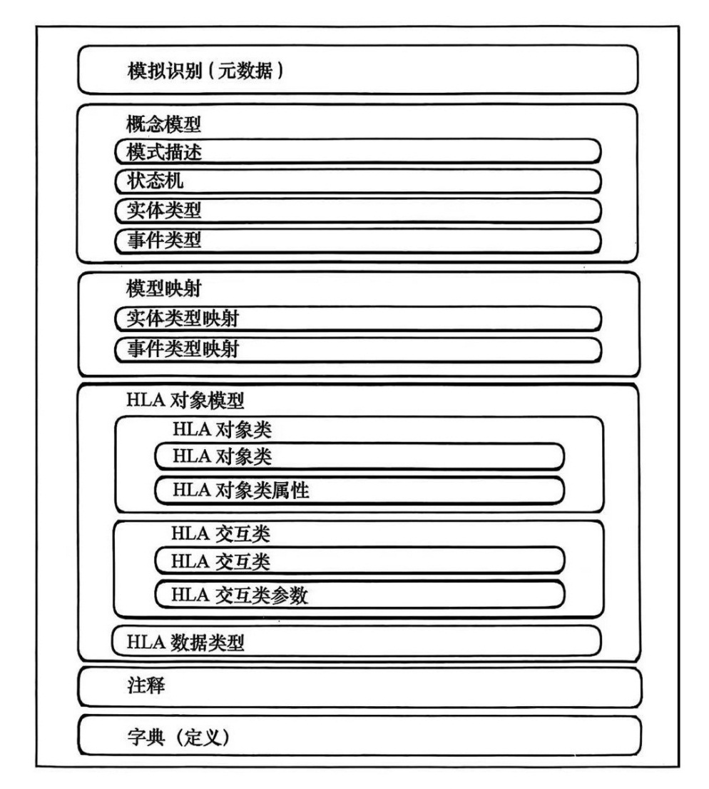
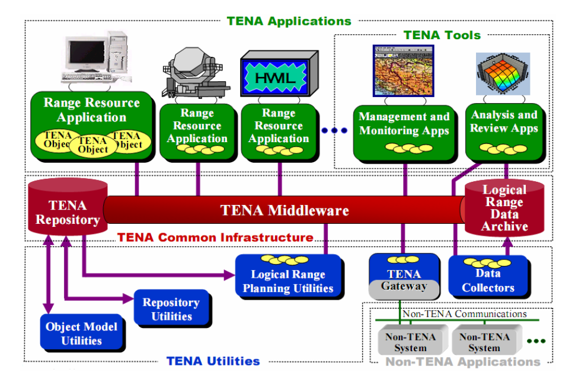
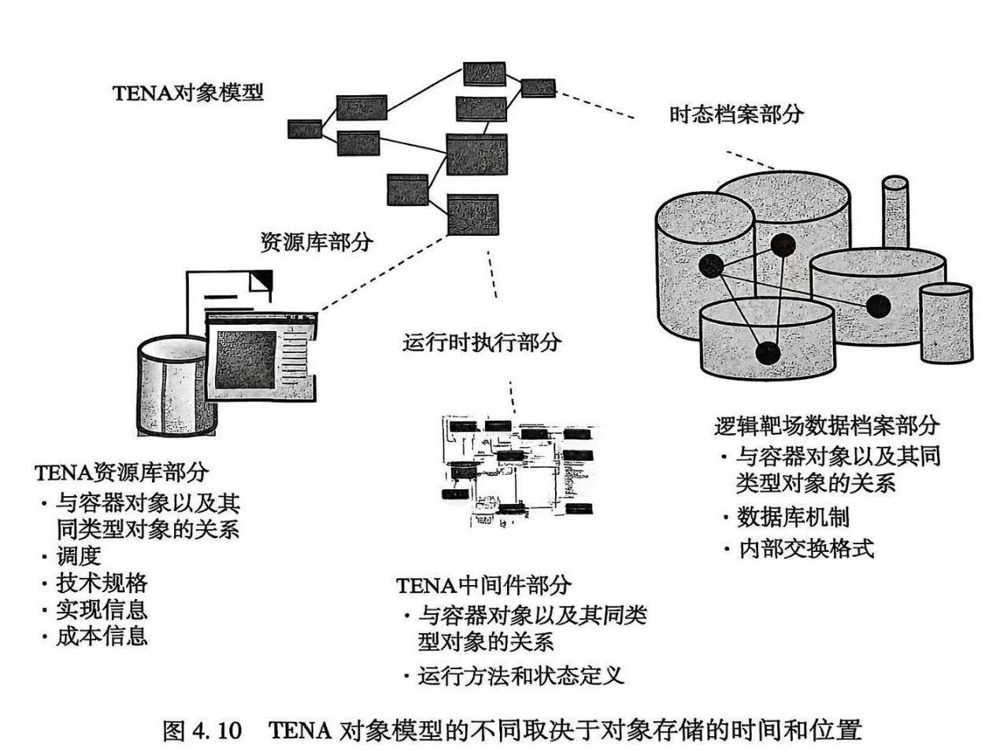
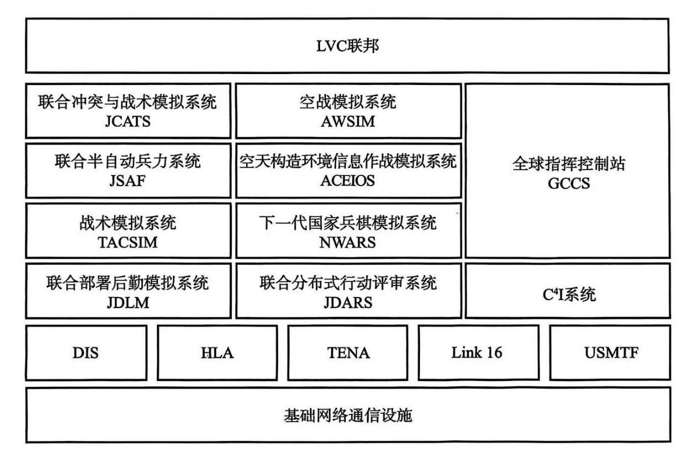
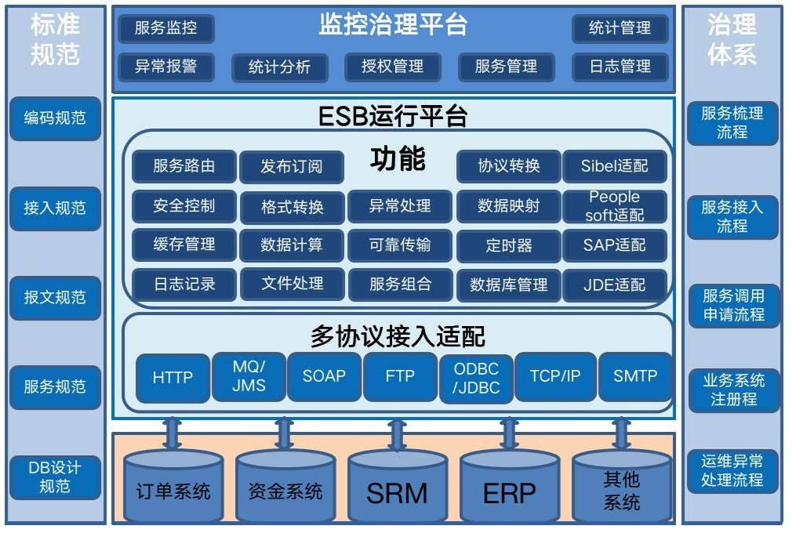

# 试验训练LVC仿真技术

【摘要】装备试验和训练是军用仿真技术的重要应用领域。开展LVC仿真系统建设，能够有效支撑部队的试验训练。介绍LVC仿真体系结构发展现状，重点了解试验与训练使能架构（TENA），认识逻辑靶场的概念。

【关键词】 装备试验训练，LVC仿真，TENA，逻辑靶场

【参考书目】

▲张源原主编，LVC分布式仿真体系结构及构建过程，国防工业出版社，2022.11

曹裕华，张连仲，装备体系试验与仿真，国防工业出版社，2016.11

------------------------------------------------------------------------

## LVC仿真概述

在军事训练领域，通过模拟训练，可以提高训练人员的操作技能、运动技能和决策技能，而这三项技能与实装（Live）、虚拟（Virtual）和构造（Constructive）模拟相互对应，且广泛应用于军事训练领域。

在分布式仿真技术突飞猛进的基础上，催生了实装、虚拟和构造模拟系统的互联，从而形成了LVC分布式仿真系统，其基础和核心是仿真体系结构，它从整体上描述仿真系统各个组成部分的结构以及各单元之间的物理和逻辑关系，对仿真系统的设计、实现和应用有着重要的指导意义。

### 概念

1995年，美国国防部开启了建模与仿真主计划。从技术发展到军事应用的30年间，美军为应对各种战场环境以及作战类型开发了众多模拟器，导致"烟囱式"发展，不同类型模拟器之间无法进行互操作。为了实现"像战斗一样训练"的理念，美军开始思考如何提供训练的逼真度，这一理念延伸到模拟训练中，从而促进了"虚拟旗"军演的开展，并最终实现实装、虚拟和构造的融合，LVC仿真系统概念也逐渐成熟。

在实装仿真中，真实的人操纵真实的系统。例如，在空军军事训练演习中经常使用空战机动仪器系统（ACMI），可以将飞机的诸如位置、速度、加速度、方向及武器状态等信息传输到分布式仿真网络中，供其他设备或人员使用，最典型的用法包括判断飞行员操纵飞机的能力、导弹的使用情况以及空战结果评判。

在虚拟仿真中，真实的人操纵虚拟的系统。该模拟属于"人在回路"模拟方法。最典型的例子是当前使用飞行训练模拟器训练飞行员驾驶能力以及执行任务能力。

在构造仿真中，虚拟的人操纵虚拟的系统。仿真过程中，真实的人会对系统提供参数等刺激信息，但不直接参与。这类仿真通常用来训练分辨率较低的、高级别的指挥决策训练。

随着技术的进步与发展，在传统模拟与仿真技术的基础上，开发了增强现实（AR）技术。增强现实技术将真实的现实世界与虚拟的构造世界"无缝"集成在一起，把原本现实世界中某一时空范围内很难体验到的信息（视觉、听觉、味觉、触觉等）通过计算机等科学技术，模拟仿真后叠加，再将虚拟的信息加载到真实世界，然后被人类感官感知，从而达到超越现实的感官体验。增强现实技术，不仅向用户呈现了真实世界的信息，而且将虚拟信息一同显示出来，两种信息之间可以相互补充、叠加。

增强现实本质是属于实装仿真，已经应用于美国海军训练当中，美国海军研究办公室（ONR）主持的一个项目，已与海军水面作战中心（NSWC，位于弗吉尼亚州达尔格伦）、美国陆军作战能力发展司令部以及两家公司共同开发AR训练环境。其中，最重要的成果之一即是完成了人工战斗增强现实系统。该系统包括一个AR头盔、一个背负处理器和一个模拟武器，AR头盔用于在真实环境中显示虚拟目标，模拟武器可以提供逼真的后坐力，背负处理器与其他系统一起提供武器跟踪。

实装模拟是指参与仿真系统的对象只包含实装对象；

虛拟模拟是指参与仿真系统的对象不全是实装对象或者是虚拟对象；

构造模拟是指参与仿真系统的对象完全是虚拟对象。

### 美军LVC仿真系统建设现状

LVC仿真系统的构建直接促进了LVC训练方法的实现，能够有效支撑多军种、多地域、多维度的机动作战。这种将实装、虚拟和构造相结合的训练方式，能实现训练资源最大化利用；与此同时，它还能将受训人员扩大至司令部和地理上相隔甚远的机动部队。2016
年，美国海军陆战队开始着手将现有仿真系统整合到一个可互操作的LVC训练环境中，形成LVC
仿真系统。而在美国陆军也有类似系统称为综合训练环境（Synthetic Training
Environment，STE）。这些LVC仿真系统构建的基础是所有已建设的模拟训练设施。

1．美国海军模拟训练设施建设

美国海军下设7个舰队，由海军和海军陆战队两个独立的军种组成，配备各型舰艇、飞机等武器装备，是美军使用武器型号最多的军种。作为美军威慑全球的主战军种，其中最重要的装备即是航空母舰与舰载机。为了训练舰载作战系统的操作使用，如"宙斯盾"作战系统、舰船自防御系统（SSDS）、战术数据链等系统，美国海军教育培训司令部设置了海军水面作战系统中心（CSCS），下辖13个分部，例如诺福克分部、达尔格伦"宙斯盾"训练战备中心（ATRC）、圣迭戈舰队反潜训练中心等。

目前，美国海军数量最多、规模最大的岸上"宙斯盾"系统建筑群部署在沃洛普斯岛分部，位于弗吉尼亚州东海岸沃洛普斯岛。同时，该部也是美国海军综合水面作战系统试验场，设有6套"宙斯盾"模拟系统，2套航空母舰和两栖舰舰船自防御模拟系统，以及3套Link
16
网络模拟系统，能够模拟各种面对面导弹发射和炮弹攻击，跟踪和拦截海上及空中目标，从而提供工程研发、训练、测试、舰队对抗演练方面的支持，而且都集成了TADIL-A
和TADIL-J战术数据链。这些设备的使命任务涵盖了全寿命支持工程，现役装备支持工程，编队训练，作战系统研发、集成与测试，项目研究、开发和研制试验鉴定，特混编队体系对抗测试，战区导弹防御系统开发。该分部模拟设备特点如下：

（1）能够同时提供多种成套高逼真度，与实际装备状态一致的作战模拟系统。

（2）设有控制中心，能够协调各作战系统间的测试、信息交互和开发活动。

（3）全部模拟系统都具有协同作战能力（CEC）功能，都能够作为一个独立的协同作战系统节点与其他测试系统或训练海区真实的舰艇和飞机节点进行协同交互。

（4）能够使用通信中继基站和Link 16
数据链与其他地区的系统进行互操作，完成交互测试和协同作战。使用美国国防部全国范围的
DEP 和 ABN网络，还可实现全国范围内任何地方节点的交互测试。

为了训练舰载机飞行员，2016年，美国海军在法伦海军航空站（位于内华达州）设立了一个防空打击训练设施群；2020年，又将其升级为一个综合训练设施，包含3艘"宙斯盾"巡洋舰、2架E-2D"鹰眼"和8架F-18的模拟器，通过计算机兵力生成技术，在合成战场环境中实现添加各类兵力，模拟航空母舰等水面舰艇，从而在各类环境中训练美军航母攻击群的打击能力。

2．美国空军模拟训练设施建设

美国空军的各个训练基地均已装配有大型模拟训练设施，其中最具有代表性的是内利斯空军基地（Nellis
Air Force Base）以及科特兰空军基地（KirtlandAir Force
Base），下面分别予以介绍。

内华达州克拉克县的内利斯空军基地作为空中作战司令部（ACC）的一处设施，是美国空军空中作战中心的所在地，主要作为美军及其盟军飞行机组训练场地。内利斯空军基地部署了美国空军最先进的作战飞机，如F-22和F-35，同时配套大量模拟器。著名的"红旗"军演即在该基地举行，以俄罗斯、中国等空军力量为作战背景进行对抗训练。由于角色的多样性，内利斯空军基地的飞行中队数量超过其他任何空军基地。基地驻有第57
战斗联队、第99 空车基地联队、第53联队、空战中心等部门。

为了支持F-35等先进机型的飞行训练，由洛克希德•马丁公司主持研制了"分布式任务训练系统"，并于2020年7月通过了美国空军和F-35联合计划办公室的验收，实现了该基地的F-35全任务模拟器与其他基地同类设备的互通互联，能够与世界各地的飞行员共享虚拟训练环境、战法战术和作战要素，形成网络化的训练平台。

内利斯空军基地的模拟训练设施主要用于机型训练，科特兰空军基地的模拟训练设施则主要用于研究、实验与测试，而象征着LVC仿真系统从概念走向实践的"虚拟旗"军演的主持单位------分布式任务作战中心（DMOC）即位于科特兰空军基地中。

分布式任务作战中心隶属于
ACC，是美国空军负责分布式虚拟作战训练演习、测试和试验的机构，目标是为空军主要作战部队提供所需的IVC训练能力。DMOC采用了能集成各种飞行模拟器和数字构造兵力模型的网络体系结构和网络基础设施，为美军和盟友提供网络连接服务，用于整合各部队的训练装备、设施，模拟出作战人员能使用实际战术和程序的现实威胁情境。

DMOC负责组织每年4次的"虚拟旗"演习，该演习是美军目前唯一的全谱系飞机的作战人员都能参与的重点演习。

2015年，美军首次尝试将内华达州开展的采用实装对抗的"红旗"军演与"虚拟旗"军演相结合，模拟器大多数都被安置在科特兰空军基地的DMOC，包括一个完整的E-8联合指挥机的指控席位。虚拟的E-8给实装飞机发送虚拟地面目标信息，实装飞机也做出了响应。

参与"虚拟旗"演习的模拟器几乎覆盖了美军和盟国航空装备的全谱系，不仅包括了F-15、F-16、F/A-18、台风、狂风、CF-18、B-52、B-1B、C-17、AH-1、V-22
等主流装备，也包括了E-3、E-8、RC-135、HH-60G 和
HC-130等特种飞机。之后也陆续加入了MQ-9无人机模拟器、联合终端攻击控制器等。

从美国海、陆、空三军的模拟训练设施可以看出，LVC仿真系统的发展及应用在空军的军事训练、研究试验当中体现得最为明显。这不仅得益于空军装备代表着最先进的装备技术、复杂作战概念都离不开空中作战单位，而且从"虚拟旗"演习成功开始，美国空军就针对LVC仿真系统建设，设立了完善的组织结构，并持续对其优化。

## LVC仿真体系结构

### 发展现状

自20世纪80年代美军采用计算机仿真进行模拟训练以来，针对LVC仿真资源的互联互操作需要，相继提出了SIMNET、DIS、ALSP、HLA、TENA等分布式仿真体系结构。

LVC
仿真体系由人员、硬件和软件构成，以网络为中心，通过通用协议、规范标准和接口将三个不同的环境结合起来，进行数据收集、管理、检索、实时交换等。使用规范、统一的仿真架构将有助于分布式仿真的实现。国际组织的很多建模范式和架构都可能被用于军事建模仿真，仿真器联网（SIMNET）和聚合级仿真协议（ALSP）已经不再使用，而分布式交互仿真（DIS）、高层体系结构（HLA）、试验与训练使能架构（TENA）等仍在广泛使用。

DIS 为IEEE
1278，是关于分布式交互仿真的标准，由一个大型团体开发，以支持模拟器和实体级仿真。该标准定义了实时系统交互数据包，即协议单元数据，描述了预定的标准化事件，如向另一个实体开火、无线电通信、物体碰撞等。

HLA 为IEEE
1516，为仿真系统组成的集合定义了规则，为仿真系统运行时基础架构提供了一组服务，并使用对象模型模板定义系统间的交互数据。HLA
是一个通用分布式仿真架构，没有任何专门针对作战建模的具体特征，但非常适合用于作战建模的实现。

TENA
的设计目的是为美军测试与训练靶场及其用户带来便捷的互操作性。通过使用大规模、分布式、实时的综合环境，TENA
的设计促进了基于采办的集成测试和仿真。综合环境综合了测试、训练、仿真和高性能计算，使用公共架构，在"逻辑靶场"上可以实现真实的装备之间、及其与仿真武器和兵力的交互，不论这些兵力实际上存在于世界的哪个地方。

比较而言，HLA是美国国防部建模与仿真公共技术框架的核心部分，它不是针对特定应用领域而设计的，适用于各种应用领域（如分析、试验、训练等）的建模与仿真的开发与集成。而TENA针对试验与训练领域设计，因而适用于各种常见的试验与评估系统，以及各种训练资源如靶场、可配置的模拟器等的开发与集成。所以，HLA比TENA更灵活，适用范围更广，而TENA更专用，对试验和训练提供了更多的支持。

目前，美军大量的试验与训练应用系统都是通过综合集成多种不同技术标准（包括DIS、HLA、TENA）而建立的混合系统，而HLA和TENA本身也都考虑了兼容不同技术架构的集成问题。

### 基本对象模型（BOM）

20世纪90年代后期，仿真互操作性标准化组织（SISO）提出了一种高效的仿真建模框架------基本对象模型（BOM），2006年3月发布了相关的标准。BOM本身采用XML和XML
Schema的方法定义和校验其描述的内容，有利于增强数据的交换和理解能力。BOM主要包括模型识别信息、概念模型定义、模型映射和对象模型定义四个部分，如图所示。

<figure>
  
  <figcaption>图 10‑1 BOM模板结构</figcaption>
</figure>

其中，模型标识为BOM使用者提供元数据，包括了模型的可重用信息。概念模型通过概念实体类型和概念事件类型描述现实事物，定义被仿真对象的功能，通过状态机和交互模式来反映现实事物的状态变化和交互关系。模型映射将概念模型中的实体类型和事件类型映射到HLA-OMT中的对象类型，从而使得概念模型和HLA对象模型的开发呈现松耦合特性。BOM中最基础也是最难以解决的部分是概念模型设计，一般采用UML与XML技术。如果BOM仅用于概念模型定义，其中的模型映射和对象模型定义部分可以省略。目前对BOM的应用处在两个层面上：一个是接口层的应用，即利用BOM花费更少的时间开发出易于修改、灵活的FOM；另一个是功能层的应用，利用BOM促进仿真运行模型的开发，这里的模型指可编译的编程语言代码或可直接运行的二进制代码。

虽然BOM的出现可以提高仿真模型重用性，但BOM只是一个标准，并未提供领域所需的具体基本对象模型。并且由于HLA要想支持各种领域系统的开发与集成，要能够将不同类型的仿真（包括大量已有的仿真）集成起来互操作，它必须非常灵活，特点是对具体应用的实现所施加的限制必须非常少，因此，仅有BOM标准和HLA并不能满足具体应用的特定需求。并且由于HLA不能用于硬实时应用环境，而在装备试验与训练领域，必须要把实际的测试设备加入到试验与训练系统，对实时性要求比较高，因此在该领域HLA的使用受到了很多限制。为此，美国国防部通过基础计划2010（FI2010）工程开发了"试验与训练使能体系结构（TENA）"。

### 存在的问题

1．对象建模不兼容

即使在一个单一的体系结构内，对象建模一直是互操作性和可组合性最大的障碍。

HLA与TENA都需要对象模型实现语义级的互操作性。一个TENA元模型是用于构建一个TENA
LROM的元素的模型，同样HLA对象模型模板（OMT）也描述了HLA对象模型的元素。一个TENA逻辑靶场对象模型（LROM）为一个特定的逻辑靶场描述了一个接口约定，一个HLA联邦对象模型（FOM）为一个特定的联邦描述了一个数据约定。总的来说，TENA对象模型提供了更丰富的表示形式，支持更面向对象的表示，包括目前的HLA
OMT还不能支持的组件。虽然TENA和HLA
两者都需要一个对象模型，但对象模型的表示在结构和应用方面是有显著区别的。

DIS协议企图通过开发一个由所有DIS参与者使用的单一数据模型来解决互操作性问题，但是这种方法并没有对复杂的、多变的各种系统的描述提供灵活性。HLA又试图从另一个方面来解决问题，主要是规定了记录对象模型的格式，该方式把对象模型的定义和内容留给了各个开发者。这种方法提供了很大的灵活性，但由于很多不同的FOM带来了实际的互操作性问题，把针对不同HLA对象模型开发的仿真集成为一个HLA联邦时，其集成的复杂度明显增加了。在HLA研究领域，已经针对标准的参考FOM（例如实时平台参考FOM）开展了一些研究。

TENA用元对象模型定义了其对象模型格式，并且定义了一套标准对象模型，利用这些模型可以组合生成复杂的对象模型。这种提供标准对象模型子集的方法在灵活性和标准化之间提供了一种更易于接受的折衷方法。但是HLA和TENA对象建模方法都是与它们特有的体系结构或协议相关的。

2．缺乏可组合性

目前的难题是在HLA和TENA中都没有完全实现可组合性，这种缺陷限制了两者的互操作能力。例如HLA对象建模缺乏可组合性使得从一个一个部件汇编为HLA
FOM变得非常困难。一个FOM充当了有约束性的契约，通过该契约允许各系统或仿真器交换有意义的信息。如果在生成一个FOM方面有困难，那么在各系统或仿真器之间的互操作就存在风险。通过讨论认为开发一个可以满足HLA、TENA以及未来体系结构的一个较好的方法是寻找一个单一对象建模方法，该方法是实现可组合性的焦点。

3．中间件/基础设施不兼容

TENA和HLA的实现工具都提供了一个通信基础设施层，包括了预定义的用户接口和一系列的服务，这些服务基于发布/订阅模式，用于在生产者和消费者之间分发数据。虽然它们提供了相似的消息分发服务，但在使用方面是不同的。例如HLA提供了大量的服务，用于满足M&S领域的独特需求（例如时间管理）。未来如果中间件实现工具要合并，试验和M&S的独特需求方面的功能都需要解决。

## 试验与训练使能架构TENA

### 概述

1995年，美国国防部发起了"试验与训练使能架构"（Test and Training Enabling
Architecture，TENA）项目，其目标是开发促进试验与训练领域应用和资源互操作的试验训练公共体系结构。

TENA旨在以快速、高效的方式实现试验和训练的靶场、设施和仿真设备之间的互操作，促进这些资源的重用和可组合。TENA提出了"逻辑靶场"的概念，以促进集成测试和开展基于仿真的物资采办，从而实现联合构想2020需求。"逻辑靶场"集成了测试、训练、模拟，具备高性能的计算技术，采用了分布式设计，使用一个公共体系结构将这些功能联系在一起。

TENA提供了试验和训练所需的更多特定能力，特别是针对美军试验与训练增加了标准的雷达对象模型、GPS对象模型、平台对象模型、时间空间位置信息对象模型等，并在通信机制、时间管理等方面也进行了改进，旨在提高在试验与训练中应用建模与仿真技术时的互操作性、可重用性及可组合性。TENA在美军的联合任务环境试验能力（JMETC）、互操作性测试与评估能力项目、星船II先进C2软件应用分布式测试环境等多个项目中得到应用，在美军的多次LVC演习中也把TENA作为主要的技术体系结构和信息交换机制。2008年已完成了其6.0版本的开发。

### TENA的组成

TENA的核心是TENA公共基础设施（TENA Common
Infrastructure），包括TENA中间件（Middleware）、TENA仓库（Repository）和TENA逻辑靶场数据档案（Logical
Range Data Archive）。TENA
还定制了许多工具和实用程序，主要包括创建逻辑靶场的必要工具。靶场测试设备系统（也称靶场资源应用）和所有.工具通过
TRNA对象模型这一媒介与公共基础设施进行交互。在靶场事件期间，TENA对象模型对靶场系统之间传输的所有信息进行编码，它是所有TENA应用程序通信的通用语言。TENA体系结构如图所示。

<figure>
  
  <figcaption>图 10‑2 TENA体系结构</figcaption>
</figure>

靶场资源应用，是由靶场开发人员进行创建的，然后部署在每个靶场，以执行每天测试和训练所需的所有重要功能。这些系统包括显示系统、传感器系统、硬件在环试验系统等。一些可重用的靶场资源应用，被确定为TENA工具。所有应用程序都使用TENA中间件的公共软件基础设施进行通信。

TENA中间件负责逻辑靶场内应用程序间的通信，需要在逻辑靶场对象模型（LROM）定义的一组对象中实现通信，这些对象大多是可重用的。LROM
对象需要在靶场资源、工具和实用程序中进行描述说明，因为这些应用程序负责实例化对象，并在靶场活动执行时进行修改。靶场资源应用、工具和实用程序等，都使用TENA中间件来发布/订阅TENA对象。

在应用程序之间通信的信息有两种不同的处理方式：

靶场间重复使用的信息都存储在TENA仓库中，并不局限于特定的逻辑靶场TENA仓库。这类信息包括对象模型定义、与TENA兼容的应用程序的信息，甚至应用程序可执行程序本身。

在靶场活动执行期间，逻辑靶场的数据永久存储在逻辑靶场数据档案中，并分布在多个站点的计算机中。集成模式允许像访问单个"逻辑"数据库一样访问分布式数据档案。逻辑靶场的数据档案，包括状态的时间演进、逻辑靶场内的所有TENA对象、发生的所有消息和数据流，以及由事件分析人员制定收集的其他信息。仓库和逻辑靶场数据档案，可以使用TENA中间件进行访问，也可以使用其他标准的机制进行访问。

TENA网关是TENA系统与不兼容TENA系统之间的桥梁，负责标准和协议的转换，包括基于HLA的仿真。网关还可以在TENA逻辑靶场和其他网络之间提供物理连接。

### TENA对象模型

本节介绍TENA对象模型，包括表示和存储方法，以及创建和标准化过程。

1\. 目的

TENA对象模型是为所有靶场资源应用提供通信用的公共语言，从而在靶场资源应用之间实现语义互操作性。TENA对象模型最终将编码靶场资源应用之间通信的所有信息。对象模型显然包含许多不同类型的信息。专家认为，所有这些不同类型的信息都可以用TENA元模型中的元素来表示。TENA对象模型的创建和标准化工作是TENA架构工作中最重要的部分，并且将对未来靶场资源的互操作性、可重用性和可组合性产生最积极的影响。

2．运行中的TENA对象模型------逻辑靶场对象模型

逻辑靶场对象模型用于给定逻辑靶场的运行，以满足特定用户对特定靶场活动的直接需求。LROM
是一个逻辑靶场内的所有靶场资源应用共享的公共对象模型。它可能包含标准的TENA对象模型的元素，也可能包含非标准的对象定义。

每个逻辑靶场运行都通过它的LROM
进行语义上的绑定。因此，为特定的逻辑靶场运行定义LROM是最重要的任务，它将单独的靶场资源应用集成到逻辑靶场中。LROM
是由逻辑靶场开发人员在计划逻辑靶场时定义的。由于在创建一个逻辑靶场之前，不可能创建所有的标准TENA对象模型，所以创建LROM
是非常必要的。正如下面所讨论的，TENA对象模型的开发是一个渐进的、迭代的过程，所以需要LROM概念来表示在特定逻辑靶场上使用的特定对象模型。随着TENA对象模型创建趋向完整，预计每个LROM将包含越来越多的标准化元素。当TENA对象模型基本标准化后，LROM
将表示为TENA对象模型的子集。虽然如此，但是允许包含其他尚未完全标准化的对象，因为随着技术的进步，会有新的功能不断引人。

3．描述和存储TENA对象模型

TENA对象模型使用UML
进行描述。UML是表示对象模型的商业标准。TENA设计一组规则，将TENA元模型定义编码到
UML中。

根据出现在靶场活动中的不同阶段，TENA对象模型的实现可能会有所不同，如图所示。例如，在执行期间，从一个靶场资源应用传输到另一个靶场资源应用的对象，可能只有一个实现；相同的对象，当存储在仓库或逻辑靶场数据档案中时，可能具有完全不同的实现，包括不同的行为，而这些实现必须相互兼容。

<figure>
  
  <figcaption>图 10‑3 TENA对象模型的不同取决于对象存储的时间和位置</figcaption>
</figure>

TENA对象模型，是由靶场标准化的所有类、值类型和相关信息的定义组成的。这些定义包括对象在所有不同方面的潜在关系，这些关系可能会在整个逻辑靶场生命周期中发生变化。这些定义存储在TENA仓库中。对于定义在其接口（远程或本地方法）中的操作，TENA对象也可能有标准的实现，而这些实现也可以存储在仓库中。

4．TENA对象模型的开发

构建和标准化TENA对象模型，是一个非常慎重和渐进的过程。在不同层次上对TENA对象都进行了标准化，以便在TENA对象模型完全定义之前，靶场就可以开始使用TENA。逻辑靶场对象模型，由这些对象定义组成。LROM包含渐进式的四级标准定义：

（1）非标准对象定义：仅用于定义特定的逻辑靶场。

（2）候选对象：在多个逻辑靶场活动中进行过测试，这些对象作为候选对象提交给TENA架构管理团队（AMT）。

（3）AMT批准的对象：基于适当的候选对象，AMT审核并消除与其他候选对象的冲突，然后批准并转发给靶场指挥委员会（RCC），以进行标准化。

（4）RCC标准化的TENA对象：RCC认可的标准对象定义。

每个 LROM都可以包含上述四个层级中的任一对象。

5．环境

互操作性的一个关键方面是公共上下文。这意味着，需要对靶场操作的发生环境有一个共同的理解。如果没有这种公共环境表示，就不可能实现完全的互操作性。但是，以一种标准的、计算机可理解的方式来表现自然环境是一项艰巨的任务。环境的每一个元素，如地球的形状、地形、地形特征、城市地区、水深、海况、大气条件和天气，都必须用标准的方式来表示。将如此大量的信息标准化的过程非常复杂，DMSO启动了合成环境数据表示和交换规范（SEDRIS）项目，对该过程进行研究。包含两个关键问题：一是环境数据的表示；二是环境数据集的交换。

6．场景

场景代表了靶场活动的初始条件，包括对用户目标和需求的理解、靶场资源应用和被测试系统列表以及这些资产的初始条件。场景并没有定义为SDO，因为它是用于初始化靶场活动的，并且在执行期间不进行通信。该场景是使用事件规划工具套件开发和编写的，然后存储在逻辑靶场数据档案中。靶场资源应用，从存储在逻辑靶场起始部分的场景中，检索它们的初始化信息。

7．元数据

TENA对象模型中的对象定义，在仓库中存储时，都与元数据列表相关联，包括其历史和谱系、标准化状态以及依赖于它的其他对象定义。这样做的目的是让逻辑靶场开发人员（或TENA工具和实用程序的用户）能够方便使用，让构建
LROM 和场景变得更简单、更快捷。

### TENA公共基础设施

TENA元模型和TENA对象模型力TENA应用程序提供了公共语言和公共上下文。TENA公共基础设施为这种通信提供了一套标准通信机制。该基础设施被设计为支持TENA事件生命周期所有阶段的通信，并包含两种主要的通信范式：

（1）在不同时间运行的应用程序间通信。需要使用某种形式的持久存储，来存储它们正在通信的信息。

（2）在相同时间运行的应用程序间通信。以时间作为主要考量因素，传递大量信息。

TENA公共基础设施包含三个部分：

（1）TENA仓库。该仓库包含了不特定于给定逻辑靶场的所有信息，包括TENA对象模型、TENA实用程序和工具的可执行文件、TENA基础设施软件、TENA文档、经验教训和其他必要信息。

（2）逻辑靶场数据档案。该部分包含运行逻辑靶场所需的所有数据，如场景数据、初始化信息、事件期间收集的数据和汇总信息。它是逻辑靶场内应用程序之间非实时（持久）通信的主要手段。

（3）TENA中间件。TENA中间件负责在执行时将逻辑靶场捆绑在一起，在事件期间靶场资源应用之间提供高性能、低延迟、实时通信。它还提供了在运行期间访问逻辑靶场数据档案的功能。

上述部件在整个TENA事件的生命周期中提供了实现互操作性所需的所有功能。

### 逻辑靶场

逻辑靶场（Logical
Range）定义为一组共享公共对象模型的TENA资源，这些资源在给定靶场活动中一起工作。TENA资源是使用TENA公共基础设施进行通信和交互的应用程序，其内容包含：

（1）TENA中间件和一系列TENA对象的靶场应用程序。

（2）网关应用程序，TENA-HLA
网关、靶场协议网关、C4ISR系统网关和靶场实体网关等。

（3）为事件设计的TENA工具和实用程序。

"逻辑靶场"在抽象上表示了一组TENA资源。"逻辑靶场运行"指的是该逻辑靶场实例在特定靶场活动中的给定靶场内运行。

这些TENA资源在逻辑靶场内会共享公共对象模型，这些公共对象模型被称为逻辑靶场对象模型，它与标准的TENA对象模型不同。每个逻辑靶场运行，都是通过它的LROM，在语义上绑定在一起。因此，为特定逻辑靶场运行定义LROM，需要在逻辑靶场实际操作之前完成一项重要任务。使用逻辑靶场作战概念ConOps
描述的流程来开发逻辑靶场，分为三个阶段，包括五个活动。

逻辑靶场是在TENA应用程序之间，以点对点的方式连接的。每个应用程序都可以作为逻辑靶场中对象和数据的生产者（服务器）和消费者（客户端）。当应用程序作为服务器，应用程序为TENA对象实例服务，从而称为"服务者"。当应用程序作为客户端，应用程序订阅TENA类，并通过TENA中间件提供代理（Proxies），每个代理代表另一个应用程序的服务。原则上，特定服务的服务器和该服务的客户端都能够更新该服务的状态信息。实际上，几乎在所有情况下，只有执行服务的服务器会更新服务的状态。特定服务的服务器和客户端，都能够调用该服务上的方法。服务器在本地调用这些方法，客户端通过代理远程调用这些方法。

靶场资源开发人员将开发的应用程序、TENA中间件和特定的LROM
链接到一个单独的可执行文件中。TENA提供实用工具，帮助靶场资源开发人员，使应用程序在逻辑靶场上下文环境中工作。

在由CTTRA成员创建的JORD文档中，按照不同的功能确定了测试设备的需求，以产生兼容TENA的系统。功能分类包括环境、采集、处理、信息显示、操作控制和信息传输。这六个功能区域代表了靶场使用的各种测试设备：

（1）环境：模拟或创造环境的系统。这些系统可以模拟天气，创建适当的电磁环境，或在靶场内作为目标或诱饵，包括被测系统或参与训练的所有人员。

（2）采集：对靶场内活动进行测量并产生相关数据的系统，包括各种传感器、遥测系统等。

（3）处理：用于融合、排序、处理和存储信息（由采集系统所创建）的系统。

（4）信息显示：事件指挥人员提供靶场活动信息的系统。

（5）操作控制：支持计划、调度、指挥、初始化、配置和控制靶场资源的系统。

（6）信息传输：一种动态管理逻辑靶场内所有成员之间通信的机制。对于TENA，这个功能将由TENA中间件执行。

TENA是针对这些系统而设计的，并隐含了这些功能分解，直接响应了操作驱动需求（支持多种靶场系统）。

### 逻辑靶场的操作概念

逻辑靶场的操作概念（ConOps）描述了如何使用TENA执行靶场活动。许多靶场工程师应该都熟悉
ConOps，因为它包括了靶场上执行的许多任务流程，不管是否受到TENA的影响。ConOps
通过对靶场操作的描述，从而确定TENA具体在何处能够起作用。

TENA逻辑靶场ConOps 的设计需要通用性，以涵盖每个事件的进程。T&E
事件和训练的过程惊人的相似，只是术语上的差异可能会掩盖这种相似性。由于术语上的差异性，尽管ConOps是抽象的，但它应该能让开发人员理解TENA所处理的基本活动。目前，主要有四种关于进程描述的文档，这些进程描述是逻辑靶场操作概念的基础：靶场指挥委员会通用文档系统（UDS）流程，HLA联邦开发与执行过程，记录在TENA基线报告中的逻辑靶场流程和记录在TENA
JORD 中的流程。

RCC UDS
流程是一个标准流程，包含了靶场活动必要的需求文档，并将它们与适当的响应文档链接起来。因此，UDS
流程主要关注发生在事件前的活动。HLA FEDEP
过程主要集中在创建HLA联邦的必要步骤。TENA基线报告提出了包含五个阶段的进程，其中事件前活动分为三个独立阶段：场景定义、逻辑靶场调度和计划。但是，这些活动并不总是以时间顺序发生的。所以，当JORD的制定者认识到这个问题时，将阶段划分为事件前、事件中和事件后。

### 标准

TENA必须遵守国防部联合技术架构（JIA）的适用条款。JIA是国防部实现互操作性总体战略的关键部分，制定了一组商用性能标准，并规定了系统服务、接口、标准以及它们之同的关系。JIA目前主要包含用于信息传输（内容和格式）和信息处理的接口标准和协议。这些标准和协议涵盖了电子、机械、电气、液压和其他物理接口。下面列举对TENA实现非常重要的部分JTA标准。

（1）软件标准。

DoD 建模和仿真的高层体系结构------通过网关与仿真交互。

合成环境数据表示和交换规范------用于表示环境。

公共对象请求代理架构------作为应用程序间集成的首要标准。

（2）人机界面标准。要求 HCI是以商业标准构建的。

（3）硬件标准。硬件标准能够在各靶场异构的平台上使用。

（4）通信标准。TENA主要使用 Internet
协议的应用程序。例如，以太网（802.x）、异步传输模式（ATM）等。但同时包含其他通信机制，如各种军用无线电通信、共享内存、反射内存（如SCRAM-NET）和本地ATM。

（5）TENA中间件API。TENA中间件是逻辑靶场内所有应用程序交换信息的标准方式。

（6）对象建模标准。TENA对象模型中的对象和每个 LROM
都将以下述方法之一来表示：通用建模语言（UML）、可扩展标记语言（XML）、元数据交换（XMI）或TENA定义语言（TDL）。对象建模应根据TENA元模型进行。

（7）元数据标准。元模型将根据对象管理组织的UML和元对象实用工具（MOF）标准来定义。MOF是分布式对象仓库的最新技术，将元数据（包括UML元模型）表征为CORBA
对象。

XMI 是元数据交换的标准，它是在
MOF元模型和XML数据类型定义（DTD）之间以及在
MOF元数据和XML文档之间的并行映射，从而将元数据从一个仓库转移到另一个仓库。使用这些商业标准，提高了TENA应用程序与商业建模工具之间的交互和互操作的能力。

（8）安全标准。

## JLVC联邦

搭建一个支持LVC训练的JLVC联邦是美军训练转型和提升联合作战能力的重要工作。JLVC联邦是由各类构造/推演仿真系统、虚拟训练模拟器、训练基础设施环境、互联互通接口等构成的集成训练综合性支撑技术环境。后台主要依托体系结构设计机构、训练系统研发团队、训练组织实施机构和技术支持团队的支撑，采用了包括
DIS、HLA、TENA 和 Link
16等仿真技术标准的开放型、混合式技术体系结构，从而实现实装训练系统、虚拟系统和推演仿真系统的互联运行，协同推动LVC集成训练。

JLVC
联邦的目的是从军事行动的战术层面到战役层面，为联合作战人员提供更现实、更有效的联合训练，其总体目标如下：

（1）通过集成服务、联合各种模型、M&S工具促进和支持联合训练。

（2）通过 M&S 生成合理、完整和一致的数据，为各国C4I 系统服务。

（3）支持联合战术任务训练。

JLVC联邦主要由推演仿真系统、分布式仿真支撑技术体系、实兵演习环境、基础网络通信设施以及C4I系统组成，如图所示。

<figure>
  
  <figcaption>图 10‑4 JLVC联邦的组成</figcaption>
</figure>

1\. 推演仿真系统

目前，JVC联邦集成了美军各军种现有的部分推演仿真系统，包括：联合冲突与战术模拟系统（JCATS），负责仿真地面作战和特种作战行动；空战模拟系统（AWSIM），负责仿真空中作战行动；联合半自动兵力系统（JSAF），负责仿真海上作战行动；空天构造环境信息作战模拟系统（AGEIOS）、战术模拟系统（TACSIM）和下一代国家兵棋仿真系统（NWARS），负责仿真情报领域的相关行动；联合部署后勤模拟系统（JDLM），负责仿真后勤行动。通过这些模型的联合运行，构建一个虚拟综合战争空间，当指挥员在指挥所通过真实的C4I
系统输人作战命令后，由这些仿真系统共同完成各种行动在虚拟战争空间中的计算，然后再将结果通过C4I系统反馈给指挥员。

2\. 分布式仿真支撑技术体系

为了实现实装训练、虚拟训练和推演训练之间的互联互操作，分布式仿真支撑技术体系提供了基础技术支撑、统一通信协议和一致消息标准格式，形成了JVC联邦运行的技术标准。为了将不同技术体系下的各种系统连接起来共同运行，JVC联邦采取较为灵活开放的方式，吸纳了多种技术体系，包括HLA、DIS、TENA、Link
16、美国文本信息格式（USMTF）。JLVC联邦通过遵循这些协议和标准，将分布在不同地方的推演仿真系统和虚拟模拟器连接起来，共同支持LVC训练。

3\. 实兵演习环境

一直以来，美军非常重视实兵演习在训练中的重要作用，包括联合战役指挥层面和战术行动层面的训练，并且坚持实兵演习是不可替代的训练方式。在LVC联邦中，实兵演习环境作为重要的组成部分被纳人整个联邦之中，在指挥方面有全球指挥与控制系统（GCCS），在行动方面有陆、海、空各军种战术训练靶场和各种武器装备模拟器。

4\. 基础网络通信设施

作为JLVC联邦中重要的硬件组成部分，基础网络通信设施为LVC训练提供基础的网络通信环境。依靠基础网络通信设施，JLVC
联邦实现了分布在异地的各仿真系统和指挥系统的连接。目前，JLVC联邦网络通信采用的是联合训练试验网络（Joint
Training Experiment Network，JTEN）。

5\. C4I系统

C4I系统是美国军事指挥当局做出重大战略决策以及战略部队指挥员对其所属部队实施指挥控制、进行管理时所用的设备、器材、程序的总称。为了给各级指挥员提供真实的指挥平台，JLVC联邦中集成了C4I系统。

## 异构仿真系统的集成

从构建装备体系试验环境所需要的LVC
资源来看，资源之间及资源内部交互的信息种类繁多，许多资源是在异构平台上运行，在这种分布异构环境中，通常存在多种硬件系统平台（如PC、工作站、小型机等），在这些硬件平台上又存在各种各样的系统软件（如不同的操作系统、数据库、编译器等），以及多种风格各异的用户界面，这些硬件系统平台还可能采用不同的网络协议和网络体系结构连接，信息流程和交互关系常常动态调整。将这些不同的试验资源集成起来并形成新的应用，需要中间件技术的支持。

### 中间件技术

在软件工程领域，异构集成的实现模式一般是基于中间件。中间件规定了一个标准化的软件架构规范，支持符合该规范的各种软件组件的即插即用，而底层计算平台的异构性以及软件组件的异构性均被中间件所屏蔽。中间件按照所服务的对象可分为三个层次：1）基础型中间件，如Java虚拟机JVM、.NET公共语言运行时刻CLR、自适应通信环境ACE，提供最基本的运行支持环境，其服务对象一般是系统级软件；2）通用型中间件，提供了更多的高级功能，如名字服务、事件服务、日志服务等，其服务对象一般是应用级软件；3）集成型中间件，在通用型中间件产品之上整合了应用和业务流程等因素。

解决仿真领域异构集成问题的中间件，在实现上一般仍属于通用型中间件（如HLA/RTI、XMSF、SEDRIS），个别可归类于集成型（如TENA中间件、DDS中间件）。

中间件的名字虽然简单，但是其内涵却十分丰富，从微软的
ODBC到面向消息、网络通信、数据库访问、远程过程调用（RPC）、对象请求代理（ORB）等，都属于中间件的范畴。许多组织和专家都对中间件下过定义，一个比较通用的定义是：中间件是一种独立的系统软件或服务程序，分布式应用软件借助于这种软件在不同的技术之间共享资源。由此可以看出，中间件是一类软件，不仅仅实现互连，还要实现应用之间的互操作，中间件是基于分布式处理的软件。

中间件位于操作系统、数据库和网络之上，应用软件的下层，在前端客户机和后端服务器之间，所起的是一个桥梁的作用。在分布式应用软件开发研究的过程中，中间件技术得到了广泛的发展，因为利用中间件所提供的平台透明性、通信协议的透明性、硬件无关性，可以有效地降低分布式软件开发的复杂性成本，提高软件的复用率。

1\. TENA中间件

TENA中间件是TENA公共基础设施的重要组成部分，采用标准的C++编程语言，建立在开源的分布式对象计算中间件ACE+TAO
之上，实现了在Windows 和UNIX
操作系统平台上的可移植性，为分布式应用之间的高效通信提供服务。自适配通信环境（ACE）是一个开放源码的面向对象软件环境，针对分布式计算的许多方面实现了设计模式。ACE
对象请求代理（The ACE ORB,
TAO）是建立在ACE之上的CORBA-ORB，提供高效、可预测、可升级的端到端服务质量。

第二代TENA
中间件原型为IKE2软件包。IKE2的功能包分为4类：第一类包括试验或训练事件前的活动所需的功能包，主要用于定义TENA对象模型；第二类包括中间件运行所需的外部应用；第三类是IKE2软件本身所包含的那些内部功能包；第四类是IKE2后续版本中将包含的功能包。

2\. DDS 中间件

随着技术的进步与发展，系统的规模越来越庞大，这些系统在建设时可能采用不同的操作系统（如
Windows、Linux、UNIX、VxWorks
等），使用不同的程序语言（如C、C++、C#、Java
等）进行开发，编译环境也各式各样（如 Visual
C++、Qt、GNU等），底层物理网络也会不同。因此，底层的通信服务软件要适应不同的操作系统、不同的编程语言、不同的编译环境以及不同的物理网络。

为了满足这些需求，对象管理组织（OMG）定义了数据分发服务（Data
Distribution
Service，DDS）规范，在2004年12月发布其1.0版本。DDS采用以数据为中心的发布/订购（Data-Centric
Publish/Subscribe，DCPS）模型，提供了强大的数据 QoS
控制策略，实现了分布式系统中数据实时、可靠、高效地分发，能够广泛应用于航空、国防、分布式仿真、工业自动化、分布控制、机器人、电信等领域。DDS允许应用程序实时发布其拥有的信息，并订阅其需要的信息，较好地处理了不可靠网络通信中数据的自动发现、可靠性和冗余性等问题，可应用在要求高性能、可预见性和对资源有效使用的关键任务领域。

DDS 规范描述了两个层次的接口：

（1）低层的
DCPS用于完成数据的发布、订购，其目的是发布者能够高效地将正确的信息传递给适当的订购者。

（2）高层的数据本地重构层（DLRL）用于数据在本地的表示，其目的是使应用程序能更加直接地访问交换数据，并与本地程序语言完美地结合起来。

DCPS层是DDS规范的核心，它提供了数据发布的基础架构，确保正确有效地传输信息给适当的接收者。该层建立了一个"全局数据空间"的概念，发布者和订购者在该全局空间中分别发布和订购自己需要的数据类型，通过中间件处理后，再进行数据传送，将传统的C/S
模式转为以数据为中心的服务模式。在该模式中，数据并非存在于所有计算机的地址空间中，它仅存于那些对它感兴趣的应用程序的本地缓存中，而这一点正是发布/订购模型的关键所在。

数据发布者是一个负责分发数据的实体，它可以发布不同类型的数据。生产者的应用程序通过数据写入者的写操作来写数据。写操作以对象的适当类型作为参数，当定义与数据写入者相关联的主题时对象的类型就得到确定。对象有了新值，写操作就会通知中间件，但立即构建网络通信并不是必需的。由数据发布者负责决定何时发送数据以及执行实际的发送操作，这一行为通过相关的QoS驱动。数据订购者负责接收并分发不同类型的数据，根据数据订购者的QoS，可以接收已发布的数据。主题包含名称（在系统中唯一的）、数据类型和与数据本身相关的QoS。通过主题，使空间上、时间上关系松散甚至毫无关联的发布者和订阅者之间产生了关联。

### 接口网关技术

为构建复杂逼真的试验环境，需要综合利用各类实装的、虚拟的、构造的（LVC）试验资源。由于各类LVC
资源往往针对不同应用而建，体系结构不同，需要利用接口网关技术将这些异构的试验资源集成到一起，综合运用。

网关（Gateway）又称网间连接器、协议转换器，是多个网络之间提供数据转换服务的计算机系统或设备。在使用不同的通信协议、数据格式或语言，甚至体系结构完全不同的两种系统之间，网关作为翻译器，对收到的信息要重新打包，以适应目的系统的需求，同时起到过滤和安全的作用。

基于LVC
资源集成的装备体系试验系统的接口网关需要实现试验系统与其他标准和协议之间的所有转换，还提供某个试验系统与其他系统之间的物理连接。常用的接口网关包括仿真系统网关、靶场协议网关、指挥控制系统网关、战术接口网关等，实现装备体系试验系统与各种仿真系统和仿真设施、靶场仪器仪表、指挥控制系统、武器装备等之间的数据和命令交换。

接口网关所完成的功能主要包括3个层次，即装备体系试验系统的服务接口规范；数据映射；基于其他协议的服务规范或通信管理标准。服务接口规范定义各种服务机制，例如，TENA服务接口规范包括对象服务、分发服务等服务机制；HLA接口规范主要包括联邦管理、声明管理、对象管理、所有权管理、时间管理、数据管理六大服务机制；DIS
接口规范即网络接口单元，它包含数据过滤功能、DR模型解算、"心跳"数据发送机制等部分。

### ESB总线+适配器

企业服务总线（Enterprise Service
Bus，ESB）是一种架构模式，集中式软件组件通过该模式在应用程序之间执行集成。ESB
执行数据模型的转换、处理连接、执行消息路由、转换通信协议，并可能管理多个请求的组合。ESB
可以将这些集成和转换作为服务接口，以供新应用程序重复使用。ESB
模式通常使用专门设计的集成运行时基础设施和工具集（即ESB产品）来实现，以确保实现最佳工作效率。

ESB是构建面向服务体系结构（SOA）解决方案时所使用基础架构的关键部分，是由中间件技术实现并支持SOA的一组基础架构功能。ESB支持异构环境中的服务、消息，以及基于事件的交互，并且具有适当的服务级别和可管理性。在SOA分层模型中，ESB用于组件层以及服务层之间，它能够通过多种通信协议连接并集成不同平台上的组件将其映射成服务层的服务。

SOA
定义了一种通过服务接口使软件组件可重复使用的方法。这些服务通常使用标准接口（即Web
services），从而可以将它们快速合并到新应用程序中，而无需在新应用程序中复制由服务执行的功能。服务接口提供松耦合，这意味着可以在很少或根本不了解如何在底层实施服务的情况下进行调用，从而减少应用程序之间的依赖关系。

服务接口经常使用 Web 服务定义语言（WSDL）进行定义，WSDL
是基于XML的标准标记结构。这些服务使用标准网络协议（例如
SOAP/HTTP）公开，以发送读取或更改数据的请求。服务治理控制开发的生命周期，并在适当的阶段将服务发布到注册表中，以便开发人员能够快速找到服务并重复使用它们来组装新的应用程序或业务流程。

服务可以从零开始构建，但通常是利用旧系统中的功能来创建的。企业可以选择在旧系统前面提供基于标准的服务接口，使用ESB通过适配器或连接器直接连接到旧系统，或者应用程序可以提供自己的API。在任何情况下，ESB都会将新应用程序与遗留接口屏蔽开。ESB
执行必要的转换和路由，以连接到旧系统服务。

软件应用程序只需连接（"对话"）ESB，然后将其交给ESB来转换协议、路由消息并根据需要转换为数据格式，从而提供执行事务所需的互操作性。ESB架构方法支持应用程序集成、数据集成和业务流程的服务编排方式自动化场景。这使得开发人员能够花费更少的时间进行集成，而将更多的时间专注于交付和改进应用程序。

作为SOA基础架构的关键部分，ESB的功能主要体现在通信、服务交互、应用集成、服务质量、安全性以及管理和监控等方面。在通信方面，ESB能够支持消息路由/寻址，支持多种通信技术、通信协议（如JMS、HTTP、MQ等），支持发布/订阅的通信模式，能够处理请求/响应、同步以及异步的消息传递方式，并且要求以可靠的方式传递消息。ESB的重要功能就是集成不同的系统，必须能够支持多种接入ESB的方式，例如Web
services、CORBA以及使用Socket等方式访问的遗留系统，将接入的系统映射成Web服务。在集成不同系统的同时，必须考虑服务质量方面的问题，如事务性和消息传递的可靠性。

<figure>
  
  <figcaption>图 10‑5 典型的ESB运行平台</figcaption>
</figure>

不同的新系统和旧系统（遗留系统）经常是异构的。作为ESB架构的一部分，适配器发挥重要作用。适配器用于连接ESB总线与外部应用程序。适配器包括连接器、消息接收器/消息发送器、消息转换器3个部分。消息接收器/消息发送器用于接收和发送消息，消息转换器用于消息类型之间的数据转换，连接器则用于维护外部应用程序与总线之间的会话。连接器是适配器的核心，用于管理消息接收器/消息发送器以及消息转换器。对于消息接收器和消息发送器，连接器可以在其上定义接收端点和发送端点，如JMS的队列名称、HTTP的URL地址、POP3/SMTP协议的邮件地址。同时，连接器使用消息转换器将接收来的或者即将发送的消息进行转换。对不同的通信协议提供相应的适配器，如HTTP适配器、JMS适配器、邮件服务适配器、Socket适配器、CORBA适配器、COM/DCOM适配器、HTTP/SOAP适配器等。

ESB是一种设计模式，用于实现企业内部异构系统之间的集成和通信。ESB平台提供了一个中间层，用于连接和协调不同的应用程序、服务和数据源。以下是ESB平台架构设计的一些关键策略：

（1）面向服务架构（SOA）。面向服务的集成：ESB平台应该遵循SOA的原则，强调服务的重用、自治和松散耦合。服务注册和发现：提供服务注册表，使服务可以被发现和动态绑定，增强系统的灵活性。

（2）标准化和协议适配。消息标准：使用标准的消息格式（如SOAP、REST、JSON、XML）和协议（如HTTP/HTTPS、JMS、AMQP）来促进互操作性。协议适配器：提供广泛的协议适配器，以支持不同系统和服务的集成。

（3）消息路由和转换。智能路由：ESB应该能够根据内容、目的地或其他条件路由消息。数据转换：提供强大的数据转换引擎，支持不同格式和协议之间的数据映射和转换。

（4）中介和编排。服务中介：提供服务中介功能，如消息过滤、消息增强、消息分割和合并等。业务流程编排：支持业务流程的编排，允许复杂的业务逻辑通过图形化界面进行设计和执行。

（5）可扩展性和性能。水平扩展：设计应支持水平扩展，通过增加更多的ESB节点来提高处理能力和容错性。性能优化：采用缓存、异步处理、批处理等技术来优化性能。

（6）高可用性和容错。集群和负载均衡：实现ESB节点的集群，通过负载均衡来分配请求，提高系统的可用性。故障转移：设计故障转移机制，确保在一个节点发生故障时，服务可以无缝转移到其他健康节点。

（7）安全性。身份验证和授权：实施严格的安全措施，包括身份验证、授权和访问控制。数据加密：对传输中的数据进行加密，保护数据的机密性和完整性。审计日志：记录所有的操作日志，便于审计和监控。

ESB平台的架构设计应该基于对业务流程和集成需求的深刻理解。对于异构仿真系统来说，可以采用类似的架构，实现LVC各系统的集成。
