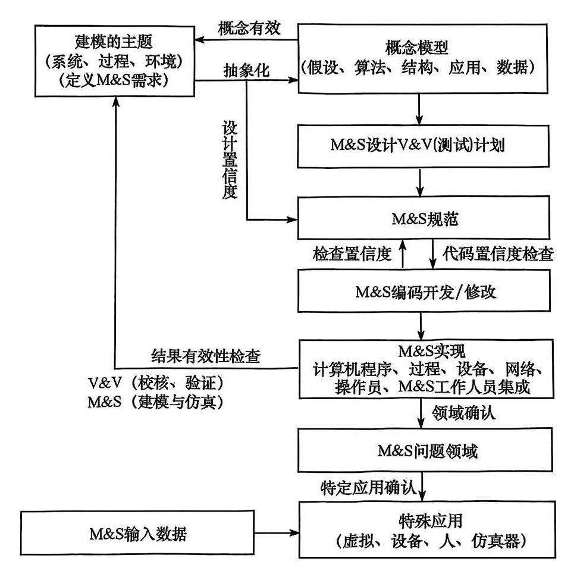
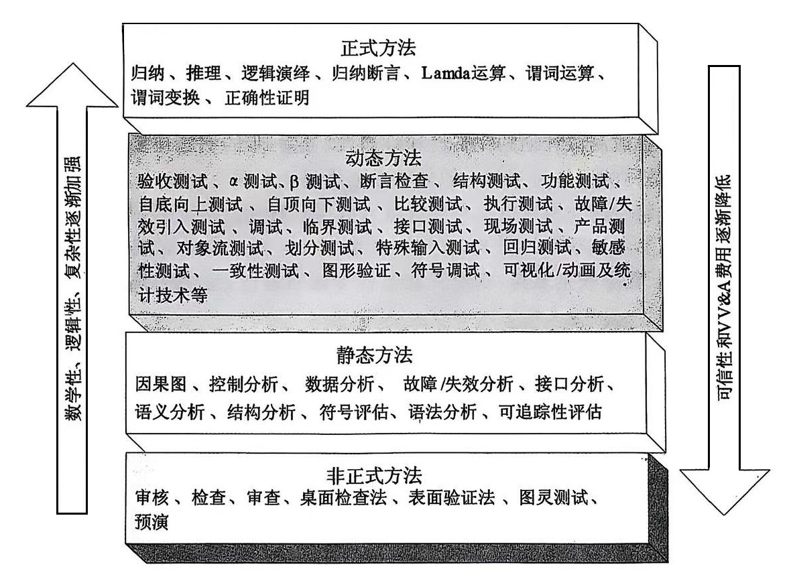
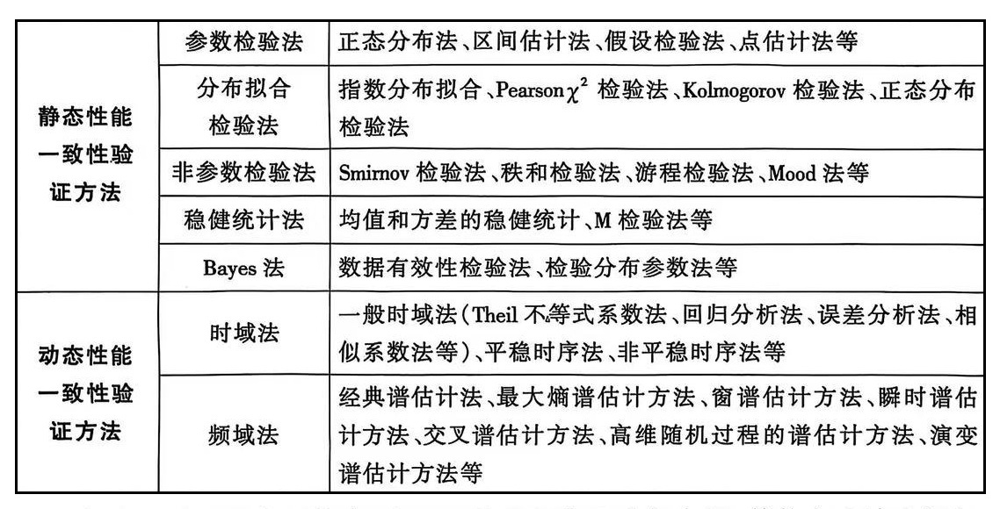
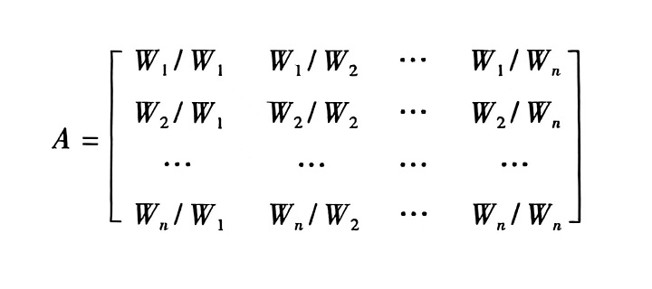

# 仿真数据分析与评估

【摘要】数据分析在仿真过程中扮演着十分重要的角色。介绍了仿真系统可信性评估的概念，模型的校核、验证和确认（VV&A）。仿真系统输出量的统计分析与评估也是重要一环，包括仿真结果的一致性检验。介绍了计算机仿真的蒙特卡罗方法，以及如何决定定量描述作战过程的效率指标。

【关键词】 仿真数据分析，可信性，VV&A，蒙特卡罗方法

【参考书目】

黄柯棣，邱晓刚 等，建模与仿真技术，国防科技大学出版社，2011.2

徐学文，王寿云，现代作战模拟，科学出版社，2001

------------------------------------------------------------------------

## 概述

从传统的物理实验到今天的数字化仿真，数据分析在仿真过程中扮演着越来越重要的角色。通过仿真模拟，研究人员能够提前预测系统的行为和性能，并通过对这些仿真数据的深度分析，做出更加精准的决策。

什么是仿真数据分析？仿真数据分析是指对通过仿真模拟获得的数据进行处理、分析和挖掘，从而提取有价值的信息，支持决策过程。它不仅涉及对仿真数据的可视化和统计分析，还包括基于数据的预测、优化和智能决策。

在仿真模拟中，多维数据的高效处理与分析是其中的关键，尤其是在面对复杂系统和大数据时，如何从中提取出有效的决策支持信息。

仿真数据分析的核心技术包括数据挖掘、机器学习、统计分析、优化算法等。这些技术能够从大量的仿真数据中提取潜在的信息，并通过模型推理帮助制定决策。结合机器学习算法，可以在大量仿真数据中自动发现规律和趋势；利用统计分析方法，对数据进行精细化处理，识别潜在的异常和关键因素。

在工程应用中，仿真数据分析能够帮助工程师在设计初期优化设计方案，避免昂贵的物理实验，节省时间和资源。通过分析仿真结果，可以快速识别设计中可能存在的弱点和不足，并及时做出调整。通过多目标优化算法，在多个设计目标之间找到最佳平衡；使用灵敏度分析，确定哪些设计参数对最终结果的影响最大，重点优化这些参数。

机器学习和大数据技术的结合，使得仿真数据分析不仅仅停留在传统的统计分析层面，而是向更深层次的数据挖掘和智能预测迈进。

## 可信性评估

仿真是基于仿真系统而非真实对象本身进行的，只有保证仿真系统具有足够的正确性和可信性，最终得到的仿真结果才有实际应用价值和意义。正因为如此，仿真可信性研究一直得到高度重视和发展，同时在各种仿真系统开发中也发挥了重要作用。

### 基本概念

随着仿真技术在各类系统全生命周期中扮演日益重要的角色，关于建模与模型校核、验证及确认有效
VV&A（Verification, Validation,
Accreditation）的研究已成为仿真技术发展的重要课题。

校核是证实模型从一种形式转换为另一种形式是否具有足够正确性的过程，即从概念模型（数学、物理、逻辑模型）转换为仿真模型（程序代码）时是否正确。校核回答了"建立的仿真模型是否正确"。

验证是考察模型是否准确地描述了客观真实世界，而模型是为了特定的应用目的而构建的，它复现了真实世界指示物的某些特性。但是百分之百地复现真实世界指示物的全部特性是不需要的，也是不可能的，并且在实际应用中，对所研究问题几乎没有影响和作用的特性是不需要复现的。验证回答了"是否建立了正确的概念模型"。

确认是由领域专家、权威机构对模型作出的综合性评价，从而说明模型对于特定研究目的是否可以接受。确认是官方的认证过程。

<figure>
  
  <figcaption>图 11‑1 真实世界、概念模型和仿真实现之间的关系</figcaption>
</figure>

在真实世界、概念模型和仿真实现之间正向关系表现为抽象与实现关系，逆向关系表现为校核与验证关系，如图所示。概念模型是真实世界与仿真实现之间桥梁，概念模型必须客观、正确地反映真实世界的特征，只有经过验证的概念模型，才是有效的，才可以服务于仿真系统的设计和开发。

1．校核、验证和确认（VV&A）

一般来说，对仿真可信性的评估可以基于以下三个视角进行：

（1）过程视角，即评估建模与仿真每个步骤做法的正确性和精确性，这个过程被称为校核；

（2）结果视角，即评估建模与仿真各个步骤产出结果（模型、仿真系统、仿真结果等）的正确性和精确性，这个过程被称为验证；

（3）总体视角，即在校核与验证基础上，对所作的建模与仿真工作是否满足应用需求进行权威认证，这个过程被称为确认。

VV&A
是指对仿真建模和仿真产品不断地进行评审、分析、评估和测试，以提高其可信性的过程。

校核、验证与确认之间有着十分密切的联系，它们相辅相成，贯穿于建模与仿真的全过程。校核是验证的前提和基础，能够为验证提供范围和依据；验证是校核工作的深入，验证中发现了问题需要对验证对象进行修改，修改后还要再次进行校核；只有通过了校核与验证后才能进行确认，校核为确认系统的各项功能提供了依据，验证为系统有效性评估提供了依据，而系统性能的好坏是校核与验证都关心的问题。

2．校核（Verification）

校核是指确定 M&S 是不是准确反映了开发者的概念描述和技术规范的过程。

校核通常是一个反复迭代的过程，评估仿真系统的结构完整性以及它反映概念描述和规范的好坏。校核可以确保
M&S
的每一步都有逻辑的完整性和正确性，它回答"是否正确地进行建模与仿真"的问题。

3．验证（Validation）

验证是指从预期应用角度确定 M&S再现真实世界的精确程度的过程。

验证可以简单地用另一句话来描述，即把预测（来自仿真）和观察（来自现实世界）作比较，并对其结果是否足够好地解决了问题做出判断。有效的验证过程需要满足两个先决条件：一是要对仿真的应用有清楚的了解；二是要对作为判据的"现实世界"有一个明确而清晰的定义。

根据应用的不同阶段，验证一般可分为概念模型验证和结果验证。概念模型验证可以考察所建立的仿真概念模型与"现实世界"相比是不是正确；结果验证则是将仿真结果与该仿真所要达到的目标相比较，从而确定仿真结果与该仿真的预期应用是否相一致。

验证要回答"是否建立了正确的模型与仿真系统"的问题。

有时候，为了表述的方便，将校核和验证合起来称为校核与验证（V&V），或称校验。

4．确认（Accreditation）

确认是指由权威机构作出的、对M&S相对于预期应用是否可以接受的认可。

确认是对仿真在一个特定的应用中使用表示可以接受并做出正式证明的过程。从本质上讲，确认带有一些主观色彩，一般通过相关领域专家评审来进行。专家通过对M&S过程中的校核和验证结果进行评价，如果认为将其置于应用背景中是可以接受的，那么该M&S
就会得到确认。

确认与其应用目的紧密相关，只要能够达到足够的可信度要求，就可以被确认，不必追求过高的可信度和逼真度。为了保证系统
M&S
的可信性和权威性，应该对系统的每一个阶段的模型都进行确认。理想情况下，前一阶段的模型经过权威部门确认之后才能进行后一个阶段的设计开发工作。

确认要回答"模型或仿真系统是否可用"的问题。

5\. 数据校核、验证与认证（VV&C）

数据VV&C（Verification, Validation and
Certification）是指校核仿真过程中所用到的数据的内部一致性和正确性，验证数据对真实世界实体的描述适合于本来目的或预期的一组目的，并确认该数据有规定的质量水平，或适于特定的用途类型与范围。

数据 VV&C是仿真
VV&A的一部分，它贯穿于系统M&S的全过程。它的主要目的是确保数据的正确性和恰当性，从而保证数据的可信性。完整的数据
VV&C 过程应该以数据提供者和数据用户两个视角开展工作。数据提供者
VV&C的目的是确保提供的数据能满足数据标准，数据用户
VV&C的目的是确保所选择的数据能够满足特定的应用。

6．可信性及相关概念

（1）可信性（Credibility）

令用户确信模型或仿真产品能按预想工作，给出的结果能支持预定目的的特性。仿真的可信性需要通过系统建模与仿真全过程的VV&A来保障。

（2）可信度（Credibility Level）

仿真系统与特定的仿真目的相适应的程度。可信度是可信性的定量化结果，它的基础是逼真度。如果逼真度为零，也就没有可信度。仿真系统的可信度与系统的特定应用目的紧密相关，离开了仿真的应用目的，可信度就没有实际的意义。可信度具有目的相关性、客观性、综合性及层次性等性质。

（3）逼真度（Fidelity）

与真实世界相比，仿真表示的准确程度。

（4）置信度（Confidence Level）

指仿真结果参数的统计估值相对于真值偏差在一定范围内的概率，又称置信概率。

（5）有效性（Validity）

仿真模型的表示能力足够正确地适合于特定应用的质量特性。有效性主要指模型的有效性和数据的有效性。模型的有效性是指模型表示对现实世界接近性的度量；数据的有效性是指被维护数据的质量达到可接受的程度。

（6）准确度（Accuracy）

某一模型或仿真中的参数、变量或者参数集、变量集与仿真对象或某种选定标准的一致程度。

7．可信性评估（Credibility Evaluation）

分析模型或仿真系统相对于特定应用目的而言，其过程、现象和结果正确反映了真实世界的程度的过程。简单地说，可信性评估就是求取模型或仿真系统的可信性程度的过程。

可信度*C*是对可信性的量化描述。对于模型或仿真系统A、B，有以下三条性质：

① 0 ≤ C(A) ≤1

② C(A) ≥ C (Meta A)

③ Max( C(A), C(B) ) ≥ C(A+B)

其中：C（A）、C（B）分别是A和B的可信度；Meta
A为A的元模型，是模型的A抽象。

结论①说明可信度的数值为［0，1］区间上的正实数，数值越大，则可信度越高；C=0表示该模型或仿真系统不具备任何可信性，C=1表示该模型或仿真系统完全可信，这是两种极端情况。结论②说明随着模型或仿真系统的抽象层次升高，它们的可信度降低。结论③说明两个模型集成后的可信度小于它们中较大的可信度，故我们常说仿真系统每一个部分可信并不代表整个系统可信。

### VV&A 原则

VV&A 原则是指一种可接受的或被承认的VV&A行为规则，是关于VV&A
基本观点和活动准则的总结，是VV&A工作的指导方针。美国国防部发表的VV&A建议指导规范（RPG）归纳总结了普遍适用的12条
VV&A 基本原则，用于指导仿真系统 VV&A
的管理者和工作人员去管理和操作有关的VV&A活动。理解和应用这些原则不仅对于建模仿真的成功开发很重要，而且对于有效使用VV&A资源也很重要。如图所示是美国海军关于建模与仿真的VV&A的一个工作模式。

<figure>
  
  <figcaption>图 11‑2 VV&A模式</figcaption>
</figure>

### 仿真结果验证方法

美国
DMSO的VV&A建议实践指南总结了可用于仿真系统VV&A的76种校核与证方法。这些VV&A方法的来源主要是软件测试、系统评估及统计技术等领域。这76校核与验证方法按照它们各自的特点，又被分为非正式方法、静态方法、动态方法和正式方法四类，这四类方法数学性、逻辑性和复杂性逐渐加强，可信性和
VV&A 费用也逐增加，如图所示。

<figure>
  
  <figcaption>图 11‑3 VV&A方法与技术分类</figcaption>
</figure>

对于复杂仿真系统的VV&A而言，通常采用面向对象的测试方法，如基于状态机测试、基于数据流的测试、基于时序逻辑的测试、基于UML的测试、变异测试等，这些方法比较成熟。

<figure>
  
  <figcaption>图 11‑4 仿真结果验证方法</figcaption>
</figure>

仿真结果验证就是考察在相同的输入条件下，仿真结果与真实结果是否一致以及一致性的程度。它是仿真系统可信性评估中至关重要的一个环节。仿真结果验证方法有很多种，如图所示。

### 可信性综合评估方法：层次分析法

对仿真系统进行可信性综合评估，首先要明确评估的类型及开展评估活动的方式，然后选择合适的综合评估方法。无论采用哪种方式进行可信性评估，都需要将各个层次、各种类型的所有评估活动得到的评估结果进行综合，从而给出仿真系统的总体可信度。这里主要介绍一种广泛用于仿真系统可信性综合评估的层次分析法。

层次分析法（Analyze Hierarchy Process，AHP）是美国匹兹堡大学教授 T. L.
Saaty
于20世纪70年代中期提出来的一种处理复杂间题的多目标决策方法，这种方法的特点是在对复杂决策问题的本质、影响因素及其内在关系等进行深人分析的基础上，利用较少的定量信息使决策的思维过程数学化，将人的主观判断用数量形式进行表达和处理，从而为多目标、多准则的复杂决策问题提供简便的决策方法。

层次分析法的基本思想是先按照各个影响因素对仿真系统可信度影响的程度和层次建立一个影响因素的递阶层次结构；然后通过两两比较影响因素对上层影响因素的相对重要程度，给出相应的比例标度；再构造上层某影响因素对下层相关影响元素的判断矩阵，最终给出下层相关影响因素对上层某影响因素的相对重要序列，并以此评估整个系统的最终可信度。

层次分析法的应用大致可以分为五个步骤。

第一步：建立仿真系统可信度影响因素的层次结构模型

首先确定影响仿真系统可信度的影响因素，然后按照各影响因素的相互关系分类，形成一个多层次的影响因素体系模型。构造的影响因素体系模型是一个递阶层次结构，由最高层、若干中间层和最底层排列而形成。评价模型中的最高层就是评价要达到的目------仿真系统的总体可信度。

在这里，仿真系统可信度的影响因素可以称为评价指标，仿真系统的总体可信度则可以称为评价目标。评价指标的选择是评价目标与实际情况共同决定的，具体选择应注意以下几点：

- 评价指标必须与评价目的和目标密切相关；

- 评价指标应当构成一个完整的体系，即应当全面地反映所需评价对象的各个方面；

- 评价指标总数应当尽可能地少，以降低评价负担。

第二步：构造影响因素间两两比较判断矩阵

建立了仿真系统的层次模型后，就要构造每一层的判断矩阵。判断矩阵的元素原本是判断该层某两个元素相对上一层某元素的重要性比值，在仿真系统可信度评估的具体应用中，判断矩阵中元素的含义为同一层上两个影响因素对上一层某影响因素可信度影响程度的比值。判断矩阵A可写成：

<figure>
  
  <figcaption></figcaption>
</figure>

选择合适的标度方法将判断矩阵定量化，定量化后得到的判断矩阵应该满足完全一致性条件：

a）判断矩阵的对角线元素为1；

b）判断矩阵的右上三角和左下三角对应元素互为倒数；

c）判断矩阵中的元素满足传递关系。

第三步：对相关因素的判断矩阵进行一致性检验

判断矩阵需进行一致性检验，以检验人们的判断是否一致。为了判断不同阶矩阵是否具有满意的一致性，应该用判断矩阵的一致性指标*CI*与同阶次的平均随机一致性指标*RI*之比来进行判断。判断矩阵的一致性指标*CI*
如下式所示：

$CI = \frac{\text{λ}_{\max} - n}{n - 1}$，$\text{λ}_{\max}$为判断矩阵的最大特征根，*n*为判断矩阵的阶次。

当随机一致性比率*CR*满足条件：$CR = \frac{CI}{RI} < 0.10$时，判断矩阵具有满意的一致性。

如果判断矩阵没有通过一致性检验，则需要修改判断矩阵中各项的赋值。

第四步：计算各影响因素的权重

对于构造出来的判断矩阵，可以按照一定的方法计算出判断矩阵的最大特征根及特正向量，所求特征向量即为各影响因素对上一层某影响因素的可信度影响程度的重要性事，进行归一化后。得到各个影响因素的权数分配。这也称为层次单排序。计算权重的方主要有乘积方根法和求和平均法（代数平均法），这方面的理论比较成熟，根据理论分析以及实践中的经验可以知道，乘积方根法的精度要高于求和平均法。

第五步：评估仿真系统的总体可信度

定义对仿真系统总体可信度有直接影响的指标为主指标，则仿真系统的总体可信度可以通过公式$C = \sum_{i = 1}^{n}{w_{i}C_{i}}$求出，其中*n*是主指标的个数，*w~i~*是各主指标的权重，*C~i~*是各主指标的可信度。而主指标的可信度也可通过加权求和的方法由其子指标的可信度得出。

模糊层次分析法（Furzy-AHP,
FAHP）是在层次分析法的基础上，对仿真系统的可信度进行模糊综合评判的方法。它与层次分析法的本质区别在于将AHP
中的"构造判断矩阵"改变为构造"模糊一致性判断矩阵"，解决了AHP
中存在一致性指标难以达到的问题。

一般地，模糊层次分析法的步骤为：

第一步，分析影响仿真系统可信性的因素，建立仿真系统可信性因素集的层次结构模型。

第二步，结合仿真应用目的和专家经验，给出可信性评估的决策集。

第三步，选择可信性评估的基本因素，进行单因素评判，包括建立单因素评判决策集、构造重要性两两比较矩阵、计算权重向量、进行一致性检验、计算单因素评判的可信度等5个环节。

第四步，逐层向上，进行模糊综合评判，得到评判结果。

## 仿真实验结果分析与评估

从仿真方法学来说，除了建模、验模和校模外，仿真系统输出量的统计分析与评估是重要一环。仿真系统的对象、仿真目的、仿真设备等具有多样性，仿真实验结果的分析与评估方法也应随仿真系统的不同而不同。故对仿真实验结果的分析与评估方法作全面论述是困难的。为此，本章只准备就一些共性问题，例如仿真实验结果的统计处理的一般方法和作战仿真评估作必要的论述。

### 仿真结果的一致性验证

系统仿真的结果与真实系统实验结果是否相匹配，这是仿真技术中需要解决的一个关键问题。例如射频寻的制导仿真系统，它模拟目标的真实飞行，需要验证仿真所获得的各种目标运动的参数及脱靶量是否真实地反映了导弹的飞行特性。就飞行器而言，飞行实验总是在一组特定的飞行条件下进行的，例如对飞航式导弹，必须考虑目标的类型、高度、距离、机动、环境因子（温度、风速、大气压力等）等，要运用仿真结果作导弹的特性分析，就必须考虑到仿真模型所适用的条件，常称之为"有效范围"。仿真结果的验证，一般地说，所采用的方法是将仿真系统的输出和真实系统实验的结果相比较，然后运用理论的、物理的或者统计检测方法，判定两者的一致性。就统计检测而言，仿真系统输出的数据可以分为静态数据和动态数据，例如导弹的落点偏差、脱靶量都是静态的，而导弹在飞行过程中的特性参数，如侧滚位置、速率、舵面偏角、系统增益和相位角、制导系统的各种参数等等都是动态的。对不同的数据类需采用不同的验证方法。

当仿真结果为静态数据，它与现场实验结果是否匹配的验证并不困难。数理统计学中的相容性（或齐次性、一致性）检验方法均可使用。数理统计学中的非参数检验方法，可用来解决这类问题，如常用的Wilcoxon-Mann-Whitney秩检验方法。

动态数据以时间序列的形式来表示，为了比较两个时间序列的一致性，目前已有较多的方法。分析可以在时域中进行，也可以在频域中进行。不同的方法各有特点，按不同的实际问题确定验证的方法。

### 仿真结果分析

仿真系统输出量的特性分析是十分重要的，也分为输出量为静态数据和动态数据这两种情况。前提是仿真系统输出和真实系统输出必须是相容的（在一定的置信水平之下）。

静态仿真数据。设*x~1~, x~2~, ...,
x~n~*为针对某个量*X*仿真所得到的结果，且它和真实实验结果是相容的。记*θ*为分布参数，此时对*θ*的统计分析可以用熟知的经典统计方法进行，例如对性能参数的估计、置信估计、假设检验、方差分析、回归分析等。如果仿真所得的子样容量较大，那么常常用中心极限定理，利用正态分布进行统计特性分析。

当仿真系统输出为动态数据时，它是随机过程的一个现实（时间序列）。对于动态数据的分析，常用的方法是时序建模、辨识和预测。建模的方法可以在频率域中进行，也可以在时间域内进行。对于平稳的时许，常常建立自回归滑动平均（ARMA）模型。关于时序建模过程，通常是设定一个模型的结构，如ARMA(*p,
q*)，然后对模型结构进行识别，并对模型中的参数进行估计。在建立了模型之后再作进一步验证（在一定的置信水平之下）。在证实了建立的模型之后，便运用它进行建模和辨识。

### 仿真与贝叶斯统计推断

对实验结果分析，人们已习惯于运用经典的统计方法，然而伴随着计算技术的发展，特别是仿真技术的运用和不断完善，是的在现场（真实的）实验之前就可以获得更多的信息，因此，在进行某些特性参数的估计、检测或预报时，并不完全依赖于现场实验结果，也就是说，实验结果运用的信息应包含验前信息和实验后的信息。在统计处理上，也应有与之相适应的理论和方法，这就是Bayes（贝叶斯）统计。

【公式太多，此处略去XX字】

运用仿真和Bayes方法进行实验鉴定，将仿真信息作为验前信息，现场实验结果（数据）作为子样，对武器装备系统的性能指标进行分析，这是目前广为采用的方法，特别是对现场实验是小子样或特小子样的情况更是如此。

在一些实际场合，仿真实验的信息比较充分，但是不进行真实的现场实验，例如价值昂贵的武器装备实验，或者具有巨大破坏作用的实验等。此时，如何由仿真信息作预分析，这是十分有意义的工作。称仿真实验结果为验前子样，首先必须注意验前子样与现场实验结果的相容性或可信性，但是由于无现场子样可以比较，因此前述方法不能运用。此时可通过仿真模型及随机噪声统计特性等的验证分析，判断仿真结果的可信性；或者，用类比方法，说明仿真信息的可信性。在一定的可信度之下，利用仿真实验结果作预分析，可以运用经典统计方法，或Bayes方法；对于动态数据可以运用时许建模预报方法或谱分析方法。

## 蒙特卡罗方法

1945
年，著名的数学家，被称为"电子计算机之父"的冯•诺伊曼，用抽样办法成功模拟了中子连锁反应，为第一个原子弹（核武器）的设计提供了大量数据，当时冯•诺伊曼把这种方法称为蒙特卡罗法。在此之前，该方法的基本思想实际上早已被统计学家发现和利用。

蒙特卡罗（Monte
Carlo）是摩纳哥的一个著名的城市，以赌博闻名于世。蒙特卡罗法借用该城市的名称来形象地表明该方法的特点。1950年，美海军运筹办公室主任约翰逊提出用蒙特卡罗法描述作战过程的思想。

在作战模拟中，蒙特卡罗方法是模拟战斗过程随机因素作用的标准方法。在随机型作战仿真中，使用蒙特卡罗方法处理各种随机现象；研究随机现象分布的规律；以简易的方法产生符合这些分布规律的随机变量的抽样序列，从而得到关于作战仿真的各种定量数据。

使用蒙特卡罗方法模拟作战过程的思路，是把所要描述的战术现象分解为一系列基本活动和事件，如机动、搜索、发现、目标选择、目标分配、射击、命中、毁伤等，然后用随机性的方法模拟每一项基本事件和活动，最后再按事件的逻辑关系把它们组合在一起，从而达到模拟作战过程的目的。

### 蒙特卡罗仿真的原理

实际的作战过程是由许许多多事件、决策和过程组成的。而事件是作战过程中影响决策和过程的关键因素。因此，作战仿真如何正确的表达时间是一个仿真模型的核心。其中有些事件是确定的，但更多的是不确定的，称为随机事件。

在计算机仿真中，随机事件往往采用随机抽样的方法来决定该事件十分出现。使用随机数解决随机过程中的问题的方法称为蒙特卡罗方法。按照这种方法，随机因素在随机过程中的作用，是由抽取随机数来模拟的。在同样规则和同样初始条件下（非随机因素保持不变），用蒙特卡罗方法从头至尾模拟作战过程中许多回合（每一回合引入的随机因素不同），将得出的大致结果标示出来，就可以看出随机因素对作战过程的影响作用，以及可能的作战结局的概率分布。

随机型作战仿真的核心是对于每一个作战行动都包含着偶然性的事件，抽取一个随机数，用于计算中。聚合许多个别行动而得到的计算结果，就可以获得模拟的作战的定量结果。

作战仿真的每个回合可能包含成百上千个随机事件，一轮模拟可能由数十个回合组成。主要，一轮模拟所用到的随机数可能成千上万。随机型仿真计算通过大量独立事件的综合效应，减少出现极端或侥幸结果的机会（大数定律）。理论上，只要投入了足够多的模拟和计算，蒙特卡罗方法产生的数值就能最终收敛于精确的结果。

### 随机数的产生

我们把不同分布的随机变量的抽样实现值称为不同分布的随机数。按照随机方式把十进制数字0、1、2、......9组合成位数一样的许多数，其中每个十进制数字出现的次序完全是随机的，但出现的机会又都是相同的，把这些组合成的数值排列成表，即称随机数表（服从均匀分布）。

在计算机仿真中，往往用数学的方法来产生随机数，而不是用掷骰子、扔硬币等随机过程产生的数，而是由一种完全限定的算术过程所产生的数字序列，所以又称为"伪随机数"。产生伪随机数的方法很多，一种典型的方式是乘同余数法。

一般来说，人们对产生伪随机数的方法要求有较理想的随机性和均匀性，一般通过统计检验的方法来确定伪随机数对随机性和均匀性的拟合程度。但作战模拟中有些事件的出现，并不是服从均匀分布的随机事件，如弹着点在目标周围的分布、通讯中呼叫到达的时间等，都不是均匀分布。非均匀分布随机数的产生，一般也是用均匀分布的随机数通过一定的数学方法产生，如逆变换法、舍选法、组合法等。常用的分布的随机数，包括负指数分布、几何分布、正态分布、*β*分布、泊松分布、Erlang分布、二项分布等。

### 计算机仿真实现

蒙特卡罗方法的计算机实现，核心是将现实世界形成随机型仿真模型，来表达作战过程中的各种要素、各要素之间的关系、要素的行为、由行为产生的事件以及由事件引起的要素的行为或状态变化。在蒙特卡罗方法中，要素是否发生特定的行为、行为是否引起特定的事件、事件是否引起要素的状态的变化，往往是通过研究相应过程的统计性质，确定它们所遵从的分布规律，通过计算机产生的随机数来确定的。

蒙特卡罗方法模拟所描述的系统，往往是一个规模较小，考虑的细节比较多，含有随机事件，与时间相关的动态系统。组成这个动态系统的要素，如武器、目标等，称为实体（Entity）。实体的特性称为属性（Attribute）。每一个实体都用属性来描述，实体之间按照一定的规则相互作用、相互依存，组成一个有机的整体。实体间的相互作用使得系统发生变化，使系统发生变化的过程或行为，称为活动（Activity）。系统在运动的过程中，任一时间点上的系统的全部实体、属性和活动的瞬间表象，称为系统的状态（State），在模拟开始时刻的状态称为初始状态（Initial
State）。状态的计算机表示，包括记录状态的数值、图像等，称系统的一个映象（Image）。引起映象变化的因素，称为事件（Event）。事件出现的时间点，称为事件点（Break
Point）。在仿真的过程中有时会同时发生两个事件，如坦克的机动和受伤。这样的事件，称为并发事件（Concurrent
Events）。在系统中表示时间的设备称为模拟时钟（Timer）。

建立一个蒙特卡罗作战仿真模型的关健是对作战要素的空间关系、时间关系以及相互作用的描述。一个直接的思路就是接照作成过程的时间关系描达，这就是所谓时间步方法。

1．时间步方法

在进行作战仿真时，一个常用的方法是将整个模拟的进程按时间分割为许多小的"网格"。时间间隔的长度可以根据仿真模型的具体需要来定，如时、分、秒等。习惯上称此间隔为"时间步长"。在程序中模拟时钟按此步长前进，在时间步时间内，近似地认为系统的状态不变，在一个时间步完成时，对组成仿真模型的所有的实体、实体属姓、活动、事件一一进行考察，利用相应的分布规律，产生随机数序列，使用合适的计算方法改变系统的映象，将系统从当前状态推进到下一个状态。

在时间步方法中，系统的初始时间通常设为相对时间0。但在作战模拟模型中，由于一天内的钟点对能见度、疲劳度、气候和气象这些对作战过程起明显作用的因素密切相关。因此，一般来说，在描述与作战模拟有关的实体或活动时，时钟要设为日历时。特别是在现代分布交互式模拟中，有时需要模拟时钟和实际时钟同步，以便更真实地模拟作战进程。

根据作战仿真模型的情况，可以采用等时间步长和变时间步长两种。采用等时间步长，系统的时钟是自动推进的，时钟每次推进一个固定的步长。在一些仿真系统中，例如考虑武器装备的机动时间的仿真中，事件发生的时间本身是一个随机变量，也可以采用变步长的时间步。时间步长单位的设定应根据模拟的目标和模型的具体情况而定。通常，要求比较精确的仿真结果的、战场分辦率高的、注重于过程的仿真模型时间步长设得小一点。例如用作训练的反坦克作战效能评估的仿真系统。

仿真开始时，系统设定为初始状态。系统的初始状态应取尽可能简单的系统状态。在作战仿真的情况通常取一个作战阶段的开始。对于人在回路中的作战仿真，应取人--机交互的点作为初始状态，这样的点一般是系统参数可以被更改的点。模拟时钟向前推进一步，对整个系统进行一次扫描，计算系统的当前状态。然后再推进模拟时钟一步；再扫描......。扫描可以根据实际情况，采取以下三种方法之一：

（1）对系统中的实体进行考察。这种做法是以实体为线索，将活动作为实体的属性来处理（在面向对象的技术中，作为函教成员来处理）。例如可以把坦克作为实体，坦克的活动如机动、射击等作为它的属性来处理。在每一个时间分隔点上，逐一考察每一辆坦克。将系统的前一个映象变为新的映象。

（2）对系统中的活动进行考察。活动是模拟的主要线索。通常，把每一个活动作为仿真系统的子系统。在每一个时间步上，系统逐一考察它所有的内部子系统，看该活动是否被"激活"，如果是，则改变该子系统的状态。将系统的全部活动（子系统）考察完毕，就得到了系统的新的映象。

（3）将实体和活动结合起来考察。例如先对实体进行考察，对发生事件的实体进行处理，考察完所有实体后，再对活动进行考察，看它在时间间隔内是否被"激活"。

2．事件序列法

事件序列法又称事件表法。在事件序列法中，每一次模拟时钟的推进是由事件引发的，即是最近两次事件发生的间隔时间。在简单的情况下，它表示引发事件活动的持续时间。例如在一次轰炸中，有准备、起飞、飞行、投弹和返航等活动。我们可以定义准备完毕、起飞成功、到达目标上空、投递完成、返航成功等5个事件。事件步长是指由前一个事件到下一个事件的持续时间。仿真按事件序列每向前推进一次，模拟时钟就推进一次，系统状态也就从原始状态变为当前状态。

采用事件表的办法，系统不用在每个状态计算点上扫描整个系统，有些情况下效率较高。但事件序列法不适合那些连续变化的现象；在事件数目很多，事件之间的相互作用比较多时，处理起来就比较复杂。

### 效率指标和模拟精度

蒙特卡罗方法可用来决定定量描述作战过程的效率指标。

1．概率性的效率指标

有些情况下，事件*A*（可理解为某种作战行动结果）发生的概率是未知的，此时，蒙特卡罗法对事件*A*发生的概率进行估计，实施步骤如下：

（1）给出事件*A*及一组（或一个）判定事件*A*发生与否的条件；

（2）产生一组随机数；

（3）用随机数来模拟条件是否实现；若仿真的结果使这一组条件实现，则认为事件*A*发生，否则为不发生；

（4）反复模拟*n*次，若*A*发生的此时为*m*，则$P(A) \approx \frac{m}{n}$。

2．平均性的效率指标

设*x*~1~, *x*~2~, ...，*x*~n~
是用蒙特卡罗法模拟作战过程中某效率指标的随机数值，则

$$\overline{x} = \frac{1}{n}\sum_{i = 1}^{n}x_{i}$$

就可以作为该效率指标的近似值。如平均毁伤率，平均杀伤数，平均覆盖率等。

3．离散特性的效率指标

在作战过程的模拟中，有时候需要对模拟某个效率指标的随机观察值的离散特性进行估计。

设*x*~1~, *x*~2~, ...，*x*~n~
是某效率指标的一组随机实现（统计抽样），也可认为是服从给的分布的随机数，则描述随机观察值离散特性的估计公式为

$$\widehat{D} = \frac{1}{n - 1}\sum_{i = 1}^{n}{(x_{i} - \overline{x})}^{2}$$

实质上$\widehat{D}$
就是效率指标方差的估计值，而$\sigma = \sqrt{\widehat{D}}$
是均方差的估计值。

【模拟精度估计，公式较多，略】

## 评估指标体系【TBD】
