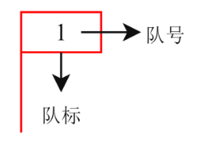
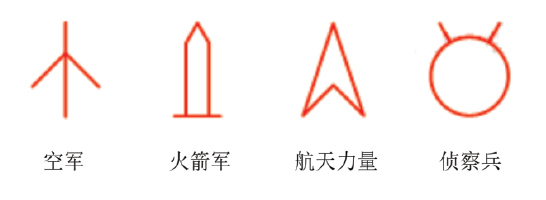
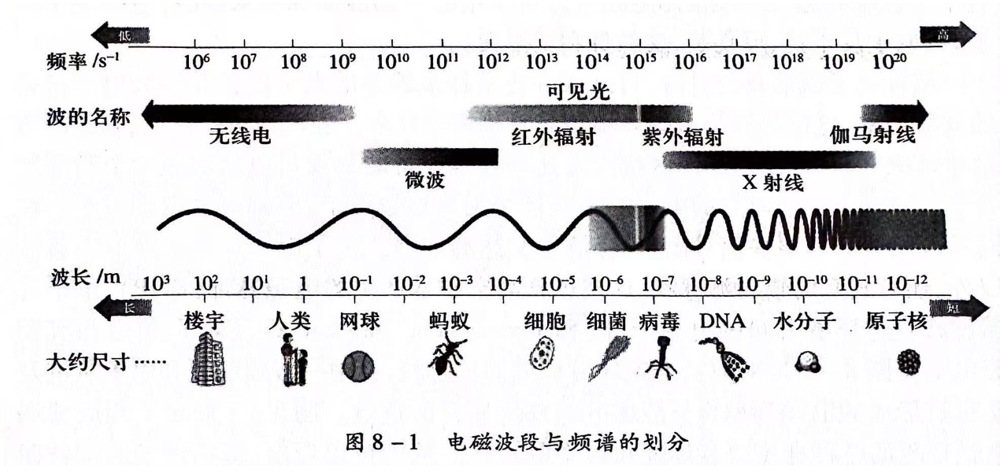
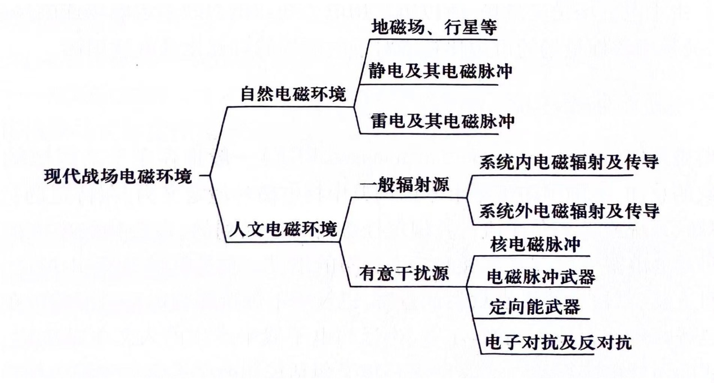
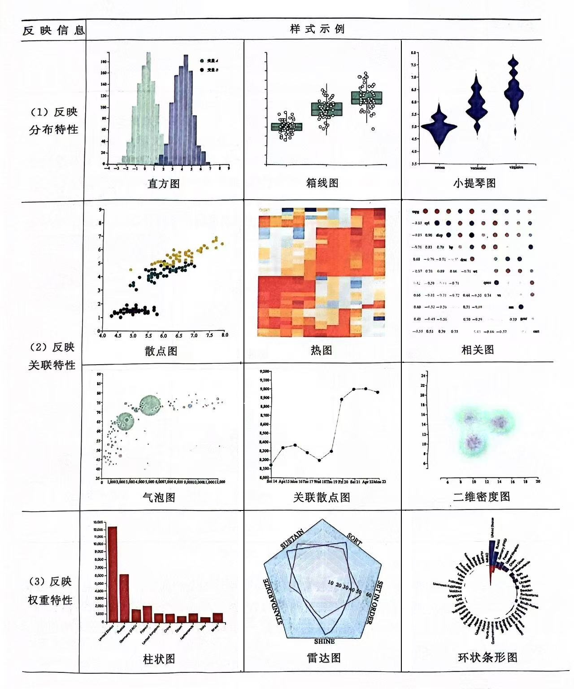
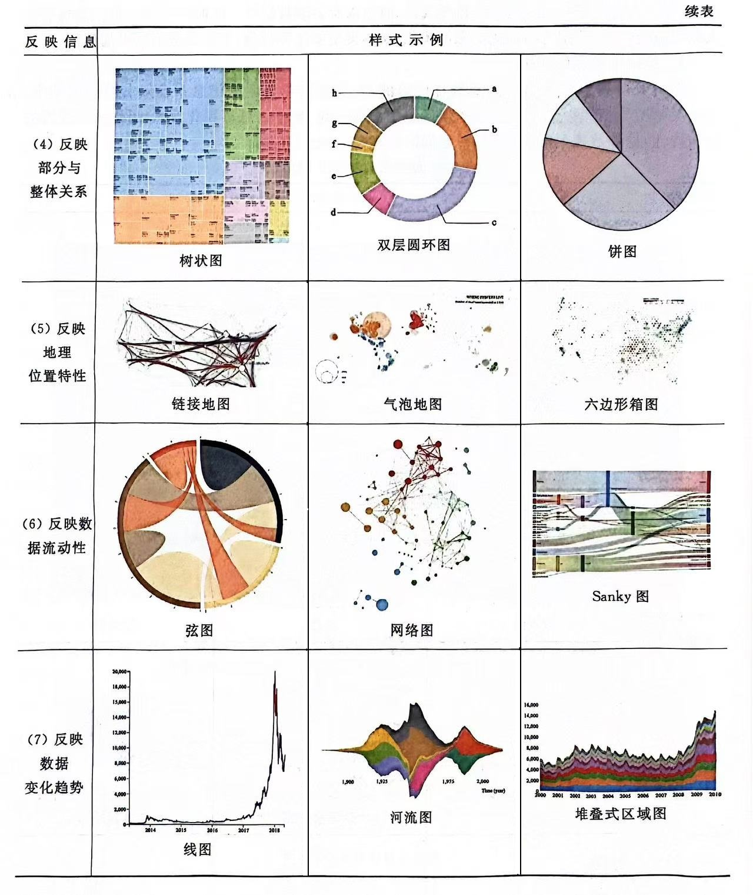

# 视景仿真与战场可视化

【摘要】视景仿真是计算机仿真技术的重要分支。战场可视化是军事信息系统和仿真系统的重要组成部分，是作战回路的重要一环。介绍战场可视化的相关概念。战场态势图是战场可视化的直观表现，通常在作战模拟系统中以显示子系统的形式来实现。同时，离不开地理信息系统（GIS）的支撑。了解虚拟现实技术和信息可视化方法。介绍战场可视化的相关开发工具和软件平台。

【关键词】 可视化，战场环境，态势，视景仿真，虚拟现实

【参考书目】

▲廖学军等编著，数字战场可视化技术及应用，国防工业出版社，2010.10

\[美\]William Sherman, Alan
Craig著，黄静，叶梦杰译，虚拟现实：接口、应用与设计（原书第2版），机械工业出版社，2022.1

吴家铸，党岗等，视景仿真技术及应用，西安电子科技大学出版社，2001.7

------------------------------------------------------------------------

## 概述

现代战争是陆、海、空、天、电、网一体化的联合作战，是基于信息系统的体系对抗。战场可视化是为方便军事人员认识、分析、理解战场环境和态势，采取信息技术手段对战场以可视化形式进行表达的一种方式。战场可视化已成为军事信息系统的重要组成部分，是作战回路的重要一环，是指挥员驾驭现代信息化战争的界面，在作战指挥、模拟训练、作战理论研究等领域都有广泛的应用。

### 战场的概念

战场（Battlefield）的定义：

战场是实施战斗行动的地域（地带、地幅）（苏联元帅 H. B.
奥加尔科夫，军事百科辞典，1985年）。

战场是敌对双方作战活动的空间，一般分陆战场、海战场、空战场和太空战场。大规模战争常有若干个按地区划分的相对独立的战场，如第二次世界大战中有欧洲战场、北非战场、太平洋战场等；中国人民解放战争中有东北、华北、西北、华中、华东等战场（中国人民解放军军语，1997年）。

联合作战战场，是敌对双方进行作战活动的空间，是双方力量体系进行对抗的"舞台"。它通常由自然环境、社会环境和电磁环境等多种基本因素组成（联合作战概论，2008年）。

战场的组成要素包括战场环境和战场态势两大类。

**1. 战场环境（Battle-field Environment）**

"环境"一词在《高级汉语大词典》中的解释为"周围的地方；周围的情况、影响或势力"，这是一个多意词。"战场环境"术语中的"环境"采用的是第二个词意，即战场环境为"占据战场空间的、对作战行动有制约和影响作用的客观要素"。

对战场环境包含"占据战场空间的"、、"对作战行动有制约和影响作用的"和"客观的"这三层约束，国内外的认识基本一致，但在这三层约束下战场环境具体包括哪些组成要素却存在分歧。共同点是都认为战场环境包括战场地理环境和战场气象环境，分歧点主要表现在以下四个方面：

（1）战场环境是否包括战场中的人文社会环境。人文社会环境是人类在自然地理环境的基础上，通过政治、经济、军事、社会文化等活动所形成的人文事物和社会条件，是对自然地理环境的改造和发展，对作战有重大的制约和影响作用。

（2）战场环境是否包括战场中不可见的物理场。战场物理场包括复杂电磁环培、核生化威胁危害区域等适合用物理学中"场"描述的内容。对战场环境的研究理应包括战场电磁等这些肉眼不可见但对作战有重要影响的物理场环境。

（3）战场环境是否包括武装人员和武器装备等实体。这是对战场环境理解上有最大出入的地方，国内外文献上讲到战场环境时，有的包含人员和装备，有的则未包含。从内涵上看，作战双方的武装人员和武器装备是战场中存在的客观要素，而且对作战行动有着最重要的制约和影响作用，依据战场环境定义它们应当包含在战场环境中。但是，部队和武器装备随着不同时期的战争或战争推进阶段动态变化很大，为了分类清晰和方便研究，战场环境中不应当包含这部分内容，将其独立出来，列入战场态势的研究内容。

（4）战场声、光、烟火等特效要素是否应包括在战场环境中。这类要素是战场上实体动作或实体间交互产生的效果，根据上述分析，同样应当将其独立出来，与武器装备一起纳入到战场态势的研究内容中。在战术对抗模拟中，这类要素对增加虚拟战场的逼真度和沉浸感具有重要影响。

综合上述分析，可给战场环境下一个较完整的定义：战场环境，是指占据战场空间的、对作战行动有制约和影响作用的客观要素。通常包括战场自然地理环境、战场人文社会环境、战场气象环境、战场电磁环境、战场核生化环境等要素。而且，随着新概念武器的作战使用，战场环境的外延还将进一步扩大，如战场网络环境将可能成为战场环境的一个重要组成内容。

**2．战场态势（Batlefield Situation）**

战场态势，亦称作战态势，指交战敌、我、友各方部队部署和行动的状态，它随着战争的不同形式或不同推进阶段而动态变化。战场态势是战场组成要素中最重要的内容，指挥员对战场态势信息的快速获取、准确判断、科学处置并定下作战决心，直接决定战争的胜负。

战场态势的描述具体包括交战各方的部队和武器装备等实体的部署、实体的行动以及实体间的交互等内容，往往需要地理环境要素（如纸质地图、二/三维电子地图）的支持。在军事指挥信息系统中，通常将战场态势要素作为单独的分量（图层）动态叠加到战场环境要素上进行表示。

战场环境和战场态势两类战场组成要素之间具有相互依存、相互影响的关系。任何作战都在一定的战场环境中展开，战场环境是敌我双方一切军事行动的依托和共同基础，制约和影响着战场态势的变化发展；相反，战场态势变化也在一定程度上改变着战场环境，如雷达装备的部署将改变战场的电磁环境。

总之，战场是交战各方作战活动的空间，它具有物理空间和组成要素两方面的属性。根据交战的物理空间不同，战场分为陆战场、海战场、空战场和天战场，而每类战场又由战场环境和战场态势两类要素组成。与此概念类似，美军采用"作战空间"（Battle
Space）术语，美国国防部《军事及相关术语词典》中将作战空间定义为：成功地运用战斗力保护部队或完成任务所必须了解的环境、要素及情况。包括作战区以及关注区内的空中、陆地、海洋以及太空；敌、友部队；设施；气象；地形；电磁波频谱以及信息环境等。

### 战场可视化

战场可视化是作战指挥信息系统的子系统。根据战场的组成要素，战场可视化的对象分为两类：一类是相对静态的战场环境；另一类是动态变化的战场态势。

由于两类对象的信息来源渠道和手段不同、可视化表达的技术方法也不同，战场可视化也就分为战场环境可视化和战场态势可视化。

作战行动需要全面、准确地掌握战场信息，战场可视化系统就是指战员与战场进行交互和了解战场信息的理想界面，它将可见的或不可见的战场信息转化为形象、直观的符号、图形或图像，是整个战场的完善映射，可准确呈现战场态势信息，为军事人员提供了极佳的战场态势感知和对战场信息进行深层次挖掘的工具，对取得信息优势具有重大意义。

在战场信息可视化对决策和遂行军事行动的价值方面，美军认为：当信息被放在能直接感知的、现实的环境中时，人们的观察力和想象力会得到提高，信息会更加有用和有效。以影像和地理空间信息为基础显示各种战场信息，将使决策变得相对容易，能调动决策者正常的观察能力和空间推理能力，尤其是对大量信息的综合、理解、分析和判断能力。信息可视化一直是军事胜利和高层决策的基石，可视化不仅仅是可视能力，还是理解能力、预算能力、概念形成能力的表示，把行动和决定可视化，是影响事物发展进程的必要步骤。一个分布式的、庞大而有序的可视化系统，能起到综合情报和其他数据的作用，可为各级指挥员甚至士兵提供一个通用作战图像。

### 视景仿真

视景仿真（Scene
Simulation）是计算机仿真技术的重要分支，是一种采用计算机图形图像技术，根据仿真的目的，构造仿真对象的三维模型或再现真实环境的计算机仿真技术。它充分利用人的视觉特性，通过三维图形的实时渲染为用户创造一个反映实体变化与相互作用的三维图形环境，以达到非常逼真的仿真效果。视景仿真的主要特点包括逼真性、交互性、可进入性和实时性。

"战场视景仿真"与"战场可视化"两个概念间有很多相近之处：目标一致，都是将战场环境以形象直观的方式表示出来；基本理论相同，本质上都是模拟仿真；数据基础相同，都是战场环境的数字化模型；技术手段相近，核心都是计算机可视化技术等。通常情况两个概念不需要严格区分，但细微处两者也有不同：

（1）应用领域不同称谓不同。在作战模拟领域，特别是武器平台模拟器系统中通常称"战场视景仿真"；而在指挥信息系统中通常称"战场可视化"。

（2）应用要求不同。战场视景仿真追求的是战场视觉感知的真实性，而战场可视化追求的是对战场空间信息的完整描述。战场可视化是战场真实视景与情报信息符号化表达的结合，战场中一些大量不可见、无形的重要信息，如境界、雷达探测范围等，必须在战场可视化中通过符号化的方法描述出来。

（3）数据源可能不同。根据不同的训练目的，战场视景仿真的数据源可以是模拟生成的战场环境数据；但指挥信息系统中战场可视化的数据一般都是某地区真实的战场环境数据。

### 数字地球

"数字地球"就是数字化的地球，它是利用数字技术和方法将地球及其上的活动和环境的时空变化数据,按地球的坐标加以整理，存入全球分布的计算机中，构成一个地球的数字模型。数字地球是对地球的三维多分辨率表示、它能够放入大量的地理数据。它是关于整个地球、全方位的GIS与虚拟现实技术、网络技术相结合的产物。

数字地球的核心是地球空间信息科学，地球空间信息科学的技术体系的核心是3S技术及其集成。所谓"3S"是全球定位系统（GPS）、地理信息系统（GIS）和遥感（RS）的统称。

### 图形学基础

战场可视化的实现离不开计算机图形学的支撑，在一定程度上可以认为，战场可视化是计算机图形学的一个应用领域，同时战场可视化的不断发展也拓宽了图形学的研究范畴。对于战场可视化而言，不一定应用非常复杂的图形学理论方法来追求高度的真实感，但是必须满足实时性的要求。因此，对于从事战场可视化的科学研究和工程应用来说，主要需要掌握图形绘制流水线、空间数据结构和层次细节的概念、原理与方法等。

图形绘制流水线基本原理的掌握可以揭示隐藏在各类开发接口之后的原理，是熟练进行战场可视化系统开发所必须掌握的基础知识，而其中有关图形变换和坐标系变换的部分更是关键中的关键；通过各类空间数据结构，可以有效地组织战场数据，结合流水线知识可以实现大量不需绘制内容的排除，是实现大规模战场实时可视化的关键要素；层次细节技术使得场景中单个实体以合适的几何对象规模进行显示，是战场中同一帧场景需要显示大量实体情况下实时性的保证。

**1．坐标系**

坐标系和矩阵运算是计算机图形学的数学基础，是很多计算机图形学算法最终的落脚点和具体体现。这里所说的坐标系是指笛卡儿坐标系，即直角坐标系，有X,
Y,
Z三个坐标轴，空间中的一点表示为从原点开始沿三轴到该点的距离。存在两种完全不同的坐标系：左手坐标系和右手坐标系。在实现战场可视化的过程中，需要用到多种不同的坐标系。

世界坐标系。世界坐标系是一个特殊的坐标系，它建立了描述其他坐标系所需要的参考框架。能够用世界坐标系描述其他坐标系的位置，而不能用更大的、外部的坐标系来描述世界坐标系。可以认为，世界坐标系所建立的是我们所关心的最大坐标系，而不一定是整个世界。在世界坐标系中，可以描述典型内容：每个物体的位置和方向，摄像机的位置和方向，地形，物体的运动等。

仿真中常用地心坐标系，它是原点位于地球中心点的笛卡儿坐标系，Z轴正方向指向北极点，X轴沿本初子午线方向，Y轴正方向指向正东90°。最常用的地心坐标系是基于1984年对地心、地表测绘数据的世界大地坐标系（WGS84），今天GPS卫星使用的也是WGS84。地心坐标系的测量单位是米，地球表面的位置被表示成离开坐标中心点的距离（X,
Y, Z）。

另一个为人熟知的坐标系是大地坐标系，它为所有对象指定纬度、经度和海拔高度坐标（B,
L,
H）。这是一个极坐标系，用从赤道和本初子午线起算的角度和一个海拔高度来表达位置。通用墨卡托投影是一个基于大地坐标系的网格投影系统，它将地球描述成一个巨大的迪斯科舞厅灯光球，每一个镜面都是一个独立的切面，该切面就是地球球面到二维地图平面的投影。该坐标系的在切面边缘的投影误差比切面中心大，因为投影变形主要发生在边界处。

其他还有物体坐标系、摄像机坐标系和屏幕坐标系。当要在坐标系之间进行转换视,很多环节会引入误差。

转换三维地球表面空间实体各要素到二维地图平面的数学处理方法称之为地图投影。平面坐标系是利用投影变换，将空间坐标（空间直角坐标或空间大地坐标）通过某种数学变换映射到平面上。我国基本比例尺地形图图采用高斯-克吕格投影（x,
y）。

2．二维图形生成与变换

传统的二维基本图形生成技术包括直线的扫描转换、圆和椭圆的扫描转换、区域填充、字符绘制、裁剪等。许多已经直接由API提供支持，可以直接调用。

图形变换一般是指对图形的几何信息经过几何变换之后产生新的图形。图形变换既可以看作是坐标系不动而图形变动，变动后的图形在坐标系中的坐标值发生变化；也可以看作是图形不动而坐标系变动。这两种情况在本质上是一样的。

3．图形绘制流水线

随着计算机图形硬件的飞速发展，基于GPU（Graphic Process
Unit）的图形绘制流水线（Graphics Rendering
Pipeline）成为实时图形绘制的核心，因而也是实现战场可视化的关键。

图形绘制流水线的主要功能就是在给定虚拟相机、三维物体、光源、照明模式以及纹理等诸多条件下，如何生成或者绘制一幅二维图像。首先是在世界坐标系下定义各个物体；在绘制中，需要定义视点的位置、视角、近裁剪平面、远裁剪平面等参数，这些参数结合在一起构成了视锥；经过绘制流水线的一系列变换，将场景绘制在二维窗口中。

可以将图形绘制流水线粗略划分为三个阶段：应用程序、几何、光栅化。应用程序阶段可以认为是整个程序最主要的部分，通过软件方式实现，包括交互、碰撞检测、动画、几何变换、视锥裁剪、场景数据采集等。而几何阶段和光栅化阶段全部或者部分建立在硬件基础上，可以通过调整其参数或者进行GPU编程，影响绘制的效率。

4．空间数据结构

空间数据结构的组织通常是层次结构，具有嵌套和递归的特点。使用层次结构主要是效率的原因。

包围体层次（Bounding Volume Hierachies,
BVH）就是包围体所形成的层次结构。包围体是包含一组物体的空间体，由于包围体一般选择简单的形状，所以使用包围体进行测试的速度要比使用物体本身快得多。

场景图是一种将场景中的各种数据以图的形式组织在一起的场景数据管理方式，它是一个树结构，根节点是整个场景，每个节点可以有任意多个子节点，每个节点存储场景的数据，包括几何物体、光源、相机、纹理、变换等。

5．层次细节技术

层次细节技术（Level of Detail,
LOD）的基本原理是利用透视投影的特性，距离当前视点越远的物体，其在成像平面上的投影面积越小，因而对远处的物体可以用较少的等效绘制元素来表现。

## 战场二维态势

态势是战争过程中敌对双方作战要素的部署和行动所造成的形势和状态的变换。态势图是态势的可视化表现形式，是指挥员进行决策和作战指挥的基础，传统上以二维平面地图作为态势表现的工具。

战场二维可视化是以军队标号为主要手段，综合利用图形、图像、二维动画等技术，在地图上把战场环境、对抗双方的部署和机动情况等作战要素展现出来，为指挥员指挥作战提供形象直观的帮助，可以作用与战斗的全过程。

现代战争是复杂条件下的一体化联合作战，是高技术武器装备体系之间的对抗，指挥员以及各类作战人员需要动态的实时战场通用态势图，增强战场感知能力，提高应急速度。

虚拟战场是未来一体化联合作战训练的支撑环境和信息基础设施，如何综合采用多种形式和丰富的手段来完整、全面、准确、及时地反映战场态势，是一个非常重要的问题。虚拟战场中的态势表现有面向指挥员把握战场总体情况的二维态势、面向武器系统操作员和观察者的三维态势、信息战场中传感器的电磁态势以及面向高层战略决策的多媒体态势等，有时这几种态势还互相融合。虚拟战场态势表现涉及到数字地图技术、三维建模技术、视景仿真技术等，技术复杂，开发工作量大。

### 地图及其军事应用

地图是按照一定的数学法则，使用地图语言，通过制图综合，表示地面上地理事物的空间分布、联系及在时间中发展变化状态的图形。

地图符号是地图的语言。地图符号本身可以说是一种物质的对象，用来代指抽象的概念，并且这种代指是以约定关系为基础的。这种约定，在某种程度上具有法定的意义，为人们普遍熟悉和认可。

地形图是按一定的比例尺，表示地物、地貌平面位置和高程的正射投影图。我国规定大于1:100万的普通地图统称为地形图。不同的比例尺，相应于不同的精度和详细程度，因而有不同的用途。在军事上，大于1:10000的地形图，主要用于军事基地、要塞等国防工程；更小比例尺地形图内容较为概括，精度相应降低，包括战术用图、战役用图、战略用图。

海图以海洋为主要表示对象，包括海岸、海底地质、与航行有关的要素及海洋水文、海洋化学、海洋生物等内容。航行图是海图中最重要的一类，详细表示与航行有关的细节，包括港湾、海岸、航海等。为了航行方便，海图通常都采用墨卡托投影，其最大特点是保持等角航线成直线。两极地区采用方位投影，目的是将大圆航线投射成直线。海湾图与陆地地图一样，采用高斯-克吕格投影或圆锥投影。

航空图是空中领航、地面导航和空中寻找目标的工具，可以利用航空图拟定飞行计划、确定航线、研究飞行区域并通过量算获得所需数据。在飞行过程中通过地面目标确定飞行位置和方向，并记录航线、确定飞行高度。

### 作战标图与军标符号

作战标图是军事标图的主体工作。作战标图的成果称为"要图"，是作战文书的重要组成部分。

**1. 作战标图的定义**

在地图等载有地形信息的载体上，用规定的符号和文字标绘有关军事情况的工作，称为军事标图。

军事标图可分为作战标图和非作战标图两类。作战标图可以定义为：在地形图等载有地形信息的载体上，用军队标号和文字标绘作战情况的工作。作战标图的这一定义，表达了三层意思：一是"在何处标"------地形图、地形略图、遥感图像、数字地图等载体，统称"底图"；二是"用什么标"------总参谋部颁布实行的"军队标号"；三是"标什么"------不同军兵种作战情况或联合作战情况。

在载有地形信息的载体上标绘有作战情况的图统称为作战要图，简称要图。

作战要图根据标绘内容和用途的不同可分为四种类型：（1）情况图，标绘有敌我双方态势、部署。（2）指挥图，标绘有指挥员决心、指示，部队行动，如首长决心图。（3）战况图，标绘有部队作战进展情况，如演习推演图、战例图等。（4）工作图。

**2．军队标号**

军队标号是军事标图的依据。由简单的线段、圆弧等称为图元的基本单位组成，并根据实际需要标注在军用地形图和其他形式的地图上，形成表示敌我双方的作战态势，战斗队形，首长决心，部队、武器装备布局等一系列与军事相关活动的态势图，是拟制军用文书、表达首长决心、记录战场情况、反映战场态势、组织指挥作战、总结作战经验的重要手段。

军标又称军队标号，是一个综合性的术语，包含队标和队号两方面内容。队标信息可以表达包括作战部队类型、指挥控制样式、武器装备型号、军用设施类型和作战行动在内的图形图标集合，而队号信息则是表达部队番号、级别、时间在内的文本代字说明集合。如图所示为队标标号示意图。

<figure>
  
  <figcaption></figcaption>
</figure>
<figure>
  
  <figcaption></figcaption>
</figure>

图 12‑1军队标号样例

以军队标号的颜色为例：标号的颜色通常使用红色、黑色、蓝色和绿色，特需要时加衬黄色或使用其他颜色。

标示我军的队标，除炮兵、防空兵、电子对抗兵、工程兵、通信兵和雷达兵用黑色外，均用红色（队号用黑色）；标示敌军的标号用蓝色；标示不明国籍或者中立国（地区）的标号用绿色；标示核、化学、生物武器与使用，以及核、化学危险源的队标，在队标内加衬黄色；标示不同作战时节情况的队标，可在队标内加衬不同的颜色加以区别；用一种颜色标图时，我军队标用单线，敌军队标用双线；标示不便区分敌对双方情况的标号，使用的颜色或线种，应以图例说明。

这些军标符号在军事活动中扮演着至关重要的角色，以规范性的图形符号形式，代表着特定的军事行动和意图。在作战筹划、行动部署以及指挥控制等环节中，军标符号的使用能够确保不同作战部队对同一作战行动、计划和态势有着一致的理解和认知。

为了规范军事活动中的标号使用，我国在1998
年签发实施了《军队标号规定》，其中详细列举了包括队标、代字、象形符号以及通用代字在内的共计870
个符号。随着军队标号体系的成熟，对军标符号也进行了升级换代，2013年10月重新修订和刊发了最新的军队标号规定。

规则军标是指那些其几何形状、尺寸比例以及各部分之间的相对关系均被明确规定的符号。这类军标在绘制时，通过图片、SVG
矢量图形等多种形式来实现。在实际标绘中可以直接使用，无需进行额外的计算或处理。如图所示的军标为空军、火箭军、航天力量、侦察兵，这些军标符号的设计和代表的军事意义遵循国家军用标准。

非规则军标是指具有特殊形状的图形，需要借助特定的算法来描述其图形特征，在可视化时可能会根据地图比例尺变化而变化。

**3．军标系统**

态势标绘是将战争过程中发生的情况用军队标号、文字、符号等形式标记在电子地图上的过程，即生成二维态势图的过程。二维态势图是军用文书的组成部分，具有形象直观、概括力强、简明易读、清晰醒目等特点。基于军用电子地图的态势信息具有可编辑、无极缩放等功能，使得对各种军队标号的定位点、颜色、大小、实虚要求等都可实时编辑，操作简便。

二维态势显示的目的是综合采用多种形式和丰富的手段来完整、全面、准确、及时的反映战场态势。

### 地图符号设计

地图符号实际上是空间点集在一个二维平面上的投影，它们都可以分解为点、线、面三种基本图形元素。目前，较为流行的CAD软件和GIS软件都具有地图制图功能。

AutoCAD是AutoDesk公司研制的通用CAD软件。其点符号采用形文件方法或块文件方法：形文件（SHX）方法，图素较为单调，只有直线、圆弧、拾落笔等，难以生成复杂的点符号，调用速度快；块文件（BLOCK）方法，可用AutoCAD的绘图功能生成符号，设计较为简单，可直接看到符号的设计效果，但管理和调用的效率不如前者。AutoCAD中的线符号包括通用线型和ISO线型。线型文件是一个文本文件，用户可以通过
LINETYPE 命令随时定义线型或在文本编辑器中直接编辑线型。AutoCAD
中的面符号采用阴影图案的方法实现。阴影图案由不同倾角的阴影族构成，但不能生成具有圆弧图形的图案。

ArcGIS
支持四种符号形式：阴影符号、线型符号、标志符号和文本符号。它提供了一些常用符号，用户可以用它提供的符号编辑器添加新的符号。每个符号集文件以二进制数据存放，包括了999种不同的图形符号。点、线、面以及文本符号分开制作和存放，对用户来说更加直接和透明，使用起来也更方便。

### 态势一张图

战场态势图是战场态势元素的有机组合，是在将多源态势信息进行时间同步和空间配准，并有序整合成唯一且无歧义态势的基础上，以一定的多维组织管理方式，确保态势信息在描述、存储、更新、查询和分发等过程中具有一致性。战场态势一张图是确保各级指挥员对战场态势理解认知一致性的基础，是实现联合情报精准保障的重要保证。

一张图概念有利于在多军种联合作战背景下保持对态势的一致性理解。美军于1997年提出共用作战态势图（Common
Operation Picture, COP）概念，旨在让所有人看到同样的战场视图。2003
年美军修订了COP 概念，改为用户定义的作战图（UCOP）。

传统的战场态势图组成要素包括战场环境、态势目标（敌情和我情）及态势分析结果（威胁等级、活动规律和趋势预测）等信息。战场态势一张图除了包含传统态势图的组成要素外，重点强化了态势分析成果、差异化展示和服务信息，如目标/目标群之间关联关系、关键节点、主题态势、整体态势和信源追溯等。同时，战场态势一张图还具备多样化的态势要素组织和展示形式，为各类用户提供多种形式的、差异化的和精准的情报产品。

战场态势一致性指作战单元获得的战场态势信息和真实战场状态的相符程度（绝对一致性），以及不同作战单元获得的共同关注作战区域的态势信息的相符程度（相对一致性），是战场态势一张图的核心。

战场态势一张图生成流程：1）对通过不同手段获取的各类原始情报信息进行多源融合处理，通过信息关联、目标去重和属性补全等实现信息全面和唯一的观测态势；2）在多源融合基础上开展态势目标分群处理，基于目标的属性、位置和任务等开展相关性分析和聚类分析；3）开展态势分析处理，重点是态势和趋势估计，通过关联印证、演变分析、异常检测、规律统计、语义分析、数据挖掘和威胁估计等手段，形成当前、估计和预测态势；4）开展战场态势体系化分析，包括体系节点分析、任务主题分析和综合态势展现处理等，生成体系态势信息；5）提供态势信息服务，针对不同用户和任务的差异化需求，对态势信息产品进行合理组织、准确显示和按需分发，实现重点突出和全面精准的战场态势一张图服务。

### 战场态势可视化

军事标图是记录军队部署和行动的地图和图上军队标号的总和，通常包括作战情况图、决心图、计划图、经过图等。主要用于标绘作战行动情况，也可用于标绘其他军事行动情况。军事标图能够简明扼要、形象直观地体现上级意图、本级决心和反映重要军事情况，是作战指挥重要的技术支持手段。

战场态势可视化实质上是指挥信息系统中的自动化作战行动标图，是目前军事标图最重要的一种应用和形式。任何指挥信息系统或作战模拟系统中都有一个功能强弱不等的战场态势可视化显示子系统，战场态势可视化子系统在作战中某一时刻或阶段的输出即为战场态势图（Battletield
Situation Map，亦称作战态势图）。

战场态势可视化的主要功能就是用形象直观的图形及轨迹曲线、表格等方式表示交战各方的作战情况，以辅助指挥员对战场情况的实时准确把握。由于战场态势可视化的不同应用会导致关注重点、二维或三维显示、情报表示的粒度等方面的不同，因此，战场态势可视化系统的设计要针对不同用途和特点区别对待，有所侧重，既要注意功能的完备性，又要注意实用性，以达到最佳的应用效果。

分析作战指挥特点、作战态势显示应用情况及当前技术发展水平，可以总结出战场态势可视化的几点共性需求：

（1）具有作战想定、企图预案等可视化的功能。

系统能够通过自动或手动方式依据作战想定或实际作战部署标绘形成初始态势。初始态势是战争或作战模拟推演的初始条件和起点，在此基础上可以进行作战方案的研讨，并根据实际交战过程情报或作战模拟推演信息进一步标绘作战过程（阶段）态势图，以进行作战指挥并记录战争某一时刻或阶段的真实情况。

（2）具有二维、三维结合的战场态势显示功能。

二维态势是在二维电子地图的基础上叠加实时、动态变化的军队标号以及轨迹曲线、表格等军事情报信息形成，二维态势图通常包括整个战区范围，注重全局性地掌握双方交战的情况；三维态势通过在真实感三维地形上叠加各种武器平台实体模型及实体间交互信息的方式实现，通常用于逼真地显示战术或感兴趣的局部战场区域情况，在武器操纵类模拟训练系统中，三维态势作用更加突出，此时，二维态势主要起导航的作用。实际的指挥信息系统中，二维态势显示是必须的，而三维态势显示往往是可选的。

（3）具有综合多种手段全面、准确、及时地反映战场态势变化的功能。

这些手段包括：军标动画（即态势演播，以动画的方式动态地模拟军事行动和作战的进展情况）、实体运动轨迹和参数变化曲线等图形方式；作战行动效果、当前双方的实力和战损情况（人员、装备）统计表格方式；关键事件报告、作战时间等文字方式；热点区域三维场景显示等。

各种表现形式所显示出来的战场态势信息是取长补短的。数字表格具有数据量大、信息丰富、数据准确、实时刷新的特点，但其缺点是不够直观，不能清晰地展示其变化过程；按颜色区分的军标与轨迹显示在电子地图上可以直观地表示运动实体的位置、航向和目标捕获情况，能够给人感性化的认识，但参数的准确性欠佳。

统计图形或曲线则清楚地显示出人们感兴趣的目标参数的变化过程。轨迹与曲线恰好弥补了数表显示的不足。例如，空间态势系统中，红、蓝、绿各方航天器的轨道参数与传感器战技指标参数表格显示、航天器实体军标与航迹的图形显示、航天器对目标侦察监视时间和次数统计图形显示三者间就有很大的互补性。

但特别需要注意多种表现形式之间的一致性，即多种表现形式所表达的意义之间是不矛盾的。具体工程中，可以采用共同事件驱动技术及多屏显示、动态开窗口、静态切分窗口（如三切分窗口，分别显示运动实体的数表、曲线以及电子地图上的轨迹）、状态栏显示关键事件（如导弹发射，雷达、机场被毁伤）等技术来实现一对多的视图显示，达到理想的表现效果。

（4）具有态势信息分层分类控制的功能。

分层分类控制可以显示诸军兵种协同作战行动的综合态势，也可单独显示某一军兵种甚至战术单元的情况，并随意组合叠加，以满足不同层次和不同内容战场态势掌握的需要。分层分类控制也能对战场信息进行"过滤"，控制同时展现在用户面前信息的总量。例如，空间态势显示中，若将世界二维或三维地图、各类航天器、恒星和空间碎片、各种地面站、点或面状目标、航天器轨道、航天器星下点轨迹、航天器（侦察、通信、导航）覆盖范围、地面站作用范围等全部空间战场信息显示在态势图上，将是复杂、混乱和不可用的，必须针对作战时段、关注的敌我对象进行分层和分类的组合控制显示。

实际工程中，按使用对象级别不同，军事标图按战役、战术级别作战指挥分别实现，两者间的主要区别是军事信息显示的范围和粗细不同，包括地理信息的区域和精度不同、军事情报信息融合的粗细不同，如防空作战中，战役级军事标图就不关注具体每一批战机的信息，而将一个方向或一个机群情况聚合为一个整体情报。

（5）具有图上作业分析和信息查询功能。

图上作业分析是指具有军事意义的空间信息量算和分析，如坐标（作战方格、经纬度）量算、高程测量、距离量算、面积量算、网络分析、三维通视分析等。

信息查询主要包括态势图上军标和军事目标数据库间、实体轨迹和数表间的联动查询的两类。通过点击态势图上部队或武器装备军标，可实时从军事目标数据库中查询出战技性能指标、作战方式及特点等信息。

军事目标数据库通常存储交战双方的作战部队编成、武器装备性能等数据。其中，部队作战编成数据指部队平时基础建制的数据，包括各级机构组成、人员武器配备等；武器装备性能数据是指各种作战武器及装备的性能参数，包括作战性能（射击反应时间、射击方式、射击范围、弹丸或导弹的飞行时间、命中和毁伤概率等）、机动性館（机动方式、越野越障能力、最大行程等）、防护能力（有无装甲、装甲等级、三防能力）、电子装备性能（电台、雷达、光电设备、侦察与干扰装备）等。军事目标数据库是作战指挥中重要的"知己知彼"手段，也是作战模拟中军事模型推演运算的基础。

（6）具有作战态势信息交换的功能。

作战态势信息交换可以在上下级和军兵种各级指挥所间进行。态势信息交换有实时态势信息交换和态势文件交换两者基本方式，实时交换是在联网的状态下进行的异地协同态势标绘和编辑（如三军联合标图），文件交换是指生成标准态势交换格式文件后以文电的方式进行收发（如方案上报或指示下达）。

（7）具有接口规范和用户交互界面友好的功能。

战场态势可视化系统总是与指挥信息系统或作战模拟系统紧密相联，是战场情况的全面映射，也是指挥员与战场间交互的界面。一方面，它将来自不同战场区域、自然环境或态势感知情报信息、有形或无形（境界、作用区域）等战场信息转化为容易理解的图形或符号；另一方面，接收来自指挥员的命令并将之传达到战场，从而影响战争的进程。

## 作战建模中的GIS

地理信息系统（Geographic Information
System，GIS）是一种跨学科的研究领域和技术体系，它综合了地理学、地图学、计算机科学、数学、统计学等多个学科的理论和方法。与地图相比，GIS具备的先天优势是将数据的存储与数据的表达进行分离，因此基于相同的基础数据能够产生出各种不同的产品。

地理信息系统（GIS）作为构建战场态势可视化系统的核心组件，具有存储、查询和分析空间数据以及支持态势信息可视化表达的功能。GIS已广泛应用于军事领域，如作战以及非战争军事行动（OOTW）。这些系统通常与指挥控制系统相关，访问多种不同格式的大型GIS数据库。指挥员可以选择所要查看的数据图层，以辅助他们针对当前的军事行动作出决策。然而，在作战建模与仿真领域，仿真可能要求提供不同的数据，或者内容相同而格式不同的数据。GIS数据需求的不同在两种系统中非常明显。

### 地理空间数据

地理信息系统是一种特定而又十分重要的空间信息系统，它是以采集、存储、管理、分析和描述整个或部分地球表面与空间和地理分布有关的数据的空间信息系统。地理信息是指与所研究对象的空间地理分布有关的信息，它表示地表物体及环境固有的数量、质量、分布特征、联系和规律。

地理信息系统是在计算机地图制图的基础上发展起来的，地理信息系统应该包含数字制图系统的所有功能，此外还应具有丰富的空间分析功能。地理信息系统与一般的数据库管理系统的主要不同在于，地理信息系统除了需要功能强大的空间数据管理的功能之外，还需要具有图形数据的采集、空间数据的可视化和空间分析等功能。

地理数据主要包括空间位置数据、属性特征数据及时域特征数据三个部分。空间位置数据描述地理对象所在的位置，这种位置既包括地理要素的绝对位置（如大地经纬度坐标），也包括地理要素间的相对位置关系（如空间上的相邻、包含等）。属性数据有时又称非空间数据，是描述特定地理要素特征的定性或定量指标，如公路的等级、宽度、起点、终点等。时域特征数据是记录地理数据采集或地理现象发生的时刻或时段。空间位置、属性及时域特征构成了地理空间分析的三大基本要素。

地理信息是地理数据中包含的意义，是关于地球表面特定位置的信息，是有关地理实体的性质、特征和运动状态的表征和一切有用的知识。作为一种特殊的信息，地理信息除具备一般信息的基本特征外，还具有区域性、空间层次性和动态性等特点。

地理信息系统与军事应用相结合，产生了军事地理信息系统，发挥着巨大作用。对于一般的二维态势显示，只是利用电子地图作为态势信息显示的底图。但是目前的GIS系统提供了功能强大的二次开发接口，可以实现图层控制、地图缩放等功能，可以方便在地图上加入所需的图标或运动轨迹等。

GIS数据是构建训练仿真虚拟环境的主要起点。为了使训练效果更好，需要使虚拟环境尽可能逼真。为此，GIS系统会收集现实世界的数据，然后将其转换成训练仿真系统使用的格式。通常，仿真使用的GIS
数据包括高程、土壤类型、水体、路网、建筑物以及其他任何在仿真训练中不会移动的地理要素。有时仿真还需要使用环境GIS数据，如湿度、风速风向、光照、盐度、浊度甚至是太阳辐射度。

所有这些不同的GIS数据都需要统一使用一种可用的格式，以便仿真能够在训练过程中识别和理解。常用的GIS
数据基本类型是栅格数据、不规则三角网和矢量数据，每一种数据格式都有其自身独特的优势和不足。

另外一种用于仿真的数据格式是三维对象模型，建筑、独立树等。大多数三维模型包含一个三维顶点集（X,
Y, Z
坐标）、邻接关系信息以及多边形地表信息，如该多边形使用哪种图像纹理。三维模型一般包含在一系列特定的数据文件中，这些文件包括数学数据和所描述对象的地面图像纹理。通常，在GIS数据库中存在指明三维模型位置点的矢量文件，其方向存储在数据库中，文件的名称和位置用于对象的可视化。很多三维模型文件格式是Open
Flight、GoogleSketchup和Autodesk的3DS。Open
Flight似乎正在成为仿真领域中三维地形和模型数据的非正式工业标准。

### 开发平台

目前的地理信息系统商用化发展很好，应用比较广泛的GIS集成开发平台包括MapGIS、ArcGIS、MapInfo
等，下面简要介绍 MapGIS和 ArcGIS两个系统的情况。

（1）MapGIS。MapGIS是中国地质大学开发的地理信息系统基础软件，在地图编辑出版系统
MapCAD的基础上发展而来，包括输入、图形编辑、空间分析、输出等。

（2）ArcGIS。ArcGIS是由美国环境系统研究所公司（ESRI）开发的地理信息系统产品。它是建立完整地理信息系统应用的一个软件产品集成。

GIS系统经常使用到的一些空间数据标准格式，如Shapefile, DXF, DWG, DGN,
ECW, TIFF, JPG2000, KML, GML等。

地理信息系统也进入了互联网时代，WebGIS
使用HTTP协议把地理信息的相关的空间数据发布为服务，进而实现数据共享，属于B/S（浏览器/服务器）架构。服务端向浏览器客户端提供信息和服务，浏览器客户端获得服务和数据并完成相应的功能。

Cesium 是国外一个基于JavaScript 编写的使用WebGL 的地图引擎。Cesium
支持3D/2.5D/2D
形式的地图展示，可以自行绘制图形，高亮区域，并提供良好的触摸支持，能支持绝大多数的浏览器。Cesium
的实现遵照GIS行业的规范，既支持公有数据的访问也支持私有数据的访问，支持开放地理空间联盟（OGC）的Web地图服务（WMS）、要素服务（WFS）、覆盖服务（WCS）等网络服务标准。

下列 GIS 工具用于建立和捕获影像：

● ArcMap: http://www.arcgis.com/home/

● Global Mapper: http://www.globalmapper.com

● Google Earth: http://www.google.com/earth/index.html

● Google Sketchup: http://sketchup.google.com

● VR-Vantage：http://www.mak.com

## 战场环境可视化

战场环境可视化包括战场地理环境、战场气象环境、战场物理场环境等信息的可视化。

（1）最基本的是战场地理空间环境的可视化。应用上，任何作战都是在一定的战场地理空间中进行，对战场地理空间的分析研究是指挥作战必须首先开展的工作，战场可视化必须首先实现战场地理空间环境的可视化；技术上，战场地理空间环境的可视化是其他战场环境要素可视化叠加显示的基础。因此，战场地理空间环境的可视化是战场环境可视化最基本的内容。

（2）具有二维、三维相结合的战场环境可视化功能。二维可视化对真实战场进行了综合，显示区域广，可以使指挥员从宏观上掌握整个战役战场的全貌情况；三维可视化形象直观，可以使指战员从微观上分析研究战术战场的精确情况。因此，战场环境可视化系统中必须综合
2D/3D 的优点对战场环境进行高效显示。

（3）城市、交通等人文社会环境可视化功能重要。由于世界性的城市化发展趋势，城市作战的特殊性和复杂性，城市环境对军事行动的影响远大于一般地形环境的影响，因此，城市可视化在整个战场环境可视化中占有重要地位，应特别强调系统对城市的空间结构和建筑特点等环境的可视化能力。

（4）具有可选的战场气象环境可视化能力。由于气象条件对军事行动的重要影响和制约作用，指挥员都十分重视掌握战场气象环境信息。战场环境可视化系统可在三维地理环境可视化的基础上选择性地叠加显示气象数据可视化信息，如以箭头表示风力、风向，以不同的颜色表示温度或湿度，用粒子系统模拟雨雪等，同时还应以光照度及背景颜色的变化模拟出白天、黑夜的时间变化。

（5）电磁环境可视化也是一项重要可选内容。一是复杂电磁环境对信息化战争的影响作用越来越大，要求指战员必须掌握战场电磁辐射源、辐射类型和参数、辐射影响范围等复杂电磁环境信息；二是技术上已能够建立雷达、通信等电子装备的较准确的电磁辐射模型，而且可以用形象直观的图形方式表现这些不可见、无形的电磁辐射影响范围信息。因此，战场环境可视化系统需要具备可选的电磁环境可视化功能。

（6）提供战场环境信息分析与查询功能。可视化可以向使用者传达形象直观的战场环境信息，再加上完善的信息分析与查询功能，将可以向用户提供对数据信息进行更深层次挖掘的工具，同时能够弥补图形表达中一些难以克服的缺陷。

### 虚拟战场环境

虚拟战场环境（Virtual Battlefield
Environment）就是在战场环境时空信息数字化的基础上，利用虚拟现实技术模拟出可感知的、可度量的、直观逼真的虚拟作战环境，用于辅助军事人员认识战场和分析战场。其内容包括对战场环境的视觉、听觉、触觉等多种感觉通道的仿真，实现亲临战场的感觉。

战场视觉仿真通常也称"战场视景仿真"或"战场可视化"，是感知仿真中的一种主要形式，是将战场环境中的要素以三维立体的或二维的图形图像表达出来；战场听觉仿真是指通过对战场中各作战单元声音（音效、音量和音位）的模拟来营造战场气纸；战场触觉仿真是指通过对人机交互设备的操作来实现人与环境的交流，是使参训人员产生临场感的重要手段。

同普通虚拟现实系统一样，虚拟战场环境也需要具备三个基本特征：交互性（Interaction）、沉浸感（Immersion）和想象力（Imagination）。

（1）交互特征是指系统具有对人机交互作出响应的能力。衡量这种能力的标准是系统处理和显示环境图像的刷新率（帧/秒），刷新率越高，表明系统对交互作出的响应越快，当交互响应达到实时，在视觉上就表现为场景随交互过程而连续平滑地变化，当交互响应存在延时，在视觉上就表现为场景的停滞和抖动变化。由于战场环境的复杂庞大，故战场场景的实时生成和显示已成为衡量虚拟战场环境系统优劣的重要技术指标。

（2）沉浸特征是指系统高逼真的声像效果，使用户产生置身于虚拟战场中的感觉。生成具有生理视差的立体视觉效果场景（双目立体视觉）和实现喧嚣的战场音响是产生
"沉浸感"的关键因素。

（3）想象特性是指虚拟战场环境高超的创意可以引发参训者心灵上的震撼。这种想象力体现在人机界面的构想、场景表达的构想以及是否提供对战场环境的再创建手段等方面。

虚拟战场环境是一种高级的战场环境仿真，其主要特点是"可进入"。通过展现真实感极强的战场景观，使我们可以从计算机的显示器上"走进"虚拟战场，真实、生动地扫视战场全貌或勘察战场的每一个角落，既可以看到山峦沟壑，也可以感受到战火纷飞、硝烟弥漫。与传统的通过地图、实物沙盘或影像资料等来了解战场的认知方式相比，在虚拟战场环境系统中参训人员不是被动地观察人工环境，而是可以主动地在逼真的环境中进行交互，从而大大地提高战场认知的效率。

### 战场地形

地形可视化是数字化战场的重要内容。美军国防部在地形建模与仿真执行主计划中这样定义"地形"：地形是对地球表面的外形、组成及其特性的表示，包含地貌、自然特征、永久或半永久的人造特征，以及动态过程对地形的改变效果。

地形构成战场自然环境的主体，是敌对双方的军事思想、作战意图、武器装备、作战编成、作战形式和作战手段在一定时间集中较量的场所。在所有影响战斗的自然条件中，地形条件对实施战斗的影响最大，地形既可能提供有利的条件，又可能造成意想不到的困难，从而导致不同的对抗结果。在整个战场可视化体系中，地形可视化是陆地战场可视化中的重要组成部分，占据着不可替代的关键地位。

地形模型是对真实地形属性的一种抽象和简化的表达。地球表面包括内陆水域和近岸、深度小于20m范围内的海底曲面，不包括海洋、大气、沿地面运动的非永久物体。

数字地形的表达可以分为两大类，即数学描述和图形描述。使用傅里叶级数和多项式函数来描述地形是常用的数学描述方法，规则格网、不规则格网、等高线、剖面等是图形描述的常用方式。

地形模型是军事人员、规划人员、土木工程师和地球科学等许多学科的专家所要求的。数字地面模型（Digital
Terrain Model,
DTM）是利用一个任意坐标场中大量选择的已知X、Y、Z的坐标点对连续地面的一个简单的统计表示，或者说是地形表面的数字表示。

除了数字地面模型之外，还有德国使用的数字高程模型（Digital Height Model,
DHM）、英国的DGM（Digital Ground Model）、美国的DTEM（Digital Terrain
Elevation Model）等，实质上差别很小。

要想进行地形可视化，首先需要有地形数据。但是在实际应用中，往往因为各种原因，而缺乏数据，或者为了给使用者更多的体验，如在作战模拟中，往往需要令受训者尝试在各种地形条件下进行训练。以上情况下，都需要模拟产生地形。

地形仿真主要用于两种情况。一是根据地学图形数据的精确描述，进行真实地形的仿真，如根据地形特征参数生成地形，这些特征参数包括高程、最大/最小高程及其位置、高程标准差、相关长度、地形粗糙度等。这种地形的生成通常是在给定一定的地形特征或地形参数条件下，通过模拟符合地形的统计特征的随机过程，即用计算机自动产生符合要求的真实的三维地形。二是模拟自然场景中的地形，常用于具有真实自然视觉效果的虚拟环境中。这种方法不需要针对某个特定地区的地形来进行仿真，而是希望可以灵活地生成不同特征的地形以满足不同的需求或者是为保证整个虚拟环境的真实感，因此，这种方法评价的唯一标准是视觉上的可接受程度。

目前实际所应用的地形模型主要是规则格网DEM，这样的一个地形模型可以看作是一个二维数组或者高度图，而地形模拟的目的也在于生成这样的一个二维数组。

具体的地形模拟技术、地形绘制技术不再赘述。

### 战场实体

为了构建一个可视化的陆、海、空、天、电一体化综合数字战场，给指挥员创建一种较为真实的战场态势，不仅要有各种战场环境的可视化表示，还必须对处于各个不同空间域的战场实体进行建模与可视化。根据战场实体分布的空间域不同，可以将其分成地球战场实体和空间战场实体两大类。地球战场实体包括陆地战场实体、空中战场实体和海洋战场实体。其中空中战场实体主要包括各种飞机、飞艇等，海洋战场实体主要包括各种舰艇、航空母舰、潜艇等，而陆地战场实体所涵盖的内容很多。空间战场实体主要包括各种卫星、航天器和空间武器等，由于这些实体的运行与地球战场实体的运行原理不同，因此，在对其进行建模与可视化时要考虑用不同的方法。

1\. 战场实体类型

地球战场实体中包括陆、海、空三种不同类型的目标实体。其中陆地战场实体包含的种类最多，也最为复杂。根据不同的划分原则，陆地战场实体有不同的分类方法。依据地物的几何特征，可将其分为点状地物、线状地物和面状地物。点状地物包括建筑物、独立地物、交通工具、人等；线状地物包括道路、河流、管线等；面状地物包括湖泊和海洋、大面积居民地、面状植被等；依据地物的成因，可将其分为自然地物和人工地物。

2．战场实体建模技术

战场实体建模技术是实体可视化的基础。在可视化战场的构建中，只有通过对战场环境中的对象进行合理分析，对各种战场实体要素进行三维建模，才能利用可视化技术来实现战场实体的三维景观再现。对每一种虚拟实体而言，不只要求所显示的对象在外形上与真实实体相似，而且要求它们在形态、光照、行为能力等方面尽可能逼真。为了达到上述要求，在技术实现上主要包括几何建模（Geometric
Modeling）、行为建模（Kinematic Modeling）和物理建模（Physical
Modeling）等。

其中物理建模是对实体的重量、惯性、硬软度和表面变形等物理特性的描述，即主要是描述实体的反应能力，如实体交互而产生爆炸、变形、声响等，是增强可视化效果，提高虚拟现实的有效手段，是更高层次的建模。

对象的几何建模是用来描述对象内部固有的几何性质的抽象模型，包括：对象中基本的轮廓和形状，以及反映基本表面特点的属性，如颜色；基元间的连接性，即基元结构或对象的拓扑特性；应用中要求的数值和说明信息。简单地说，几何建模主要有两部分工作，即构造对象形状和对象外表。对象形状可以通过PHICS、Stardase
或 GL、XGL 等图形库创建，也可以使用如 AutoCAD或3D Max
等CAD软件交互建立，也可以通过专门的视景仿真建模工具建立，如MultiGen、Vega
等。虚拟对象外表的真实感主要取决于其表面反射和纹理。纹理中的最小元素是纹理元素（Texel），每个纹理元素由红、绿、蓝、亮度和透明度Alpha组成。纹理可以通过图像绘制软件交互地创建编辑和存储，如
Photoshop；还可以先用相机拍下所需的纹理照片，然后扫描得到。

目前，三维景观建模技术主要分为基于图形和基于图像的建模技术两大类。

基于图形的三维建模技术是面向景物的几何模型的，其基础数据是景物的矢量几何数据。基于图像的三维建模技术则是通过一些预先生成好的图像（或环境映照）来生成不同视点处的场景画面，其基础数据是预先生成的栅格图像数据。

3．行为建模

空间物体的行为特性涉及到位置改变、碰撞、捕获、缩放、表面变形等。物体位置包括物体的移动、旋转和缩放。运动实体是指在环境中能够自主运动或者被动受控运动的实体，它可以主动与其他对象进行碰撞，也可以被其他对象碰撞并进行一定的响应。对这些运动实体，除了需对其进行外形、质感等表观特征描述的几何建模外，还要进行运动行为建模（Kinematic
Modeling）。

行为建模是对实体运动和行为的描述，即赋予实体"与生俱来"的、服从客观规律的行为特征。几何建模与行为建模结合才能真正使实体"看起来真实、动起来也真实"。实体行为建模主要包括运动建模、碰撞检测、地形跟随等内容。运动建模又分为简单的运动学轨迹插值和完善的系统动力学仿真两类；碰撞检测是指检测场景中实体之间相互穿越（碰撞）的方法和技术，若不进行实体间的碰撞检测就会出现两个实体相互穿越的现象，破坏视觉效果并产生不真实感；地形跟随是实体运动过程中需要根据地面的高低起伏调整相应的姿态（如高程变化、水平偏转、前后俯仰、左右倾斜等）。

尤其是在空间战场中，各种空间实体是按照一定的天体力学规律运动的，其行为特征更明显地表现为其轨道和姿态特性。

碰撞检测问题基于现实生活中一个普遍存在的事实：两个不可穿透的对象不可能共享相同的空间区域。碰撞检测对提高虚拟环境的真实性、增强虛拟环境的沉浸感有着至关重要的作用，而虚拟环境自身的复杂性和实时性又对碰撞检测提出了更高的要求。

层次包围盒方法是解决碰撞检测问题固有时间复杂度的一种有效的方法，它是用体积略大而几何特征简单的包围盒来近似描述复杂的几何对象，并通过构造树状层次结构来逼近对象的几何模型，从而在对包围盒树进行遍历的过程中，通过包围盒间的快速相交测试来及早地排除明显不可能相交的基本几何元素树，而只对包围盒重叠的部分元素进行进一步的测试，以提高碰撞检测的速度。

4．网络三维可视化技术

网络三维可视化技术就是利用一定的技术手段将建立的三维战场模型在网络上发布，并且能够与用户交互操作，实现模型的浏览、分析。

在3D开发环境中，常见的API包括OpenGL、Direct3D、Quick Draw
3D等。基于Web的三维可视化主要有几种方法：ActiveX控件、Java和VRML等。下面着重介绍
VRML 技术。

VRML
是一种有效的3D文件交换格式，是可内置于浏览器中的插入式软件，用VRML格式设计的3D虚拟景观描述文本文件（.WRL）是HTML
的3D模拟，是一种可以发布的3D网页的跨平台语言。

利用
VRML，服务器端可以按用户的请求，抽取数据库服务器中的地理信息空间数据，使用Web
三维可视化创作系统，将空间数据转化为VRML格式的文本交换文件，并传输至客户端，由客户端的
VRML 插件执行，显示生成3D动态虚拟场景，供用户交互、浏览。用户下载 VRML
文件，启动后所有的交互操作场景显示均由客户端浏览器中内置的VRML
插件执行完成，不再与服务器做新的数据传输的通信。与图像文件比较，VRML描述文件数据量很小，且只需传输一次，因此，大大减轻了客户机与服务器之间的通信负荷。同时，用户所作的三维可视化图形的交互操作只在客户端计算、运行，大大提高了执行速度。

VRML
定义了三维应用系统中常用的语言描述，如层次变换、光源、视点、儿何、动画、材料特性、纹理等，并具有行为特征的描述功能。用户使用
VRML
的语法规则、场景图层次结构、节点描述，结合地理信息的三维特征，构造出地图符号，地理要素对象（如DEM
高程数据、建筑物等）的几何造型、坐标、材质、纹理，灯光、摄像路径等内容的
VRML组织描述文本。按VRML的文件格式、层次结构、语法形式将地图上的三维符号对象集成为一个完整的VRML
格式的文本描述文件（扩展名为.WRL），供浏览器中内置的 VRML
插件解释、执行。

在VRML 中，虚拟场景用场景图（Scene
Graph）来描述，场景图的基本单元称为节点，这也是VRML
文件最基本的组成部分。文件的主要内容就是节点的层层嵌套以及节点的定义和使用，由此构成整个的虚拟世界。

### 电磁环境

1\. 概述

随着电子技术和信息技术的突飞猛进，电子战已经成为信息化条件下战争中的一种重要对抗形式和手段，复杂电磁环境成为战场环境的一个重要组成部分。

复杂电磁环境实质上是战场信息所依存的主要媒介，大部分战场信息的获取与传输都在该域内完成。与其他各域相比，电磁环境具有鲜明的特点：一方面，电磁环境是不可见的，指挥员在基于作战态势图进行决策时往往容易考虑那些可见的元素而忽略电磁环境的影响；另一方面，战场电磁环境随着武器装备的演化正变得日益复杂，对于电磁环境的忽略可能会导致装备的性能损失甚至失效，从而影响作战任务的达成。正是在这样的背景下，对于战场电磁环境的可视化成为战争模拟与战场环境仿真中的一个重要环节。

自20世纪初以来，电磁波已经成为战场信息的最佳载体和重要媒介。通信、雷达、光电以及火控制导、电子对抗等各种电子系统，在战场上各显神通，一个崭新的维度------电磁空间的出现拓展了传统的战场空间，电磁环境成为从根本上决定和影响其他战场实体发挥作用的重要因素。

电磁辐射特性是物体的基本属性。任何物体都具有特定的辐射特征，表现在对辐射的发射、反射、吸收、散射和偏振（或极化）等特性上。辐射自身的基本表征量是强度（功率）和波长（或频率），可以利用这两个基本量表征物体的上述五种基本的辐射特征。

电磁波是电磁辐射的产物，它是一种横波，可以用麦克斯韦方程组来描述。电磁波按波长可以划分为无线电波、微波、红外、可见光、紫外、X射线等多个波段，各具用途。在自由空间，电磁波的电场和磁场相互垂直耦合，所以只要知道一个场的方向和强度，便可利用麦克斯韦方程求得在传播方向上另一个场的方向和大小。

<figure>
  
  <figcaption>图 12‑2电磁波段与频谱的划分</figcaption>
</figure>

对于电磁场的可视化，通常是选取电场或磁场的场强分布作为主要表现的特征量。由于电磁场是矢量场，所以也常用电力线或磁力线表示电场或磁场的方向。因此，矢量场和标量场的可视化技术对于电磁场的可视化具有适用性。

2\. 战场电磁环境

电磁环境（Electromagnetic Environment,
EME）一般指存在于某区域的所有电磁现象的总和，美国国防部军事术语词典中将电磁环境定义为：在特定的行动环境里，军队、系统或者平台在执行其规定任务时可能遇到的，在各种频率范围内由辐射或传导的电磁发射在功率和时间上分布的结果。它是电磁干扰、电磁脉冲，电磁辐射对人员、军械和挥发性材料的危害，以及雷电和沉积静电等自然现象的综合。

电磁环境主要分为两类：工业、生活与电子战中产生的人文电磁环境，自然现象形成的自然电磁环境。人文电磁环境又包括民用电子设备产生的电磁环境以及各种军用电子装备产生的电磁环境，如通信、雷达、光电设备所形成的环境，以及电子对抗设备所形成的环境。当今的战场充斥着各种使用电磁能的电子系统，电磁信号的分布在空间上从空、天到地表（包括海面）和海面以下，形成了复杂的电磁环境。从战场可能遇到的电磁环境的构成和特点来分析，基本上可以将战场电磁环境定义为：在特定的战场空间内，对作战行动有影响的自然电磁现象和人为电磁现象的总和。

当今的战场是实施电子战（Electronic Warfare,
EW）的战场，电子战是指敌我双方利用无线电电子设备或器材进行的电磁信息斗争，电子战包括电子对抗（ECM）和电子反对抗（ECCM）。电子对抗是指为了探测敌方无线电电子设备的电磁信息，削弱或破坏其使用效能所采用的一切战术和技术措施。电子对抗包括电子侦查、电子干扰、伪装、隐身和摧毁。电子反对抗是指在敌方实施电子对抗的条件下为保证我方有效地使用电磁信息所采用的一切战术和技术措施，包括电子反侦查、电子反干扰、反伪装、反隐身和反摧毁。

随着电子战的日益升级，对抗双方使用越来越多的电子设备并加大电子设备的发射功率，这使得战场电磁环境信号日趋密集复杂。现代战争条件下，辐射源数量非常庞大，往往在很小的区域内雷达和通信设备的数量可以达到数十个乃至数百个。战场上任意时空的电磁信号密度少则每秒数万个，多则每秒数百万个。在同一时刻可能有很多信号出现，有信号交迭的现象。除了电子设备发射的电磁波以外，还有其它的辐射源存在，这些包括高空磁暴产生的电磁脉冲（EMP）、电子元器件或自然环境引起的电磁干扰（EMI）、雷电和沉积静电等。如图所示是对战场电磁环境构成的示意图，其中一般辐射源和电子对抗及反对抗形成的电磁环境将是战场电磁环境研究的重点。

<figure>
  
  <figcaption>图 12‑3 战场电磁环境构成</figcaption>
</figure>

3\. 战场电磁环境可视化的研究途径

战场电磁环境的研究，最有效的手段是对电磁环境的建模和仿真。其中模型可以包括数学模型、程序模型和实物模型；规模可以从单机仿真到大规模分布式仿真；仿真的尺度可以从单个装备到整个战场环境。仿真可以服务于武器装备的电磁兼容性（EMC）验证、战场态势获取和电子战模拟等多重目的。而建模和仿真的数据结果，通常以难以理解的海量数据的形式存在，必须进行可视化的处理，以直观的形式展现给各级指战员和技术保障人员，构成指挥自动化系统中的人机界面。

这就形成了战场电磁环境可视化的基本目的，其应用面向作战指挥与装备保障，其研究内容可以视为科学计算可视化和电磁环境仿真两类技术的交叉。

电磁环境可视化研究可以从两个方面着眼：一是战场环境中涉及电磁辐射的军事资源的电磁特性的表现；二是对战场空间的电磁场进行科学计算可视化的表现，进一步通过二维、三维矢量场或标量场可视化的方法绘制出来。

对于第一个方面，国内外一些具有战场可视化功能的军用仿真及想定编辑软件有所涉及，典型情况是对雷达或通信设备的工作状态给出示意性的表示。这方面的代表性软件有CAE公司的STRIVE
等；或直接以雷达或红外设备的视点对战场进行表现，如视景仿真软件Vega的雷达和红外模块。

对于第二个方面，主要通过解算电磁方程进行，算法的优化是研究的重点。国外对电磁环境的仿真研究比较早，现有部分商用软件可以实现对电磁环境的仿真，同时又具有一定的可视化能力，如
Ansoft公司出品的Maxwell、ANSYS公司的EMAX 等。

4．可视化的技术手段

对战场电磁态势的可视化手段，主要可以分为二维和三维两种表现形式。

（1）二维电磁环境可视化

二维电磁环境可视化主要运用等值线和分色云图等表现手段。

等值线图示是一种比较常用的电磁场分布表示方法，即把场强相同的点用曲线相连接，然后构成整个场强平面。场强分布表现比较全面，容易把握场强的变化趋势，利于决策者分析。绘制等值线的方法主要有三种：点阵法、网格法和三角形网格法。

分色云图图示是把等值线之间的部分，可以用两个等值线场强的平均值所指向的色标图例颜色区间的颜色来表示。分色云图图示比等值线图示具有更大的直观性，更容易看出场强变化趋势。

（2）三维电磁环境可视化

三维电磁环境可视化通常可根据绘制过程的不同而分为两大类。

第一类首先由三维空间数据场构造出中间几何图元（如曲面、平面等），然后由传统的计算机图形学技术实现图面绘制，具有速度快的优点，但是不能反映整个原始数据场的全貌及细节。从三维空间数据场中抽取出等值面就是这种情况。典型的算法有移动立方体法（Marching
Cubes）、移动四面体法（Marching Tetrahedral）。

第二类与第一类完全不同，它并不构造中间几何图元，而是直接由三维数据场产生屏幕上的二维图像，称为体绘制（Volume
Rendering）技术。这种方法能产生三维数据场整体图像，包括每一个细节，但是计算量很大。根据不同的绘制次序，体绘制方法主要分为三种：以图像空间为序的体绘制方法光线投射算法（Ray
Casting）、以物体空间为序的体绘制方法足迹表法（Footprint）及错切变形算法（ShearWarp）。

电磁场的分布是连续的，而计算或实测得到的是在空间区域代表标量及矢量信息的离散场值点，是对连续场进行采样的结果。因此，要进行电磁场的可视化处理，必须首先根据离散的数据重构电磁场。

5\. 战场电磁环境仿真

在当前技术条件下，根据当前战争形式的特点，电磁环境仿真重点考虑雷达和通信设备这两大类辐射源的仿真。

（1）雷达设备的仿真。假定己方的辐射源信息为已知，己方通过雷达侦察系统侦察战场辐射源的相关信息（可能包括己方和敌方信息）。雷达侦察系统所面临的典型电磁环境是由许多电磁辐射的脉冲交迭而成的密集的脉冲流。在对电磁环境进行功能仿真中，利用计算机模拟雷达侦察系统和无线电侦查系统截获的雷达信号和无线电信号参数数据。描述雷达射频脉冲基本特征的参数主要有五项：脉冲前沿到达时间（TOA）、脉冲波前的到达角（AOA）、脉冲载频（RF）、脉冲宽度（PW）、脉冲幅度（PA），总称脉冲描述字（Pulse
Description Words,
PDW）。光电侦察设备的工作原理与雷达十分近似，而红外系统则有所不同。

雷达作用范围是作战指挥人员较为关心的一项雷达战术技术性能，它对于目标探测、航迹规划具有重要的参考价值，直接影响到依据雷达探测提供支持的软杀伤手段和硬杀伤手段能否实施，以及可实施的范围，从而对攻防双方的作战效果产生很大的影响。雷达作用范围的可视化，就是将雷达作用范围数学计算结果转化为三维图形图像形式的描述，并进行显示。根据数学模型，设计作用范围可视化算法，就能够实现对雷达作用范围的可视化描述。雷达的作用范围是一个立体空域，作用范围的计算依赖于方向图函数。

（2）通信设备的仿真。通信电台发射信号参数，共有的主要包括载频、相对电平、调制方式、信号带宽；此外，不同的通信信号还有自身特有的技术参数，如调幅信号的调幅度、调频信号的调制指数、数字信号的码元速率、移频键控信号的频移间隔、跳频信号的跳频速率等。

### 战场特效

雨、雪、云等自然现象以及烟雾、火焰、爆炸等战争场景，是可视化数字战场的重要表征，在很大程度上影响着人们对可视化战场的体验与交互效果。对上述自然与人文环境要素的准确描述可以大大增加数字化战场环境的真实性和沉浸感，是战场可视化的重要内容。在数字化战场研究领域，将对雨、雪、云等自然现象以及烟雾、火焰、爆炸等战争现象进行模拟，实现其在数字化战场中复现的技术，称为战场特效可视化技术。战场特效可视化是为真实呈现战场环境而综合运用数学、物理学、地理学、化学和计算机图形学等学科知识的视觉特效技术。

战场特效所需描述的现象，其外形与运动规律十分复杂，且需绘制的微粒数量不可胜数，造成对其准确绘制的困难。雨、雪、云等自然现象以及烟雾、火焰等战争场景均系气体现象，其形成都是由无数小颗粒随机运动而产生，外观形状极不规则，没有光滑的表面，而且极其复杂与随意，并可能随时间而发生变化，如用直线、圆弧、和样条曲线等经典欧氏几何学方法描述，其逼真度很差。火焰等气体现象的运动也十分复杂。同时，在火焰燃烧、烟雾扩散以及云层飘动过程中，还会受到风力的作用，使其型态变幻，运动轨迹难以预测。尽管如此，国内外学者一直在努力探索，先后提出了对火、烟、云等不规则模糊物体可视化的纹理映射技术、分形几何技术、细胞自动机技术、基于运动过程绘制技术、光照模型技术及粒子系统技术等。

## 视景仿真

视景仿真技术是计算机仿真技术的重要分支，是采用计算机技术、图形图像技术、多媒体技术、信息合成技术、显示技术等，根据仿真的目的，构造仿真对象的三维模型或再现真实环境的计算机仿真技术。

视景仿真充分利用人的视觉特性，通过三维图形的实时渲染为用户创造一个反映实体变化与相互作用的三维图形环境，以达到非常逼真的仿真效果。典型的视景仿真系统要求构造出逼真的三维模型，制作逼真的纹理和特效，高速逼真地再现仿真环境，实时响应交互操作。

视景仿真的主要特点是：①逼真性。视景仿真强调身临其境的用户感受，要求仿真实体对象的三维模型和所处的环境能够逼真地模拟客观世界。②交互性。除了仿真对象的参数设定可控外，视景仿真本身也是可控的，包括仿真进程可控、观察方位可控、信息输出内容可控。与计算机三维动画的不同是：计算机三维动画只能提供不可改变的画面播放，而视景仿真具有交互的特点，观看视景仿真的用户可以随时根据需要改变观察位置和角度，或调整仿真环境中各种物体的位置、姿态和特性。③可进入性。通过计算机交互设备（如视听头盔、数据手套、立体眼镜等），具有进入计算机绘制的虚拟视景进行漫游的能力。④实时性。仿真显示的虚拟视景和仿真实体可以实时地进行改变。

视景仿真首先应用于国防及军事研究领域。最初被用于军用飞行模拟器，用来训练飞行员熟悉掌握地貌、云层、星空及特殊效应（大气效应、光照效果）等飞行环境。逼真的视景环境可使飞行员仿佛进入真实世界，精确的地标、靶标可使飞行员完成许多战术科目，甚至可作为战前地形和战场环境的预演训练。视景仿真已广泛应用于军事训练模拟、武器装备研制论证等军用领域，以及城市建设规划、娱乐、教育等民用领域。

视景仿真与虚拟现实既有区别又有联系。

技术基础共通。两者均依赖计算机图形学、三维建模和实时渲染技术构建虚拟环境，通过动态场景模拟实现特定目标。例如，飞行训练中的视景仿真系统与VR设备均需生成高精度地形和气象效果。

‌应用场景重叠。在军事演习、航天任务模拟等领域，VR的沉浸式交互与视景仿真的动态可视化常结合使用，共同提升训练真实性和决策效率。

两者的关键区别如下：

  -----------------------------------------------------------------------------------------------------------------------------
                虚拟现实                                                   视景仿真
  ------------- ---------------------------------------------------------- ----------------------------------------------------
    核心目标    强调多感官沉浸感与人机交互，需佩戴头显等设备隔绝现实环境   侧重于视觉动态模拟与实时渲染，不强制要求交互性

    技术侧重    整合传感器交互、空间定位、立体声等技术实现用户深度沉浸     聚焦高精度环境建模、物理规律还原及实时成像能力

    典型应用    游戏娱乐、医疗手术模拟、虚拟社交等大众及专业领域           战场环境推演、飞行模拟机、航天任务可视化等专业场景

    设备依赖    强制依赖头显、手柄等交互设备                               通常通过大型屏幕或投影系统呈现，无需专用穿戴设备
  -----------------------------------------------------------------------------------------------------------------------------

总而言之，视景仿真是VR实现逼真场景的关键支撑，而VR为仿真系统提供了交互深化路径‌，二者在专业模拟领域逐步走向协同创新。

## 虚拟现实

### 定义虚拟现实

随着虚拟现实媒介的成熟，不同群体对其所包含的内容有不同的看法。韦伯词典（Webster,
1989）将虚拟定义为："本质上或效果上存在，但实际上并不存在。"这种用法已经应用于计算的早期概念，例如，当计算机系统需要比可用内存更多的内存（主存储器）时，内存实际上是通过使用磁盘存储（次要的、更便宜的存储）来扩展的。由此产生的看起来更大的主存储器容量称为虚拟内存。

现实的含义更复杂。Webster
将现实定义为："真实存在的状态或性质。独立于有关它的思想而存在的东西。构成真实或实际事物的东西，区别于仅仅是表面存在的东西。"简单来说，"现实"为一个客观存在的地方，并且是可以体验的。

体验虚拟现实的5个关键要素是虚拟世界、沉浸感、交互性，以及媒介的创造者和接受者。

（1，2）参与者和创作者：对于任何虚拟现实体验而言，最重要的因素可能是参与者。虚拟现实的所有魔力都发生在参与者的脑海中。第二个关键要素是设计和实现应用程序和系统的人员，他们将创作的作品交付给参与者体验。

（3）虚拟世界：虚拟世界是媒介的内容。它可能只存在于创作者的心中，或者以可以用他人共享的方式呈现出来。虚拟世界是通过媒介表现出来的虚构空间。

（4）沉浸感：在环境中的感觉；可以是一种纯粹的精神状态，也可以通过物理手段来实现。考虑到用户必须沉浸在其他一些替代现实中，一个公认的虚拟现实的简单定义可能是：虚拟现实就是沉浸在替代现实或视角中。也就是说，你可以感知另一个世界，或从另一个视角感知正常世界。

"沉浸"这个术语可以按两种方式使用：精神沉浸和身体（或感官）沉浸。

精神沉浸的状态通常被称为在环境中具有"临场感"（presence）。

物理沉浸是虚拟现实的一个决定性特征。身体进入媒介；通过技术手段对身体感官的合成刺激。

感官反馈对物理沉浸至关重要，因此对虚拟现实也很重要。VR系统根据参与者的身体状况为参与者提供直接的感官反馈。大多数情况下，接收反馈的是视觉，还有触觉体验、声音体验等。实现即时的交互式反馈需要使用计算机作为中介设备。为了使VR系统的感官输出能够基于参与者的位置，系统必须跟踪他们的移动。典型的VR系统将跟踪参与者的头部以及至少一只手或手持的物体。先进的系统可以跟踪许多主要的身体关节。

（5）交互性：为了使虚拟现实看起来真实，它应该能够响应用户操作。计算机支持的替代现实包括游戏、自然和非自然现象的计算机模拟、飞行模拟等。

把所有这些因素都考虑在内，就能得出更合适的虚拟现实定义。

**虚拟现实（Virtual
Reality）**：一种由交互式计算机模拟组成的媒介，它能感知参与者的位置和动作，并将反馈替换或增强到一种或多种感官，使人有沉浸于或存在于模拟（虚拟世界）中的感觉。

现代计算机系统可以通过附加的硬件设备来满足这个定义所描述的场景，这些硬件设备可以提供用户位置感知、感官显示和适当交互的编程。

虚拟现实系统不一定是可视化的。

### 虚拟现实范式

从广义上讲，虚拟现实技术平台可以分为三种范式：基于头部的、固定的和基于手部的。

1．基于头部的

基于头部的一种装置是头盔或头戴式显示器（Head-Mounted Display,
HMD），它可能允许也可能不允许看到外部世界。图形图像显示在头盔或眼镜中的一块屏幕或一对屏幕上。位置跟踪传感器告诉计算机系统参与者在看哪里---或者至少他们的眼睛在哪里。计算机从适合参与者的有利位置快速显示视觉图像。因此，参与者能够以类似于现实世界的方式（在当前技术的限制下）观察计算机生成的世界，使其成为一个自然、直观的界面。

2．固定的

固定的虚拟现实范式是指参与者不佩戴或携带虚拟现实硬件的范式。这类设备位于空间中的一个固定点上，参与者在系统所在的地方完成体验。通常这些类型的系统使用投影仪或大屏幕来呈现体验的视觉信息。固定虚拟现实范式最常见的实现之一是CAVE系统。

3．基于手部的

基于手部的虚拟现实范式是指参与者手持智能手机或平板电脑等设备，由这些设备向参与者显示信息。参与者可以把设备举到眼前，也可以像许多增强现实应用程序那样把它举得很远。

### 其他相关概念

以计算机为媒介的现实世界和虚拟世界的术语（虚拟现实、增强现实、远程呈现和赛博空间）经常被混淆。因此，需要总结一下这些密切相关的表达方式有何异同。

虚拟现实、增强现实和远程呈现可被视为三类物理沉浸式媒介。虛拟现实（VR）是一个纯粹的合成环镜，用户可以与之交互。增强现实（AR）将物理世界与计算机生成的信息混合在一起。通过远程呈现，用户可以通过自己的动作来查看、交互并影响真实的远程环境。在增强现实中，物理现实就在这里（近端）。在远程呈现中，物理现实在那里（远端）。因此，远程呈现是真实的，但是远程的，增强现实是合成现实与本地现实的混合，虚拟现实则是一个完全由计算机生成的合成世界，它可能与这里或那里的任何现实世界都没有任何关系。

因为两者都依赖于一个合成的世界（全部或部分），VR
和AR现在经常被合并成符号"XR"。

赛博空间与虚拟现实（或XR）之间的关系更加复杂。它们的特征似乎相互交叉，主要区别在于赛博空间并不意味着对用户进行直接的感官替代。虚拟现实并不总是符合我们对赛博空间的定义，因为交互不一定在多人之间，而是在人和虚拟世界（可能不包括其他人）之间。两者都是通过技术与虚拟世界或社区进行交互的例子。

**赛博空间**

赛博空间与虚拟现实不同。虽然我们可以使用虚拟现实技术在赛博空间中进行交互，但这样的界面不是必需的。用简单的文字、语音或视频就能创造了一个赛博空间。互联网提供了许多仅存在于赛博空间中的位置示例，例如社交媒介、即时消息、实时聊天论坛、新闻组/网络论坛/评论区等。一些非互联网示例包括电话、民用波段无线电台和视频会议。

可以说，赛博空间是一个存在于参与者头脑中的位置。

**增强现实**

一些虚拟现实应用程序旨在将虚拟表示与对物理世界的感知相结合。虚拟表示可以为用户提供有关物理世界的附加信息，而这些信息是人类无法感知的（如隐藏在墙后的管道），或者可以添加虚拟对象来表示虚拟的对象和角色。这种类型的应用程序被称为增强现实，有时也称为"混合现实"。在增强现实中，特殊显示技术的使用允许用户通过附加信息的叠加来感知现实世界。

增强现实可以被认为是一种虚拟现实。不是体验物理现实，而是将其置于另一个包含物理和虚拟物质的现实中。相反，虚拟现实可以被视为增强现实的特殊情况，其中现实世界已被遮挡。

## 信息可视化

### 概述

对数据进行建模，然后结合人机交互可视化分析，是实现大数据价值的关键范式。数字孪生系统的初级阶段表示形式就是大屏可视化。

Stuart K.
Card等1999年给出了信息可视化的定义：对抽象数据使用计算机支持的、交互的、可视化的表示形式以增强认知能力。信息可视化是一系列的转换过程，包括从原始数据到可视化图形，再通过人的感知认知系统，获得知识的过程。

信息可视化可分为以下几个阶段。

（1）数据变换阶段：将原始数据转换为数据表形式。

（2）可视化映射阶段：将数据表映射为可视化样式，由空间基、标记以及标记的图形属性等可视化表征组成。

（3）数据处理阶段：对数据进行数据清洗、数据规范、数据分析。首先把脏数据、敏感数据过滤掉，其次再剔除和目标无关的冗余数据，最后将数据结构调整到系统能接受的形式。数据分析方法包括求和、中值、方差、期望、标准化（归一化）、采样、离散化、降维、聚类等。

（4）视觉编码设计阶段：视觉编码的设计是指使用位置、尺寸、灰度值、纹理、色彩、方向、形状等视觉通道，以映射要展示的每个数据维度。

（5）视图变换阶段：将可视化结构根据位置、比例、大小等参数设置显示在输出设备上。

信息可视化流程中，人机交互占据了重要的位置，它贯穿于可视化的三个转换过程。这些转换过程在虚实交互中担负了重要角色。数字孪生系统中的人机交互采用各种先进交互式的图形用户界面，包括VR/AR等，对显式的、隐式的数据进行深度挖掘，并通过图形化语言，洞察和发现系统的状态。

### 信息可视化方法

**1. 结构化信息可视化**

结构化信息大多存储在企业的信息系统如ERP、MES中，这些关系型数据库配合信息可视化技术，可以体现数据的分布特性，挖掘数据的相关性，分析数据的权重等，如图所示。

<figure>
  
  <figcaption></figcaption>
</figure>

<figure>
  
  <figcaption>图 12‑4结构化信息的可视化</figcaption>
</figure>

**2. 复杂类型信息可视化**

在结构化信息和文本信息中，有部分数据是相互关联的，有时序关系的。这些数据形成了复杂关系，例如图类型和时空信息类型。

图类型信息核心包含网络节点和连接的拓扑关系，其可视化结果直观的显示网络中潜在的模式关系，如节点或边聚集性。

时空信息往往是带有地理位置和时间标签的数据。单纯的时序数据可以采用折线图、散点图来表示时序特征，如股票的波动图。为了反映信息对象随时间进展和空间位置所发生的变化，一般通过信息对象的属性可视化来展现。流式地图（flow
map）是一种典型的方法，将时间事件流与地图进行融合，可以对生产过程的物流进行描述，以流程图的方式详细记录制造过程的每一个步骤。

### 常见信息可视化开发工具

AntV：基于 JavaScript
的数据可视化图表库，是阿里巴巴的蚂蚁企业级数据可视化解决方案，包括多个组件：G2统计图表、S2多维表格、G6关系图、X6流程图、L7地理图。这些组件完全满足大屏信息可视化需求。

EChart：基于 JavaScript
的数据可视化图表库，提供直观、生动、可交互、可个性化定制的数据可视化图表。ECharts
最初由百度团队开源，并于2018年初捐赠给 Apache 基金会。ECharts
提供了常规的折线图、柱状图、散点图、饼图、K线图，用于统计的盒形图，用于地理数据可视化的地图、热力图、线图，用于关系数据可视化的关系图、treemap、旭日图，多维数据可视化的平行坐标，还有用于商业智能的漏斗图、仪表盘，并且支持图与图之间的混搭。

D3.js：数据驱动的文档（data-driven
documents），是一个基于数据来操作DOM（文档对象模型）的JavaScript
库。它可以将几乎任意数据绑定到 DOM上，然后根据数据来计算对应DOM
的属性值，以驱动DOM变化，是目前最经典的可视化框架，可定制化水平高。

### 科学计算可视化

数字孪生的机理模型建模往往利用有限元分析方法，对这些机理模型进行可视化，其实是对计算的结果进行可视化（也称后处理）。科学计算可视化就是使有限元模型的全部空间或部分空间里的每一点，都对应着某个物理量的一个确定的值，即在这个空间里确定该物理量的一个场，根据不同的物理量，映射不同的图形。物理量的场分为标量场、矢量场和张量场，科学计算可视化大致分为标量场可视化和矢量场可视化。

有限元分析软件包括多种领域分析模块，如结构分析、强度分析、振动分析以及计算流体动力学分析等。分析结果数据和有限元定义的网格是相关的，这些数据将在可视化过程中被映射为各种图形和其他类型信息。

VTK是一个开源的软件系统，主要用于三维计算机图形学、图像处理和可视化。

## 软硬件平台

多数3D应用程序并不是直接通过底层渲染API显示人机交互界面，而是需要使用基于图形API（如OpenGL、Direc3D）的开发引擎以提供额外的功能。战场可视化软件平台也不例外，借助类似于OSG等提供的空间数据组织能力及其他特性，可以提高战场可视化软件平台的开发效率与运行性能。

### 图形API

当某一个应用程序提出一个绘图请求时，这个请求首先要被送到操作系统中，然后通过图形设备接口（GDI）和显示控制接口（DCI）对所需使用的函数进行选择。而现在这些工作基本由图形API来完成。图形API的控制功能远远超过DCI，而且还加入了3D图形绘制加速功能。显卡驱动程序判断有哪些函数是可以被显卡芯片集运算，可以进行的将被送到显卡进行加速。如果某些函数无法被显卡芯片进行运算，这些工作就交给CPU进行。运算后的数字信号写入帧缓存中，最后送入RAMDAC，转换模拟信号后输出到显示器。

目前的图形API产品主要有两个：一是 Direct3D，二是 OpenGL。

1\. Direct3D

Direct3D是以组件形式提供的3D图形API，是微软公司DirectX
SDK集成开发包中的重要部分，适合多媒体等广泛的3D图形计算，以其良好的硬件兼容性和好的编程方式得到了普遍认可，现在几乎所有的具有3D图形加速功能的主流显卡都对Direct3D提供支持。

OpenGL和Direct3D虽然都是与硬件无关的三维开发平台，但都存在着开发工作量大、在静态建模上都必须借助于第三方的建模工具的缺点。由于平台的局限性等原因，Direc3D应用至今仍主要集中于游戏和多媒体方面，专业高端绘图应用方面，OpenGL仍是主角。

2\. OpenGL

OpenGL是20世纪90年代发展起来的一个工业级三维图形标准，它是在SGI等多家世界闻名的计算机公司的倡导下，以SGI的GL三维图形库为基础制定的一个通用共享的开放式三维图形开发系统。目前，包括微软、SGI、IBM、HP等大公司都采用了OpenGL作为三维图形标准，许多软件厂商也纷纷以OpenGL为基础开发出自己的产品，其中比较著名的产品包括3D
StudioMax、MultiGen
Creator/CTS、Maya等。由于其在虚拟现实、地理信息、医学成像、气候模拟等领域的广泛应用，OpenGL已经成为高性能图形和交互式视景处理的工业标准。

OpenGL标准提供了一个图形与硬件的接口，其实现则是一个包括数百个图形函数的三维图形函数库。OpenGL函数库独立于窗口系统和操作系统，具有广泛的移植性。OpenGL可以与多种编程语言紧密接口，实现各种图形算法。OpenGL提供的图形函数不要求开发者把物体的三维模型数据写成固定格式，这样开发者不但可以直接使用自己的数据，而且可以利用其他不同格式的数据源。OpenGL提供了一系列三维图形单元、图形变换函数、外部设备访问函数供开发者调用。开发者可以用这些函数来建立三维模型和进行三维实时交互；可以方便地访问鼠标、键盘、空间球、数据手套等。

OpenGL具有建模、变换、色彩处理、光线处理、纹理影射、图像处理、动画及物体运动模糊等图形处理功能。

### 视景开发引擎

可视化战场场景系统中，包含了大量地形、地物、人员、武器装备，类型与层次众多，这些场景元素的组织管理，对可视化系统的空间组织能力有很高要求。传统的底层渲染
API，如OpenGL和Direct3D，主要致力于图形硬件特性的抽象实现。

尽管图形设备可以暂时保存即将执行的几何和状态数据（如显示列表和缓冲对象），但是底层API对场景中大量的模型数据的组织能力还是显得过于简单和弱小，难以适应大部分3D程序的开发与应用需求。同时，API也没有直接提供复杂对杂建模与鋪辨功能，若以其建立视觉效果良好的空间对象模型，往往需要进行编写大量的代码。

因此，若能以底层API为基础，封装出具有高级三维图形绘制、编辑功能，同时接口简单的系列函数，以这些函数形成的开发引擎为工具，进行可视化战场系统开发，则能大大提高可视化场景开发的效率。场景图形开发引擎，便是为此目的而被开发出来的三维图形开发软件，它们被用以实现场景元素的高效建模、存储与管理。场景图形是一种中间件，这类开发软件构建于底层API函数之上，提供了高性能3D程序所需的空间数据编辑、组织能力及其他特性。目前，可用于战场可视化的场景图形开发引擎有OSG、OGRE、Virtools、Quest3D等。

1\. OSG (OpenSceneGraph)

OSG包含了一系列的开源图形库，主要为图形图像应用程序的开发提供场景管理和图形渲染优化的功能。它使用可移植的ANSI
C++编写，并使用已成为工业标准的OpenGL底层渲染API。因此，OSG具备跨平台性，可以运行在Windows、Mac
OS
X和大多数Unix和Linux操作系统上。大部分的OSG操作可以独立于本地视窗系统。

OSG是开源的，其设计兼顾系统的可移植性和可扩展性。因此，OSG适用于多种硬件平台，并可在多种不同的图形硬件上进行高效的、实时的渲染。

2\. Unity3D

Unity是全球应用非常广泛的实时内容开发平台，为游戏、汽车、建筑工程、影视动画等广泛领域的开发者提供强大的工具来创作、运营和变现3D、2D
VR和AR可视化体验。

Unity是一家位于旧金山的美国公司，以开发Unity游戏引擎而闻名。Unity是一种广泛使用的游戏引擎，用于创建视频游戏和其他应用程序。该平台提供了从手机、平板电脑到PC、控制台以及增强和虚拟现实设备的全方位支持，帮助用户创建、运行交互式实时2D和3D内容。

### 三维建模仿真平台

图形绘制API处于战场可视化系统开发的底层。可视化系统对图形绘制API进行封装，形成高级图形开发引擎，它处于战场可视化系统开发软件体系的中间层。而战场可视化软件平台，则处于开发软件体系的最高层。它不仅提供了对底层API的封装，同时，它还提供了一个集成的可视化开发环境，实现对战场中大量自然的、人文的诸要素的建模、编辑、存储、检索等管理，为开发者提供所见即所得的开发便利。战场可视化软件平台包括经常应用的建模与管理工具
MultiGen Creator、CTS，场景驱动工具Vega/Vega
Prime，以及空间战场可视化的有效工具STK。

1\. MultiGen Creator

MultiGen
Creator是SGI图形工作站上著名的实时三维建模工具软件。其性能优越，系统可靠，稳定性好。MultiGen
Creator与其他三维建模软件不同，它首先是一个三维数据库系统，然后才是一个实时交互三维建模软件。在拥有强大建模工具的同时，MultiGen
Creator还拥有强大的兼容性，与许多重要的VR环境兼容，例如，可以转换为VRML、3DS、AutoCAD、Photoshop、Wavefront的数据。正是这种兼容性，使MultiGen在与其他软件联合使用中，可以充分发挥各个软件的长处，最大限度地提高工作效率。

OpenFlight是MultiGen Creator数据库的格式，是MultiGen
Creator的根基。OpenFlight使用几何层次结构和属性来描述三维物体，采用层次结构对物体进行描述，可保证对物体顶点和面的控制。MultiGen
Creator
先进的实时功能，如层次细节、多边形删减、逻辑删减、绘制优先级、分离平面等，是OpenFlight成为最受欢迎的实时三维图像格式的原因。

2\. Vega/Vega Prime

Vega是Multigen
Paredigm公司开发的实时仿真及虛拟现实应用的高性能软件环境和工具。对于复杂的应用，Vega能够提供便捷的创建、编辑和驱动工具，能够大幅减少源代码开发时间，显著提高视景仿真效果。

Vega主要包括两个部分，一是被称为Lynx的图形用户界面的工具箱；二是基于C语言的Vega函数调用库。Lynx的主要功能是通过可视化操作建立三维场景模型，并将其保存在一个应用定义文件（.ADF）中，而后应用程序就可以通过调用Vega的C语言函数库来对已建好的三维场景进行渲染驱动。Paradigm还提供和Vega紧密结合的模块，这些模块使Vega很容易满足特殊模拟要求，如航海、红外线、雷达、高级照明系统、动画人物、大面积地形数据库管理、CAD数据输入和DIS分布应用等。

Vega最基本的功能就是驱动、控制、管理虚拟场景，并能够方便地实现大量特视觉和声音效果。可通过添加用于特殊目的的可选模块对Vega的功能进行扩展。从本质上讲，所有的Vega模块都是封装了完成特定功能的函数库，同样，每个Vega扩展模块都是为Vega提供新功能的函数库。

3\. STK

STK的全称是Satellite Tool
Kit（卫星工具箱），是由美国AGI公司开发的一款功能强大的航天工业领域商业化综合分析软件，所以空间战场可视化，仅是它众多功能的一面。

STK具有精确、专业、灵活、综合、标准化的特点。STK可以快速、方便地分析复杂的陆、海、空、天任务，并提供易于理解的图表和文本形式的分析结果，用于确定最佳解决方案。它支持航天任务周期的全过程，包括政策、概念、需求、设计、制造、测试、发射、运行和应用。STK提供分析引擎用于计算数据，并可显示多种形式的二维地图，显示卫星和其他对象，如运载火箭、导弹、飞机、地面车辆、目标等。STK的三维可视化模块，为STK和其他附加模块提供三维显示环境，可视为空间战场基本环境，并可向其中添加STK内置的和由外部引入的飞行器等模型。

STK基本模块的核心能力是生成位置和姿态数据、可见性及遥控器覆盖分析。STK专业版扩展了STK的基本分析能力，包括附加的轨道预报算法、姿态定义、坐标类型和坐标系统、遥感器类型、高级的约束条件定义，以及卫星、城市、地面站和恒星数据库。对于特定的分析任务，STK提供了附加模块，可以解决通信分析、雷达分析、覆盖分析、轨道机动、精确定轨、实时操作等问题。
