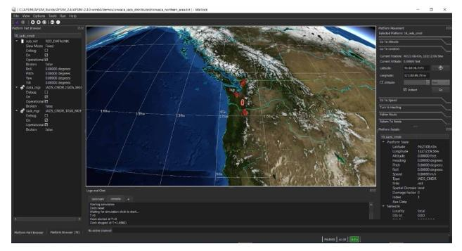
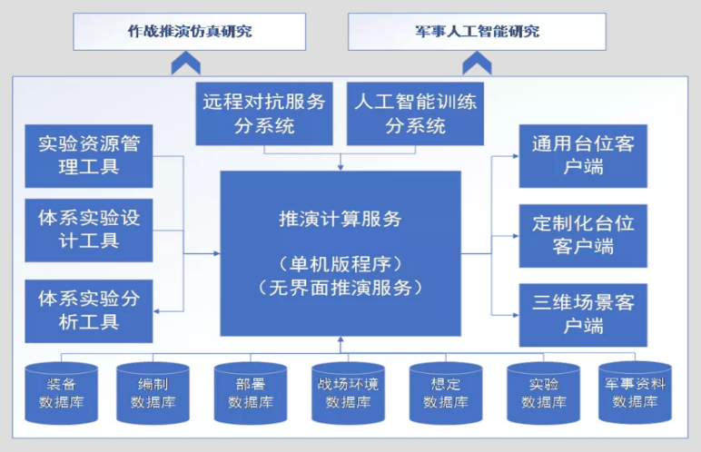
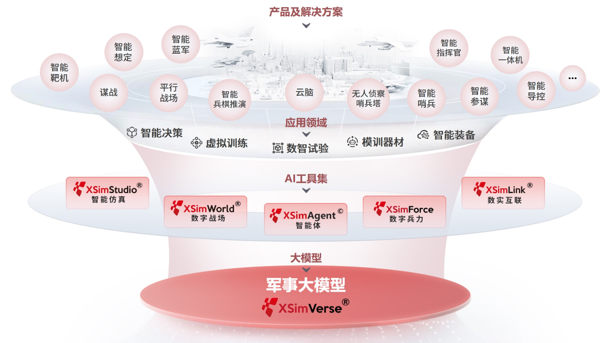
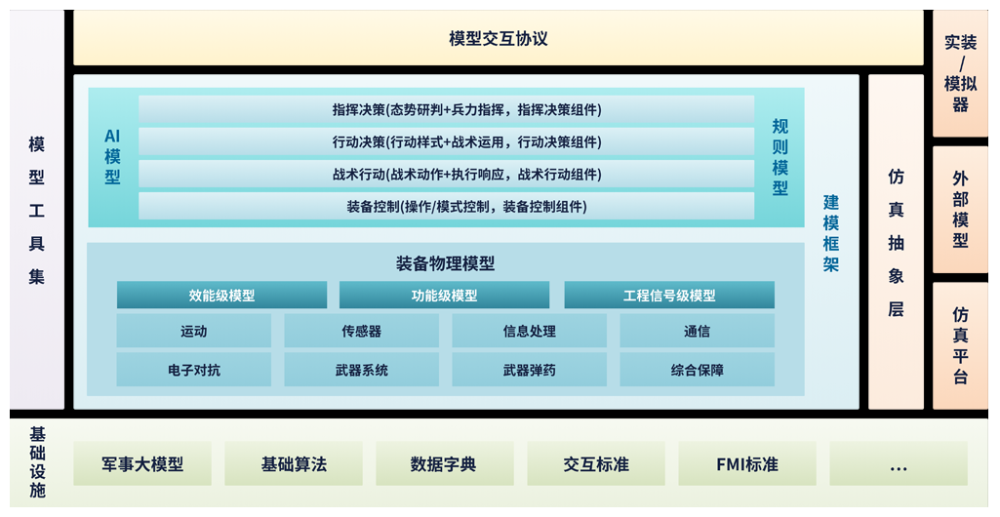
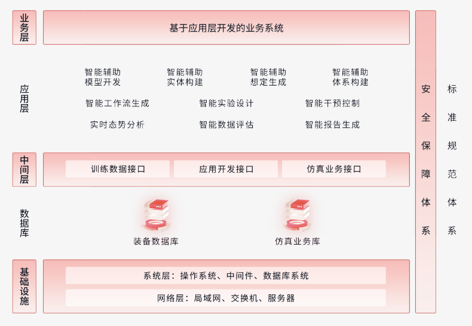
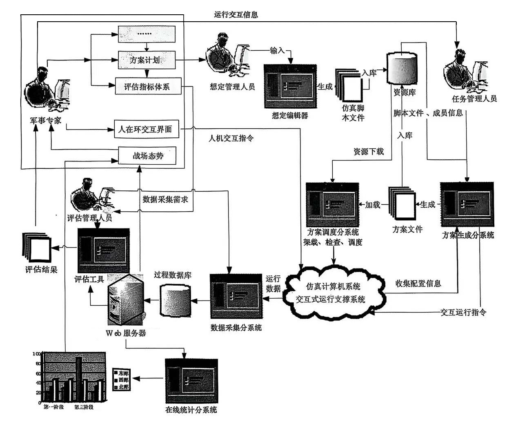

# 典型作战仿真系统

【摘要】介绍美军典型作战仿真系统及其最新进展，这些不同层级作战仿真系统面向不同需求的研发各有侧重，例如JMASS、JWARS、JTLS、JSIMS、EADSIM和OneSAF等。介绍国内外典型的商用成熟作战仿真平台，包括VR-Forces、AFSIM、CMANO、XSim等。

【关键词】 作战仿真系统，作战仿真平台，EADSIM，AFSIM

【参考书目】

------------------------------------------------------------------------

------------------------------------------------------------------------

## 美军典型作战仿真系统

美军作战仿真系统一直处于世界领先地位，其在作战仿真系统研究过程中产生的标准已成为世界各国开发作战实验仿真系统的蓝本和基础。

美军根据不同的应用需求建立了战略级、战区/战役区、任务级、交战级和工程级等多个层次的仿真系统，每个军种都建立了相应层次的作战仿真系统，每个层次的仿真系统有自己特定的应用模板和应用领域，但可以互相连接以弥补各自的不足。

不同层级作战仿真系统面向不同需求的研发各有侧重，有的在发展中被淘汰或被其他更完善的系统替代，有的则随着需求的变更，不断地选代改进或拓展应用领域。

联合建模仿真系统（JMASS）主要为底层的工程级武器研发和交战级作战仿真提供全生命周期服务；联合战区级仿真系统（JTLS）和联合作战系统（JWARS）则主要应用在战区/战役级仿真中，主要基于多天、多对多的剧情对兵力结构进行研究；联合仿真系统（JSIMS）主要应用在任务级仿真中，它基于一些高度详细的对象之间的交互系统和子系统的性能进行研究，是连接工程级作战仿真系统与战役级作战仿真系统的重要纽带。

下面简单介绍美军典型作战仿真系统及其最新进展。

### 联合建模仿真系统（JMASS）

研制单位：美国国防部

一个建模仿真支撑环境，设计用来处理工程级高逼真度的、电子战环境下的武器系统交战的建模仿真，作战对象之间的交互信息量大、更新频繁，是紧耦合仿真。

JMASS是由美三军联合开发的、多军种通用的工程及交战级作战仿真体系结构和相关的工具集。JMASS主要包括三个部分：1）模型标准，包含可重用的软件结构化模型和模型应用编程接口（API）；2）仿真支撑环境，包含仿真引擎、可视化开发工具、事后处理分析以及商业软件工具接口等；3）模型库和资源库，包含本地模型和数据库，以及建模与仿真资源库。

JMASS本身并不包含任何的模型和仿真应用，它只是为建模提供了公共的作战仿真结构，可以视之为仿真系统的软件支撑环境。基于JMASS的作战仿真系统包括JWARS系统和JSIMS系统，它们共同形成美军的三个大"J"类仿真系统。

### 联合仿真系统（JSIMS）

研制单位：美国国防部

联合作战仿真系统 JSIMS（Joint Simulation
System）是由美军国防部发起，海陆空三军参与研发，面向21
世纪联合作战的仿真系统。采用分布交互式仿真技术，由一个公共核心基础设施和陆、海、空等各军兵种开发的仿真模型及应用系统组成，将陆战、海战、空战、太空战、电子战、地形、海洋环境、大气环境、机动/部署、计算机生成兵力、后勤运输以及其他专用模型等诸多作战元素有效地综合在一个联合作战空间内，形成一个集成的仿真环境。

JSIMS是联合战役级作战仿真系统的典型代表，它采用分布交互式仿真技术，应用领域主要面向作战参谋人员的训练。它由一个公共核心基础设施和陆海空等各军兵种开发的仿真模型及应用系统组成，将陆战、海战、空战、天战、电子战、地形、海洋环境、大气环境、机动/部署、计算机生成兵力、后勤运输以及其它专用模型等诸多作战元素有效地综合在一个联合作战空间内，形成一个集成的仿真环境。它还能与美军实际的C4ISR系统如全球指挥控制系统（GCCS）、陆军战术指挥控制系统（ATCCS）等实现交互，从而可以为分布在世界各地的美军指挥人员、指挥机构、联合部队以及其他联合组织机构，提供用来支持军种或联合训练、演习、职业军事教育、条令拟制、战术研究、作战计划制订与评估的一体化计算机仿真环境。在实施JSIMS项目的过程中，美国军用仿真界着手解决各仿真系统的互操作性及可重用性等现实问题，从而促动美军高层提出并建立了高层体系结构HLA。

JSIMS 的模型体系称为联合使命空间概念模型JCMMS（Joint Conceptual Model of
Mission Model），它采用军事建模框架（MMF）的方法设计其结构和模型。MMF
为JCMMS
提供了一个军事范畴的基础类，使得模型开发者能采用一致的方式开发模型以及对各类模型进行有效的分类和管理。此外，MMF
还提供一个框架支持模型的自动生成，支持模型组件的组合。从本质上说，基于MMF
的设计方法还是利用了面向对象建模中继承、多态和聚合等方法设计模型体系和实现模型的组合和重用。

### 联合作战系统（JWARS / JAS）

研制单位：美国国防部

JWARS是一个战役级作战仿真系统，其核心功能是支持联合作战分析与评估。它以联合作战为背景，综合了战争的主要领域，包括C4ISR、后勤、大规模杀伤武器、战区弹道导弹防御等。它能够提供三维战场空间、气象、后勤制约以及基于感知的指挥和控制等功能，可应用于作战计划的制定和执行、兵力评估研究、系统采办分析、作战新概念和新条令的形成与评估。2006年美军将其更名为联合分析系统JAS。

联合分析系统（JAS）由联合作战系统（JWARS）更名而来，是一个战役级的"端到端"的仿真推演系统，以联合作战为背景，综合了战争的主要领域，包括C4ISR、后勤、大规模杀伤武器、战区弹道导弹防御等。该系统能够提供三维战场空间、气象、后勤制约以及基于感知的指挥控制等功能，可应用于作战计划的制定和执行、兵力评估研究、系统采办分析、作战新概念和新条令的形成与评估。

联合分析系统（JAS）开展基于感知的模型训练以应对网络攻击。在2021
年第89届军事运筹研究研讨会中，信息和网络行动工作组的专家演示了在JAS中引入"基于感知的运动模型以训练应对网络攻击的能力"，在联合分析系统中降低动能杀伤能力，引入一种政府所有基于感知的战役模型，使用该模型进行系统支持的作战模拟，所有信息通过模拟网络传输，网络中断导致特定信息延迟或丢失，进而影响后续作战。每当暂停JAS时，决策者都可以替换选定的模拟代理。向决策者提供与代理相匹配的CGF的状态报告，然后根据实际可获得的信息，而不是事后真相，做出最佳决策。该项目还建议使用目前可用的特定虚拟硬件和互联网软件快速创建低成本、全逼真度的数字孪生网络，并推广应用这些新仿真网络。这些仿真网络及其防御工具可以驻留在从小型计算机设备到攻击与防御网络团队的所有设备内，可以监测和记录系统成功防御时间长度以及被攻击后网络恢复时间长度等有效可信的数据。同时，该系统模拟的战争训练实验中提供了所有类型的动态和非动态指挥控制攻击，在报告网络攻击同时也生成了攻击造成的损失报告。但只有系统导调团队知道信息丢失的全部程度。参训人员可调查中断情况，并采取广泛的可用措施，措施的有效性取决于任务完成的程度。可靠的网络数据与"全员"结合将这些数据链接到作战仿真实验的特定网络中，此过程能够显著提高参训人员应对网络攻击的能力。

联合作战系统
JWARS是面向战役级联合作战的仿真系统，它主要作为各级联合作战参谋、联合作战部队和国防部门进行军事能力评估和作战计划执行与分析的仿真软件平台。同时，它还用于作战系统的效能分析以及军事条令开发评估等。JWARS
的模型体系主要包括战略级的后勤保障模型、战役级的后勤保障模型以及各军兵种的联合作战模型，它用面向对象建模的方法对战场空间对象进行分析，以战场空间实体BSE（Battle
Space Entity）为单位构建模型，利用多态和继承等方法描述BSE
的组合关系。在JWARS
模型体系中，BSE模型由指挥控制组件、传感器组件、资源管理组件、通信组件和平台组件组成。这种模型体系设计方式使得JWARS
的模型可以灵活的组合，具有高可重用性。

### 扩展防空仿真系统（EADSIM）

研制单位：美国空军

一个集分析评估、训练、作战规划于一体的系统级作战仿真系统，包括空中、导弹、空间作战中所涉及的各种参演角色的实体模型和作战模型；能够满足以C4ISR为中心的导弹战、空战、空间战以及电子战等作战样式，可以实现一对一到多对多作战模拟。

EADSIM是美军最成熟、使用最广泛的任务级作战仿真系统之一。系统能够满足以C4ISR为中心的导弹战、空战、空间战以及电子战等作战样式的需求，应用领域涵盖作战方案分析与规划、武器装备论证与评估、军事训练与战法研究等。

EADSIM以C3I模块作为仿真行为处理的核心模块，以平台实体（如单架战机）作为仿真想定构成的核心单元，同时具有较详细的C4ISR模型，如传感器模型、干扰模型、通信模型等。EADSIM系统可灵活管理想定，能支持"少对少"至"多对多"的作战想定。EADSIM系统仿真对象的行为模型通过灵活的规则集来控制，系统内置了38类规则集（并可以扩展），可通过选择规则并设置相应阶段的控制参数，建立对抗双方战场实体的指挥、控制、通信、智能决策等规则模型。

EADSIM是美军应用十分成功的仿真系统之一，目前它在全球的用户已经超过400个。在海湾战争期间，EADSIM系统为美军"沙漠盾牌"和"沙漠风暴"作战计划的制订与作战方案的拟制，为美军取得海湾战争的胜利，发挥了重要作用。该系统始终与仿真技术、战争环境、武器装备的发展变化保持同步，因而系统功能不断改进与完善，所以说EADSIM系统作为美军的现役装备，至今仍然是美军仿真系统的典型代表。

2021年6月21日至25日举行的第89届军事运筹研究研讨会上，指控单元和防空反导单元报道了美国陆军太空与导弹防御司令部和
Teledyne
Brown工程公司在2021年春发布的EADSIM最新版（第20版）的新功能。该版本主要新功能包括：扩展操作员在回路能力，包括战斗机飞行和交战决策的飞行员级控制以及扩展了地对空指挥链参与者的手动控制；与机载传感器和加油机等支援飞机一起支持防御战斗机作战的附加能力：旋转雷达建模的简化方法；用于高能激光器的扩展二维回转模型；继续扩大一体化防空导弹防御能力的代表；将新的授时效应引入轨道维护、作战识别过程和火控级数据实现的各种方法。这些新功能不仅完全在内部构造仿真中运行，而且能在分布式环境中运行，这些新功能为回路中的其他联邦成员和操作员提供增强的真实感和感知深度。

研讨会上还报道，美国陆军空间和导弹防御卓越中心应用EADSIM为高能激光实兵对抗建模，并为多域作战环境中使用联合全域指挥控制（JADC2）获取防空反导任务的作战影响提供军事效用评估。

### 联合战区级仿真系统（JTLS）

研制单位：美军战备司令部（USREDCOM）、陆军战争学院（AWC）和陆军军事构想分析局（CAA），罗兰公司

一个针对陆、海、空联合作战，以及后勤、特种兵力、情报支援的交互式、多方参与的战区级作战仿真系统，包括指挥控制、地面作战、空中作战、海上作战、信息作战和后勤保障六大类模拟作战实体与作战过程的仿真模型；可用于模拟美军联合任务清单所定义的战役级常规联合作战和合成作战，可模拟联合空中、地面、海上、两栖和特种部队作战以及有限的核、化学效果、低强度冲突以及沖突前战斗。

JTLS是一个多方参与、交互式、战区级仿真系统，可用于军事战略、作战计划和作战战果的分析和评估，并更多地应用于联合作战训练。JTLS系统包括了陆、海、空联合作战以及后勤、特种兵力、情报支援等领域。JTLS拥有与美军若干实际C4ISR系统的接口，因此在训练与演习过程中，可以实现仿真系统与实际系统的联合。

联合战区级仿真系统-全球作战（JTLS-GO）作联合战区级仿真系统的最新版本，在美国海军未来舰队作战能力开发中得到应用。JTLS-GO已被北约联合作战中心等各种国内外防务组织采用；联合参谋部联合作战指挥部（J7）和太平洋作战司令部将其作为确认模型可信度的测试环境。该仿真系统的仿真引擎是作战事件程序，其指导模型内所有空军、陆军和海军部队的行动与交互。传统上，使用者与JLS-GO
通过基于Web
主机的界面程序进行交互，手动输入推演中各单位的任务集和指令。这些指令被发送到作战事件程序，通过通用作战图中的图形更新向使用者提供的反馈。

JTLS-GO最近的应用为2018年2月开展的"黄金眼镜蛇"军事演习，美国、日本、韩国、泰国、马来西亚、新加坡和印度尼西亚七个国家参加了此次演习。该演习主要由计算机辅助演习实现，要求军事训练受众观察并完成主场景事件列表规定的关键场景事件，敌方部队充当目标冲突对手，要求训练受众也对模拟军事威胁作出反应。JTIS-GO
在该项目中新增并校核了无人水下航行器（UUV）的系统模型，并训练观众提供海军舰队作战场景模拟，与新开发的集成和运筹支持系统（IOSS）联合使用。其创新地使用了场景模拟、计算机仿真和实验来构建任务工程的战略分析框架，为演习提供自动化、可重用的实验环境。

### 战术作战仿真系统（TESS）

研制单位：美国陆军

一个在逼真的、虚拟的交战对抗环境下，构造出双方战斗规则、战斗部署、战斗行动、战斗指挥和战斗保障等仿真模型，形成动态推演攻防作战过程、作战战术，评估其战术指挥和作战效能的仿真系统。

战术作战仿真系统（TESS）是一种可部署的装备系统，最初开发用于AH-64D/E
"长弓-阿帕奇"攻击直升机的空中射击机组人员训练，旨在提供多梯队乘员和集体部队对部队训练，项目命名LBA-TESS，交付了多个国家应用，如英国、新加坡、埃及、德国、荷兰、科威特等。

### 联合半自动兵力系统（JSAF）

研制单位：DARPA，洛克希德•马丁公司

一个人在回路的可模拟多种战场实体（包括车辆、步兵、坦克、舰船、飞机、建筑物和声纳等传感器，以及能够表示真实世界的地形、海洋、天气条件等综合环境，乃至能模拟平民的行为细节）作战实验和训练仿真系统。

JSAF是20世纪90年代在战争综合演练场（STOW）项目中开发的。JSAF
是在人工综合环境中，生成诸如坦克、士兵、军需、舰船和飞机等实体级对象的仿真系统。这些实体可以被单独控制，也可以组成一些有意义的军事单元，如排、连等。实体具有真实的生命特征，因此他们会被一些事件所影响，如疲劳（对士兵而言）、被地形阻碍（如树林）、视线的局限性（天气条件）。JSAF实体会展现真实行为，如坦克在蜿蜒道路上行驶，舰船按照预定的航线行进，分队遭遇作战损失，导弹按真实弹道飞行，弹药和油料会耗尽。

JSAF
是一个开放的环境，实体的属性、任务和行为都可以修改。这增加了它的适应性，但是可能会增加其他仿真系统与其保持一致性互操作的难度。例如，有两个仿真系统，一个仿真坦克，一个仿真飞机。如果在坦克仿真中，为坦克增加一个"乘员"的属性（之前坦克和乘员是两个分开的独立实体），当坦克被飞机发射的导弹打击时，现在的坦克仿真可能会出现乘员在打击中幸存的情况，这就与飞机仿真所希望的坦克与乘员都被摧毁的结果产生了不一致。

JSAF 与 DIS
和HLA兼容。如此前例子所强调的，DIS和HLA允许仿真之间的技术互操作。DIS和HLA允许仿真共享数据，对联邦中实体的行动进行同步。

### 联合冲突战术仿真系统（JCATS）

研制单位：美国联合部队司令部（US JFCOM）发起、联合作战中心（JWFC）管理

美军联合作战实验系统之一，是一个实体级、可构造、交互式的训练仿真系统和训练工具，可为作战部队参谋和参战人员提供命令级训练。

JCATS 诞生于20世纪90年代，由劳伦斯·利弗莫尔实验室开发，目前由US
JFCOM赞助。它支持美国海军和美国海军陆战队的海、陆、空演练，国土安全部（DHS）也用它来完成一些训练任务。JCATS
与JSAF 和
OneSAF的相同之处是，它也支持海量数目的实体，基于物理模型生成真实的剧本，并符合HLA
和 DIS
框架。它的优势在于对战术级训练和演习的特别支持，计划任务和演习使得JCATS吸引了一些政府用户。JCATS
支持不同战场环境、特别是城市环境中的训练和试验，因为它提供了诸如建筑物、人物等实体的高细节度模型，而且支持很多战术动作如近距离空中支援或车辆装配/拆装。

### 统一半自动兵力（OneSAF）

OneSAF诞生于20世纪90年代，由美国陆军仿真、训练与条令项目执行司令部开发，用于支持从基层部队到指挥机关各级别的训练、试验和采办活动。可以预想，OneSAF是美陆军仿真设备走向现代化的捷径，尤其是对于虚拟训练而言更是如此，典型的如航空诸兵种合同战术训练器（AVCATT）、近战战术训练（CCTT）。OneSAF具有JSAF的很多特色：复制真实生命特质比如疲劳（对士兵而言）、被地形阻碍（如树林）、视线的局限性（天气条件）。OneSAF也符合HLA和DIS相关标准，而且支持MSDL、JC3IEDM和BML。与JSAF不同的是，OneSAF是以陆军为中心的，对陆地实体支持的范围比对海、空实体更广，其对所表达的实体（如建筑、陆地车辆）和单元（如班、旅）行为的细节逼真度非常高，能够表达全自动控制的友军、敌军以及中立方力量。

计算机生成兵力系统（OneSAF）最新一次能力提升合同由Riptide软件公司在2018年12月签订，开发周期为6年，预计完成日期为2024年12月。其主要功能需求能够为战斗和非战斗作战的所有单元模拟从火力团队、到连级别的单元行为，提供智能的、理论上正确的行为和一系列构造的、推演和基于虚拟的用户界面，以增加工作站操作员的控制范围。生产和支持工作包括概念建模，架构工程和软件开发支持，以增强产品线并降低生金周期维护和开发成本。

2019年，美国陆军机动作战实验室兵棋推演仿真实验采用该仿真平台，结合人工智能与云的关键技术，使士兵能够控制机器人系统。战场上每个无人机和地面机器人都需要独立"弱人工智能"地进行导航、分析传感器采集的数据、与其他单位通信。整个兵力编组中最重要的人工智能是控制其整体行动的人工智能，与常见的固定服务器不同，该人工智能技术实现采用云部署，位置不固定，协同数据被分散在多个微型服务器上，避免被炸搜、遭到黑客攻击或者通信阻塞。这些微型服务器由机器人车辆携带或者单兵背负。如果一台服务器被破坏或失去通信，兵力编组网络上还有其他服务器可接替工作。推演结果显示，无人机和地面机器人加强给步兵单位后，其战斗力提高10
倍。

OneSAF 简介

仿真类型：构造仿真；

主要用户：美国陆军；

主要目的：训练、试验和采办；

其他用户：空军、美军联合部队、美国海军、美国海军陆战队和国外政府，如加拿大、英国及澳大利亚；

支持等级：战略、战役、战术；

支持的数据模型结构：HLA、DIS、MSDL、BML；

显示模式：二维和三维；

军事单元：最高到旅。

## 典型作战仿真平台

### MAK VR-Forces

VR-Forces 是由VT MAK 开发的商业仿真系统，可作为政府主导的解决方案（如
JSAF、OneSAF 和JCATS）的补充。VR-Forces
最常用于战术级训练，提供高精细度的战场描述。它符合HLA和DIS规范，再考虑到它具有可编程工具包，可构建与基于XML的语言兼容的模块。工具包也可以用来修改实体的特性和行为。它被美国空军、美国海军陆战队等用作桌面解决方案。

仿真类型：构造仿真；

主要用户：所有部门；

主要目的：训练与试验；

主要支持等级：战术；

支持的数据模型结构：HLA、DIS；

显示模式：二维和三维；

军事单元：最高到排。

MAK Technologies成立于1990年，总部位于美国麻省的Cambridge。其产品MAK
RTI是全球第一套商业化RTI，广泛应用于全球HLA仿真领域。MAK
Technologies是目前全球领先的分布式仿真解决方案的供应商。

VR-Forces是一套先进的分布式计算机兵力生成软件和工具包，从名字就可以看出VR-Forces是用来做兵力推演的，最初的VR-Forces仅仅是为了配合VR-Link而开发的一个简单的FOM对象管理工具，是为了更好的管理兵力推演中的大量HLA实体的。而VR-Link可以简单地认为是RTI的一个封装，比直接使用RTI简单。

VR-Forces是一套强大而灵活的C++仿真开发工具包，主要用来开发、生成和执行战场想定。它为战术指挥训练模拟器、威胁生成系统、行为模型测试系统和计算机兵力生成系统提供所有必需的仿真手段。可用于多方参与的战略和战术仿真训练系统，任务演练，战术教学研究、开发和测试，各种载体的样机特性研究，基于数据采集的仿真，嵌入式训练器，模拟器互联等。

1．基本情况

计算机生成兵力（CGF）平台，能够实现陆海空天等多领域的战场行为仿真；分布式仿真引擎；地理环境、气象环境，实体行为，实体间关系；1000+模型，运动模型、武器模型、传感器模型、通信模型、毁伤模型、可视化模型等；支持仿真建模与二次开发，应用C++构建基础模型，应用LUA构建复合模型。

当前计算机生成兵力建模共分为三种类型，物理建模、行为建模、环境建模。这三种模型中，由于物理模型和环境模型所描述的对象机理相对清楚，方法较为简单，而且实现技术也比较成熟，因此建模的难度要小一些。行为模型的构建与人工智能等技术密切相关，并且包含大量不确定因素，涉及到态势评估、规划、决策以及学习等模型，因此实现难度较大。

2．特点

（1）在VR-Forces中配置了人性化的图形用户接口，可使非编程人员通过简单的鼠标点击和键盘输入方式进行布局，创建行动路线、为实体分派任务和布置计划。

（2）VR-Forces实体可以与地形进行交互、探测，与敌军交战并计算损伤程度。不需要任何代码，通过编辑参数入口数据就可以改变各种机动载体的动力学模型、传感器特性和损伤模型。

（3）完全的分布式体系结构可将整个仿真应用分布部署于多个仿真引擎上，并可通过一个或多个前端远程GUI进行控制，多个前端远程GUI能进行协调训练或剧情生成。

（4）VR-Forces提供一套强大而灵活的C++仿真开发工具包。C++
API使用户可定制VR-Forces中的任何功能，或将VR-Forces功能集成到自己开发的仿真应用中。

3．应用领域

在作战实验、推演分析、作战计划领域，通过观察和分析受控变量与观测结果的因果联系或关系，识别、开发、评估、提出新的作战概念和任务能力及条令、组织、训练、物资、领导、人员、设施的变革需求，依据对作战带来的影响和效果，为转型、改革、发展提供决策支持，尽快将新的理念、技术、能力形成部队实战能力，是部队在该领域的重要发展趋势和应对未来挑战的重要手段。在重要的作战和非战争军事行动前，经过大量的计算机仿真评估和优化迭代，减少因作战方案和行动计划不当带来的损失。通过仿真系统与指挥控制系统的互连，捕获公共作战数据，直接从指挥控制系统获取信息，及时更新仿真系统中的战场态势和最新作战目标，是未来作战实验领域的发展趋势。通过超实时仿真分析与评估，指挥员能够"看见"未来并迅速理解军事行动的展开，不断匹配、优选、调整和补充未来方案，从而直接支持作战计划。

在模拟训练领域，通过虚拟作战环境和模拟作战流程让训练人员快速掌握宝贵的操作技巧和作战经验，逼真的视觉、听觉甚至运动感受还能使训练人员能获得真实的操作体验；有针对性地设计具体的作战场景，高效、便捷、节约地提高机关受训人员的业务素养。通过使用计算机生成可自主行为的虚拟兵力，让受训人员指挥的作战实体数目大幅增加，并能够依据敌军的作战条令定制蓝方，从而有效提高了训练过程的对抗性。训练仿真的最终目的是提供一个近似实战的联合训练环境。

在装备论证领域，半实物仿真、数字仿真等先进仿真应用不仅成为了武器装备技术发展和系统研制的重要实验手段，也已经成为了新型武器装备研制的必备环节。在研制和试验过程中大力使用半实物仿真技术，基于装备系统工作原理，使用解算数学模型的实时仿真计算机、模拟目标和环境光学/射频/红外/声学等特性的信号产生装置、模拟装备姿态等运动特性的转台、模拟控制执行机构负载的力矩模拟器、设备通信接口装置和试验控制台等，接入被测试系统或其部分硬件实物，形成逼真环境下的装备系统工作回路，对系统的动态特性和性能进行测试和研究，用于飞机、导弹、鱼雷等武器系统的方案设计、研制、试验鉴定定型、使用维护和改进。

在联合试验领域，建模和仿真可以优化试验鉴定计划和识别关键或高风险问题，破解因费用或安全等限制无法实装实弹试验鉴定的难题，模拟威胁目标环境和对抗条件或提供激励，预测或外推系统极限条件的包络性能，深化认识理解系统特点和规律，支撑、优化和拓展开发、作战、实装实弹试验鉴定。将分布不同地域的实兵实装、模拟器和计算机仿真系统互联在一起，开展虚实一体联合试验，有效地降低试验费用，提高效率，使联合试验得以常态化开展，为采办决策提供持续准确可靠的试验鉴定数据支持，降低成本、周期和风险。

4．应用开发

VR-Forces是基于HLA的仿真引擎，提供两个主要进程：图形用户界面vrfGui和作为仿真引擎的后端程序vrfSim。两者之间通过VR-Link通信。

仿真支撑框架：采用HLA，MAK RTI、VR-Link开发。

仿真过程中，仿真引擎需要找到正确的组件去配置对象，例如，当初始化一个新的实体时，仿真引擎需要创建相关的组件：运动的驱动组件，执行任务的控制组件等，所有这些组件都是某个基类的子类。创建组件需要一种选择正确子类的方法，VR-Forces用的是类工厂机制。

VR-Forces包括四种API：仿真引擎API、远程控制API、地形操作API和图形界面API。API提供了用于实现VR-Forces仿真功能的大量类和函数。

在基于MAK
RTI的仿真程序中，在定义好交互类和对象类之后，仿真成员之间通过fed文件的内容进行数据交互。

视景仿真支持Qt+OpenSceneGraph（三维渲染）开发。

5．MAK 产品

VR-Forces 是VT MAK 软件产品线中的成员之一。VT MAK
软件产品线设计的原则是简化开发和使用网络仿真环境的过程，包括如下软件：

VR-Link 网络工具包。VR-Link
包括面向对象的C++函数库，实现了高层体系结构（HLA）和分布式交互仿真（DIS）的协议定义。VR-Link
支持RPR FOM，并且允许用户映射其他类型的FOM。

MAK RTI。运行基于HLA的应用必须要 RTI的支持。MAK
RTI进行了高性能的优化。MAK RTI 包括API允许用户使用插件模块扩展 RTI。MAK
RTI 还包括一个图形用户界面帮助用户完成配置任务以及联邦成员和联邦的管理。

VR-Forces。VR-Forces
包括计算机生成兵力程序和工具包，提供了一个带图形用户界面的应用程序（为用户提供仿真环境的二维和三维视图）。用户可以创建和观察本地实体、将本地实体聚合为等级单位、分配任务、设置状态参数以及创建计划（计划中包括任务、设置声明以及条件声明）。VR-Forces
也可以当作态势显示器使用，观察参与演练的远程实体。

VR-Vantage。VR-Vantage
是一套能够满足仿真可视化需求的产品线，包括VR-Vantage Stealth、VR-Vantage
XR、VR-Vantage IC 以及 VR-Vantage 工具包。VR-Vantage
Stealth以三维视角逼真地显示虚拟世界。用户能够从仿真的车辆内部观察，也能够将视点放到其他移动或静止的位置。在仿真运行过程中用户能够在多个预定义视点之间快速切换。VR-Vantage
XR 提供了与VR-Vantage
Stealth相同的三维视图并增加了二维视图、XR视图。利用这些视图用户能够把握仿真世界的形势和总体态势。VR-Vantage
构建于 OpenSceneGraph之上。

MAK Data Logger。数据记录器能记录 HLA和DIS 的演练数据并用于事后回放。

### AFSIM

1．简介

AFSIM（Advanced Framework for Simulation, Integration, and
Modeling）是一个通用的建模框架，由美国空军研究实验室（AFRL）开发和维护，能够构建典型的虚拟威胁环境和相关模型。AFSIM是基于C++的模块化、面向对象、多领域、多分辨率的建模和仿真工具，作为一种军事模拟的框架，AFSIM侧重于分析、实验和作战。AFRL的目标是使得AFSIM在国防领域能够像MATLAB在学术界一样普遍应用和发展。

AFSIM名称中的AF并不代表空军，这反映了AFRL的信念，即AFSIM不仅应该是空军的内部工具，AFSIM已演化为美国国防部的推荐仿真环境。这种命名选择也表明AFSIM不仅仅是模拟飞机的框架，虽然它起源于对空中平台的支持。目前它已被设计为一个多域平台，这意味着它可以对陆、海、空和天基平台进行建模，从而使建模人员可以包括潜艇、舰艇、坦克、飞机、直升机、卫星甚至网络、，可以在同一模拟中使用代理。

AFRL已经认识到AFSIM在马赛克作战中的价值，启动了AFSIM+
升级计划，希望引入数字孪生体概念和体系，构建更为高级的建模仿真与分析体系，这正是DoDD
5000.59的范畴，体现了美国国防部全面转型数字孪生体的愿望。

IST公司是 AFRL 的 AFSIM 主集成商，拥有核心 AFSIM
源代码的原始开发人员和维护者。所有 AFRL 赞助的 AFSIM
开发和维护都由IST的敏捷开发团队管理和执行。

2．AFSIM功能特点

多平台模拟：支持多种平台的模拟，包括飞机、无人机、导弹、雷达系统等，用户可以选择并配置不同的平台来进行仿真。

场景编辑：提供了一个场景编辑器，用户可以使用该编辑器创建和编辑各种仿真场景，用户可以自定义地形、天气、目标和任务等，以逼真地模拟真实世界中的各种环境。

任务规划：支持用户创建和规划各种任务，包括侦察、监视、打击等，用户可以制定任务参数，如任务区域、任务目标、任务时间等，并在仿真中执行和评估这些任务。

传感器仿真：支持模拟各种传感器系统，如雷达、红外线、光学传感器等，用户可以配置传感器参数，并观察传感器在不同环境下的工作效果。

数据分析：提供强大的数据分析功能，可对仿真结果进行分析和评估，通过使用数据分析工具，用户可以获得各种统计信息和图表，以更好地理解和评估仿真结果。

3．AFSIM用途

主要应用于军事领域，特别是空军和侦察部门，可用于评估不同战术和技术的效果，优化侦察和监视任务的执行方式，提高作战效率和战场态势感知能力。

此外AFSIM还可以用于教育和培训，通过在仿真环境中进行训练，人员可以获得实战经验和技能，提高应对复杂战场情况的能力。

4．AFSIM组成

AFSIM主要由：Wizard场景编辑器、Warlock人在回路（OITL）交互式仿真分析工具、Mystic仿真过程记录与回放工具3部分组成，如下图所示。

<figure>
  
  <figcaption>图 13‑1 AFSIM系统组成</figcaption>
</figure>

（1）Wizard场景编辑器

Wizard 是AFSIM的集成开发环境（IDE），从功能角度被称为"场景编辑器"，IST
使用它来快速定义 AFSIM
平台和平台组件并将其集成到分析场景中。场景编辑器支持功能丰富的编辑功能，例如语法突出显示、文本自动完成和右键单击导航，允许编辑输入文件、执行
AFSIM 方案以及可视化输出等。

（2）Warlock人在回路交互式仿真分析工具

Warlock一种旨在与 AFSIM
引擎交互的人在回路（Operator-in-the-Loop，OITL）交互式仿真分析工具，可提供实时分析和战争游戏功能，支持以图形方式查看
AFSIM 模拟并与模拟实体实时交互。

<figure>
  
  <figcaption></figcaption>
</figure>

（3）Mystic仿真过程记录回放工具

Mystic 是一种工具，通过读取 AFSIM 事件记录文件，并在地理环境中进行可视化
AFSIM 模拟的记录结果的显示，并支持在各个阶段对仿真情况进行分析。

5．典型应用场景

AFSIM支持广泛的军事模拟仿真实验，包括工程、交战、任务和战役等仿真级别的作战仿真实验。

工程级仿真：子系统与其他子系统的交互仿真，例如射频（RF）发射机与接收机交互，以识别子系统级别的功能仿真。

交战级仿真：由直接的冲突战斗仿真组成，即在AFSIM环境下两个实体或平台之间的对抗。例如，蓝方（友）机和红方（敌）机之间的导弹对抗将构成交战水平模拟。

任务级仿真：模拟一次出击或执行任务期间，几个小时之内，多架红方和蓝方飞机之间进行了一系列的战斗。这种模拟最多可以包含数千个实体。

战役级仿真：扩展仿真的范围，可能会在较长的一段时间（即几天甚至几个月）内包括给定区域中的所有红方和蓝方平台。

AFSIM的开发重点主要在交战和任务层面，目前的开发进展已经将AFSIM扩展到中小规模的战役仿真。当需要更全面地探索工程或完整的战役模型时，可以结合其他仿真建模工具，例如空军研究、分析和评估办公室使用的综合战场作战研究模型（STORM），可在较长的一段时间（即几天甚至几个月）内，模拟给定区域中的所有红方和蓝方平台，仿真规模可达数千个实体以上。

### Command

1\. 简介

《指挥：现代海空行动》（Command Modern Air/Naval Operations,
CMANO），是一款由Warfare Sims开发、Matrix
Games公司于2013年发行的策略类游戏。CMANO为兵棋爱好者们提供了完整的战术和战役级模拟，从一对一的缠斗、海上小规模冲突直到战区、甚至是战略规模的战争。

Command是一款非常优秀的海空战争兵棋软件。毫无疑问，这是目前对现代战争刻画最好的电子兵棋系统之一，也因此引起了各国军方的重视，而防务机构同样对其青睐有加。美国空中机动司令部、海军战争学院以及其他多个国家军事学院将CMANO
Pro专业版作为模拟推演训练平台之一。此外，一些著名的政府机构和军事承包商也正在使用Command专业版。

Command专业版经过最新的进化与发展，拥有了商业版中所不具备的先进功能，它已经迅速发展以适应军事需求，并宣布了大量升级。

自发布以来，CMANO已经增加了多个DLC和扩展包，大受欢迎但也备受争议的Command
LIVE系列基于不断变化的政治和军事活动，已经取得了重大成功。该系列的现实性的另一个例子是Chains
of
War（战争链），这是一个探讨中国、美国及其各自盟友之间冲突的战场包，假想发生在不久的将来。

CMANO多次赢得"年度兵棋游戏"奖项，此后相继得到美国空军、美国海军、澳大利亚国防部、德国空军、英国国防科学技术实验室的青睐，并作为军用兵棋系统加以利用。2019年9月3日，来自WarfareSims制作组的好消息再次传来，CMANO不再满足于仅限"海空战"的模拟，一个跨越海陆空的一体化联合作战指挥平台似乎尽在咫尺，这就是《指挥：现代作战行动》（Command:
Modern Operations, CMO）。

CMO与其说是一个续作，倒不如说是CMANO从2014年就开始的快速迭代和演进的必然结果。CMANO在诞生之初，其目的也许仅仅是成为一个"更好的鱼叉"，没有人预料到它在今天能取得如此巨大的成功。现在，新的方向已经明确，CMO及其未来的拓展版本，将成为最优秀的跨领域多用途商业化兵棋推演软件，致力于同时服务专业客户和消费市场。

2．特点

范围：空中、海军、近空、战略和地面（有限）行动；战术战役级，技术、战术和人为因素很重要，但情报、理论、维持、后勤和长期规划也很重要；从一对一的战术交战一直到战区和全球范围的冲突。

广度和深度：飞机、轮船、潜艇、地面部队、卫星及其子系统和组件的无与伦比的开源数据库；从1946年到不久的将来的所有主要军事力量；基于物理和效果的运动学、传感器、武器/弹头/损伤和其他模型；高度重视准确性和细节。

易用性：在几分钟内构建一个简单的场景，并自动为您的怪物设置构建更大的方块；标准Windows界面，商用PC硬件；提供广泛的培训和支持选项。

适用于现有系统：互操作性、数据导出和交换的众多选项；通过TCP/IP和Lua
直接连接到从外部系统运行的仿真；有选择地覆盖内置机制，并用外部替换替换它们；细粒度协作，据需要将尽可能多的工作委派给
CPE；DIS支持。

\- 强大而直观的3D地球用户界面，多个地图图层；

\- 战机、水面舰艇、舰艇、陆地单位、战略和太空部队都由你来支配；

\-
广泛而详尽的模拟数据库，完全忠于每项武器和传感器的实际能力以及局限性；

\- 丰富的剧本，涵盖了历史到假象中的冲突，并附有集成的剧本编辑器；

\- 战场尺度的巨大灵活性：从反海盗的小规模作战到战略热核战争；

\-
详尽的空（包括近太空）/海战场建模，无论地表及水下都有高质量的物理、传感器、地形、天气、武器和损毁模型；

\- 专门为陆地部队量身定做的模型；

\- 水雷以及反水雷行动；

\- 核战（以及其他特殊类型武器）；

\- 录制和重播功能。

3．Lua脚本

Lua 是 Command
用于高级脚本编写的一种编程语言。它用途极为广泛，可以提供很多有趣的机会。即使最简单的
Lua
脚本也可以添加更多的功能，而不仅仅是内部事件编辑器可以提供的功能。Lua
可用于：

生成单位到想定的地图中（与"传送"功能相反）；

想定中途更改天气；

将单位重新分配给不同的任务；

改变阵营和条令；

添加机会元素，以便使想定永远不会以相同的方式出现两次；

使想定详细而多样。

4．数据库

COMMAND
有两套数据库，它们储存了所有平台上的信息（航空器，船只，潜艇，地面设施以及卫星）以及模拟器中的组件（武器，侦测器，挂载器，弹药，通讯设备等）。CWDB
数据库包含了 1950-1979 年间的数据，而 DB3K 包含了从 1980
至近未来的数据。

### 华戍 墨子

<figure>
  
  <figcaption></figcaption>
</figure>

1\. 简介

墨子联合作战推演系统以现代海空作战推演仿真为主，覆盖陆、海、空、天、电全域联合作战，支持战术、战役级作战想定的快速构建和推演仿真。系统支持"人在回路"的开环全纵向指挥控制，支持基于实验设计工具开展"大样本"闭环仿真，也支持基于多种作战力量和不同作战单元之间的协同配合，在武器装备战术使用原则约束下完成多方之间对抗博弈推演，应用于作战概念研究、作战方案和演习方案评估、战法创新和验证评估、指挥员培训、武器装备论证与运用研究、军事人工智能研究、全国兵棋推演大赛及人工智能挑战赛等领域。

北京华戍防务技术有限公司（简称：华戍防务）成立于2011年3月，位于北京上地中关村科技园。公司专注于"墨子联合作战推演系统"（2019年）和"墨子联合作战智能体开发训练系统"（2021年）的研发。

墨子联合作战推演系统已经在军队、各军兵种、军队院校、军队科研院所、国防军工企业、研究机构和地方院校得到了广泛应用。

"墨子"可以看作是CMANO的国产化版本。

2．功能模块

<figure>
  
  <figcaption></figcaption>
</figure>

3．优势特点

系统应用范围广泛。目前系统已经在军委、战区、作战部队、军队研究院所及院校等军队单位，以及航天、航空、船舶、电子等军工行业和国防动员领域得到广泛应用。

具有完备的模型体系。支持陆军、海军、空军、火箭军、战略支援部队等多个军兵种的装备与作战模型，包括实体模型、组件模型、任务模型、环境模型和作战规则等模型。

完善的基础数据支撑。系统内置武器装备数据库、作战部署数据、部队编制数据、区域数据和影像数据（谷歌）。

丰富的想定案例库。系统已经积累了朝韩方向、东海方向、台海方向、南海方向、北印方向、西太方向和中印边境等热点方向想定案例和军事人工智能、蜂群作战、分布式打击、穿透式打击、无人有人协同作战等新型作战概念案例想定近100个，并且自带功能演示想定案例近100个。

支持开展军事人工智能研究。系统支持Python开发语言进行军事人工智能开发，支持开展人工智能训练及对抗推演等人工智能应用。支持联合作战背景下的军事人工智能作战行动仿真推演，应用于态势认知、筹划决策、平台控制和军事训练等领域。

### 华如 XSim

<figure>
  
  <figcaption></figcaption>
</figure>

1．简介

北京华如科技股份有限公司成立于2011年，专注于军事智能相关产品研发和应用，致力谱写国防未来新范式。公司围绕XSim军事智能体系，以军事大模型为底座，利用自研的智能仿真、数字战场、智能体、数字兵力、数实互联系列工具，面向智能决策、虚拟训练、数智试验、模训器材、智能装备五大应用领域，持续为用户提供一系列产品和解决方案。

<figure>
  
  <figcaption></figcaption>
</figure>

2．XSimForce数字兵力

面向陆、海、空、火、天、网电、后勤等各军兵种和联合作战仿真军事需求，突破多分辨率建模、平台无关建模以及战争复杂系统行为建模、规则引擎、智能决策框架技术，以决策为中心，融合军事大模型，自底向上形成基础算法层、装备物理层、装备控制层、战术行动层、行动决策层和指挥决策层等6层模型体系结构设计，面向武器装备和作战行为等要素建模，形成系列化、标准化模型产品集，可为装备论证、模拟训练、作战实验、试验鉴定、综合保障等仿真应用提供强有力的模型支撑，为军事应用大模型提供专业、可信的训练数据支持。

XSimForce主要功能

（1）多分辨率的装备模拟能力

提供机动、传感器、通信设备、电子对抗设备等11类200多种装备模型，支持用户参数化形成各种型号装备，提供多分辦率建模框架，支持裝备模型的多分辨率实现，部分装备模型提供低、中、高三种分辨率，支持一健切换仿真分辦率，支持混合分辨率仿真。

（2）立体多维的武器模拟能力

提供4类40多种平台发射的对空、对舰、对地、对潜武器模型，可模拟地面、空中、水面、水下、空间中的各类制导/非制导、有动力/无动力、硬杀伤/软杀伤武器。

（3）平台无关的快速封装能力

提供标准C++封装的高性能装备算法库，将装备物理和装备控制分层设计，彻底解决装备研制和使用分离带来的装备模型设计困扰；自定义模型标准封装器，兼容FMI标准，可无缝接入FMI标准生态模型；完全平台无关的设计，可快速接入其他商业仿真平台或应用。

（4）多级分层的决策模拟能力

提供联合作战、各军种合同战术、各兵种战术、分队战术所需的多层级指挥决策模型以及面向待定任务的行动决策模型集，支持多层级住务规划，包含丰富的指挥决策、行动决策规则，按照OODA过程进行自主决策和指挥控制。

（5）完备丰富的作战模拟能力

内置700余种战术行动集，能够组合覆盖各军兵种主要作战行动和战术任务样式，提供丰富的战术和作战规则，作战规则分层外置，灵活可配。

<figure>
  
  <figcaption></figcaption>
</figure>

3．XSimStudio仿真平台

XSimStudio
V7基于大模型原生的理念重构底层架构，实现建模仿真及应用的全流程智能化。战争复杂系统的智能建模和仿真平台，采用基于智能体的建模仿真方法，以面向对象组件化建模和并行离散事件仿真技术为核心，融合了多层次松耦合的仿真框架，内嵌智能核心，充分发挥大模型与军用仿真结合的优势，使智能贯穿整个仿真过程。为军用仿真用户在智能决策、模拟训练、试验评估、分析论证等领域提供一站式专业解决方案。

XSimStudio主要功能

（1）智能辅助模型升发

通过对军事概念模型、数学逻辑模型的知识注入，结合已有模型代码的学习记忆，自动构建符合规范的模型代码，并进行代码冲突识别与性能优化，完成模型开发业务流程，让开发人员聚焦业务流程与算法，基于生成的代码微调即可完成专业级模型构建。

（2）智能辅助想定生成

根据自然语言描述的想定自动构建仿真根走，完成仿真实体的部署、指挥与交战关系设置、基本任务规划、根定背景信息设置等，提供冲实检测（如部署重叠）功能，极大地提高憩定编辑效率。

（3）智能实验设计

基于大模型的参数优化与实验方案推荐能力，根据仿真目标智能推荐实验因子与实验设计方法，目动生成仿真实验的最优参数组合，配合仿真想定完成大样本智能仿真任务。

（4）实时态势分析

利用大模型的时序数据处理与模式识别能力，对仿真运行中的多源动态数据进行实时聚合与深度解析。根据用户关注维度自动识别关键态势特征，生成可视化图表及自然语言描述摘要。

（5）智能指标体系构建

基于大模型对业务目标的理解与指标关联挖掘，自动抽取想定关键要素，形成与场景相关的指标框架并给出权重分配建议，构建仿真评估的多层级指标体系。

（6）智能数据评估

根据仿真评估指标体系，通过AI进行数据高效处理，自动完成仿真结果的多维度评估，并基于评估结果，结合AI进行趋势预测，提供实验优化建议。

<figure>
  
  <figcaption></figcaption>
</figure>

XSimStudio发展历史

2012年：V1，按照国产化兼容设计实现了基本的建模、想定和仿真引擎功能；

2013年：V2，增加了大样本运行、分析评估、实验设计等功能；

2014年：V3，完全重构人机交互逻辑，引入了分布式仿真和人在回路运行的支持，实现基于行为树的建模能力；

2016年：V4，引入状态机建模，集成资源库，提供云仿真支持；

2020年：V5，通过汇编语言改写仿真引擎，并设计实现了全新的高性能事件调度专利技术，充分挖掘CPU的计算潜力，实现了50%的性能提升，并引入了面向数据对象的模型交互机制，支持LVC的一体化仿真；

2023年：V6，实现了Web化转型，引入账号、资产、权限等能力，提供云原生的仿真全生命周期支持。

## 自主开发

<figure>
  
  <figcaption>图 13‑2 典型作战仿真平台结构</figcaption>
</figure>

不同军兵种、不同层次、不同用途的作战仿真平台结构各不相同，但基本功能组件和技术框架大致相同，这里仅介绍武器装备体系论证和作战指挥辅助决策仿真系统的仿真平台。这类仿真系统的设计原则是资源＋平台＋应用。此类系统的功能一般包括：方案确定；计划的统计评估；推演仿真和在线决策等。在作战方案与计划中，不仅要考虑武器装备的因素，还要考虑到作战力量的组织、编制编成、战法运用等因素。

典型作战仿真平台结构如图所示。其组成为：

1\. 资源库

它是仿真平台的基础，包含了组件、实体、成员的模型及模型所对应的数据；战场综合环境数据；仿真样本数据；评估结果数据；方案计划文件和仿真脚本文件；交互式仿真多功能服务程序；条令、条例、知识、经验等。

2\. 想定编辑器

想定管理人员将领域专家确定的方案或制定的计划（或称具体仿真应用的逻辑结构模型）通过想定输入界面利用辅助工具输入到想定编辑器，编辑生成仿真脚本文件。

该文件给出一个具体仿真应用的模型结构；指定了组成每个实体的组件与数据；指定了由多个实体组成的部分成员；给出了具体仿真应用诸实体的初始状态、任务、行动计划及与其他实体的交互关系；给出了实体相互关联相互作用形成行动集合的过程等。

3\. 方案生成分系统

在任务管理人员的干预下，根据仿真脚本文件与仿真计算机与交互式运行支撑系统的配置信息形成具体仿真应用的仿真模型的组织实施与运行方案，形成方案文件。此文件一方面置于资源库作为下次使用的资源；另一方面送入方案调度分系统。

4\. 方案调度分系统

根据方案文件下载资源库中的可重用的模型资源，包括实体的组件、模型、HLA/RTI成员的程序模型及配置给程序模型的数据、指令、规则等，按组合式建模建立具体仿真应用的整个计算仿真模型，而后进行加载。在此基础上通过交互式运行支撑系统运行仿真应用模型。

5\. 仿真结果分析

（1）如果是计划统计评估，采用超实时高速重复运行，并将每次运行结果的样本存入资源库，事后进行统计评估。

（2）如果是单次适时运行，将仿真结果通过二、三维态势和在线统计分析显示，使军事专家获得战场态势的感知，并将本次仿真最终结果进行评估分析，再送给领域专家，进一步为领域专家对本次运行的作战计划评估提供依据；在这种运行模式下，军事专家还可以通过对战场态势的感知，通过人机交互对作战计划进行修改。

（3）人在环的推演仿真。在仿真运行过程中，敌、我、友等多方的指挥人员在各自的指挥位置，根据各自感知的战场态势来运作、部署兵力进行战斗，据此进一步修改作战方案与计划。作战指挥辅助决策系统是一个人机一体化的系统。
