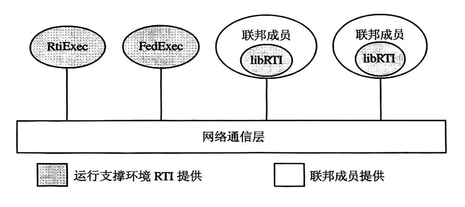
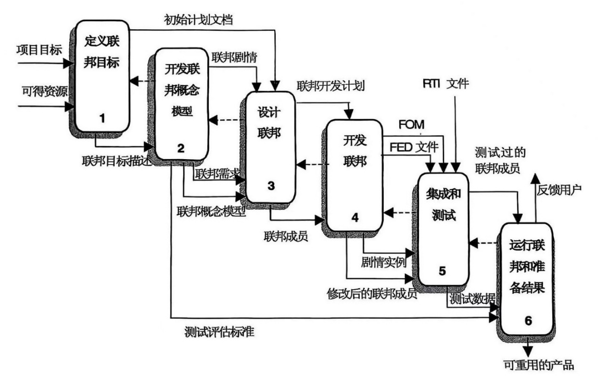

# 实战：基于HLA的仿真开发

【摘要】较深入介绍HLA标准规范，理解HLA联邦对象模型FOM和联邦成员的仿真对象模型SOM，介绍对象模型模板OMT和运行支撑环境RTI，理解联邦执行的生命周期，这些是开展HLA仿真程序设计的基础。

【关键词】 高层体系结构，HLA，对象模型模板，RTI，联邦

【参考书目】

邱晓刚，陈彬 等著，基于HLA的分布仿真环境设计，国防工业出版社，2016.2

▲周彦，戴剑伟主编，HLA仿真程序设计，电子工业出版社，2002.6

------------------------------------------------------------------------

## 高层体系结构

与传统的单个系统仿真相比，分布式仿真的关键问题是多个仿真系统间的互操作问题，为此，美国国防部提出了建模与仿真的高层体系结构（High
Level
Architecture，HLA），核心思想是互操作和重用，其显著特点是通过运行支撑环境
RTI，提供通用的、相对独立的支撑服务程序，将仿真应用同底层的支撑环境分开，即将具体的仿真功能实现、仿真运行管理和底层通信传输三者分离，隐蔽了各自的实现细节，从而使各部分可以相对独立地进行开发。相对于早期的DIS标准，HLA
解决了仿真系统的灵活性和可扩充性问题，减少了网络冗余数据，并且可以将真实仿真、虚拟仿真和构造仿真（LVC）集成到一个综合的仿真环境中，满足复杂大系统的仿真需要。目前，HLA
已正式成为IEEE 建模与仿真标准（IEEE 1516.X系列）。

### HLA的组成

美国国防部的国防建模与仿真办公室 DMSO
在1995年10月发布的建模与仿真主计划MSMP中，提出为国防领域的建模与仿真制定一个通用的技术框架，HLA是该技术框架的核心。1996年8月，DMSO正式公布了HLA规范，HLA主要由三部分组成：

（1）规则（Rules）；

（2）对象模型模板 OMT（Object Model Template）；

（3）RTI接口规范。

2000年9月，由IEEE 计算机协会仿真互操作标准委员会发起的基于DMSO HLA
v1.3版本进行讨论修改的 IEEE
建模与仿真（M&S）高层体系结构（HLA）标准系列IEEE Std.
1516、1516.1、1516.2/D5成为正式的IEEE标准。2003年，IEEE将联邦开发与执行过程FEDEP接纳为IEEE
1516.3-2003。2007年，批准了IEEE 1516.4-2007。

HLA
规则定义了在联邦设计阶段必须遵循的基本准则。HLA对象模型模板定义了一套描述HLA
对象模型的部件。HLA
的关键组成部分是接口规范，它定义了在仿真系统运行过程中，支持联邦成员之间互操作的标准服务。这些服务可分为六类，即联邦管理服务、声明管理服务、对象管理服务、时间管理服务、所有权管理服务和数据分发管理服务。这六类服务实际上反映了为有效解决联邦成员间的互操作所必须实现的功能。

### HLA的基本思想

联邦（Federation）是用于达到某一特定仿真目的的分布式仿真系统，它由若干个相互作用的联邦成员（Federate，或简称成员）构成。仿真应用使用实体的模型来产生联邦中某一实体的动态行为。成员由若干互相作用的对象构成，对象是联邦的基本元素。这组对象被选择来构成成员是为了完成联邦运行的某一功能，如记录数据，仿真某个实体（飞机、舰船）的动态行为等。实际上，成员是一类粒度比对象更大的可重用单元。成员的构成应满足面向对象技术中对类和对象的一般要求，而HLA的规则以及
OMT 规范是根据仿真的特点，在此一般要求的基础上对成员的进一步约束。

HLA是分布交互仿真的高层体系结构，它不考虑如何由对象构建成员，而是在假设已有成员的情况下考虑如何构建联邦。比如对于仿真系统的分析、对象的划分和确定、仿真应用系统（即"联邦成员"）的构建等底层工作，正是面向对象分析与设计方法要解决的问题。HLA
主要考虑在联邦成员的基础上如何进行联邦集成，即如何设计联邦成员间的交互以达到仿真的目的。HLA的基本思想就是采用面向对象的方法来设计、开发和实现仿真系统的对象模型，以获得仿真联邦的高层次的互操作和重用。

在HLA
中，"互操作"定义为一个成员能向其他成员提供服务和接受其他成员的服务。由成员构建联邦的关键是要求各成员之间可以互操作，HLA和任务空间概念模型（CMMS）、数据标准一起构成了联邦成员之间互操作的充分条件。

虽然 HLA
本身并不能完全实现互操作，但它定义了实现联邦成员互操作的体系结构和机制。除了方便成员之间的互操作外，HLA
还向联邦成员提供灵活的仿真框架。

各联邦成员和运行支撑环境
RTI（也叫运行时间基础设施）一起构成一个开放的分布式仿真系统，整个系统具有可扩展性。其中，联邦成员可以是真实仿真系统、虚拟或构造仿真系统以及一些辅助性的仿真应用，如联邦运行管理控制器、数据采集器等。

RTI 即是按照HLA的接口规范开发的服务程序，它实现了HLA
接口规范中所有的服务功能，并能按HLA
接口规范提供一系列支持联邦成员互操作的服务函数。它是HLA
仿真系统进行分层管理控制、实现分布式仿真可扩展性的支撑基础，也是进行HLA其他关键技术研究的立足点。对采用HLA
体系结构的仿真系统，联邦的运行和仿真成员之间的交互都是通过RTI来实现的，RTI
的实现及其运行性能的好坏，是分布交互仿真系统实现的关键。在仿真系统运行过程中，RTI犹如软总线，满足规范要求的各仿真软件及其管理实体，都可以像插件一样插入到软总线上，从而有效地支持仿真系统的互联和互操作，并能支持联邦成员级的重用。

### HLA 规则

HLA规则共十条，前五条规定了一个联邦必须满足的要求，后五条规定了联邦成员必须满足的要求。

HLA的框架与规则集是一个纲领性的定义文件，定义了HLA
采用的各种术语和系统的组成，还定义了描述HLA联邦以及联邦成员责任的规则集。其中定义的规则共有10条，各有5条分别适用于联邦及联邦成员。在从
DoD V1.3 HLA规则规范到 IEEE
1516标准的进化中，10条规则无变化地保留下来。虽然存在个别的异议，但大多数人认为这些规则本身是合理的、有效的，并且是必需的。

**规则1**：联邦应该有一个联邦对象模型 FOM，该FOM 应与HLA的OMT相容。

FOM记载运行时成员间交换数据的协议及数据交换的条件，它是定义一个联邦的基本元素。HLA不限定FOM
中数据的类型，将此留给联邦的用户与开发者决定。为了支持新的用户能重用一个联邦（FOM），HLA要求以确定的形式描述FOM。

信息交换协议的规范化是HLA的一个重要方面。HLA独立于应用领域，能用来支持具有广泛用途的各种联邦，FOM是一种用来规范HLA应用中数据交换的方法。通过规范化协议与需求确定的过程及将结果用形式化方式描述，FOM
提供了理解联邦的主要元素，以部分或整体重用的手段支持联邦。此外，FOM
提供了在联邦运行时初始化RTI的数据。

**规则2**：在一个联邦中，FOM中的所有对象应属于各个成员，而不应在RTI中。

HLA的一个基本思想是，将特定仿真中的功能与通用的支撑服务相分离。在HLA中被仿真的对象归属于仿真应用（更一般的是成员），而RTI提供类似于分布操作系统的功能来支持联邦中对象的交互。

RTI 服务应能支持
DoD中的各种联邦，是能最广泛被重用的基本服务集，包括最基本的协调与管理服务，如联邦运行时间协调与数据分发等。因为它们应用广泛，因此以标准服务的形式统一提供比由用户自己定义效率更高。同时，这使得成员能集中处理应用领域的问题，减少仿真应用开发人员投入的时间及资源。RTI可以使用对象的属性与交互数据来支持
RTI 服务，但不能改变这些数据。

**规则3**：在执行联邦时，各成员中所有 FOM规定的数据交换必须通过 RTI
进行。

HLA的RTI提供一组接口来按联邦FOM的规定支持对象属性值的交换，以及支持对象间的交互作用。在HLA
中，对象间的交互作用是由数据交换来完成的。联邦各成员根据FOM中的数据格式定义，将属性与交互的数据提供给RTI，而RTI提供成员间的协调、同步及数据交互的功能。在成员能负责在正确时间提供正确数据的情况下，RTI
保证数据按声明的要求传递给需要数据的成员。

为保证联邦中的所有成员在整个联邦运行期间保持协调，它们之间的交互必须使用RTI
服务。如果一个联邦在RTI 外交换数据，则联邦的一致性将被破坏。公共的
RTI服务保证了在仿真应用间数据交换的一致性，减少开发新联邦的费用。

**规则4**：在一个联邦执行中，成员与 RTI 的交互必须遵循 RTI 接口规范。

HLA
提供了访问RTI服务的标准接口，成员应使用这些标准接口与RTI交互。接口规范定义了成员应怎样与RTI交互。由于接口及RTI应能用于具有多种数据交换方式的各类应用中，所以没有对通过接口交换的数据作任何规定。标准化的接口使得开发仿真应用时不需要考虑
RTI的实现。

**规则5**：在一个联邦执行中，实例的属性在任一时刻只能为一个成员所拥有。

HLA允许同一个对象的不同属性分属于不同的成员。为保证联邦中数据的一致性，给出了以上规则。HLA
提供了将属性动态地从一个成员转移到另一个成员的机制。

**规则6**：成员必须要有一个HLA成员对象模型（Simulation Object Model,
SOM），SOM必须符合 HLA 对象模型模板。

SOM描述了成员能在联邦中公布的对象、属性和交互，但不描述数据，数据描述是成员开发者的责任。HLA
对重用与互操作的支持主要在成员这一级，SOM
是实现这种支持的主要手段之一。SOM充分描述了成员能向外提供的基本能力，这样可以识别该成员在一个新联邦中潜在的应用。应注意
SOM并没记录成员的全部信息，用户也不需要成员的全部信息来确定软件的重用。

**规则7**：成员必须能按SOM的规定更新和（或）反射属性，以及发送和接收对象交互。

这一规则保证成员内部的能力（如属性更新、交互处理）能为参与联邦的其他成员所使用，此种使用通过属性交换与交互发送来实现。

**规则8**：成员必须能按
SOM的规定，在一个联邦执行中动态地转移和（或）接受属性的所有权。

HLA
允许不同的成员拥有同一对象的不同属性，因此，为一个目的设计的仿真应用可以与为另一目的设计的仿真应用耦合，从而满足新的要求。通过赋予仿真应用转移和接收对象属性所有权的能力，使一个仿真应用能在未来联邦中广泛应用。

**规则9**：成员必须能按 SOM 的规定改变属性公布的条件。

HLA
允许成员拥有对象的属性，然后通过RTI使这些值能为其他成员所使用。不同的成员（仿真应用）在其SOM中可指定不同的属性更新的条件。仿真应用在加入联邦运行时，应有调整此条件的能力，从而使得仿真应用可广泛使用。

**规则10**：成员必须能以某种方式管理其局部时间，从而可以与联邦的其他成员交换数据。

HLA
的时间管理支持使用不同内部时间管理机制的成员之间的互操作。为了达到这一目标，HLA提供了统一时间管理结构来保证不同成员之间时间管理的互操作性。不同类型的仿真应用视为此统一结构的一个特例，一般只使用
RTI
时间管理能力的一个子集。成员在加入联邦运行期间，不需要明确告诉RTI其内部所用的时间推进机制（时间步长、事件推进或独立时间推进）。

## 对象模型模板 OMT

### OMT的概念

OMT是一种标准化的描述框架，提供一个可公共理解的机制来描述成员之间数据的交换。

HLA的主要目的是促进仿真系统间的互操作，提高仿真系统及其部件的重用能力。OMT是达成这一目的的主要机制之一。HLA要求采用对象模型（Object
Model）来描述联邦及联邦中的每一个联邦成员。对象模型分为两类：一类是联邦对象模型
FOM，它描述了在联邦执行过程中交换的各种数据及相关信息；另一类是成员对象模型
SOM，用于说明成员（仿真应用）在参与联邦时能提供的能力。

一般对象模型可以用各种形式来描述，但HLA规定必须用一种统一的表格------对象模型模板（Object
Model
Template，OMT）来规范对象模型的描述，OMT记录联邦或成员的一些关键信息，如对象、交互、属性等。

注意，虽然
HLA对象模型模板（OMT）是HLA对象模型的标准文件结构，但是联邦对象模型FOM
与成员对象模型
SOM并不完全符合面向对象分析与设计（OOAD）技术中对象模型的一般定义。在面向对象分析与设计的文献中，对象模型是为充分理解系统而进行的系统抽象。为了理解系统，大多数的面向对象技术倾向于来用多种方式描述系统。对于HLA对象模型，它对系统描述的范围是非常狭窄的，主要集中在成员信息交换的需求与能力上。对于
SOM
来说，目的主要是根据成员可支持的HLA对象类和交互类的确定的集合，来描述成员的公共接口。成员如何设计和成员的内部功能的更完善的描述（例如，一个传统的面向对象模型）应当通过文档资源，而不是SOM
来提供。对于FOM来说，目的是描述在联邦执行时所发生的信息交换。

HLA 和OOAD
在概念和原则上的差别也同样体现在对象上。在OOAD中，对象被定义为数据和方法的封装体；而在
HLA
中，对象由标识其特征的属性完全定义，在联邦执行过程中，通过这些属性值在联邦成员之间的传递可以实现信息的交换，联邦成员内部的数据操作方法负责对属性值进行更新和维护。OOAD
的对象可以是具体的也可以是抽象的，但在HLA
中，对象通常代表真实世界中的一个实体。比如：坦克、飞机、舰艇等。

继承的概念在HLA 和OOAD
中是一致的，但它们在确定类与子类关系时所关注的内容有差别。OOAD
的对象通过"消息"传递进行交互，在交互过程中，一个对象可以激活另一个对象的方法。而在HLA中，对象间的信息交换是通过属性值的更新或彼此间发送交互实例来实现的，属性值更新的职责可以由联邦中所有的联邦成员来承担。但在OOAD中，对象的状态以及更新对象状态的操作（方法），都通过对象的类封装在一起。

### OMT的组成

HLA 对象模型（FOM 和 SOM）由一组相关的部件组成，HLA
要求将这些部件以表格的形式规范化。1998年4月20日，美国国防部公布了HLA
1.3版本的OMT，它是HLA OMT 的正式定义，对应于IEEE Std
1516.2/D1。1.3版本的OMT由以下九个表格组成，每个表格描述了联邦与联邦成员的一个方面。

IEEE Std 1516.2版本的OMT有扩展改动，共14个表格。（分别以v1.3和1516标记）

- 对象模型鉴别表，记录鉴别HLA对象模型相关的重要标识信息；

- 对象类结构表：记录成员或联邦的所有对象类名称，并描述它们的类一子类关系；

- 交互类结构表，记录成员或联邦的所有交互类名称，并描述它们的类一子类关系；

- 属性表，详细说明成员或联邦中对象属性的特性；

- 参数表，详细说明成员或联邦中交互参数的特性；

- 枚举数据类型表（v1.3），用来对出现在属性表/参数表中的枚举数据类型进行说明；

- 复杂数据类型表（v1.3），用来对出现在属性表/参数表中的复杂数据类型进行说明；

- 路径空间表（v1.3），用来指定联邦中对象类属性和交互类的路径空间；

- 维表（1516），说明用来过滤实例属性和交互的维；

- 时间表示表（1516），说明时间值的表示；

- 用户定义的标签表（1516），说明用在HLA服务中的标签的表示方法；

- 同步表（1516），说明HLA同步服务中的表示和数据类型；

- 传输类型表（1516），描述所用的传输机制；

- 开关表（1516），描述 RTI所用参数的初始设置；

- 数据类型表（1516），说明对象模型中数据表示的细节；

- 注释表（1516），用于扩展 OMT表格项目的解释；

- FOM/SOM 词典，用于定义HLA对象模型中所有的对象、属性、交互和参数。

当要求详细描述HLA联邦或单个成员的对象模型时，所有的OMT表格都应当使用。但在某些情况下，描述对象模型的一些表可以是空的。例如，虽然联邦支持成员间的信息交换，但各成员之间并不发送"交互实例"，这样，该联邦对象模型（FOM）的交互类结构表将为空表，相应的参数表也是空的。通常，成员被期望拥有联邦感兴趣的、带有属性的对象，在此情况下，这些对象和属性应当在SOM中描述。然而，如果某个联邦成员或整个联邦仅通过"交互实例"来交换信息，那么它的对象类结构表和属性表都将为空。

最后一个HLA OMT表格，FOM/SOM
词典，对于确保HLA对象模型中术语的语义被正确理解和记录是十分重要的。

从HLA OMT V1.3演化到IEEE
1516.2标准最显著的变化是"数据类型"的表示部分，新标准的OMT对任意类型的数据定义都可以提供支持。另外，IEEE
1516.2标准的数据交互格式采用了XML标准。

### 对象模型鉴别表

对象鉴别表记录关于对象模型的描述信息，包括对象模型开发者的相关信息。设计HLA对象模型的关键目的在于可重用性，例如，利用已有的SOM部件可以快速构造一个新的FOM，在已有FOM的基础上可以快速开发新的FOM。HLA对象模型提供最少但足够的模型信息，这些信息有助于联邦开发者了解已有的SOM或FOM的构造细节。

### 对象类结构表

在HLA 中，对象类（Object
Class）实际上是对具有公共特性或属性的一组对象的抽象。对象类的每一个对象叫做该对象类的实例。HLA对象模型的对象类结构是指联邦或成员范围内各对象类之间关系的集合，这种关系主要是指对象类之间的继承关系，对象类结构表描述对象之间的这种继承关系。类与子类的直接关系可采用在对象类结构表相邻列中包含相关类名的方法来表示，类与子类的非直接关系可通过继承的传递性从直接关系中得到。例如，如果A是B的超类，并且B是C的超类，则A是C的超类。超类和子类是互逆的关系，如果A是B的超类，则B是A的子类。子类可以看作其直接超类的具体化（或细化），它继承了其超类的属性，并且可以根据具体化的要求增加一些额外的属性。

在HLA中，对象类之间的关系也可以用它们的实例来表示，只有当对象类B的每个实例同时也是对象类A的实例时，我们才可以说对象类A是对象类B的超类。在这概念下，我们很容易区分一个对象类的实例和它的导出实例（Derived
Instance），一旦一个对象被声明为某一对象类的实例，那么它同时也将成为该对象类的所有超类的导出（或隐含）实例。例如，如果
M1坦克是坦克的子类，那么一旦一个对象声明为M1坦克的实例，它将同时也成为坦克类的导出实例。当然，有些对象类（如上例中的坦克类）设计主要目的是为了实现对其他对象类的组织和管理，它们并没有自己的实例，但这些"抽象"类仍然可以拥有自己的导出实例。

在对象类结构表中，没有超类的类成为根类，而没有子类的类成为叶子类。HLA
要求对象类之间只能有单继承关系，不能存在多继承关系。对象类也可以没有子类。

对象类结构表的格式。在OMT
的对象类结构表中，根类记在表的最左边一列，由此向右，顺序记录其子类直至叶子类。表的列数等于对象类结构的层次数，如果一张表记不下，则最后一列用\<ref\>转向附加的表格。

对象类结构表及后面的交互类结构表中对涉及到类的各项描述均采用 BNF
规则，即：

\[\<class\> (\<PS\>) \] \[, \<class\> (\<PS\>)\]\* \| \[\<ref\>\]

其中方括号中的内容可选，尖括号中表示应该填写的内容，圆括号中的内容必须有，星号表示零次或多次重复，而竖杠表示可根据需要在其连接的两边任选一项。

对象类名需用 ASCII码字符集定义。在HLA
对象模型中，尽管单个对象类名不必员全局惟一的，但它和它的超类连接在一起（通过点符号）所组成的标识必须是全局惟一的。一个类名可以作为另一个类名的一部分，以利于表明两个类的关系。

在SOM（或FOM）的对象类结构表中，每一个对象类必须说明其\<P\>（Publishable，可发布）和\<S\>（Subscribable，可订购）的特性。一个对象类能被一个联邦成员发布是指该联邦成员有能力模拟该类对象的行为。一个对象类能被一个联邦成员订购是指该联邦成员具有利用该类对象信息的内在能力。对每一个对象类的对象，可能具有的\<PS\>特性有以下三种：P/S/N。N表明该类的对象既不能被联邦成品发布也不能被成员订购。标识为N的对象类一般是用来表示几个具有共同特性的抽象类。抽象类不能被实例化，通常是不可发布的。

对象类结构的设计原则。在HLA
对象模型中，所有出现在对象模型其他表格中的对象类都必须包含在对象类结构表中。对FOM
和SOM
而言，其对象类层次结构的设计标准有着根本的区别，一个FOM的对象类结构是一个联邦中关于对象类划分的协议，它反映了联邦的各成员之间为了实现联邦执行目标而确定的对象类及其层次结构；而SOM的对象类结构表是一个联邦成员对所能支持的对象类的公告，即告知联邦开发者该联邦成员能发布什么和能订购什么。对于FOM和SOM的对象类结构表，HLA并不要求某个特定的对象类或对象类结构必须记入其中。判断一个对象类是否要记入FOM
的原则是，看该对象类有无对象参与联邦的执行，即有无该对象的属性需要在联邦执行时发布。对联邦成员而言，其最基本的功能是参与联邦的执行，它的对象类结构应该根据该成员如何支持联邦范围内对对象类的发布和订购来确定。

### 交互类结构表

在
HLA中，交互是指一个成员中的某个或某些对象产生的，能够对其他成员中的对象产生影响的明确的动作。如同对象类结构表描述了对象类的层次关系一样，HLA对象模型用交互类结构表来描述交互实例的类与子类关系。在交互类结构表中，交互类的层次结构由不同交互类的一般化或具体化关系（即"继承"关系）组成，比如，一个"交战"交互类可以具体化为"空对地"交战、"舰对空"交战等交互类，而"交战"交互类则是这些具体交互类的一般化。在一个联邦或联邦成员中，如果没有一般化（即抽象）的交互类，那么其交互类结构是平的，它仅仅由一些相互之间没有继承关系的交互类组成。

在HLA
对象模型中，交互类的层次结构主要是用来支持对有继承关系的交互类的订购，当一个联邦成员订购了某个交互类，那么在联邦执行过程中，它将接收到所有属于该交互类及其子类的交互实例。

交互参数可以用来记录反映交互实例特点的各种信息，例如交互参数可以记录对象类的名称、对象属性、字符串和数值常量等，接收到交互实例的对象将根据这些交互参数来确定该交互实例对它的影响。在联邦执行的过程中，无论联邦成员在什么时候激活"Send
Interaction"服务，所有可以使用的交互参数的值都将带有该交互类的名称。交互参数的标识符以及相关的一些细节（如参数的分辨率、精度等）记录在HLA对象模型的参数表中。如同对象类的属性可以向下继承一样，交互类的参数也可以通过交互类的层次结构向下继承，其继承的机制和原则与对象类属性的继承机制和原则是一致的。

交互实例是仿真系统互操作的重要因素，因此接收到交互实例的不同联邦成员应该以一致的方式来处理交互实例，这样才能确保不同仿真系统间的互操作能力。另外，在系统仿真的过程中，为了支持对交互类的订购，RTI必须知道联邦中所有的交互类型，所以在联邦执行中可能出现的所有交互类都必须记录在
HLA 对象模型中。

交互类结构表的格式。交互类的层次关系用交互类结构表来记录，交互类结构表最左边的一列记录交互类的根类。和对象类结构表一样，在随后的各列中记录交互类的层次结构，一直到叶子类才能终止。

就像对象类结构表中的每一个类都必须标明其\<PS\>特性一样，交互类结构表中的每个类也必须标明其\<ISR\>特性。对于特定的交互类，成员对其可能有三种能力：

I ---初始化（Initiates）：指联邦成员能初始化和发出该类交互实例。

S---感知（Senses）：指联邦成员能订购该交互类和利用交互实例的信息（例如仅仅记录信息），但不要求能对受交互实例影响的对象进行操作。

R---响应（Reacts）：指联邦成员不仅能订购该交互类，而且还能通过适当操作受该类交互实例影响的对象来响应交互。

N---表明成员当前对该交互类，既不能初始化也不能感知和响应。

联邦成员初始化一个交互类表示它不仅能发布该类交互，而且还能建立该类交互的初始化模型，并在初始化后有能力发送该类交互。一个联邦成员能感知一类交互，指的是它在订购该交互类后，能够利用该类交互提供的信息。感知能力强调在接受交互实例的基础上，能使用交互实例的信息，接受交互实例仅仅是所有HLA
联邦成员的最基本的能力。

在一个联邦中，每个交互类至少应有一个成员能够初始化并发送它，并且至少应有一个成员能够感知或响应它，所以
FOM 中交互类的\<IRS\>项对应于集合｛IS, IR, N｝，而SOM 则对应于集合{I, S,
R, IS, IRS, N}。

HLA OMT其他表格不再赘述。

### 管理对象模型

管理对象模型（MOM）是HLA为联邦管理定义的数据模型，其作用是收集汇总各成员、整个联邦和RTI的运行信息。成员能够使用MOM的信息来观测联邦运行的情况，并控制RTI、联邦执行和单个成员，因此MOM可用于构建管理HLA利那边执行的通用工具。

HLA MOM详细说明了一组与联邦执行有关的信息。在IEEE Std
1516.1-2000标准中说明的MOM信息的实现，提供了一种利用现有的HLA服务管理联邦执行的机制。所有的FOM
都要求包含MOM。此外，具有与MOM 交互能力的成员或能扩展
MOM的成员应当在它们的SOM 中包含 MOM。包含MOM 就意味着包含了 IEEE Std
1516.1-2000 标准中的所有表格，以及所有可用的MOM扩充。

## 联邦运行支撑环境RTI

### 概述

联邦运行支撑环境（Run-time
Infrastructure，也称运行时间基础设施）是HLA接口规范的具体实现，它是基于HLA仿真的核心部件，也是HLA仿真应用程序设计和运行的基础，其功能类似于分布式操作系统。目前有多种版本的RTI。

RTI提供了HLA接口规范所规定服务来处理联邦运行时成员间的互操作和管理联邦的运行，包括六类管理服务：

- 联邦管理服务：提供创建、删除、加入、退出联邦运行等服务。

- 声明管理服务：使成员可订购它所需要的属性值和发布它能提供给其他成员使用的属性的值。

- 对象管理服务：提供成员在联邦运行时创建和删除对象以及属性值的传送等服务。

- 所有权管理服务：提供属性所有权在成员间迁移和接受的服务。一个成员拥有某一个属性的所有权是指该成员在联邦运行时，负责更新和提供该属性的值。

- 时间管理服务：用于控制联邦仿真时间的协调推进。

- 数据分发管理服务：通过对数据空间的管理，提供数据分发的服务，使成员能有效地接受与发送数据。

RTI 是一个按照HLA
接口规范开发的软件系统，它能为仿真应用提供通用的、相对独立的支撑服务，其功能类似于分布式操作系统。其主要作用有：

（1）它具体实现了HLA
接口规范。为了实现联邦内部各个联邦成员之间进行高效的信息交换，HLA接口规范用文字定义了各种标准服务和接口，而RTI
则用程序设计语言将这些标准的服务和接口转换成了标准的RTI API
函数，使得基于HLA 的仿真开发成为可能。

（2）它为仿真应用提供了仿真运行管理功能，比如仿真过程的开始、暂停、恢复、时间同步、仿真时钟推进等。开发人员只需集中精力实现具体的仿真功能，仿真运行管理则由
RTI 来完成。

（3）它提供了底层通信传输服务，屏蔽了网络通信程序实现的复杂性，开发人员可以很容易地实现数据的发送和接收，从而降低了分布交互仿真程序设计的复杂程度。而且这种传输机制允许各个联邦成员进行不同级别的数据过滤，可以极大地减少网络数据流量，提高仿真系统的运行速度。

（4）它是仿真功能与仿真运行管理、底层通信传输三者分离的基础，它使仿真系统具有较好的扩充性，便于实现仿真系统中各个组成部分的即插即用，因此各个组成部分的编程实现可以相对独立地进行，很适合于团队开发。

不同组织开发实现了不同版本的RTI产品。例如美国MAK公司的MAK RTI
1.3.1，实现了DMSO RTI 1.4 v4、v5、v6的所有API函数；瑞典Pitch
AB公司的pRTI；国内国防科技大学的KD-RTI等。

在联邦执行过程中，各种控制类消息和数据类消息的传输依靠网络通信来说实现，因此RTI必须能支持多种传输方式和通信协议。网络通信按照寻址方式划分，可分为点对点通信、组播通信和广播通信三种方式。按传输质量和效率，通信服务包括可靠传输和尽力传输两种方式。可靠传输服务采用
TCP/IP
协议，提供可靠的、面向连接的传输股务；尽力传输服务采用UDP/IP协议，提供不可靠的、无连接消息传输服务方式。RTI取代DIS的广播通信方式，采用点对点，或组播方式，将信息从数据的发出者，直接传递给数据的订购者，从而提高系统的性能。

RTI运行时，需要两个配置文件，一个是联邦执行数据文件（FED
文件），另一个是 RTI 初始化文件（RID文件）。

FED
文件包含了来源于FOM中的信息，包括联邦中各个联邦成员的对象类、交互类、对象类属性、交互类参数和路径空间等数据结构信息。在使用"Create
Federation Execution"服务时，需要指定 FED 文件所在的路径和文件名。

RTI 初始化文件包含了控制
RTI运行的配置参数，因此可通过配置RID文件，使RTI满足特定的仿真应用。RTI
使用环境变量 RTI_RID_FILE 来确定 RID 初始化文件所在的径和文件名称。

### RTI的组成

RTI 1.3-NG于1999年9月推出，实现了HLA
接口规范1.3版的所有服务。它吸收了以前各种版本的经验，并确保在程序编译时与
RTI 1.3v6版本兼容。

RTI 1.3-NG 主要由RTI 全局执行进程 RtiExec、联邦执行进程
FedExec、LibRTI库组成，其结构如图所示。

<figure>
  
  <figcaption>图 14‑1 运行支撑环境RTI 组成</figcaption>
</figure>

RtiExec
是一个全局进程。主要功能是管理联邦的创建、结束以及管理多个不同的联邦。每个联邦成员通过与
RtiExec的通信进行初始化，加入到相应的联邦中，并确保每一个FedExec
进程拥有惟一的联邦名称。RtiExec
实际是一个运行程序，在运行联邦执行之前，首先必须运行它。

FedExec
管理联邦成员的加入和退出。为联邦成员之间进行数据通信和协调运行提供支持。FedExec
进程由第一个成功调用"Create Federation
Execution"服务的联邦成员创建，每一个加入联邦的联邦成员将被分配一个惟一的句柄。FedExec
也是一个运行程序。在第一个联邦成员成功加入联邦后，自动启动。

LibRTI 是一个接口函数库，它为开发者提供HLA
接口规范中所描述的服务，该库包括两个主要类：RTIambassador（RTI 大使）和
FederateAmbassdor（联邦成员大使）。RTIambassador类捆绑并实现了由 RTI
提供的所有服务；FederateAmbassdor
是一个抽象类，它定义了HLA接口规范中所有的回调函数，联邦成员通过这些回调函数从RTI
中接收数据（包括其他成员传来的数据和 RTI自身的状态数据）。

另外，RTI 1.3-NG 还包括两个执行文件 Launch 和 RtiConsole。

RTI 1.3-NG v4实现了HLA
1.3规定的六类管理服务及其支持服务在内的共计143个接口服务。

### 联邦执行数据文件

联邦执行数据文件（FED）是联邦对象模型（FOM）开发的结果，是所有联邦成员间为交互（或互操作）目的而达成的"协议"。它记录了联邦运行期间所有参与联邦交互的对象类、交互类及其属性、参数和相关的路径空间信息。另外，FED文件还HLA预定义的管理对象模型（MOM）和其他一些联邦执行细节数据。在仿真运行期间，RTI将根据FED文件提供的联邦执行的细节数据创建相应的联邦执行，并在整个联邦执行生命周期内以FED文件为蓝本，协同联邦成员间的交互。

通常情况下，FED文件可以利用工具软件进行创建、编辑和修改，比如DMSO的OMDT、加拿大VPI公司的SEQUOIA
Integrator等，国内有国防科技大学也开发了工具软件KD-OMDT。

FED文件的结构。FED文件以"Fed"开始，根据功能和作用，FED文件一般分为五节，每一节用一对圆括号"（）"作为起止标记。这五节分别为：Fedversion、Federation、Objects、Spaces、Interactions。

其中，Federation 节定义了联邦的名称；Fedversion 节定义了RTI
的版本号；spaces 节定义了给定的联邦将使用的所有路经空间；Objects
节定义了联邦中所有对象和管理对象模型中的对象类的申明；Interactions
节定义了联邦中所有的交互类以及管理对象模型中的交互类的申明。另外，FED
文件语法还规定，在一行中，所有在双分号"；；"右边的内容是注释，RTI
中的解释器将忽略注释。FED文件的一般形式为：

+----------------------------------------------------------------------+
| (FED ;;FED 文件开始                                                  |
|                                                                      |
| (Federation \<FEDName\>) ;;Federation 节                             |
|                                                                      |
| (Fedversion \<FEDDIFVersionNumber\>) ;;Fedversion 节                 |
|                                                                      |
| (spaces ;;spaces 节定义开始                                          |
|                                                                      |
| (space \<name\>                                                      |
|                                                                      |
| (dimension \<name\>)                                                 |
|                                                                      |
| (dimension \<name\>)                                                 |
|                                                                      |
| ) ;;Spaces 节定义结束                                                |
|                                                                      |
| (objects ;;object 节定义开始                                         |
|                                                                      |
| (class objectRoot                                                    |
|                                                                      |
| (attribute ‹name\> \<transportation\> \<ordering\> \[‹space\>\])     |
|                                                                      |
| (attribute ‹name\> \<transportation\> \<ordering\> \[‹space\>\])     |
|                                                                      |
| (class RTIprivate)                                                   |
|                                                                      |
| (class \<name\>                                                      |
|                                                                      |
| (attribute \<name\> \<transportation\> \<ordering\> \[\<space\>\])   |
|                                                                      |
| (attribute \<name\> \<transportation\> \<ordering\> \[\<space\>\]    |
|                                                                      |
| )                                                                    |
|                                                                      |
| ) ;;spaces 节定义结束                                                |
|                                                                      |
| (interactions ;;interactions 节定义开始                              |
|                                                                      |
| (class interactionRoot \<transportation\> \<ordering\> \[\<space\>\] |
|                                                                      |
| (parameter \<name\>)                                                 |
|                                                                      |
| (parameter \<name\>)                                                 |
|                                                                      |
| (class RTIprivate \<transportation\> \<ordering\> \[\<space\>\])     |
|                                                                      |
| (class \<name\> \<transportation\> \<ordering\> \[\<space\>\]        |
|                                                                      |
| (parameter \<name\>)                                                 |
|                                                                      |
| (parameter \<name\>)                                                 |
|                                                                      |
| )                                                                    |
|                                                                      |
| ) ;;interactions 节定义结束                                          |
|                                                                      |
| ) ;;FED 文件结束                                                     |
+======================================================================+
|                                                                      |
+----------------------------------------------------------------------+

FED文件的语法详见开发手册。

### RTI初始化文件

RTI初始化文件（RID）用来设置RTI运行的初始化参数。在RID文件中，描述了每一个参数的用途、参数的有效范围和默认值。

RID文件的格式。有两条规则，一是圆括号"（）"用来表示参数的起止范围，而且每一个参数及参数值必须用成对的括号括起来；二是在一行中，双分号"；；"后面的内容表示注释。每一节包括节的名称和内容相关的参数名称、参数值。参数名称在整个RID文件中是惟一的，若出现重名的情况，只有最后的参数值才起作用。参数名称对大小写敏感。

RID文件中的节按照RTI内部组件的粒度分成三类，它们是：ProcessSection，设置RTI进程启动时的有关参数；FederationSection，设置联邦有关参数；FecerateSection，设置联邦成员有关参数。

因此，RID文件的一般格式为：

+----------------------------------------------------------------------+
| (RTI                                                                 |
|                                                                      |
| (ProcessSection                                                      |
|                                                                      |
| (RtiExecutive                                                        |
|                                                                      |
| )                                                                    |
|                                                                      |
| (Networking                                                          |
|                                                                      |
| (FedrateEndpoint www.mydomain.com:5555)                              |
|                                                                      |
| (MulticastOptions                                                    |
|                                                                      |
| (Interface "eth0")                                                   |
|                                                                      |
| (Fragmentation                                                       |
|                                                                      |
| (FragmentSize 62000)                                                 |
|                                                                      |
| (ReassemblyTimerIntervalInSeconds 1.0)                               |
|                                                                      |
| )                                                                    |
|                                                                      |
| )                                                                    |
|                                                                      |
| )                                                                    |
|                                                                      |
| ......                                                               |
|                                                                      |
| )                                                                    |
|                                                                      |
| (FederationSection                                                   |
|                                                                      |
| (FederationExecutive                                                 |
|                                                                      |
| )                                                                    |
|                                                                      |
| (FederationInterconnect                                              |
|                                                                      |
| )                                                                    |
|                                                                      |
| (Networking                                                          |
|                                                                      |
| )                                                                    |
|                                                                      |
| (TimeManagement                                                      |
|                                                                      |
| )                                                                    |
|                                                                      |
| ......                                                               |
|                                                                      |
| (FedrateSection                                                      |
|                                                                      |
| (EventRetractionHandleCacheOptions                                   |
|                                                                      |
| )                                                                    |
|                                                                      |
| ) ;;FederateSection结束                                              |
|                                                                      |
| )                                                                    |
|                                                                      |
| ) ;;RID文件结束                                                      |
+======================================================================+
|                                                                      |
+----------------------------------------------------------------------+

取某个参数的值，可以表示为：

ProcessSection.Networking.MulticastOptions.Interface="eth0"

ProcessSection.Networking.MulticastOptions.Fragmentation.FragmentSize=62000

## 联邦开发和执行过程FEDEP

基于 HLA
的分布交互仿真系统的开发同其他软件系统一样，都包括需求分析、总体设计、详细设计、编程和测试、软件维护等主要阶段。因此为了有效地促进基于HLA
的仿真系统的开发和使用，需要一整套包括系统分析、系统设计、软件编程、系统测试和系统维护在内的软件工程理论作为指导。为此，美国国防部建模与仿真办公室（DMSO）提出了开发分布交互仿真系统的软件工程方法，即联邦开发和执行过程模型（Federation
Development and Execute Process Model，FEDEP）。它是指导HLA
分布仿真系统设计开发的基本方法。

FBDEP
为联邦开发提供了一个一般的、通用性的步骤，即规定了联邦开发过程有必须的活动和过程，以及每一个活动和过程需要的前提条件和输出结果。从而有利于联邦开发的需求分析、设计、实现和测试，以便于联邦开发的管理和组织。

FEDEP 模型于1996年8月21日推出1.0版本，以后不断地进行讨论修改。FEDEP
v1.5将联邦的开发和执行过程抽象为六个基本步骤，即：

（1）定义联邦目标，即定义联邦开发所要达到的目标。

（2）开发联邦概念模型，即对所要仿真的真实世界进行抽象性的描述。

（3）设计联邦，这一过程确定联邦组成，并给各个联邦成员分配功能。

（4）开发联邦，这一阶段的目的是开发联邦对象模型（FOM）。

（5）集成和测试联邦，即检查和测试联邦对象模型是否达到了仿真的目标。

（6）运行联邦和分析结果。

<figure>
  
  <figcaption>图 14‑2 FEDEP 模型的顶层视图</figcaption>
</figure>

如图所示，FEDEP
模型为联邦的开发和执行描述了一个高层次框架，描述了每一步之间的关系，以及每一步所需的初始条件和输出结果。以上步骤是一个反复选代和修改的过程，而且根据不同应用的特点，表现出明显的不同性。

## HLA仿真程序设计基础

HLA仿真程序设计就是在联邦设计的基础上通过合理的使用RTI服务来达成仿真联邦的目的。基于HLA的仿真程序设计可以使用多种高级语言，例如C++、Java等，而且RTI也可以是不同公司的产品，如DMSO
RTI、pRTI、KD-RIT等。

要理解基于HLA的仿真程序设计，首先必须理解联邦执行的生命周期，还要掌握联邦执行的整个生命周期中联邦执行的各种状态，以及联邦成员、联邦执行、RTI这三者之间的关系。

联邦执行的生命周期分为三个阶段：创建联邦执行、联邦执行存在和撤销联邦执行。

（1）创建联邦执行：第一个阶段，实际上是RTI根据FED文件的内容和有关的联邦细节数据，为联邦成员间的交互而创建的一个虚拟世界。联邦执行的管理和维护由RTI来完成。正常情况下，联邦执行总是由第一个提出"创建联邦执行"请求的联邦成员创建。RTI将根据系统配置在指定路径搜索RTI初始化文件，即RID文件，使用该文件中的配置参数初始化RTI。请求创建联邦执行时，联邦成员需要将联邦执行数据文件名称（即FED文件）告知RTI。

（2）联邦执行存在：联邦执行创建之后即进入联邦执行存在阶段，可以进一步划分为三个阶段，即第一个成员加入、仿真逻辑执行和最后一个成员退出。

仿真逻辑执行阶段是联邦执行中最复杂、最重要的阶段，也是HLA仿真程序设计的核心。关键是掌握联邦成员之间以及联邦成员与RTI之间各种交互的过程、作用和交互的方法。交互内容涵盖RTI的六大服务功能。RTI负责管理所有成员间的交互。

（3）撤销联邦执行：当联邦成员退出联邦执行后它将激活RTI服务，请求撤销联邦执行。

## 案例开发演示【TBD】
