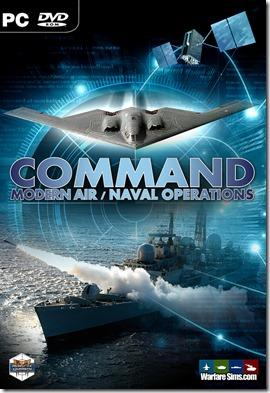

# 实战：Command 仿真推演

【摘要】

【关键词】

【参考书目】

## 概述

<figure>
  
  <figcaption></figcaption>
</figure>

[^1]: 谢旭，邱晓刚，段红，黄柯棣，作战仿真知识体系的初步探索\[J\]，系统仿真学报，第33卷第4期，2021年4月

[^2]: 龚建兴. 基于BOM 的可扩展仿真运行框架的关键技术研究与实现\[D\].
    长沙: 国防科技大学博士论文, 2007

[^3]: 雷永林,罗咐松,张庆,等. 装备作战仿真模型的分级建设框架研究\[J\].
    指挥控制与仿真, 2026, 48(4): 79-90.

[^4]: 李德林，张雨晨，王俊，刘乃豪.
    基于统一架构框架(UAF)的体系协同作战架构建模研究\[J\].
    指挥控制与仿真，2024，Vol. 46，Issue (4)：8-21.

[^5]: 石剑琛，董晓明，C_4I系统集成体系结构框架概述\[J\]，计算机与数字工程，2012，40（7）：44-47

[^6]: 董晓明, 韩研, 王质松, 王文恽. 基于MBSE
    的装备作战概念模型化设计\[J\]. 中国舰船研究, 2022, 17(5): 314--322.
